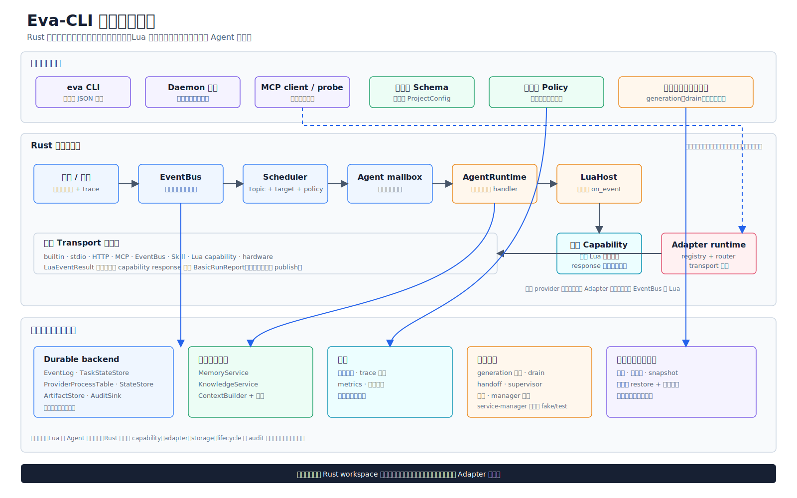

# Eva-CLI

> 语言：[English](README.md) | 简体中文

Eva-CLI 是一个基于 Rust 的 CLI runtime，用于受控多 Agent 工作流、发布加固、诊断、配置校验、请求级记忆/知识上下文组装、硬件绑定计划、备份/生命周期检查和源码发布运维。

Eva-CLI 当前处在 V1.11.5-alpha 开发线，并已完成 V1.17.6 V1.x closure release gate。仓库内已有可编译 workspace、配置样例、schema、基础契约 crate、项目配置加载、V1.0 in-memory basic runtime、V1.1 外部能力诊断、V1.2 记忆/知识上下文、V1.3 硬件发现/probe/plan-first 绑定、V1.4 backup/snapshot/restore/upgrade planning、V1.5 release check/security/perf/migration、V1.6 durable runtime/storage、V1.7 受限 Lua VM 与热更新生命周期、V1.8 外部 provider/MCP/Skill runner 受控真实执行、V1.9 policy/discovery/memory/observability 基线、V1.10 硬件与高风险 apply gate、V1.11 release evidence gate、V1.11.4 CLI 命令模块拆分、V1.11.5 emit/agent/capability 命令证据、V1.12 daemon 控制/恢复、V1.13 provider supervision gate、V1.14 destructive restore mutation/rollback 与 service-manager abstraction、host-bound Windows Service/systemd/launchd Adapter，以及绑定 identity 的 daemon direct service entrypoint 代码契约、V1.15 hardware permission/hotplug safety gate 与 memory/knowledge maintenance/retrieval/redaction、V1.16.4 observability retention/rotation policy、V1.17.1 run command module split、V1.17.2 operator execution-state 字段、V1.17.3 高风险 text summary、V1.17.4 public JSON contract diff gate、V1.17.5 同步后的 README/手册/发布说明/官网/i18n metadata，以及 V1.17.6 `release check` closure report、`REL-OBSERVABILITY-POLICY-001`、`REL-V1X-CLOSURE-001` 和生产签名/仓库/service-manager/硬件 fixture/database sink external blockers 记录。

当前受管理项目版本：`V1.11.5-alpha`（`Cargo.toml` 版本 `1.11.5-alpha`，预发布 Git tag 形式 `v1.11.5-alpha`）。版本规则见 [版本管理方案](docs/zh-CN/release/版本管理方案.md)。

Canonical 官网：

- https://www.eva-cli.com/
- https://www.eva-cli.com/zh-CN/

官网源码维护在 [website/](website/)，文档维护在 [docs/](docs/)，Rust 源码维护在 [src/](src/) 和 [crates/](crates/)。

## 当前进度

Eva-CLI 已经完成 V0.1 到 V1.17.6 可执行/可验证能力与 release closure 证据闭环：

1. Rust workspace 和 20 个 crate 边界已创建；
2. `eva-core`、`eva-config`、`eva-policy`、`eva-observability` 已具备基础契约；
3. `eva-runtime` 已实现 V1.0 `in_memory_v1.0` basic runtime 和本地 task 诊断；
4. `eva-cli` 已实现 `version`、`doctor`、`config validate`、`inspect`、`inspect durable`、`run --example basic`、`emit`、`daemon start/status/stop/shutdown/submit/cancel/drain/reload`、`service install/status/start/stop/restart/uninstall`、`agent status/drain/reload`、`capability list/probe/call`、`task status/logs/cancel`、`adapter`、`mcp`、`skill`、`discovery`、`memory context`、`hardware list/probe/bind`、`backup/snapshot/restore/upgrade` 和 `release check/security/perf/migration`；
5. `eva-hardware` 已实现 V1.3 discovery candidate、DeviceRegistry lease、simulated driver binding 和 hotplug state machine；
6. `eva-backup` 和 `eva-lifecycle` 已实现 filesystem artifact store、release snapshot create/promote、restore plan/apply/rollback、local release pointer upgrade apply、generation handoff、drain、rollback evidence、三平台 service Adapter、规范化 service argv identity 与 cooperative stop bridge；
7. `eva-release` 已实现 V1.17.6 release readiness、security review、performance baseline、migration guide、compatibility policy、durable recovery smoke gate、durable diagnostics smoke gate、Lua VM execution gate、Lua host bindings gate、Lua resource limits gate、Lua hot reload lifecycle gate、artifact/distribution/scanner/benchmark evidence gate、daemon/provider/hardware/observability readiness gate、public JSON contract diff gate 和 V1.x closure report；
8. `eva-storage`、`eva-eventbus` 与 `eva-runtime` 已实现 V1.6 durable backend manifest、migration lock、filesystem EventLog、DurableEventBus、queryable dead-letter store、redrive 基线、durable task snapshot adapter、durable audit sink、runtime recovery scanner、runtime recovered audit evidence、durable backend diagnostics report 和 artifact metadata hardening；
9. `eva-lua-host` 已实现 V1.7.1 `mlua` VM adapter、受限标准库、真实 `on_event` 执行、稳定错误映射、旧静态 parser compatibility fallback、V1.7.2 只读 request/trace/memory、host observability 和 `ctx.tools.call` capability binding、V1.7.3 wall-clock timeout、instruction budget、cancellation token 和 memory budget，以及 V1.7.4 shadow load health gate；
10. `eva-memory` 和 `eva-runtime` 已实现 V1.15.6 durable memory/knowledge filesystem `index.lock`、TTL GC、`memory-gc.checkpoint`、`knowledge-rebuild.checkpoint`、stale checkpoint recovery 和 daemon `memory_maintenance` smoke evidence；V1.15.7/V1.15.8 新增受监督 retrieval provider invoke、line-based hex schema、脱敏入索引、source audit evidence 和 policy-driven memory redaction/audit。
11. `eva-observability` 已实现 V1.16.1 runtime/provider/task/restore JSONL best-effort audit sink wiring、V1.16.2 tracing subscriber bridge、V1.16.3 OpenTelemetry SDK exporter smoke 和 V1.16.4 retention/rotation/corrupt-record policy。
12. V1.17 已完成 `run --example basic` 拆分、operator execution-state 字段、高风险 text summary、public JSON contract diff suite、V1.17.5 文档/i18n/release notes/网站同步闭环，以及 V1.17.6 V1.x closure release gate/report。

当前使用方式见 [Eva-CLI 使用手册](docs/zh-CN/guide/Eva-CLI使用手册.md)，未完整实现边界见 [V1.x 未完整实现功能清单](docs/zh-CN/planning/V1.x未完整实现功能清单.md)。项目级发布流程见 [项目发布方案](docs/zh-CN/release/项目发布方案.md)，版本规则见 [版本管理方案](docs/zh-CN/release/版本管理方案.md)，当前发版内容见 [V1.11.5 Alpha 发布说明](docs/zh-CN/release/V1.11.5-alpha发布说明.md)。

## eva-core 模块边界

`eva-core` 是 Eva-CLI Rust workspace 的基础契约层。它不负责启动 runtime、执行 Lua、访问网络或落盘数据，而是提供下游 crate 共同依赖、可测试且无副作用的稳定数据模型。

`eva-core` 已实现的范围：

- Topic 契约：实现 `Topic` 和 `TopicPattern` 的解析、格式校验和通配匹配，支持 exact、`*`、`**`，并拒绝空段、非法前缀以及位置不合法的 `**`。
- ID 契约：实现 `AgentId`、`AdapterId`、`CapabilityName`、`RequestId`、`EventId` 等 newtype，提供解析、显示和序列化能力，避免把不同 ID 当普通字符串混用。
- Event 契约：实现 `Event`、`EventTarget`、payload、时间戳、`correlation_id`、`causation_id` 等链路字段，让 EventBus、Scheduler 和 AgentRuntime 使用同一事件结构。
- Invoke 契约：实现 Agent、Capability、Adapter 调用请求与响应结构，包括调用目标、输入 payload、状态、输出和错误承载方式。
- Capability 契约：实现能力命名和 provider 选择所需的基础类型，为 `eva-capability`、`eva-adapter` 和 Agent 工具调用提供统一引用。
- Error 契约：实现 `EvaError`、`ErrorKind`、`retryable`、provider code 等结构化错误模型，作为跨 crate 的统一错误边界。

`eva-core` 明确不实现：事件持久化、订阅表、Agent mailbox、调度策略、Lua binding、Adapter transport、MCP 协议、policy 合并、runtime builder、CLI 命令、文件系统/网络/数据库/shell/硬件访问。这些职责分别归 `eva-eventbus`、`eva-scheduler`、`eva-agent`、`eva-lua-host`、`eva-adapter`、`eva-mcp`、`eva-policy`、`eva-runtime` 和 `eva-cli` 等模块。

详细设计见 [eva-core 模块设计](docs/zh-CN/architecture/eva-core模块设计.md) 和 [crates/eva-core/README.md](crates/eva-core/README.md)。

## 仓库结构

```text
Eva-CLI/
  src/                 # 主程序源码
  crates/              # Rust workspace 子 crate
  docs/                # 架构文档与实现规范
  website/             # 官网源码
  examples/            # 示例和集成演示
  assets/              # 图片、图表等公共资源
  .github/workflows/   # CI、部署和自动化工作流
```

当前官网是零运行时依赖静态页面。GitHub Pages 工作流会先运行 `scripts/build-site-i18n.ps1` 生成本地化 HTML，再运行 `scripts/validate-i18n.ps1` 校验结构，然后把 `website/`、`docs/` 和 `assets/` 组合后发布。

## 架构总览



这张图概括当前已实现边界：basic 路径组合本地 EventBus、Scheduler mailbox、
AgentRuntime 与受限 Lua 5.4 host；外部 capability 调用使用独立的 policy、Adapter、
provider 与 transport 门禁。daemon、恢复、service lifecycle、备份、restore、upgrade
和 release 命令分别组合文件系统服务与证据。生产 service 定义会绑定规范化可执行文件、
原生 argv、工作目录与 identity digest，并进入同进程隐藏 direct entrypoint；停止通知复用
既有 drain/shutdown 事务。`RuntimeBuilder` 并不是持有全部 concrete service 的统一容器。

## 文档入口

默认文档入口：

- [English docs](docs/en/README.md)：默认公开入口和稳定 slug。
- [简体中文文档](docs/zh-CN/中文文档入口.md)：当前详案事实主源。
- [文档维护入口](docs/README.md)

建议先按以下顺序阅读英文默认入口；需要实现级细节时，以对应中文详案为准：

1. [Architecture Overview](docs/en/architecture/architecture-overview.md)：先建立系统边界、核心模块和总体结论。
2. [Single-Process Rust, Lua, and EventBus Runtime](docs/en/architecture/rust-lua-eventbus-scheduler.md)：理解同步 EventBus、Scheduler、Agent、Lua 与 daemon 边界。
3. [Lua External Agent Adapter](docs/en/capabilities/lua-external-agent-adapter.md)：理解外部 Agent、CLI、HTTP、MCP、Skill 如何通过 Adapter 接入。
4. [Lua Skill, MCP, and Tool Hot Reload](docs/en/capabilities/lua-skill-mcp-tool-hot-reload.md)：理解 Tool、Lua Skill 和 MCP tool handler 如何下沉到 Lua 并热更新。
5. [Skill Implementation Plan](docs/en/capabilities/skill-implementation.md)：理解 workflow Skill、runtime worker 和 Lua Skill 如何进入受控 `workflow.*` capability。
6. [Agent Memory and Knowledge Base](docs/en/capabilities/agent-memory-knowledge-base.md)：理解 Agent 私有记忆、系统总记忆库、知识库和上下文构建边界。
7. [Agent Discovery](docs/en/capabilities/agent-discovery.md)：理解项目配置、用户环境、MCP、Skill 和 Lua capability 如何被发现与注册。
8. [Hardware Hotplug](docs/en/capabilities/hardware-hotplug.md)：理解 USB、串口、BLE、网络设备和厂商 SDK 设备如何通过 HardwareAdapter 接入并支持热插拔。
9. [Project Configuration](docs/en/operations/project-configuration.md)：理解 YAML 配置、schema、policy、manifest 和热加载边界。
10. [Process-Level Upgrade](docs/en/operations/process-level-upgrade.md)：理解 Supervisor、Runtime generation、blue-green、draining、恢复和回滚。
11. [Backup, Migration Package, and Release Snapshot](docs/en/operations/backup-migration-release-snapshot.md)：理解为什么备份、迁移包、release snapshot、restore 和 rollback 的可信执行应归 Runtime，Agent 只负责请求与解释。
12. [Command-Line Tool Feature Design](docs/en/tooling/command-line-tool-feature-design.md)：把 Runtime 架构收束为 `eva` 命令表面，包括命令组、输出契约、安全闸口和发布优先级。

## 文档职责

| 文档 | 职责 |
| --- | --- |
| [Architecture Overview](docs/en/architecture/architecture-overview.md) | 当前代码地图：模块边界、按命令组合的运行链路、安全不变量、状态归属和生产阻塞。 |
| [Single-Process Rust, Lua, and EventBus Runtime](docs/en/architecture/rust-lua-eventbus-scheduler.md) | 定义当前同步 EventBus、Topic 路由、有界 mailbox、AgentRuntime、Lua 5.4 host 与前台 daemon 边界。 |
| [Lua External Agent Adapter](docs/en/capabilities/lua-external-agent-adapter.md) | 定义 AdapterRegistry、AdapterRouter、McpAdapter、SkillAdapter、HardwareAdapter、stdio/http/eventbus/hardware 等外部能力接入。 |
| [Lua Skill, MCP, and Tool Hot Reload](docs/en/capabilities/lua-skill-mcp-tool-hot-reload.md) | 定义 `lua_tool`、`lua_skill`、`lua_mcp_handler`、Lua Capability Runtime、host API、安全沙箱和 generation swap。 |
| [Skill Implementation Plan](docs/en/capabilities/skill-implementation.md) | 定义 Skill 分类、manifest、runtime gate、调用路由、安全边界、热更新和验证规则。 |
| [Agent Memory and Knowledge Base](docs/en/capabilities/agent-memory-knowledge-base.md) | 定义 Agent 私有记忆、系统总记忆库、知识库、ContextBuilder、权限、审计和一致性边界。 |
| [Agent Discovery](docs/en/capabilities/agent-discovery.md) | 定义 AgentDiscoveryService 如何扫描、识别、校验、缓存和注册 Agent、Adapter、MCP、Skill、Lua capability。 |
| [Hardware Hotplug](docs/en/capabilities/hardware-hotplug.md) | 定义 HardwareDiscoveryService、DeviceRegistry、DriverBinding、HardwareAdapterRuntime、设备热插拔、硬件 Topic 和安全边界。 |
| [Project Configuration](docs/en/operations/project-configuration.md) | 定义 `config/` 目录、`eva.yaml`、Agent/Adapter/Capability manifest、policy、schema 和热加载策略。 |
| [Process-Level Upgrade](docs/en/operations/process-level-upgrade.md) | 定义 OS service manager、Supervisor、Runtime、Ingress Gate、Durable Event Log、State Store 和双活切流。 |
| [Backup, Migration Package, and Release Snapshot](docs/en/operations/backup-migration-release-snapshot.md) | 定义备份、迁移包、release snapshot、restore、rollback、manifest 校验和 artifact audit 为什么应由 Runtime service 承担。 |
| [Command-Line Tool Feature Design](docs/en/tooling/command-line-tool-feature-design.md) | 定义目标 `eva` 命令组、全局参数、安全闸口、输出契约、exit code 和阶段化 CLI 实现优先级。 |

## 当前方案定位

当前实现是一套本地、由 Rust 托管的多 Agent runtime，使用强类型 Topic event、
有界同步调度、受限 Lua Agent handler、受控 provider transport、文件系统持久化和
带门禁的 operator workflow。

核心边界：

- Rust 管系统边界、权限、schema、沙箱、密钥、进程生命周期、审计、超时和恢复。
- Lua 只负责受限 handler 逻辑、数据转换、受控工具请求和结果映射。Agent 状态与
  lifecycle 归 Rust；当前 reload 只提供 shadow-load 与 generation-control 原语。
- Topic EventBus 管 Agent 间协作，不承担隐式全局业务状态。
- Adapter 管外部能力接入，包括 CLI、HTTP、MCP、Skill、本地模型、内部 Agent 和硬件。
- Discovery 只做发现与归一化，不代表授权执行；执行前仍必须经过 manifest、schema 和 policy。
- 外接硬件通过 manifest-derived candidate、权限门禁、lease 和 simulator-oriented
  driver 接入；Lua 不直接访问设备句柄、系统设备路径或 raw IO，生产硬件 driver
  仍不在 alpha 边界内。
- Topic route 只来自配置的 route 文件。修改 route 或 manifest 后必须校验并显式
  重建/重启 runtime；当前 reload evidence 不提供自动 route 同步或原子 live
  `RouteTable` 替换。

## V1.x 剩余缺口

受控 provider runner、capability invoke、staged restore apply/rollback、snapshot promote、本地 release pointer upgrade apply、native release archive、checksum 和 provenance bundle 已经实现。当前剩余生产边界为：

- 经生产认证的 OS service 监督，包括真实 host stop/boot/reboot evidence、destructive lifecycle harness 与 release gate；
- 真实 blue-green handoff、入口切流和 runtime rollback；
- OS credential vault/用户隔离，以及 MCP 生产 streaming、TLS 和真实外部 server 兼容认证；
- 真实硬件 driver、OS hotplug watcher 和真实/虚拟 release fixture；
- 生产 database observability sink、retention scheduler 和长驻 memory/retrieval 调度；
- 生产 signing/attestation credential，以及 Homebrew/Winget/Apt 仓库凭据和发布。

维护中的缺口清单见 [V1.x 未完整实现功能清单](docs/zh-CN/planning/V1.x未完整实现功能清单.md)，发布制品与 external blockers 见 [项目发布方案](docs/zh-CN/release/项目发布方案.md)。
