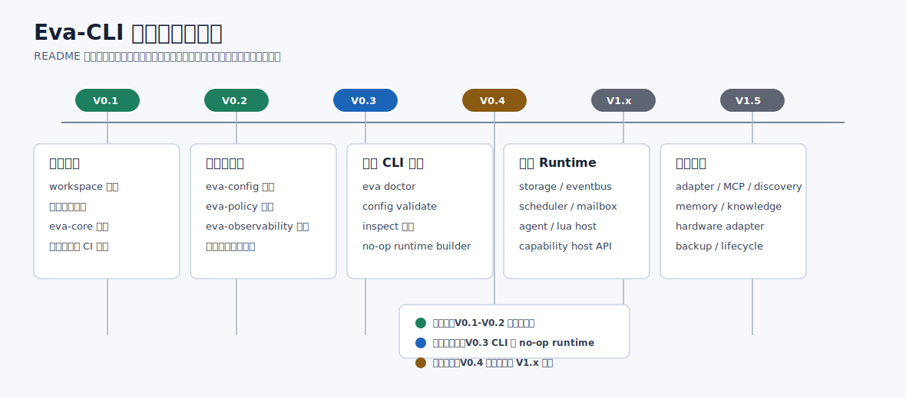

# Crates / Rust 子模块

更新时间：2026-07-03

本目录承载 Eva-CLI Rust workspace 的模块边界。每个 crate 对应一个稳定职责域，根 README 记录本模块的功能说明、实施步骤、进度表和验证入口；`src/README.md` 记录源码目录内的文件职责。

## 总体规则

| 规则 | 说明 |
| --- | --- |
| 契约先行 | `eva-core`、`eva-config`、`eva-policy`、`eva-observability` 先稳定公共类型、配置输入、权限收紧和观测字段。 |
| Runtime 单向组合 | `eva-runtime` 是唯一组合根，下层 crate 不反向依赖 runtime。 |
| CLI 不拥有状态 | `eva-cli` 只负责命令解析、输出和调用 runtime，不保存核心运行时状态。 |
| 外部能力受控 | Adapter、MCP、Discovery、Hardware、Backup、Lifecycle 都必须经过 manifest、policy、audit gate。 |

## 模块 README 索引

| 模块 | 职责 | 当前状态 | 目标版本 | README |
| --- | --- | --- | --- | --- |
| `eva-core` | 跨模块基础契约 | 已完成 V0.1/V0.2 基线 | 持续维护 | [README](eva-core/README.md) |
| `eva-config` | 配置加载、manifest、routes、policy document | 已完成 V0.2 | V0.3 接 CLI | [README](eva-config/README.md) |
| `eva-policy` | 权限集合、沙箱策略、effective policy | 已完成 V0.2 | V0.3/V0.4 接 runtime | [README](eva-policy/README.md) |
| `eva-observability` | trace、audit、metrics 契约 | 已完成 V0.2 | V0.3/V0.4 接输出 | [README](eva-observability/README.md) |
| `eva-cli` | 命令行入口和结构化输出 | 已完成 V0.3 最小开发闭环 | V0.4 接 `run` 事件循环 | [README](eva-cli/README.md) |
| `eva-runtime` | 服务装配、runtime builder、shutdown | 已完成 V0.3 no-op 组合根 | V0.4 接真实服务 wiring | [README](eva-runtime/README.md) |
| `eva-storage` | StateStore、EventLog、ArtifactStore | 骨架 | V0.4 | [README](eva-storage/README.md) |
| `eva-eventbus` | publish/subscribe、replay、dead letter | 骨架 | V0.4 | [README](eva-eventbus/README.md) |
| `eva-scheduler` | Topic 匹配、订阅表、mailbox 投递 | 骨架 | V0.4 | [README](eva-scheduler/README.md) |
| `eva-agent` | Agent 生命周期、队列、事件处理 | 骨架 | V0.4 | [README](eva-agent/README.md) |
| `eva-lua-host` | Lua loader、sandbox、host bindings、hot reload | 骨架 | V0.4/V0.5 | [README](eva-lua-host/README.md) |
| `eva-capability` | Capability registry、router、host API | 骨架 | V0.4 | [README](eva-capability/README.md) |
| `eva-adapter` | Adapter manifest、registry、router、transport runtime | 骨架 | V1.1 | [README](eva-adapter/README.md) |
| `eva-mcp` | MCP client/server、tool mapping、schema | 骨架 | V1.1 | [README](eva-mcp/README.md) |
| `eva-discovery` | 受信发现源、归一化、健康探测、缓存 | 骨架 | V1.1 | [README](eva-discovery/README.md) |
| `eva-memory` | 私有记忆、全局记忆、知识库、上下文构建 | 骨架 | V1.2 | [README](eva-memory/README.md) |
| `eva-hardware` | 设备发现、driver binding、hotplug | 骨架 | V1.3 | [README](eva-hardware/README.md) |
| `eva-backup` | 备份、迁移包、release snapshot、校验 | 骨架 | V1.4 | [README](eva-backup/README.md) |
| `eva-lifecycle` | supervisor、generation、drain、rollback | 骨架 | V1.4 | [README](eva-lifecycle/README.md) |

## 项目级实施进度

| 顺序 | 版本 | 模块 | 关键功能 | 当前进度 | 完成判据 |
| --- | --- | --- | --- | --- | --- |
| 1 | V0.1 | workspace、`eva-core` | crate 划分、基础契约、文档图谱 | 已完成 | `cargo test --workspace` 通过 |
| 2 | V0.2 | `eva-config`、`eva-policy`、`eva-observability` | 配置加载、权限收紧、观测字段 | 已完成 | 模块测试和 workspace 测试通过 |
| 3 | V0.3 | `eva-cli`、`eva-runtime`、`eva-config` | `doctor`、`config validate`、`inspect`、no-op runtime builder | 已完成 | CLI 可输出结构化诊断，runtime summary 可读取 |
| 4 | V0.4 | `eva-storage`、`eva-eventbus`、`eva-scheduler`、`eva-agent`、`eva-lua-host`、`eva-capability` | 最小事件运行闭环 | 待实现 | `examples/basic/` 端到端可运行 |
| 5 | V0.5 | `eva-agent`、`eva-lua-host`、`eva-eventbus`、`eva-cli` | 任务状态、取消、超时、重试、热更新雏形 | 待实现 | 长任务可观察、可取消 |
| 6 | V1.1 | `eva-adapter`、`eva-mcp`、`eva-discovery` | 外部能力发现、probe、受控调用 | 待实现 | 外部能力只经 policy gate 执行 |
| 7 | V1.2 | `eva-memory`、`eva-lua-host` | memory、knowledge、context builder | 待实现 | 上下文组装有权限和审计 |
| 8 | V1.3 | `eva-hardware`、`eva-adapter` | 设备发现、绑定、hotplug、hardware transport | 待实现 | Lua 不能 raw I/O |
| 9 | V1.4 | `eva-backup`、`eva-lifecycle` | 备份、迁移、snapshot、generation rollback | 待实现 | 高风险操作先 plan 后 apply |
| 10 | V1.5 | 全模块 | 安全、性能、发布验收 | 待实现 | release checklist 全部通过 |

## 共享插图

| 图 | 用途 | 文件 |
| --- | --- | --- |
| 模块实施路线图 | 所有模块 README 的版本基线 | [eva-module-implementation-roadmap.svg](assets/eva-module-implementation-roadmap.svg) |
| 运行闭环模块流 | V0.3/V0.4 相关模块 | [eva-runtime-module-flow.svg](assets/eva-runtime-module-flow.svg) |
| 扩展生态模块流 | V1.x 扩展模块 | [eva-extension-module-flow.svg](assets/eva-extension-module-flow.svg) |

## 维护要求

每次实现模块功能时，需要同步更新对应 crate README 的“详细开发进度表”和 `src/README.md` 的文件职责表。涉及公共契约变更时，先更新 `eva-core` 或相关契约模块，再更新下游模块，最后运行 workspace 级验证。
