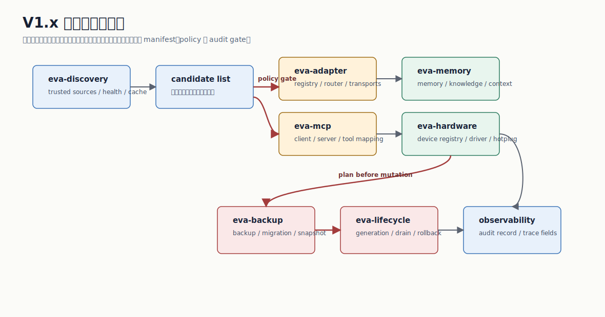

# eva-adapter/src / Adapter 源码

更新时间：2026-07-07



本目录承载 Adapter runtime descriptor、registry、router、transport runtime、adapter-backed capability host 和错误映射。V1.1 已经把外部能力做成 side-effect-safe 的受控 envelope；V1.3 新增 hardware transport，让硬件能力经由 `eva-hardware` 的 registry lease 和 driver binding 执行；V1.8.1 将 stdio/http runner 接入 `AdapterRuntime`，V1.8.2 将 MCP invoke 接到 JSON-RPC stdio client，V1.8.4 将 Skill transport 接到 schema-gated workflow runner，V1.8.5.4 将授权后的 capability provider plan 接到 `AdapterRuntime`，统一 `InvokeResponse`，并按 retryable 分类执行 fallback。

## 文件职责

| 文件/目录 | 职责 | 当前进度 | 说明 |
| --- | --- | --- | --- |
| `lib.rs` | 模块导出 | 已完成 V1.1 | 导出 manifest、registry、router、runtime、error。 |
| `capability_host.rs` | adapter-backed capability host | 已完成 V1.8.5.4 | 复用 capability authorized provider plan，调用 `AdapterRuntime`，把 `AdapterInvokeReport` 和 transport error 归一为 `InvokeResponse`，并只在 `EvaError::is_retryable()` 为 true 时继续 fallback。 |
| `manifest.rs` | Adapter manifest 的 runtime 表示 | 已完成 V1.8.4 | `AdapterHandle` 保留 MCP、Skill path/entry/schema/runner/artifact root、hardware identity 以及 stdio/http command、args、endpoint、env、headers、limits 扩展。 |
| `registry.rs` | Adapter handle 和 capability index | 已完成 V1.1 | 支持按 id/capability 查询和重复检测。 |
| `router.rs` | explicit provider 和 capability 路由 | 已完成 V1.1 | provider 优先，fallback 到 capability index。 |
| `runtime.rs` | 授权后 transport 执行、probe、audit | 已完成 V1.8.4 | provider invocation report 包含 request-level `TraceFields`；hardware、stdio、http、MCP JSON-RPC 和 Skill workflow runner 已接入；后续补 provider supervision 与并发/限流。 |
| `error.rs` | provider/transport 错误映射 | 已完成 V1.1 | 稳定输出 permission/unavailable/unsupported/conflict 等错误。 |
| `transports/` | 具体 transport 实现 | 已完成 V1.8.4 | builtin/hardware 有受控实现；stdio/http runner、MCP JSON-RPC stdio tool call 和 Skill schema-gated runner 已接入 runtime，带 manifest command/endpoint/env/limits、timeout、output limit、artifact evidence 和 credential redaction。 |

## V1.1 已实现 surface

- `manifest.rs`：定义 `AdapterHandle`、`AdapterHealth`、`AdapterCapabilityBinding`。
- `registry.rs`：按 Adapter id 和 capability 建立索引。
- `router.rs`：支持 explicit provider routing 和 capability-index fallback。
- `runtime.rs`：提供 `AdapterRuntime::from_project`、`list`、`probe_adapter`、`probe_capability`、`invoke`。
- `transports/builtin.rs`：返回本地受控 envelope。
- `transports/mcp.rs`：通过 `eva-mcp` 强制 MCP tool allowlist。
- `transports/skill.rs`：V1.8.4 起校验 Skill runtime gate/input schema，并执行受控 workflow runner。

P5 provider invocation reports attach `TraceFields` with request id, adapter id,
capability, provider, and the stable `adapter.invoke` span. CLI JSON can
therefore show transport audit entries and invocation trace in the same data
object.

V1.8.1 起 `AdapterRuntime` 可以启动 stdio/http provider runner。stdio 子进程不走 shell，只允许 manifest `command`；HTTP 先支持标准库 `http://` fake/明文 provider，`https://` 在没有 TLS client 时返回稳定 unsupported。V1.8.2 起 MCP transport 会按 manifest `mcp.command`/`mcp.args` 启动 stdio JSON-RPC server，完成 `initialize`、`tools/list`、`tools/call`，并在发送前拦截未授权 tool。V1.8.4 起 Skill transport 会校验 manifest input schema、创建隔离 working directory、执行 manifest allowlist process runner 或受控 `codex_skill` runner，并把 stdout/stderr/run-report/artifact 写入 filesystem artifact store。credential env/header 只进入受控 runner，输出和审计默认脱敏。

## V1.3 新增 surface

- `manifest.rs` 新增 `hardware_logical_name` 和 `hardware_device_class`，来源是 Adapter manifest 的 `hardware.identity.*` 扩展字段。
- `runtime.rs` 将 `AdapterTransport::Hardware` 路由到 `transports::hardware::invoke`。
- `transports/hardware.rs` 通过 `DeviceRegistry` claim/release 设备，使用 `DriverBinding` 和 `SimulatedDriver` 执行模拟硬件读取。
- hardware audit 输出 `raw_io:false`、`transport:hardware`、`lease:released`，证明 V1.3 没有打开真实设备。

## Transport 状态

| Transport | 状态 | 风险控制 |
| --- | --- | --- |
| builtin | 已完成 V1.1 | 仅本地 envelope。 |
| eventbus | 已完成 V1.1 envelope | 继续保留 trace，不绕过 runtime。 |
| lua_capability | 已完成 V1.1 envelope | Lua 仍走 capability/adapter 边界。 |
| mcp | 已完成 V1.8.2 | tool allowlist 先于 JSON-RPC；响应受 timeout 和 output limit 约束。 |
| skill | 已完成 V1.8.4 | runtime gate 必须为 `normal`；输入 schema、working directory、artifact path 和 credential redaction 受控。 |
| hardware | 已完成 V1.3 | 只接受 registry lease 和 driver binding，不暴露 raw I/O。 |
| stdio | 已接入 AdapterRuntime | command/args 分离，强制 allowlist，覆盖 timeout、output limit、env 注入和 stdout/stderr 脱敏。 |
| http | 已接入 AdapterRuntime | URL origin allowlist、method allowlist、timeout、output limit、header env 注入和输出脱敏已覆盖。 |

## 验证

```powershell
cargo test -p eva-adapter
cargo run -- adapter list --output json
cargo run -- adapter probe --adapter github-mcp --output json
cargo run -- hardware bind --adapter scale-main --output json
```

当前测试覆盖 registry/router/runtime、adapter-backed capability host、retryable provider fallback、non-retryable provider stop、MCP allowlist、MCP JSON-RPC fake server call、blocked tool 不发 RPC、timeout/protocol/output-limit 错误、Skill schema gate/runner/artifact evidence/credential redaction、hardware identity 读取、hardware transport simulated audit、stdio runtime runner/redaction/disabled-provider gate、stdio runner denied command/timeout/output limit，以及 HTTP URL allowlist、method denial、timeout、runtime fake provider 和 credential header redaction。
