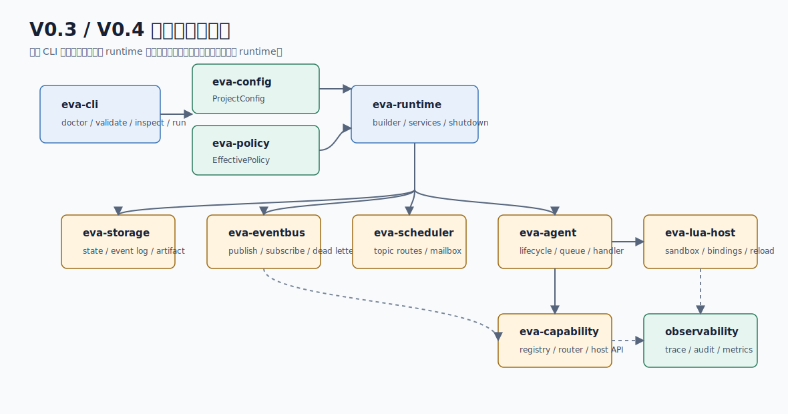

# eva-agent / Agent 运行边界

更新时间：2026-07-03



`eva-agent` 负责 Agent 生命周期、私有队列和事件处理边界。V0.5 在 V0.4 同步 `AgentRuntime` 上增加 `AgentRunControl`，让 timeout、cancel 和 retry 在 Agent 边界形成统一 `AgentRunRecord`。

## 当前实现

| 能力 | 类型/文件 | 当前行为 |
| --- | --- | --- |
| 生命周期 | `AgentLifecycle`、`AgentLifecycleState` | 支持 created、running、draining、stopped、failed；非法 start/drain 返回 `Conflict`。 |
| 私有队列 | `AgentQueue` | bounded FIFO；容量为 0 无效，队列满返回 `Unavailable`。 |
| AgentRuntime | `AgentRuntime` | start 后才能 accept 事件；同步 drain queue 并调用注入 handler。 |
| Handler 输出 | `AgentHandlerOutput` | 保存 handler status 和可选文本 output。 |
| 执行控制 | `AgentRunControl` | 保存 timeout budget、cancel flag、retry attempt 上限。 |
| 执行记录 | `AgentRunRecord`、`AgentRunStatus` | 保存 agent id、event id、topic、status、attempts、handler status、output/error。 |
| 状态快照 | `AgentStateSnapshot` | 为后续更完整 status/report 预留轻量状态报告。 |

## V0.5 行为

- `run_next` 仍是默认单次同步执行入口。
- `run_next_with_control` 支持 V0.5 诊断控制：
  - `cancel_requested=true` 时 handler 不会被调用，返回 `cancelled`。
  - `timeout=0ms` 时 handler 不会被调用，返回 retryable `timeout` 错误。
  - retry 只在 handler 返回 retryable `EvaError` 时继续尝试。
- AgentRuntime 不创建线程、不执行计时器、不持久化任务状态；这些仍由 runtime/CLI 上层组合。

## 模块边界

`eva-agent` 不解析 Lua 文件，不实现 sandbox，不直接调用 Adapter/MCP/hardware，也不保存 durable EventLog。runtime 注入 handler 后，AgentRuntime 只负责 queue、lifecycle、控制边界和标准化执行结果。

## 公开入口

```rust
use eva_agent::{AgentRunControl, AgentRuntime, AgentHandlerOutput, AgentRunStatus};
```

## 验证

```powershell
cargo test -p eva-agent
```

已覆盖：未运行状态拒绝 accept、start 后接收事件、handler 执行记录、bounded queue overflow、cancelled run、timeout run、retryable error retry。

## 后续计划

| 版本 | 计划 |
| --- | --- |
| V1.0 | 将 V0.5 task status/logs/cancel 经验整理为稳定用户文档。 |
| V1.2 | 接入 memory/context API。 |
