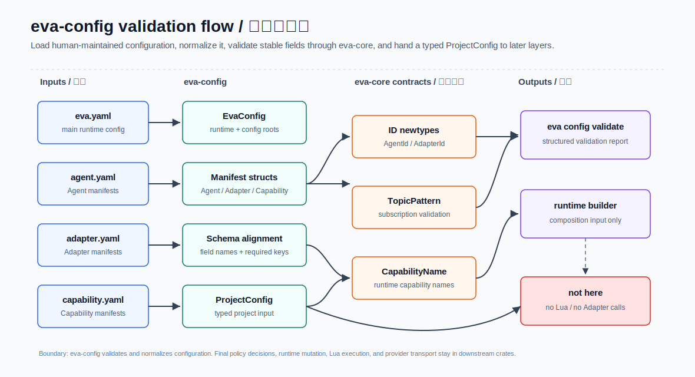
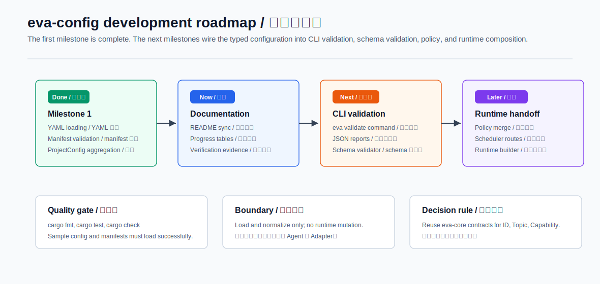

# eva-config / 配置加载与归一化

更新时间：2026-07-03






`eva-config` 负责把人工维护的 Eva 项目配置转换成运行时可以信任的结构化输入。它读取 `config/eva.yaml`、Agent/Adapter/Capability manifests、schema 路径和拆分配置根目录，并用 `eva-core` 的稳定契约校验 ID、TopicPattern、CapabilityName 和结构化错误。

`eva-config` 只做配置加载、归一化和启动前一致性检查。它不启动 runtime，不执行 Lua，不调用 Adapter，不做最终授权裁决，也不重复定义 `eva-core` 已经拥有的底层校验规则。

## 中文

### 当前实现状态

第一阶段最小配置加载链路已经完成。当前模块可以加载仓库内示例配置，生成 `ProjectConfig`，并对跨文件引用做基础一致性检查。V0.3 起 `eva-cli` 已通过 `eva config validate` 暴露文本/JSON 校验报告，V0.4 runtime basic loop 也复用同一份 `ProjectConfig` 作为组合输入。

```text
project root
  -> config/eva.yaml
  -> EvaConfig
  -> ConfigRoots
  -> AgentManifest / AdapterManifest / CapabilityManifest
  -> eva-core typed validation
  -> ProjectConfig
```

| 范围 | 状态 | 说明 |
| --- | --- | --- |
| YAML 反序列化 | 已完成 | `eva-config` 局部使用 `serde` 和 `serde_yaml`，不扩散到其它 crate |
| 主配置加载 | 已完成 | `load_eva_config` 读取 `eva.yaml` 并解析 `runtime`、`config` 稳定字段 |
| 配置根路径 | 已完成 | `ConfigRoots::resolve_against` 将相对路径按项目根目录解析 |
| Agent manifest | 已完成 | 校验 `AgentId`、`parent`、`children`、`script`、`subscriptions`、部分权限字段 |
| Adapter manifest | 已完成 | 校验 `AdapterId`、`transport` 和 `capabilities` |
| Capability manifest | 已完成 | 校验 `CapabilityId`、`kind`、runtime `CapabilityName` 和 provider 引用格式 |
| Policy document | 已完成 | 加载 `config/policies/*.yaml` 为 extensible domain map，最终解释留给 `eva-policy` |
| Routes 配置 | 已完成 | 加载 `config/routes/topics.yaml`，校验 `TopicPattern`、delivery 和目标 Agent ID |
| 项目级聚合 | 已完成 | `load_project_config` 汇总主配置、三类 manifest、policy 文档和 routes |
| 跨文件一致性 | 已完成 | 检查重复 ID、Agent 父子引用、Agent 脚本文件、Capability provider Adapter、Route target Agent |
| schema 辅助 | 已完成 | 暴露 schema 路径和当前支持的枚举值，包括 route delivery |
| 完整 JSON Schema validator | 未实现 | 后续独立切片 |
| CLI `eva config validate` | 已完成 | `eva-cli` 输出人类可读和机器可读的配置验证结果 |

### 已实现公开 API

| API | 输入 | 输出 | 用途 |
| --- | --- | --- | --- |
| `load_eva_config` | `impl AsRef<Path>` | `Result<EvaConfig, EvaError>` | 读取并校验主配置 |
| `load_agent_manifest` | `impl AsRef<Path>` | `Result<AgentManifest, EvaError>` | 读取单个 Agent manifest |
| `load_adapter_manifest` | `impl AsRef<Path>` | `Result<AdapterManifest, EvaError>` | 读取单个 Adapter manifest |
| `load_capability_manifest` | `impl AsRef<Path>` | `Result<CapabilityManifest, EvaError>` | 读取单个 Capability manifest |
| `load_policy_document` | `impl AsRef<Path>` | `Result<PolicyDocument, EvaError>` | 读取单个 policy YAML 文档 |
| `load_routes` | `impl AsRef<Path>` | `Result<RouteConfig, EvaError>` | 读取 Topic route table |
| `load_project_config` | `impl AsRef<Path>` | `Result<ProjectConfig, EvaError>` | 从项目根目录加载最小配置集合 |
| `validate_project_config` | `&ProjectConfig` | `Result<(), EvaError>` | 做跨文件一致性检查 |
| `schema_paths` | `&ConfigRoots` | `SchemaPaths` | 生成标准 schema 文件路径 |

### 类型与文件

| 类型 | 文件 | 关键字段 | 当前职责 |
| --- | --- | --- | --- |
| `EvaConfig` | `src/eva_yaml.rs` | `runtime`、`config`、`extra` | 主配置根对象，保留后续模块字段 |
| `RuntimeConfig` | `src/eva_yaml.rs` | `env`、`workspace`、`data_dir`、`script_dir`、`adapter_dir`、`hot_reload` | Runtime builder 的启动前输入 |
| `ConfigRoots` | `src/eva_yaml.rs` | `agent_dir`、`adapter_dir`、`capability_dir`、`policy_dir`、`route_file`、`schema_dir` | 拆分配置发现入口 |
| `AgentManifest` | `src/manifest/agent.rs` | `id`、`enabled`、`parent`、`children`、`script`、`subscriptions`、`permissions` | Agent 注册前配置契约 |
| `AdapterManifest` | `src/manifest/adapter.rs` | `id`、`name`、`version`、`enabled`、`transport`、`capabilities` | Adapter 注册前配置契约 |
| `CapabilityManifest` | `src/manifest/capability.rs` | `id`、`name`、`version`、`enabled`、`kind`、`capability`、`provider` | Capability 注册前配置契约 |
| `PolicyDocument` | `src/policy.rs` | `path`、`domains` | policy 文件加载结果，领域解释不在 `eva-config` |
| `RouteConfig` | `src/routes.rs` | `path`、`routes` | Topic route table |
| `RouteRule` | `src/routes.rs` | `pattern`、`delivery`、`agents` | Scheduler 注册前路由契约 |
| `ProjectConfig` | `src/lib.rs` | `eva`、`roots`、`agents`、`adapters`、`capabilities`、`policies`、`routes` | `eva config validate` 和 runtime composition 的最小输入 |
| `SchemaPaths` | `src/schema.rs` | `eva`、`agent`、`adapter`、`capability`、`policy`、`routes` | schema 文件位置入口 |

### eva-core 契约复用

| 配置字段 | 目标类型 | 校验来源 |
| --- | --- | --- |
| `agent.id` | `eva_core::AgentId` | 稳定 ID newtype |
| `agent.parent` | `Option<eva_core::AgentId>` | 稳定 ID newtype |
| `agent.children[]` | `Vec<eva_core::AgentId>` | 稳定 ID newtype |
| `agent.subscriptions[]` | `Vec<eva_core::TopicPattern>` | TopicPattern parser |
| `agent.permissions.emit[]` | `Vec<eva_core::TopicPattern>` | TopicPattern parser |
| `adapter.id` | `eva_core::AdapterId` | 稳定 ID newtype |
| `adapter.capabilities[]` | `Vec<eva_core::CapabilityName>` | CapabilityName parser |
| `capability.id` | `eva_core::CapabilityId` | 稳定 ID newtype |
| `capability.capability` | `eva_core::CapabilityName` | CapabilityName parser |
| `capability.provider` | `Option<eva_core::AdapterId>` | 稳定 ID newtype |
| `routes[].pattern` | `eva_core::TopicPattern` | TopicPattern parser |
| `routes[].agents[]` | `Vec<eva_core::AgentId>` | 稳定 ID newtype |
| 加载/校验错误 | `eva_core::EvaError` | 结构化错误模型 |

### 错误语义

| 场景 | `ErrorKind` | 上下文 |
| --- | --- | --- |
| 配置文件不存在 | `NotFound` | `path`、`config_type` |
| YAML 解析失败 | `InvalidArgument` | `path`、`line`、`column`、`yaml_error` |
| 必填字段缺失或为空 | `InvalidArgument` | `config_type`、`path`、`field` |
| ID、TopicPattern、CapabilityName 非法 | `InvalidArgument` | 原始 `eva-core` 错误上下文 + 字段上下文 |
| Adapter transport 不支持 | `Unsupported` | `transport` |
| Capability kind 不支持 | `Unsupported` | `kind` |
| 跨文件引用不存在 | `NotFound` | 引用方 ID、被引用 ID、文件路径 |
| 重复 ID | `Conflict` | 重复 ID、首次文件、冲突文件 |
| route delivery 不支持 | `Unsupported` | `delivery` |
| policy document 不是非空 mapping | `InvalidArgument` | `path`、`config_type` |

### 测试与验证

| 命令 | 当前结果 |
| --- | --- |
| `cargo fmt -p eva-config --check` | 通过 |
| `cargo test -p eva-config` | 通过，27 个测试 |
| `cargo check -p eva-config` | 通过 |
| `cargo check --workspace` | 通过 |
| `cargo test --workspace` | 通过 |

已覆盖的关键测试包括：

| 测试名 | 覆盖内容 |
| --- | --- |
| `load_eva_config_accepts_sample_config` | 示例 `config/eva.yaml` 可加载 |
| `load_eva_config_rejects_missing_required_runtime` | 主配置缺少必填 `runtime` 会失败 |
| `load_agent_manifest_accepts_sample_agent` | 示例 Agent manifest 可加载 |
| `load_agent_manifest_rejects_invalid_agent_id` | 非法 Agent ID 会失败 |
| `load_agent_manifest_rejects_invalid_subscription_pattern` | 非法 TopicPattern 会失败 |
| `load_adapter_manifest_accepts_sample_adapter` | 示例 Adapter manifest 可加载 |
| `load_adapter_manifest_rejects_unknown_transport` | 未知 transport 会失败 |
| `load_adapter_manifest_rejects_invalid_capability_name` | 非法 capability name 会失败 |
| `load_capability_manifest_accepts_sample_capability` | 示例 Capability manifest 可加载 |
| `load_capability_manifest_rejects_invalid_runtime_capability` | 非法 runtime capability 会失败 |
| `load_policy_document_accepts_sample_policy` | 示例 policy 文件可加载 |
| `load_routes_accepts_sample_routes` | 示例 routes 文件可加载 |
| `route_config_rejects_unknown_delivery` | 未知 delivery 会失败 |
| `project_config_loads_all_config_roots` | 项目级加载能汇总主配置和 manifest |
| `validate_project_config_rejects_duplicate_agent_id` | 重复 Agent ID 会失败 |
| `validate_project_config_rejects_unknown_route_agent` | routes 指向未知 Agent 会失败 |

### 详细开发实施步骤

| 顺序 | 版本 | 步骤 | 依赖 | 完成标准 |
| --- | --- | --- | --- | --- |
| 1 | V0.2 | 完成主配置、manifest、policy document、routes 的 YAML 加载。 | `serde_yaml`、`eva-core` | 示例配置可以生成 `ProjectConfig`。 |
| 2 | V0.2 | 完成 ID、TopicPattern、CapabilityName 等 typed validation。 | `eva-core` | 非法字段返回结构化 `EvaError`。 |
| 3 | V0.2 | 完成跨文件一致性检查。 | 项目示例配置 | 重复 ID、未知 Agent、缺失脚本可被拒绝。 |
| 4 | V0.3 | 接入 `eva-cli config validate` 和 `doctor`。 | `eva-cli` | human/json 诊断稳定。 |
| 5 | V0.3 | 补完整 JSON Schema validator。 | `config/schemas` | 错误定位到文件、字段和 schema 规则。 |
| 6 | V0.4 | 将 routes 注册到 Scheduler。 | `eva-scheduler` | route YAML 变成可执行投递规则。 |
| 7 | V1.1 | 为 Adapter/MCP/Discovery 扩展 manifest 字段。 | `eva-adapter`、`eva-mcp`、`eva-discovery` | 新字段保持向后兼容。 |

### 详细开发进度表

| 文件/模块 | 具体功能 | 当前进度 | 下一步 |
| --- | --- | --- | --- |
| `src/lib.rs` | `ProjectConfig` 聚合、加载入口、跨文件校验 | 已完成 | V0.3 输出 CLI 诊断模型。 |
| `src/eva_yaml.rs` | `config/eva.yaml` 解析和 `ConfigRoots` | 已完成 | 增加 schema validator 细粒度错误。 |
| `src/manifest/agent.rs` | Agent manifest 解析和基础校验 | 已完成 | 扩展 permission 字段解释。 |
| `src/manifest/adapter.rs` | Adapter manifest 解析和基础校验 | 已完成 | V1.1 增加 transport/schema/policy 细化字段。 |
| `src/manifest/capability.rs` | Capability manifest 解析和 provider 引用校验 | 已完成 | 接 CapabilityRegistry descriptor。 |
| `src/policy.rs` | policy YAML document 加载 | 已完成 | 与 `eva-policy` 协作解释 policy domain。 |
| `src/routes.rs` | routes YAML 加载和 delivery 校验 | 已完成 | 接 `eva-scheduler` route registry。 |
| `src/schema.rs` | schema 路径和枚举辅助 | 已完成 | 增加真实 schema validation。 |
| `src/README.md` | 源码目录说明 | 简略 | 同步文件职责和后续阶段。 |

### 下一步开发计划

| 优先级 | 工作项 | 目标模块 | 验收标准 |
| --- | --- | --- | --- |
| P0 | 补完整 JSON Schema validator | `eva-config` | schema 校验错误能定位到文件、字段和 schema 规则 |
| P0 | 保持 CLI 校验报告稳定 | `eva-cli` + `eva-config` | `eva config validate` 与 `ProjectConfig`、schema 路径和 exit code 持续对齐 |
| P1 | 解释 policy domain 到 `PolicyLayer` | `eva-policy` + runtime 调用方 | policy YAML 已可加载，下一步把具体领域字段转成策略层 |
| P1 | 扩展 Scheduler route 使用场景 | `eva-scheduler` | V0.4 basic loop 已使用 routes；后续补公平竞争、drain 和失败投递 |
| P1 | 扩展 manifest 交叉检查 | `eva-config` | Adapter capability、Capability provider、Agent permission 引用能互相校验 |
| P2 | examples/basic 配置闭环 | `examples/basic` | 已从配置加载走到最小事件投递示例；后续随 V0.5 扩展失败路径 |
| P2 | 文档和 schema 生成检查 | `docs` + `config/schemas` | README、Rust 类型、schema required 字段持续对齐 |

### 仍不属于 eva-config 的工作

| 内容 | 归属模块 |
| --- | --- |
| effective policy 合并和最终授权裁决 | `eva-policy` |
| Topic 路由展开和 Agent mailbox 投递 | `eva-scheduler` |
| runtime service 装配、启动和停机 | `eva-runtime` |
| Lua sandbox 与 host bindings | `eva-lua-host` |
| Adapter transport 执行 | `eva-adapter` |
| CLI 命令解析、展示格式和退出码策略 | `eva-cli` |

## English

### Current Status

The first milestone is complete. `eva-config` now loads the sample project configuration, validates stable manifest fields through `eva-core`, and assembles a typed `ProjectConfig`. Since V0.3, `eva-cli` exposes this path through `eva config validate`; the V0.4 basic runtime loop reuses the same `ProjectConfig` as its composition input.

| Area | Status | Notes |
| --- | --- | --- |
| YAML deserialization | Done | Uses local `serde` and `serde_yaml` dependencies in `eva-config` |
| Main config loading | Done | `load_eva_config` parses stable `runtime` and `config` fields |
| Config roots | Done | `ConfigRoots::resolve_against` resolves relative roots from the project root |
| Agent manifest | Done | Validates `AgentId`, parent/child ids, scripts, subscriptions, and selected permission fields |
| Adapter manifest | Done | Validates `AdapterId`, supported transport, and capability names |
| Capability manifest | Done | Validates `CapabilityId`, kind, runtime capability name, and provider id syntax |
| Policy documents | Done | Loads extensible policy YAML documents while domain interpretation stays outside `eva-config` |
| Routes config | Done | Loads topic route tables and validates topic patterns, delivery mode, and target Agent IDs |
| Project aggregation | Done | `load_project_config` collects main config, manifests, policy documents, and routes |
| Cross-file validation | Done | Checks duplicate IDs, Agent references, Agent scripts, Capability provider Adapters, and Route target Agents |
| Schema helpers | Done | Exposes standard schema paths and supported enum values, including route delivery |
| Full JSON Schema validator | Not started | Planned as a separate slice |
| CLI `eva config validate` | Done | `eva-cli` reports validation results in text and JSON formats |

### Public API

| API | Input | Output | Purpose |
| --- | --- | --- | --- |
| `load_eva_config` | `impl AsRef<Path>` | `Result<EvaConfig, EvaError>` | Load and validate `eva.yaml` |
| `load_agent_manifest` | `impl AsRef<Path>` | `Result<AgentManifest, EvaError>` | Load one Agent manifest |
| `load_adapter_manifest` | `impl AsRef<Path>` | `Result<AdapterManifest, EvaError>` | Load one Adapter manifest |
| `load_capability_manifest` | `impl AsRef<Path>` | `Result<CapabilityManifest, EvaError>` | Load one Capability manifest |
| `load_policy_document` | `impl AsRef<Path>` | `Result<PolicyDocument, EvaError>` | Load one policy YAML document |
| `load_routes` | `impl AsRef<Path>` | `Result<RouteConfig, EvaError>` | Load the topic route table |
| `load_project_config` | `impl AsRef<Path>` | `Result<ProjectConfig, EvaError>` | Load the minimum project-level config set |
| `validate_project_config` | `&ProjectConfig` | `Result<(), EvaError>` | Validate cross-file consistency |
| `schema_paths` | `&ConfigRoots` | `SchemaPaths` | Build standard schema file paths |

### Verification

| Command | Result |
| --- | --- |
| `cargo fmt -p eva-config --check` | Passed |
| `cargo test -p eva-config` | Passed, 27 tests |
| `cargo check -p eva-config` | Passed |
| `cargo check --workspace` | Passed |
| `cargo test --workspace` | Passed |

### Next Development Plan

| Priority | Work item | Target module | Acceptance criteria |
| --- | --- | --- | --- |
| P0 | Add full JSON Schema validation | `eva-config` | Schema errors include file, field, and schema rule context |
| P0 | Keep CLI validation stable | `eva-cli` + `eva-config` | `eva config validate` stays aligned with `ProjectConfig`, schema paths, and exit codes |
| P1 | Interpret policy domains as `PolicyLayer`s | `eva-policy` + runtime caller | Policy YAML is loaded; concrete domains still need mapping into policy layers |
| P1 | Expand Scheduler route behavior | `eva-scheduler` | V0.4 uses routes in the basic loop; next slices add fairness, drain, and failed delivery handling |
| P1 | Expand manifest cross-checks | `eva-config` | Adapter capabilities, Capability providers, and Agent permissions can be checked together |
| P2 | Maintain `examples/basic` config path | `examples/basic` | Sample config reaches the minimal event delivery flow; V0.5 should add failure-path examples |
| P2 | Keep docs, Rust types, and schemas aligned | `docs` + `config/schemas` | README tables, type definitions, and schema required fields stay consistent |

### Boundary

`eva-config` loads and normalizes configuration only. It does not start services, mutate runtime state, execute Lua, invoke adapters, make final permission decisions, or duplicate validation rules owned by `eva-core`.
