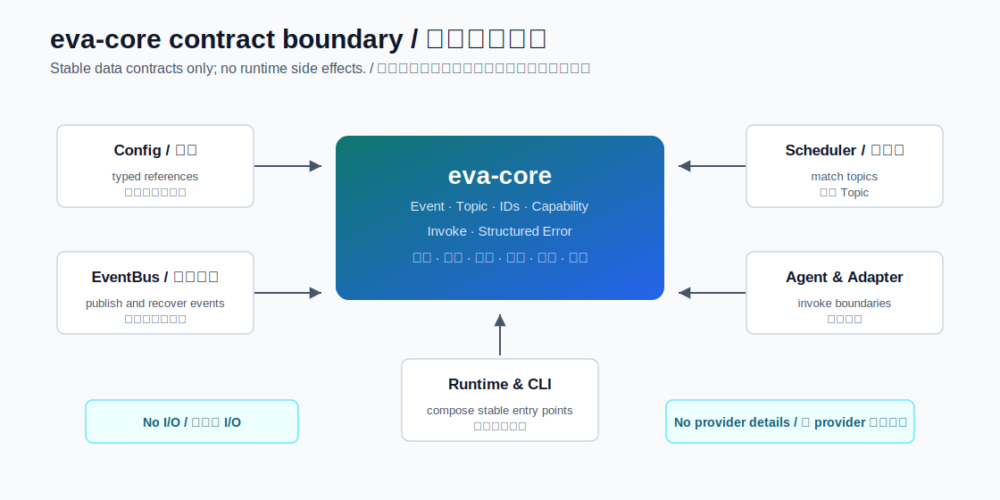
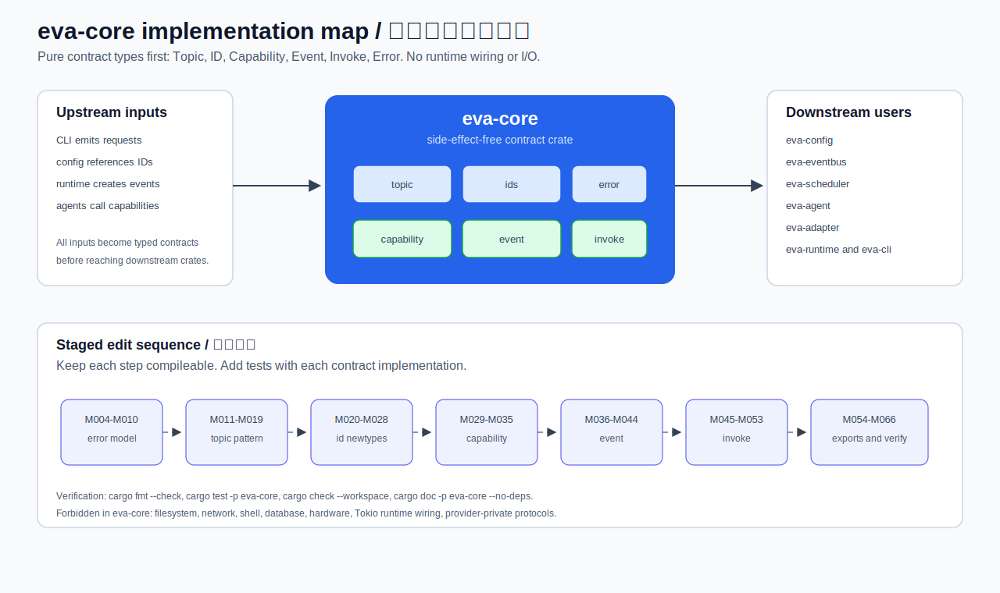

# eva-core / 基础契约模块说明

`eva-core` 是 Eva-CLI Rust workspace 的基础契约 crate。它只定义跨模块共享、长期稳定、无副作用的数据结构和纯逻辑，不负责启动 runtime、执行 Lua、访问网络、读写文件、连接数据库、调度任务或调用任何 provider。

当前 `src/` 中的 `topic`、`ids`、`capability`、`event`、`invoke`、`error` 已完成第一轮基础契约实现。本 README 同时保留设计目标、实现顺序、修改粒度和验收标准，后续下游接入应继续按这些边界推进。

## 当前实现进度

更新时间：2026-07-01

| 范围 | 状态 | 已完成 | 还差/后续 |
| --- | --- | --- | --- |
| `error` | 已完成 | `ErrorKind`、`EvaError`、默认 retryable、provider code、非敏感 context、`Display` 和 `std::error::Error`。 | 暂无本模块缺口；后续下游统一改用 `EvaError`。 |
| `topic` | 已完成 | `Topic` 解析与校验、`TopicPattern` 解析、`*` 单段匹配、尾部 `**` 匹配、exact pattern 转 Topic。 | 暂无本模块缺口；后续 `eva-scheduler` 接入匹配逻辑。 |
| `ids` | 已完成 | `AgentId`、`AdapterId`、`CapabilityId`、`RequestId`、`EventId`、`GenerationId` newtype，共享稳定 ID 校验。 | 暂无本模块缺口；不包含 ID 分配策略。 |
| `capability` | 已完成 | `CapabilityName` 点分段校验、namespace 查询、`ProviderHint`、`CapabilityRef`。 | 暂无本模块缺口；不包含 provider registry 或路由决策。 |
| `event` | 已完成 | `Event`、`EventTarget`、`EventPayload`、`EventMetadata`、`TraceContext`、父子事件链路传播。 | payload 目前是 `Empty/Text/Bytes`；如需 JSON/serde，应单独评审加入依赖。 |
| `invoke` | 已完成 | `InvokeTarget`、`InvokeRequest`、`InvokeResponse`、`InvokeStatus`、`InvokeMetadata`，含 accepted/completed/failed/cancelled/timeout 构造器。 | 不执行真实 Agent/Adapter 调用；执行层属于 runtime/adapter crate。 |
| `lib.rs` 公共出口 | 已完成 | 稳定 re-export：`EvaError`、`Topic`、ID、Capability、Event、Invoke 类型可通过 `eva_core::*` 使用。 | 下游 crate 仍需逐步迁移到这些公共类型。 |
| `src/README.md` | 已完成 | 已更新源码目录说明，列出实现契约与禁止事项。 | 根 README 后续应随下游接入状态继续更新。 |
| 验证 | 已完成 | `cargo fmt --check`、`cargo test -p eva-core`、`cargo check --workspace`、`cargo doc -p eva-core --no-deps`、`cargo test --workspace` 均已通过。 | 后续接入下游时需重新运行 workspace 级检查。 |

## 目标与非目标

| 类型 | 说明 |
| --- | --- |
| 目标 | 定义系统共同语言：Topic、ID、Capability、Event、Invoke、Error。 |
| 目标 | 给 `eva-config`、`eva-eventbus`、`eva-scheduler`、`eva-agent`、`eva-adapter`、`eva-runtime`、`eva-cli` 提供稳定类型。 |
| 目标 | 所有解析、校验、匹配、构造逻辑可用纯单元测试覆盖。 |
| 目标 | 通过显式 newtype 防止把 Agent ID、Adapter ID、Request ID、Topic 字符串混用。 |
| 非目标 | 不实现 EventBus 投递、持久化、重放、死信队列。 |
| 非目标 | 不实现 Scheduler 路由策略、Agent mailbox、队列和并发控制。 |
| 非目标 | 不实现 Lua State、Lua sandbox、host binding、热更新执行。 |
| 非目标 | 不实现 Adapter transport、MCP 协议、HTTP、stdio、hardware raw IO。 |
| 非目标 | 不实现 policy 合并、权限判定、审计落盘、重试调度。 |
| 非目标 | 不实现 runtime builder、Supervisor、generation 切换、CLI 命令。 |

## 模块总览

| 模块 | 文件 | 负责的逻辑功能 | 下游使用者 |
| --- | --- | --- | --- |
| Topic 契约 | `src/topic.rs` | Topic 解析、TopicPattern 解析、通配匹配、格式错误 | `eva-scheduler`、`eva-policy`、`eva-config` |
| ID 契约 | `src/ids.rs` | `AgentId`、`AdapterId`、`RequestId`、`EventId` 等 newtype | 几乎所有 runtime crate |
| Capability 契约 | `src/capability.rs` | 能力名称、能力引用、provider 选择基础类型 | `eva-capability`、`eva-adapter`、`eva-agent` |
| Event 契约 | `src/event.rs` | 事件主体、目标、payload、时间戳、链路追踪字段 | `eva-eventbus`、`eva-scheduler`、`eva-agent` |
| Invoke 契约 | `src/invoke.rs` | Agent/Capability/Adapter 调用请求、响应、状态 | `eva-agent`、`eva-runtime`、`eva-cli` |
| Error 契约 | `src/error.rs` | `EvaError`、`ErrorKind`、retryable、provider code | 所有跨模块调用边界 |
| 公共出口 | `src/lib.rs` | 模块声明与稳定 re-export | 所有下游 crate |

## 依赖规则

| 规则 | 允许 | 不允许 |
| --- | --- | --- |
| Eva 内部依赖 | 无 | 依赖任何其他 Eva runtime crate |
| 标准库 | `std::fmt`、`std::str::FromStr`、`std::collections`、`std::time` | `std::fs`、`std::process`、socket、环境变量读取 |
| 第三方依赖 | 仅在单独评审后加入契约表达所需的小依赖，例如序列化或错误派生 | Tokio、HTTP client、数据库、Lua、MCP SDK、硬件 SDK |
| 状态 | 不可变值对象、builder 中间值 | 全局可变状态、lazy runtime registry |
| 副作用 | 无 | 文件、网络、shell、数据库、硬件、日志落盘 |

第一轮实现建议优先保持 `eva-core` 无第三方依赖。若后续必须提供 `serde`，应以单独修改加入，并保证它仍是纯契约依赖。

## 逻辑功能详解

### 1. `topic` 模块

Topic 是系统事件路由的稳定地址。Topic 只表达路径，不表达订阅表、投递策略或 mailbox。

#### 类型设计

| 类型 | 建议定义 | 逻辑功能 |
| --- | --- | --- |
| `Topic` | 包装规范化字符串 | 表示真实事件 Topic，只允许确定路径，不允许通配符。 |
| `TopicPattern` | 包装 pattern 段列表 | 表示订阅或路由匹配规则，允许 exact、`*`、尾部 `**`。 |
| `TopicSegment` | 内部段类型 | 保存已校验的普通段，减少重复校验。 |
| `TopicPatternSegment` | enum | 区分 `Exact(String)`、`SingleWildcard`、`TailWildcard`。 |
| `TopicError` | enum 或映射到 `EvaError` | 表示 Topic 解析和匹配规则错误。 |

#### 逻辑功能

| 功能 | API 建议 | 输入 | 输出 | 规则 |
| --- | --- | --- | --- | --- |
| 解析 Topic | `Topic::parse` / `FromStr` | `&str` | `Result<Topic, TopicError>` | 必须以 `/` 开头；不能以 `/` 结尾；不能出现空段；不能含 `*` 或 `**`。 |
| 构造 Topic | `Topic::new` | `impl Into<String>` | `Result<Topic, TopicError>` | 与解析规则一致。 |
| 查看原文 | `Topic::as_str` | `&self` | `&str` | 返回规范化后的完整路径。 |
| 查看段 | `Topic::segments` | `&self` | iterator 或 `Vec<&str>` | 不暴露可变内部状态。 |
| 显示 Topic | `Display` | `Topic` | 字符串 | 必须等于规范化路径。 |
| 解析 Pattern | `TopicPattern::parse` / `FromStr` | `&str` | `Result<TopicPattern, TopicError>` | 允许普通段、`*`、`**`；`**` 只能出现在最后一段。 |
| 匹配 Topic | `TopicPattern::matches` | `&Topic` | `bool` | exact 段必须相等；`*` 匹配一个段；`**` 匹配剩余零个或多个段。 |
| 判断 exact | `TopicPattern::is_exact` | `&self` | `bool` | 没有任何通配符时为 true。 |
| 转 exact Topic | `TopicPattern::as_exact_topic` | `&self` | `Option<Topic>` | 只有 exact pattern 可转。 |

#### 校验规则

| 场景 | 合法示例 | 非法示例 | 错误原因 |
| --- | --- | --- | --- |
| 普通 Topic | `/input/user` | `input/user` | 缺少 `/` 前缀。 |
| 普通 Topic | `/sys/route-a` | `/sys//route-a` | 出现空段。 |
| 普通 Topic | `/agent/a1/event` | `/agent/*/event` | 真实 Topic 不允许通配符。 |
| 普通 Topic | `/a/b` | `/a/b/` | 尾部 `/` 造成空段。 |
| Pattern | `/agent/*/event` | `/agent/**/event` | `**` 不在最后一段。 |
| Pattern | `/agent/**` | `/agent/**/**` | 只能有一个尾部 `**`。 |
| Pattern | `/sys/*` | `/sys/ro*` | 通配符必须独占一个段。 |

#### 单元测试

| 测试名建议 | 断言 |
| --- | --- |
| `parse_topic_accepts_absolute_segments` | `/input/user` 可解析，Display 返回原路径。 |
| `parse_topic_rejects_relative_path` | `input/user` 返回缺少前缀错误。 |
| `parse_topic_rejects_empty_segment` | `/input//user` 返回空段错误。 |
| `parse_topic_rejects_wildcard` | `/agent/*` 不能作为 `Topic`。 |
| `pattern_matches_exact_topic` | `/a/b` 匹配 `/a/b`，不匹配 `/a/c`。 |
| `pattern_matches_single_wildcard` | `/a/*` 匹配 `/a/b`，不匹配 `/a/b/c`。 |
| `pattern_matches_tail_wildcard` | `/a/**` 匹配 `/a`、`/a/b`、`/a/b/c`。 |
| `pattern_rejects_middle_tail_wildcard` | `/a/**/c` 解析失败。 |

### 2. `ids` 模块

ID 模块负责把系统中的标识符从普通字符串收束为强类型。它不负责 ID 分配策略、注册表生命周期或持久化。

#### 类型设计

| 类型 | 格式建议 | 用途 |
| --- | --- | --- |
| `AgentId` | `agent-` 前缀或项目内稳定 slug | 标识 Agent manifest、runtime instance、mailbox owner。 |
| `AdapterId` | `adapter-` 前缀或稳定 slug | 标识外部能力接入实例。 |
| `CapabilityId` | 稳定 slug | 标识 capability manifest 或 provider 能力。 |
| `RequestId` | `req-` 前缀或 UUID 风格字符串 | 标识一次调用请求。 |
| `EventId` | `evt-` 前缀或 UUID 风格字符串 | 标识一条事件。 |
| `GenerationId` | `gen-` 前缀或递增字符串 | 标识 runtime/config/registry generation。 |

#### 逻辑功能

| 功能 | API 建议 | 规则 |
| --- | --- | --- |
| 解析 ID | `AgentId::parse`、`FromStr` | 非空、无空白、无 `/`、长度受限、字符集稳定。 |
| 构造 ID | `AgentId::new` | 与解析规则一致。 |
| 查看 ID | `as_str` | 返回内部不可变字符串。 |
| 显示 ID | `Display` | 输出稳定原文，不加调试信息。 |
| 比较 ID | `Eq`、`Ord` 或 `Hash` | 支持 map key 和集合去重。 |
| 类型隔离 | 不实现跨 ID 类型自动转换 | `AgentId` 不能传给需要 `AdapterId` 的 API。 |

#### 校验规则

| 规则 | 原因 |
| --- | --- |
| ID 不能为空 | 防止空字符串穿透配置和运行时边界。 |
| ID 不允许前后空白 | 防止 manifest 与 CLI 输出不一致。 |
| ID 不允许路径分隔符 | 防止被误用成文件路径或 Topic。 |
| ID 字符集应稳定 | 保证日志、配置、URL、JSON 输出可读。 |
| ID 长度应限制 | 防止错误输入造成异常内存占用和不可读日志。 |

#### 单元测试

| 测试名建议 | 断言 |
| --- | --- |
| `agent_id_accepts_stable_slug` | `agent-root` 可解析。 |
| `agent_id_rejects_empty` | 空字符串失败。 |
| `agent_id_rejects_whitespace` | `agent root` 失败。 |
| `adapter_id_is_not_agent_id` | 编译期类型不能互换。 |
| `request_id_display_is_stable` | Display 输出等于输入。 |

### 3. `capability` 模块

Capability 模块定义能力名称与能力引用，不实现 provider registry、权限判定或实际路由。

#### 类型设计

| 类型 | 建议字段 | 逻辑功能 |
| --- | --- | --- |
| `CapabilityName` | `String` | 例如 `repo.summary`、`workflow.code_review`。 |
| `CapabilityNamespace` | `String` | 能力命名空间，例如 `repo`、`workflow`、`hardware`。 |
| `CapabilityRef` | `CapabilityName`、可选 provider hint | 表示一次调用想要访问的能力。 |
| `ProviderHint` | `AdapterId` 或字符串 | 仅表达偏好，不做路由决策。 |
| `CapabilityError` | enum 或 `EvaError` 分类 | 表示命名错误、命名空间错误。 |

#### 逻辑功能

| 功能 | API 建议 | 规则 |
| --- | --- | --- |
| 解析能力名 | `CapabilityName::parse` | 必须由点分段组成，每段非空。 |
| 查看命名空间 | `CapabilityName::namespace` | 返回第一段。 |
| 查看段 | `CapabilityName::segments` | 返回不可变段序列。 |
| 判断前缀 | `CapabilityName::starts_with_namespace` | 用于 policy 和 router 初筛。 |
| 构造引用 | `CapabilityRef::new` | 绑定能力名和可选 provider hint。 |
| 显示能力名 | `Display` | 输出规范化名称。 |

#### 命名规则

| 类别 | 示例 | 说明 |
| --- | --- | --- |
| 仓库能力 | `repo.summary` | 项目扫描、摘要、结构查询。 |
| 工作流能力 | `workflow.code_review` | 受控 workflow skill。 |
| Agent 能力 | `agent.invoke` | 内部 Agent 调用入口。 |
| 硬件能力 | `hardware.scale.read` | 外接硬件抽象能力。 |
| MCP 能力 | `mcp.github.issue_list` | MCP tool 映射后的能力名。 |

#### 单元测试

| 测试名建议 | 断言 |
| --- | --- |
| `capability_name_accepts_dot_segments` | `repo.summary` 可解析。 |
| `capability_name_rejects_empty_segment` | `repo..summary` 失败。 |
| `capability_name_exposes_namespace` | namespace 为 `repo`。 |
| `capability_ref_keeps_provider_hint_optional` | 无 provider hint 也可构造。 |

### 4. `event` 模块

Event 是 EventBus、Scheduler、AgentRuntime 的共同数据结构。它只描述事件，不发布事件、不保存事件、不重放事件。

#### 类型设计

| 类型 | 建议字段 | 逻辑功能 |
| --- | --- | --- |
| `Event` | `event_id`、`topic`、`target`、`payload`、`metadata` | 系统内传递的标准事件。 |
| `EventTarget` | `Broadcast`、`Agent(AgentId)`、`Capability(CapabilityName)`、`Adapter(AdapterId)` | 表示事件期望到达的目标类型。 |
| `EventPayload` | JSON-like value 或字节/文本包装 | 保存业务输入，`eva-core` 不解释业务语义。 |
| `EventMetadata` | `created_at`、`request_id`、`correlation_id`、`causation_id`、`generation_id` | 保存链路追踪和运行时上下文引用。 |
| `TraceContext` | `correlation_id`、`causation_id` | 从父事件派生子事件时传播链路。 |

#### 逻辑功能

| 功能 | API 建议 | 规则 |
| --- | --- | --- |
| 构造事件 | `Event::new` | 必须携带 `event_id`、`topic`、`payload`。 |
| 设置目标 | `Event::with_target` | 默认可为 broadcast，指定后不可产生非法目标。 |
| 设置 request | `Event::with_request_id` | request 与 event 可以一对多。 |
| 设置链路 | `Event::with_trace` | correlation 表示同一链路，causation 表示直接父事件。 |
| 派生子事件 | `Event::child_event` 或 builder | 子事件继承 correlation，causation 指向父 event。 |
| 查看是否定向 | `EventTarget::is_directed` | Broadcast 为 false，其他为 true。 |
| payload 透传 | `EventPayload` 只保存数据 | 不在 `eva-core` 中解释 schema 或执行业务校验。 |

#### 字段规则

| 字段 | 必填 | 说明 |
| --- | --- | --- |
| `event_id` | 是 | 唯一标识事件，由上游生成。 |
| `topic` | 是 | 必须是合法 `Topic`，不是 pattern。 |
| `payload` | 是 | 可为空对象或空字节，但字段必须存在。 |
| `target` | 否 | 未指定时由 Scheduler 根据 topic/pattern 选择。 |
| `request_id` | 否 | 表示事件来自哪次外部或内部调用。 |
| `correlation_id` | 否 | 表示一条完整任务链。 |
| `causation_id` | 否 | 表示直接父事件。 |
| `generation_id` | 否 | 表示事件关联的 runtime/config generation。 |

#### 单元测试

| 测试名建议 | 断言 |
| --- | --- |
| `event_requires_id_topic_payload` | 缺少核心字段不能构造。 |
| `event_accepts_broadcast_target` | 默认或显式 Broadcast 合法。 |
| `event_accepts_agent_target` | 可定向到 `AgentId`。 |
| `child_event_preserves_correlation` | 子事件继承 correlation。 |
| `child_event_sets_causation_to_parent` | causation 指向父 event id。 |

### 5. `invoke` 模块

Invoke 是同步或异步调用的契约，不执行调用。它服务于 Agent、Capability、Adapter 和 CLI 的统一请求响应模型。

#### 类型设计

| 类型 | 建议字段 | 逻辑功能 |
| --- | --- | --- |
| `InvokeTarget` | `Agent(AgentId)`、`Capability(CapabilityName)`、`Adapter(AdapterId)` | 表示调用目标。 |
| `InvokeRequest` | `request_id`、`target`、`input`、`metadata` | 表示一次调用请求。 |
| `InvokeInput` | payload 包装 | 保存调用输入，不解释业务 schema。 |
| `InvokeResponse` | `request_id`、`status`、`output`、`error`、`metadata` | 表示调用结果。 |
| `InvokeStatus` | `Accepted`、`Completed`、`Failed`、`Cancelled`、`Timeout` | 表示调用生命周期结果。 |
| `InvokeMetadata` | timeout、trace、generation、caller | 保存非业务控制字段。 |

#### 逻辑功能

| 功能 | API 建议 | 规则 |
| --- | --- | --- |
| 构造请求 | `InvokeRequest::new` | 必须有 `request_id`、`target`、`input`。 |
| 构造成功响应 | `InvokeResponse::completed` | status 为 `Completed`，必须有 output。 |
| 构造已接受响应 | `InvokeResponse::accepted` | status 为 `Accepted`，可没有 output。 |
| 构造失败响应 | `InvokeResponse::failed` | status 为 `Failed`，必须携带 `EvaError`。 |
| 构造取消响应 | `InvokeResponse::cancelled` | status 为 `Cancelled`，可携带 reason。 |
| 构造超时响应 | `InvokeResponse::timeout` | status 为 `Timeout`，错误应标记 retryable 策略。 |
| 判断终态 | `InvokeStatus::is_terminal` | Completed、Failed、Cancelled、Timeout 为 true。 |
| 判断成功 | `InvokeResponse::is_success` | Completed 为 true，Accepted 不算最终成功。 |

#### 状态语义

| 状态 | 是否终态 | 是否成功 | 用途 |
| --- | --- | --- | --- |
| `Accepted` | 否 | 否 | runtime 已接受，后续通过事件或状态查询返回结果。 |
| `Completed` | 是 | 是 | 调用完成且有可用输出。 |
| `Failed` | 是 | 否 | 调用失败，携带结构化错误。 |
| `Cancelled` | 是 | 否 | 被用户、policy 或 runtime 取消。 |
| `Timeout` | 是 | 否 | 超过调用超时限制。 |

#### 单元测试

| 测试名建议 | 断言 |
| --- | --- |
| `invoke_request_requires_target` | 无 target 不能构造。 |
| `completed_response_is_success` | Completed 返回成功。 |
| `accepted_response_is_not_terminal` | Accepted 不是终态。 |
| `failed_response_carries_error` | Failed 必须有 `EvaError`。 |
| `timeout_response_is_terminal` | Timeout 是终态。 |

### 6. `error` 模块

Error 模块定义跨 crate 的统一错误边界。它不输出日志、不做审计落盘、不决定重试调度，只表达错误事实和可供上层判断的分类。

#### 类型设计

| 类型 | 建议字段 | 逻辑功能 |
| --- | --- | --- |
| `EvaError` | `kind`、`message`、`retryable`、`provider_code`、`context` | 跨 crate 返回的标准错误。 |
| `ErrorKind` | enum | 表示错误分类。 |
| `ProviderCode` | string newtype | 保存外部 provider 原始错误码。 |
| `ErrorContext` | key-value 列表或 map | 保存非敏感上下文。 |

#### ErrorKind 分类

| 分类 | 语义 | retryable 默认值 |
| --- | --- | --- |
| `InvalidArgument` | 调用方输入非法，例如 Topic 格式错误 | false |
| `NotFound` | 指定 Agent、Adapter、Capability 不存在 | false |
| `Conflict` | generation、状态或名称冲突 | false |
| `PermissionDenied` | policy 或 sandbox 拒绝 | false |
| `Timeout` | 调用或投递超时 | true |
| `Unavailable` | provider 或 runtime 临时不可用 | true |
| `Internal` | 未预期内部错误 | false |
| `Unsupported` | 当前模块或 provider 不支持该能力 | false |

#### 逻辑功能

| 功能 | API 建议 | 规则 |
| --- | --- | --- |
| 构造错误 | `EvaError::new` | 必须有 kind 和 message。 |
| 快捷构造 | `EvaError::invalid_argument` 等 | 减少重复样板。 |
| 标记重试 | `with_retryable` | 允许覆盖默认 retryable。 |
| 添加 provider code | `with_provider_code` | 仅保存 code，不解释 provider 私有协议。 |
| 添加上下文 | `with_context` | 不保存 secret、token、完整路径等敏感值。 |
| 显示错误 | `Display` | 用户可读，但不泄露敏感上下文。 |
| 判断分类 | `kind`、`is_retryable` | 供上层 scheduler/retry policy 使用。 |

#### 单元测试

| 测试名建议 | 断言 |
| --- | --- |
| `invalid_argument_is_not_retryable_by_default` | 默认不可重试。 |
| `timeout_is_retryable_by_default` | 默认可重试。 |
| `error_display_contains_kind_and_message` | Display 包含分类和消息。 |
| `provider_code_is_optional` | 无 provider code 可构造。 |
| `context_does_not_change_kind` | 添加上下文不改变错误分类。 |

### 7. `lib` 公共出口

`src/lib.rs` 应只做模块声明和稳定 re-export，不放业务逻辑。

| 功能 | API 建议 | 规则 |
| --- | --- | --- |
| 模块声明 | `pub mod topic;` 等 | 保持当前模块边界清晰。 |
| 类型 re-export | `pub use topic::{Topic, TopicPattern};` | 下游可从 `eva_core::Topic` 使用稳定入口。 |
| 错误 re-export | `pub use error::{EvaError, ErrorKind};` | 保持跨 crate 错误入口统一。 |
| 文档注释 | crate-level docs | 说明无副作用和依赖边界。 |

## 跨模块关系

| 上游行为 | 使用的 `eva-core` 类型 | 下游承接 |
| --- | --- | --- |
| CLI 接收 `eva emit /input/user` | `Topic`、`EventPayload`、`Event` | `eva-runtime`、`eva-eventbus` |
| EventBus 发布事件 | `Event`、`EventId`、`TraceContext` | `eva-scheduler` |
| Scheduler 匹配订阅 | `Topic`、`TopicPattern` | `eva-agent` |
| Agent 调用工具 | `CapabilityName`、`InvokeRequest` | `eva-capability`、`eva-adapter` |
| Adapter 返回失败 | `EvaError`、`ErrorKind`、`ProviderCode` | `eva-runtime`、`eva-cli` |
| Runtime 输出 inspect | `AgentId`、`AdapterId`、`RequestId`、`InvokeResponse` | 用户和脚本 |

## 实施步骤

实施时按下面顺序修改。每一步都应保持 `cargo check -p eva-core` 可通过；涉及逻辑的步骤应同时加入或更新单元测试。

### 阶段 0：准备和边界固定

| 修改编号 | 文件 | 每次修改内容 | 验收 |
| --- | --- | --- | --- |
| M001 | `crates/eva-core/Cargo.toml` | 暂不新增依赖；确认 crate 只依赖标准库。若必须加 `serde`，另起单独修改并说明原因。 | `cargo check -p eva-core`。 |
| M002 | `src/lib.rs` | 增加 crate-level 文档，说明 `eva-core` 无 I/O、无 runtime、无 provider 私有协议。 | `cargo doc -p eva-core --no-deps` 可生成文档。 |
| M003 | `src/lib.rs` | 保留现有 `pub mod`，暂不 re-export 未实现类型。 | 下游编译不受破坏。 |

### 阶段 1：先实现错误模型

| 修改编号 | 文件 | 每次修改内容 | 验收 |
| --- | --- | --- | --- |
| M004 | `src/error.rs` | 删除 `RESPONSIBILITY` 占位常量，新增 `ErrorKind` enum。 | `cargo check -p eva-core`。 |
| M005 | `src/error.rs` | 新增 `EvaError { kind, message, retryable, provider_code, context }`。 | 可构造最小错误。 |
| M006 | `src/error.rs` | 为 `EvaError` 实现 `new`、`kind`、`message`、`is_retryable`。 | 单元测试覆盖默认 retryable。 |
| M007 | `src/error.rs` | 增加 `invalid_argument`、`not_found`、`timeout`、`unavailable` 等快捷构造。 | 单元测试覆盖快捷构造分类。 |
| M008 | `src/error.rs` | 增加 `with_retryable`、`with_provider_code`、`with_context` builder 方法。 | 单元测试覆盖链式构造。 |
| M009 | `src/error.rs` | 实现 `Display` 和 `std::error::Error`。 | 错误可被 `?` 边界传播。 |
| M010 | `src/error.rs` | 增加错误分类、provider code、context 的单元测试。 | `cargo test -p eva-core error`。 |

### 阶段 2：实现 Topic 和 TopicPattern

| 修改编号 | 文件 | 每次修改内容 | 验收 |
| --- | --- | --- | --- |
| M011 | `src/topic.rs` | 删除 `RESPONSIBILITY` 占位常量，新增 `TopicError` 或复用 `EvaError::invalid_argument`。 | 非法 Topic 能返回明确错误。 |
| M012 | `src/topic.rs` | 新增 `Topic(String)`，实现 `parse`、`new`、`as_str`。 | `/input/user` 可解析。 |
| M013 | `src/topic.rs` | 实现 Topic 段校验：必须 `/` 开头、无空段、无尾部 `/`、无通配符。 | 非法示例全部失败。 |
| M014 | `src/topic.rs` | 实现 `Display`、`FromStr`、`TryFrom<&str>`。 | Display 与输入规范化结果一致。 |
| M015 | `src/topic.rs` | 新增 `TopicPatternSegment` 和 `TopicPattern`。 | pattern 可保存 exact、`*`、`**`。 |
| M016 | `src/topic.rs` | 实现 `TopicPattern::parse`，允许 `*`，只允许尾部 `**`。 | `/a/**/c` 解析失败。 |
| M017 | `src/topic.rs` | 实现 `TopicPattern::matches(&Topic)`。 | exact、`*`、`**` 匹配规则正确。 |
| M018 | `src/topic.rs` | 实现 `is_exact`、`as_exact_topic`、`Display`、`FromStr`。 | exact pattern 可转 Topic。 |
| M019 | `src/topic.rs` | 增加 Topic 解析、Pattern 解析、匹配矩阵单元测试。 | `cargo test -p eva-core topic`。 |

### 阶段 3：实现 ID newtype

| 修改编号 | 文件 | 每次修改内容 | 验收 |
| --- | --- | --- | --- |
| M020 | `src/ids.rs` | 删除 `RESPONSIBILITY` 占位常量，新增共享 ID 校验函数。 | 空字符串、空白、路径分隔符失败。 |
| M021 | `src/ids.rs` | 新增 `AgentId`，实现 `new`、`parse`、`as_str`、`Display`、`FromStr`。 | `agent-root` 可解析。 |
| M022 | `src/ids.rs` | 新增 `AdapterId`，实现同一组基础方法。 | 不能与 `AgentId` 自动互换。 |
| M023 | `src/ids.rs` | 新增 `CapabilityId`，实现同一组基础方法。 | 可作为 manifest 能力标识。 |
| M024 | `src/ids.rs` | 新增 `RequestId`，实现同一组基础方法。 | 可作为 invoke key。 |
| M025 | `src/ids.rs` | 新增 `EventId`，实现同一组基础方法。 | 可作为 event key。 |
| M026 | `src/ids.rs` | 新增 `GenerationId`，实现同一组基础方法。 | 可标识 registry/runtime generation。 |
| M027 | `src/ids.rs` | 为所有 ID 派生或实现 `Clone`、`Debug`、`Eq`、`PartialEq`、`Hash`。 | 可用于 HashMap key。 |
| M028 | `src/ids.rs` | 增加 ID 校验、Display、类型隔离测试。 | `cargo test -p eva-core ids`。 |

### 阶段 4：实现 Capability 契约

| 修改编号 | 文件 | 每次修改内容 | 验收 |
| --- | --- | --- | --- |
| M029 | `src/capability.rs` | 删除 `RESPONSIBILITY` 占位常量，新增 `CapabilityName`。 | `repo.summary` 可解析。 |
| M030 | `src/capability.rs` | 实现点分段校验：非空、无空段、字符集稳定。 | `repo..summary` 失败。 |
| M031 | `src/capability.rs` | 实现 `namespace`、`segments`、`starts_with_namespace`。 | 能取出 `repo` namespace。 |
| M032 | `src/capability.rs` | 新增 `ProviderHint`，支持 adapter hint 或 named provider hint。 | provider hint 只是数据，不路由。 |
| M033 | `src/capability.rs` | 新增 `CapabilityRef { name, provider_hint }`。 | 无 hint 和有 hint 都可构造。 |
| M034 | `src/capability.rs` | 实现 `Display`、`FromStr`、基础 trait。 | 输出稳定。 |
| M035 | `src/capability.rs` | 增加能力名解析、namespace、hint 测试。 | `cargo test -p eva-core capability`。 |

### 阶段 5：实现 Event 契约

| 修改编号 | 文件 | 每次修改内容 | 验收 |
| --- | --- | --- | --- |
| M036 | `src/event.rs` | 删除 `RESPONSIBILITY` 占位常量，新增 `EventPayload`。第一轮可用字符串或字节包装，后续再评审 JSON 依赖。 | payload 不解释业务语义。 |
| M037 | `src/event.rs` | 新增 `EventTarget` enum：`Broadcast`、`Agent`、`Capability`、`Adapter`。 | 可表达广播和定向事件。 |
| M038 | `src/event.rs` | 新增 `TraceContext`，保存 `correlation_id` 和 `causation_id`。 | 可表达父子事件链。 |
| M039 | `src/event.rs` | 新增 `EventMetadata`，保存 request、trace、generation、created_at。 | 元数据独立于 payload。 |
| M040 | `src/event.rs` | 新增 `Event { event_id, topic, target, payload, metadata }`。 | 核心字段完整。 |
| M041 | `src/event.rs` | 实现 `Event::new`、`with_target`、`with_request_id`、`with_trace`。 | builder 不产生非法 Event。 |
| M042 | `src/event.rs` | 实现父子事件辅助构造，子事件继承 correlation，causation 指向父 event。 | 链路传播测试通过。 |
| M043 | `src/event.rs` | 实现 `EventTarget::is_directed`。 | Broadcast 为 false，其他为 true。 |
| M044 | `src/event.rs` | 增加事件构造、目标、trace、父子事件测试。 | `cargo test -p eva-core event`。 |

### 阶段 6：实现 Invoke 契约

| 修改编号 | 文件 | 每次修改内容 | 验收 |
| --- | --- | --- | --- |
| M045 | `src/invoke.rs` | 删除 `RESPONSIBILITY` 占位常量，新增 `InvokeTarget`。 | 可指向 Agent、Capability、Adapter。 |
| M046 | `src/invoke.rs` | 新增 `InvokeInput`，与 EventPayload 保持一致或显式转换。 | 输入 payload 不解释 schema。 |
| M047 | `src/invoke.rs` | 新增 `InvokeMetadata`，保存 timeout、trace、generation、caller。 | 控制字段不混入业务 payload。 |
| M048 | `src/invoke.rs` | 新增 `InvokeRequest { request_id, target, input, metadata }`。 | 必填字段完整。 |
| M049 | `src/invoke.rs` | 新增 `InvokeStatus`。 | Accepted、Completed、Failed、Cancelled、Timeout 语义明确。 |
| M050 | `src/invoke.rs` | 新增 `InvokeResponse { request_id, status, output, error, metadata }`。 | 响应能表达成功、失败和异步 accepted。 |
| M051 | `src/invoke.rs` | 实现 `completed`、`accepted`、`failed`、`cancelled`、`timeout` 快捷构造。 | 每种状态构造合法。 |
| M052 | `src/invoke.rs` | 实现 `InvokeStatus::is_terminal` 和 `InvokeResponse::is_success`。 | 状态判断测试通过。 |
| M053 | `src/invoke.rs` | 增加请求构造、状态语义、失败携带错误测试。 | `cargo test -p eva-core invoke`。 |

### 阶段 7：统一公共出口和文档

| 修改编号 | 文件 | 每次修改内容 | 验收 |
| --- | --- | --- | --- |
| M054 | `src/lib.rs` | re-export `EvaError`、`ErrorKind`。 | 下游可用 `eva_core::EvaError`。 |
| M055 | `src/lib.rs` | re-export `Topic`、`TopicPattern`。 | 下游可用 `eva_core::Topic`。 |
| M056 | `src/lib.rs` | re-export ID 类型。 | 下游可用 `eva_core::AgentId` 等。 |
| M057 | `src/lib.rs` | re-export Capability 类型。 | 下游可用 `eva_core::CapabilityName`。 |
| M058 | `src/lib.rs` | re-export Event 类型。 | 下游可用 `eva_core::Event`。 |
| M059 | `src/lib.rs` | re-export Invoke 类型。 | 下游可用 `eva_core::InvokeRequest`。 |
| M060 | `src/README.md` | 更新源码目录说明，列出已实现契约和禁止事项。 | 文档与代码一致。 |
| M061 | `crates/eva-core/README.md` | 每完成一个阶段，更新“当前状态”和已完成项。 | README 不落后于代码。 |

### 阶段 8：验证和下游接入

| 修改编号 | 文件/命令 | 每次修改内容 | 验收 |
| --- | --- | --- | --- |
| M062 | 命令 | 运行 `cargo fmt --check`。 | 格式无差异。 |
| M063 | 命令 | 运行 `cargo test -p eva-core`。 | 全部单元测试通过。 |
| M064 | 命令 | 运行 `cargo check --workspace`。 | 下游 crate 仍可编译。 |
| M065 | 命令 | 运行 `cargo doc -p eva-core --no-deps`。 | 公共 API 文档可生成。 |
| M066 | 下游 crate | 逐步把 `eva-config`、`eva-eventbus`、`eva-scheduler` 等占位代码改为引用 `eva-core` 类型。 | 下游不再重复定义 Topic、ID、Event、Error。 |

## 推荐提交拆分

| 提交 | 包含修改 | 不应包含 |
| --- | --- | --- |
| 1 | `error` 类型与测试 | Topic、Event、Invoke 代码 |
| 2 | `topic` 类型、pattern 匹配与测试 | Scheduler 订阅表 |
| 3 | `ids` newtype 与测试 | ID 分配器或 registry |
| 4 | `capability` 命名契约与测试 | provider registry |
| 5 | `event` 数据结构与测试 | EventBus 发布或持久化 |
| 6 | `invoke` 请求响应与测试 | 真实 Agent/Adapter 调用 |
| 7 | `lib.rs` re-export 与文档同步 | 下游大规模重构 |
| 8 | 下游 crate 最小接入 | 新 runtime 行为 |

## 完成定义

| 检查项 | 标准 |
| --- | --- |
| 编译 | `cargo check -p eva-core` 通过。 |
| 单元测试 | `cargo test -p eva-core` 覆盖 Topic、ID、Capability、Event、Invoke、Error。 |
| API 稳定性 | 下游通过 `eva_core::*` 使用公共类型，不访问私有字段。 |
| 无副作用 | `eva-core` 中没有文件、网络、shell、数据库、硬件、runtime 调用。 |
| 错误一致性 | 所有解析和构造错误最终能表达为 `EvaError` 或明确的局部错误。 |
| 文档一致性 | README、源码注释、测试名称和实际行为一致。 |

## English Summary

`eva-core` is the side-effect-free contract crate for Eva-CLI. It should define
the stable Topic, ID, Capability, Event, Invoke, and Error types shared by the
rest of the workspace. It must not implement runtime wiring, event delivery,
Lua execution, Adapter transports, MCP protocol handling, policy decisions,
CLI commands, or any filesystem/network/database/shell/hardware I/O.

The implementation should proceed in small verified steps: error model first,
then Topic matching, ID newtypes, capability naming, event contracts, invoke
contracts, stable re-exports, documentation updates, and downstream adoption.
