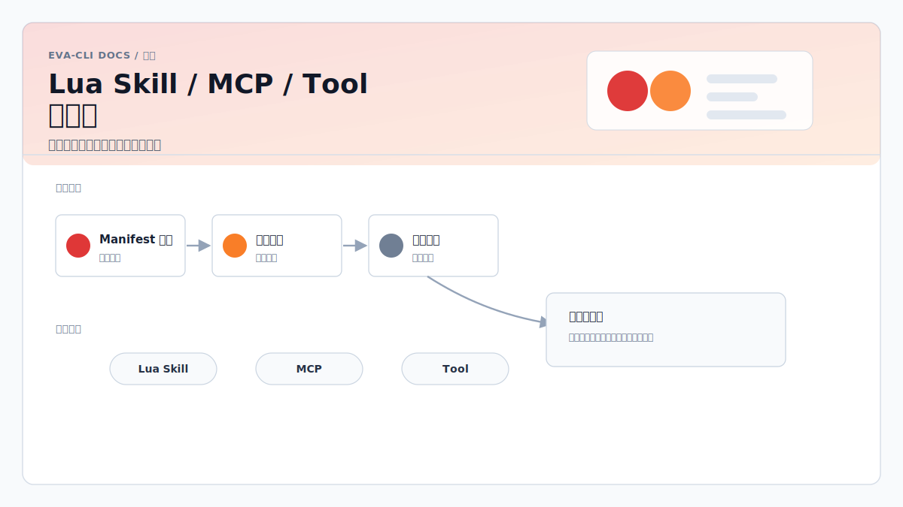

# Eva-CLI Lua 承载 Skill / MCP / Tool 热更新架构方案



更新日期：2026-06-12

文档关系：

- 总体入口：`总体架构方案.md`
- 文档索引：`README.md`
- Topic EventBus 与 Lua Agent 调度核心：`Rust与Lua事件总线智能体调度架构方案.md`
- 动态 Adapter 与 MCP：`Lua调用外部Agent动态Adapter架构方案.md`
- Agent 扫描与发现：`Agent扫描与发现架构方案.md`
- 项目配置体系：`项目配置方案.md`
- 进程级升级与恢复：`进程级停机升级架构方案.md`
- 外接硬件接入与热插拔：`外接硬件接入与热插拔架构方案.md`

## 1. 方案定位

本文补充 Eva-CLI 现有 Rust + Lua + EventBus + Adapter 架构，回答以下问题：

- Skill、MCP、Tool 的实现逻辑是否可以下沉到 Lua。
- 下沉到 Lua 后如何获得热更新能力。
- 哪些能力边界必须继续由 Rust 托管。
- 如何与现有 `SkillAdapter`、`McpAdapter`、Rust Tool Layer 和 AgentDiscoveryService 协同。

总体结论：

- 可以将 **Skill / MCP / Tool 的业务实现层**下沉到 Lua，用 Lua handler 承载可热更新逻辑。
- 不应将 **权限、沙箱、MCP transport、进程生命周期、schema 校验、密钥注入、审计和资源隔离**下沉到 Lua。
- 推荐引入 **Rust Capability Kernel + Lua Capability Runtime** 的双层模型。
- Rust 负责不可绕过的能力边界，Lua 负责可替换的业务逻辑、参数映射、结果转换和轻量编排。
- 热更新采用 generation swap：新 Lua State 先加载、校验、健康检查，再替换 capability generation；失败保留旧版本。

本文不是要替代现有 Adapter 方案，而是在现有 `builtin`、`stdio`、`http`、`eventbus`、`mcp`、`skill`、`hardware` transport 之外，补充一类受控的 Lua capability 实现方式。Lua capability 不承担硬件 raw IO、设备 claim 或热插拔处理；这些边界由 HardwareAdapter 托管。

## 2. 目标与非目标

### 2.1 目标

- 支持项目内 Tool、Skill、MCP tool handler 使用 Lua 编写并热更新。
- 让业务能力更新不必重新编译 Rust 主程序。
- 将 Lua capability 纳入现有 discovery、manifest、schema、policy、registry、audit 和 routing 体系。
- 支持灰度切换、失败回滚、inflight drain 和版本化观测。
- 保持 Lua 无法绕过 Rust 权限边界。
- 保持 MCP、Skill、Tool 对外表现为统一 capability。

### 2.2 非目标

- 不让 Lua 直接执行任意 shell。
- 不让 Lua 直接读取密钥、环境变量或用户目录。
- 不让 Lua 直接启动或连接任意 MCP server。
- 不让 Lua 直接读取或解释任意 `SKILL.md`。
- 不把 Lua handler 作为 Rust 动态库插件的替代 ABI。
- 不允许配置文件把任意脚本自动提升为受信任能力。
- 不让外部 MCP client 绕过 policy 调用内部 Topic 或 Agent。

## 3. 总体架构

```text
          Config / Manifest / Lua File Change
                        |
                        v
             [AgentDiscoveryService]
                        |
                        v
          schema / policy / trust validation
                        |
                        v
             [Capability Registry]
                        |
        +---------------+----------------+
        |                                |
        v                                v
[Rust Capability Kernel]       [Lua Capability Runtime]
        |                                |
        | host API / sandbox             | lua_tool
        | timeout / limits               | lua_skill
        | audit / metrics                | lua_mcp_handler
        | MCP transport                  |
        | Skill trust gate               |
        +---------------+----------------+
                        |
                        v
             Agent / Adapter / MCP calls
```

核心分工：

| 层 | Rust 负责 | Lua 负责 |
| --- | --- | --- |
| Tool | host API、权限、文件/网络/shell 边界、超时、审计 | 纯计算、参数转换、业务编排、结果格式化 |
| Skill | discovery、trust gate、runtime gate、workspace 注入、权限沙箱 | 可执行工作流步骤、领域逻辑、可热更新流程 |
| MCP | JSON-RPC transport、server lifecycle、auth、tools/list、schema、allowlist | MCP tool handler、业务 alias、payload mapping、结果转换 |
| Registry | capability 索引、版本、health、drain、rollback | handler 实现版本 |

## 4. Capability 类型

新增三类 Lua 承载能力。

### 4.1 Lua Tool

Lua Tool 是由 Lua handler 实现的普通工具能力。

适合：

- 文本转换。
- 结构化数据清洗。
- 项目内规则判断。
- 多个受控 host API 的轻量编排。
- provider 无关的业务封装。

不适合：

- 直接访问文件系统、网络、shell 或密钥。
- 长时间后台任务。
- 需要独占 OS 资源的能力。

Lua 调用宿主能力时只能通过 Rust 提供的 `ctx.host.*` API，例如：

```lua
local content = ctx.host.fs_read_text({
  path = request.payload.path
})
```

Rust 必须在 `fs_read_text` 内校验路径、权限、大小限制、超时和审计字段。

### 4.2 Lua Skill

Lua Skill 是项目内显式声明的可执行工作流能力，不等同于 Codex/OMX 的 `SKILL.md`。

推荐将两者区分：

| 类型 | 来源 | 是否适合热更新 | 执行方式 |
| --- | --- | --- | --- |
| Workflow Skill | `~/.codex/skills/*/SKILL.md` 或 OMX skill | 部分支持，依赖 discovery / scan | `SkillAdapter` 受控调用 |
| Lua Skill | `config/skills/*.lua` + manifest | 支持 generation swap | `LuaCapabilityRuntime` 执行 |

Lua Skill 必须具备：

- 固定入口函数。
- 输入 schema。
- 输出 schema。
- runtime gate。
- 权限声明。
- trust source。
- reload 策略。

### 4.3 Lua MCP Handler

Lua MCP Handler 是 Eva-CLI 作为 MCP server 时，对某些 MCP tools 的内部实现。

适合：

- 实现 `agent.explain`、`project.summary`、`config.inspect` 等内部工具。
- 对内部 Adapter 或 Agent 调用做业务级封装。
- 将复杂参数转换为内部 capability 请求。

不适合：

- 让 Lua 直接实现 MCP transport。
- 让 Lua 直接处理外部 client auth。
- 让 Lua 动态决定对外暴露哪些 tools。
- 让 Lua 绕过 tool allowlist 或 resource allowlist。

MCP 对外暴露仍由 Rust 控制：

```text
MCP Client
  -> Rust MCP Server
  -> auth / tool policy / input schema
  -> Lua MCP Handler
  -> Rust host API / AdapterRegistry / EventBus
  -> output schema / audit
  -> MCP result
```

## 5. Manifest 设计

Lua capability 必须由 manifest 显式声明，不通过扫描 `.lua` 文件自动注册。

示例：`config/capabilities/repo-summary.yaml`

```yaml
id: repo-summary
name: Repository Summary
kind: lua_tool
version: 1.2.0

capabilities:
  - repo.summary

lua:
  script: config/tools/repo_summary.lua
  entry: invoke
  health_check: health_check

input_schema: schemas/repo_summary.input.json
output_schema: schemas/repo_summary.output.json

permissions:
  fs:
    read:
      - workspace
    write: []
  network: false
  shell: false
  env: []
  adapters:
    capabilities:
      - repo.file.read

limits:
  timeout_ms: 30000
  max_input_bytes: 65536
  max_output_bytes: 262144
  concurrency: 4

reload:
  hot_reload: true
  strategy: generation_swap
  drain_timeout_ms: 10000
  rollback_on_failure: true

audit:
  log_input: metadata_only
  log_output: metadata_only
```

字段说明：

| 字段 | 含义 |
| --- | --- |
| `id` | 稳定对象 ID，热更新时不变 |
| `kind` | `lua_tool`、`lua_skill`、`lua_mcp_handler` |
| `version` | capability 版本，变更时触发替换流程 |
| `capabilities` | 对 Registry 暴露的 capability 名称 |
| `lua.script` | Lua 文件路径，必须在允许目录内 |
| `lua.entry` | 固定入口函数，Lua 请求不能覆盖 |
| `input_schema` | 请求 schema |
| `output_schema` | 响应 schema |
| `permissions` | Rust host API 权限 |
| `limits` | 超时、大小、并发限制 |
| `reload` | 热更新策略 |
| `audit` | 审计策略 |

## 6. Lua Handler 契约

Lua handler 推荐统一入口：

```lua
function invoke(ctx, request)
  return {
    ok = true,
    result = {
      summary = "..."
    },
    meta = {
      handler_version = "1.2.0"
    }
  }
end

function health_check(ctx)
  return {
    ok = true
  }
end
```

请求结构：

```json
{
  "capability": "repo.summary",
  "provider": "repo-summary",
  "payload": {},
  "context": {
    "workspace": "C:/Users/admin/Desktop/project/Eva-CLI",
    "request_id": "req_001",
    "trace_id": "trace_001",
    "deadline_ms": 30000
  }
}
```

响应结构：

```json
{
  "ok": true,
  "result": {},
  "meta": {
    "handler_version": "1.2.0"
  }
}
```

错误结构：

```json
{
  "ok": false,
  "error": {
    "kind": "InvalidInput",
    "message": "missing payload.path",
    "retryable": false
  }
}
```

Rust 在执行前后必须做：

- input schema 校验。
- policy 校验。
- deadline 注入。
- output schema 校验。
- 错误类型归一化。
- audit log。
- metrics 记录。

## 7. Host API 边界

Lua 不直接访问系统能力，只能调用 Rust 注入的 host API。

推荐最小 API：

```text
ctx.host.fs_read_text(request)
ctx.host.fs_read_json(request)
ctx.host.state_get(request)
ctx.host.state_set(request)
ctx.host.emit_event(request)
ctx.host.invoke_adapter(request)
ctx.host.call_tool(request)
ctx.host.now()
ctx.host.log(level, fields)
```

可选高风险 API：

```text
ctx.host.fs_write_text(request)
ctx.host.http_request(request)
ctx.host.spawn_process(request)
```

高风险 API 默认关闭，必须同时满足：

- manifest 显式声明。
- policy 允许。
- 调用参数符合 schema。
- 路径、URL、command 在 allowlist 内。
- 审计记录 touched paths、target URL 或 command argv。

禁止：

- `os.execute`。
- `io.open` 直连宿主文件系统。
- 读取任意环境变量。
- Lua 动态加载本地二进制库。
- Lua 修改自身 manifest。

## 8. 热更新流程

Lua capability 使用 generation swap。

```text
文件变化 debounce
  -> 构建 discovery snapshot
  -> 解析 manifest
  -> schema 校验
  -> policy 校验
  -> 加载新 Lua State
  -> 绑定受限 host API
  -> 编译 / 初始化 Lua handler
  -> 执行 health_check
  -> 注册新 generation 到 shadow registry
  -> 暂停旧 generation 接收新请求
  -> capability_index 切到新 generation
  -> 旧 generation drain inflight
  -> 释放旧 Lua State
  -> 发布 /capability/reloaded
```

失败处理：

- manifest 解析失败：保留旧 generation。
- schema 校验失败：保留旧 generation。
- policy 校验失败：保留旧 generation，并记录 rejected reason。
- Lua 编译失败：保留旧 generation。
- health check 失败：保留旧 generation。
- 新 generation 运行错误率超过阈值：按 policy 回滚。
- 删除 capability：先从 Router 停止新路由，再 drain inflight，最后 unregister。

版本语义：

```text
capability_id = repo-summary
generation = repo-summary@1.2.0+build.20260612.001
```

所有请求日志必须记录：

- capability id。
- capability name。
- generation。
- Lua script digest。
- manifest digest。
- request id。
- trace id。

## 9. Discovery 与 Registry

AgentDiscoveryService 额外扫描：

```text
config/capabilities/*.yaml
config/tools/*.lua
config/skills/*.lua
config/mcp_handlers/*.lua
schemas/*.json
```

扫描规则：

- 只有 manifest 能注册 capability，裸 `.lua` 文件不能注册。
- manifest 中的 Lua 路径必须在允许目录内。
- symlink 必须规范化，不能越权。
- 同一 `id` 只能存在一个 active generation。
- 同一 capability 名称可以有多个 provider，但必须由 Router 根据 priority 或显式 provider 选择。
- `lua_mcp_handler` 只能注册到 MCP server 暴露表，不能自动注册成普通 Adapter，除非 manifest 明确允许。

Registry 状态：

```text
PendingValidation
ShadowLoaded
Active
Draining
Disabled
Rejected
Unregistered
```

## 10. 与现有 Adapter 的关系

Lua capability 不替代 Adapter，而是成为 AdapterRegistry 可以路由的一种实现来源。

```text
Lua Agent
  -> ctx.tools.invoke_agent
  -> Rust Tool Layer
  -> AdapterRouter
  -> LuaCapabilityAdapter
  -> LuaCapabilityRuntime
```

建议新增内部 Adapter 类型：

```text
LuaCapabilityAdapter
```

它负责把 `AgentInvokeRequest` 转换为 Lua handler 请求，并把 Lua handler 响应转换为 `AgentInvokeResponse`。

与现有 transport 的关系：

| transport | 适合场景 | 热更新方式 |
| --- | --- | --- |
| `builtin` | 稳定核心 Rust 能力 | 重编译 / 重启 |
| `stdio` | 外部 CLI / Agent | 重建进程 runtime |
| `http` | 远程服务 | 配置变更或 endpoint 切换 |
| `eventbus` | 内部 Agent | Agent runtime 热更新 |
| `mcp` | 外部 MCP server | transport 托管，handler 不下沉 |
| `skill` | Codex/OMX workflow skill | discovery / scan / runtime gate |
| `hardware` | 外接硬件设备 | 设备句柄、热插拔和 raw IO 由 Rust 托管 |
| `lua_capability` | 项目内可热更新业务能力 | Lua generation swap |

## 11. MCP 场景落地

### 11.1 Eva-CLI 调用外部 MCP server

外部 MCP server 的 transport 仍由 Rust `McpAdapter` 托管。

Lua 可以参与：

- 业务 alias 到 MCP tool 的映射。
- payload 转换。
- result 归一化。
- fallback 编排。

示例：

```text
Lua business handler
  -> ctx.host.invoke_adapter({
       capability = "mcp.tool.call",
       provider = "github-mcp",
       payload = {
         tool = "create_issue",
         arguments = {...}
       }
     })
```

Lua 不可以：

- 指定 MCP server command。
- 修改 MCP allowlist。
- 直接持有 MCP session。
- 绕过 MCP schema 校验。

### 11.2 Eva-CLI 作为 MCP server

部分 MCP tools 可以由 Lua MCP Handler 实现。

示例 manifest：

```yaml
id: project-summary-mcp
kind: lua_mcp_handler
version: 1.0.0

mcp:
  tool_name: project.summary
  description: Summarize the current Eva-CLI project

lua:
  script: config/mcp_handlers/project_summary.lua
  entry: invoke

input_schema: schemas/mcp.project_summary.input.json
output_schema: schemas/mcp.project_summary.output.json

permissions:
  fs:
    read:
      - workspace
  adapters:
    capabilities:
      - repo.summary
```

对外 `tools/list` 仍由 Rust 生成，并且只能暴露 policy 允许的 tools。

## 12. Skill 场景落地

建议将 Skill 分成三类：

| 类型 | 是否注册为普通 Adapter | 是否允许热更新 | 说明 |
| --- | --- | --- | --- |
| `workflow_skill` | 有 schema 且 policy 允许时可以 | discovery / scan | Codex/OMX skill |
| `runtime_worker` | 不允许 | 不作为普通能力 | team/swarm/ralph 等 runtime-only |
| `lua_skill` | 可以 | generation swap | 项目内可执行 Lua 工作流 |

Lua Skill 示例：

```yaml
id: config-lint-skill
kind: lua_skill
version: 1.0.0

capabilities:
  - workflow.config_lint

lua:
  script: config/skills/config_lint.lua
  entry: invoke
  health_check: health_check

runtime_gate:
  allowed_modes:
    - normal
  disallow_team_worker: true

input_schema: schemas/config_lint.input.json
output_schema: schemas/config_lint.output.json

permissions:
  fs:
    read:
      - workspace
    write: []
  shell: false
  network: false
```

Lua Skill 可以编排多个受控 host API，但不能自行扩大权限。

## 13. Tool 场景落地

Lua Tool 是最优先落地对象，因为它风险小、收益高。

推荐首批能力：

- `repo.summary`
- `config.validate_project`
- `topic.normalize`
- `adapter.result_simplify`
- `prompt.compose`

不推荐首批能力：

- 任意 shell runner。
- 通用 HTTP proxy。
- 通用文件写入工具。
- 密钥读取工具。
- MCP universal proxy。

## 14. 状态与一致性

Lua capability 状态分三类：

| 状态 | 位置 | 热更新策略 |
| --- | --- | --- |
| 请求局部状态 | Lua stack / request context | 请求结束释放 |
| capability 局部缓存 | Lua State | generation 替换时丢弃或迁移 |
| 持久业务状态 | Rust StateStore | 版本化读写 |

规则：

- Lua State 内缓存不能作为唯一真实状态。
- 需要跨 generation 保留的数据必须写入 StateStore。
- StateStore key 应包含 capability id 和 schema version。
- schema 变化需要 migration 或兼容读取。
- hot reload 时不迁移 Lua VM 内部闭包、coroutine 或 userdata。

## 15. 安全策略

关键风险与控制：

| 风险 | 控制 |
| --- | --- |
| Lua 越权读写文件 | host API 路径规范化、allowlist、大小限制 |
| Lua 执行任意命令 | 禁用 shell API，spawn_process 默认关闭 |
| Lua 泄露密钥 | Lua 不直接读取 env，Rust 按 allowlist 注入短期凭证或代理调用 |
| MCP 变成通用代理 | Rust 维护 tool/resource/prompt allowlist |
| Skill 被当任意脚本执行 | manifest + schema + runtime gate + trust source |
| 热更新引入坏版本 | shadow load、health check、错误率回滚 |
| capability 名称劫持 | `id` 唯一、priority policy、显式 provider 优先 |
| 旧请求与新版本混用 | generation 绑定到 request context |
| 审计缺失 | request、generation、digest、host API 调用全部记录 |

Lua sandbox 必须禁用或替换：

```text
os.execute
os.getenv
io.open
package.loadlib
debug
require 任意路径
```

允许 `require` 时只能从 manifest 声明的模块目录加载，并记录 digest。

## 16. 观测与调试

必须记录指标：

- `capability_invocations_total`
- `capability_errors_total`
- `capability_latency_ms`
- `capability_reload_total`
- `capability_reload_failed_total`
- `capability_generation_active`
- `capability_inflight`
- `host_api_calls_total`

必须记录事件：

```text
/capability/loading
/capability/loaded
/capability/reloaded
/capability/reload_failed
/capability/draining
/capability/unregistered
/capability/health_changed
```

调试命令建议：

```text
eva capability list
eva capability inspect <id>
eva capability health <id>
eva capability reload <id>
eva capability explain-rejected <id>
```

## 17. 配置热加载边界

可热加载：

- Lua handler 代码。
- capability enabled。
- capability priority。
- input / output schema 的兼容更新。
- timeout / concurrency 的收敛式调整。
- Lua MCP Handler 的业务逻辑。
- Lua Tool / Lua Skill 的业务逻辑。

需要重建 runtime 或谨慎切流：

- 权限边界扩大。
- host API 类型新增。
- MCP server command 变化。
- Adapter transport 变化。
- endpoint 变化。
- StateStore backend 变化。
- EventBus backend 变化。
- Lua sandbox 配置变化。

权限边界变化建议按以下规则处理：

| 变化 | 策略 |
| --- | --- |
| 权限收窄 | 可以热加载，旧 generation drain 后生效 |
| 权限扩大 | 需要 policy 显式批准，建议 runtime reload 或 blue-green |
| shell/network 从 false 到 true | 不做普通热加载 |
| fs write 新增路径 | 不做普通热加载 |

## 18. 渐进式落地计划

### 阶段 1：Lua Tool

- 新增 `lua_tool` manifest。
- 新增 `LuaCapabilityAdapter`。
- 实现 Lua State generation swap。
- 暴露最小 host API：日志、时间、state read、adapter invoke。
- 完成 schema 校验、audit 和 metrics。

验收：

- 修改 Lua Tool 后无需重启即可生效。
- Lua 编译失败时旧版本继续服务。
- 删除 Tool 时停止新路由并 drain inflight。

### 阶段 2：Lua Skill

- 新增 `lua_skill` kind。
- 支持 runtime gate。
- 支持 workspace read-only 默认权限。
- 支持可选写权限审计。

验收：

- `runtime_worker` 不能注册为普通 Lua Skill。
- Lua Skill 无 schema 时只能 display-only 或 rejected。
- 写 workspace 的 Lua Skill 必须记录 touched paths。

### 阶段 3：Lua MCP Handler

- 新增 `lua_mcp_handler` kind。
- Rust MCP server 从 Registry 读取允许暴露的 Lua MCP tools。
- 支持 `tools/list`、input schema、output schema 和 per-tool policy。

验收：

- 外部 MCP client 只能看到 policy 允许的 Lua MCP tools。
- Lua MCP Handler 不能绕过 Rust MCP auth。
- handler 失败时返回规范 MCP tool error。

### 阶段 4：高级回滚与灰度

- 支持按 workspace / user / request tag 灰度到新 generation。
- 支持错误率自动回滚。
- 支持 reload dry-run。
- 支持 capability dependency graph。

## 19. 设计校验清单

实现前必须确认：

- Lua capability 是否必须有 manifest。
- 所有 Lua 文件路径是否规范化并限制在允许目录。
- input / output schema 是否必填。
- host API 是否最小化。
- shell / network / fs write 是否默认关闭。
- generation 是否进入请求上下文和审计日志。
- 删除 capability 是否先停止新路由。
- 新版本失败时是否保留旧版本。
- MCP handler 是否只能由 Rust MCP server 暴露。
- Skill 是否区分 `workflow_skill`、`runtime_worker` 和 `lua_skill`。

## 20. 结论

Skill、MCP、Tool 的实现逻辑可以下沉到 Lua，但下沉对象应是 **handler / workflow / mapping / orchestration**，不是权限边界和系统集成底座。

推荐架构是：

```text
Rust 托管能力边界
  + Lua 承载可热更新业务实现
  + Manifest / Schema / Policy 显式授权
  + Generation swap 热更新
  + Registry / Audit / Metrics 统一治理
```

这样可以在不重启主程序、不重新编译 Rust 的情况下更新大部分业务能力，同时继续防止 Lua 变成不受控的脚本执行器、MCP 通用代理或任意 Skill 运行器。
