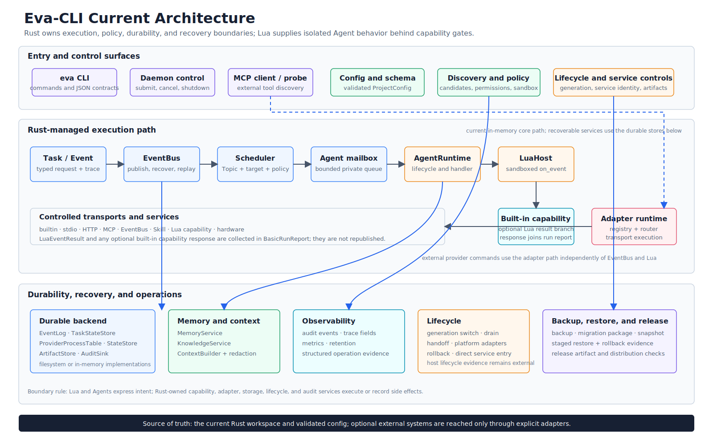

# Architecture Overview

> Language: English
> Published default: `docs/en/architecture/architecture-overview.md`
> Translation: [Simplified Chinese](../../zh-CN/architecture/总体架构方案.md)
> Translation status: current

Updated: 2026-07-13

## 1. Scope And Version Semantics

This document describes the architecture implemented in the current Eva-CLI
workspace. It is a code map, not a target design or delivery plan.

The Cargo version is `1.11.5-alpha`. `V1.17.6` is the name of the V1.x alpha
closure checkpoint exposed by `eva version` and `eva release check`; it is not
a second product version, a release tag, or a production-readiness claim.

Eva-CLI is a local, Rust-controlled runtime and operator CLI for typed events,
bounded Agent execution, controlled Lua handlers, external capability
providers, filesystem durability, recovery evidence, and guarded lifecycle
operations.

## 2. System At A Glance



The implementation is organized around five responsibility planes:

| Plane | Implemented responsibility | Primary crates |
| --- | --- | --- |
| Contracts and control data | IDs, Topic patterns, Event and Invoke contracts, configuration, policy decisions | `eva-core`, `eva-config`, `eva-policy` |
| Local execution | Event publication, Topic routing, bounded mailboxes, Agent lifecycle, controlled Lua `on_event` | `eva-eventbus`, `eva-scheduler`, `eva-agent`, `eva-lua-host` |
| Capability and integration | Capability selection and gates, Adapter transports, MCP, discovery, memory, hardware | `eva-capability`, `eva-adapter`, `eva-mcp`, `eva-discovery`, `eva-memory`, `eva-hardware` |
| Durability and operations | Filesystem state, event/task/provider records, artifacts, backup, restore, upgrade and release evidence | `eva-storage`, `eva-backup`, `eva-lifecycle`, `eva-release` |
| Composition and operator surface | Runtime reports, basic execution, foreground daemon control, diagnostics, stable CLI output | `eva-runtime`, `eva-cli`, root `eva` binary |

`eva-observability` is cross-cutting: it supplies trace fields, audit and metric
contracts, JSONL sinks, a tracing bridge, an OTLP exporter smoke path, and
retention policy enforcement.

## 3. Architecture Decisions

### 3.1 Rust Owns Authority And Side Effects

Rust validates configuration, computes policy, owns queues and lifecycle state,
opens durable stores, invokes providers, applies filesystem mutations, and
records evidence. Lua cannot bypass these boundaries.

### 3.2 Lua Is A Controlled Handler Boundary

Agent scripts implement `on_event(event, ctx)` in a restricted Lua 5.4 VM. The
host exposes read-only event/context tables, host observations, and
`ctx.tools.call` through `CapabilityHostApi`. The VM enables only a small
standard-library set and applies timeout, instruction, cancellation, and memory
limits. It does not expose arbitrary shell, filesystem, network, environment,
or process APIs.

### 3.3 Topic Routing Is Explicit

`Topic` and `TopicPattern` are shared contracts. The Scheduler expands matching
rules into bounded Agent mailbox deliveries. `fanout` selects every listed
Agent; the current `compete` implementation deterministically selects the first
listed Agent. It is not a load balancer.

An explicit `EventTarget::Agent` bypasses Topic rule selection. Capability and
Adapter targets exist in the Event contract and `emit` output, but the current
Scheduler does not turn those target variants into provider invocations.

### 3.4 Durable Means Local Filesystem Durability

The implemented durable backend uses a versioned filesystem layout for event
logs, dead letters, task snapshots, provider process snapshots, audit records,
and artifacts. SQLite remains a placeholder, and no distributed broker or
database-backed state store is implemented.

### 3.5 Composition Is Command-Path Specific

`RuntimeBuilder` builds a `Runtime` containing service summaries from an
already validated `ProjectConfig`. It does not retain a graph of all concrete services. The basic run,
daemon, provider, diagnostics, restore, upgrade, and release paths each compose
the concrete objects they need. Architecture diagrams must not present
`RuntimeBuilder` as a complete dependency-injection container.

## 4. Implemented Runtime Flows

### 4.1 Configuration And CLI Control Flow

```text
eva binary
  -> eva-cli parser and command module
  -> load eva.yaml and configured roots
  -> load Agent / Adapter / Capability manifests, policies and routes
  -> cross-file validation
  -> command-specific runtime or service composition
  -> text or stable JSON envelope + trace + exit code
```

The public command families are `version`, `doctor`, `config`, `inspect`,
`run`, `emit`, `daemon`, `agent`, `capability`, `task`, `adapter`, `mcp`,
`skill`, `discovery`, `memory`, `observability`, `hardware`, `backup`,
`snapshot`, `restore`, `upgrade`, and `release`.

### 4.2 Basic In-Memory Agent Flow

```text
run --example basic
  -> RuntimeBuilder::in_memory_v10
  -> typed Event
  -> InMemoryEventBus publish
  -> SubscriptionTable route and mailbox delivery
  -> AgentRuntime accept and controlled retry loop
  -> LuaHost on_event
  -> builtin CapabilityRouter when ctx.tools.call is used
  -> EventBus ack, or fail + dead letter
  -> TaskReport, Lua observations and audit evidence
  -> optional filesystem task snapshot
```

This path is synchronous and in-process. Its Lua tool host contains the builtin
`config.lint` and `runtime.echo` capabilities; it is not the full external
Adapter provider chain.

### 4.3 External Capability Flow

```text
CLI capability call
  -> CapabilityRegistry and deterministic provider plan
  -> manifest and PermissionSet gate
  -> RuntimePolicyGate
  -> CLI dry-run / operator confirmation gate
  -> AdapterBackedCapabilityHost
  -> AdapterRuntime route
  -> ProviderSupervisor admission and credential scope
  -> builtin | stdio | HTTP | MCP | Skill | hardware transport
  -> bounded and redacted output / artifact
  -> audit, metrics and InvokeResponse
```

The operator-confirmation step belongs to the CLI command path. Other Rust
callers can enter `AdapterBackedCapabilityHost` only after satisfying their own
authorization and execution gates.

Provider fallback is attempted only for failures classified as retryable. The
supervisor records concurrency, rate, circuit, session, health, restart-policy,
and durable process evidence; it is not an OS process manager.

### 4.4 Foreground Daemon And Recovery Flow

```text
daemon start --foreground
  -> filesystem lock and PID/state files
  -> durable backend verification
  -> task, event and provider recovery scan
  -> policy and observability checks
  -> one hotplug reconciliation
  -> memory TTL GC and knowledge rebuild checkpoint
  -> smoke shutdown, or filesystem control-mailbox polling loop
       -> durable dead-letter retry tick
       -> status / submit / cancel / drain / reload / shutdown request
```

Background daemon spawning is not implemented. The daemon does not start
provider processes. A retry tick redrives and routes a due event into temporary
Scheduler mailboxes and records a scheduler acknowledgement; it does not run an
Agent or Lua handler for that delivery.

### 4.5 Guarded Operations Flow

Backup and snapshot commands write artifact-backed evidence. Restore apply uses
an explicit plan, confirmation, policy approval, a filesystem lock,
pre-restore evidence, staged copy/replace/delete operations, a transaction log,
health checks, and a rollback path. Upgrade apply similarly gates release
pointer handoff with policy, lock, health, state-store, runtime-binary, and
rollback evidence.

`release check` aggregates local readiness evidence. It validates evidence; it
does not sign or upload a production release.

## 5. Cross-Cutting Invariants

- Cross-crate IDs, Topics, Events, invokes, and errors come from `eva-core`.
- Configuration discovery is not authorization; authorization is evaluated
  again at the execution boundary.
- Effective permissions may only narrow as policy, manifest, session, and
  request constraints are combined.
- External provider execution and high-risk mutations are deny-first and
  require explicit policy; high-risk CLI apply paths additionally expose
  confirmation and mutation state.
- Queues and provider streams are bounded. Overflow, timeout, cancellation,
  retryability, truncation, and degradation are explicit results.
- Durable mutation records are written through owning storage or operation
  services, not through Event payloads or hidden global state.
- Trace, audit, metrics, and operator evidence must redact credential and memory
  policy values before persistence.
- JSON command contracts are additive: existing public fields are protected by
  golden-subset validation.

## 6. State Ownership

| State | Owner |
| --- | --- |
| Event append/ack/fail and dead-letter redrive | `eva-eventbus` over `eva-storage` |
| Scheduler mailboxes and route expansion | `eva-scheduler` |
| Agent queue and lifecycle | `eva-agent` |
| Lua execution and shadow-load report | `eva-lua-host` |
| Provider admission and session/process evidence | `eva-adapter` and `eva-storage` |
| Memory and knowledge records/checkpoints | `eva-memory` over `eva-storage` layout |
| Hardware lease, permission and hotplug reconciliation | `eva-hardware` |
| Backup/restore transaction evidence | `eva-backup` |
| Generation, handoff, apply lock and rollback | `eva-lifecycle` |
| Daemon control files and runtime recovery coordination | `eva-runtime` |

## 7. Current Capability Boundary

Implemented boundaries include in-memory basic execution, filesystem durable
event/task/provider stores, controlled stdio/plain-HTTP/MCP/Skill provider
execution, simulator-oriented hardware safety, destructive restore with
rollback, release-pointer mutation, JSONL observability, tracing integration,
and explicit OTLP exporter smoke verification.

The following must not be described as implemented production capabilities:

- a background or OS-managed daemon;
- a long-lived general task executor or automatic provider startup;
- balanced `compete` scheduling, async actors, clustering, or a remote broker;
- a production MCP server proxy, OS credential vault, or complete TLS boundary;
- network registry discovery or automatic installation;
- real hardware certification or production hardware drivers;
- SQLite/database state, a production observability database sink, or a
  resident retention scheduler;
- systemd, Windows SCM, or launchd handoff;
- a remote backup transport or production key management;
- production signing, attestation, package-repository publishing, or release
  upload;
- a live atomic Lua VM replacement across a persistent runtime generation.

## 8. V1.17.6 Closure Status

The `REL-V1X-CLOSURE-001` report aggregates daemon, MCP compatibility, provider
supervision, restore, service-manager abstraction, hardware safety,
observability policy, and public JSON contract gates. The current local result
is `ready_with_external_blockers`.

Production signing and attestation credentials, package repository access,
platform service-manager test environments, real or virtual hardware fixtures,
and a production database observability sink remain external blockers. Those
items are recorded, not claimed complete.

For the exact crate graph and ownership table, see
[Module Partitioning](module-partitioning.md). For the shared contract model,
see [eva-core Contract Module](eva-core-module.md).
