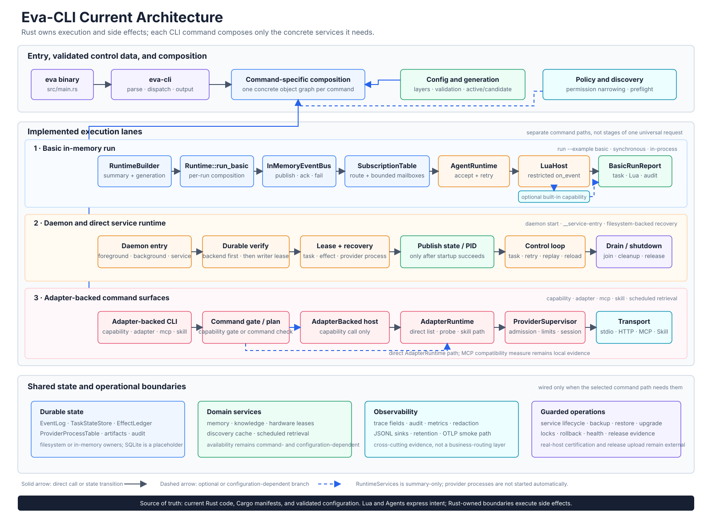

# Architecture Overview

> Language: English
> Published default: `docs/en/architecture/architecture-overview.md`
> Translation: [Simplified Chinese](../../zh-CN/architecture/总体架构方案.md)
> Translation status: current

Updated: 2026-07-31

## 1. Scope And Version Semantics

This document describes the architecture implemented in the current Eva-CLI
workspace. It is a code map, not a target design or delivery plan.

The Cargo version is `1.11.5-alpha`. `V1.17.6` is the name of the V1.x alpha
closure checkpoint exposed by `eva version` and `eva release check`; it is not
a second product version, a release tag, or a production-readiness claim.

Eva-CLI is a local, Rust-controlled runtime and operator CLI for typed events,
bounded Agent execution, controlled Lua handlers, external capability
providers, filesystem durability, recovery evidence, and guarded lifecycle
operations.

## 2. System At A Glance



The implementation is organized around five responsibility planes:

| Plane | Implemented responsibility | Primary crates |
| --- | --- | --- |
| Contracts and control data | IDs, Topic patterns, Event and Invoke contracts, layered configuration, immutable generation identity, policy decisions | `eva-core`, `eva-config`, `eva-policy` |
| Local execution | Event publication, Topic routing, bounded mailboxes, Agent lifecycle, controlled Lua `on_event`, daemon-owned task/replay worker | `eva-eventbus`, `eva-scheduler`, `eva-agent`, `eva-lua-host`, `eva-runtime` |
| Capability and integration | Capability selection and gates, Adapter transports, MCP, discovery, memory, hardware | `eva-capability`, `eva-adapter`, `eva-mcp`, `eva-discovery`, `eva-memory`, `eva-hardware` |
| Durability and operations | Filesystem state, event/task/provider records, effect ledger, artifacts, backup, restore, upgrade and release evidence | `eva-storage`, `eva-backup`, `eva-lifecycle`, `eva-release` |
| Composition and operator surface | Runtime reports, basic execution, config watcher/generation promotion, foreground/background daemon control, scheduled retrieval, direct service entry, diagnostics, stable CLI output | `eva-runtime`, `eva-cli`, root `eva` binary |

`eva-observability` is cross-cutting: it supplies trace fields, audit and metric
contracts, JSONL sinks, a tracing bridge, an OTLP exporter smoke path, and
retention policy enforcement.

`eva-config` loads one base `eva.yaml` plus optional profile, user, and
environment layers. `ConfigGeneration` canonicalizes the merged main config,
split manifests, policies, and routes into a redacted SHA-256 identity. A
daemon watcher may preflight a changed tree, persist a candidate, and promote
it atomically; a rejected candidate leaves the active generation untouched.

### 2.1 Reading The Diagram

The three execution lanes in the diagram are alternative command-level
compositions, not consecutive stages of one request:

- `run --example basic` uses the synchronous in-process EventBus, Scheduler,
  Agent, Lua, and built-in capability path.
- `daemon start` and the hidden direct service entry own filesystem leases,
  recovery, task/replay workers, generation reload, and bounded shutdown.
- `capability call`, scheduled retrieval, and other authorized Rust callers use
  the external capability and Adapter provider path independently of the basic
  EventBus/Lua path.

The lanes share validated configuration, policy contracts, durable state
families, and observability, but sharing a boundary does not make every service
part of every command. Solid arrows show a direct call or state flow; dashed
arrows show an optional or configuration-dependent branch. In particular,
`RuntimeServices` contains `Ready`/`Planned`/`Disabled` summaries only, and does
not prove that a concrete service or provider process is running.

### 2.2 Code Traceability

These path-level anchors keep the overview auditable without relying on line
numbers that drift during refactoring. Cargo manifests remain authoritative for
direct crate dependencies.

| Boundary | Source anchors | Implemented fact |
| --- | --- | --- |
| Process entry and command dispatch | `src/main.rs`, `crates/eva-cli/src/lib.rs`, `crates/eva-cli/src/run.rs` | The root binary delegates to `eva_cli::run`; parsed `Command` variants dispatch to one command module and stable output/exit handling. |
| Configuration and generations | `crates/eva-config/src/lib.rs`, `crates/eva-config/src/layering.rs`, `crates/eva-config/src/routes.rs`, `crates/eva-runtime/src/config_generation.rs`, `crates/eva-runtime/src/config_generation_store.rs`, `crates/eva-runtime/src/config_watcher.rs` | Layered files are loaded and cross-validated before a canonical generation is preflighted, persisted, promoted, or rejected. |
| Basic in-memory execution | `crates/eva-cli/src/run/run_cmd.rs`, `crates/eva-runtime/src/builder.rs`, `crates/eva-runtime/src/runtime.rs`, `crates/eva-runtime/src/basic.rs` | `run --example basic` alone selects `RuntimeBuilder::in_memory_v10` and executes the synchronous basic report path. |
| Routing, Agent, and Lua | `crates/eva-eventbus/src/in_memory.rs`, `crates/eva-scheduler/src/subscription.rs`, `crates/eva-scheduler/src/mailbox.rs`, `crates/eva-agent/src/runtime.rs`, `crates/eva-lua-host/src/vm.rs` | A typed Event is published, expanded into bounded deliveries, accepted by an Agent runtime, and handled inside the restricted Lua VM. |
| Daemon, recovery, and replay | `crates/eva-runtime/src/daemon.rs`, `crates/eva-runtime/src/recovery.rs`, `crates/eva-runtime/src/task_worker.rs`, `crates/eva-runtime/src/scheduler_retry.rs` | The daemon owns leases, control polling, CAS task state, replay dispatch, generation reload, drain, and shutdown coordination. |
| External capability and Adapter command surfaces | `crates/eva-capability/src/registry.rs`, `crates/eva-capability/src/gate.rs`, `crates/eva-adapter/src/capability_host.rs`, `crates/eva-adapter/src/runtime.rs`, `crates/eva-adapter/src/supervisor.rs`, `crates/eva-cli/src/run/capability_cmd.rs`, `crates/eva-cli/src/run/adapter_cmd.rs`, `crates/eva-cli/src/run/mcp_cmd.rs`, `crates/eva-cli/src/run/skill_cmd.rs` | `capability call` uses provider, permission, policy, and confirmation gates; adapter/mcp list/probe and skill paths can enter `AdapterRuntime` directly. `mcp compatibility measure` is a local evidence path, not provider supervision. |
| Durable state ownership | `crates/eva-storage/src/durable_backend.rs`, `crates/eva-storage/src/event_log.rs`, `crates/eva-storage/src/task_state.rs`, `crates/eva-storage/src/effect_ledger.rs`, `crates/eva-storage/src/provider_process.rs` | Filesystem layouts and owning stores persist event, task, effect, provider, audit, and artifact evidence. |
| Service lifecycle and guarded operations | `crates/eva-cli/src/run/service_cmd.rs`, `crates/eva-cli/src/run/daemon_cmd.rs`, `crates/eva-lifecycle/src/service_entry.rs`, `crates/eva-lifecycle/src/service_manager.rs`, `crates/eva-lifecycle/src/service_factory.rs`, `crates/eva-runtime/src/daemon.rs`, `crates/eva-backup/src/`, `crates/eva-release/src/` | Service identity/direct entry, cooperative stop, restore/upgrade gates, rollback, and release evidence are composed by their operator command paths. |

## 3. Architecture Decisions

### 3.1 Rust Owns Authority And Side Effects

Rust validates configuration, computes policy, owns queues and lifecycle state,
opens durable stores, invokes providers, applies filesystem mutations, and
records evidence. Lua cannot bypass these boundaries.

### 3.2 Lua Is A Controlled Handler Boundary

Agent scripts implement `on_event(event, ctx)` in a restricted Lua 5.4 VM. The
host exposes read-only event/context tables, host observations, and
`ctx.tools.call` through `CapabilityHostApi`. The VM enables only a small
standard-library set and applies timeout, instruction, cancellation, and memory
limits. It does not expose arbitrary shell, filesystem, network, environment,
or process APIs.

### 3.3 Topic Routing Is Explicit

`Topic` and `TopicPattern` are shared contracts. The Scheduler expands matching
rules into bounded Agent mailbox deliveries. `fanout` selects every listed
Agent; the current `compete` implementation deterministically selects the first
listed Agent. It is not a load balancer.

An explicit `EventTarget::Agent` bypasses Topic rule selection. Capability and
Adapter targets exist in the Event contract and `emit` output, but the current
Scheduler does not turn those target variants into provider invocations.

### 3.4 Durable Means Local Filesystem Durability

The implemented durable backend uses a versioned filesystem layout for event
logs, dead letters, task snapshots, provider process snapshots, provider
admission/effect records, audit records, and artifacts. Runtime writer
ownership and fenced CAS protect shared records. SQLite remains a placeholder,
and no distributed broker or database-backed state store is implemented.

### 3.5 Composition Is Command-Path Specific

`RuntimeBuilder` builds a `Runtime` containing service summaries and an active
`RuntimeConfigGeneration` from an already validated `ProjectConfig`. The
runtime can atomically promote a preflighted candidate generation, but it does
not retain a graph of every concrete service. The basic run, daemon, provider,
diagnostics, restore, upgrade, and release paths still compose the concrete
objects they need. Architecture diagrams must not present `RuntimeBuilder` as
a complete dependency-injection container.

## 4. Implemented Runtime Flows

Sections 4.2 through 4.4 expand the three separate execution lanes in the
diagram. They reuse shared contracts and stores, but no universal request path
traverses all three lanes.

### 4.1 Configuration And CLI Control Flow

```text
eva binary
  -> eva-cli parser and command module
  -> load eva.yaml and profile/user/environment layers
  -> load Agent / Adapter / Capability manifests, policies and routes
  -> cross-file validation
  -> canonical generation digest + discovery/policy preflight
  -> command-specific runtime or service composition
  -> text or stable JSON envelope + trace + exit code
```

The public command families are `version`, `doctor`, `config`, `inspect`,
`run`, `emit`, `daemon`, `agent`, `capability`, `task`, `adapter`, `mcp`,
`skill`, `discovery`, `memory`, `observability`, `hardware`, `backup`,
`snapshot`, `restore`, `upgrade`, `release`, and `service`.

### 4.2 Basic In-Memory Agent Flow

```text
run --example basic
  -> RuntimeBuilder::in_memory_v10
  -> Runtime summary + active generation snapshot
  -> Runtime::run_basic (per-run composition)
  -> constructs InMemoryEventBus / SubscriptionTable / AgentRuntime / LuaHost
  -> typed Event -> InMemoryEventBus publish
  -> SubscriptionTable route and mailbox delivery
  -> AgentRuntime accept and controlled retry loop
  -> LuaHost on_event
  -> builtin CapabilityRouter when ctx.tools.call is used
  -> EventBus ack, or fail + dead letter
  -> TaskReport, Lua observations and audit evidence
  -> optional filesystem task snapshot
```

This path is synchronous and in-process. Its Lua tool host contains the builtin
`config.lint` and `runtime.echo` capabilities; it is not the full external
Adapter provider chain.

### 4.3 Daemon Task, Replay, And Generation Flow

```text
daemon start --foreground --no-shutdown-after-smoke | --background
  -> durable backend verification
  -> claim daemon/writer lease
  -> effect-aware task + provider-process recovery
  -> policy/observability/hotplug/memory/retrieval startup checks
  -> RuntimeBuilder::new -> runtime summary + active generation snapshot
  -> start paused TaskWorkerRuntime and optional config watcher
  -> publish state/PID/ready only after startup work succeeds
  -> control loop: task claim/heartbeat/finish CAS
  -> scheduler retry tick -> owned replay delivery -> handler -> ACK
  -> config watcher debounce -> candidate preflight -> prepare/promote/retire
  -> bounded drain, worker join, shutdown evidence and lease release
```

The worker is a bounded synchronous-handler executor owned by the daemon; it
is not a distributed queue or an unbounded async task farm. Non-idempotent
handlers use the durable effect ledger. A `Prepared` external effect becomes
an operator-visible interruption rather than an automatic duplicate invocation,
while a `Committed` result can complete a stale task without rerunning it.
The daemon does not eagerly launch provider processes (`provider_processes_started`
remains `false`), but an explicitly configured retrieval schedule can invoke a
provider through the normal Adapter gates. Startup recovery classifies task,
effect, and provider-process records; it does not redrive events. Due
dead-letter replay happens later in the control loop through the scheduler retry
tick.

### 4.4 External Capability And Adapter Flows

```text
CLI capability call
  -> CapabilityRegistry and deterministic provider plan
  -> manifest and PermissionSet gate
  -> RuntimePolicyGate
  -> CLI dry-run / operator confirmation gate
  -> AdapterBackedCapabilityHost
  -> AdapterRuntime route
  -> ProviderSupervisor admission and credential scope
  -> builtin | stdio | HTTP | MCP | Skill | hardware transport
  -> bounded and redacted output / artifact
  -> audit, metrics and InvokeResponse
```

The operator-confirmation step belongs to the CLI command path. Other Rust
callers can enter `AdapterBackedCapabilityHost` only after satisfying their own
authorization and execution gates.

#### 4.4.1 Direct Adapter-Backed Command Surfaces

`adapter list|probe`, `mcp list|probe`, and `skill list|run` load an
`AdapterRuntime` directly. `skill run` applies the `SkillRun` policy gate for a
selected Skill transport before invoking it; the read-only list/probe commands
do not pretend to be capability-provider execution. `mcp compatibility measure`
is a sealed local loopback evidence producer and does not enter
`AdapterRuntime` or start a provider.

Provider fallback is attempted only for failures classified as retryable. The
supervisor records concurrency, rate, circuit, session, health, restart-policy,
and durable process evidence; it is not an OS process manager.

### 4.5 Daemon Modes And Recovery Flow

```text
daemon start --foreground | --background | direct service entry
  -> durable backend verification and daemon lease
  -> startup recovery: task/effect/provider-process records
  -> policy, observability, hotplug, memory, and retrieval checks
  -> publish state/PID only after startup completes
  -> filesystem control-mailbox polling loop
       -> status / submit / cancel / drain / reload / shutdown request
       -> due dead-letter retry tick -> daemon-owned task worker
```

Foreground mode keeps the current process; background mode uses a separate
parent/child startup handshake. The direct service entry claims the daemon lease
in the service process and never uses the background child entrypoint. All modes
publish usable state only after startup work completes, do not eagerly start
provider processes, and redrive due events only inside the control loop; replay
is ACKed after the bound handler succeeds. The persistent loop also runs
scheduled memory maintenance/retrieval and, when enabled, config watcher
preflight.

### 4.6 Direct OS Service Entry Flow

```text
eva service install/start
  -> canonical executable + native argv + working directory
  -> service kind/name + stable identity digest
  -> Windows SCM | systemd | launchd adapter
  -> hidden daemon __service-entry
  -> validate project, host kind, service name and identity
  -> directly claim the daemon PID/lease; no second spawn
  -> SCM control or Unix signal sets an atomic stop token
  -> existing Shutdown request -> task drain -> stopped/PID cleanup/lease release
```

This is an implemented code contract, not production-host certification. The
signal/SCM callback does not perform runtime work; it only requests cooperative
stop, and the daemon loop owns the generation-bound drain/shutdown transaction.
Controlled real-host stop/boot/reboot transcripts, a destructive lifecycle
harness, and a production release gate are still required.

### 4.7 Guarded Operations Flow

Backup and snapshot commands write artifact-backed evidence. Restore apply uses
an explicit plan, confirmation, policy approval, a filesystem lock,
pre-restore evidence, staged copy/replace/delete operations, a transaction log,
health checks, and a rollback path. Upgrade apply similarly gates release
pointer handoff with policy, lock, health, state-store, runtime-binary, and
rollback evidence.

`release check` aggregates local readiness evidence. It validates evidence; it
does not sign or upload a production release.

## 5. Cross-Cutting Invariants

- Cross-crate IDs, Topics, Events, invokes, and errors come from `eva-core`.
- Configuration discovery is not authorization; authorization is evaluated
  again at the execution boundary.
- Effective permissions may only narrow as policy, manifest, session, and
  request constraints are combined.
- External provider execution and high-risk mutations are deny-first and
  require explicit policy; high-risk CLI apply paths additionally expose
  confirmation and mutation state.
- Queues and provider streams are bounded. Overflow, timeout, cancellation,
  retryability, truncation, and degradation are explicit results.
- Durable mutation records are written through owning storage or operation
  services, not through Event payloads or hidden global state.
- Trace, audit, metrics, and operator evidence must redact credential and memory
  policy values before persistence.
- JSON command contracts are additive: existing public fields are protected by
  golden-subset validation.

## 6. State Ownership

| State | Owner |
| --- | --- |
| Event append/ack/fail and dead-letter redrive | `eva-eventbus` over `eva-storage` |
| Scheduler mailboxes and route expansion | `eva-scheduler` |
| Agent queue and lifecycle | `eva-agent` |
| Lua execution and shadow-load report | `eva-lua-host` |
| Provider admission and session/process evidence | `eva-adapter` and `eva-storage` |
| Memory and knowledge records/checkpoints | `eva-memory` over `eva-storage` layout |
| Hardware lease, permission and hotplug reconciliation | `eva-hardware` |
| Backup/restore transaction evidence | `eva-backup` |
| Generation, handoff, apply lock, rollback, service definition and OS-stop bridge | `eva-lifecycle` |
| Daemon control files, direct service mode, drain/shutdown and runtime recovery coordination | `eva-runtime` |
| Layered configuration, canonical generation digest and field provenance | `eva-config` and `eva-runtime` |
| Daemon task claims, heartbeats, effect-aware replay and bounded worker drain | `eva-runtime` over `eva-storage` |
| MCP session/stream/server lifecycle and compatibility receipts | `eva-mcp` (invoked by `eva-adapter`) |

## 7. Current Capability Boundary

Implemented boundaries include in-memory basic execution, a daemon-owned
filesystem task worker with heartbeat/CAS/effect recovery, filesystem durable
event/task/provider stores, layered config generation preflight/promotion,
controlled stdio/plain-HTTP/MCP/Skill provider execution, a bounded loopback
MCP server surface, simulator-oriented hardware safety, destructive restore
with rollback, release-pointer mutation, JSONL observability, tracing
integration, explicit OTLP exporter smoke verification, host-bound service
adapters, and an identity-bound hidden direct daemon entrypoint whose stop
token reuses the existing drain/shutdown transaction.

The following must not be described as implemented production capabilities:

- an OS-managed daemon certified by real-host stop/boot/reboot evidence, a
  destructive lifecycle harness, and a production release gate;
- an unbounded/distributed task executor, automatic provider startup, or
  arbitrary handler cancellation;
- balanced `compete` scheduling, async actors, clustering, or a remote broker;
- a remotely exposed production MCP server, production credential vault, or
  complete production TLS/identity boundary;
- network registry discovery or automatic installation;
- real hardware certification or production hardware drivers;
- SQLite/database state, a production observability database sink, or a
  resident retention scheduler;
- verified systemd, Windows SCM, or launchd lifecycle recovery and real
  blue-green handoff;
- a remote backup transport or production key management;
- production signing, attestation, package-repository publishing, or release
  upload;
- a live atomic Lua VM replacement across a persistent runtime generation.

## 8. V1.17.6 Closure Status

The `REL-V1X-CLOSURE-001` report aggregates daemon, MCP compatibility, provider
supervision, restore, service-manager abstraction, hardware safety,
observability policy, and public JSON contract gates. The current local result
is `ready_with_external_blockers`.

Production signing and attestation credentials, package repository access,
platform service-manager test environments for destructive stop/boot/reboot
evidence, real or virtual hardware fixtures, and a production database
observability sink remain external blockers. The direct-entry code contract is
recorded separately and does not close those production gates.

For the exact crate graph and ownership table, see
[Module Partitioning](module-partitioning.md). For the shared contract model,
see [eva-core Contract Module](eva-core-module.md).
