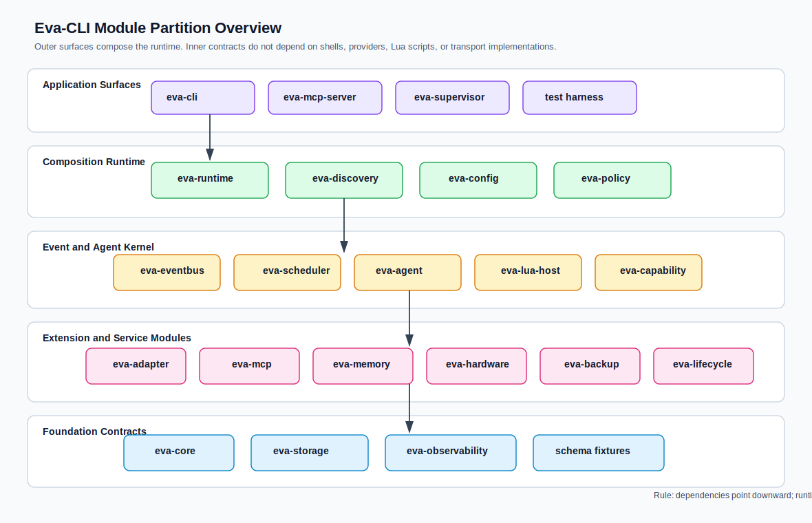
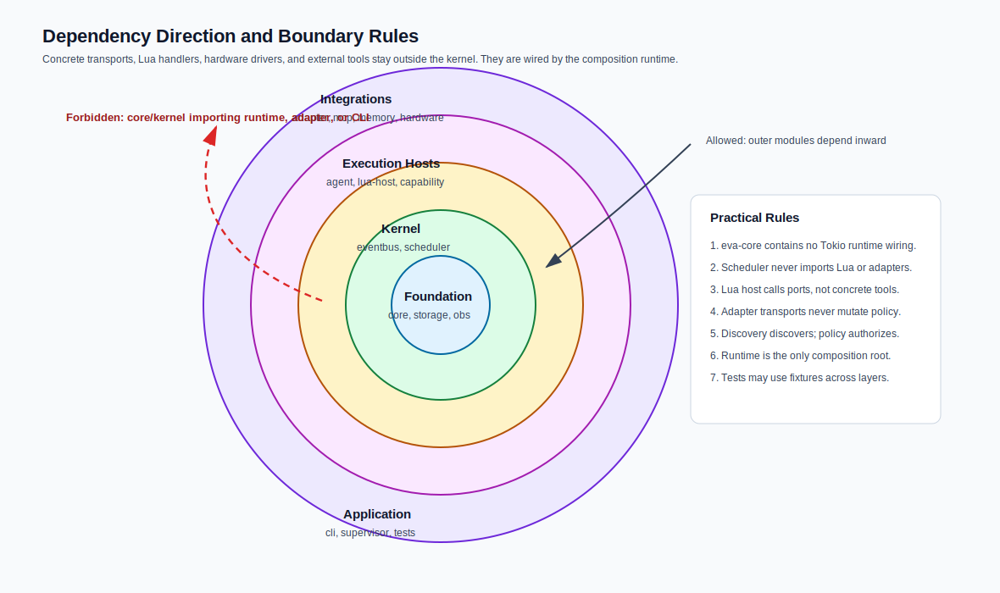
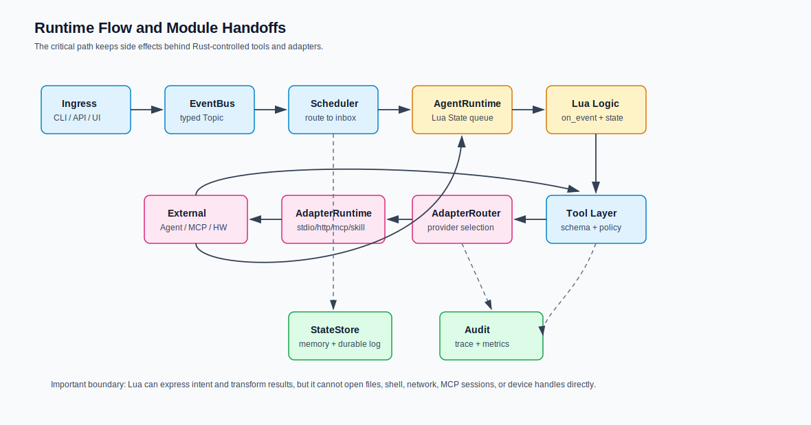

# Module Partitioning

> Language: English
> Published default: `docs/en/architecture/module-partitioning.md`
> Translation: [Simplified Chinese](../../zh-CN/architecture/模块划分方案.md)
> Translation status: current

Updated: 2026-07-20

## 1. Scope

This document records the module boundaries and direct internal dependencies of
the current Eva-CLI Rust workspace. It describes the implementation at Cargo
version `1.11.5-alpha`, including the `V1.17.6` alpha closure gate. It is not a
future workspace proposal.

The `crates/` directory contains exactly 20 workspace crates. Cargo also
includes the root `eva` package, a thin binary package that depends on
`eva-cli`; it is not an additional architecture domain.

## 2. Partitioning Rules

- Put shared value contracts in `eva-core`; keep it dependency-free.
- Load and normalize configuration in `eva-config`; evaluate execution policy
  in `eva-policy`.
- Keep publication, routing, Agent queues, and Lua execution as separate
  boundaries.
- Route external side effects through capability and Adapter gates.
- Let each durable state family have an explicit owner; do not use EventBus as
  a general state store.
- Keep operational mutation in backup/lifecycle services and expose it through
  guarded CLI paths.
- Treat `eva-runtime` and `eva-cli` as composition surfaces, not foundation
  libraries.
- Read the Cargo graph as a DAG with cross-links, not as a strict stack.

## 3. Workspace Overview



```text
eva -> eva-cli

contracts:       eva-core
control:         eva-config, eva-policy
cross-cutting:   eva-observability, eva-storage
execution:       eva-eventbus, eva-scheduler, eva-agent, eva-lua-host
integration:     eva-capability, eva-adapter, eva-mcp, eva-discovery,
                 eva-memory, eva-hardware
operations:      eva-backup, eva-lifecycle, eva-release
composition:     eva-runtime, eva-cli
```

These labels aid reading only. Direct Cargo dependencies in the next section
are authoritative.

## 4. Crate Inventory And Direct Dependencies

| Crate | Owns | Direct Eva dependencies | Does not own / current boundary |
| --- | --- | --- | --- |
| `eva-core` | ID newtypes, Topic and TopicPattern, Event, capability reference, Invoke contracts, structured errors | none | I/O, configuration loading, routing, persistence, execution |
| `eva-config` | `eva.yaml`, configured roots, Agent/Adapter/Capability manifests, policy documents, routes, schema and cross-file validation | `eva-core` | runtime authorization or side effects |
| `eva-policy` | permission sets, effective-policy intersection, sandbox policy, typed high-risk runtime decisions | `eva-config`, `eva-core` | provider execution, storage, discovery scanning |
| `eva-observability` | trace fields, audit and metric contracts, in-memory/JSONL sinks, tracing bridge, OTLP smoke exporter, retention policy | `eva-core` | business routing, task execution, production database sink |
| `eva-storage` | in-memory/filesystem state, event log, task snapshots, provider process table, audit and artifact stores, durable layout | `eva-core`, `eva-observability` | SQLite/database implementation; `sqlite.rs` is a placeholder |
| `eva-eventbus` | synchronous publish/ack/fail contract, in-memory and filesystem durable buses, dead letters and redrive | `eva-core`, `eva-observability`, `eva-storage` | Topic subscription selection or Agent execution |
| `eva-scheduler` | Topic matching, fanout/compete planning, bounded mailbox registry, generation route gate, retry dispatch helpers | `eva-core`, `eva-observability`, `eva-policy` | Lua execution, provider invocation, durable event ownership |
| `eva-agent` | Agent lifecycle, bounded FIFO queue, controlled handler retries/timeouts/cancellation, read-only Agent state snapshots | `eva-config`, `eva-core`, `eva-observability`, `eva-policy`, `eva-scheduler`, `eva-storage` | durable task persistence, Lua VM internals or external transports |
| `eva-lua-host` | Lua script loading, restricted VM, host bindings, execution limits, shadow-load reports | `eva-capability`, `eva-config`, `eva-core`, `eva-memory`, `eva-observability`, `eva-policy` | arbitrary shell/filesystem/network access; live process-wide VM swap |
| `eva-capability` | capability registry, deterministic provider plan, permission gate, host API, builtin capability router, generation marker | `eva-config`, `eva-core`, `eva-observability`, `eva-policy` | concrete external transports and provider supervision |
| `eva-adapter` | Adapter handles/registry/router, provider supervisor, credential scope, stream capture, builtin/stdio/HTTP/MCP/Skill/hardware transports | `eva-capability`, `eva-config`, `eva-core`, `eva-hardware`, `eva-mcp`, `eva-observability`, `eva-policy`, `eva-storage` | discovery scanning, global scheduling, OS process management |
| `eva-mcp` | allowlists, tool mapping, JSON-RPC client, stdio/HTTP calls, session and stream lifecycle records, compatibility matrix, minimal server tool gate | `eva-core`, `eva-observability`, `eva-policy` | unrestricted proxy or production resident MCP server |
| `eva-discovery` | normalized candidates, trust/health reports, project/PATH/MCP/OMX/Codex/registry-config sources, in-memory incremental cache | `eva-config`, `eva-core`, `eva-observability`, `eva-policy` | authorization, network registry crawling, automatic installation |
| `eva-memory` | private/global memory, knowledge records, context building, filesystem durability, TTL GC, rebuild checkpoint, retrieval and redaction evidence | `eva-capability`, `eva-core`, `eva-observability`, `eva-policy`, `eva-storage` | vector database or resident production retrieval scheduler |
| `eva-hardware` | manifest-derived discovery, device/lease registry, simulator drivers, OS permission gate, lifecycle and hotplug EventBus publication | `eva-config`, `eva-core`, `eva-eventbus`, `eva-observability`, `eva-policy` | certified real hardware drivers or fixtures |
| `eva-backup` | backup scope/manifest, artifact archives, migration package, release snapshots, restore planning, staged file mutation and rollback | `eva-core`, `eva-observability`, `eva-policy`, `eva-storage` | remote backup upload or production key management |
| `eva-lifecycle` | generation/drain state, upgrade apply locks, supervisor handoff, release-pointer state, rollback, typed service-manager contract, Windows Service/systemd/launchd adapters, canonical direct-service argv identity, and the cooperative signal/SCM stop bridge | `eva-backup`, `eva-core`, `eva-observability`, `eva-policy` | controlled real-host stop/boot/reboot transcripts, destructive lifecycle harness certification, production gate, or blue-green traffic switching; the Fake adapter remains test-only |
| `eva-release` | release readiness gates, artifact/distribution/scanner/benchmark verification, security/performance/migration reports, V1.x closure report | `eva-core`, `eva-mcp`, `eva-storage` | signing credentials, repository publishing or release upload |
| `eva-runtime` | service summaries, basic run composition, foreground/background daemon control, direct service mode, durable recovery/diagnostics, scheduler retry tick, generation-bound drain/shutdown, runtime task reports | `eva-adapter`, `eva-agent`, `eva-backup`, `eva-capability`, `eva-config`, `eva-core`, `eva-discovery`, `eva-eventbus`, `eva-hardware`, `eva-lifecycle`, `eva-lua-host`, `eva-mcp`, `eva-memory`, `eva-observability`, `eva-policy`, `eva-scheduler`, `eva-storage` | release-gate aggregation; a persistent container holding every service |
| `eva-cli` | public command parser/dispatch, service lifecycle commands, hidden identity-bound service entry validation, text and JSON writers, trace/exit-code mapping, command-specific composition and operator gates | `eva-adapter`, `eva-agent`, `eva-backup`, `eva-capability`, `eva-config`, `eva-core`, `eva-discovery`, `eva-eventbus`, `eva-hardware`, `eva-lifecycle`, `eva-mcp`, `eva-memory`, `eva-observability`, `eva-policy`, `eva-release`, `eva-runtime`, `eva-storage` | shared domain contracts or a generic long-lived task executor |

## 5. Dependency Graph



The direct dependency graph is acyclic, but deliberately not purely layered:

```text
eva-core
  <- eva-config
  <- eva-observability

eva-config + eva-core
  <- eva-policy

eva-core + eva-observability
  <- eva-storage

eva-eventbus  -> eva-core + eva-observability + eva-storage
eva-scheduler -> eva-core + eva-observability + eva-policy
eva-capability -> eva-config + eva-core + eva-observability + eva-policy
eva-mcp       -> eva-core + eva-observability + eva-policy
eva-discovery -> eva-config + eva-core + eva-observability + eva-policy
eva-backup    -> eva-core + eva-observability + eva-policy + eva-storage

eva-agent     -> eva-config + eva-core + eva-observability + eva-policy
                 + eva-scheduler + eva-storage
eva-memory    -> eva-capability + eva-core + eva-observability
                 + eva-policy + eva-storage
eva-hardware  -> eva-config + eva-core + eva-eventbus
                 + eva-observability + eva-policy
eva-lifecycle -> eva-backup + eva-core + eva-observability + eva-policy
eva-release   -> eva-core + eva-mcp + eva-storage

eva-lua-host  -> eva-capability + eva-config + eva-core + eva-memory
                 + eva-observability + eva-policy
eva-adapter   -> eva-capability + eva-config + eva-core + eva-hardware
                 + eva-mcp + eva-observability + eva-policy + eva-storage

eva-runtime   -> runtime domains, excluding eva-release
eva-cli       -> operator-facing domains + eva-runtime + eva-release
```

Important consequences:

- `eva-hardware -> eva-eventbus` exists because hotplug publication is part of
  the hardware boundary.
- `eva-memory -> eva-capability` exists because supervised retrieval uses the
  capability host contract.
- `eva-adapter -> eva-hardware + eva-mcp` exists because those are concrete
  Adapter transports.
- `eva-release` is consumed directly by `eva-cli`, not by `eva-runtime`.
- `eva-cli` does not directly depend on `eva-scheduler` or `eva-lua-host`; those
  enter its basic/daemon flows through `eva-runtime`.
- No lower-level crate depends on `eva-runtime` or `eva-cli`.

## 6. Runtime Handoffs



There is no single universal call chain. Three handoff paths are implemented.

### 6.1 Basic Event Path

```text
eva-cli
  -> eva-config
  -> eva-runtime basic composition
  -> eva-eventbus
  -> eva-scheduler mailbox
  -> eva-agent
  -> eva-lua-host
  -> eva-capability builtin host
  -> ack/fail + task/audit report
```

### 6.2 External Provider Path

```text
eva-cli or CapabilityHostApi caller
  -> eva-capability provider plan and permission gate
  -> eva-policy runtime gate
  -> eva-adapter router and supervisor
  -> stdio | HTTP | MCP | Skill | hardware transport
  -> eva-storage artifact/provider evidence
  -> eva-observability
```

### 6.3 Durable Operations Path

```text
eva-cli
  -> eva-runtime daemon/recovery, or eva-backup/eva-lifecycle operation
  -> eva-storage filesystem backend
  -> policy + confirmation + lock + health gate
  -> mutation/recovery/rollback evidence
  -> eva-release readiness aggregation when requested
```

`RuntimeBuilder` participates in inspection and basic/daemon summaries, but
concrete stores, buses, supervisors, and operation coordinators are opened by
the command path that uses them.

### 6.4 Direct Service Path

```text
eva-cli service install/start
  -> eva-lifecycle platform adapter + canonical argv identity
  -> hidden eva-cli daemon service entry
  -> eva-runtime direct daemon lease/PID ownership
  -> eva-lifecycle atomic OS-stop token
  -> eva-runtime existing Shutdown drain transaction
```

The service process does not spawn a second daemon. Code tests cover identity
drift and drain cleanup; real-host destructive lifecycle and boot/reboot
evidence remain outside the crate graph.

## 7. Cross-Crate Invariants

### 7.1 Contract Invariant

Cross-crate Event, Topic, ID, Invoke, and Error shapes are owned by `eva-core`.
Provider-private protocol values must be translated at Adapter/MCP boundaries.

### 7.2 Policy Invariant

Discovery and manifest loading never grant execution by themselves. Effective
permissions only narrow. High-risk actions require runtime policy, and
operator-facing apply paths retain dry-run/confirmation and execution-state
fields.

### 7.3 State Invariant

Mailbox state belongs to Scheduler/Agent, event recovery to EventBus, durable
records to Storage, provider state to Adapter, memory data to Memory, hardware
leases to Hardware, and generation/handoff state to Lifecycle. State must not
move into hidden globals or Event payloads for convenience.

### 7.4 Failure And Observability Invariant

Cross-crate failures use `EvaError` with stable kind, retryability, optional
provider code, and context. Bounded-resource failure, degraded observability,
redaction, mutation execution, and rollback requirements remain explicit in
reports.

## 8. Implemented Boundary Versus Production Blockers

Implemented code includes filesystem durability, foreground/background daemon
control, an identity-bound direct service entrypoint, controlled external
provider execution, MCP compatibility fixtures, simulator hardware safety,
destructive restore/rollback, JSONL observability, and local release evidence
gates.

The crate graph does not imply that the following are complete: production-
certified OS service supervision with real-host stop/boot/reboot evidence and a
destructive harness, a live general task executor, balanced scheduling,
production MCP serving/TLS/vault isolation, real hardware integration,
SQLite/database storage, production database observability, blue-green service
handoff, remote backup, production signing, package repositories, or release
upload. The V1.17.6 closure report records these as external or later production
boundaries rather than hiding them behind module names.

## 9. Summary

The 20 crates under `crates/` separate contracts, control, execution,
integration, durability, operations, and operator composition while allowing
explicit cross-links required by real behavior. Cargo manifests, not a
simplified layer diagram, are the source of truth for dependency direction.
