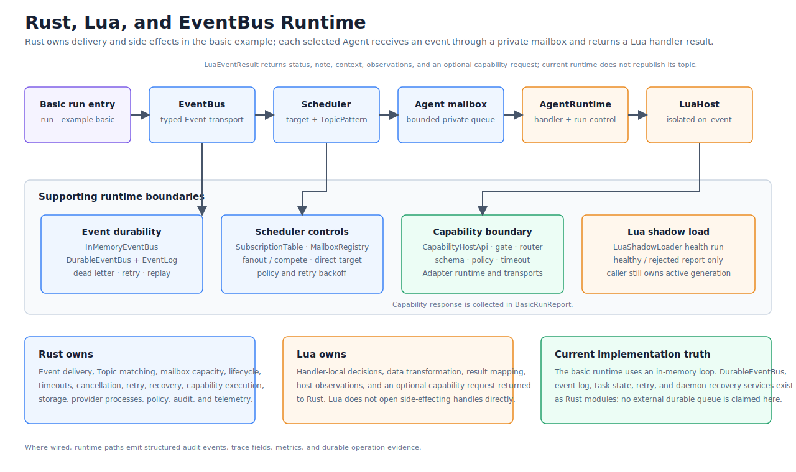

# Single-Process Rust, Lua, and EventBus Runtime

> Language: English
> Published default: `docs/en/architecture/rust-lua-eventbus-scheduler.md`
> Translation: [Simplified Chinese](../../zh-CN/architecture/Rust与Lua事件总线智能体调度架构方案.md)
> Translation status: current

Updated: 2026-07-13

## Purpose

This document describes the runtime path that exists in the repository today.
Eva-CLI validates project configuration, records typed Topic events, expands
explicit routing rules into bounded Agent mailboxes, and runs Lua 5.4
`on_event` handlers behind Rust-controlled host APIs.

The current data plane is synchronous and single-process. It is not a Tokio
task-per-Agent runtime, a network EventBus, or a distributed Scheduler. Those
shapes are outside the implemented contract.

## Implemented Architecture



The main ownership boundaries are:

| Crate | Implemented responsibility |
| --- | --- |
| `eva-core` | Typed `Event`, `Topic`, target, payload, metadata, IDs, invoke, and error contracts |
| `eva-eventbus` | In-memory and filesystem-backed event logs, receipts, acknowledgements, failures, dead letters, and redrive |
| `eva-scheduler` | Ordered Topic rule matching and delivery planning into bounded mailboxes |
| `eva-agent` | Synchronous Agent lifecycle, bounded FIFO queue, retry/cancel/timeout records, and handler boundary |
| `eva-lua-host` | Controlled Lua 5.4 loading, `on_event`, host bindings, resource limits, and shadow-load primitives |
| `eva-runtime` | Configuration composition, the one-shot basic loop, durable recovery services, and foreground daemon control |

`eva-adapter`, `eva-capability`, `eva-memory`, and the observability crates are
reached through controlled Rust APIs. Lua does not receive their concrete file,
process, network, credential, or device handles.

## Event Contract

The shared event contract is conceptually:

```text
Event
  event_id: EventId
  topic: Topic
  target: EventTarget
  payload: EventPayload
  metadata: EventMetadata
```

- `EventPayload` is `Empty`, UTF-8 `Text`, or `Bytes`.
- `EventTarget` can be broadcast, Agent, Capability, or Adapter. Only an
  explicit Agent target bypasses normal Scheduler Topic expansion.
- `EventMetadata` carries creation time, optional request ID, correlation and
  causation IDs, and an optional generation ID.
- The current event contract has no source or priority field and does not carry
  an arbitrary JSON value as its native payload.

Concrete Topics must begin with `/`, contain at least one non-empty segment,
must not end with `/`, and cannot contain wildcards. Patterns additionally
support `*` for exactly one segment and `**` for zero or more trailing segments;
`**` is valid only as the final segment.

## Publish and Delivery Flow

The one-shot runtime flow is:

```text
validated ProjectConfig
  -> construct Event
  -> EventBus.publish and return EventReceipt
  -> SubscriptionTable.route
  -> MailboxRegistry bounded FIFO
  -> AgentRuntime bounded FIFO
  -> LuaHost.run_on_event
  -> EventBus.ack or EventBus.fail + dead letter
  -> task, trace, and audit evidence
```

The EventBus records events; it does not choose an Agent. `SubscriptionTable`
performs routing, and `MailboxRegistry` owns the Scheduler-side queue. The basic
loop then drains one mailbox entry into the selected `AgentRuntime` and invokes
the handler synchronously.

Both mailbox layers use bounded `VecDeque` storage. Queue overflow returns a
structured unavailable error. There is no background dispatcher or implicit
parallel execution in this path.

## EventBus Backends

| Backend | Persistence | Current use |
| --- | --- | --- |
| `InMemoryEventBus` | Process memory only; includes an in-memory event log and dead-letter queue | `run --example basic` and `emit` without `--durable-backend` |
| `DurableEventBus` | Filesystem event log and filesystem dead-letter records under `DurableBackendLayout` | `emit --durable-backend`, durable inspection, recovery, and redrive paths |

Both implementations expose publish, ack, and fail through the `EventBus`
trait. The durable implementation can reopen records and persist dead-letter
redrive state. Neither implementation is an external message broker, and the
repository does not currently integrate Redis Streams, NATS, Kafka, RabbitMQ,
or PostgreSQL as an EventBus backend.

## Scheduler Semantics

Scheduler rules are loaded from the configured Topic route file and preserve
file order.

1. An `EventTarget::Agent` creates one direct delivery and skips Topic rules.
2. Otherwise every route whose `TopicPattern` matches the event is expanded.
3. `fanout` creates one delivery for every Agent listed by that rule.
4. `compete` currently creates one delivery for the first Agent listed by that
   rule.
5. No matching rule returns a structured not-found error.

Exact patterns do not suppress matching wildcard rules; all matching rules are
expanded in source order. Current routing does not score priority, load,
latency, or health, and `compete` is not round-robin or load-balanced.

## Lua 5.4 Boundary

`eva-lua-host` embeds vendored Lua 5.4 through `mlua`. Each invocation creates a
controlled VM with only the table, string, UTF-8, and math standard libraries.
The OS, I/O, package, and debug libraries are not loaded, `rawset` is removed,
and a pre-load policy rejects `os.execute`, `io.popen`, `require`, `dofile`, and
`loadfile` tokens.

Lua receives read-only `event` and `ctx` tables. The implemented host surface
includes:

- `ctx.tools.call(capability, input)` through a configured
  `CapabilityHostApi`;
- `ctx.host.log` and `ctx.host.audit` with traceable observations;
- request, trace, and read-only memory/context snapshots.

`on_event` must return a table. Rust normalizes it into `LuaEventResult` with
status, Topic, optional note, and optional capability request fields. There is
no current `ctx.emit` binding and no async Rust Future/Lua coroutine contract.

Lua execution can be constrained by wall-clock timeout, instruction budget,
memory limit, and a cancellation token. VM hooks can interrupt Lua code. The
outer synchronous `AgentRuntime` records retry, cancellation, and elapsed-time
timeout outcomes; it does not preempt an arbitrary blocking Rust handler.

## Basic and Daemon Boundaries

| Surface | What it executes | Important boundary |
| --- | --- | --- |
| `eva run --example basic` | Loads `examples/basic`, builds `in_memory_v1.0`, publishes one event, expands routes, runs selected Lua handlers sequentially, records ack/failure/dead letters, and writes a task report | Always uses `InMemoryEventBus`; `--durable-backend` selects durable task-report storage, not a durable EventBus for this loop |
| `eva emit <topic>` | Publishes one typed event and returns its receipt | Uses `InMemoryEventBus` by default or `DurableEventBus` when `--durable-backend` is supplied; it does not run the Scheduler or an Agent |
| `eva daemon start --foreground` | Verifies the durable backend, recovery, policy, observability, hardware, and maintenance boundaries, then builds a Runtime | Background spawning is unsupported; default start is a smoke run that shuts down |
| Foreground daemon with `--no-shutdown-after-smoke` | Polls a filesystem control mailbox, runs durable retry ticks, and records status, shutdown, task submit/cancel, Agent drain, and reload-plan mutations | It is a local control/recovery loop, not a concurrent Agent execution host; the start report explicitly records that provider processes were not started |

Agent drain and reload commands can persist daemon control evidence. The Lua
shadow loader and generation route gate can validate a candidate generation and
retain the active generation on failure. These are explicit primitives, not an
automatic Lua file watcher or an automatic live replacement of Topic routes.

## Reliability and Observability

- Event publication returns a sequence-bearing receipt.
- Ack and fail update the event-log record for an Agent consumer.
- Handler failures can be recorded as dead letters and redriven with a new
  replay event ID.
- The basic loop supports an immediate retry-attempt count, cancellation, Lua
  limits, task logs, and in-memory audit observations.
- Durable retry scheduling and daemon ticks use explicit retry/backoff records;
  they do not imply a distributed queue.
- Request, event, generation, correlation, causation, Agent, capability, error,
  and audit fields are preserved where the corresponding operation supplies
  them.

## Explicit Non-Capabilities

The current architecture does not claim:

- a Tokio task, Lua state, or OS process per Agent;
- a distributed Scheduler or external durable EventBus;
- priority- or load-based Agent selection;
- automatic route generation from Agent subscriptions;
- automatic route-table hot replacement after editing YAML;
- background daemon spawning; or
- provider process startup as part of the current daemon start path.

## Verification Entry Points

```text
eva config validate
eva run --example basic
eva emit /input/user
eva emit /input/user --durable-backend <path>
eva daemon start --foreground
```

The basic command is the executable end-to-end scheduling example. `emit` is an
EventBus publication check, and daemon commands verify the separate local
process-control and durable recovery boundary.
