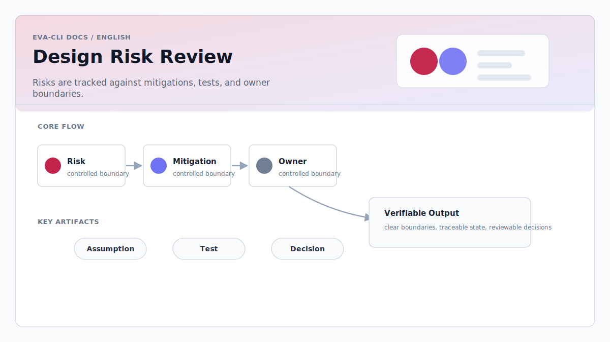

# Design Risk Review

> Language: English
> Canonical: docs/en/design-risk-review.md
> Translation: [简体中文](../zh-CN/方案设计风险评审.md)

Updated: 2026-06-16

## Purpose

This document records the main architecture risks that must be resolved before
Eva-CLI becomes an implementation specification.

## Overall Assessment

The direction is coherent: Rust owns authority, Lua owns hot-reloadable
behavior, Discovery is not authorization, and AdapterRegistry is the controlled
capability boundary.

The largest remaining risk is that platform capability definitions are more
detailed than Bot behavior semantics. The implementation needs a smaller early
loop that proves user input, routing, Agent execution, tool invocation, memory,
and recovery before expanding the platform surface.

## Key Risks

- Bot behavior semantics are underspecified compared with runtime mechanics.
- Cross-module contracts need machine-checkable schemas and invariants.
- EventBus, memory, and state ownership must not blur.
- Adapter and capability policy merge rules need deterministic conflict
  handling.
- Lua host API needs a stable, narrow, testable contract.
- Error handling needs structured origin, retryability, and audit semantics.
- Hardware and MCP integrations must not widen host access implicitly.

## Required Follow-Up

- Define executable schemas for manifests and policy files.
- Define `ctx.tools`, `ctx.host`, memory APIs, and capability registration.
- Add test fixtures for event routing, policy rejection, hot reload rollback,
  memory provenance, and adapter error classes.
- Keep early implementation focused on a minimal closed loop before enabling
  every adapter family.
