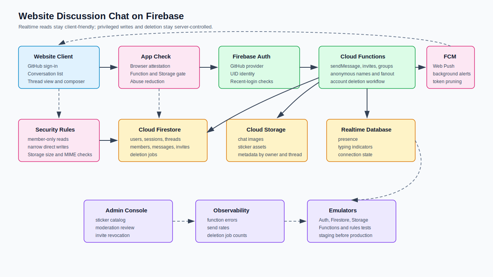
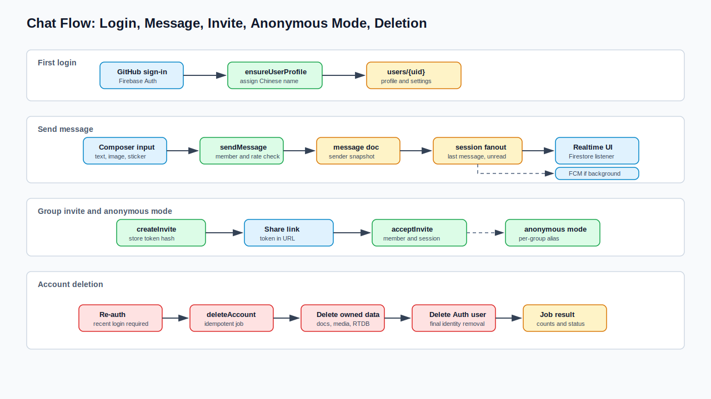

# Discussion Area Chat with Firebase

> Language: English
> Canonical: docs/en/discussion-chat-firebase-plan.md
> Translation: [简体中文](../zh-CN/官网讨论区聊天功能Firebase接入方案.md)

Updated: 2026-06-27

## Purpose

This document defines how to add chat to the official website discussion area
using Firebase. The feature covers GitHub login, editable Chinese display
names, account deletion, direct messages, group chats, text, images, stickers,
conversation lists, push notifications, anonymous group mode, and group
invitations through shared links.

## Architecture Decision

Use Firebase Authentication for GitHub sign-in, Cloud Firestore for
conversations and messages, Cloud Storage for images and sticker assets, Cloud
Functions for privileged writes and account deletion, Firebase Security Rules
for read/write authorization, App Check for abuse reduction, and Firebase
Cloud Messaging for offline and background notifications. Realtime Database is
used only for presence and typing indicators.

The client reads chat data through Firestore realtime listeners, but important
mutations go through Cloud Functions. This keeps membership checks, invite token
validation, unread-count fanout, anonymous-name assignment, and account deletion
out of untrusted browser code. FCM is a notification channel only; Firestore
remains the source of truth for message content, ordering, unread state, and
conversation membership.

## Architecture Diagram



## Requirement Mapping

| Requirement | Design Choice | Acceptance Criteria |
| --- | --- | --- |
| GitHub login | Firebase Auth GitHub provider plus a first-login profile function | First login creates `users/{uid}` and assigns a random Chinese display name exactly once. |
| Editable name | `updateDisplayName` callable validates and writes the profile | User can change name later; existing message snapshots keep historical sender text. |
| Account deletion | `deleteAccount` callable deletes Auth user, Firestore docs, RTDB presence, Storage files, sessions, membership, and owned messages | No document, file path, or denormalized session owned by the UID remains after the deletion job completes. |
| Direct chat | Deterministic direct thread ID from sorted UIDs | Repeated direct-chat creation for the same pair returns the same thread. |
| Group chat | `threads/{threadId}` with `type=group` and member subcollection | Members can read/write; non-members cannot read private group data. |
| Text, images, stickers | Canonical message shape with `type=text`, `type=image`, or `type=sticker` | Text is length-limited, images are stored in Cloud Storage, stickers reference an approved sticker catalog. |
| Conversation list | Per-user `users/{uid}/sessions/{threadId}` projection | User can load recent conversations with one indexed query ordered by `lastMessageAt`. |
| Push notifications | FCM Web Push token registered per user/device | Offline or background users receive a notification without using FCM as the message store. |
| Anonymous group mode | Per-member anonymous profile under `threads/{threadId}/members/{uid}` | When enabled, the visible sender name uses an anonymous Chinese name inside that group only. |
| Share-link join | Random invite token stored as a hashed token document | Opening the link and accepting it adds the user to the group if the token is valid. |
| Firebase implementation | Firebase client SDK plus Functions/Admin SDK | Local emulator and staging project cover rules, functions, Auth, Firestore, and Storage before production. |

## Firebase Services

| Service | Usage | Notes |
| --- | --- | --- |
| Firebase Authentication | GitHub OAuth login, UID identity, account deletion target | Configure the GitHub provider in Firebase console and set the Firebase OAuth callback URL in the GitHub OAuth app. |
| Cloud Firestore | Threads, members, messages, invites, session list, deletion jobs | Use subcollections to keep message history and membership checks scoped by thread. |
| Cloud Storage | Uploaded chat images and sticker binary assets | Metadata must include `ownerUid`, `threadId`, and `messageId`; rules must reject oversized or non-image uploads. |
| Cloud Functions | Privileged commands and denormalized projections | Use callable HTTPS functions for profile creation, send message, create invite, accept invite, anonymous mode, and deletion. |
| Firebase Cloud Messaging | Offline/background browser notifications | Store per-user Web Push tokens and send from Admin SDK after message writes; do not use FCM topics for private chats. |
| Realtime Database | Presence and typing indicators | Firestore has realtime listeners, but Realtime Database is better suited for connection-state presence. |
| Security Rules | Browser read/write boundary | Rules should allow direct reads only for authenticated members and restrict writes to narrow client-owned records. |
| App Check | Browser and function abuse reduction | Enforce App Check for callable functions and Storage uploads after the production client is registered. |

## User Flows

### GitHub Login and First Name Assignment

1. Browser calls Firebase Auth GitHub sign-in.
2. After Auth returns a UID, the client calls `ensureUserProfile`.
3. The function checks whether `users/{uid}` exists.
4. If missing, it assigns a random Chinese display name, stores GitHub provider
   metadata that the product is allowed to keep, and creates default user
   settings.
5. Later logins only refresh safe profile metadata and do not re-randomize the
   display name.

Chinese name generation should use an internal list rather than an external API
so first login has no extra dependency. To avoid embarrassing names, keep the
list curated and product-appropriate, for example `晴川`, `知言`, `松月`,
`安澜`, `云舟`, `南星`.

### Account Deletion

The deletion path must be a privileged Cloud Function, not a client-side batch.
The function should require recent re-authentication, set
`users/{uid}.deletion.status = "running"`, delete owned chat images, delete or
tombstone every message authored by the user, remove group memberships, delete
direct conversations where no other participant should retain data, remove
session projections, remove presence records, and finally delete the Firebase
Auth user.

For the strict interpretation of "delete all data", delete user-authored
messages and media instead of only anonymizing them. If the product later needs
legal retention, document that separately and keep it outside the normal product
database.

### Direct Chat

Direct chat creation is idempotent:

```text
directThreadId = "direct_" + sha256(min(uidA, uidB) + ":" + max(uidA, uidB))
```

`createDirectThread(targetUid)` creates or returns the existing thread and then
creates session projections for both users. A user can only create a direct
thread with a valid active user.

### Group Chat and Shared Links

Group creation uses `createGroup(title, settings)`. A group admin can call
`createGroupInvite(threadId, expiresAt, maxUses)` to receive a share URL:

```text
https://example.com/chat/join?token=<random-token>
```

Only the hash of the token is stored in `invites/{tokenHash}`. `acceptGroupInvite`
hashes the supplied token, verifies expiry, revocation, usage count, and group
state, then creates `threads/{threadId}/members/{uid}` and the user's session
projection.

### Anonymous Group Mode

Anonymous mode is scoped to one group. Each membership document stores:

```json
{
  "anonymous": {
    "enabled": true,
    "name": "匿名松月",
    "seedVersion": 1,
    "enabledAt": "serverTimestamp"
  }
}
```

When the user sends a group message, `sendMessage` snapshots the visible sender
name into the message. Other clients see `匿名松月`; Cloud Functions and admin
audit logs still retain `senderUid` for abuse handling and deletion. This is
product-level anonymity, not cryptographic anonymity.

### FCM Push Notifications

FCM can be used for chat notifications, but it should not replace Firestore
message reads. The recommended flow is:

1. The browser asks for notification permission only after the user opts in.
2. The client registers a service worker and obtains an FCM Web Push token.
3. The client calls `registerNotificationToken` with the token and device
   metadata.
4. `sendMessage` writes the Firestore message and session projections first.
5. A function resolves recipients, filters the sender, muted threads,
   notification-disabled users, users currently viewing the same thread, and
   deleted accounts.
6. The function sends FCM notifications to remaining registration tokens.
7. Invalid or expired tokens are pruned after FCM send failures.

Use tokens for private direct chats and groups. FCM topics are better for public
broadcast channels; they are harder to keep perfectly aligned with private group
membership and revocation.

Notification payloads should avoid leaking sensitive content by default. A safe
baseline is a generic body such as "New message" plus data fields:

```json
{
  "data": {
    "threadId": "thread_123",
    "messageId": "msg_456",
    "type": "chat_message"
  }
}
```

If the product later adds message previews, make preview visibility a per-user
setting and suppress previews for anonymous messages, muted threads, and locked
screens where possible.

## Data Model

| Path | Type | Key Fields | Owner |
| --- | --- | --- | --- |
| `users/{uid}` | Document | `displayName`, `githubProviderUid`, `photoURL`, `status`, `notificationSettings`, `createdAt`, `updatedAt`, `deletion` | Profile service |
| `users/{uid}/notificationTokens/{tokenHash}` | Document | `token`, `platform`, `permission`, `createdAt`, `lastSeenAt`, `lastError`, `disabledAt` | Notification service |
| `users/{uid}/sessions/{threadId}` | Document | `threadId`, `type`, `title`, `avatar`, `lastMessage`, `lastMessageAt`, `unreadCount`, `muted`, `pinned` | Projection function |
| `threads/{threadId}` | Document | `type`, `title`, `createdBy`, `createdAt`, `memberCount`, `lastMessage`, `settings`, `anonymousPolicy` | Thread service |
| `threads/{threadId}/members/{uid}` | Document | `role`, `joinedAt`, `lastReadAt`, `anonymous`, `state` | Membership service |
| `threads/{threadId}/messages/{messageId}` | Document | `senderUid`, `senderMode`, `senderDisplayName`, `type`, `text`, `attachments`, `createdAt`, `deletedAt` | Message service |
| `invites/{tokenHash}` | Document | `threadId`, `createdBy`, `expiresAt`, `maxUses`, `uses`, `revokedAt` | Invite service |
| `stickerPacks/{packId}/stickers/{stickerId}` | Document | `name`, `storagePath`, `thumbPath`, `enabled`, `sort` | Admin content service |
| `deletionJobs/{jobId}` | Document | `uid`, `status`, `startedAt`, `finishedAt`, `error`, `counts` | Account deletion service |
| `rtdb:/status/{uid}` | RTDB node | `state`, `lastChanged`, `activeThreadId` | Presence mirror |

## Message Shape

| Field | Required | Notes |
| --- | --- | --- |
| `senderUid` | Yes | Required for deletion, rate limiting, and abuse handling. Not displayed directly in anonymous mode. |
| `senderMode` | Yes | `normal` or `anonymous`. |
| `senderDisplayName` | Yes | Snapshot at send time to avoid expensive profile joins. |
| `type` | Yes | `text`, `image`, or `sticker`. |
| `text` | Text only | Normalize whitespace; limit length, for example 2,000 characters. |
| `attachments[]` | Image only | Storage path, content type, width, height, byte size, moderation status. |
| `sticker` | Sticker only | Approved pack ID and sticker ID. |
| `createdAt` | Yes | Server timestamp only. |
| `deletedAt` | Optional | Set only if retaining a tombstone; strict deletion removes the document. |

## Privileged Functions

| Function | Caller | Main Validation | Writes |
| --- | --- | --- | --- |
| `ensureUserProfile` | Authenticated user | UID from auth context; user doc may be absent | `users/{uid}` |
| `updateDisplayName` | Authenticated user | Length, profanity, rate limit | `users/{uid}.displayName` |
| `deleteAccount` | Authenticated user | Recent sign-in, ownership, idempotency | Deletes Auth, Firestore, Storage, RTDB user-owned data |
| `createDirectThread` | Authenticated user | Target user exists and active | Thread, members, both session docs |
| `createGroup` | Authenticated user | Title/settings validation | Thread, creator membership, creator session |
| `createGroupInvite` | Group admin | Admin role, expiry, max uses | `invites/{tokenHash}` |
| `acceptGroupInvite` | Authenticated user | Token hash, expiry, usage, group state | Member doc, session doc, invite usage |
| `setAnonymousMode` | Group member | Group allows anonymous mode | Member anonymous fields |
| `sendMessage` | Thread member | Membership, content type, size, rate limit | Message doc, thread last message, session projections |
| `registerNotificationToken` | Authenticated user | Token shape, App Check, one owner UID | User notification token doc |
| `unregisterNotificationToken` | Authenticated user | Token belongs to caller | Disable or delete token doc |
| `notifyThreadMembers` | Internal function | Recipients are active members and notification-eligible | FCM send result and stale token pruning |
| `markThreadRead` | Thread member | Membership | Member `lastReadAt`, session `unreadCount=0` |

## Security Rules Outline

| Resource | Read Rule | Write Rule |
| --- | --- | --- |
| `users/{uid}` | User can read own profile; public profile reads should expose a sanitized projection only | User can only write safe preferences; display name changes go through function. |
| `users/{uid}/notificationTokens/{tokenHash}` | Only the owner UID | Prefer Cloud Functions; if direct writes are allowed, only the owner can create/update their own token metadata. |
| `users/{uid}/sessions/{threadId}` | Only the owner UID | Only Cloud Functions/Admin SDK. |
| `threads/{threadId}` | Only thread members | Only Cloud Functions/Admin SDK except narrow client fields if needed. |
| `threads/{threadId}/members/{uid}` | Only thread members | Only Cloud Functions/Admin SDK; optional self `lastReadAt` update may be allowed. |
| `threads/{threadId}/messages/{messageId}` | Only thread members | Prefer `sendMessage` function; reject direct browser writes for canonical messages. |
| `invites/{tokenHash}` | No direct browser reads | Only Cloud Functions/Admin SDK. |
| Storage `chat/{threadId}/{messageId}/{file}` | Only thread members | Owner may upload pending image with strict content-type and size checks; function finalizes metadata. |

Rules should share helper predicates:

```text
isSignedIn()
isThreadMember(threadId)
isSelf(uid)
isAdminWrite()
```

The Admin SDK bypasses Security Rules, so every Cloud Function must repeat the
business authorization check before writing.

## Client Integration

| Module | Responsibility |
| --- | --- |
| `auth/GitHubSignIn` | Starts GitHub login, observes auth state, calls `ensureUserProfile`. |
| `chat/ConversationList` | Listens to `users/{uid}/sessions` ordered by `lastMessageAt`. |
| `chat/ThreadView` | Listens to `threads/{threadId}/messages` with pagination and membership guard. |
| `chat/MessageComposer` | Validates text, image, and sticker input, then calls `sendMessage`. |
| `chat/InviteJoinPage` | Reads the token from URL, shows a safe group preview from `getInvitePreview`, then calls `acceptGroupInvite`. |
| `settings/Profile` | Updates display name and starts account deletion. |
| `presence/usePresence` | Writes RTDB presence and subscribes to mirrored presence if shown in UI. |
| `notifications/useFcmRegistration` | Requests permission, registers the service worker, obtains FCM token, handles token refresh, and unregisters on logout. |

## Realtime, Projection, and Notification Flow



## Indexes and Query Strategy

| Query | Index |
| --- | --- |
| User conversation list | `users/{uid}/sessions` ordered by `lastMessageAt desc` |
| Message page | `threads/{threadId}/messages` ordered by `createdAt desc` |
| Group member list | `threads/{threadId}/members` where `state == "active"` ordered by `joinedAt asc` |
| Deletion job lookup | `deletionJobs` where `uid == <uid>` ordered by `startedAt desc` |
| Sticker list | `stickerPacks/{packId}/stickers` where `enabled == true` ordered by `sort asc` |
| Notification tokens | `users/{uid}/notificationTokens` where `disabledAt == null` ordered by `lastSeenAt desc` |

Avoid querying all `threads` by membership map for the conversation list.
Denormalized per-user sessions are cheaper, simpler to secure, and easier to
paginate.

## Rollout Plan

| Phase | Scope | Exit Criteria |
| --- | --- | --- |
| P0 Foundation | Firebase project, GitHub Auth provider, emulator setup, App Check registration, base rules | Local emulator can sign in, create profile, and reject unauthenticated reads. |
| P1 Direct chat | Users, direct threads, text messages, conversation list | Two users can chat; unread and last-message projections update correctly. |
| P2 Notifications | FCM service worker, token registration, notification settings, stale token pruning | Background users receive notifications; muted/currently-open threads do not notify. |
| P3 Media and stickers | Storage uploads, approved sticker catalog, image previews | Invalid MIME/oversized uploads are rejected; images show in thread view. |
| P4 Group chat | Group creation, membership, shared invite links | Link join works; revoked/expired/maxed invites fail. |
| P5 Anonymous mode | Group anonymous toggle and anonymous name assignment | Anonymous sender display works per group and remains auditable by functions. |
| P6 Account deletion | End-to-end deletion job | Auth user, profile, notification tokens, membership, sessions, messages, media, and presence records are removed. |
| P7 Hardening | Abuse limits, moderation hooks, alerting, backup policy | Function errors and suspicious send rates are observable before production launch. |

## Test Plan

| Layer | Cases |
| --- | --- |
| Unit | Name generator, invite token hashing, direct thread ID, message validation, anonymous display selection. |
| Rules | Member/non-member reads, session isolation, Storage content-type/size rejection, invite read denial. |
| Function integration | Create direct thread, create group, accept invite, send message fanout, FCM recipient filtering, stale token pruning, update display name, delete account idempotency. |
| Client e2e | GitHub login mock/emulator, conversation list, direct chat, FCM permission flow, group join link, anonymous send, image send, deletion UX. |
| Load smoke | Message send rate, session projection fanout for group sizes expected at launch. |

## Risks and Mitigations

| Risk | Impact | Mitigation |
| --- | --- | --- |
| Firestore write fanout becomes expensive for large groups | High cost and function latency | Cap initial group size, batch projection writes, and later move unread aggregation to lazy counters. |
| "Anonymous" is misunderstood as absolute anonymity | Trust issue | UI copy should say anonymous to other members; admin safety systems can still trace abuse. |
| Account deletion conflicts with conversation integrity | Missing context in old threads | Product decision favors strict deletion; keep optional tombstones without UID only if UX needs them. |
| Image abuse or malware | Safety and storage cost | Enforce MIME/size rules, generate thumbnails server-side, add moderation queue before broad launch. |
| Invite links leak publicly | Spam group joins | Token hashing, expiry, max uses, revoke button, and admin-only invite creation. |
| Client writes bypass validation | Security bug | Canonical writes go through Cloud Functions; direct Firestore writes are read-mostly. |
| Notifications leak message content | Privacy issue | Default to generic notification bodies; make previews opt-in and suppress previews for anonymous or muted contexts. |
| FCM tokens become stale | Wasted sends and errors | Track `lastSeenAt`, prune invalid send results, unregister on logout and account deletion. |
| Browser notification permission is denied | Missing background alerts | Keep chat fully functional without FCM and expose a settings prompt to retry permission later. |

## References

- Firebase Authentication GitHub provider: <https://firebase.google.com/docs/auth/web/github-auth>
- Firebase Security Rules: <https://firebase.google.com/docs/rules>
- Cloud Firestore realtime listeners: <https://firebase.google.com/docs/firestore/query-data/listen>
- Cloud Storage web uploads: <https://firebase.google.com/docs/storage/web/upload-files>
- Callable Cloud Functions: <https://firebase.google.com/docs/functions/callable>
- Firebase Cloud Messaging for Web: <https://firebase.google.com/docs/cloud-messaging/js/client>
- Firebase Cloud Messaging send messages: <https://firebase.google.com/docs/cloud-messaging/send/admin-sdk>
- FCM registration token management: <https://firebase.google.com/docs/cloud-messaging/manage-tokens>
- Firebase App Check: <https://firebase.google.com/docs/app-check>
- Firebase presence solution: <https://firebase.google.com/docs/firestore/solutions/presence>
- Delete User Data extension: <https://firebase.google.com/products/extensions/delete-user-data>
