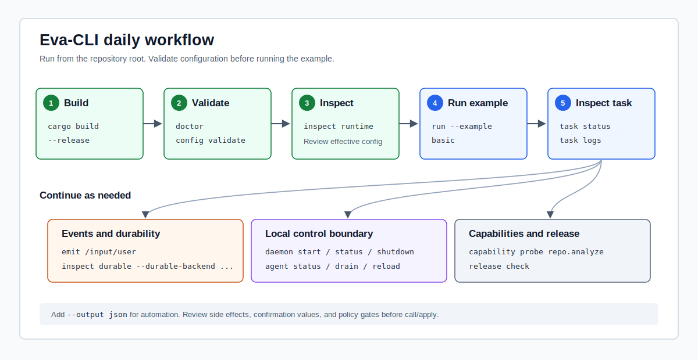
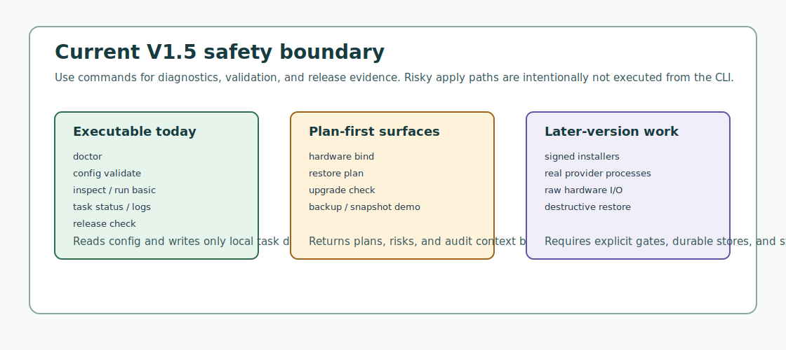

# Eva-CLI User Manual

Last updated: 2026-07-05

Applies to: Eva-CLI `1.5.1`

This manual is for developers, testers, and documentation maintainers using
Eva-CLI from source. V1.5 is a source-release checkpoint: the repository builds,
the CLI surface is executable, and risky paths remain diagnostic or plan-first.

## Current Position

| Area | Current status |
| --- | --- |
| Release shape | Source release from the Git repository and Rust toolchain. |
| Runtime | `run --example basic` executes the V1.0 in-memory basic runtime loop. |
| External capabilities | Adapter, MCP, Skill, and Discovery commands expose controlled diagnostics, not real provider execution. |
| Risky actions | Hardware binding, restore, upgrade, and lifecycle switching stay plan-first. |
| Release checks | V1.5 provides executable `release check/security/perf/migration` gates. |



## Prerequisites

| Dependency | Recommendation | Purpose |
| --- | --- | --- |
| Git | GitHub SSH or HTTPS access | Clone, commit, and push. |
| Rust toolchain | Stable Rust with `cargo` | Build the workspace, run the CLI, and run tests. |
| PowerShell or Bash | Either is fine | Run commands; PowerShell is the documented Windows shell. |
| Network access | Needed for push | Push commits to GitHub. |

Build and verify from source:

```powershell
git clone git@github.com:Yetmos/Eva-CLI.git
cd Eva-CLI
cargo build
cargo run -- --version
```

Expected version output includes:

```text
eva 1.5.1
release: V1.5 release hardening
```

## Quick Start

Run this sequence from the repository root:

| Step | Command | Expected result |
| --- | --- | --- |
| Version | `cargo run -- --version` | Prints version, release label, and supported contracts. |
| Doctor | `cargo run -- doctor --output json` | Checks workspace roots, schema files, Lua host boundary, and runtime builder. |
| Config validation | `cargo run -- config validate --output json` | Loads `config/eva.yaml` and split manifests. |
| Inspect runtime | `cargo run -- inspect runtime --output json` | Prints agents, adapters, capabilities, routes, policy, and runtime summary. |
| Run basic loop | `cargo run -- run --example basic --output json` | Executes the in-memory basic loop and writes `.eva/tasks`. |
| Task status | `cargo run -- task status --output json` | Reads the latest task report. |
| Release gate | `cargo run -- release check --output json` | Prints V1.5 release readiness. |

Use text output for human inspection and `--output json` for scripts or CI.

## Command Surface

| Command group | Common commands | Current purpose | External side effects |
| --- | --- | --- | --- |
| Version | `version`, `--version` | Print version, release label, and contracts. | No |
| Diagnostics | `doctor` | Check workspace, config roots, schema files, and runtime boundary. | No |
| Config | `config validate` | Validate `eva.yaml`, manifests, policies, routes, and schemas. | No |
| Inspect | `inspect` | Show project configuration and runtime summary. | No |
| Runtime | `run --example basic` | Execute the V1.0 in-memory basic loop. | Writes `.eva/tasks` |
| Task | `task status/logs/cancel` | Read or mark local task diagnostics. | Writes task cancel marker |
| Adapter | `adapter list/probe` | List or probe manifest-derived adapter handles. | No |
| MCP | `mcp list/probe` | List or probe allowlisted MCP tools. | No |
| Skill | `skill list/run` | Return controlled workflow skill envelopes. | No |
| Discovery | `discovery scan` | Scan trusted config sources for candidates. | No |
| Memory | `memory context` | Build request-scoped memory and knowledge context. | No |
| Hardware | `hardware list/probe/bind` | Discover hardware manifests and produce binding plans. | No |
| Backup | `backup create` | Create and verify an in-memory backup artifact. | No |
| Snapshot | `snapshot create` | Create a release snapshot linked to a backup manifest. | No |
| Restore | `restore plan` | Produce a restore plan with `apply_allowed:false`. | No |
| Upgrade | `upgrade check` | Check generation, migration, drain, and rollback readiness. | No |
| Release | `release check/security/perf/migration` | Run V1.5 release readiness, security, performance, and migration gates. | No |

## Basic Runtime Loop

`run --example basic` is the executable runtime loop in the current release. It
runs synchronously and writes the latest task report under `<project>/.eva/tasks`.

```powershell
cargo run -- run --example basic --output json
cargo run -- task status --output json
cargo run -- task logs --output json
```

| Option | Default | Meaning |
| --- | --- | --- |
| `--task-id <id>` | `req-basic-1` | Request/task id. |
| `--timeout-ms <ms>` | `30000` | Handler timeout budget; `0` exercises timeout diagnostics. |
| `--no-timeout` | Off | Removes the timeout budget. |
| `--retry-attempts <n>` | `1` | Retry limit. |
| `--cancel` | Off | Simulates cancellation before handler execution. |
| `--replay-dead-letters` | Off | Produces replay receipts for dead-letter events. |

## External Capability Diagnostics

V1.1 and later commands expose adapter, MCP, skill, and discovery diagnostics
without starting real external servers, provider CLIs, or workflow runners.

| Scenario | Command |
| --- | --- |
| List adapters | `cargo run -- adapter list --output json` |
| Probe adapter | `cargo run -- adapter probe --adapter github-mcp --output json` |
| Probe by capability | `cargo run -- adapter probe --capability repo.issue.list --output json` |
| List MCP allowlist | `cargo run -- mcp list --output json` |
| Probe MCP tool | `cargo run -- mcp probe --adapter github-mcp --tool list_issues --output json` |
| List skills | `cargo run -- skill list --output json` |
| Return skill envelope | `cargo run -- skill run --skill code-review --input '{"scope":"current_diff"}' --output json` |
| Scan discovery candidates | `cargo run -- discovery scan --output json` |

## Plan-First Safety Boundary



| Scenario | Command | Current boundary |
| --- | --- | --- |
| Hardware candidates | `cargo run -- hardware list --output json` | Reads manifests; does not open devices. |
| Hardware probe | `cargo run -- hardware probe --adapter scale-main --output json` | Reports health, trust, and handle status. |
| Hardware bind plan | `cargo run -- hardware bind --adapter scale-main --output json` | Produces plan steps and risks; no raw I/O handle. |
| Backup artifact | `cargo run -- backup create --output json` | Uses an in-memory artifact store. |
| Release snapshot | `cargo run -- snapshot create --output json` | Links to a verified backup manifest. |
| Restore plan | `cargo run -- restore plan --output json` | Returns `apply_allowed:false`. |
| Upgrade readiness | `cargo run -- upgrade check --output json` | Reports migration, drain, and rollback readiness. |

## Release Gates

```powershell
cargo run -- release check --output json
cargo run -- release security --output json
cargo run -- release perf --output json
cargo run -- release migration --output json
```

| Command | Focus |
| --- | --- |
| `release check` | Cross-platform, stability, docs, security, performance, migration, and compatibility gates. |
| `release security` | Policy, Lua sandbox, secret redaction, MCP allowlist, hardware, and lifecycle risks. |
| `release perf` | EventBus, Scheduler, Adapter, memory, backup, and release-check budgets. |
| `release migration` | V1.4 to V1.5 migration steps and compatibility policy. |

## Paths

| Path | Purpose |
| --- | --- |
| `Cargo.toml` | Root package and workspace members. |
| `crates/eva-cli/` | CLI parsing, output envelope, and exit-code mapping. |
| `config/eva.yaml` | Project root configuration and runtime settings. |
| `config/agents/` | Agent manifests and Lua scripts. |
| `config/adapters/` | Adapter manifests. |
| `config/capabilities/` | Capability manifests and Lua capability examples. |
| `config/policies/` | Sandbox, MCP, hardware, and adapter policies. |
| `config/routes/topics.yaml` | Topic routes. |
| `config/schemas/` | JSON schemas. |
| `.eva/tasks/` | Local task diagnostics written by `run --example basic`; not committed. |

## JSON Envelope and Exit Codes

Successful JSON output uses `ok`, `command`, `exit_code`, `data`, and `trace`.
Error JSON output uses `ok`, `command`, `exit_code`, `error`, and `trace`.

| Code | Meaning |
| --- | --- |
| `0` | Success. |
| `1` | Internal error. |
| `2` | Configuration, path, manifest, route, schema, or task state issue. |
| `3` | Policy denied. |
| `4` | Runtime unavailable or capability not implemented in this release. |
| `5` | Reserved for external capability unavailable. |
| `64` | Command usage error. |

## Non-Goals in V1.5

V1.5 does not provide packaged installers, signed release artifacts, real MCP
process execution, real provider process management, raw hardware I/O,
destructive restore, real Supervisor handoff, or durable memory/backup/task
databases.

## Recommended Verification

```powershell
cargo test -p eva-cli
cargo run -- --version
cargo run -- doctor --output json
cargo run -- config validate --output json
cargo run -- run --example basic --output json
cargo run -- release check --output json
.\scripts\build-site-i18n.ps1
.\scripts\validate-i18n.ps1
```
