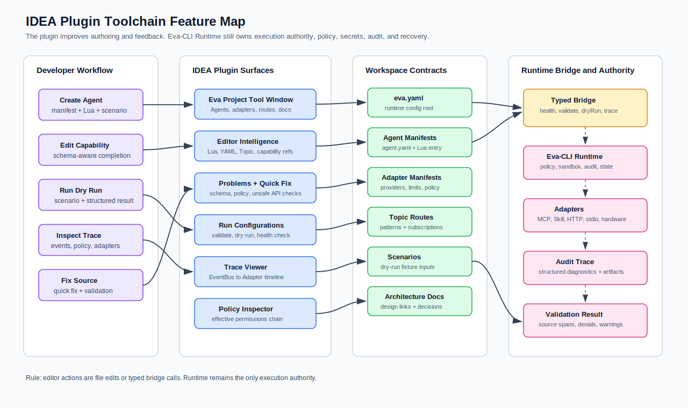

# IDEA Plugin Toolchain Requirements

> Language: English
> Canonical: docs/en/idea-plugin-toolchain.md
> Translation: [简体中文](../zh-CN/IDEA插件开发工具链功能方案.md)

Updated: 2026-06-25

## Purpose

This document defines the IDEA Plugin capabilities needed for the Eva-CLI
development toolchain. The plugin is not part of the trusted runtime authority.
It is a developer-facing control surface that understands Eva-CLI projects,
helps authors edit Agent, manifest, Topic, policy, and documentation files, and
passes execution requests to Eva-CLI through a typed Runtime Bridge.

The core boundary is simple:

- The IDEA Plugin owns editor intelligence, project navigation, inspections,
  run configurations, tool windows, and local developer feedback.
- Eva-CLI Runtime owns policy, permissions, secrets, sandboxing, external I/O,
  Adapter execution, audit, durable state, and rollback.
- The Runtime Bridge owns typed request/response contracts between the IDE and
  the local Eva-CLI process.
- The plugin must never become an alternate shell executor or a hidden runtime.

## Toolchain Feature Map



The plugin should make the project easier to author without changing runtime
authority. It should read the same manifests, schemas, Topic routes, Adapter
registries, and test fixtures that Eva-CLI validates at runtime.

## Capability Matrix

| Area | Required Features | Runtime Boundary | Priority |
| --- | --- | --- | --- |
| Project model | Detect `eva.yaml`, `config/agents/**/agent.yaml`, Lua entry scripts, policies, routes, schemas, docs, and scenario fixtures | Read-only indexing; no runtime mutation | MVP |
| Manifest editing | YAML schema validation, completion, required field hints, duplicate ID detection, path validation, permission preview | Runtime remains the source of truth for effective policy | MVP |
| Lua Agent editing | File type support, syntax highlighting, structure view, host API completion, `ctx.*` API documentation, unsafe call inspections | No direct shell, file, network, or secret access from the plugin | MVP |
| Topic and EventBus navigation | Completion for Topic names, go-to declaration for route entries, wildcard pattern validation, subscriber/producer graph | Scheduler behavior is simulated only from config; real delivery stays in Runtime | MVP |
| Adapter and capability index | Resolve capability names to Adapter manifests, MCP tools, Skill adapters, and Lua capabilities | Discovery data is advisory until Runtime validates and registers it | MVP |
| Run configurations | `eva config validate`, Agent scenario dry run, selected manifest validation, local Runtime health check | IDE sends typed commands through Runtime Bridge | MVP |
| Diagnostics | Inline errors, gutter actions, quick fixes, Problems view, bridge diagnostics, stale cache warnings | Runtime errors are displayed, not rewritten into success | MVP |
| Trace and audit viewer | Open request traces, show event chain, show Adapter calls, show policy denials, link to source manifests | Audit records remain Runtime-owned artifacts | V1 |
| Test workflow | Parser fixtures, manifest fixtures, scenario fixtures, golden trace comparison, contract test launcher | Test commands call Eva-CLI or test harness entry points | V1 |
| Documentation workflow | Link docs to config concepts, validate local doc links, open related architecture docs, surface Lore decision references | Documentation actions cannot change runtime policy | V1 |
| Generation helpers | Create Agent skeleton, Adapter manifest skeleton, Topic route skeleton, scenario skeleton, and docs snippets | Generated files must pass normal schema and policy validation | V1 |
| Refactoring | Rename Agent IDs, Topic names, capability aliases, and manifest paths across project files | Refactors are file edits only; Runtime must revalidate after edits | Later |

## User Workflows

| Workflow | IDE Support | Success Evidence |
| --- | --- | --- |
| Create a new Agent | New Agent action creates `agent.yaml`, `main.lua`, optional `constraints.md`, and scenario fixture | Project model discovers the Agent and `eva config validate` passes |
| Add a capability call | Completion suggests allowed capability aliases and providers from manifests | Inspection confirms the Agent has the required permission path |
| Add a Topic route | Route editor validates Topic syntax and shows producers/subscribers | Route appears in the Topic graph and wildcard rules are valid |
| Dry run an Agent scenario | Run configuration calls Runtime Bridge with scenario ID and workspace context | Tool window shows structured result, emitted Topics, denials, and trace link |
| Debug a policy denial | Problems view links denial to Agent permissions, Adapter policy, and global policy | Developer can see which layer narrowed the permission |
| Review a failing trace | Trace viewer shows EventBus, Scheduler, AgentRuntime, Lua, Tool Layer, and Adapter handoffs | Source links jump to the exact manifest, route, or Lua call site |

## Feature Requirements

### 1. Project Model and Indexing

The plugin must detect Eva-CLI workspaces by finding one or more of:

```text
eva.yaml
config/eva.yaml
config/agents/**/agent.yaml
config/adapters/**/*.yaml
config/routes/topics.yaml
docs/_i18n/manifest.json
```

It should build an index of:

- Agent IDs, script paths, parents, children, subscriptions, and emit
  permissions.
- Topic routes, wildcard patterns, producer call sites, and subscriber targets.
- Adapter IDs, transports, capabilities, providers, limits, and policy gates.
- MCP tool/resource/prompt allowlists.
- Skill adapter manifests and runtime gates.
- JSON Schema files used by configuration and protocol validation.
- Scenario fixtures and golden outputs.
- Relevant architecture docs under `docs/`.

The index is a developer aid. Eva-CLI Runtime must still perform final
discovery, validation, authorization, and registration.

### 2. Manifest and Schema Assistance

Manifest support should include:

- YAML and JSON schema validation.
- Completion for stable keys such as `id`, `enabled`, `subscriptions`,
  `permissions`, `capabilities`, `transport`, `limits`, and `routing`.
- Validation for duplicate Agent, Adapter, capability, and Topic identifiers.
- Path completion constrained to the workspace.
- Warnings for secret-like values in manifests.
- Quick fixes for missing required fields and invalid enum values.
- Effective permission preview with source attribution.

The plugin should avoid inventing schema rules. It should consume schemas from
the project when present, then fall back to bundled schemas versioned with the
plugin.

### 3. Lua Agent Editing

Lua support must be Eva-CLI aware, not only generic Lua syntax support.

Required editor capabilities:

- File type recognition for Agent Lua entry points.
- Syntax highlighting, parser recovery, structure view, and symbol search.
- Completion and documentation for controlled host APIs such as `ctx.emit`,
  `ctx.tool`, `ctx.memory`, `ctx.global_memory`, and `ctx.knowledge`.
- Resolve references from Lua Topic strings to route declarations.
- Resolve capability names from Lua calls to Adapter, MCP, Skill, or Lua
  capability manifests.
- Inspections for direct `os`, `io`, `debug`, raw network, raw file, or shell
  usage when sandbox policy forbids them.
- Gutter actions for running the nearest scenario or validating the owning
  Agent manifest.

The plugin must not make forbidden calls safe by executing them itself.

### 4. Runtime Bridge

Runtime Bridge commands should be typed, versioned, and narrow.

Recommended commands:

| Command | Input | Output |
| --- | --- | --- |
| `runtime.health` | Workspace path, expected protocol version | Runtime status, version, feature flags |
| `config.validate` | Config root, optional file scope | Structured diagnostics with source spans |
| `config.inspectEffective` | Agent or Adapter ID | Effective config, policy provenance |
| `capabilities.snapshot` | Workspace, optional filter | Registered capabilities and rejected candidates |
| `agent.scenario.dryRun` | Scenario ID, Agent ID, timeout | Events, tool calls, denials, trace ID, artifacts |
| `topic.resolve` | Topic string or pattern | Matching routes, subscribers, validation errors |
| `audit.trace.open` | Trace ID or request ID | Event chain, Adapter calls, policy decisions |

Bridge constraints:

- No arbitrary shell command endpoint.
- No raw environment variable read endpoint.
- No direct secret fetch endpoint.
- No unrestricted file write endpoint.
- Every request includes workspace, protocol version, correlation ID, timeout,
  and cancellation token.
- Every response returns structured diagnostics, not only text logs.

### 5. Tool Windows and UI Surfaces

The plugin should provide these surfaces:

| Surface | Purpose |
| --- | --- |
| Eva Project | Agent tree, Adapter tree, Topic routes, policies, scenarios, and docs links |
| Problems | Manifest, schema, Lua, Topic, and Runtime Bridge diagnostics |
| Capability Index | Registered and discovered capabilities with provider, policy, and health state |
| Scenario Runner | Dry-run status, emitted Topics, tool calls, denials, artifacts, and trace link |
| Trace Viewer | Request timeline across EventBus, Scheduler, AgentRuntime, Lua, Tool Layer, and Adapter |
| Policy Inspector | Effective permission chain and rejected permission expansion |

UI actions should be reversible file edits or typed Runtime Bridge requests.

### 6. Generation and Refactoring

Generation helpers are useful only when they preserve the project contracts.
They should create minimal files that pass validation:

- Agent skeleton.
- Adapter manifest skeleton.
- MCP adapter manifest skeleton.
- Topic route entry.
- Scenario fixture.
- Lua capability handler skeleton.
- Documentation stub linked to the relevant architecture page.

Refactoring should be conservative:

- Rename Agent ID across manifests, routes, scenario fixtures, and docs links.
- Rename Topic strings across route files and Lua emit/call sites.
- Rename capability aliases across Adapter manifests, policies, and Lua calls.
- Move Agent directories while preserving manifest paths.

Every generation or refactor action should run local validation afterward when
the Runtime Bridge is available.

## MVP Boundary

The first usable version should support:

1. Eva-CLI workspace detection.
2. Agent, Adapter, Topic, policy, and scenario indexing.
3. YAML schema validation and completion for key manifest files.
4. Lua Agent syntax, host API completion, and unsafe API inspections.
5. Topic and capability navigation.
6. Run configurations for config validation and scenario dry run.
7. Problems view integration for Runtime diagnostics.
8. A compact Eva Project tool window.

It should not attempt to implement full debugging, live Runtime mutation,
distributed tracing UI, or broad refactoring before the basic authoring loop is
stable.

## Non-Goals

The plugin must not:

- Execute arbitrary shell fragments on behalf of Lua or manifests.
- Read or display secrets outside explicit Runtime diagnostics.
- Bypass Eva-CLI policy, sandbox, timeout, audit, or Adapter routing.
- Maintain a separate hidden registry that disagrees with Runtime.
- Treat discovered capabilities as authorized capabilities.
- Persist developer-only state into runtime memory or knowledge stores.
- Rewrite production configuration without a visible file edit.

## Verification Requirements

Plugin work should be tested with:

| Test Type | Coverage |
| --- | --- |
| Parser fixtures | Lua Agent syntax, YAML manifests, Topic route files |
| Index fixtures | Agent graph, Adapter graph, capability aliases, Topic producers/subscribers |
| Inspection tests | Missing permissions, unsafe Lua APIs, invalid Topic patterns, duplicate IDs |
| Quick fix tests | Missing required manifest fields, invalid enum values, stale paths |
| Bridge contract tests | Request/response schema compatibility with local Eva-CLI Runtime |
| Run configuration tests | Config validation and scenario dry-run command construction |
| UI smoke tests | Tool windows open with fixture projects and show expected diagnostics |

The plugin is complete only when a developer can create or edit an Agent, run
validation, dry run a scenario, inspect failures, and navigate back to the
source file without leaving IDEA.
