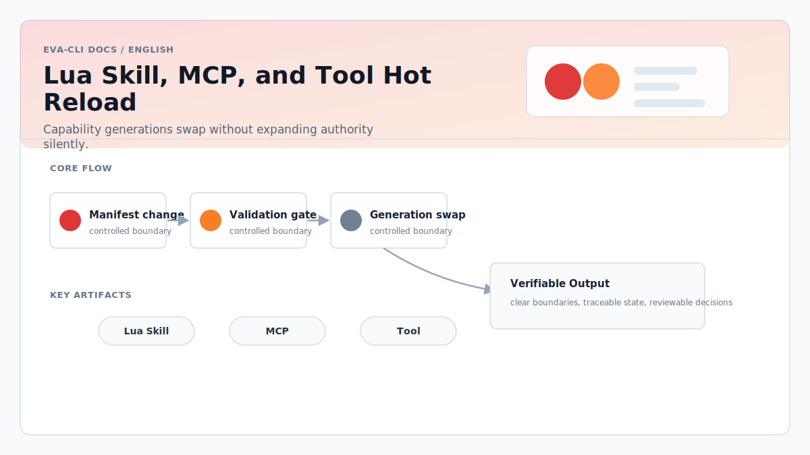

# Lua Skill, MCP, and Tool Hot Reload

> Language: English
> Canonical: docs/en/lua-skill-mcp-tool-hot-reload.md
> Translation: [简体中文](../zh-CN/Lua承载Skill-MCP-Tool热更新架构方案.md)

Updated: 2026-06-16

## Purpose

This document defines how `lua_tool`, `lua_skill`, and `lua_mcp_handler`
capabilities can move business behavior into Lua while keeping host authority in
Rust.

## Capability Runtime

The Lua Capability Runtime loads capability manifests, validates schemas and
policies, creates isolated Lua states, and exposes a narrow host API. Runtime
generation switching allows business logic to be updated without changing the
host binary.

## Capability Types

- `lua_tool`: a reusable local tool implementation callable by Agents.
- `lua_skill`: a workflow or domain skill implemented in Lua.
- `lua_mcp_handler`: an MCP tool handler exposed by Eva-CLI as an MCP server.

For the full Skill execution model, including `workflow_skill`,
`runtime_worker`, `lua_skill`, manifest requirements, runtime gates, and
verification rules, see [Skill Implementation Plan](skill-implementation.md).

## Host-Owned Boundaries

Rust remains responsible for:

- Manifest validation.
- Schema validation.
- Permission checks.
- Secret access.
- Filesystem and network policy.
- MCP protocol handling.
- Audit events.
- Timeout and cancellation.
- Generation activation and rollback.

Lua remains responsible only for business intent, validation-friendly
transformations, and local orchestration inside the allowed host API.

## Hot Reload Flow

1. Discover changed manifest or Lua source.
2. Validate schema, policy, and host API compatibility.
3. Load a new generation in isolation.
4. Run smoke checks.
5. Atomically route new calls to the new generation.
6. Keep the old generation available until in-flight work drains.
7. Roll back automatically on activation failure.
