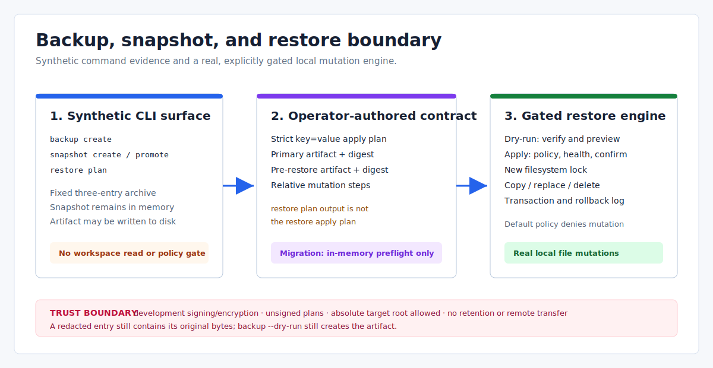

# Backup, Migration, Snapshot, and Restore: Current Boundary

> Language: English
>
> Published default: `docs/en/operations/backup-migration-release-snapshot.md`
>
> Translation: [Simplified Chinese](../../zh-CN/operations/备份迁移包与ReleaseSnapshot架构方案.md)

Updated: 2026-07-14

## Scope

The current backup and snapshot CLI is a contract/smoke surface built from synthetic entries. Restore apply/rollback has a real staged local file-mutation engine behind explicit evidence, policy, lock, health, and confirmation gates. The migration package remains a library-only preflight model.

This document describes those boundaries without presenting planned artifact management as implemented production backup.



## Capability Matrix

| Surface | Current behavior | Important limit |
| --- | --- | --- |
| `backup create` | Builds, seals, stores, and verifies a synthetic three-entry artifact | Does not read or back up the workspace |
| `snapshot create` | Creates a synthetic backup and an in-memory snapshot report | Snapshot records are not persisted or queryable |
| `snapshot promote` | Creates another synthetic backup/snapshot and returns a pointer plan | Never moves the release pointer |
| `restore plan` | Creates synthetic backup/snapshot evidence and a display report | Does not create the file consumed by restore apply |
| `restore apply --dry-run` | Parses an operator-authored plan, verifies two artifacts/digests, and builds a mutation preview | Does not acquire the restore lock or mutate targets |
| `restore apply` | Applies declared copy/replace/delete steps after all gates | Can modify an absolute target root supplied by the plan |
| `restore rollback` | Reverses committed steps from a rollback-required transaction | Requires matching transaction, hashes, and pre-restore evidence |
| `MigrationPackageService` | Constructs a manifest and checks source-version preflight in memory | No migration package CLI, persistence, signing, or apply engine |

## Synthetic Backup Behavior

The CLI currently constructs these fixed entries instead of reading project files:

```text
config/eva.yaml                         -> "runtime: in_memory_v1.0"
config/adapters/hardware/scale-main.yaml -> "enabled: false"
state/release-pointer                   -> project_id bytes (marked redacted)
```

```powershell
cargo run -q -- backup create --output json
cargo run -q -- backup create --artifact-store .eva/artifacts --output json
```

Without `--artifact-store`, the artifact only exists in an in-memory store for that command. With a filesystem store, the sealed bytes and generic artifact metadata are written to disk. Reusing an artifact ID overwrites the filesystem record; there is no immutable point-in-time catalog.

The current `BackupManifest` contains artifact ID/type, request ID, generation, project ID, entry metadata, digest, archive metadata, and audit strings. The manifest itself is returned in the command report but is not stored as a separately queryable backup record.

Current security limits:

- `--dry-run` marks the plan but still creates and stores the artifact.
- A `redacted` entry is metadata only; the entry bytes still appear in the sealed archive.
- Default signing and `--encrypt` use hard-coded local-development keys.
- Encryption uses a development XOR stream and is not production cryptography.
- Remote backup targets exist as manifest metadata in the library; no upload is performed.
- `backup create`, `snapshot create`, and `snapshot promote` do not call the runtime policy gate; an operator-supplied artifact store can be written without a `backup.create` policy approval.
- There is no backup list, restore, delete, expiry, retention, garbage collection, or remote-transfer CLI.

Do not use this command as evidence that real project state, secrets, databases, event logs, or release pointers have been backed up.

## Migration Package Boundary

`MigrationPackageService` currently models:

- package/source/target version strings;
- affected state sections;
- reversible versus irreversible metadata;
- an in-memory source-version preflight result.

It does not build/import an archive, calculate a production checksum/signature, persist packages, execute a migration, or expose CLI commands. `release migration` prints release guidance; it is not a migration package apply command.

## Snapshot Boundary

```powershell
cargo run -q -- snapshot create --snapshot-id snapshot-doc --artifact-store .eva/artifacts --output json
cargo run -q -- snapshot promote --snapshot-id snapshot-doc --confirm snapshot-doc --artifact-store .eva/artifacts --output json
```

Both commands create a new synthetic backup during the invocation. The snapshot is an in-memory report with fixed healthy evidence; it is not loaded from or saved to a snapshot registry.

`snapshot promote` writes `backup-for-<snapshot-id>` before pointer-plan confirmation is evaluated. A mismatched `--confirm` can therefore still write or overwrite an artifact. A successful confirmation returns `apply_allowed:false`; no release pointer changes.

There is no snapshot list/get/compare/status API in the CLI, and current snapshots do not capture a real binary digest, configuration digest, runtime state, event watermark, or provider state.

## Restore Plan Contracts

`restore plan` is a synthetic diagnostic report:

```powershell
cargo run -q -- restore plan --snapshot-id snapshot-doc --artifact-store .eva/artifacts --output json
```

It does not emit the strict plan file required by `restore apply`. That file must come from an audited operator/release workflow and uses `key=value` records:

```text
plan_id=plan-restore-1
backup_artifact_id=backup-for-restore
backup_digest=sha256:<hex>
pre_restore_backup_artifact_id=pre-restore-plan-restore-1
pre_restore_backup_digest=sha256:<hex>
restore_target_root=<target-root>
mutation_step=copy|config/eva.yaml|backup/source-key|sha256:<new>|none|file
```

Each `mutation_step` has exactly six fields:

```text
operation|relative_path|source_artifact_key|expected_digest|pre_restore_digest|target_kind
```

Supported operations are copy, replace, and delete. Copy requires a source artifact key and expected digest but no pre-restore digest. Replace requires all three fields. Delete requires a pre-restore digest but no source artifact key or expected digest. Empty optional fields use `none`, `null`, `-`, or an empty segment.

## Dry-Run, Apply, and Rollback

Always validate the independently authored plan first:

```powershell
cargo run -q -- restore apply --dry-run --plan <plan-file> --confirm <plan-id> --artifact-store <artifact-dir> --lock-store <lock-dir> --output json
```

Dry-run verifies the primary and pre-restore artifact digests, requires matching confirmation, rejects invalid relative paths and a plan target declared as `symlink`, and returns affected paths, preflight hash, and rollback manifest. It does not inspect existing target-path components for symlinks because no mutation runs, nor does it validate a separately persisted BackupManifest or production signature. Apply and rollback reject existing symlink components before mutation.

Non-dry-run apply additionally requires:

- `restore.apply` in `runtime_policy.allow_high_risk_actions`;
- a healthy input;
- a new filesystem lock;
- all source artifacts and expected/current digests;
- a plan containing valid mutation steps before any target mutation occurs.

The checked-in policy does not allow `restore.apply`, so mutation is denied by default. When authorized, copy/replace uses a temporary file plus rename; delete removes the target directly. The engine writes a plain-text transaction log. A partial failure returns `rollback_required`.

Rollback uses the same `restore.apply` policy action. It only accepts a rollback-required transaction, validates plan/transaction identity and current digest drift, then restores committed steps in reverse from pre-restore evidence. Transaction and rollback logs are local text files, not signed or tamper-proof journals.

## Path and Trust Boundaries

- Mutation paths are relative and reject traversal. Plan parsing rejects `target_kind=symlink`; apply and rollback additionally reject existing symlink components in the target path.
- `restore_target_root` itself may be absolute; current code does not restrict it to the Eva workspace.
- Confirmation proves only that the supplied string matches `plan_id`; the plan file is not signed.
- Artifact digest checks prove byte equality for the stored record, not who authored the plan or artifact.
- Encrypted CLI backups cannot be supplied to restore as a pre-restore plaintext archive through a decryption option; no such CLI option exists.

Treat plan authoring, target-root approval, artifact provenance, and policy review as external operator responsibilities.

## Not Implemented

The current code does not provide real workspace backup selection, database backup, secret/KMS integration, production signatures/encryption, immutable artifact history, retention, remote upload/download, migration apply, persisted snapshot comparison, or automatic snapshot-backed restore/upgrade orchestration.

## Related References

- [Eva-CLI user manual](../guide/user-manual.md)
- [Process upgrade and recovery boundary](process-level-upgrade.md)
- [Project configuration](project-configuration.md)
