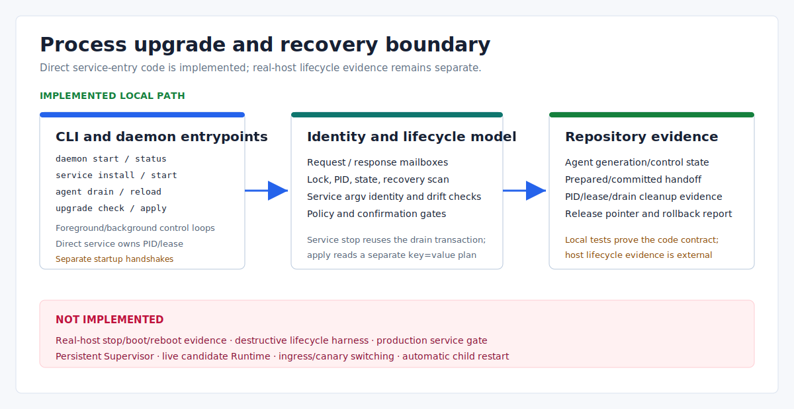

# Process Upgrade and Recovery: Current Boundary

> Language: English
>
> Published default: `docs/en/operations/process-level-upgrade.md`
>
> Translation: [Simplified Chinese](../../zh-CN/operations/进程级停机升级架构方案.md)

Updated: 2026-07-20

## Scope

Eva-CLI currently provides foreground/background daemon boundaries, durable task/recovery diagnostics, generation/drain primitives, a policy-gated local handoff state machine, host-bound service lifecycle commands, and an identity-bound hidden direct daemon service entrypoint. The entrypoint code does not itself prove real-host stop/boot/reboot recovery, a destructive lifecycle harness, a production gate, two live Runtime processes, or traffic switching.

This document separates those implemented local contracts from the intended production boundary.



## Implemented Surfaces

| Surface | What it does now | What it does not do |
| --- | --- | --- |
| `daemon start` | Claims a fenced daemon/writer lease, opens durable PID/state, runs recovery, observability and memory maintenance, and enters a foreground or parent/child background control loop | Start provider processes or certify OS service recovery |
| daemon control | Uses filesystem request/response mailboxes and validates a fresh lease, live OS-lock owner, and full PID identity | Authenticate a network control plane or provide background service supervision |
| Agent drain/reload | Returns a local plan or writes daemon-side Agent generation/control state | Restart an Agent/provider process or reread configuration/scripts |
| lifecycle library | Models in-memory generation promotion, drain, rollback, apply locks, and handoff evidence | Supervise OS child processes or switch real ingress traffic |
| `upgrade check` | Builds an in-memory readiness, migration, drain, and rollback report | Start a candidate Runtime or write an apply plan file |
| `upgrade apply` | Acquires a filesystem lock and can write local handoff/pointer state after gates | Perform platform service-manager activation or a real blue-green deployment |
| `service install/status/start/stop/restart/uninstall` | Loads typed project configuration and calls the host-bound Windows Service, systemd, or launchd Adapter; production definitions bind canonical direct-entry argv identity, while Fake requires explicit `--dev` | Replace controlled real-host lifecycle/reboot evidence or perform blue-green handoff |

## Daemon Process Modes

Default paths derive from `runtime.data_dir` (the sample uses `.eva/data`):

```text
.eva/data/durable
.eva/data/daemon/state
.eva/data/daemon/locks
.eva/data/daemon/pids
.eva/data/observability
```

The default command is a one-shot smoke. It starts, verifies boundaries, shuts down, removes the PID projection, marks `daemon.lease` released, and retains the unlocked fixed `daemon.lock` anchor:

```powershell
cargo run -q -- daemon start --foreground --dev --output json
```

Use `--no-shutdown-after-smoke` to keep the same CLI process in its mailbox loop. `--background` uses the separate parent/child startup handshake; the service entrypoint never uses that path or spawns a second daemon.

```powershell
# Terminal A
cargo run -q -- daemon start --foreground --dev --no-shutdown-after-smoke --output json

# Terminal B
cargo run -q -- daemon status --output json
cargo run -q -- daemon submit --task req-upgrade-doc --output json
cargo run -q -- daemon shutdown --output json
```

`provider_processes_started` remains `false`. Status requires a running state, a versioned PID/process-token/generation projection, a fresh active lease, and a live OS lock on the fixed anchor. The daemon renews heartbeat on the control loop; a live owner is never stolen even after expiry, a dead-but-unexpired owner waits for its TTL, and a dead expired owner is reclaimed with a higher durable writer generation. Corrupt/legacy ownership metadata fails closed. The direct service-entry code contract is implemented; verified machine-reboot recovery remains separate production evidence.

At startup, the daemon scans durable task/provider snapshots, marks interrupted work, and writes local evidence. When kept in the persistent mailbox loop with `--no-shutdown-after-smoke`, it also runs due scheduler retry dispatch. Its durable event records are filesystem records rather than a production WAL with fsync, segmentation, or compaction guarantees. The basic example still uses `InMemoryEventBus` unless a command explicitly selects a durable path.

## Direct Service Entrypoint

For a production service-manager kind, `eva service install` builds a canonical
definition containing the executable, native argument vector, working directory,
service kind/name, and a stable identity digest. The manager invokes a hidden
`daemon __service-entry` command. That command reloads project configuration,
validates host kind/name/digest, and directly claims the daemon PID and lease.

Windows enters the SCM dispatcher; systemd/launchd hosts install Unix signal
handlers. Stop, shutdown, and preshutdown callbacks only set an atomic token.
The daemon loop observes that token and submits the same generation-bound
`Shutdown` request used by the control mailbox, so task admission closes, drain
evidence is persisted, stopped state is written, the PID is removed, and the
lease is released through one transaction.

These are code and local-test contracts. Production acceptance still requires
controlled Windows SCM/systemd/launchd stop/boot/reboot transcripts, mandatory
cleanup in a destructive lifecycle harness, and a release gate that consumes
those artifacts.

## Upgrade Check Is Diagnostic

```powershell
cargo run -q -- upgrade check --output json
```

`upgrade check` creates an in-memory candidate and fixed migration/drain/rollback evidence. It does not start a process, capture a real backup, inspect a live ingress gate, or produce the file consumed by `upgrade apply`.

The apply command reads a separately authored strict `key=value` file with exactly these fields:

```text
plan_id=plan-upgrade-1
from_generation=gen-current
to_generation=gen-next
from_release=1.11.4-alpha
to_release=1.11.5-alpha
```

That file must come from an audited operator/release workflow. `upgrade check` output is not interchangeable with it.

## Upgrade Apply Workflow

The minimum command shape is:

```powershell
cargo run -q -- upgrade apply --plan <plan-file> --confirm <plan-id> --lock-store <lock-dir> --output json
```

Execution order:

1. Parse the plan and require `--confirm` to equal `plan_id`.
2. Load project configuration and evaluate `supervisor.handoff` and `release.pointer_mutation` policy decisions.
3. Create a persistent filesystem lock with `create_new` semantics.
4. Without `--state-store`, stop at lock-only evidence with `apply_allowed:false`.
5. With `--state-store`, require both policies before entering local handoff.
6. If `--runtime-binary` is supplied, run that file with `--version` and a five-second timeout; otherwise use a simulated-ready probe.
7. Write `handoff.prepared` when an allowed handoff reaches binary/health evaluation.
8. Only after binary, health, in-memory candidate, and drain checks pass, write `state/release-pointer` and `handoff.committed`.

The checked-in policies do not include `runtime_policy.allow_high_risk_actions`, so state-store handoff is denied by default. An audited policy must explicitly allow both `supervisor.handoff` and `release.pointer_mutation`. The lock can already exist when a later policy/handoff step fails.

If binary probing or health fails after policy approval, prepared handoff and rollback evidence may be written, but the release pointer is not committed. Candidate start, health, promotion, and drain in this path are in-memory models; no candidate Runtime process is launched.

## Current Recovery and Rollback Evidence

- `agent drain/reload` can persist `agent-control.state` when connected to a running daemon.
- The daemon recovery scanner classifies interrupted task/provider snapshots but does not replay non-idempotent provider side effects.
- `upgrade apply` preserves local prepared/committed reports and a pointer mutation only inside the supplied state store.
- Rollback objects are plans/evidence. There is no CLI command that reactivates an old OS-managed Runtime service.
- Corrupt or legacy lease/anchor metadata requires explicit operator inspection; valid dead expired daemon leases are reclaimed atomically on the next claim.

## Not Implemented

The current code does not provide:

- controlled real-host service/PID identity plus stop/boot/reboot recovery evidence;
- a destructive platform lifecycle harness and production service release gate;
- a persistent Supervisor process or `SupervisorRecoveryGuard`;
- task/worker heartbeat, control epoch, PID reattachment, or automatic child restart;
- two live Runtime processes, canary traffic, Ingress Gate, or session routing;
- automatic snapshot-backed upgrade/rollback;
- production provider process supervision;
- exactly-once side effects, cross-machine failover, or a production event WAL.

`service_manager.kind: fake` creates a fresh in-memory Adapter for each CLI invocation and rehydrates it from a project/service-scoped `.eva/service-manager` development state file under an exclusive lock with atomic writes. This supports a repeatable development lifecycle smoke, but it is not production evidence or platform integration. Production Adapters, CLI commands, and the direct entrypoint code are implemented; real platform transcripts and destructive cleanup evidence remain separate.

## Operator Rules

- Treat `upgrade check` as diagnostics, not approval or an apply artifact.
- Review plan, confirm token, policy, lock store, state store, runtime binary, and health input independently.
- Use a disposable state/lock root when testing local handoff behavior.
- Inspect prepared/committed files and release pointer before retrying.
- Do not delete a lock merely to force progress without determining which operation created it.
- Keep a real platform rollback procedure outside Eva-CLI until destructive host evidence and the production service gate are complete.

## Related References

- [Eva-CLI user manual](../guide/user-manual.md)
- [Backup, snapshot, and restore boundary](backup-migration-release-snapshot.md)
- [Project configuration](project-configuration.md)
