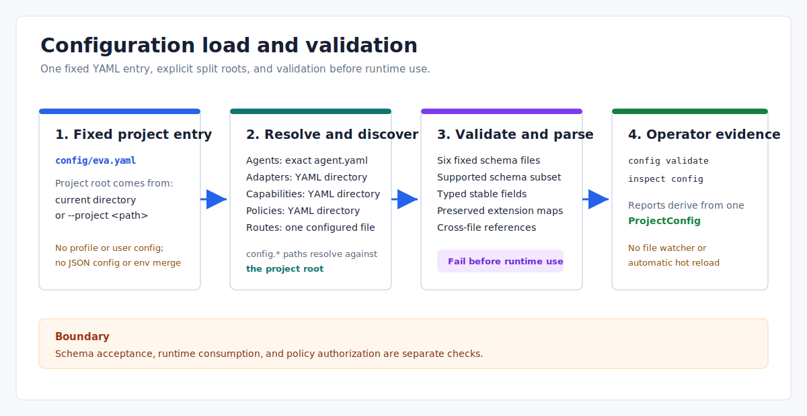

# Project Configuration: Current Loading and Validation

> Language: English
>
> Published default: `docs/en/operations/project-configuration.md`
>
> Translation: [Simplified Chinese](../../zh-CN/operations/项目配置方案.md)

Updated: 2026-07-14

## Scope

This document describes what the current `eva-config` loader and CLI actually read, validate, and expose. It is not a target configuration design.

Eva uses YAML for maintained project configuration, JSON Schema files for a supported validation subset, and JSON for CLI/protocol output. The only project entry file is `<project>/config/eva.yaml`; the loader does not discover `eva.json`, profiles, user-level config, or a generic environment/CLI override stack.



## Loaded Configuration Set

The project root comes from the current directory or `--project <path>`. All `config.*` paths in `eva.yaml` resolve against that project root, not against `runtime.workspace`.

| Source | Discovery rule | Current role |
| --- | --- | --- |
| `config/eva.yaml` | Fixed filename | Typed runtime/observability/service-manager fields, split-config roots, and preserved extension mappings |
| `config/agents/**/agent.yaml` | Recursive exact filename | Agent identity, script, subscriptions, and core permissions |
| Adapter directory | Recursive `.yaml`/`.yml` | Adapter identity, transport, capabilities, and transport extensions |
| Capability directory | Recursive `.yaml`/`.yml` | Capability identity, kind, provider, and provider permissions |
| Policy directory | Recursive `.yaml`/`.yml` | Non-empty policy-domain mappings; semantic enforcement belongs to `eva-policy` |
| `config/routes/topics.yaml` | One configured file | Ordered `fanout` or `compete` Topic routes |
| Schema directory | Six fixed filenames | `eva`, `agent`, `adapter`, `capability`, `policy`, and `routes` schemas |

The checked-in sample currently loads 4 enabled Agents, 5 Adapters (4 enabled), 3 enabled Capabilities, 5 Policy documents, and 4 routes.

## Typed and Extension Boundaries

Not every accepted YAML field is strongly typed by `eva-config`.

| File | Strongly typed now | Preserved or interpreted later |
| --- | --- | --- |
| `eva.yaml` | `runtime`, `observability`, optional `service_manager`, and `config` roots | Other top-level mappings are stored in `EvaConfig.extra` |
| Agent | `id`, `enabled`, `parent`, `children`, `script`, `script_version`, `subscriptions`, emit/tools/Adapter permissions | Inbox, timeout, state, constraints, memory, knowledge, and other fields remain extensions |
| Adapter | `id`, `name`, `version`, `enabled`, `transport`, capabilities | Transport-specific data remains an extension; hardware has an additional typed parser |
| Capability | Identity, kind, public capability, default/provider IDs, Adapter permission references | Input/output schemas and execution details remain extensions |
| Policy | Non-empty mapping with non-empty string domain keys | `eva-policy` parses supported domains when a policy-gated operation runs |
| Routes | Pattern, delivery mode, and target Agent IDs | No extension fields; the route schema rejects unknown properties |

The presence of an extension field does not prove that the current runtime consumes it. For example, `process`, `eventbus`, and `upgrade` remain main-config extensions, while `runtime.hot_reload` is currently a parsed and reported flag rather than a file-watcher switch.

`constraints.md` is not loaded by `eva-config`; a `constraints.file` field is only preserved as Agent extension data unless a downstream consumer explicitly reads it.

## Validation Pipeline

`load_project_config` performs these stages in order:

1. Normalize an existing project directory and locate `config/eva.yaml`.
2. Deserialize and normalize `eva.yaml` into its typed main-config structure so the six split-config roots can be resolved against the project root.
3. Discover Agent, Adapter, Capability, and Policy YAML files, and include the configured route file in the validation set.
4. Validate `eva.yaml` and all discovered YAML files with their configured schemas.
5. Parse the split manifests into typed Rust structures and preserve extension mappings.
6. Run cross-file checks and return one `ProjectConfig`.

The built-in schema evaluator is intentionally smaller than a full JSON Schema engine. It implements `type`, `enum`, two supported `pattern` forms, `minProperties`, `required`, `properties`, rejection through `additionalProperties: false`, and `items`. It does not evaluate schema-valued `additionalProperties`, or provide general `$ref`, schema composition, arbitrary regular expressions, numeric bounds, or default injection.

Cross-file validation currently checks:

- configuration roots and required files exist;
- Agent, Adapter, and Capability IDs are unique;
- Agent parent/child references and route target Agents exist;
- Agent scripts exist;
- Agent Adapter permissions reference declared providers/capabilities;
- hardware Adapter typed fields are valid;
- Capability providers reference declared Adapters.

It does not currently prove parent/child symmetry, validate environment variable availability, constrain every path to `runtime.workspace`, measure MCP allowlist breadth, enforce every Skill extension, or compare timeout/concurrency values with every policy domain.

## Operator Commands

Run from the repository root:

```powershell
cargo run -q -- config validate --project .
cargo run -q -- config validate --project . --output json
cargo run -q -- inspect config --project . --output json
```

`config validate` reports the project/config paths, environment, `hot_reload` flag, object counts, and schema paths. Successful validation exits `0`; configuration and schema failures exit `2` with structured context when JSON output has already been selected.

`inspect config` is an `inspect` command, not a `config` subcommand. The current `inspect` topic aliases return the same full project report; there is no `config inspect`, `config dump-effective`, profile command, or provenance report.

## Changing Configuration

Use this workflow after editing YAML or schema files:

1. Run `config validate` and fix schema/cross-file errors.
2. Review `inspect config` for the loaded project summary.
3. Restart or rebuild the runtime consumer that owns the changed data.
4. Verify the affected command or runtime path.

There is no configuration file watcher and no automatic route-table replacement. `agent reload` produces a local plan or daemon-side generation/control-state evidence; it does not reread all YAML, replace Topic routes, or automatically restart providers. Lua shadow-load primitives exist separately but are not wired to a generic config reload pipeline.

## Security Rules

- Store credential environment-variable names, never plaintext API keys or tokens.
- Keep executable plus arguments as structured fields; do not embed shell fragments.
- Treat `permissions`, allowlists, endpoints, and hardware match data as security-sensitive changes.
- Validate before running external Adapter, MCP, Skill, hardware, restore, or upgrade paths.
- Remember that schema acceptance and policy authorization are separate checks.

The checked-in samples are development configuration. `service_manager.kind: fake`, disabled hardware, simulator drivers, local paths, and local observability defaults are not production deployment evidence.

## Related References

- [Configuration directory reference](../../../config/README.md)
- [Eva-CLI user manual](../guide/user-manual.md)
- [Process upgrade and recovery boundary](process-level-upgrade.md)
