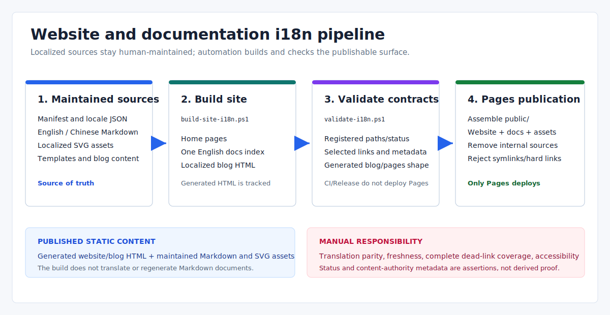

# Website and Documentation i18n Operations

> Language: English
>
> Published default: `docs/en/operations/website-docs-i18n.md`
>
> Translation: [Simplified Chinese](../../zh-CN/operations/网站与文档多语言适配方案.md)

Updated: 2026-07-14

## Current Model

- `en` is the enabled default public locale; `zh-CN` is the enabled localized locale and current detailed content authority for many technical documents.
- Website HTML is generated at build time and committed. Markdown documents and content SVGs remain source files; the build does not translate or regenerate them.
- `/` is the English home, `/zh-CN/` is the Chinese home, and `/docs/` is one generated English documentation index.
- Markdown publishes under `/docs/en/...` and `/docs/zh-CN/...`; blogs publish under `/blog/...` and `/zh-CN/blog/...`.
- Public output is static HTML, Markdown, and assets.



## Source Ownership

| Source | Owns | Generated? |
| --- | --- | --- |
| `docs/_i18n/manifest.json` | Locale registry, stable document IDs/paths/status, asset mappings, authority/coverage metadata | No |
| `docs/_i18n/glossary.json` | Human-maintained shared terminology | No; current scripts do not consume it |
| `docs/en/`, `docs/zh-CN/` | Published Markdown content | No |
| `docs/assets/` and root `assets/` | Content and shared visual assets | No |
| `website/_templates/` | Home, docs-index, and blog page structure | No |
| `website/_i18n/<locale>.json` | Localized website UI strings and document cards | No |
| `website/_blog/posts.json` | Blog category/post metadata, locale, slug, and content path | No |
| `website/_blog/content/<locale>/` | Localized blog body HTML | No |
| `website/index.html`, `website/<locale>/`, `website/docs/index.html`, `website/blog/` | Generated site pages | Yes; do not hand-edit |

When generated HTML is wrong, change its template, locale JSON, manifest record, blog metadata, or blog source, then rebuild.

## Manifest Contract

Every published document has a stable `id`, English `source`, localized `translations`, and per-locale `status`. Technical documents may also declare `contentAuthority` and `sourceCoverage`.

Supported status strings are:

| Status | Maintenance meaning |
| --- | --- |
| `current` | Maintainers assert source and translation are synchronized |
| `needs-review` | File exists but requires review |
| `stale` | File exists but is known to lag |
| `partial` | File intentionally covers only part of the source |
| `missing` | No localized file is registered |

The validator checks that status is recognized and that every non-missing path exists. It does not compare content, timestamps, Git history, or semantic equivalence, so status freshness is a human responsibility.

Current document fallback has an important limitation: the build path resolver does not read document status. If a translation path is absent, it can fall back to the English source, and the docs index still emits locale links. `missing` is therefore metadata, not a guarantee that document `hreflang` or fallback behavior is correct.

`contentAuthority`, `sourceCoverage`, locale coverage, BCP 47 conformance, and glossary adherence are maintenance contracts but are not fully enforced by the current validator.

## Localized Assets

Assets containing readable language-specific text are registered in the manifest `assets` array:

```json
{
  "id": "example-diagram",
  "source": "docs/assets/example.svg",
  "translations": {
    "zh-CN": "docs/assets/example.zh-CN.svg"
  },
  "status": {
    "zh-CN": "current"
  }
}
```

The validator checks registered paths and statuses but does not scan the repository for unregistered text-bearing images. The website home currently resolves the registered architecture diagram by locale; other Markdown pages reference their localized asset directly.

Do not translate commands, JSON keys, Topic names, Lua bindings, file paths, status strings, or error codes. The glossary is guidance only today; no build step rewrites or validates document terminology.

## Build Pipeline

Run in this order from the repository root:

```powershell
.\scripts\build-site-i18n.ps1
.\scripts\validate-i18n.ps1
```

The build reads the manifest, enabled locale JSON files, five templates, blog metadata, and blog content. It writes:

- `website/index.html` and `website/<non-default-locale>/index.html`;
- the single `website/docs/index.html` English docs index;
- localized blog index, category, and post pages.

It does not generate Markdown documents, translate content, optimize assets, or copy the final Pages artifact. Generated HTML is tracked, so review `git diff -- website` after every build.

## Validation Boundary

`validate-i18n.ps1` currently checks:

- enabled locale definitions and required locale JSON sections;
- generated home pages, selected links, canonical/hreflang markers, Giscus settings, and progress/blog sections;
- registered document/asset status values and path existence;
- the localized architecture image used by each home page;
- `website/docs/` contains only generated `index.html`;
- blog IDs, categories, locale/slug uniqueness, content paths, dates, generated pages, and selected canonical/hreflang values.

It is not a general Markdown link checker, complete HTML validator, asset-registration scanner, BCP 47 validator, translation freshness checker, or universal canonical/hreflang verifier.

## CI and Pages Publication

| Workflow | Behavior |
| --- | --- |
| CI | Builds localized pages and validates i18n for `main`/`master` pushes, pull requests, and manual runs; does not deploy |
| Release | Repeats build/validation for release evidence; does not deploy Pages |
| Pages | On matching `main`/`master` path changes or a manual run, builds, validates, assembles `public/`, uploads, and deploys |

The Pages job copies the generated `website/`, `docs/README.md`, `docs/en/`, `docs/zh-CN/`, `docs/assets/`, and root `assets/`. It removes internal template/locale/blog source directories and `docs/zh-CN/legacy`, writes `.nojekyll` and `CNAME`, and rejects symbolic or hard links before upload.

## Change Checklist

For a document or text-bearing asset:

1. Update both locale sources or set an honest non-current status.
2. Keep the stable document/asset ID and update manifest paths when files move.
3. Update documentation indexes or website document cards when the entry changes.
4. Register localized SVG/image variants.
5. Build, validate, review generated HTML, and run a local link check for changed Markdown.

For a blog post:

1. Update `posts.json` metadata and the localized content files.
2. Keep locale slugs unique and content paths valid.
3. Build and review every generated locale/category/post page.

For deletion:

- remove only the locale path that is actually gone and mark the manifest honestly;
- when deleting the whole document/asset, remove both locale files, manifest record, indexes/cards, and incoming links;
- manually remove obsolete generated blog/locale/category directories because the build does not clean every stale output path;
- verify the final Pages artifact no longer contains removed content.

## Known Limitations

- Only English and Simplified Chinese are enabled.
- Translation status and authority metadata are not derived automatically.
- Missing document translations can fall back to English without status-aware `hreflang` handling.
- Removed generated directories are not comprehensively garbage-collected.
- There is no built-in full-site dead-link, Markdown rendering, accessibility, or visual regression pass.

## Related References

- [Documentation home](../README.md)
- [Website source notes](../../../website/README.md)
- [Eva-CLI user manual](../guide/user-manual.md)
