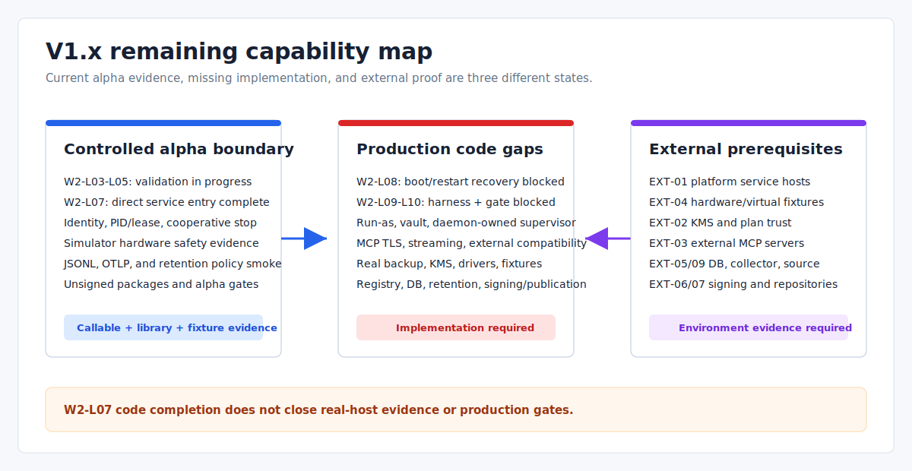

# V1.x Incomplete Feature Inventory

> Language: English
>
> Published default: `docs/en/planning/v1.x-incomplete-feature-inventory.md`
>
> Translation: [Simplified Chinese](../../zh-CN/planning/V1.x未完整实现功能清单.md)

Updated: 2026-07-21

Code snapshot: the audit baseline for `main` is `f75a070` (2026-07-18). The date above records the documentation refresh, not a new release tag.

## Scope

This inventory is a code-backed snapshot of the current `main` branch. It separates callable behavior, library/test-only boundaries, alpha smoke evidence, missing production integration, and external prerequisites. It is not a changelog and does not turn an internal capability marker into a released version.

Completed implementation history belongs in release notes, tags, and Git history. The companion [implementation plan](v1.x-real-runtime-implementation-plan.md) contains only remaining work and dependency order.

## Version and Evidence Semantics

| Signal | Current fact | What it does not prove |
| --- | --- | --- |
| Cargo and CLI version | `1.11.5-alpha` / `V1.11.5-alpha` | A production-ready release |
| Git tags | Tags exist through `v1.11.5-alpha`; there are no `v1.12` through `v1.17` release tags | That later internal markers are published versions |
| `version.data.runtime_mode` | Contains capability/evidence IDs through `v1x_closure_gate_v1.17.6` | A semantic-version sequence or release history |
| `release check` | Reports `status:"ready"`, 7 warning gates, and `closure.status:"ready_with_external_blockers"` with the default inputs; all 8 required gates pass and 5 external blockers are listed | That Cargo/CI, external services, platform integration, or production credentials were checked during the command |
| Production status | The repository is an alpha implementation with controlled local boundaries | Production daemon, platform, hardware, telemetry, or distribution readiness |

The V1.12-V1.17 labels embedded in `runtime_mode`, release gates, and source identifiers are legacy internal evidence IDs added after the `v1.11.5-alpha` tag. They remain stable for compatibility, but must not be described as released versions.



## Status Vocabulary

| Status | Meaning |
| --- | --- |
| Callable | A current CLI/runtime path executes the behavior within its documented boundary |
| Library/test boundary | Code and tests exist, but the production runtime or CLI does not wire the capability end to end |
| Controlled alpha | The path is local, synthetic, simulated, fake, fixture-based, or smoke-only |
| Missing | The required implementation is absent |
| External prerequisite | Hardware, credentials, repository access, platform test infrastructure, or an operational backend is still required |

Security denial is not a missing feature. For example, rejecting an unauthorized provider, MCP tool, Lua host handle, or hardware raw handle is an implemented invariant, not backlog.

## Current Gap Matrix

| Area | Current code boundary | Remaining production gap | Priority |
| --- | --- | --- | --- |
| Release evidence | W0-L01 through W0-L10 are done: EvidenceEnvelope, real argv capture, platform bundles, coverage/freshness/trusted-executor policy, and readback verification are wired; default alpha still exposes declarations/fixtures and six performance gates remain `unmeasured` | Re-run the GitHub-hosted workflow on a new tag, collect measurements for the declared production scope, and build the W10 scope/production decision | P0 |
| Runtime, task, and scheduler | W1-L01 through W1-L12 are done: background daemon/workers, heartbeat, CAS claims, effect ledger, retry/recovery, drain, and real three-platform process evidence exist; run `29542323581` produced a successful aggregate | W2 OS-service wiring, end-to-end external side-effect drills, and query/idempotency protocols for non-idempotent external systems | P0 |
| Provider and capability execution | W3-L01 through W3-L07 are done and the W3-L08 code boundary is wired: real PID/CAS, process-group/Job cleanup, restart budgets, stdio/MCP/command-backed Skill registration, cross-process admission, and run-as propagation/denial regressions exist; the manifest digest is v4, and Linux/macOS/Windows admission evidence in run `29597430669` succeeded. W3-L09 now wires the credential vault/session boundary, minimal child environments, full-path redaction, and no-follow Skill artifact reads, while production remains fail-closed. W3-L10 daemon-owned supervision/drain code is wired and in verification: bounded drain rejects new calls, uses one shared `AdapterRuntime`, and orders provider shutdown before task shutdown | W3-L08 still needs native EXT-01 Linux/macOS/Windows identity evidence (macOS explicit switching is currently unavailable, pending a controlled no-suid or sandbox solution; `Current` remains usable; non-root supplementary groups are rejected in code but still need host attestation, alongside directory ownership and Windows same-SID service-token scope). W3-L09 remains in verification pending a real OS/KMS vault authority, EXT-01 identity/ownership transcripts, cross-UID handoff, ancestor-race/complete TOCTOU evidence, and production leak scanning; W3-L11 three-platform production evidence remains incomplete; TLS/streaming remain W4 work | P0 |
| MCP | Stdio and legacy `http://` JSON-RPC remain callable with tool allowlists, timeout/output limits, and session cleanup. W4-L01 through W4-L06 provide canonical Streamable HTTP configuration, real rustls HTTPS/mTLS, strict HTTP framing/session phases, incremental SSE, and registry-owned socket/session abort, DELETE, and bounded join. W4-L07 now transfers each HTTP session and its credential lease to the daemon supervisor before first I/O, closes admission one way through an independent atomic fence, and uses one absolute deadline for socket abort, DELETE, and reader join. An MCP session-cleanup failure retains the registered session and credential lease for an authorized retry; after session removal, a credential-release failure retains the lease as a retryable release task. Final lifecycle destruction hands pending or failed leases to one process-wide bounded finalizer coordinator. It owns a FIFO queue, runs at most four release workers concurrently, makes one immediate attempt for each newly handed-off owner, and retries failed owners only within a later authorized drain deadline; lifecycle release workers started by drain recheck the deadline immediately before the external callback. Provider drain reports session/reader counts before and after plus cleanup-pending only after; before accepting all three after-counts as zero, the same deadline must clear lifecycle credential owners and process-wide finalizer residuals. Daemon v2 evidence requires that credential gate to succeed and all three after-counts to be zero, and a real TCP regression never reuses an old `Mcp-Session-Id` across runtime generations. W4-L08 provides the caller-owned numeric-loopback server transport and pre-handler read-only tool/schema gates. W4-L09's repository-local implementation is complete and In verification: explicit `eva mcp compatibility measure` uses a sealed typed Measurement to execute the loopback server, rustls handshake, schema/output digests, and registry-owned abort/DELETE/join zero-residual path with an exact 24-field subject; the fifth release-evidence type, `REL-MCP-COMPAT-001`, and three-platform capture/aggregate readback are wired. `eva-mcp` passes 124/124, `eva-adapter` passes 125 with 11 ignored helpers, `eva-runtime` passes 125/125, and workspace tests/Clippy pass | W4-L02 is Done: run `29823611739` passed Website/docs, Linux/macOS/Windows core, and the W1 aggregate; W4-L07's repository-local graceful drain/restart and zero residue are complete, but W3-L10 remains a formal direct prerequisite in verification. Abnormal final registry Drop is only a bounded owner-destruction fallback; after process exit or SIGKILL, remote-session reclamation requires the EXT-03 server disconnect/TTL contract and W4-L10 evidence. W4-L09 run `29830963921` completed all three platform captures, but aggregate readback exposed Linux-side basename parsing of a Windows backslash path; the portable-basename fix now awaits its own three-platform core/capture and independent aggregate readback. W4-L10 still needs a named EXT-03 server, its disconnect/TTL contract, and the external-server matrix. W4-L08's synchronous handler is a caller-trusted boundary and does not claim forced cancellation, inbound TLS/auth, or remote exposure | P0 |
| Backup, snapshot, and restore | Alpha has local archives, pre-restore evidence, plan-gated copy/replace/delete, rollback, and operator confirmation; these gates remain local-boundary checks | W5-L01 through W5-L12: real data selection, persisted catalog, production KMS/AEAD, remote disaster recovery, trusted plans/target roots, service-level blue-green handoff, and drills | P0 |
| Upgrade and service management | W2-L01/L02/L06/L07 are done; `eva service install/status/start/stop/restart/uninstall` is wired and Fake still requires explicit `--dev`. Production Adapters install a canonical hidden entrypoint bound to executable/native argv/working-directory/service identity, and the service manager owns the current daemon process without a respawn; PID/state/lease identity match, Unix signal/Windows SCM stop tokens reuse the existing drain/shutdown transaction, new control requests bind their lease generation, and stale generation residue fails closed. The three platform Adapters remain in controlled lifecycle verification | W2-L03 through L05 real-host transcripts, W2-L08 boot/restart recovery, the W2-L09 three-platform destructive harness, and the W2-L10 production evidence gate; local entrypoint/signal regressions do not replace real SCM/systemd/launchd host, crash/reboot, or cleanup evidence, and real candidate traffic switching remains incomplete | P0 |
| Durable storage | W1 completed writer ownership/CAS, TaskEnvelope, effect ledger, recovery, and EventLog/task/audit/artifact/provider records; the backend remains filesystem-based | Production WAL/compaction, unified transactions/ownership across all writers, and queryable recovery protocols for external non-idempotent effects | P0 |
| Configuration and discovery | W6-L01 through L08, L10, and L11 are done: layered merge, immutable generations, watcher/preflight, atomic swap/recovery, cancellable scans, real PATH probes, durable TTL cache, and mutation inventory | W6-L09 real registry TLS/auth/protocol/pagination client, the DEC-02 decision, and real registry evidence | P1 |
| Memory and knowledge | W8-L01/L03 are done: durable mode no longer writes demo seeds; schedule claim/reclaim uses a stable OS-lock anchor, and the kernel releases ownership after an owner crash so a successor can take over after lease expiry without an additional stale-lock-file delay; W8-L02/L04 schedule/retrieval work is in verification | W8-L05/L06 real retrieval source/index commits and retry/dead-letter/idempotency, plus production query and long-lived retention | P1 |
| Hardware | W7-L01 typed config, simulator safety, permission denial, lease cleanup, and typed hotplug smoke have alpha evidence | W7-L02 through L12 real OS permissions, USB/serial/BLE/socket/vendor drivers, long-lived watchers, I/O/reconnect, and fixture evidence | P1 |
| Observability | W8-L07 runtime-owned OTel lifecycle is wired into the daemon; JSONL, tracing bridge, OTLP smoke, and retention policy are tested, with long-lived behavior still in verification | W8-L08 through L12 export queue/degrade/flush, real collector evidence, database sink, background retention, and production load/cardinality evidence | P1 |
| Distribution | W9-L01 through W9-L05 are done: canonical metadata, Homebrew/Winget/Apt generation, credential-free validators, and three-platform CI measurement; run `29584854839` was read back | W9-L06 through L12 signing/notarization, Authenticode/codesign/Apt signing, SBOM/attestation, repository upload, and post-upload clean install | P1 |

W4-L02 verification update: in GitHub Actions run `29788607021` at commit `42d90e211559432cda6fa182420f8a4a14b06d1e`, the Ubuntu core job succeeded while macOS and Windows exposed, respectively, a Unix lock retained by an inherited duplicated descriptor and a terminal-state race between child exit and failed-frame publication. The current fix explicitly unlocks the Unix writer guard, rereads terminal frames after child exit in the background launcher, and covers both paths with real-process regressions; workspace tests, Clippy, fmt, and the Windows GNU check pass. W4-L02 remains In verification until native Linux/macOS/Windows CI succeeds on the fix commit, and W4-L09 remains directly blocked until then.

W4-L02 second verification update: in GitHub Actions run `29809011161` at commit `41a3964ba8e48dac962591d01ebf129aa032563b`, all three core jobs passed format, Clippy, and W1/W3 evidence before failing in workspace tests. The current fix explicitly unlocks the Unix migration lock and covers a retained duplicate descriptor; accepts `InvalidInput` only in the macOS abort regression when socket shutdown has already terminated the reader; and expands only the Windows PowerShell fixture and durable success-path test budgets while preserving the explicit 1 ms Skill timeout and 20 ms drain negative tests. Workspace tests, Clippy, fmt, the Windows GNU check, and all 129 WSL `eva-storage` tests pass locally. W4-L02 remains In verification and W4-L09 remains directly blocked until native Linux/macOS/Windows CI succeeds on the new fix commit.

W4-L02 third verification update: in GitHub Actions run `29811744322` at commit `126f2dde5d3f085f5d517e9de443767c728993af`, the Ubuntu and macOS core jobs and the Website/docs job succeeded; Windows core failed in the ignored W1 process evidence `w1_real_process_evidence_covers_required_scenarios`, and W1 aggregate failed downstream. The successor daemon returned `timeout` during takeover, followed by a cleanup identity conflict against the old PID projection. The root cause was a create-new `FileSystemScheduleStore` lock file that could survive a force-killed owner: its 60-second stale-file reclamation window exceeded the daemon lease and exhausted the new generation's schedule-lock budget. The current fix uses an OS file lock on a stable per-schedule anchor: the kernel releases lock ownership when the process dies, while normal Drop explicitly calls `unlock()` and leaves the anchor in place. Unit regression `preexisting_lock_anchor_is_reusable_after_owner_exit` and real-daemon force-kill/restart regression `restart_reuses_schedule_lock_anchor_left_by_a_crashed_owner` verify takeover with a leftover anchor after lease expiry without waiting for stale-file reclamation. W4-L02 remains In verification and W4-L09 remains directly Blocked until native Linux/macOS/Windows core and W1 aggregate jobs succeed on the schedule-lock fix commit itself.

W4-L02 fourth verification update: in GitHub Actions run `29820120079` at commit `dec82417de99a56f53cf938d2ed7f87f8539cb68`, Ubuntu and Windows core, Website/docs, and the W1 aggregate succeeded, so the schedule crash-takeover fix passed the native Windows W1 process evidence. macOS core failed only in the existing workspace test `reader_done_signal_does_not_bypass_the_join_deadline`. That test reported reader completion, slept for 200 ms, and used `started.elapsed() < 150ms` to prove that a 20 ms join deadline was not bypassed; runner scheduling delay could therefore produce a false failure. The current fix replaces sleep and wall-clock slack with a zero-capacity channel barrier: after reporting done, the reader cannot finish before explicit release; the first 20 ms wait must return `mcp_stream_reader_join_timeout` with an unfinished `JoinHandle`, and the bounded second wait must join after release. The exact regression passes 30/30 repetitions, `eva-mcp` passes 123/123, and workspace tests, Clippy, fmt, and the Windows GNU check pass. W4-L02 remains In verification and W4-L09 remains directly Blocked until native Linux/macOS/Windows core and W1 aggregate jobs succeed on the test-fix commit itself.

W4-L02 fifth verification update: GitHub Actions run `29821349222` at commit `d6e2ef76e1a8dca66ac5984f7f7c0c585d765142` passed Website/docs, Ubuntu core, macOS core, and the W1 aggregate. Windows core failed only `artifact_collection_rejects_uncontrolled_relative_paths` and `process_skill_runner_collects_artifacts_and_redacts_env`; both external PowerShell fixtures reached the 30-second timeout. The current fix re-executes the current Rust test binary for Windows and adds four exact ignored helpers that still cover stdin EOF, stdout/stderr, artifact collection, secret/session-token redaction, non-zero exit, and timeout. The two former failures pass 40/40 combined repetitions, and `cargo test -p eva-adapter --all-targets` reports 125 passed and 11 ignored. W4-L02 remains In verification and W4-L09 remains directly Blocked until Website/docs, the native Linux/macOS/Windows core jobs, and the W1 aggregate succeed on this native Rust helper fix commit.

W4-L02 sixth completion verification: GitHub Actions run `29823611739` at commit `0ab9678778e2c36156fa6ded704124b5806c9f6c` passed Website/docs, the Windows/Ubuntu/macOS core matrix, and the W1 aggregate. The native Rust helper fix passed the three-platform native gate, so W4-L02 is Done; W4-L09 is unblocked and Ready to start, while W4-L10 still requires a named EXT-03 server and external matrix.

W4-L09 first three-platform verification update: in GitHub Actions run `29830963921` at commit `a6e7b11f7e7c7626f50db475867353b0b67cefd7`, the native Linux/Windows/macOS core jobs, including compatibility capture, and the W1 aggregate succeeded. W4 MCP compatibility evidence readback job `88636979018` failed in the Linux aggregate with `[mcp-compatibility-evidence] reason=capture_argv_invalid detail=Windows`. The Windows capture and Measurement were valid; the validator used `[System.IO.Path]::GetFileName()` on Linux, which did not split a Windows backslash path to its portable basename. The current fix adds `Get-PortableFileName` with both `/` and `\` separators, changes contract fixtures to realistic Linux/macOS/Windows runner capture paths, and adds a regression that rejects an incorrect Windows basename. The fixed contract and a local aggregate readback of all three downloaded artifacts from this run pass. W4-L09 remains In verification pending successful native core/capture and independent aggregate readback on the fix commit.

## External Prerequisites

`release check` currently emits these five closure blockers. They label the production closure and do not mean the entire associated work package lacks code; implementation status and external evidence remain separate.

| Reported blocker | External input | Code still required |
| --- | --- | --- |
| `production_signing_attestation_credentials` | CI OIDC, KMS/HSM, signing and notarization identities | W9-L06 through L10 signer, notarization, attestation, and final-digest wiring |
| `homebrew_winget_apt_repository_credentials` | Repository ownership, publish tokens, and clean-install runners | W9-L11/L12 idempotent upload, public download verification, and clean install |
| `platform_service_manager_test_environment` | Controlled Windows/Linux/macOS service hosts and elevation/login permissions | W2-L03 through L05 real-host transcripts, W2-L08 through L10 boot/recovery/harness/gate, and W3-L08/L11 identity/evidence; W2-L06 CLI and W2-L07 direct-entrypoint code/contracts are verified in-repository |
| `real_or_virtual_hardware_fixture` | Stable hardware or virtual-device fixtures and platform permissions | W7-L02 through L12 permission, driver, I/O, hotplug, and fixture evidence |
| `production_database_sink_and_retention_scheduler` | Database selection, credentials, schema, collector, and operational policy | W8-L09 through L12 database sink, retention worker, and retrieval/telemetry production evidence |

## Interpreting `release check`

> `eva release check` aggregates compiled-in alpha checklist declarations and optional operator-supplied evidence files. It does not run Cargo or CI, connect to external services, verify OS integration, or confirm production credentials. `status:"ready"` means only that no required gate object is marked blocked for the supplied inputs; it is not production readiness.

- `release check` consumes compiled alpha declarations, fixtures, and explicit operator evidence; it does not replace the W0/W10 production-scope verifier.
- W0 now implements real command capture, manifest/readback, and coverage/freshness/trusted-executor policy, but the default command does not run Cargo, CI, external services, OS integration, or production credential checks.
- MCP compatibility uses a repository fixture whose fields are already set to supported values; it is not an external server run.
- Artifact, distribution, scanner, and benchmark results become evidence-driven only when their files are explicitly supplied.
- Commands listed inside gate evidence may still be recommendation strings; only a provenance-bearing measurement envelope is execution evidence.

## Known Risks

| Risk | Current behavior | Required correction |
| --- | --- | --- |
| Version ambiguity | Public version is `1.11.5-alpha` while internal IDs use V1.12-V1.17 labels | Keep the distinction explicit in CLI, release, website, and planning text |
| Stale diagnostics | `doctor` still describes external Adapters as V0.3 placeholders | Align the warning with current controlled execution and unsupported transports |
| Retry evidence | W1 worker/recovery now owns handler, claim, effect, and ACK boundaries; the old direct-ACK mailbox risk is covered, but MCP/external providers still lack production transport | Continue validating non-idempotent recovery with owned workers and real provider evidence; do not treat alpha routing smoke as production execution |
| Demo data mutation | `memory context --durable-backend` no longer writes demo seeds; the in-memory example path remains available for examples | Keep operator durable storage separate from examples and keep retrieval worker disabled by default |
| Restore trust boundary | Plans are unsigned and may name an absolute target root | Add trusted plan provenance and explicit target-root policy before wider use |
| Gate overconfidence | W0 capture/readback and policy exist, but default alpha can still be `ready` from declarations/fixtures, six performance gates are unmeasured, and W10 production scope is not enabled | Enable W10 only after new-tag workflows and domain measurements are complete; retain freshness, trusted-executor, scope-coverage, and artifact-digest gates |

## Verification Entry Points

Run from the repository root:

```powershell
cargo run -q -- version --output json
cargo run -q -- release check --output json
cargo run -q -- doctor --output json
cargo test --workspace
./scripts/validate-cli-json-contracts.ps1
./scripts/validate-version-management.ps1
```

These commands prove local code and contract behavior only. Platform services, hardware, external MCP servers, production telemetry, signing, and repository publication require separate environments and evidence.

## Maintenance Rules

- Update a row only after reading the owning code path and its current tests.
- Do not append per-commit or per-marker completion logs; use release notes and Git history.
- Split a controlled baseline from its production gap instead of marking a mixed row `Done`.
- Keep release evidence, runtime execution, library/test boundaries, and external prerequisites distinct.
- Update both locales, localized diagrams, website cards, and `docs/_i18n/manifest.json` in the same change.

## Related References

- [Real runtime implementation plan](v1.x-real-runtime-implementation-plan.md)
- [Process upgrade and recovery boundary](../operations/process-level-upgrade.md)
- [Backup, snapshot, and restore boundary](../operations/backup-migration-release-snapshot.md)
- [Project configuration boundary](../operations/project-configuration.md)
- [Project release plan](../release/project-release-plan.md)
- [Version management](../release/version-management-plan.md)
