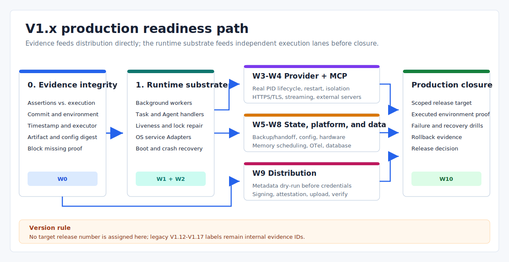

# V1.x Real Runtime Implementation Plan

> Language: English
>
> Published default: `docs/en/planning/v1.x-real-runtime-implementation-plan.md`
>
> Translation: [Simplified Chinese](../../zh-CN/planning/V1.x真实运行时能力补齐实施计划.md)

Updated: 2026-07-17

## Scope

This is the forward plan for closing the production gaps in the [current capability inventory](v1.x-incomplete-feature-inventory.md). It does not repeat completed patch history and does not assign release numbers that have not been approved or tagged.

The current `main` branch still declares Cargo/CLI version `1.11.5-alpha`. The published `v1.11.5-alpha` tag is older and does not contain the post-tag legacy V1.12-V1.17 identifiers now embedded in `runtime_mode`, release gates, fixtures, and code. Those identifiers remain compatibility evidence IDs; they are not the version schedule for this plan.

## Planning Rules

- Treat callable behavior, library/test code, fixture/smoke evidence, and production integration as different completion levels.
- Do not mark a work package complete while its production capability remains deferred under another label.
- External access can block delivery, but missing platform, signing, driver, package, or database code remains implementation work.
- High-risk restore, upgrade, hardware, credential, and publication work stays plan-first, explicitly confirmed, policy-gated, and rollback-aware.
- A production gate must identify who executed the check, where, against which commit/artifact, and when.
- Preserve public CLI JSON compatibility unless a documented compatibility window approves a breaking change.



## Priority Work Packages

### P0: Evidence and Process Substrate

| ID | Deliverable | Dependencies | Exit criteria | State |
| --- | --- | --- | --- | --- |
| W0 | Evidence integrity: separate assertions, fixtures, operator evidence, and executed results; attach commit, environment, timestamp, and digest | Current release checklist and CI artifacts | Missing executed evidence blocks the production gate; static performance budgets remain unmeasured; `release check` never presents command strings as executed logs | Complete |
| W1 | Background Runtime with task/Agent workers, liveness, heartbeat, stale-lock ownership, shutdown, restart, and recoverable durable work | W0; existing foreground mailbox and durable stores | Background mode is supported; queued tasks reach real handlers; crash/restart tests prove ownership and no duplicate non-idempotent effects | Complete |
| W2 | Windows Service, systemd, and launchd Adapters with install/status/start/stop/restart and boot recovery | W1; controlled platform service test environments | Per-platform integration tests run with real services; permission failures are stable; the fake Adapter is not accepted as platform evidence | Open + external environment |
| W3 | OS provider supervision with real PIDs, kill/restart/backoff, process-group cleanup, cross-process admission, user isolation, and credential vault boundary | W1; W2 where service identity is required | Provider crash and daemon restart tests leave no orphan process; restart policy is exercised; credentials never enter output or artifacts | Open |
| W4 | Production MCP transport: HTTPS/TLS, streaming lifecycle, actual server transport, and external-server compatibility matrix | W3; selected external server fixtures | TLS/auth failures are stable; stream abort frees resources; compatibility runs execute real servers instead of an all-true static fixture | Open |
| W5 | Production backup and handoff: real data selection, persisted snapshot catalog, KMS-backed signing/encryption, trusted plans, constrained target roots, and service-manager blue-green upgrade/rollback | W2; W1; artifact provenance from W0; selected KMS, key-custody, rotation, and plan-trust policy | Restore/upgrade drills use real artifacts and services; managed keys can be rotated/revoked; failed candidate/restore rolls back without pointer drift; unsigned or out-of-policy plans are rejected | Open |

### P1: Platform, Data, and Distribution

| ID | Deliverable | Dependencies | Exit criteria | State |
| --- | --- | --- | --- | --- |
| W6 | Runtime configuration and discovery wiring: watcher, atomic route/config replacement, persistent discovery cache, PATH/registry protocol/auth, and complete policy coverage | W1; stable config schema and denial contracts | Config generation swaps are atomic and recoverable; sources perform real I/O with timeout/cancel; every mutating command has an explicit policy decision | Open |
| W7 | Hardware implementation: real permission probes, USB/serial baseline, OS hotplug watcher, fixture-backed release evidence, then BLE/socket/vendor extensions | W1; real or virtual hardware fixtures | Real or virtual fixture tests cover I/O, reconnect, lease cleanup, permission denial, and no raw handles above the hardware boundary | Open + external fixtures |
| W8 | Long-lived memory/knowledge and observability services: real retrieval scheduling, runtime OTel initialization/flush, background retention, and a database sink | W1; database and operational policy selection | Demo seeding is absent from operator paths; restart-safe schedules run; collector/database failure degrades as designed; retention evidence is produced by the daemon | Open + backend decision |
| W9 | Production distribution: Homebrew/Winget/Apt metadata generation and local dry-run first, then signing/notarization/attestation, credentialed upload, download digest verification, and install smoke | W0; signing identities and repository access only for signing/upload stages | Metadata can be validated without credentials; production artifacts are signed and attested; failed upload cannot report a complete release; post-upload install smoke passes | Open + external credentials/access |

### Final Production Closure

| ID | Deliverable | Dependencies | Exit criteria | State |
| --- | --- | --- | --- | --- |
| W10 | Production closure gate and release decision | W0-W9 for the declared production scope | Gate consumes executed platform, provider, protocol, restore, hardware, telemetry, security, signing, distribution, and rollback evidence; no static alpha pass can satisfy production scope | Not started |

## Dependency Order

1. Land W0 first so every later claim has trustworthy provenance.
2. Build W1 before expanding live providers, configuration reload, background services, or retention scheduling.
3. Implement W2 and W3 on that process substrate; service identity and provider lifecycle must be testable before production handoff.
4. Complete W4 after real process supervision so MCP sessions and streams have an owner that can terminate and recover them.
5. Complete W5 after platform services, real artifact provenance, and an approved KMS/key-custody and plan-trust policy exist.
6. W6-W9 can proceed in parallel after their listed prerequisites; credentials must not block local package metadata dry-runs.
7. Create W10 only after the selected production scope has executable evidence. The current alpha closure gate is not reused as production certification.

## Logical Change Tracking Rules

This section defines a logical change as one independently reviewable change with one observable behavior and one explicit acceptance proof. A logical change is not a source line or a per-commit diary. If implementation reveals that one ID changes two independent behaviors, split a new stable ID before coding rather than silently widening the original ID.

The progress snapshot is based on main commit 82f7416 on 2026-07-15. A Present behavior cell describes reusable alpha, library, or test groundwork; it does not mean the target production change is complete.

| State | Use it when |
| --- | --- |
| Ready | Direct prerequisites are satisfied and implementation has not started |
| Not started | The change is in scope but is not yet in an executable queue |
| In progress | An implementation diff exists but complete verification has not started |
| In verification | Code and contracts are complete while required test or environment evidence is being collected |
| Blocked | A direct code prerequisite, decision, or external condition is not satisfied |
| Done | Target behavior, compatibility contracts, negative tests, and required evidence all pass |
| Deferred | A decision record and resume condition exist; the item remains incomplete |
| Out of scope | A production-scope decision explicitly removed the item; it is not counted as complete |

State and blocker are separate dimensions. Missing external access cannot complete missing code, and the presence of smoke tests, fixtures, fake implementations, or fields cannot promote a production change to In progress. A work package can move from Open to Complete only when every in-scope logical ID is Done.

### External Prerequisite Register

| ID | Prerequisite | Current state | Resolution condition |
| --- | --- | --- | --- |
| EXT-01 | Controlled Windows, Linux, and macOS service hosts | Unsatisfied | Destructive service lifecycle, crash, reboot, and finally cleanup can run |
| EXT-02 | KMS/HSM, key custody, rotation, revocation, and plan-trust policy | Unsatisfied | Provider, trust root, key reference, rotation, and revocation rules are selected |
| EXT-03 | Named external MCP server fixtures and compatibility scope | Unsatisfied | Server names, versions, transports, TLS/auth, and repeatable environments are fixed |
| EXT-04 | Real or virtual hardware fixtures, vendor SDKs, and platform permissions | Unsatisfied | Fixture IDs, runners, licenses, and destructive-test boundaries are fixed |
| EXT-05 | Production database, schema, credentials, retention, and operational policy | Unsatisfied | Backend, schema ownership, SLOs, retention, and degradation are approved |
| EXT-06 | CI OIDC plus Windows, macOS, and Linux signing/notarization identities | Unsatisfied | Controlled CI/KMS can reference, verify, rotate, and revoke identities |
| EXT-07 | Homebrew, Winget, and Apt repository access plus clean-machine runners | Unsatisfied | Sandbox/production publish tokens, download URLs, and clean install hosts exist |
| EXT-08 | Named remote disaster-recovery store and access identity | Unsatisfied | Provider, region/endpoint, retention, credential ref, and destructive-test namespace are fixed |
| EXT-09 | Real OTel collector and named production retrieval source | Unsatisfied | Collector protocol/endpoint, retrieval provider/version, credentials, and fault-injection environment are fixed |
| DEC-01 | Approved production scope | Unsatisfied | Supported OS, service, provider, protocol, restore, hardware, telemetry, security, and distribution scope is explicit |
| DEC-02 | Registry protocol, authentication method, and trust roots | Unsatisfied | Endpoint schema, TLS trust, auth references, pagination, and compatibility policy are fixed |

## Detailed Implementation Plan

The following is a forward-only plan. Owning boundary names the primary modification surface; it does not permit bypassing dependent modules. Tests and evidence in the acceptance column ship with the behavior and are not separate placeholder features.

### W0: Evidence Integrity

| Logical ID | Owning boundary | Present behavior | Target logical change | Direct prerequisites | Acceptance evidence |
| --- | --- | --- | --- | --- | --- |
| W0-L01 | eva-release/src/evidence.rs (new), lib.rs | Artifact, distribution, scanner, and benchmark types have scattered fields | Add EvidenceEnvelope with kind, source, source_commit, environment, executor, timestamp, and subject_digest | No new prerequisite | Four kinds round-trip; missing fields, unknown kind, and empty executor are rejected |
| W0-L02 | evidence.rs, artifact.rs, benchmark.rs, distribution.rs, scanner.rs | Some evidence has a commit or digest but no uniform subject verification | Validate SHA-256, build commit, artifact/command-output bytes, and reject mixed-commit bundles | W0-L01 | Tampered digest, wrong commit, and mixed commits produce stable blocked reasons |
| W0-L03 | eva-cli/src/run/release_cmd.rs, eva-release/src/evidence.rs/checklist.rs, contracts/cli-json/release-check.json | CLI accepts four optional evidence files and can still report ready without them | Add a strict indexed evidence manifest and alpha/production scope; bind production to an externally trusted commit through `--expected-source-commit`, allow only verifier-constructed bundles into the checklist, reference real artifact subjects, bind other types to canonical evidence documents, and normalize legacy inputs into weak envelopes | W0-L01, W0-L02 | Production without a manifest/trusted commit exits nonzero and remains fail-closed until later kind/coverage policy is complete; bidirectional alpha/production scope mismatch fails; path/handle escape, wrong commit, typed-subject tamper, and real-artifact tamper are blocked while legacy alpha gates remain compatible |
| W0-L04 | checklist.rs, eva-mcp/src/compatibility.rs | Static gates, all-true MCP fixture, and command strings can appear as passing evidence | Classify built-ins as declarations or fixtures; production accepts measurements only | W0-L01, W0-L03 | Alpha may display fixtures; production reports evidence_kind_not_measured |
| W0-L05 | performance.rs, benchmark.rs, checklist.rs, release_cmd.rs | Fixed observed_ms values are wrapped as required passes | Separate budgets from observations; no measurement means synthetic/unmeasured and blocks production | W0-L01, W0-L04 | No evidence cannot claim measured pass; real over/within-budget cases are covered |
| W0-L06 | scripts/capture-release-evidence.ps1 (new), CI/release workflows | Workflows execute commands, while gates often retain suggested strings or summaries | Execute argv and record outcome, start/end, stdout/stderr digests, and runner identity | W0-L01, W0-L02 | Success, failure, and timeout differ; output digests can be recomputed |
| W0-L07 | CI/release workflows, evidence.rs | Platform jobs do not share one bundle subject | Emit OS/arch/toolchain/run-id envelopes and a bundle digest; enforce commit/tag/artifact consistency | W0-L02, W0-L06 | Same-commit platforms aggregate; replaced source SHA or artifact fails |
| W0-L08 | checklist.rs, evidence.rs | Closure checks fixed gate IDs and five text blockers | Enforce coverage, freshness, trusted executors, uniqueness, and measurement requirements | W0-L03 through W0-L07 | Tables cover missing, stale, conflicting, untrusted, and complete manifests |
| W0-L09 | release_cmd.rs, eva-cli/src/run.rs, CLI JSON contract script | JSON exposes only alpha gate summaries | Emit per-gate kind, provenance, remediation, and stable production-blocked exit semantics | W0-L08 | Golden subset remains alpha-compatible; missing production evidence fails stably |
| W0-L10 | CI/release workflows, checklist.rs | A gate can consume an in-job declaration directly | Upload, download, rehash, and revalidate the W0 evidence bundle under production scope | W0-L06 through W0-L09 | Deleted or tampered downloaded artifact always fails; success binds its digest |

### W1: Background Runtime

| Logical ID | Owning boundary | Present behavior | Target logical change | Direct prerequisites | Acceptance evidence |
| --- | --- | --- | --- | --- | --- |
| W1-L01 | eva-storage/src/durable_backend.rs, task_state.rs, state_store.rs | Files persist, but long-lived writer generation and CAS do not exist | Add owner generation, record version, CAS, and atomic rename; separate migration and runtime ownership locks | W0-L10 | Two processes yield one writer; an old version cannot overwrite a new state |
| W1-L02 | task_state.rs, eva-runtime/src/task.rs, daemon.rs, daemon_cmd.rs | Submit mainly persists task ID and status | Persist TaskEnvelope with kind, agent, input/artifact ref, idempotency key, and attempt policy | W1-L01 | Reopen restores the payload; invalid kind or digest is rejected |
| W1-L03 | eva-runtime/src/daemon.rs, durable_backend.rs | daemon.lock conflicts solely because a file exists | Store PID, process start token, generation, heartbeat, and expiry; reclaim only a dead expired owner | W1-L01 | Live lock is not stolen; PID reuse is safe; expired lock is atomically reclaimed |
| W1-L04 | daemon.rs, daemon_cmd.rs | Non-foreground start is explicitly unsupported | Implement parent/child background spawn, ready handshake, real PID output, and failure cleanup | W1-L03 | Daemon survives parent return and supports status/shutdown; failure leaves no PID/active lease and preserves a valid fixed anchor |
| W1-L05 | eva-runtime/src/task_worker.rs (new), lib.rs, daemon.rs | Queued tasks have no real handler owner | Add task handler registry; unknown handlers cannot be acknowledged as executed | W1-L02 | Handler receives original payload and returns result; unknown kind fails stably |
| W1-L06 | task_worker.rs, task_state.rs, daemon.rs | No cross-worker claim/execution loop exists | CAS queued to running, bind owner/attempt/cancel token, execute, then write terminal state | W1-L03 through W1-L05 | Two workers do not duplicate an attempt; queued work reaches a real handler |
| W1-L07 | task_worker.rs, task_state.rs, daemon.rs, daemon_cmd.rs | Heartbeat fields exist without an owner lease protocol | Renew daemon/task leases and report live/degraded/stale from freshness | W1-L03, W1-L06 | Stopped heartbeat becomes stale on time; a live worker is never reclaimed |
| W1-L08 | scheduler_retry.rs, task_worker.rs, eva-eventbus/src/durable.rs | Replay is ACKed after delivery to a temporary mailbox | Route replay to an owned handler and ACK only success; retain failures/dead letters | W1-L05 through W1-L07 | No handler means no ACK; success ACKs once; failure resumes after restart |
| W1-L09 | eva-storage/src/effect_ledger.rs (new), task_worker.rs | Non-idempotent effects lack a durable commit boundary | Record prepared/committed/result digest by idempotency key and consult it before retry | W1-L01, W1-L02, W1-L05 | Kill after effect but before task completion; restart reuses result without repetition |
| W1-L10 | eva-runtime/src/recovery.rs, task_worker.rs, task_state.rs | Recovery mostly classifies states and redrives | Requeue expired idempotent tasks, complete committed effects, and block unknown effects for operators | W1-L07 through W1-L09 | Crash points prove rerun, completion repair, and manual block paths |
| W1-L11 | daemon.rs, task_worker.rs, shutdown.rs | Foreground shutdown cleans basic state | Stop claims, drain/cancel inflight work, flush state, then release writer/daemon leases | W1-L06, W1-L07, W1-L10 | No running residue; timed-out work has stable terminal state; repeated shutdown is idempotent |
| W1-L12 | tests/background_runtime.rs, CI workflows | Tests are mostly in-thread or foreground | Add real-process background, kill, stale-lock, restart, and effect-dedup harness with W0 envelopes | W0-L10, W1-L04, W1-L08, W1-L10, W1-L11 | Three-platform process evidence; any missing scenario blocks W1 |

### W2: Platform Service Manager

| Logical ID | Owning boundary | Present behavior | Target logical change | Direct prerequisites | Acceptance evidence |
| --- | --- | --- | --- | --- | --- |
| W2-L01 | eva-config/src/eva_yaml.rs, eva-lifecycle/src/service_manager.rs | Service kinds, a trait, and Fake Adapter exist | Unify config/lifecycle kinds and add typed install/uninstall/status/start/stop/restart contracts | W1-L12 | Config converts losslessly; Fake covers all operations and stays production_adapter=false |
| W2-L02 | eva-lifecycle/src/service_command.rs, service_factory.rs (new) | No real host executor/factory exists | Add non-shell executor, require host-kind match, and preserve result digests | W2-L01 | Mock validates argv; wrong platform fails before execution; secrets stay out of audit |
| W2-L03 | eva-lifecycle/src/windows_service.rs (new) | WindowsService is only an enum value | Implement SCM/service install/query/start/stop/restart/delete and automatic start | W2-L02, W1-L04 | Real Windows lifecycle, idempotency, and permission errors |
| W2-L04 | eva-lifecycle/src/systemd.rs (new) | systemd is only an enum value | Atomically write unit and run daemon-reload, enable/disable, start/stop/restart, and state parsing | W2-L02, W1-L04 | Real Linux lifecycle, boot recovery, and non-root errors |
| W2-L05 | eva-lifecycle/src/launchd.rs (new) | launchd is only an enum value | Generate plist and run bootstrap/bootout/kickstart/print for user/system domains | W2-L02, W1-L04 | Real macOS lifecycle, RunAtLoad/KeepAlive, and permission errors |
| W2-L06 | eva-cli/src/run/service_cmd.rs (new), run.rs | CLI has no real service lifecycle commands | Add service install/status/start/stop/restart/uninstall; Fake requires explicit dev mode | W2-L03 through W2-L05 | JSON fixes mutation_executed, production_adapter, platform errors, and idempotent state |
| W2-L07 | daemon_cmd.rs, daemon.rs, service_cmd.rs | Daemon has no service entry point | Let the manager start a direct daemon entry point without respawn and report service identity | W1-L04, W1-L11, W2-L06 | Daemon and manager PID agree; stop runs drain/shutdown |
| W2-L08 | daemon.rs, service_manager.rs, platform Adapters | Real boot/service restart recovery is absent | Reclaim expired lease and queued work; reject double start while a live instance exists | W1-L10, W2-L07 | Crash/reboot completes queued task without duplicate worker |
| W2-L09 | scripts/test-platform-service.ps1 (new), CI workflows | Three-OS CI runs ordinary workspace tests only | Run destructive lifecycle/reboot with unique names and mandatory finally cleanup | W1-L12, W2-L03 through W2-L08, EXT-01 | All hosts complete install through uninstall; cleanup failure fails the job |
| W2-L10 | eva-release/src/checklist.rs, evidence.rs | Release gate accepts Fake Adapter declarations | Accept only production_adapter=true W2 transcripts with complete operation digests | W0-L10, W2-L09 | Fake, missing restart, and wrong OS block; three real platforms pass |

### W3: OS Provider Supervision

| Logical ID | Owning boundary | Present behavior | Target logical change | Direct prerequisites | Acceptance evidence |
| --- | --- | --- | --- | --- | --- |
| W3-L01 | eva-adapter/src/manifest.rs, eva-config manifest parser | Restart/backoff fields and environment credential references have partial boundaries | Add restart mode/max attempts, run-as identity, and vault refs; reject plaintext production secrets | W1-L12 | Invalid combinations fail; legacy manifests default to restart=none |
| W3-L02 | eva-storage/src/provider_process.rs | Durable mirror stores a synthetic process ID and state | Store real PID, group/job ID, start token, owner generation, attempt/version, and update with CAS | W1-L01, W3-L01 | PID/start token round-trip; stale owner/CAS cannot overwrite current record |
| W3-L03 | eva-adapter/src/process_backend.rs and platform modules (new) | Each transport directly spawns children | Create Unix process groups and Windows Job Objects; return query/wait/terminate handles | W3-L02 | Helper and descendants share supervision; snapshot contains real PID |
| W3-L04 | transports/stdio.rs, eva-mcp/src/json_rpc.rs, adapter runtime | Stdio/MCP spawn children outside a central OS supervisor | Spawn and register through process backend; registration failure immediately terminates child | W3-L03 | Spawn/record fault injection leaves no orphan; OS can query reported PID |
| W3-L05 | process_backend.rs, eva-runtime/src/recovery.rs, daemon.rs | Timeout mainly kills a direct child; recovery changes snapshot state only | Graceful terminate then force-kill the whole group/job; scan orphans at daemon start | W3-L04 | Provider/daemon crash leaves no parent or child; cleanup is auditable |
| W3-L06 | eva-adapter/src/restart.rs (new), provider_process.rs, daemon.rs | Backoff appears in fields/errors but does not execute restarts | Run durable attempt budget and exponential backoff/jitter; reset after stable operation | W3-L02, W3-L05 | Crash loop respects budget; daemon restart preserves attempt/backoff |
| W3-L07 | supervisor.rs, eva-storage/src/provider_admission.rs (new) | Concurrency/rate/circuit state is process-local | Use durable reservations/CAS and release on completion or lease expiry | W1-L01, W3-L02 | Two processes never exceed max concurrency; crash reservation is reclaimed |
| W3-L08 | Process backend platform modules, supervisor.rs | Provider inherits daemon identity | Apply Unix uid/gid or Windows service token and reject privilege expansion before spawn | W2-L07, W3-L01, W3-L03 | Test accounts are isolated; unauthorized identity fails before spawn |
| W3-L09 | eva-adapter/src/credential_vault.rs (new), supervisor and transports | Secrets come from parent environment with output redaction | Manifest carries refs only; fetch, inject, release per session and scan every output path | W3-L01, W3-L08 | Secret never appears in Debug, audit, artifacts, streams, or errors |
| W3-L10 | eva-runtime/src/daemon.rs, eva-adapter/src/runtime.rs | Each invocation owns a local transport lifecycle | Daemon owns supervisor/handles; drain stops admission and waits or kills before exit | W1-L11, W3-L05 through W3-L09 | Daemon stop leaves active provider count zero; drain rejects new calls |
| W3-L11 | eva-adapter/tests/os_supervision.rs (new), CI/release gate | Only fake/in-process supervisor tests exist | Produce real crash/restart, descendant cleanup, cross-process admission, isolation, and leak evidence | W0-L10, W3-L08 through W3-L10, EXT-01 | Transcript binds real PID/identity; artifact scan finds zero secret matches |

### W4: Production MCP Transport

| Logical ID | Owning boundary | Present behavior | Target logical change | Direct prerequisites | Acceptance evidence |
| --- | --- | --- | --- | --- | --- |
| W4-L01 | eva-mcp/src/session.rs, eva-adapter/src/manifest.rs | Stdio and plaintext HTTP work; parsed HTTPS is rejected | Define stdio/Streamable HTTP config with trust roots, client auth, redirect, and origin policy | W3-L10 | Reject unknown scheme, cross-origin redirect, and production HTTPS without trust policy |
| W4-L02 | eva-mcp/src/http_transport.rs (new) or json_rpc.rs | No TLS connector exists | Implement certificate chain, hostname/SNI, validity, client cert, and connect/read/write timeout | W4-L01 | Local CA succeeds; expired, wrong-host, unknown-CA, and bad-cert failures are stable |
| W4-L03 | json_rpc.rs | Response reading uses simplified framing/EOF | Handle Content-Length, chunked, content-type, 202/204, keep-alive, and response limits | W4-L02 | Fragmented, chunked, keep-alive, oversize, and invalid headers never hang |
| W4-L04 | eva-mcp/src/streamable_http.rs (new), json_rpc.rs | HTTP executes one JSON-RPC request at a time | Implement initialize, Mcp-Session-Id, later POST/GET, version negotiation, and DELETE shutdown | W4-L03 | Fake server verifies session/header sequence; bad session closes |
| W4-L05 | eva-mcp/src/sse.rs (new), streamable_http.rs | No production SSE data plane exists | Incrementally parse SSE and correlate request IDs across events, UTF-8 chunks, ping, errors, and limits | W4-L04 | Interleaved response, disconnect, invalid UTF-8, and oversize tests |
| W4-L06 | lifecycle.rs, streamable_http.rs, json_rpc.rs | Abort changes only in-memory state | Bind registry to reader; abort cancels I/O, closes socket/deletes session, waits reader, then cleans state | W4-L05 | Server observes cancel; reader exits, socket closes, dangling count is zero |
| W4-L07 | adapter transports/mcp.rs, runtime daemon, MCP lifecycle | MCP sessions have no recoverable long-lived owner | W3 supervisor owns them; daemon crash/restart cleans processes, connections, sessions, and streams | W3-L10, W4-L06 | Forced daemon death leaves no orphan; restart never reuses stale HTTP session |
| W4-L08 | eva-mcp/src/server.rs, server_transport.rs (new) | Server surface is primarily a descriptor/fixture | Connect real controlled server transport for initialize/tools/list/tools/call with explicit tools only | W4-L04, W4-L06 | External client calls allowed tool; hidden tool is rejected before handler |
| W4-L09 | compatibility.rs, mcp_cmd.rs, release checklist | Compatibility is an all-true static fixture | Generate name/version/transport/TLS/schema/abort and output digests from actual runs | W0-L01, W4-L02, W4-L06, W4-L08 | Handwritten all-true fixture is rejected for production |
| W4-L10 | scripts/test-mcp-compatibility.ps1 (new), CI workflows | Selected external servers are never run | Execute stdio/HTTPS/auth/stream-abort matrix and upload W0 evidence | W0-L10, W4-L07, W4-L09, EXT-03 | Every server starts and reports version; skipped run, TLS bypass, or dangling stream blocks |

### W5: Production Backup And Handoff

| Logical ID | Owning boundary | Present behavior | Target logical change | Direct prerequisites | Acceptance evidence |
| --- | --- | --- | --- | --- | --- |
| W5-L01 | eva-backup/src/source_selector.rs (new), backup_cmd.rs | Backup CLI uses three synthetic records | Select real config, durable state, release pointer, and declared roots under include/exclude/sensitive policy | W0-L10, W1-L12, W2-L10 | Real temp project restores byte-for-byte; demo text disappears; escape/symlink is rejected |
| W5-L02 | artifact_store.rs, backup_service.rs | Archive/manifest can be built without one committed visibility boundary | Persist bytes, manifest, and verification record using prepared/committed protocol | W5-L01 | Crash at bytes/metadata/commit exposes committed backups only |
| W5-L03 | eva-backup/src/snapshot_catalog.rs (new), release_snapshot.rs, snapshot_cmd.rs | Snapshot report is mainly constructed in memory | Persist create/get/list catalog indexed by ID, generation, release, and artifact digest; isolate corruption | W5-L02 | Cross-process query; duplicate ID conflicts; bad record does not hide healthy records |
| W5-L04 | eva-backup/src/key_provider.rs (new), archive.rs, config | Local development keys/secrets are used | Define KMS sign/verify, data-key generation/decryption, version/status; forbid local keys in production | W5-L02, EXT-02 | Provider contract; production local key fails before data read |
| W5-L05 | archive.rs, manifest_verifier.rs, backup_service.rs | Keyed hash/XOR is only a development boundary | Use KMS signature and AEAD envelope with key version, nonce, algorithm, and ciphertext digest | W5-L04 | Tampered nonce/tag/digest, revoked key, or wrong version fails; rotation remains verifiable |
| W5-L06 | eva-backup/src/remote_store.rs (new), backup_service.rs | Remote target is a contract field only | Upload, retry, read back digest; required target failure cannot commit catalog; credentials use vault refs | W3-L09, W5-L02, W5-L05, EXT-08 | Conflict/tamper/retry tests; real target readback digest matches |
| W5-L07 | eva-backup/src/trusted_plan.rs (new), restore_apply.rs, upgrade_cmd.rs | Restore/upgrade plans are unsigned | Canonically sign issuer, expiry, commit, artifact digest, target-policy ID, nonce, and prevent replay | W0-L02, W5-L04 | Unsigned, expired, wrong-commit, replayed, or edited plan fails before lock/mutation |
| W5-L08 | restore_apply.rs, restore_cmd.rs, eva-config | Steps reject traversal/symlink, but CLI accepts arbitrary absolute root | Allow only canonical policy roots; reject junction/reparse/TOCTOU and bind policy ID | W5-L07 | Unix symlink, Windows junction, unauthorized absolute root, and TOCTOU all fail |
| W5-L09 | manifest_verifier.rs, restore_apply.rs, snapshot_catalog.rs | Restore can rely on ArtifactRecord digest and local evidence | Load catalog and verify KMS signature plus ciphertext/plaintext digests before entry parsing | W5-L03, W5-L05, W5-L07, W5-L08 | Bad manifest signature blocks even with valid artifact digest; healthy archive restores |
| W5-L10 | restore_apply.rs, storage atomic helper | Staged mutation/rollback exists without complete local crash atomicity | Temp-write, fsync, atomic rename; generation/CAS log; resume or reverse rollback on startup | W1-L01, W5-L08, W5-L09 | Copy/replace/delete crash points converge; repeated rollback is idempotent |
| W5-L11 | lifecycle/handoff.rs, service_manager.rs, upgrade_cmd.rs | Handoff uses in-memory supervisor and local pointer | Use real manager to start candidate, check health, drain old, switch pointer, stop old, and recover failures | W2-L08, W5-L07 | Candidate-health and pointer-write faults restore old service and pointer |
| W5-L12 | scripts/test-production-handoff.ps1 (new), CI/release gate | Only local archive/restore/handoff tests exist | Drill real dataset, KMS rotation/revoke, remote readback, blue-green, and failure rollback | W0-L10, W1-L12, W2-L10, W5-L06, W5-L10, W5-L11, EXT-02, EXT-08 | Evidence binds pointer, PID, artifact digest, key version; incomplete rollback blocks |

### W6: Runtime Config And Discovery

| Logical ID | Owning boundary | Present behavior | Target logical change | Direct prerequisites | Acceptance evidence |
| --- | --- | --- | --- | --- | --- |
| W6-L01 | crates/eva-config/src/layering.rs (new), eva_yaml.rs, lib.rs, schema.rs, config/schemas | One fixed project configuration is loaded once | Define base/profile/user/environment precedence, validate merged input, and emit secret-free canonical digest | W1-L12 | Deterministic merge; invalid override fails closed; identical input has identical digest |
| W6-L02 | eva-runtime/src/config_generation.rs (new), runtime.rs, services.rs | Generation ID does not carry a full config snapshot | Build immutable RuntimeConfigGeneration with config/routes/policy/discovery and hide incomplete candidate | W6-L01 | Any route/policy error produces no candidate; build is all-or-nothing |
| W6-L03 | eva-runtime/src/config_watcher.rs (new), daemon.rs | hot_reload is only a configuration field | Watch main config, manifests, policy, routes, and sources with debounce, cancel, and change coalescing | W6-L02 | Burst writes trigger one reload; shutdown leaves no thread/handle |
| W6-L04 | config_watcher.rs, config_generation.rs, observability audit | Daemon reload mainly writes generation state | Preflight schema/reference/policy/route; failure records remediation without changing active | W6-L03 | Invalid reload keeps active; audit has old/candidate digest and field error |
| W6-L05 | runtime.rs, basic.rs, scheduler_retry.rs, daemon.rs | Config, routes, and policy lack one atomic generation | Swap one pointer; old requests keep old generation and new requests see only new generation | W6-L04, W1-L06 | No new-config/old-route mix; old generation retires after old requests finish |
| W6-L06 | config_generation_store.rs (new), daemon.rs, eva-storage | Promotion has no durable prepare/promote/retire phases | Persist active/previous manifests, digests, and promotion state; recover exactly one active generation | W6-L05 | Crash points for prepare/promote/retire; restart pointer never drifts |
| W6-L07 | eva-discovery/src/scanner.rs, sources, service.rs | Timeout compares elapsed after synchronous source returns | Make DiscoverySource cancellable with a real I/O deadline | W1-L12, W6-L02 | Hanging source cancels by deadline; others continue; no I/O leak |
| W6-L08 | sources/path_commands.rs, normalizer.rs | Source records manifest command names only | Resolve real PATH, executable bit, path allowlist, version probe, and canonical path digest | W6-L07 | Hit, shadow, non-executable, unauthorized path, and cancel cases |
| W6-L09 | sources/registry.rs, eva-config registry schema | Source only checks config/registries directory | Add TLS/auth registry client, pagination, schema, timeout/cancel; keep secrets out of all output | W6-L07, DEC-02 | Mock covers pagination, 401, TLS, malformed, timeout, and token leaks |
| W6-L10 | discovery/cache.rs, service.rs, eva-storage | Cache is an in-process Vec snapshot | Persist per-source TTL entries with fetched/expires/source digest and corruption isolation | W6-L07 | Restart hit; expired data is not returned; one bad source preserves others |
| W6-L11 | eva-policy, CLI run commands, runtime daemon, mutation policy validator (new) | Restore/upgrade/hardware have partial policy wiring only | Inventory every mutation and require explicit PolicyDecision before any side effect | W6-L01 | Inventory and mutations match both ways; denial keeps mutation_executed=false |

### W7: Hardware

| Logical ID | Owning boundary | Present behavior | Target logical change | Direct prerequisites | Acceptance evidence |
| --- | --- | --- | --- | --- | --- |
| W7-L01 | eva-config manifest/adapter.rs, hardware driver.rs | Typed bus/protocol/driver config exists, but real drivers cannot run | Define real/simulated kind, locator, operations, I/O limits, reconnect, and socket endpoint/TLS/auth policy refs; forbid raw path escape | W1-L12 | Schema rejects invalid driver/raw path/unbounded I/O/unauthorized endpoint; simulator remains compatible |
| W7-L02 | eva-hardware/src/permission platform modules (new), lifecycle.rs | PlatformOsPermissionProvider returns a configured boolean | Check Windows/Linux/macOS ACL, device node, entitlement, and Bluetooth permissions | W7-L01, EXT-04 | Platform allow/deny; deny precedes lease/open; locator is redacted |
| W7-L03 | Hardware discovery platform modules (new), discovery.rs | Candidate is synthesized from manifest | Enumerate USB/serial and normalize stable identity; reject ambiguous auto-binding | W7-L01, EXT-04 | Add/remove/re-enumerate, VID/PID/serial match, and no raw handle output |
| W7-L04 | hardware/drivers/usb.rs (new), driver.rs | Adapter rejects every non-simulated driver | Implement bounded USB open/read/write/control, timeout/cancel, and close | W7-L02, W7-L03, EXT-04 | I/O, timeout, cancel, disconnect; handle count is zero after close |
| W7-L05 | hardware/drivers/serial.rs (new), driver.rs | No real serial driver exists | Implement allowlisted baud/frame, bounded read/write, flush, timeout/cancel, and close | W7-L02, W7-L03, EXT-04 | Loopback, invalid parameters, disconnect, cancel, and lease cleanup |
| W7-L06 | adapter/transports/hardware.rs, hardware/lifecycle.rs | Transport forces simulated and returns audit-only output | Register real drivers and run policy, permission, lease, open, invoke, close with cleanup on every error | W7-L04, W7-L05, W1-L12 | Every fault releases lease; no raw handle crosses the boundary |
| W7-L07 | hardware/os_hotplug platform modules (new), lifecycle.rs, runtime daemon | Daemon runs one manifest snapshot scan | Run long-lived OS watcher with typed events, shutdown, crash recovery, and state persistence | W7-L03, W7-L06 | Plug/unplug and restart recovery; watcher crash releases active leases |
| W7-L08 | lifecycle.rs, hotplug.rs, registry.rs | Logical state machine has no real handle | Reconnect with backoff; close old handle and rerun permission/policy/lease | W7-L07 | Permission change blocks reconnect; no stale handle or duplicate lease |
| W7-L09 | tests/hardware-fixtures (new), scripts/run-hardware-fixture.ps1 (new), eva-release/src/checklist.rs | Production gate accepts simulator-only alpha evidence | Produce fixture ID, OS, commit, driver, I/O digest, and cleanup evidence | W0-L10, W7-L04 through W7-L08, EXT-04 | Evidence revalidates; missing fixture or simulator-only blocks production |
| W7-L10 | hardware/drivers/socket.rs (new) | Socket driver is absent | After USB/serial, add endpoint allowlist, TLS/auth, frame/size limits, and cancel | W7-L01, W7-L06 | Local TLS fixture covers auth denial, disconnect, and cleanup |
| W7-L11 | hardware/drivers/ble.rs and platform modules (new) | BLE is a typed marker only | Implement BLE scan/connect/GATT allowlist, OS permission, timeout, and disconnect cleanup | W7-L02, W7-L08, EXT-04 | Declared platform matrix covers GATT I/O, denial, and reconnect |
| W7-L12 | hardware/drivers/vendor.rs, adapter supervisor (new) | Vendor kind is reserved but not implemented | Isolate SDK process and enforce capability/ABI/version allowlists plus crash cleanup | W3-L10, W7-L06, EXT-04 | Fake contract plus selected SDK smoke; crash does not kill daemon or leak lease |

### W8: Memory/Knowledge And Observability

| Logical ID | Owning boundary | Present behavior | Target logical change | Direct prerequisites | Acceptance evidence |
| --- | --- | --- | --- | --- | --- |
| W8-L01 | eva-cli/src/run/memory_cmd.rs | memory context writes seed data on every call, including durable mode | Remove implicit seed; operator path reads existing store, returns empty without writes | W1-L12 | Store digest unchanged; no demo ID/secret; empty store succeeds |
| W8-L02 | eva-memory/src/schedule.rs (new), durable.rs | Durable memory/knowledge/checkpoint exists without schedules | Define schedule, run, attempt, next-run, and idempotency model | W1-L01, W1-L12 | Schedule round-trip; invalid transitions fail; canonical idempotency key is stable |
| W8-L03 | eva-memory/src/schedule_store.rs (new), eva-storage | No long-lived job ownership exists | Claim/heartbeat/complete/fail/reclaim, recover due jobs, and deduplicate index commits | W1-L12, W8-L02 | Concurrent claim has one owner; crash before/after index does not duplicate; stale claim is reclaimed |
| W8-L04 | eva-runtime/src/memory_worker.rs (new), daemon.rs | Daemon performs one maintenance pass at startup | Attach retrieval/maintenance worker to daemon ticks/shutdown with policy and limits | W8-L03 | Due schedule crosses restart; shutdown drains; concurrency stays bounded |
| W8-L05 | knowledge_service.rs, durable.rs, memory_worker.rs | Request-level provider retrieval has library tests | Use W3 supervisor for real source; validate schema/redaction/source digest before index commit | W3-L10, W8-L04 | Deny does not call provider; malformed/unredacted data is not stored; source is searchable |
| W8-L06 | schedule.rs, schedule_store.rs | Retrieval has no durable retry/dead-letter path | Add source digest/version dedup, retry/backoff, dead letter, and manual redrive | W8-L05 | Timeout/duplicate/restart yields no duplicate IDs; audit is traceable |
| W8-L07 | eva-observability/src/runtime.rs (new), runtime daemon | OTel exists only in a smoke command that immediately shuts it down | Initialize runtime-wide tracing/metrics once from typed daemon config | W1-L12 | Business span reaches collector; one initialization; trace continuity holds |
| W8-L08 | observability/runtime.rs, opentelemetry_exporter.rs | Single-run exporter/degraded smoke exists | Add bounded queue, drop/backpressure, retry degradation, force flush, and shutdown deadline | W8-L07 | Collector outage does not block business flow; drop metric and flush outcome are evidenced |
| W8-L09 | Config observability schema, observability/database.rs (new), storage | Database is a policy kind only | Define backend, schema/migration, connection/credential, and retention; secrets are refs only | EXT-05 | Migration/redaction; unknown or downgrade version fails closed |
| W8-L10 | observability/database.rs, backend.rs | No real database sink exists | Implement batches, idempotency, health/fallback; failure cannot masquerade as success | W8-L09, EXT-05 | Write/reconnect/rollback/duplicate batch; unavailable reports degraded |
| W8-L11 | runtime/retention_worker.rs (new), observability retention/backend | Retention is a manual API/test | Schedule JSONL, durable audit, and database retention under cross-process lock | W8-L04, W8-L10 | Restarts continue schedule; only expired data is removed; corruption/lock tests |
| W8-L12 | Integration tests, CI workflows, eva-release | Gate records policy/smoke only | Produce real retrieval, collector/database failure, restart schedule, retention, load/cardinality evidence | W0-L10, W8-L05 through W8-L11, EXT-05, EXT-09 | Bind commit/environment/executor/digest; missing real backend/source blocks |

### W9: Production Distribution

| Logical ID | Owning boundary | Present behavior | Target logical change | Direct prerequisites | Acceptance evidence |
| --- | --- | --- | --- | --- | --- |
| W9-L01 | packaging/package-metadata.toml, metadata generator (new) | Native archives and GHCR exist without a package metadata source | Define canonical version, commit, artifact URL/digest, license, and description metadata | W0-L10 | Same input yields same tree digest; artifact digest is mandatory |
| W9-L02 | packaging/homebrew template, generator | No Homebrew formula exists | Generate platform URL/SHA256 plus install/test block and run brew audit/style/install dry-run | W9-L01 | Linux/macOS dry-run; changed SHA256 fails installation |
| W9-L03 | packaging/winget templates, generator | No Winget manifest exists | Generate version/installer/locale manifests with type, arch, URL, SHA256, and upgrade behavior | W9-L01 | winget validate and Windows Sandbox install; digest mismatch blocks |
| W9-L04 | packaging/debian, build-deb script (new) | No deb/Apt metadata exists | Generate deb/control and Apt Release/Packages; post-install performs no implicit service mutation | W9-L01 | dpkg inspection/lint and temporary Apt install/upgrade/remove |
| W9-L05 | validate-package-metadata script, CI verify job (new) | Distribution evidence often records command/status strings | Run all validators without credentials and emit outcomes/digests; unexecuted validator fails | W9-L02 through W9-L04 | PR job validates all metadata without credentials; any skipped run blocks |
| W9-L06 | Release workflow, eva-release/src/signing.rs (new) | Workflow explicitly says signing key handling is absent | Define signing/notary provider and refs from CI secret/OIDC/KMS only; missing is fail-closed | W0-L10, EXT-06 | Fake signer, redaction, missing/expired/revoked key tests |
| W9-L07 | Windows release job | Windows archive is unsigned | Authenticode sign, timestamp, verify independently, and record pre/post-sign digests | W9-L06, EXT-06 | Get-AuthenticodeSignature is valid; tamper makes verification fail |
| W9-L08 | macOS release jobs | macOS archive is unsigned and unnotarized | codesign hardened runtime, notarize, staple, and Gatekeeper verify for declared architectures | W9-L06, EXT-06 | codesign/spctl/stapler pass; notary failure blocks |
| W9-L09 | Linux release job, packaging/debian | GHCR has provenance while Apt/native lacks production signing | Sign deb/Apt metadata/checksums and verify trust root, expiry, and rotation | W9-L04, W9-L06, EXT-06 | Temporary keyring apt update/install; wrong or revoked key blocks |
| W9-L10 | Release workflow, eva-release/src/artifact.rs | Native artifacts lack attestation and may reference pre-sign digest | Generate attestation/SBOM for final signed digest, commit, and workflow identity | W9-L07 through W9-L09 | Verifier validates subject; wrong commit/digest blocks |
| W9-L11 | Package publisher scripts, release publish jobs (new) | Native packages upload only as Actions artifacts | Authenticate upload to tap/Winget/Apt with idempotency; conflicts fail closed and failures never publish | W9-L05, W9-L10, EXT-07 | Sandbox upload, duplicate publication, partial failure, and rollback evidence |
| W9-L12 | Release smoke jobs, distribution.rs | No post-repository download verification exists | Download publicly, verify digest/signature/attestation, then clean install/version/upgrade/uninstall | W9-L11, EXT-07 | Three-platform clean-machine evidence; digest mismatch blocks immediately |

### W10: Production Closure Gate

| Logical ID | Owning boundary | Present behavior | Target logical change | Direct prerequisites | Acceptance evidence |
| --- | --- | --- | --- | --- | --- |
| W10-L01 | eva-release/src/production_scope.rs (new), scope schema | No explicit production scope exists | Define versioned OS/service/provider/protocol/restore/hardware/telemetry/security/distribution scope and forbid implicit skips | W0-L10, DEC-01 | Reject unknown, duplicate, and empty required scope; canonical digest is stable |
| W10-L02 | eva-release/src/production_manifest.rs (new) | Four evidence types are independent without one closure subject | Bind release, commit, artifact/scope digest, time, executor, and every evidence digest | W0-L01, W0-L02, W10-L01 | Parse/render round-trip; missing subject/digest fails closed |
| W10-L03 | production_manifest.rs, W0 verifier | Alpha closure accepts declarations, fixtures, and static passes | Verify digest/signature/trust/freshness and accept measured production evidence only | W10-L02 | Tampered, expired, fixture, synthetic, or unknown executor all block |
| W10-L04 | production_manifest.rs | Independent text evidence can be assembled from different runs | Require one commit, final artifact digest, scope, and environment identity; reject cross-build mixing | W10-L03 | Wrong commit/artifact, mixed run, and scope drift negative tests |
| W10-L05 | eva-release/src/production_coverage.rs (new) | Alpha closure fixes eight gate IDs | Map scope to unique required platform/provider/protocol/restore/hardware/telemetry/security/distribution/rollback evidence | W10-L01, W10-L04 | Missing, duplicate, or unconsumed evidence is diagnosable |
| W10-L06 | checklist.rs, production_coverage.rs | Missing/warn/external blockers do not prevent alpha ready | Convert real verifier results to production gates; missing/warn/blocked/not-executed all block | W10-L05, every in-scope evidence producer from DEC-01 is Done | Removing any in-scope domain blocks; alpha pass cannot change production result |
| W10-L07 | eva-cli/src/run/release_cmd.rs, CLI help/contracts | CLI has no production profile/manifest requirement | Add production profile, scope file, and evidence manifest; keep default alpha additive-compatible | W10-L06 | Missing manifest exits nonzero; old alpha JSON stays compatible |
| W10-L08 | checklist.rs, release_cmd.rs, release-check contract | Closure lists required gate IDs and blockers only | Emit per-scope evidence ID/digest/environment/executor/timestamp/result/remediation | W10-L06, W10-L07 | Golden subset/schema; no secret; remediation names exact logical ID |
| W10-L09 | Release workflow, assemble-production-evidence script (new) | Release job aggregates optional evidence internally | Download immutable evidence, rehash independently, assemble manifest, and forbid handwritten pass | W10-L02 through W10-L05, every in-scope evidence job from DEC-01 is available | Missing in-scope artifact/download/digest mismatch blocks assembly |
| W10-L10 | Release workflow, eva-release/src/decision.rs (new) | Publication is not uniquely controlled by production closure decision | Publish consumes a verifiable decision only; ready may update release and blocked has no side effects | W10-L06, W10-L09 | Blocked workflow has no publication side effect; decision rerun is idempotent |
| W10-L11 | eva-release tests, controlled production rehearsal | No complete production success/negative E2E exists | Cover missing domain, tamper, stale, wrong subject, fixture-only, partial upload, rollback failure, and full success | W10-L03 through W10-L10, every in-scope logical ID from DEC-01 is Done | Manifest, gate JSON, and decision digests cross-verify |

## Detailed Progress Ledger

The ledger maps one-to-one to the logical IDs above. State is the current snapshot and is never inferred from Present behavior. Only the listed evidence or a prerequisite change can advance an item. The final column records blockers or next-state conditions while incomplete; once an item reaches In verification or Done, replace it with a locatable evidence path, run ID, or decision reference.

There are 123 logical changes: 1 Ready, 72 Blocked, 0 In progress, 7 In verification, and 43 Done. Blocked here means a strict direct prerequisite is incomplete; read-only research may run earlier, but an implementation diff cannot enter In progress until its prerequisites are satisfied.

| Work package | Logical items | Ready | Not started | Blocked | In progress | In verification | Done | Deferred | Out of scope | Aggregate state |
| --- | ---: | ---: | ---: | ---: | ---: | ---: | ---: | ---: | ---: | --- |
| W0 | 10 | 0 | 0 | 0 | 0 | 0 | 10 | 0 | 0 | Complete |
| W1 | 12 | 0 | 0 | 0 | 0 | 0 | 12 | 0 | 0 | Complete |
| W2 | 10 | 0 | 0 | 5 | 0 | 3 | 2 | 0 | 0 | In progress + EXT-01 |
| W3 | 11 | 0 | 0 | 4 | 0 | 1 | 6 | 0 | 0 | Open + EXT-01 |
| W4 | 10 | 0 | 0 | 10 | 0 | 0 | 0 | 0 | 0 | Open + EXT-03 |
| W5 | 12 | 0 | 0 | 12 | 0 | 0 | 0 | 0 | 0 | Open + EXT-02/EXT-08 |
| W6 | 11 | 1 | 0 | 5 | 0 | 0 | 5 | 0 | 0 | Open + DEC-02 |
| W7 | 12 | 0 | 0 | 11 | 0 | 0 | 1 | 0 | 0 | Open + EXT-04 |
| W8 | 12 | 0 | 0 | 7 | 0 | 3 | 2 | 0 | 0 | Open + EXT-05/EXT-09 |
| W9 | 12 | 0 | 0 | 7 | 0 | 0 | 5 | 0 | 0 | Open + EXT-06/EXT-07 |
| W10 | 11 | 0 | 0 | 11 | 0 | 0 | 0 | 0 | 0 | Not started + DEC-01 |

### W0 Progress

| ID | Change summary | Direct prerequisites | State | Current blocker, next-state condition, or evidence reference |
| --- | --- | --- | --- | --- |
| W0-L01 | Unified EvidenceEnvelope | No new prerequisite | Done | `crates/eva-release/src/evidence.rs`: `all_evidence_kinds_round_trip`, `missing_required_fields_are_rejected`, `unknown_evidence_kind_is_rejected`, `empty_executor_is_rejected`; `cargo test -p eva-release` 40/40 |
| W0-L02 | Provenance and subject digest verification | W0-L01 | Done | `crates/eva-release/src/evidence.rs`: `tampered_subject_bytes_or_digest_are_blocked`, `wrong_build_commit_is_blocked`, `mixed_commit_bundle_is_blocked`, `malformed_public_identity_fields_are_blocked`, `integrity_blocker_codes_are_stable`; `artifact.rs`: `artifact_tamper_and_provenance_drift_are_blocked`, `artifact_size_mismatch_is_blocked`, `artifact_provenance_drift_blocks_composed_bundle`; benchmark/distribution/scanner each cover canonical binding and line-injection rejection; `cargo test -p eva-release` 59/59 |
| W0-L03 | CLI evidence manifest and scope | W0-L01, W0-L02 | Done | `evidence.rs`: `release_evidence_manifest_round_trips_both_scopes`, `release_evidence_manifest_rejects_ambiguous_structure`, and `release_evidence_manifest_rejects_path_escape_forms`; `checklist.rs`: `verified_bundle_rejects_missing_manifest_candidate` and `verified_bundle_enforces_production_measurement_kind`; `release_cmd.rs`: `opened_handle_matches_checked_file_identity`, `opened_handle_rejects_different_file_identity`, and `manifest_reference_rejects_symlink_escape`; `run.rs`: negative regressions for production manifest/trusted commit, bidirectional scope mismatch, canonical subjects, real artifact bytes, and legacy mixing; `contracts/cli-json/release-check.json` locks the default alpha scope; `cargo test -p eva-release` 65/65, `cargo test -p eva-cli` 85/85, workspace tests, Clippy, fmt, and all 7 CLI JSON contracts passed |
| W0-L04 | Declaration/fixture classification | W0-L01, W0-L03 | Done | `crates/eva-mcp/src/compatibility.rs`: a private construction boundary fixes fixture kind, and `v1137_fixture_verifies_mcp_compatibility_matrix` verifies both matrix and report remain fixture; `crates/eva-release/src/checklist.rs`: every gate requires a kind, verified envelope kinds bind back to external gates, and `verified_bundle_enforces_production_measurement_kind` covers alpha fixture pass, production `evidence_kind_not_measured`, and a measurement gate remaining pass while legacy typed evidence stays declaration; `crates/eva-cli/src/run/release_cmd.rs` and `contracts/cli-json/release-check.json` add per-gate `evidence_kind`; `cargo test -p eva-mcp` 23/23, `cargo test -p eva-release` 65/65, `cargo test -p eva-cli` 85/85, workspace tests, Clippy, fmt, and all 7 CLI JSON contracts passed |
| W0-L05 | Separate performance budget/measurement | W0-L01, W0-L04 | Done | `crates/eva-release/src/performance.rs` separates budgets from `PerformanceObservation`, removes fixed observed values from the static baseline, and reports Warn/unmeasured; `baseline_without_measurements_cannot_pass` and `real_measurements_distinguish_within_and_over_budget` cover missing, synthetic, within-budget, and over-budget cases, while a consumer-owned policy fixes the release workflow's 2000/5000ms thresholds. `benchmark.rs` retains the v1 claimed-budget field but evaluates policy thresholds, with `claimed_budget_cannot_override_consumer_policy` and `unknown_benchmark_budget_policy_is_blocked` rejecting raised or unknown budgets; `checklist.rs`'s `verified_measurement_bundle_rejects_claimed_budget_override` proves a verified envelope cannot relax policy. `release_cmd.rs` emits measured/unmeasured counts, nullable observations, and matching exit codes; CLI tests cover default unmeasured, real within/over-budget, failed, and claimed-budget override paths. `cargo test -p eva-release` 70/70 and `cargo test -p eva-cli` 86/86 passed; default alpha remains ready/exit 0 while production PERF declarations return `evidence_kind_not_measured` |
| W0-L06 | Real command evidence capture | W0-L01, W0-L02 | Done | `scripts/capture-release-evidence.ps1` launches a real process through `ProcessStartInfo`, `UseShellExecute=false`, and a structured argv array, then emits `eva.release.command_capture.v1` JSON with success/failure/timeout, UTC start/end, monotonic duration, the real exit code, runner identity, and portable stdout/stderr relative paths, byte counts, and SHA-256 digests. Output files are constrained below the manifest directory, and failure/timeout persist evidence before propagating; Windows PowerShell 5.1 timeouts use shell-free `taskkill /T /F` to clean the entire process tree. `scripts/test-capture-release-evidence.ps1` runs real children with spaced/quoted/injection-shaped argv, exit 0, exit 7, a timeout with a spawned grandchild, and verifies tree cleanup while independently recomputing both stream digests; CI and release matrix jobs run this contract. Release baseline commands, cargo-audit, and final gate verification now use capture, benchmark samples read only capture `duration_ms`, and the `Measure-Command`/`Tee-Object` paths are removed; PowerShell 5.1 contract, workspace tests, Clippy, and fmt passed |
| W0-L07 | Platform bundle consistency | W0-L02, W0-L06 | Done | `scripts/write-release-platform-evidence.ps1` rereads the raw stdout/stderr from captures of `eva --version` extracted from the final archive and `rustc --version`, rehashes the streams, captures, archive, subject, and envelope, and binds tag/commit, canonical target/archive, OS/arch, toolchain, GitHub run ID/attempt/job, canonical runner identity, and capture completion time as a `measurement`. `scripts/aggregate-release-platform-evidence.ps1` accepts only platform inputs revalidated against an externally trusted tag/HEAD/run tuple, emits a deterministically ordered `eva.release.platform_bundle.v1` plus compatible `native-artifacts.json`, and the publish job then checks separately downloaded release archives. The isomorphic verifier in `evidence.rs` exposes stable blockers and covers semantic runner/command/exit-code/Eva-version/toolchain/envelope rewrites after rehashing, cross-commit/tag/run drift, raw-stream and artifact tampering, duplicates, unknown fields, index holes, and noncanonical order. `platform_verifier_rejects_semantic_identity_rewrites_after_rehash`, `same_commit_platforms_aggregate_in_stable_order`, and related tests passed; `cargo test -p eva-release` passed 75/75 together with the Windows PowerShell 5.1 three-platform contract, Clippy, and fmt. The updated GitHub-hosted release workflow has not yet run on a new tag; this item intentionally does not enforce platform coverage, freshness, or trusted-executor policy ahead of W0-L08 |
| W0-L08 | Coverage/freshness/trust policy | W0-L03 through W0-L07 | Done | `ProductionEvidencePolicy` is built from a consumer-owned clock, version/tag, GitHub run ID/attempt, and external manifest digest. Production requires complete artifact/distribution/security_scan/benchmark coverage, `measurement` kind, a 24-hour freshness window, five-minute future skew, a trusted executor namespace, matching release identity, and unique subject/capture identity/manifest paths. `ReleaseEvidenceManifest::canonical_digest`, per-entry `envelope_digest`, and `EvidenceEnvelope::canonical_digest` form an external-manifest-digest -> entry-digest -> canonical-envelope-bytes chain, so rewriting stale/fixture/local envelopes into current trusted-looking fields still blocks; production cannot bypass the policy, while alpha retains optional coverage and compatibility behavior. Table-driven and boundary regressions cover missing, stale, future, non-measurement, untrusted, wrong run ID/attempt, cross-release replay, duplicate identities, missing/invalid/mismatched digests, and a complete manifest; `production_policy_rejects_invalid_bundles_and_accepts_complete_manifest`, `production_policy_rejects_duplicate_subject_and_capture_identity`, and `production_release_check_rejects_invalid_to_valid_envelope_rewrite` passed. `cargo test -p eva-release` passed 82/82, `cargo test -p eva-cli` passed 92/92, and workspace tests, workspace Clippy with `-D warnings`, fmt, four standard PowerShell scripts, all seven CLI JSON contracts, version/release-check smoke, and independent review all passed. The GitHub-hosted release workflow has not yet run on a new tag; W0-L10 must obtain the expected manifest digest from independent upload/download metadata and must not recompute it from the manifest under verification |
| W0-L09 | JSON/exit contract | W0-L08 | Done | Every `release check` gate retains `evidence_kind`/`remediation` and now emits one uniform, path-free `provenance` object. The four external gates bind their verified envelope type, source, source commit, environment, executor, timestamp, subject digest, and envelope digest; built-in declarations/fixtures emit explicit null provenance. The manifest summary adds its canonical digest and distinguishes `external_option`, `computed_manifest_alpha_only`, and `none` trust sources. `EXIT_PRODUCTION_BLOCKED` is fixed to policy exit 3: a completed blocked production decision emits `ok:true/status:blocked` on stdout, while a pre-decision policy rejection emits `ok:false` on stderr. Alpha blockers remain exit 2, and Timeout/Unavailable/Unsupported/Internal retain global mappings. The CLI contract validator now uses `ProcessStartInfo` to capture stdout/stderr independently and concurrently, preserves structured argv through the PowerShell 5.1 fallback, accepts an explicit `json_stream`, and enforces JSON/process exit-code agreement. A production missing-manifest golden locks the stable blocker and exit 3, while the default alpha golden locks provenance/remediation under additive-subset compatibility. `cargo test -p eva-release` passed 82/82, `cargo test -p eva-cli` passed 93/93, and workspace tests, workspace Clippy with `-D warnings`, fmt, eight CLI JSON contracts through both cargo and direct-binary entry points, version/i18n/site scripts, real version/release-check smoke, and independent review all passed. Modern `pwsh` is unavailable locally, so its `ArgumentList` branch received static review only; the Windows PowerShell 5.1 fallback ran successfully |
| W0-L10 | Revalidate downloaded evidence | W0-L06 through W0-L09 | Done | `scripts/prepare-release-evidence-upload.ps1` builds four `measurement` envelopes, a production manifest, a strict whole-file readback index, and external seal metadata from a real archive and canonical typed evidence while preserving the unsigned/native-SBOM-unavailable facts. The `release_evidence` producer has `contents:read` only, binds the upload name to run ID/attempt, and exports artifact ID, Actions archive digest, and index/manifest/bundle digests. On a separate runner, `publish` resolves the trusted tag/HEAD again, downloads the exact artifact ID into one fresh named directory, and runs `scripts/verify-release-evidence-readback.ps1`; the verifier uses producer outputs to recompute the exact file set, size/digest, bundle, and manifest before and after the production gate, accepts only complete four-type provenance, passing distribution/security/benchmark gates, and the known unsigned-artifact blocker, then writes a receipt binding upload/index/manifest/decision digests. Release creation runs only after the receipt's raw-byte digest and identity are checked again. `scripts/test-release-evidence-readback.ps1` covers success, deletion, same-size tamper, extra files, wrong external digests, failed security/benchmark, an unexpected artifact-scan blocker, and reserved-name collision on Windows PowerShell 5.1; CI/release three-platform matrices plus a Windows PowerShell 5.1 lane invoke it. `actionlint 1.7.12`, all three W0 PowerShell contracts, `cargo test -p eva-release` 82/82, `cargo test -p eva-cli` 93/93, workspace tests, workspace Clippy with `-D warnings`, fmt, all eight CLI JSON contracts through cargo and direct-binary entry points, version/i18n/site validation, real CLI smoke, and an independent `APPROVE` review passed. A new-tag GitHub-hosted workflow has not yet run; W9 signing must update the current unsigned-blocker allowlist |

### W1 Progress

| ID | Change summary | Direct prerequisites | State | Current blocker, next-state condition, or evidence reference |
| --- | --- | --- | --- | --- |
| W1-L01 | Durable writer ownership/CAS | W0-L10 | Done | `crates/eva-storage/src/durable_backend.rs` now uses `migration.lock` only as a fixed OS-lock anchor during layout initialization/repair and adds an explicit cloneable `DurableWriterGuard`, persistent monotonic generation, owner record, and shared mutex for one generation. Generation, owner, manifest, state, and task writes share a same-directory create-new temp, `write_all`, `flush`, `sync_all`, and atomic replace path; Windows uses `MoveFileExW(REPLACE_EXISTING | WRITE_THROUGH)`, while Unix also fsyncs the parent. `FileSystemStateStore` persists key/value/version/generation and performs fenced CAS. `TaskStateSnapshot` persists record version/generation; layout-only durable stores fail closed, create/CAS rejects stale versions, legacy version zero upgrades once, and a canonical-ID success followed by latest failure reports a partial commit that can be repaired. `two_processes_compete_for_one_runtime_writer` proves with two real test processes that exactly one writer wins, the loser does not increment generation, and release permits generation 1→2. Corrupt, exhausted, or individually deleted generation metadata is rejected without reset, and replacement fault injection preserves old bytes and cleans the temp. `cargo test -p eva-storage` passed 55/55, `cargo test -p eva-runtime` 40/40, `cargo test -p eva-cli` 93/93, plus workspace tests, workspace Clippy with `-D warnings`, fmt, all eight CLI JSON contracts, and an independent `APPROVE` review. Linux/macOS lock and rename behavior still awaits CI; simultaneous external deletion of all ownership metadata cannot prove prior history; daemon-lifetime ownership/release belongs to W1-L03/W1-L11, and provider/admission CAS belongs to W3-L02/W3-L07 |
| W1-L02 | Persisted TaskEnvelope | W1-L01 | Done | `crates/eva-storage/src/task_state.rs` adds `TaskEnvelopeSnapshot`, mutually exclusive `TaskInputSnapshot`, and fixed-width `TaskAttemptPolicySnapshot`. New submissions write `eva.task-state.v3`; inline bytes use lowercase hex and are rebound to canonical SHA-256 on reopen, while artifact refs reuse stable relative-key rules and require lowercase `sha256:<64 hex>`. Kind validation is syntax-only over a stable dotted name of 1..=128 bytes, so a well-formed unknown kind remains persistable; Agent/idempotency/max-attempt/timeout values, field completeness, duplicate scalars, input discriminators, and the attempt mirror all fail closed. Legacy/no-format and v2 records retain `envelope=None` and can continue lifecycle CAS without invented payloads; store CAS rejects every v3 envelope or policy rewrite after create. `eva-runtime/src/task.rs` provides typed `TaskEnvelope`/`TaskKind`/`TaskInput`/`TaskArtifactRef`/`IdempotencyKey`/`TaskAttemptPolicy` and storage-DTO round trips. Storage/runtime input Debug output redacts inline bytes and recursively protects task snapshots, recovery/start reports, and mailbox requests. `daemon.rs` upgrades requests to v2, reads v1 and injects its explicit `legacy.submit` envelope before mutation and observability, rechecks that the selected Agent exists and is enabled, and rejects generic/envelope Agent splits before mutation. The mailbox reader does not follow non-regular request entries; poison isolation first renames the directory entry out of pending, syncs an independent size/SHA-256/error summary, safely removes the original entry, and then publishes the rejected marker, while quarantine failures never stop the control loop. Submit observability always uses the effective envelope Agent. CLI `daemon submit` adds kind/Agent, inline-or-artifact, idempotency, and attempt options, uses the envelope as the only submit Agent identity, and maps old arguments to a safe legacy envelope; `task status` emits only input kind/size/digest/ref rather than raw inline bytes. `task_envelope_reopens_with_exact_inline_payload`, `task_envelope_reopens_artifact_ref_with_unknown_kind`, `task_envelope_v3_rejects_corrupt_persisted_fields`, `task_envelope_is_immutable_across_lifecycle_cas`, `task_envelope_round_trips_storage_snapshot`, `daemon_control_request_v2_round_trips_task_envelope`, `daemon_control_request_v1_submit_uses_explicit_legacy_envelope`, `daemon_submit_task_envelope_survives_shutdown_and_store_reopen`, `invalid_task_envelope_request_is_quarantined_without_stopping_daemon`, Unix `symlink_control_request_is_removed_without_reading_or_mutating_its_target`, `daemon_control_submit_cancel_writes_observability_pipeline`, `daemon_control_status_and_shutdown_round_trip_via_cli`, `daemon_submit_uses_envelope_as_the_only_agent_identity`, and `daemon_submit_rejects_invalid_task_envelope_before_mailbox_write` pass. `cargo test -p eva-storage -p eva-runtime -p eva-cli` passes 60/60, 46/46, and 95/95 on the current Windows verification host; workspace tests, workspace Clippy with `-D warnings`, fmt, all eight CLI JSON contracts, version/site/i18n validation, and an independent `APPROVE` review also pass. Reading artifact bytes and verifying the claimed digest belongs to the W1-L05 handler execution boundary; idempotency deduplication belongs to W1-L09 |
| W1-L03 | Daemon lease/stale recovery | W1-L01 | Done | `crates/eva-storage/src/durable_backend.rs` adds `DurableRuntimeLeaseGuard/Record/Probe`. A same-directory staging file is fully written and synced, then create-only hard-linked to publish `daemon.lock` as a permanent fixed OS-lock anchor; `daemon.lease` strictly stores `eva.daemon-lease.v1` active/released state, PID, process-start token, durable-writer generation, heartbeat, and expiry through the W1-L01 atomic replacement path. Claiming follows the fixed `daemon anchor -> runtime writer` lock order: a live owner is never stolen even when expired, dead-but-unexpired is rejected, and only dead+expired or released ownership can advance to a higher generation. Corrupt, legacy, missing-anchor, generation-ahead, and stale-guard states fail closed without burning generations or overwriting a successor. `daemon.rs` keeps one lease/writer through recovery, the control loop, and task mutations; it renews before ready publication and after long ticks/requests, exits on heartbeat failure, and stamps submit/cancel snapshots with the lease generation. `daemon.pid` becomes an `eva.daemon-pid.v1` PID/token/generation projection; legacy numeric PID remains readable but cannot prove availability. Status requires running state, full PID identity, a fresh active lease, and a live OS lock, closing PID-reuse/ready ABA. Normal shutdown removes only a matching PID, publishes released lease state, and retains the anchor. `start_daemon` and `stop_daemon` explicitly consume the lease probe before any durable-backend, PID, or state mutation, so live owners in the same or another process and dead-fresh owners fail immediately instead of allowing a Windows same-process second lock attempt to disturb the current owner. Dead-expired cleanup still requires a safe claim, and a shutdown PID-identity failure exits and releases the lease. Control response v2 and CLI text/JSON expose lease/path data while v1 responses remain readable. Process-level daemon OS-lock/fsync integration tests are serialized with a standard-library test mutex while pure wire/logic tests remain parallel, eliminating false ready/control timeouts from concurrent disk flush pressure without changing production behavior. `live_expired_daemon_lease_cannot_be_stolen`, `dead_daemon_lease_waits_for_expiry_then_advances_generation`, `two_processes_reclaim_one_expired_daemon_lease_once`, `two_processes_initialize_one_daemon_anchor_without_stranding_empty_file`, `daemon_lease_generation_ahead_of_writer_fails_without_burning_generations`, `stale_daemon_guard_cannot_renew_or_release_successor_record`, `daemon_status_binds_pid_to_live_lease_and_stop_refuses_live_owner`, `stop_daemon_waits_for_dead_fresh_lease_and_reclaims_dead_expired_lease`, `shutdown_pid_identity_failure_exits_and_releases_lease`, and heartbeat/wire-compatibility regressions pass. Current Windows verification is storage 71/71, runtime 50/50, and CLI 95/95; workspace tests, workspace Clippy with `-D warnings`, fmt, eight CLI JSON contracts, version/site/i18n validation logic, and two independent `APPROVE` reviews also pass. This host only has Windows PowerShell 5.1, so the existing UTF-8-no-BOM/attribute-comment script entry points required an in-memory UTF-8 ScriptBlock fallback; this task did not modify that verification infrastructure. Linux/macOS OS-lock, hard-link, rename, and fsync behavior still awaits CI; task/worker leases and degraded/stale classification remain W1-L06/W1-L07 work. |
| W1-L04 | Background spawn/handshake | W1-L03 | Done | `crates/eva-runtime/src/daemon.rs` and the storage DTOs add nonce-bound `eva.daemon-startup.v1` claimed/ready/failed frames. The child acquires its lease with a launcher-generated hidden start token, while claimed and ready bind launcher PID, child PID, process-start token, and writer generation. The complete start JSON is atomically published and strictly read back before ready binds its canonical SHA-256; if atomic replacement succeeded but directory fsync reports failure, publication is accepted as idempotent only when the complete target bytes match. Any ready directory entry permanently forbids failed publication, and post-ready runtime errors cannot masquerade as startup failures. `crates/eva-cli/src/run/daemon_cmd.rs` implements real parent/child background launch plus `--startup-timeout-ms`: before ready, the parent polls only this nonce's frames and never touches the fixed daemon anchor; after ready, it cross-checks the child-handle PID, claimed/ready identity, report digest, complete start JSON, PID projection, running state, active lease, and two child-liveness observations before returning. Failure first publishes abort and waits for cooperative exit, then kills/waits as needed; only after confirmed child exit does cleanup reclaim a fresh failed-start lease by exact PID, launcher token, and generation, remove matching PID/state only, and retain `daemon.lock` permanently. The missing-claimed path likewise refuses a PID-reuse successor. Windows children use both `DETACHED_PROCESS` and `CREATE_NEW_PROCESS_GROUP`, and the spawn critical section clears launcher stdout/stderr inherit flags so caller pipes close when the parent returns; Unix children use a separate process group. Background JSON preserves the existing `daemon.start` schema and adds only `spawn.handshake`; foreground audit no longer claims a ready handshake. The six real-binary tests in `tests/background_runtime.rs` cover parent return with a surviving child and cross-process status/shutdown, frame/PID/lease identity equality, timeout kill cleanup plus anchor reuse, kill between lease and claimed with token fallback, startup-stage failure, one winner across concurrent launchers, and fail-closed ready tampering; the timeout test additionally passed five consecutive runs across the valid absent-state and stopped-state inactive outcomes. Current Windows verification is storage 75/75, runtime 52/52, and CLI 95/95; workspace tests, workspace Clippy with `-D warnings`, fmt, diff-check, all eight CLI JSON contracts, version/site/i18n gates, and an independent `APPROVE` review passed. Real Linux/macOS background-process, signal/session, OS-lock, and directory-fsync behavior still awaits CI |
| W1-L05 | Task handler registry | W1-L02 | Done | `crates/eva-runtime/src/task_worker.rs` adds a daemon-owned `TaskHandlerRegistry` backed by a deterministic `BTreeMap<TaskKind, Arc<dyn TaskHandler>>`. Duplicate kinds return a stable `Conflict` without replacing the first handler; runtime defaults register only side-effect-free `runtime.echo`, leaving `legacy.submit` and valid unknown kinds unexecutable. Dispatch looks up the registry before input access, then recomputes canonical SHA-256 for inline input or uses `TaskArtifactResolver` and independently checks artifact key, declared size, record digest, and envelope digest; every failure bypasses the handler, while an unknown kind returns non-retryable `NotFound("task handler is not registered")` before artifact I/O. A handler receives the immutable envelope, task ID, and exact original bytes including NUL and non-UTF-8 data. `TaskHandlerResult` derives its canonical digest only from result bytes, and invocation/result/registry Debug output never exposes payload or result bytes. `FileSystemArtifactStore::try_get_bytes_with_limit` bounds object reads with a `max + 1` sentinel and metadata reads at 64 KiB; writes enforce the same metadata ceiling before mutation. Every metadata scalar is set-once, each path segment rejects symlink/reparse entries, Windows final entries use `FILE_FLAG_OPEN_REPARSE_POINT`, Linux/macOS use `O_NOFOLLOW | O_NONBLOCK`, and regular-file type, size, and bytes are verified from the same handle. The daemon constructs and freezes the registry/resolver before ready publication, and audit binds the registered kinds plus the 16 MiB input ceiling. Current Windows verification passes storage 84/84, runtime 63/63, CLI 95/95, the high-risk lease regression 1/1, real background-process integration 6/6, workspace tests, workspace Clippy with `-D warnings`, fmt, diff-check, all eight CLI JSON contracts through both cargo and direct-binary entry points, version/site/i18n gates, and independent handler/storage `APPROVE` reviews. Linux/macOS no-follow, FIFO, and ancestor-link negatives still await CI; other Unix platforms do not yet claim no-follow support. The artifact root and its parent-directory structure remain a same-privilege daemon-owned trust boundary and do not claim resistance to concurrent parent replacement by another same-privilege actor. Claim/CAS, attempts, terminal persistence, ACK/retry, and the effect ledger remain W1-L06/W1-L08/W1-L09 work |
| W1-L06 | Worker claim/execution loop | W1-L03 through W1-L05 | Done | `crates/eva-storage/src/task_state.rs` upgrades envelope-bearing task records to `eva.task-state.v4`, adding an `execution_owner` distinct from writer generation, a Debug-redacted attempt fence/cancel token, and `result_digest/result_size_bytes` without inline result bytes; old v3 queued records upgrade lazily on first claim. `try_claim_queued` atomically performs queued→running, attempt+1, initial heartbeat, deadline, and owner/token binding against the canonical ID record, while ordinary CAS losers return `Ok(None)`. `finish_execution` rereads the latest version, verifies task/generation/owner/attempt/token, and resolves cancelling plus late outcomes to cancelled. `request_cancellation` uses a reread-CAS loop so queued becomes cancelled immediately and running becomes cancelling. The transition gate rejects attempt jumps, fence replacement, terminal rollback, claimed-deadline edits, and rewrites of completed/failed/timed_out/cancelled outcome metadata while still permitting late-cancel fields. `crates/eva-runtime/src/task_worker.rs` adds `TaskWorkerRuntime` and read-only `TaskCancellationView`: the worker remains paused before the ready gate, scans deterministically, and parses the envelope/accesses artifacts/dispatches only after a successful claim. Handler invocations carry attempt, deadline, and cooperative cancellation; handler errors, isolated panics, and returns after deadline map to stable failed/timed_out states, while success persists only result SHA-256/size. The active map signals durable cancellation only for a matching token. Shutdown closes the claim gate first; a claim/register race is durably cancelled before dispatch, worker health failures stop the control loop, and every exit path stop/joins before daemon lease release. The daemon owner binds writer generation to a digest of PID/start-token identity without persisting the raw token, submit wakes the worker, cancel performs durable CAS before signal, and `daemon:w1-l06:task_worker_claim_gate_ready` records readiness. CLI `task status` additively emits execution owner/heartbeat/deadline/result digest and size without exposing the cancel token in text or JSON, and local `task cancel` reuses the same CAS path. `task_execution_claim_and_finish_round_trip_v4`, `task_cancellation_is_linearized_against_claim_and_finish`, `terminal_outcome_metadata_cannot_be_rewritten_by_plain_cas`, `two_workers_claim_and_execute_one_task_exactly_once`, `paused_worker_does_not_claim_until_readiness_gate_is_activated`, `worker_maps_unknown_error_panic_and_deadline_to_terminal_states`, `durable_running_cancel_reaches_matching_handler_and_wins_terminal_race`, `shutdown_closes_claim_gate_before_active_handler_returns`, `daemon_ready_worker_executes_echo_and_joins_before_lease_release`, and CLI daemon/status regressions pass. Current Windows verification is storage 88/88, runtime 69/69, CLI 95/95, and real background process tests 6/6; workspace Clippy with `-D warnings` and fmt pass. Periodic task heartbeat/freshness remains W1-L07, retry/ACK remains W1-L08, and the effect ledger remains W1-L09. Pre-start queued/running backlog is still conservatively converted to interrupted/recovering by baseline recovery, with restart requeue owned by W1-L10. A synchronous handler that ignores cooperative cancellation can still extend join, with bounded drain owned by W1-L11. Linux/macOS process, lock, and fsync behavior still awaits CI |
| W1-L07 | Heartbeat/liveness | W1-L03, W1-L06 | Done | `crates/eva-storage/src/task_state.rs` adds read-only `TaskFreshness` with half-open 5s/15s thresholds; only running/cancelling attempts carrying a complete owner/attempt/cancel-token fence can be live or degraded. `heartbeat_execution` rereads and verifies writer generation, owner, attempt, and token on every retry, persists monotonic heartbeats through CAS without unbounded logs, and rejects plain-CAS, stale-fence, and terminal heartbeats. Real Barrier races between heartbeat and cancel/finish prove cancellation fields are retained and terminal state cannot be revived. `crates/eva-runtime/src/task_worker.rs` runs an independent Condvar-wakeable heartbeat loop for each synchronous handler attempt, so stop/join does not wait a full interval; clock/store/thread failures request cooperative cancellation, while heartbeat-thread spawn failure unregisters the active attempt and writes Failed through the same fence. A live owner renews repeatedly at controlled short intervals, and a competing worker that demonstrably completes a sentinel still cannot duplicate the active claim. The daemon control loop continues periodic lease renewal; `DaemonFreshness` uses the same status clock observation and binds directly to expiry. Daemon lease and task execution text/JSON emit `freshness`/`heartbeat_age_ms`, unavailable stale-daemon errors retain the same context, and cancel tokens remain absent. `task_heartbeat_is_monotonic_fenced_and_drives_freshness`, `task_heartbeat_linearizes_with_cancel_and_finish`, `active_worker_renews_heartbeat_and_cannot_be_reclaimed`, `daemon_freshness_transitions_after_heartbeat_stops`, and CLI live/stale/not-applicable JSON/text regressions pass. Current Windows verification is storage 90/90, runtime 71/71, CLI 96/96, and real background-process tests 6/6; workspace tests, workspace Clippy with `-D warnings`, fmt, eight CLI JSON contracts, version/i18n gates, and independent concurrency/surface reviews all pass with `APPROVE`. Cross-generation stale/requeue/recovery decisions remain W1-L10; forced drain for handlers that ignore cooperative cancellation and side-effect deduplication remain W1-L11/W1-L09; Linux/macOS process, lock, and fsync behavior still awaits CI |
| W1-L08 | ACK retry only after handler success | W1-L05 through W1-L07 | Done | `eva-eventbus` persists ordered `ReplayHandlerBinding` values, the first absolute backoff boundary, and monotonic replay completion with each dead letter. Writer-bound event-log and dead-letter mutations reload authoritative disk state; duplicate ACK is allowed only for the same consumer, Failed/Acked cannot roll back, legacy `.dead` records remain readable, and corrupt, duplicate, or oversized bindings fail closed. `eva-storage` upgrades envelope-bearing tasks to `eva.task-state.v5`, using immutable `TaskReplayDeliverySnapshot` data to bind the original replay event, handler kind/Agent/index, plus a durable `retry_ready_at_ms`. A retryable failure first commits its absolute due time, then requeues the same deterministic task under the latest writer generation only after that boundary; non-retryable failures never requeue, while abandoned replay deliveries can be recovered across generations. `eva-runtime` adds `OwnedReplayHandler`/`OwnedReplayDeliveryStatus` and a handler-aware scheduler tick. Missing bindings create no handler task and never ACK. Each frozen binding enters the daemon-owned worker's normal claim/heartbeat/finish fence; fan-out advances in order and ACKs once as the bound Agent only after every delivery succeeds. Pending/Failed retains the same replay ID and durable log state, reopen resumes Appended/Failed deliveries, and only failed fan-out members run again. Production failed/timed_out tasks publish a stable failure event, atomically persist executable binding, reason, and first backoff as a dead letter, then CAS-checkpoint the task summary. Event-only and dead-letter-only crash windows rebuild missing evidence. Competing stale workers refresh outside the writer lock and verify event/binding/reason/retry-delay identity instead of exiting or moving the first absolute boundary. The daemon task store, failure bus, and scheduler bus share one writer owner. `scheduler_retry_tick_without_handler_binding_never_acks`, `scheduler_retry_handler_failure_resumes_same_replay_after_reopen`, `scheduler_retry_resumes_preexisting_appended_replay`, `scheduler_retry_fanout_retries_only_failed_durable_delivery`, `scheduler_retry_waits_for_persisted_backoff_before_requeue`, `retryable_replay_delivery_requeues_and_completes_under_worker_fence`, `replay_retry_respects_explicit_non_retryable_timeout_override`, `worker_rebuilds_dead_letter_from_terminal_intent_after_event_only_crash`, `stale_workers_reconcile_one_terminal_failure_evidence_without_fatal_conflict`, and storage/eventbus monotonicity, reopen, and atomic-replacement regressions pass. Current Windows verification is storage 98/98, eventbus 15/15, runtime 85/85, CLI 96/96, and real background processes 6/6; workspace tests, workspace Clippy with `-D warnings`, fmt, and independent surface/concurrency reviews pass with `APPROVE`. The effect ledger and general task/effect crash recovery remain W1-L09/W1-L10 work; Linux/macOS process, lock, rename, and fsync behavior still awaits CI |
| W1-L09 | Durable effect ledger | W1-L01, W1-L02, W1-L05 | Done | `crates/eva-storage/src/effect_ledger.rs` stores strict `eva.effect-ledger.v1` records under `state/effects`, naming them by a digest of the business idempotency key and permanently binding that key to task kind, Agent, stable effect scope/contract, and input digest. The only transition is `Absent -> Prepared -> Committed(result digest/size)`; result bytes, raw execution owners, and cancel tokens never enter the ledger. Prepare rereads authoritative TaskState under the shared durable-writer critical section, verifies writer generation, the complete attempt fence, running/cancel/deadline state, takes the linearization clock inside the lock, and atomically persists the record. Payload/artifact integrity is checked before first prepare, while old generations, different fences, different operations/results, read-only mutation, duplicate/missing/extra fields, same-length digest tamper, and truncated records fail closed. `TaskHandlerRegistry::register_non_idempotent` separates effectful handlers from ordinary pure/idempotent handlers. Direct dispatch without a ledger fails before invocation; Prepared means the effect may have run and is permanently non-retryable, while Committed under the same business key reuses the digest after reopen without invoking the handler. A committed business fact cannot be overwritten by a later deadline, heartbeat failure, or cancellation; cancellation that wins before prepare leaves handler count at zero. `ReplayHandlerBinding` optionally persists the original business key. New failure evidence writes it, while legacy `.dead` records and replay envelopes recover it by strictly validating the original TaskState referenced by request ID, including the upgrade crash window where an old dead letter exists but its task summary was not checkpointed. Before ready, the daemon opens the ledger with the same writer and emits `daemon:w1-l09:durable_effect_ledger_ready`. `committed_effect_is_reused_after_writer_restart_without_reinvoking_handler`, `two_workers_with_one_business_key_invoke_effect_handler_once`, `prepared_effect_blocks_automatic_reexecution_and_stays_non_retryable`, `cancellation_before_prepare_never_invokes_non_idempotent_handler`, `committed_effect_outweighs_late_cancellation_and_deadline`, `legacy_failure_binding_recovers_business_key_and_accepts_existing_envelope`, `worker_checkpoints_existing_legacy_dead_letter_without_business_key`, and storage parser/concurrency/writer-lock deadline regressions pass. Current Windows verification is storage 107/107, eventbus 15/15, runtime 93/93, CLI 96/96, and real background processes 6/6; workspace tests, workspace Clippy with `-D warnings`, fmt, and independent concurrency/surface reviews pass. W1-L10 still owns terminal repair for an original running task left behind after Committed, stable operator blocking for Prepared/Unknown, and general idempotent-task requeue. The local ledger does not claim to remove the window where an external system applied an effect while the local state remains Prepared unless that system supplies an idempotency/query protocol; real cross-process kill and Linux/macOS fsync/rename evidence remain W1-L12/CI work |
| W1-L10 | Crash-recovery semantics | W1-L07 through W1-L09 | Done | `crates/eva-storage/src/task_state.rs` adds writer-turnover-only recovery APIs and a private `TaskStateCommitMode`. Only a new generation holding runtime-writer ownership may clear an old `running/interrupted/recovering` fence back to queued, while preserving consumed attempts and requiring remaining budget, no cancellation, and no dead letter. Plain CAS, the current generation, exhausted budget, cancellation/dead-letter state, and a Prepared operator block cannot borrow this authority. A Committed ledger record repairs contradictory queued/running/cancelling/failed/timed_out/cancelled/interrupted/recovering state to completed with the same result digest/size, while Prepared persists a stable `interrupted` operator-reconciliation state keyed only by operation digest that later generations and replay recovery cannot requeue. `TaskHandlerRegistry::non_idempotent_effect_scope` exposes the read-only effect contract needed by recovery. `RuntimeRecoveryCoordinator::recover_task_store_with_effects_and_provider_processes` rebuilds the same `EffectOperationIdentity` from the immutable TaskEnvelope: registered pure/idempotent handlers and effect-ledger Absent may requeue, Prepared blocks for an operator, Committed repairs terminal state, and identity collision, corrupt ledger data, or current-generation reclaim fail closed. Unknown handlers are conservatively interrupted and ordinary queued tasks remain queued. Provider reconciliation cannot overwrite queued, Committed-completed, or Prepared-blocked task decisions; it persists the task decision before marking the provider process inactive so a later process-record failure remains retryable on restart. `daemon.rs` now constructs the registry and opens the ledger with the shared writer before generic/provider recovery, then transfers that same ledger to the paused worker and records `daemon:w1-l10:effect_aware_recovery_ready` before ready. `effect_aware_recovery_resolves_all_crash_boundaries_before_worker_start` covers pure and Absent requeue, Prepared blocking, Committed-over-failed repair, provider precedence, repeated recovery, and a real worker invoking only the Absent handler once. Additional regressions cover identity collision, current-generation ownership, attempt/cancel/dead-letter/unknown gates, the Committed running/timed_out/cancelled/recovering matrix, ordinary queued preservation, and a real daemon restart completing an abandoned echo attempt. Current Windows verification is storage 112/112, runtime 99/99, and real background processes 6/6; workspace tests, workspace Clippy with `-D warnings`, fmt, all eight CLI JSON contracts through both entry points, version/i18n/site gates, and an independent final `APPROVE` review all pass. Real cross-process SIGKILL, Linux/macOS rename/fsync, and three-platform evidence remain W1-L12/CI work; local Prepared still requires operator reconciliation when the external system lacks an idempotency/query protocol |
| W1-L11 | Shutdown/drain ownership | W1-L06, W1-L07, W1-L10 | Done | `TaskWorkerShared` uses one claim gate to linearize admission closure with `try_claim_queued + register_attempt`, so shutdown cannot leave a newly running task outside the active registry. `TaskWorkerRuntime::drain_and_stop` creates one absolute `Instant` deadline at entry; grace, exact-fence durable cancellation, result-capability revocation, terminal flush, join, and the execution-owner residual scan all consume that same budget. The first failure is cached, so later `stop_and_join` and Drop cannot retry with the default three-second budget; successful repeats return cached evidence without changing task versions. Handler calls run in isolated threads that hold only owned invocation/payload/cancellation data and an `Arc<handler>`, while the joinable worker coordinator exclusively owns the task store, failure bus, effect ledger, and writer. A late non-cooperative pure result has no durable capability; a Prepared effect becomes a stable operation-digest `interrupted` operator block, while an already accepted and Committed fact still outranks late cancellation. `request_execution_cancellation` does not annotate a completed task with late shutdown cancellation, and `block_prepared_effect_execution` verifies the complete fence and is idempotent only for the same operation digest. After join and residual scanning succeed, the daemon atomically persists `daemon.shutdown-drain` evidence bound to PID, process-start token, and lease generation before writing stopped/removing PID/publishing the response. Both the client and repeated shutdown require the released lease to match that evidence, so error cleanup or dead-owner stop cannot masquerade as fully drained. The CLI adds independent `--drain-timeout-ms`; the full 2..=15000ms range is interpreted as that wall-clock total. New minimum-budget/no-retry and generation-bound-evidence regressions pass together with claim-gate, forced-terminal, Prepared-block, capability, Committed-precedence, and repeated daemon/CLI shutdown coverage. Current Windows verification is storage 113/113, runtime 104/104, CLI 97/97, and real background processes 6/6; related and workspace Clippy, fmt, and diff-check pass, with independent final review `APPROVE`. Two `cargo test --workspace` runs failed only in the pre-existing OTLP fake-collector network/shutdown race while all W1-L11 suites remained green; that CI-stability gap is carried into W1-L12. Real process kill, Linux/macOS exit/lock/fsync, and three-platform evidence remain W1-L12/CI work; the trait cannot prevent a third-party handler from capturing its own writer, and a permanently hung OS filesystem is outside the bounded-handler guarantee |
| W1-L12 | Three-platform process evidence | W0-L10, W1-L04, W1-L08, W1-L10, W1-L11 | Done | The explicit W1 suite in `tests/background_runtime.rs` uses real background daemons to cover controlled shutdown, dead-but-fresh lease rejection, higher-generation takeover after natural expiry, attempt-2 recovery of a running idempotent task, and both non-idempotent crash windows: after Committed but before task terminal persistence, and after Prepared but before the handler returns. `scripts/validate-runtime-process-evidence.ps1` strictly revalidates the fixed five scenarios, W0 `measurement` envelopes, real command captures, both stream digests, platform/commit/run identity, and the exact file set. GitHub Actions run `29542323581` attempt 1 completed successfully for commit `cfcd33fd0d9b0ff613df2f2e24abddef083b5e37`: Ubuntu core job `87766932378`, Windows core job `87766932386`, macOS core job `87766932430`, three-platform aggregate job `87767485604`, and docs job `87766932367` all concluded `success`; the aggregate published its verified bundle only after rereading the exact three-platform artifact set. The macOS inode, Windows FileId/rename, Ubuntu provider-stdin, and Windows shutdown-scheduling boundaries exposed by the native runs were corrected and revalidated by this run, completing the W1 gate |

### W2 Progress

| ID | Change summary | Direct prerequisites | State | Current blocker, next-state condition, or evidence reference |
| --- | --- | --- | --- | --- |
| W2-L01 | Complete ServiceManager contract | W1-L12 | Done | `eva_config::ServiceManagerKind` is the sole canonical type while `eva-lifecycle` preserves its original re-export path. Owned and borrowed `From<ServiceManagerConfig>` conversions preserve `PathBuf` values, including a Unix non-UTF-8 regression. `ServiceManagerAdapter` now exposes object-safe typed install/uninstall/status/start/stop/restart operations, `NotInstalled/Stopped/Running` state, and common mutation evidence. Fake uses one authoritative state source for all six operations: repeated install/start/stop/uninstall calls do not mutate; uninstalled start/restart fail stably; restart from Stopped reaches Running; disabled mutations and production kinds fail closed; every report has `production_adapter=false`; inspect/handoff/rollback remain available. `eva-config` 45/45, `eva-lifecycle` 21/21, workspace tests, workspace Clippy with `-D warnings`, fmt, a macOS test-target check, and an independent contract review all pass with `APPROVE` |
| W2-L02 | Host executor/factory | W2-L01 | Done | `crates/eva-lifecycle/src/service_command.rs` fixes the non-shell boundary as a `PathBuf` executable plus native `OsString` argv entries with explicit Public/Secret visibility and redacted `Debug`. The object-safe raw executor requires a `ValidatedServiceCommandTarget` that only the factory can construct, so safe Rust cannot bypass the host-kind gate. The process executor concurrently captures stdout/stderr under non-zero 30s and 64KiB-per-stream limits, retaining captured bytes, observed size, truncation, canonical SHA-256 per stream, and a result digest binding termination, exit code, and both streams; non-zero exit remains a result rather than a spawn error. Unix creates a dedicated process group before exec; Windows starts suspended, assigns the child to a KILL_ON_CLOSE Job Object, then resumes its main thread. Normal direct-child exit, timeout, and output limit all terminate the owned tree before joining readers; a two-level helper proves a long-sleeping descendant that inherits both pipes cannot hang the boundary and its PID is gone. `service_factory.rs` maps Windows→WindowsService, Linux→Systemd, and macOS→Launchd exactly, while Fake, unsupported, and wrong-platform kinds fail with mock call count zero. Before returning a report, the factory recomputes and validates stream digest, size/truncation, and termination invariants so forged executor evidence fails closed; audit contains no executable, argv values, raw output, or secret. `eva-lifecycle` has 37 passing tests (five helpers are launched by parent tests), workspace tests, workspace Clippy with `-D warnings`, fmt, a macOS test-target check, an unsupported-Unix target check, and an independent `APPROVE` re-review. Concrete SCM/systemd/launchd argv remain W2-L03 through W2-L05 work |
| W2-L03 | Windows Service Adapter | W2-L02, W1-L04 | In verification | `crates/eva-lifecycle/src/windows_service.rs` constructs the production adapter only on Windows and fixes the executable to absolute `System32\sc.exe` through `GetSystemDirectoryW`; every SCM call still crosses the host-bound factory with structured Public/Secret native `OsString` argv. It implements the LocalService account, auto/demand start modes, install/status/start/stop/restart/uninstall, repeat-call idempotency, numeric state parsing, 1060/1072 convergence, exit-5 permission mapping, and fail-closed binary/account drift. Fifteen module tests cover exact create argv, state-machine order, negative paths, and binary-path redaction, while a real read-only query reports `EventLog` Running; the non-elevated unique-name create/delete probe passes explicitly 1/1. `eva-lifecycle` has 52 passing tests (six helper/probe tests ignored by default), and workspace tests, workspace Clippy with `-D warnings`, fmt, and a macOS all-targets check pass. The current Windows session has `Elevated=False`; Done still requires a controlled elevated Windows host and service-aware fixture to produce a real create→start→restart→stop→delete transcript/run ID |
| W2-L04 | systemd Adapter | W2-L02, W1-L04 | In verification | `crates/eva-lifecycle/src/systemd.rs` constructs the system-domain production adapter only on Linux, resolves `systemctl` from fixed absolute locations, and fixes the unit boundary with an identity-bound managed marker, strict basename, bounded reads, non-UTF-8/C escaping, and path-free audit. Same-directory create-new temporary files use write/flush, explicit 0644 mode, file sync, no-clobber hard-link publication, and parent sync; production reads reject non-root or group/other-writable units. Every command uses structured `--system --no-ask-password` argv; an order-independent set-once parser fails closed over LoadState/ActiveState/SubState/UnitFileState, install converges daemon-reload and persistent enable/disable, start/stop/restart are idempotent, and uninstall uses a tombstone plus reload/not-found verification with restoration on failure. Fifteen tests cover exact argv, first/repeated install, bidirectional enablement convergence, state/parser negative matrices, foreign/marker/binary drift, permission mapping, atomic residue, and uninstall restoration. `eva-lifecycle` has 68 passing tests (six ignored), and workspace tests, workspace Clippy with `-D warnings`, fmt, and macOS plus Windows GNU target checks pass; an independent review returned `APPROVE`. Done still requires a controlled PID1-systemd Linux host to produce root full-lifecycle, non-root PermissionDenied, post-reboot enabled/active, and mandatory-cleanup transcripts/run IDs |
| W2-L05 | launchd Adapter | W2-L02, W1-L04 | In verification | `crates/eva-lifecycle/src/launchd.rs` constructs the production adapter only on macOS and narrows `unit_name` to explicit `system/<label>` or `gui/<label>` syntax. GUI identity comes from one captured non-root EUID plus its `getpwuid_r` passwd home; system and GUI plists are fixed to LaunchDaemons and LaunchAgents, while `/bin/launchctl`, the canonical executable, and its ownership/mode ancestor chain all fail closed. Deterministic plists use an identity-digest marker, XML escaping, mode 0644, bounded no-follow reads, hard-link no-clobber publication, and macOS `renamex_np(RENAME_EXCL)` tombstone/rollback boundaries; RunAtLoad/KeepAlive mapping rejects the false/true conflict. Structured Public/Secret argv covers `print/bootstrap/bootout/kickstart/kill`; a top-level set-once parser cross-checks state/pid/path/program and classifies permission failures before missing exits. Install/status/start/stop/restart/uninstall cover repeated calls, loaded/unloaded convergence, first-install cleanup, and exact Running/LoadedStopped restoration after uninstall failure. Module regressions cover exact system/GUI argv, all three valid XML boolean combinations, secret-path redaction, state/parser negative matrices, foreign/binary/path drift, errno mapping, atomic no-clobber, and mandatory-cleanup probes. Current Windows `eva-lifecycle` is 89 passed/6 ignored; workspace tests, workspace Clippy with `-D warnings`, fmt, an `aarch64-apple-darwin --all-targets` check, and an independent `APPROVE` review pass. Done still requires controlled macOS system/GUI hosts to produce real lifecycle, RunAtLoad=false, KeepAlive external-kill PID change, non-root system PermissionDenied, login/reboot recovery, and finally-clean transcripts/run IDs |
| W2-L06 | Service CLI | W2-L03 through W2-L05 | Blocked | All platform Adapter code is Done |
| W2-L07 | Daemon service entry point | W1-L04, W1-L11, W2-L06 | Blocked | Background/shutdown and CLI are Done |
| W2-L08 | Boot/restart recovery | W1-L10, W2-L07 | Blocked | Recovery and service identity are Done |
| W2-L09 | Three-platform destructive harness | W1-L12, W2-L03 through W2-L08, EXT-01 | Blocked | Code prerequisites and controlled hosts exist |
| W2-L10 | Production service evidence gate | W0-L10, W2-L09 | Blocked | Real platform transcripts can be revalidated |

### W3 Progress

| ID | Change summary | Direct prerequisites | State | Current blocker, next-state condition, or evidence reference |
| --- | --- | --- | --- | --- |
| W3-L01 | Provider restart/identity/vault config | W1-L12 | Done | `crates/eva-config/src/manifest/adapter.rs` adds canonical `ProviderConfig` for `none/on_failure/always` restart budgets, `current/unix/windows` identities, and sorted `vault://` env/ref mappings, with strict transport/union/budget/allowlist/URI rejection. Production project validation rejects plaintext sensitive headers/fields, non-allowlisted `env:` references, args/endpoint secrets, and direct vault headers while dev remains compatible. `AdapterManifest -> AdapterHandle -> ProviderExecutionRequest` preserves the configuration; a length-prefixed v2 manifest digest binds restart/run-as/credential env/vault refs, while audit records only mode/budget, identity kind, and ref count. `cargo test -p eva-config -p eva-adapter --all-targets` passed 54/54 and 62/62, together with workspace tests, workspace Clippy `-D warnings`, fmt, CLI `config validate`, and an independent read-only review. Per-invocation durable restart is implemented by W3-L06; identity switching and vault fetch remain W3-L08/W3-L09 |
| W3-L02 | Real PID/process record CAS | W1-L01, W3-L01 | Done | `crates/eva-storage/src/provider_process.rs` now persists v2 PID/start-token, Unix process-group or Windows Job identity, attempt, record version, and writer generation. Runtime-writer ownership, per-record locks, immutable identity checks, CAS, atomic rename, hash-based filenames, legacy v1 reads/upgrades, crash-window deduplication, and stale owner/version fencing are covered by `process_identity_round_trips_for_unix_and_windows_shapes`, `legacy_provider_record_is_readable_and_upgraded_once`, `filesystem_process_table_fences_versions_owner_and_writer_root`, and invalid-identity regressions. Daemon and recovery use the same writer; recovery reports the committed CAS snapshot and refuses current-generation reclaim. `cargo test --workspace` (including storage 118, adapter 62, runtime 104), workspace Clippy with `-D warnings`, and fmt all pass. This durable identity contract is consumed by W3-L06 for attempt/budget persistence; real process-group/Job creation and OS PID observation remain W3-L03 |
| W3-L03 | OS process group/Job backend | W3-L02 | Done | `crates/eva-adapter/src/process_backend.rs` adds the central `OsProcessBackend`/`ProviderProcessHandle`. Unix uses `process_group(0)` for a dedicated process group and reads a start token from Linux `/proc/<pid>/stat` or macOS `proc_pidinfo`; Windows uses suspended spawn, `CREATE_NEW_PROCESS_GROUP`, and a `JOB_OBJECT_LIMIT_KILL_ON_JOB_CLOSE` Job Object, with `GetProcessTimes` for the start token. Handles expose stdio pipe takeover, try_wait/wait/is_running, PID/start-token/group/job identity verification, idempotent whole-boundary termination, and Drop cleanup; `ProcessIdentity::stamp_snapshot` writes the real PID/attempt into the W3-L02 snapshot. `backend_spawns_real_identity_and_stamps_provider_snapshot`, `backend_termination_is_idempotent_and_waitable`, and `backend_termination_reaps_a_spawned_descendant` pass; Windows currently reports 3 passed and 1 ignored helper, while Linux/macOS pass cross-target all-targets compilation checks. W3-L04 owns stdio/MCP spawn/register wiring; real provider transport registration is not claimed here |
| W3-L04 | Central spawn/register for stdio/MCP | W3-L03 | Done | `crates/eva-adapter/src/process_backend.rs` exposes an injectable `ProviderProcessSpawner`; `supervisor.rs` registers the real PID, start token, process group/Job identity, and attempt=1 against an admitted slot with CAS, while registration failure terminates the complete handle before the transport sees the error. `transports/stdio.rs` now spawns and takes over pipes through the spawner, retaining the real `process_id` in report/audit/JSON. `eva-mcp/src/json_rpc.rs` adds an adapter-independent `McpStdioProcess` and `start_with_process`; adapter MCP stdio injects the already-registered `ProviderProcessHandle` into JSON-RPC, while HTTP/Skill behavior is unchanged. Real stdio and MCP stdio helper success paths verify snapshot PID/start token/group-or-job, attempt=1, and record version at least 3; `registered_spawner_terminates_process_when_record_registration_fails` verifies a CAS conflict leaves no spawned orphan. `cargo test -p eva-adapter --all-targets` passes 67 with 3 explicit helper tests ignored, `cargo test -p eva-mcp --all-targets` passes 23/23, and workspace tests, workspace Clippy with `-D warnings`, fmt, Windows GNU/macOS adapter target checks, and Windows GNU MCP target checks all pass. Native Linux/macOS runtime evidence, graceful/force group reap, and daemon orphan scanning remain W3-L05 |
| W3-L05 | Group kill/reap/orphan scan | W3-L04 | Done | `ProviderProcessHandle` now exposes graceful/force termination with a structured `ProcessTerminationReport`: Unix sends SIGTERM to the complete process group, escalates to SIGKILL after the deadline, and reaps the direct child; Windows closes stdin, waits for the named Job, then terminates the complete Job on timeout. Snapshot cleanup revalidates PID/start-token/group-or-Job identity; Unix continues fencing surviving descendants by their still-allocated PGID after the leader exits, while Windows distinguishes an exited-but-openable process object from real identity drift. PID/token mismatch and legacy active records without identity fail closed before any durable task/process mutation. stdio and MCP shutdown close stdin before bounded graceful/force cleanup; daemon recovery scans active providers before task/effect recovery and audits outcome, boundary, graceful/forced, and reap evidence. Native Windows real-process tests cover descendant cleanup, owner-crash/Job cleanup, PID-reuse no-signal behavior, and daemon scanning. `cargo test -p eva-adapter --all-targets` passes 70 with four ignored helpers, MCP passes 23/23, runtime passes 106/106, and workspace tests, workspace Clippy with `-D warnings`, fmt, Windows GNU adapter/MCP/runtime checks, and macOS adapter/MCP all-targets checks all pass. Native Linux/macOS leader-exit, SIGTERM-to-SIGKILL, and daemon-crash execution evidence remains for W3-L11; the macOS runtime cross-check is blocked locally by the missing Apple C toolchain needed by vendored `mlua-sys` |
| W3-L06 | Durable restart controller | W3-L02, W3-L05 | Done | `restart.rs` provides bounded attempt budgets, exponential backoff, deterministic jitter, and a 24-hour cap; provider-process v3 persists attempts, absolute due time, and pending/starting/running/stable/exhausted/failed states with `record_version + owner_generation` CAS. Stdio, MCP stdio, and process-backed Skill use real PID registration; successful request providers reset immediately, long-lived providers reset after a 30-second stable window, daemon recovery preserves attempt/backoff across generations, and a crash in starting does not consume budget twice. Crash-loop, deterministic output-limit, generation-change, stable-window, and recovery regressions pass; Windows crate tests, workspace Clippy, fmt, and Windows GNU/macOS cross-target checks pass. Native Linux/macOS crash-loop and daemon-kill evidence remains W3-L11; run-as/vault and cross-process admission remain W3-L07 through W3-L09 |
| W3-L07 | Cross-process admission | W1-L01, W3-L02 | In verification | Added `eva-storage::FileSystemProviderAdmissionTable` with durable reservations, capacity checks, expiry reclaim, and reservation-ID plus session fencing. `AdapterRuntime` now starts a dedicated renewal owner for every supervised transport attempt, renews at one third of the TTL, and synchronously stops and joins it when transport returns; renewal failure overrides the business result and fails closed before fenced completion. A parent test launches two real child processes competing for `max_concurrency=1` with exactly one winner, while wrong sessions and expired leases are rejected. `eva-adapter` has 76 passed and 6 helper tests ignored; Clippy, fmt, and diff-check pass. A real child-process regression now reserves and exits without cleanup, proving successor rejection before expiry, takeover after expiry, and stale-identity failure to release the successor; `eva-storage` 125/125 and Clippy pass. Only a controlled-environment W0 envelope binding commit, environment, executor, timestamp, and digest remains before Done |
| W3-L08 | Run-as user isolation | W2-L07, W3-L01, W3-L03 | Blocked | Service identity and process backend are Done |
| W3-L09 | Credential vault session | W3-L01, W3-L08 | Blocked | Secret refs and run-as boundary are Done |
| W3-L10 | Daemon-owned supervisor lifecycle | W1-L11, W3-L05 through W3-L09 | Blocked | Cleanup, restart, admission, isolation, and vault are Done |
| W3-L11 | Multi-process production evidence | W0-L10, W3-L08 through W3-L10, EXT-01 | Blocked | Code and controlled identity hosts are available |

### W4 Progress

| ID | Change summary | Direct prerequisites | State | Current blocker, next-state condition, or evidence reference |
| --- | --- | --- | --- | --- |
| W4-L01 | MCP production transport config | W3-L10 | Blocked | W3 can own a session lifecycle; EXT-01 platform-service evidence is not required |
| W4-L02 | HTTPS/TLS connector | W4-L01 | Blocked | Trust/auth/origin config is stable |
| W4-L03 | Complete HTTP framing | W4-L02 | Blocked | TLS connector and timeouts are Done |
| W4-L04 | Streamable HTTP session | W4-L03 | Blocked | HTTP framing is reusable |
| W4-L05 | Incremental SSE parser | W4-L04 | Blocked | Session/request correlation is Done |
| W4-L06 | Abort real I/O | W4-L05 | Blocked | Reader/socket lifecycle is Done |
| W4-L07 | Supervisor-owned MCP lifecycle | W3-L10, W4-L06 | Blocked | W3 owner and real abort are Done |
| W4-L08 | Real MCP server transport | W4-L04, W4-L06 | Blocked | Session and streaming lifecycle are Done |
| W4-L09 | Executed compatibility manifest | W0-L01, W4-L02, W4-L06, W4-L08 | Blocked | Transport/server/evidence schema are Done |
| W4-L10 | External server matrix evidence | W0-L10, W4-L07, W4-L09, EXT-03 | Blocked | Code and named server fixtures are available |

### W5 Progress

| ID | Change summary | Direct prerequisites | State | Current blocker, next-state condition, or evidence reference |
| --- | --- | --- | --- | --- |
| W5-L01 | Real BackupSourceSelector | W0-L10, W1-L12, W2-L10 | Blocked | Evidence/runtime/service substrate is Done |
| W5-L02 | Atomic backup commit protocol | W5-L01 | Blocked | Real source selection is Done |
| W5-L03 | Durable snapshot catalog | W5-L02 | Blocked | Committed backup visibility is Done |
| W5-L04 | KMS key provider/policy | W5-L02, EXT-02 | Blocked | Backup protocol and KMS/trust decision are Done |
| W5-L05 | Production signature/AEAD | W5-L04 | Blocked | Key provider supports sign/data-key/revoke |
| W5-L06 | Remote target readback | W3-L09, W5-L02, W5-L05, EXT-08 | Blocked | Vault, commit protocol, crypto, and named remote target are available |
| W5-L07 | Trusted restore/upgrade plan | W0-L02, W5-L04 | Blocked | Provenance and trust root are Done |
| W5-L08 | Target-root policy | W5-L07 | Blocked | Signed plan can bind a policy ID |
| W5-L09 | Catalog/KMS-gated restore | W5-L03, W5-L05, W5-L07, W5-L08 | Blocked | Catalog, crypto, plan, and root policy are Done |
| W5-L10 | Crash-atomic restore transaction | W1-L01, W5-L08, W5-L09 | Blocked | Storage ownership and trusted restore are Done |
| W5-L11 | Real service blue-green handoff | W2-L08, W5-L07 | Blocked | Platform service recovery and trusted plan are Done |
| W5-L12 | Production backup/handoff drill | W0-L10, W1-L12, W2-L10, W5-L06, W5-L10, W5-L11, EXT-02, EXT-08 | Blocked | Code and KMS/service/remote environments are available |

### W6 Progress

| ID | Change summary | Direct prerequisites | State | Current blocker, next-state condition, or evidence reference |
| --- | --- | --- | --- | --- |
| W6-L01 | Layered config merge/digest | W1-L12 | Done | `layering.rs` implements fixed base/profile/user/environment precedence, deterministic merging, same-type overrides, field provenance, and fail-closed root/key/type drift. The loader discovers only fixed project-local profile/user/environment paths and reruns the base schema plus typed parser after merge. Canonical encoding uses type tags, length prefixes, byte-sorted mapping keys, and fixed redaction for token/password/secret/authorization/credential fields; `ConfigGeneration` hashes complete structured sources as standard `sha256:` without absolute project roots, `Debug`, or `DefaultHasher`. End-to-end tests cover precedence, merge/schema negatives, stable identical-input digest, environment changes, and sensitive-value redaction; `eva-config` 62/62, Clippy, fmt, and diff-check pass |
| W6-L02 | Immutable config generation | W6-L01 | Done | Added `RuntimeConfigGeneration` owning canonical `ConfigGeneration`, full `Arc<ProjectConfig>`, routes, `PolicyDomainSet`, `EffectivePolicy`, and discovery report. Construction reruns project cross-validation and completes digest→policy→discovery→snapshot before returning. `RuntimeBuilder` assembles services only after candidate success and `Runtime` owns the immutable snapshot; generation zero and a post-load invalid route produce no Runtime. `eva-runtime` 110/110, Clippy, fmt, and diff-check pass |
| W6-L03 | Long-lived config watcher | W6-L02 | Done | `ConfigWatcher` recursively snapshots YAML/JSON/Lua sources under project `config/` and coalesces burst creates/modifies/deletes into a stable relative-path batch after a quiet debounce. Stop wakes immediately and explicit/Drop joins are idempotent. The daemon creates an owner only for `hot_reload=true` non-smoke runs, consumes batches non-blockingly, and joins on normal, error, and PID-publication failure paths before observability shutdown and lease release. Real burst/no-second-event/shutdown plus full daemon coverage pass: `eva-runtime` 111/111, Clippy, fmt, and diff-check |
| W6-L04 | Reload preflight/fail-safe | W6-L03 | Done | Added `preflight_config_reload`: it reloads disk state, computes a candidate digest when possible, then uses `RuntimeConfigGeneration::build` for all-or-nothing schema/reference/policy/route/discovery preflight. Ready and rejected reports never mutate the active snapshot; rejection carries stable error kind/field/message/remediation. The daemon consumes watcher batches into `config.validated` audit with old/candidate digest, changed paths, and `active_generation_changed=false`; unavailable candidate digests are explicit. Isolated-project tests cover invalid YAML retaining the old generation, a valid changed candidate remaining unpromoted, and rejection audit fields. `eva-runtime` 114/114, Clippy `-D warnings`, fmt, and diff-check pass |
| W6-L05 | Atomic config/policy/route swap | W6-L04, W1-L06 | Done | `Runtime` owns the complete config/routes/policy/discovery snapshot through one `RwLock<Arc<RuntimeConfigGeneration>>`. `generation()` pins one Arc per request; `promote_generation` replaces the pointer under one write lock only for a strictly increasing generation and returns the retired Arc, so in-flight requests retain the old snapshot while later requests see only the new one. A successful watcher preflight promotes the complete candidate. Each scheduler tick and mailbox request pins once and executes from that project; basic runtime also uses the pinned project rather than an external stale argument. Tests cover retained old Arcs, same-generation config/routes, and rejection of non-advancing candidates without pointer change. `eva-runtime` 116/116, Clippy `-D warnings`, fmt, and diff-check pass |
| W6-L06 | Durable generation recovery | W6-L05 | Ready | The atomic generation pointer is Done; durable prepare/promote/retire and unique-active recovery can proceed |
| W6-L07 | Cancellable discovery deadline | W1-L12, W6-L02 | Blocked | Cancel owner and discovery config generation are Done |
| W6-L08 | Real PATH resolution/probe | W6-L07 | Blocked | Cancellable source contract is Done |
| W6-L09 | Registry TLS/auth/protocol client | W6-L07, DEC-02 | Blocked | Source contract and registry decision are Done |
| W6-L10 | Durable TTL discovery cache | W6-L07 | Blocked | Source result/failure semantics are Done |
| W6-L11 | Complete mutation policy inventory | W6-L01 | Blocked | Layered config/policy inputs are stable |

### W7 Progress

| ID | Change summary | Direct prerequisites | State | Current blocker, next-state condition, or evidence reference |
| --- | --- | --- | --- | --- |
| W7-L01 | Real hardware typed config | W1-L12 | Done | `HardwareAdapterConfig` now unifies typed match/identity/protocol/hotplug/driver configuration and is consumed by adapter manifest validation, project cross-checks, and hardware discovery/lifecycle; unknown driver/bus/protocol and invalid combinations fail closed. `eva-config` 55/55, `eva-hardware` 19/19, fmt, and Clippy pass; real OS permissions, driver I/O, and fixture evidence remain in W7-L02 onward |
| W7-L02 | Real OS permission probe | W7-L01, EXT-04 | Blocked | Schema and platform fixture/permissions are available |
| W7-L03 | USB/serial discovery identity | W7-L01, EXT-04 | Blocked | Schema and device fixtures are available |
| W7-L04 | Bounded USB driver | W7-L02, W7-L03, EXT-04 | Blocked | Permission/discovery and USB fixture are available |
| W7-L05 | Bounded serial driver | W7-L02, W7-L03, EXT-04 | Blocked | Permission/discovery and serial fixture are available |
| W7-L06 | Real driver adapter lifecycle | W7-L04, W7-L05, W1-L12 | Blocked | USB/serial contracts are Done |
| W7-L07 | Long-lived OS hotplug watcher | W7-L03, W7-L06 | Blocked | Discovery and driver lifecycle are Done |
| W7-L08 | Reconnect/backoff/lease recovery | W7-L07 | Blocked | OS hotplug owner is Done |
| W7-L09 | Hardware fixture evidence | W0-L10, W7-L04 through W7-L08, EXT-04 | Blocked | Baseline drivers/hotplug and fixture environment are available |
| W7-L10 | Restricted socket driver | W7-L01, W7-L06 | Blocked | Typed endpoint policy and baseline driver lifecycle are Done |
| W7-L11 | BLE/GATT driver | W7-L02, W7-L08, EXT-04 | Blocked | Permission/reconnect and BLE fixture are available |
| W7-L12 | Isolated vendor SDK boundary | W3-L10, W7-L06, EXT-04 | Blocked | Process supervision, driver lifecycle, and selected SDK are available |

### W8 Progress

| ID | Change summary | Direct prerequisites | State | Current blocker, next-state condition, or evidence reference |
| --- | --- | --- | --- | --- |
| W8-L01 | Remove operator demo seed | W1-L12 | Done | `eva memory context --durable-backend` no longer writes demo memory/knowledge seeds and only reads the operator durable store; the no-backend in-memory example remains compatible. The durable CLI regression now proves an empty backend contains no `session.secret`, expired sample, or demo token; CLI tests, fmt, and Clippy pass |
| W8-L02 | Durable schedule model | W1-L01, W1-L12 | In verification | `eva-memory::FileSystemScheduleStore` persists next-run, owner lease, expiry, and generation with upsert/claim/complete, expired-lease takeover, and restart recovery. Renew and complete use owner plus generation fencing so an old execution cannot overwrite a successor. Daemon startup and the control loop now consume a fixed memory-maintenance schedule: the first due run executes and completes under the claim generation, while a not-due restart reports `memory_maintenance=None` without rewriting schedule state. `eva-memory` 35/35, `eva-runtime` 108/108, fmt, and Clippy pass; production retention policy remains undecided |
| W8-L03 | Schedule claim/reclaim store | W1-L12, W8-L02 | Done | `FileSystemScheduleStore` linearizes claims with a per-schedule create-new lock, reclaims crashed locks after 60 seconds, and permits a higher-generation takeover after lease expiry; renew/complete use owner plus generation fencing. The daemon derives owner identity from PID plus writer generation, and startup plus the resident control loop execute only successfully claimed due schedules, never completing after execution failure. First execution, not-due restart preservation, concurrent single-winner, expired takeover, and ABA negative regressions pass |
| W8-L04 | Daemon memory/retrieval worker | W8-L03 | In verification | Added typed, default-disabled `runtime.retrieval_worker` configuration with complete field validation. The daemon claims a dedicated durable schedule at startup and on control ticks, then builds an adapter-backed host from the explicit provider, project capability registry, least permissions, runtime policy/redaction, and the durable provider process table. Disabled configuration stays idle, a not-due restart does not execute, only an `indexed` result generation-fenced completes the schedule, and denial/failure retains the lease for retry without writing durable knowledge. `eva-runtime` 108/108, Clippy, fmt, and diff-check pass; a real source, supervisor renew/crash reclaim, and durable index commit remain W3-L10/W8-L05 work |
| W8-L05 | Supervised real retrieval commit | W3-L10, W8-L04 | Blocked | Provider supervisor and worker are Done |
| W8-L06 | Retrieval retry/dead-letter/idempotency | W8-L05 | Blocked | Real retrieval commit boundary is Done |
| W8-L07 | Runtime-wide OTel lifecycle | W1-L12 | In verification | Added runtime-owned `RuntimeObservabilityLifecycle` with start, pipeline access, flush/shutdown state gating, and continuity reporting. The daemon creates the owner before durable recovery; recovery, startup verification, hardware hotplug, memory maintenance, scheduler ticks, and control/task lifecycle all borrow the same pipeline. Normal and error exits shut it down before lease release, and the daemon module no longer reopens the backend. Real startup smoke, control shutdown, submit/cancel observability, full runtime/observability tests, and Clippy pass. Long-lived real collector flush evidence remains |
| W8-L08 | Export queue/degradation/flush | W8-L07 | Blocked | Runtime OTel owner is Done |
| W8-L09 | Database schema/migration/config | EXT-05 | Blocked | Backend/schema/credential/retention decision is Done |
| W8-L10 | Real database sink | W8-L09, EXT-05 | Blocked | Database contract and environment are available |
| W8-L11 | Background retention worker | W8-L04, W8-L10 | Blocked | Scheduler and real sink are Done |
| W8-L12 | Production memory/telemetry evidence | W0-L10, W8-L05 through W8-L11, EXT-05, EXT-09 | Blocked | All behaviors and collector/database/retrieval environments are available |

### W9 Progress

| ID | Change summary | Direct prerequisites | State | Current blocker, next-state condition, or evidence reference |
| --- | --- | --- | --- | --- |
| W9-L01 | Canonical package metadata | W0-L10 | Done | Added credential-free `eva-release::CanonicalPackageMetadata` and `PackageArtifactMetadata`, binding version/tag/full commit, three platform targets, deterministic artifact names/formats, HTTPS download URLs, and lowercase SHA-256. It requires the canonical Windows/Linux/macOS targets, rejects duplicates, omissions, mapping drift, and invalid digests, and emits stable target-ordered `eva.package-metadata.v1`. `eva-release` 84/84, fmt, and Clippy pass |
| W9-L02 | Homebrew formula | W9-L01 | Done | Added deterministic `generate_homebrew_formula`, consuming only canonical macOS artifact URL/version/SHA-256 and emitting install plus version smoke logic; repeated generation is byte-identical. Focused tests and `eva-release` Clippy pass; tap upload and real brew installation remain W9-L05/W9-L11/W9-L12 |
| W9-L03 | Winget manifests | W9-L01 | Done | Added deterministic `generate_winget_manifests`, producing Winget version/installer/defaultLocale manifests from the canonical Windows artifact with portable x64, user scope, upgrade behavior, download URL, and uppercase SHA-256. Focused tests and `eva-release` Clippy pass; winget validation and repository submission remain W9-L05/W9-L11 |
| W9-L04 | deb/Apt metadata | W9-L01 | Done | Added deterministic `generate_apt_metadata`, emitting Debian control and Apt Packages stanzas from the canonical Linux artifact with fixed package/version/amd64/installed-size/pool path, upstream URL, and SHA-256, rejecting zero installed size. Focused tests and `eva-release` Clippy pass; dpkg/apt validation, signing, and upload remain W9-L05/W9-L09/W9-L11 |
| W9-L05 | Credential-free validator run | W9-L02 through W9-L04 | Done | The validator strictly checks UTF-8/size/static shape and invokes brew/winget/Apt without a shell; the CLI strictly parses canonical input and atomically writes six files. GitHub Actions run `29584854839` generated, natively validated, and uploaded the output set on the same commit: Ubuntu job `87899196701` passed Apt, macOS job `87899196732` passed strict brew audit through a temporary local Tap, and Windows job `87899196630` passed the three-file Winget validation. Ubuntu/macOS jobs completed successfully; Windows failed only in a later pre-existing daemon readiness test, after W9 evidence upload. The 4/4 self-test, CLI E2E, and Clippy pass |
| W9-L06 | Signing/notary provider | W0-L10, EXT-06 | Blocked | W0 and signing/key-custody identity are available |
| W9-L07 | Windows Authenticode | W9-L06, EXT-06 | Blocked | Signing provider and certificate are available |
| W9-L08 | macOS codesign/notarize | W9-L06, EXT-06 | Blocked | Signing provider and Apple identity are available |
| W9-L09 | Linux/Apt signing | W9-L04, W9-L06, EXT-06 | Blocked | Apt metadata, signer, and repository key are available |
| W9-L10 | Native attestation/SBOM | W9-L07 through W9-L09 | Blocked | Final signed artifact digest is available |
| W9-L11 | Repository upload transaction | W9-L05, W9-L10, EXT-07 | Blocked | Metadata, attestation, and repository access are available |
| W9-L12 | Post-upload clean install | W9-L11, EXT-07 | Blocked | Public downloads and clean runners are available |

### W10 Progress

| ID | Change summary | Direct prerequisites | State | Current blocker, next-state condition, or evidence reference |
| --- | --- | --- | --- | --- |
| W10-L01 | Versioned ProductionScope | W0-L10, DEC-01 | Blocked | W0 contract and production scope are approved |
| W10-L02 | Unified closure manifest | W0-L01, W0-L02, W10-L01 | Blocked | Evidence envelope and scope digest are stable |
| W10-L03 | Trust/freshness/kind verifier | W10-L02 | Blocked | Closure manifest is Done |
| W10-L04 | Cross-evidence subject consistency | W10-L03 | Blocked | Verifier can recompute every subject |
| W10-L05 | Scope-to-evidence coverage | W10-L01, W10-L04 | Blocked | Scope and consistency verifier are Done |
| W10-L06 | Production gate evaluation | W10-L05, every in-scope evidence producer from DEC-01 is Done | Blocked | In-scope producers and coverage are Done |
| W10-L07 | Production CLI profile | W10-L06 | Blocked | Production gate semantics are stable |
| W10-L08 | Coverage/provenance/remediation output | W10-L06, W10-L07 | Blocked | Gate and CLI contract are Done |
| W10-L09 | CI evidence assembly | W10-L02 through W10-L05, every in-scope evidence job from DEC-01 is available | Blocked | In-scope producers and manifest/coverage are Done |
| W10-L10 | Machine-gated publication decision | W10-L06, W10-L09 | Blocked | Gate and assembled evidence are Done |
| W10-L11 | Production negative/success E2E | W10-L03 through W10-L10, every in-scope logical ID from DEC-01 is Done | Blocked | Every in-scope production behavior and evidence path can run |


## Preserved Baseline Evidence IDs

The following IDs and ranges are retained planning anchors from code and release output. The table is deliberately selective: it preserves the boundaries needed by this plan without treating the anchors as released versions or a complete implementation history.

| Evidence ID | Present boundary | Explicit exclusion |
| --- | --- | --- |
| `V1.6.1` | Filesystem durable layout, schema version, open/verify, migration lock | Production database or distributed ownership |
| `V1.6.2` | File EventLog, delivery state, dead-letter and redrive | Production WAL, compaction, or exactly-once effects |
| `V1.6.3` | Durable task, audit, and artifact records | One transaction across all stores |
| `V1.6.4` | Startup recovery classification and eligible redrive | Replay of non-idempotent provider side effects |
| `V1.6.5` | Read-only durable diagnostics | Repair or operator automation |
| `V1.7.1-V1.7.4` | Restricted Lua execution, host bindings, resource limits, and generation lifecycle evidence | Generic config watcher or automatic live route replacement |
| `V1.10.3` | Synthetic backup archive with development signing/encryption | Real project backup or production cryptography |
| `V1.10.5` | Local state-store handoff and pointer evidence | OS-managed blue-green Runtime deployment |
| `V1.12.1-V1.12.6` | Foreground daemon process/mailbox, durable task lifecycle, scheduler tick, Agent control, and release-gate evidence | Background/boot service or task worker execution |
| `V1.13.1-V1.13.8` | Provider slot/admission, credential, stream, recovery, MCP HTTP/auth, and fixture-backed release-gate evidence | OS process supervisor, TLS, or external compatibility certification |
| `V1.14.1-V1.14.4` | Gated local file mutation planning, transaction log, rollback, and operator confirmation | Trusted/signed plan or service-level restore orchestration |
| `V1.14.5` | Service-manager trait, typed config, and fake Adapter | Windows Service, systemd, or launchd implementation |
| `V1.15.1` | Platform-shaped permission diagnostics and a policy-gated logical hardware bind plan | Real OS permission enforcement, device opening, driver, or raw I/O |
| `V1.15.4-V1.15.8` | Simulator hardware safety, one-shot hotplug/maintenance, retrieval/redaction library boundaries | Real drivers, OS watcher, or long-lived retrieval service |
| `V1.16.1-V1.16.4` | JSONL wiring, tracing bridge, OTLP smoke, and retention APIs/tests | Runtime-wide production telemetry, database sink, or retention service |
| `V1.17.1-V1.17.4`, `V1.17.6` | CLI split, execution fields, JSON contract checks, and alpha closure report | Production readiness, a `v1.17` release, or a `V1.17.5` runtime marker |

`V1.17.5` was a documentation synchronization node and intentionally has no runtime marker. Implementation history before and around these IDs belongs in [release notes](../release/release-notes-v1.11.5.md) and Git history, not in this live plan.

## Acceptance Evidence

| Area | Minimum production evidence |
| --- | --- |
| Runtime and platform services | Real service install/start/stop/restart, crash, reboot, stale-lock, queued task execution, and rollback tests on each supported OS |
| Provider and MCP | Real PID/process-group evidence, forced crash/restart, secret isolation, TLS, stream abort, and selected external-server runs |
| Backup, restore, and upgrade | Real dataset backup, signed/encrypted artifact verification, constrained restore drill, service handoff failure, and rollback without pointer drift |
| Hardware | Named real/virtual fixtures, permission denial, I/O, reconnect, hotplug, lease cleanup, and no raw-handle escape |
| Memory and observability | Restart-safe schedule, real retrieval source, OTel collector and database integration, degradation, retention, and load/cardinality evidence |
| Distribution | Deterministic package metadata, signing/notarization, attestation, upload, download digest verification, and clean-machine installation |
| Production closure | Evidence manifest binds commit, artifact digest, environment, executor, timestamp, gate result, and remediation |

## Verification Commands

Every work package keeps the repository baseline green:

```powershell
cargo fmt --all -- --check
cargo clippy --workspace --all-targets -- -D warnings
cargo test --workspace
./scripts/validate-cli-json-contracts.ps1
./scripts/build-site-i18n.ps1
./scripts/validate-i18n.ps1
./scripts/validate-version-management.ps1
cargo run -q -- version --output json
cargo run -q -- release check --output json
```

These commands are necessary but not sufficient for production work. Each package also needs the executed environment-specific evidence listed above.

## Update Rules

- Keep work-package and logical-change IDs stable. Append a new ID for newly discovered independent behavior; never renumber or reuse a published/referenced ID.
- Mark a logical item Done only after target behavior, compatibility contracts, negative tests, and required environment evidence pass. Every state transition records an evidence path or external decision reference.
- Add a release number only after version management approves it and a matching tag/release process exists.
- Keep the stable ID, final state, and evidence reference for completed logical items in this ledger. Move narrative, per-commit implementation history, and migration prose to release notes.
- If scope is deferred, keep it open or explicitly remove it from the declared production target; do not relabel it complete.
- Synchronize both locales and the website card for logical decomposition, prerequisites, or state changes. Update the capability inventory, diagrams, or i18n manifest only when their capability facts, scope, dependency topology, or paths change.

## Related References

- [Current incomplete feature inventory](v1.x-incomplete-feature-inventory.md)
- [Process upgrade and recovery boundary](../operations/process-level-upgrade.md)
- [Backup, snapshot, and restore boundary](../operations/backup-migration-release-snapshot.md)
- [Project release plan](../release/project-release-plan.md)
- [Version management](../release/version-management-plan.md)
