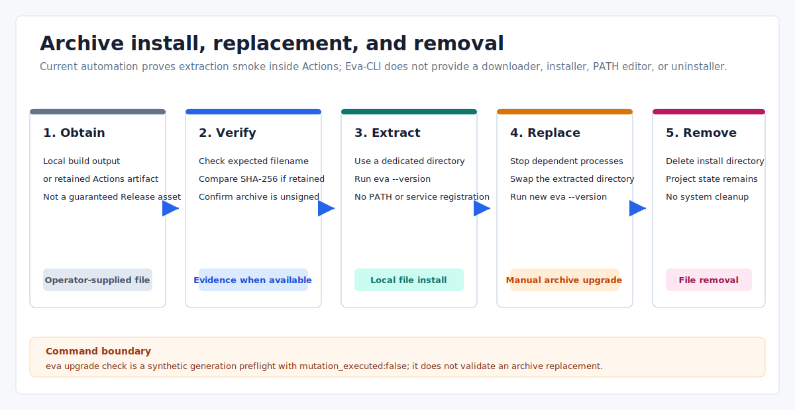

# Eva-CLI Install, Upgrade, And Uninstall

Date: 2026-07-14
Scope: native workflow archives and the boundary between archive replacement and runtime generation handoff

Eva-CLI currently has no system installer, package-manager installer, PATH manager,
automatic downloader, self-updater, or uninstaller. Native delivery is a binary and
README in a compressed GitHub Actions artifact.



## Current Delivery Boundary

The latest successful native build is from the `v1.11.4-alpha` release workflow.
It produced four archive artifacts:

| Platform | Archive target | Format | Signing state |
| --- | --- | --- | --- |
| Windows | `x86_64-pc-windows-msvc` | `.zip` | Unsigned |
| Linux | `x86_64-unknown-linux-gnu` | `.tar.gz` | Unsigned, glibc target |
| macOS Intel | `x86_64-apple-darwin` | `.tar.gz` | Unsigned and unnotarized |
| macOS Apple Silicon | `aarch64-apple-darwin` | `.tar.gz` | Unsigned and unnotarized |

These files are GitHub Actions artifacts, not assets attached to the GitHub Release.
They require access to the successful workflow run and expire under repository
artifact retention. The Release page itself currently provides GitHub-managed source
archives only.

The later `v1.11.5-alpha` tag did not produce native artifacts because its Ubuntu
verification failed before the native jobs started.

## Archive Contents And Trust

Each native archive contains only:

- `eva.exe` or `eva`;
- `README.txt` with the version smoke command and unsigned status.

The workflow extracts each archive into a temporary directory and runs `--version`.
The final evidence artifact contains per-target SHA-256 values and a generated
`SHA256SUMS`. This proves that the workflow re-read the downloaded archives; it is not
a platform signature, notarization, or long-term public download guarantee.

Windows SmartScreen or macOS Gatekeeper may reject the unsigned binary. Do not bypass
platform security controls merely to make the archive run. Use the source build or a
future signed distribution when local policy requires trusted signing.

## Obtain And Verify

1. Open the successful [GitHub Release workflow](https://github.com/Yetmos/Eva-CLI/actions/workflows/release.yml)
   run for the exact tag.
2. Download the native artifact for the required target.
3. Download `release-evidence-<tag>` from the same run and extract `SHA256SUMS`.
4. Confirm the archive name and SHA-256 match before extraction.

Windows verification example:

```powershell
$Archive = "eva-cli-1.11.4-alpha-x86_64-pc-windows-msvc.zip"
$Expected = ((Select-String -LiteralPath SHA256SUMS -Pattern ([regex]::Escape($Archive))).Line -split '\s+')[0]
$Actual = (Get-FileHash -Algorithm SHA256 -LiteralPath $Archive).Hash.ToLowerInvariant()
if ($Actual -ne $Expected) { throw "Eva-CLI archive checksum mismatch" }
```

Linux verification example:

```bash
archive=eva-cli-1.11.4-alpha-x86_64-unknown-linux-gnu.tar.gz
expected="$(grep "  ${archive}$" SHA256SUMS | awk '{print $1}')"
actual="$(sha256sum "$archive" | awk '{print $1}')"
test -n "$expected" && test "$actual" = "$expected"
```

macOS uses the same evidence with `shasum -a 256 "$archive"` for the actual digest.

## Install

Extraction is the installation. Use a versioned directory so a new archive can be
verified before the old binary is removed.

Windows:

```powershell
$Version = "1.11.4-alpha"
$InstallRoot = Join-Path $HOME "Applications\Eva-CLI\$Version"
New-Item -ItemType Directory -Force -Path $InstallRoot | Out-Null
Expand-Archive -LiteralPath "eva-cli-$Version-x86_64-pc-windows-msvc.zip" -DestinationPath $InstallRoot -Force
& (Join-Path $InstallRoot "eva.exe") --version
```

Linux:

```bash
version=1.11.4-alpha
install_root="$HOME/.local/opt/eva-cli/$version"
mkdir -p "$install_root"
tar -C "$install_root" -xzf "eva-cli-$version-x86_64-unknown-linux-gnu.tar.gz"
"$install_root/eva" --version
```

macOS:

```bash
version=1.11.4-alpha
target=aarch64-apple-darwin # or x86_64-apple-darwin
install_root="$HOME/.local/opt/eva-cli/$version"
mkdir -p "$install_root"
tar -C "$install_root" -xzf "eva-cli-$version-$target.tar.gz"
"$install_root/eva" --version
```

Adding the selected directory to `PATH`, creating a wrapper, and managing shell
profiles remain user-managed operations.

## Upgrade

Native archive upgrade is a manual binary replacement:

1. keep the current versioned directory;
2. download and checksum the new archive and evidence from the same tag workflow;
3. extract it to a different versioned directory;
4. run the new binary with `--version`;
5. update the user-managed PATH entry, symlink, or wrapper;
6. retain the old directory until normal commands have been checked, then remove it.

Do not use `eva upgrade check` as proof that the newly extracted archive is installed.
Its defaults model a synthetic `1.3.0` to `1.4.0` generation transition and its JSON
reports `mutation_executed:false`; it does not inspect the binary that was just
replaced. `eva --version` is the archive version check.

## Runtime Upgrade Commands

The `upgrade` CLI surface belongs to runtime lifecycle coordination, not package
installation.

```powershell
eva upgrade check --from-release 1.11.4-alpha --to-release <new-version> --output json
```

Even with explicit release values, `check` constructs a diagnostic migration,
drain, and rollback plan without starting a runtime process.

`eva upgrade apply` requires a plan file, matching confirmation token, filesystem
lock store, and policy approval. With a state store it can commit a generation handoff
and release-pointer state after a runtime-binary version probe and health result. It
does not download an archive, replace the installed executable, register an OS
service, or operate a platform package manager.

## Uninstall And Data

If an Eva daemon is using the binary for a project, request shutdown before removing
the selected version:

```powershell
eva daemon shutdown --project <project-path> --output json
```

Then remove the extracted version directory and any PATH entry, symlink, or wrapper
you created. There is no repository-provided uninstall command.

Removing the binary does not remove project data. `.eva/`, an explicitly selected
durable backend, daemon state/lock/pid directories, observability data, backup
artifacts, and lifecycle state may live outside the install directory. Inventory and
retain or delete those paths separately according to the project's data policy.

## Release Evidence Boundary

The release workflow generates `release-distribution.evidence` for its final gate.
It records the four archive smoke results, links this document as the install/upgrade/
uninstall reference, and includes the GHCR digest metadata inspection status.

That evidence is a release-operator artifact. Users do not need to recreate its
key/value schema for a manual install, and a passed distribution gate does not mean
that a public native installer or package repository exists.

## Related Documents

- [Project release plan](project-release-plan.md)
- [GitHub Packages publishing](github-packages-publishing.md)
- [Version management](version-management-plan.md)
- [Process-level upgrade](../operations/process-level-upgrade.md)
