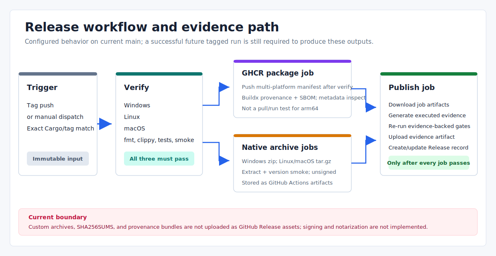

# Eva-CLI Project Release Plan

Date: 2026-07-15
Scope: CI, tag-driven release automation, evidence, GHCR, and native archive boundaries

This document describes what the repository currently executes. It does not treat a
compiled readiness declaration, an expiring Actions artifact, or a planned signing
provider as proof of a production release.



## Current Release State

| Item | Current fact |
| --- | --- |
| `main` | Cargo and CLI still identify the development line as `1.11.5-alpha`. The branch contains commits made after the tag. |
| Latest tag | `v1.11.5-alpha` points to commit `9b86adf`. Its release workflow failed in the Ubuntu workspace tests; package, native archive, and publish jobs were skipped. No GitHub Release exists for this tag. |
| Latest successful release | [`v1.11.4-alpha`](https://github.com/Yetmos/Eva-CLI/releases/tag/v1.11.4-alpha) completed the three-platform workflow and is the latest public GitHub Release. |
| Native downloads | The successful workflow produced Windows, Linux, and macOS archives as GitHub Actions artifacts. They are not GitHub Release assets and expire according to Actions retention. |
| Container | The successful workflow published `ghcr.io/yetmos/eva-cli:1.11.4-alpha`. |

The existing `v1.11.5-alpha` tag is not a movable marker for current `main`. A later
release must use a new version and tag.

## Workflow And Output Boundaries

`.github/workflows/release.yml` is triggered by a matching tag push or by manual
dispatch against an existing tag. Every job checks out that tag, not the current
branch head.

The actual job order is:

1. `verify` runs on Ubuntu, Windows, and macOS.
2. After all three verify jobs pass, `packages`, `native-windows`, `native-linux`,
   and the two-entry `native-macos` matrix run in parallel.
3. `publish` starts only after every preceding job succeeds. It builds and validates
   the docs, generates executed evidence, uploads the combined evidence artifact,
   and creates or updates the GitHub Release record.

The destinations are different:

| Destination | What the workflow writes | Durability and access |
| --- | --- | --- |
| GitHub Release | Release title/body and GitHub-managed source archives | Public release record bound to the tag |
| GitHub Actions artifacts | Native archives, per-target raw capture streams and platform subjects/envelopes, the platform bundle, `SHA256SUMS`, scan/benchmark/distribution evidence, and the provenance bundle | Workflow artifacts with repository retention; not Release assets |
| GHCR | Multi-platform OCI image and digest | Registry package; version tags can be repushed by a workflow rerun, so the digest is the content identity |

The GHCR image is pushed before the final `publish` evidence gate. A later native or
publish failure does not automatically remove that image. Operators must inspect all
three destinations rather than infer atomic publication from one green job.

## Gate Semantics

The release process has two evidence levels.

### Repository-declared readiness

The following commands return reports assembled from code-defined gates, fixtures,
and optional evidence inputs:

```powershell
cargo run -- release check --output json
cargo run -- release security --output json
cargo run -- release perf --output json
cargo run -- release migration --output json
```

A base `release check` status of `ready` means that no required compiled gate is
marked blocked. It does not execute CI, sign artifacts, contact production services,
run real hardware, or prove that a GitHub Release was published. Its closure report
may remain `ready_with_external_blockers`.

### Workflow-executed evidence

The native jobs and final publish job additionally:

- runs `cargo audit --json` and converts the result to security scan evidence;
- builds a release binary and measures `eva --version` and `eva release check` three
  times against workflow budgets;
- each native job extracts the final archive, captures structured-argv executions of
  its `eva --version` and `rustc --version`, and saves the capture JSON, raw
  stdout/stderr, and an archive copy;
- the platform producer rehashes those raw bytes and binds canonical target/archive,
  OS/arch, toolchain, tag/commit, GitHub run ID/attempt/job, runner identity, and
  completion time into a `measurement` subject and envelope;
- publish downloads the four platform evidence artifacts into isolated directories,
  obtains trusted inputs from the tag-resolved checkout HEAD and current run context,
  rereads and verifies capture streams, archives, subjects/envelopes, paths, and
  digests, then emits a target-sorted platform bundle;
- publish compares the four separately downloaded release archives with the verified
  bundle before combining them with the GHCR digest inspection as distribution evidence;
- reruns `release check` with distribution, scanner, and benchmark evidence;
- reruns `release perf` with measured benchmark evidence.

The three-platform local producer/aggregator contract and Rust verifier pass. The
updated GitHub-hosted release workflow has not yet run on a new tag. The current
bundle proves input consistency only; platform coverage, freshness, and
trusted-executor policy remain production-gate follow-up work.

The public JSON contract script exists, but neither CI nor the release workflow
currently invokes `scripts/validate-cli-json-contracts.ps1`. A compiled
`REL-JSON-CONTRACT-001` marker must not be reported as an executed workflow check.

## Platform And Artifact Matrix

| Purpose | Runner or target | Executed check or output |
| --- | --- | --- |
| Verification | `ubuntu-latest`, `windows-latest`, `macos-latest` | Format, clippy, workspace tests, version validation, and CLI smoke |
| Windows archive | `x86_64-pc-windows-msvc` on `windows-latest` | Unsigned `.zip`; captures extracted `eva.exe --version` and the toolchain, then emits platform evidence |
| Linux archive | `x86_64-unknown-linux-gnu` on `ubuntu-latest` | Unsigned glibc `.tar.gz`; captures extracted `eva --version` and the toolchain, then emits platform evidence |
| macOS Intel archive | `x86_64-apple-darwin` on `macos-26-intel` | Unsigned and unnotarized `.tar.gz`; captures smoke/toolchain and emits platform evidence |
| macOS Apple Silicon archive | `aarch64-apple-darwin` on `macos-26` | Unsigned and unnotarized `.tar.gz`; captures smoke/toolchain and emits platform evidence |
| Container | `linux/amd64`, `linux/arm64` | Buildx push with provenance/SBOM settings; local image version smoke and pushed-digest metadata inspection |

The workflow does not publish a Windows installer, macOS application bundle,
Homebrew formula, Winget package, Apt repository, or crates.io package. It also does
not run the pushed arm64 container.

## Release Procedure

1. Choose a new version that is not already tagged. Update both root Cargo versions,
   the lock file, CLI release label/status, README version labels, release notes, and
   translated documentation.
2. Run the repository checks locally:

   ```powershell
   cargo fmt --check
   cargo clippy --workspace --all-targets -- -D warnings
   cargo test --workspace
   ./scripts/validate-version-management.ps1
   ./scripts/build-site-i18n.ps1
   ./scripts/validate-i18n.ps1
   ```

3. Push the release commit and confirm the complete CI matrix is green. The current
   repository does not protect `main`, so this confirmation is an operator duty.
4. Create an annotated tag as repository policy and push it. The version validator
   checks the tag text against Cargo, but does not prove that the tag is annotated or
   descended from `main`.
5. Monitor every release job. Do not treat a successful package job as a completed
   release.
6. Confirm the final evidence-backed `release check` passed, then inspect the GitHub
   Release record, GHCR digest, and Actions artifacts separately.

## Failure And Recovery

- Before pushing a tag, repair the commit and rerun CI.
- After a tag is pushed, do not move or reuse it. Publish a new prerelease serial or
  patch version, even when the GitHub Release record was never created.
- If a failure occurs after the GHCR push, record the published digest and decide
  explicitly whether it must be removed. A failed final job does not roll it back.
- Manual dispatch reruns the code contained in the selected tag. It does not include
  fixes made only on `main` and may update an existing Release body or registry tag.
- Native archives remain unsigned. The workflow does not implement platform signing
  or notarization. `RELEASE_SIGNING_KEY` must not be supplied until real key handling
  exists; current code only records that signing is blocked.

## Completion Criteria

A release is complete only when evidence shows all of the following:

- the release commit passed the full CI matrix;
- the tag matches the Cargo version and every release job passed;
- the evidence-backed security, benchmark, and distribution checks passed, and the platform bundle matches the separately downloaded native archive digests;
- the GitHub Release record exists for the immutable tag;
- expected Actions artifacts exist and their retention limit is understood;
- the GHCR digest and tags match `package-ghcr.json` when package publication ran;
- the release notes state that native archives are unsigned and are Actions
  artifacts rather than GitHub Release assets;
- documentation and website validation passed.

## Related Documents

- [Version management](version-management-plan.md)
- [GitHub Packages publishing](github-packages-publishing.md)
- [Install, upgrade, and uninstall](install-upgrade-uninstall.md)
- [Remaining V1.x production gaps](../planning/v1.x-incomplete-feature-inventory.md)
