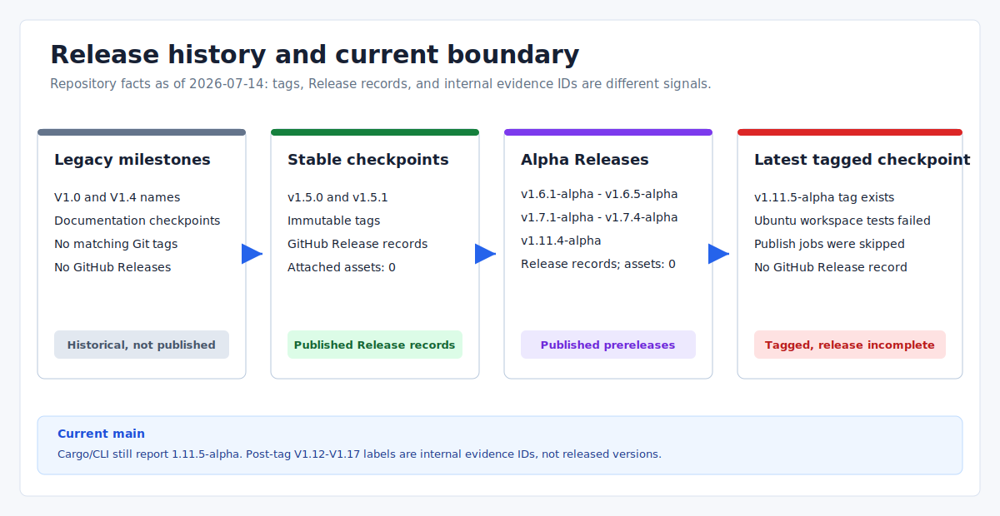

# Eva-CLI V1.5.0 Release Acceptance (Historical Decision Record)

> Language: English
>
> Published default: `docs/en/release/v1.5-release-acceptance.md`
>
> Translation: [Simplified Chinese](../../zh-CN/release/V1.5发布验收记录.md)

Updated: 2026-07-14

Acceptance date: 2026-07-06

Status: immutable evidence record for the `v1.5.0` source release; not a current release-health report.

## Decision

Eva-CLI V1.5.0 was accepted as a GitHub-managed source release. The public annotated tag `v1.5.0` resolves to commit `74d85e7da58ac40ef5d30b38e2844dee503a44c0` and must not be moved to include later documentation, workflow, packaging, or runtime changes.

Release URL: <https://github.com/Yetmos/Eva-CLI/releases/tag/v1.5.0>



## Version Context

| Signal | Meaning |
| --- | --- |
| V1.0 | Internal milestone commit `437087c`; no `v1.0` tag exists |
| V1.4 | Internal lifecycle milestone commit `909ab07`; no `v1.4` tag exists |
| V1.5.0 | Annotated tag `v1.5.0`, resolving to commit `74d85e7da58ac40ef5d30b38e2844dee503a44c0` |
| Current `main` | Cargo and CLI report `1.11.5-alpha`; later V1.12-V1.17 strings are legacy evidence IDs, not release tags |

## Captured Release Evidence

The following table records evidence observed during acceptance on 2026-07-06. External URLs and services are historical observations, not continuous availability checks.

| Evidence | Captured result |
| --- | --- |
| Root package version | `1.5.0` in the accepted source state |
| Workspace package version | `1.5.0` in the accepted source state |
| Local tag | Annotated `v1.5.0` tag present |
| Tag target | `74d85e7da58ac40ef5d30b38e2844dee503a44c0` |
| GitHub Release | Visible at the release URL above |
| Source archives | GitHub-generated source archives available from the release page |
| Documentation site | GitHub Pages observed at <https://www.eva-cli.com/> |

The acceptance pass did not recreate, force-update, or repoint the tag.

## Captured Local Gates

These commands were recorded as passing on 2026-07-06 against the then-current V1.5 source state:

```powershell
cargo fmt --check
cargo clippy --workspace --all-targets -- -D warnings
cargo test --workspace
cargo build --release
./scripts/build-site-i18n.ps1
./scripts/validate-i18n.ps1
cargo run -- release check --output json
cargo run -- release security --output json
cargo run -- release perf --output json
cargo run -- release migration --output json
```

Recorded release-command summaries:

| Command | Captured result | Interpretation |
| --- | --- | --- |
| `release check` | `ready`, 0 blocking gates | No required V1.5 gate object was blocked |
| `release security` | `reviewed`, 0 blocking findings | Compiled V1.5 findings contained no blocking item |
| `release perf` | `within_budget`, 0 over-budget checks | Fixed source-release smoke observations were inside their budgets |
| `release migration` | `compatible`, no declared breaking changes | The V1.5 compatibility declaration reported no breaking change |

These summaries do not retroactively prove present-day `main`, external services, production credentials, or platform integration. See the [release hardening evidence model](v1.5-release-hardening.md#evidence-model).

## Immutable Boundary

- Changes after `74d85e7` belong to later commits or tags and do not alter this record.
- The `v1.5.0` tag contains a source-release checkpoint, not later GHCR, native archive, evidence-bundle, restore-apply, or upgrade-apply work.
- Later controlled alpha implementations must be described from their own code and current operations documents, not projected backward into V1.5.0.
- Re-running commands on `main` produces `1.11.5-alpha` evidence and is not a re-acceptance of V1.5.0.

## Related References

- [V1.5 release hardening record](v1.5-release-hardening.md)
- [V1.5.0 release notes](release-notes-v1.5.0.md)
- [V1.5.1 release notes](release-notes-v1.5.1.md)
- [Current V1.x incomplete feature inventory](../planning/v1.x-incomplete-feature-inventory.md)
- [Current backup and restore boundary](../operations/backup-migration-release-snapshot.md)
- [Current process upgrade boundary](../operations/process-level-upgrade.md)
- [Project release plan](project-release-plan.md)
