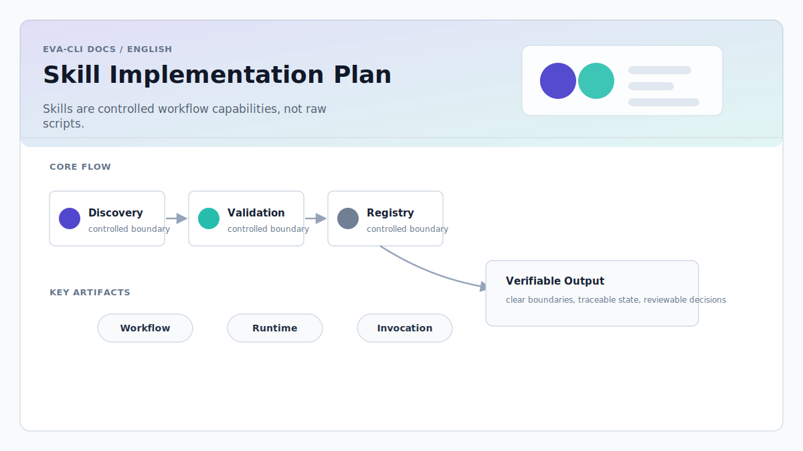
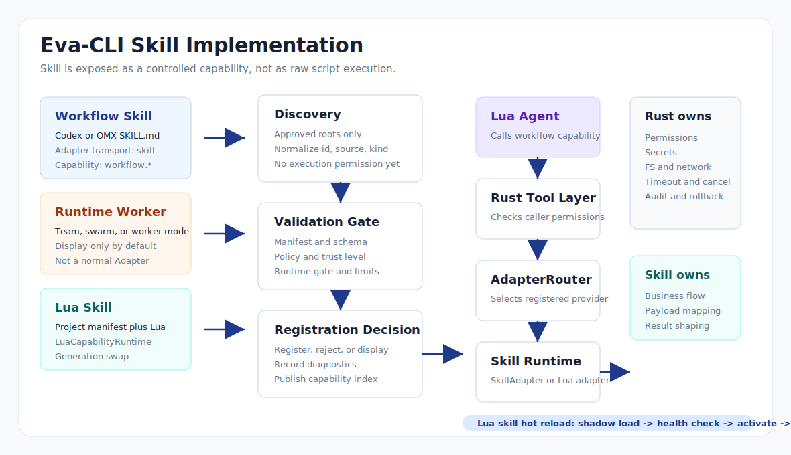

# Skill Implementation Plan

> Language: English
> Canonical: docs/en/skill-implementation.md
> Translation: [Simplified Chinese](../zh-CN/Skill实现方案.md)



Updated: 2026-06-23

## Purpose

This document turns the existing Skill-related architecture notes into one
implementation plan. It defines how Eva-CLI should discover, classify,
authorize, route, invoke, observe, and hot-reload Skills without turning them
into an unrestricted script execution surface.

The core decision is:

```text
Skill is a controlled capability surface.
It is not a raw SKILL.md interpreter and not a Lua-owned host permission path.
```



## Design Position

Eva-CLI should support three Skill classes:

| Skill class | Source | Runtime object | Default registration |
| --- | --- | --- | --- |
| `workflow_skill` | Codex or OMX `SKILL.md`, or explicit project Skill manifest | `SkillAdapter` | Registered only with manifest, schema, policy, and runtime gate approval |
| `runtime_worker` | Team, swarm, ralph, worker-only runtime surfaces | Discovery metadata only | Display-only outside the matching runtime |
| `lua_skill` | Project-local Lua workflow plus capability manifest | `LuaCapabilityAdapter` and `LuaCapabilityRuntime` | Registered as a hot-reloadable `workflow.*` capability |

The distinction matters because these objects have different authority models.
An external `SKILL.md` is a workflow instruction package. A `runtime_worker` is
bound to a special orchestration mode. A `lua_skill` is project-owned business
logic that can be safely loaded into the existing Lua capability runtime.

## Control Plane

The control plane is Rust-owned:

```text
AgentDiscoveryService
  -> DiscoveryNormalizer
  -> Schema and policy validation
  -> RegistrationDecision
  -> AdapterRegistry / CapabilityRegistry
```

Discovery may find Skills in:

- `config/adapters/*.yaml` for explicit `transport: skill` adapters.
- `config/capabilities/*.yaml` for `kind: lua_skill` capabilities.
- Approved user-local Skill directories such as `~/.codex/skills/*/SKILL.md`
  and `~/.agents/skills/*/SKILL.md`.

Discovery is not authorization. Every discovered Skill must produce a
`RegistrationDecision`:

```text
registered
rejected
display_only
disabled
shadowed
```

The decision must include reason codes such as `capability_missing_schema`,
`runtime_gate_mismatch`, `policy_denied`, `runtime_worker_display_only`, and
`trust_level_unknown`.

## Data Model

Use a normalized Skill descriptor before creating runtime objects:

```rust
pub struct SkillDescriptor {
    pub id: String,
    pub name: Option<String>,
    pub kind: SkillKind,
    pub source: SkillSource,
    pub path: Option<PathBuf>,
    pub capabilities: Vec<String>,
    pub runtime_gate: RuntimeGate,
    pub input_schema: Option<SchemaRef>,
    pub output_schema: Option<SchemaRef>,
    pub permissions: DeclaredPermissions,
    pub trust_level: TrustLevel,
    pub metadata: serde_json::Value,
}
```

```rust
pub enum SkillKind {
    WorkflowSkill,
    RuntimeWorker,
    LuaSkill,
}
```

Runtime objects must not be created directly from scan results. The descriptor
must pass schema, trust, policy, conflict, runtime gate, and capability registry
checks first.

## Manifest Contracts

### Workflow Skill Adapter

External workflow Skills are represented as Adapter manifests:

```yaml
id: code-review-skill
name: Code Review Skill Adapter
version: 1.0.0
enabled: true
transport: skill

skill:
  source: codex
  id: code-review
  path: ~/.codex/skills/code-review/SKILL.md
  kind: workflow_skill
  runtime_gate: normal
  entry:
    type: codex_skill
  input_schema:
    type: object
    required:
      - scope
    properties:
      scope:
        type: string
        enum:
          - current_diff
          - workspace
      severity:
        type: string
        enum:
          - all
          - major
          - critical
  output_schema:
    type: object
    required:
      - summary
      - findings
    properties:
      summary:
        type: string
      findings:
        type: array

capabilities:
  - workflow.code_review

permissions:
  read_workspace: true
  write_workspace: false
  network: false
  shell: false
  env: []

limits:
  timeout_ms: 120000
  max_concurrency: 1
  max_prompt_bytes: 100000
```

The runtime must reject `transport: skill` if `skill.kind`,
`skill.runtime_gate`, `skill.input_schema`, or `skill.output_schema` is missing.

### Lua Skill Capability

Project-local Lua Skills are represented as capability manifests:

```yaml
id: config-lint-skill
kind: lua_skill
version: 1.0.0

capabilities:
  - workflow.config_lint

lua:
  script: config/skills/config_lint.lua
  entry: invoke
  health_check: health_check

runtime_gate:
  allowed_modes:
    - normal
  disallow_team_worker: true

input_schema: schemas/config_lint.input.json
output_schema: schemas/config_lint.output.json

permissions:
  fs:
    read:
      - workspace
    write: []
  network: false
  shell: false
  adapters:
    capabilities:
      - config.inspect

limits:
  timeout_ms: 30000
  concurrency: 2
```

Lua Skill manifests should reuse the `LuaCapabilityRuntime` contract used by
`lua_tool` and `lua_mcp_handler`.

## Invocation Path

Lua Agents call Skills through capabilities:

```lua
local result = ctx.tools.invoke_agent({
  capability = "workflow.code_review",
  provider = "code-review-skill",
  payload = {
    scope = "current_diff",
    severity = "major"
  },
  timeout_ms = 120000
})
```

Lua cannot pass:

- Skill file paths.
- Command templates.
- Environment variable names or values.
- Shell snippets.
- Host filesystem paths outside the effective policy.
- Runtime mode overrides.

Rust resolves the call:

```text
ctx.tools.invoke_agent
  -> Rust Tool Layer
  -> caller permission check
  -> AdapterRouter
  -> SkillAdapter or LuaCapabilityAdapter
  -> input schema validation
  -> timeout and concurrency guard
  -> Skill execution
  -> output schema validation
  -> audit and metrics
  -> AgentInvokeResponse
```

## Runtime Gate

Every Skill has a runtime gate. The gate declares which execution modes may use
the Skill:

```yaml
runtime_gate:
  allowed_modes:
    - normal
  disallow_team_worker: true
  requires_interactive_user: false
```

Recommended gate decisions:

| Runtime condition | Decision |
| --- | --- |
| `workflow_skill` with `normal` gate in normal runtime | Register |
| `workflow_skill` missing schemas | Display-only or reject |
| `runtime_worker` in normal runtime | Display-only |
| `runtime_worker` in matching team runtime | Register only to the team runtime, not globally |
| `lua_skill` with permission expansion during hot reload | Require runtime generation switch |

## Security Boundary

Rust owns:

- Source path canonicalization.
- Trust level assignment.
- Manifest and schema validation.
- Effective permission computation.
- Secret access and environment injection.
- Filesystem, network, shell, and process boundaries.
- Timeout, cancellation, rate limit, and concurrency controls.
- Audit, metrics, tracing, and rollback.

Skill logic owns:

- Domain workflow steps.
- Payload mapping.
- Controlled host API orchestration.
- Result formatting.

The runtime must not allow a Skill to become a generic shell runner, generic
HTTP proxy, generic MCP proxy, or unrestricted workspace writer.

## Hot Reload

`lua_skill` supports generation swap:

```text
file change debounce
  -> parse manifest
  -> validate schema and policy
  -> load new Lua state
  -> bind restricted host API
  -> run health_check
  -> install shadow generation
  -> switch capability index
  -> drain old generation
  -> publish /capability/reloaded
```

`workflow_skill` reload is discovery-driven. Changes to its manifest, path,
schema, routing priority, enabled flag, or limits must generate a new
registration decision. Permission expansion, transport changes, or runtime gate
expansion should require a runtime generation switch rather than ordinary hot
reload.

## Observability

Each Skill invocation should record:

- `request_id`
- `trace_id`
- `agent_id`
- `skill_id`
- `provider`
- `capability`
- `skill_kind`
- `runtime_gate`
- `generation`
- `manifest_digest`
- `input_bytes`
- `output_bytes`
- `latency_ms`
- `status`
- `error_kind`

Recommended events:

```text
/skill/discovered
/skill/registration/decided
/skill/invoked
/skill/completed
/skill/failed
/skill/reloaded
/skill/reload_failed
```

Recommended CLI surfaces:

```text
eva skill list
eva skill explain <id>
eva skill doctor
eva capability inspect <id>
```

`explain` should show the registration decision first, then source, schemas,
runtime gate, effective permissions, conflicts, and diagnostics.

## Verification Matrix

| Area | Scenario | Expected result |
| --- | --- | --- |
| Discovery | Trusted workflow Skill with explicit manifest | `registered` |
| Discovery | User-local Skill without schema | `display_only` |
| Discovery | `runtime_worker` in normal mode | `display_only` |
| Schema | Missing output schema | `capability_missing_schema` |
| Policy | Skill requests workspace write but policy denies it | `policy_denied` |
| Runtime gate | Team-only Skill in normal runtime | `runtime_gate_mismatch` |
| Security | Lua passes a Skill path in payload | Request rejected |
| Security | Manifest path escapes allowed roots | `path_not_allowed` |
| Routing | `workflow.code_review` has multiple providers | Router uses deterministic priority |
| Hot reload | Lua Skill syntax error | Old generation remains active |
| Hot reload | Lua Skill health check fails | New generation rejected |
| Audit | Skill writes workspace through approved API | Touched paths recorded |

## Relationship To Existing Documents

- [Lua External Agent Adapter](lua-external-agent-adapter.md) owns the generic
  Adapter boundary and should treat `SkillAdapter` as one transport family.
- [Lua Skill, MCP, and Tool Hot Reload](lua-skill-mcp-tool-hot-reload.md) owns
  the `lua_skill` runtime and generation swap semantics.
- [Agent Discovery](agent-discovery.md) owns discovery sources, normalization,
  diagnostics, cache, and registration decisions.
- [Project Configuration](project-configuration.md) owns manifest placement,
  schema validation, policy merge order, and hot reload boundaries.

## Conclusion

The correct Skill implementation for Eva-CLI is a two-lane model:

```text
External SKILL.md
  -> Discovery
  -> SkillAdapter
  -> workflow.* capability

Project Lua Skill
  -> Capability manifest
  -> LuaCapabilityRuntime
  -> LuaCapabilityAdapter
  -> workflow.* capability
```

Both lanes keep authority in Rust and expose only stable capabilities to Lua.
This preserves hot reload, auditability, and provider replacement while
preventing Skills from bypassing the Runtime permission model.
