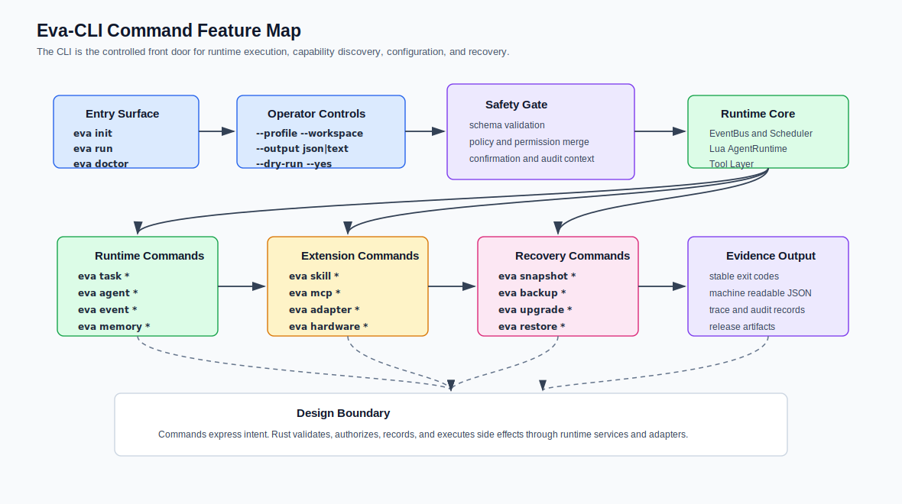

# Command-Line Tool Feature Design

> Language: English
> Translation: [简体中文](../../zh-CN/tooling/Eva-CLI命令行工具功能设计文档.md)
> Current detail authority: Simplified Chinese

Updated: 2026-07-04

## Purpose

This document defines both the target command-line feature set and the current
V1.5 source-release command surface for Eva-CLI. It describes the command
groups, operator experience, safety gates, output contracts, release priorities,
and the implemented diagnostic commands that turn the architecture documents
into a usable CLI surface.

Eva-CLI now implements the V1.5 release-hardening CLI checkpoint. Commands that
mutate external systems, start real providers, perform destructive restore, or
activate long-lived supervisor processes remain future apply paths unless they
are explicitly listed as implemented diagnostics below.

## Current V1.5 Implementation Snapshot

The current executable supports:

- `version`, `doctor`, `config validate`, and `inspect`.
- `run --example basic` plus local `.eva/tasks` diagnostics through
  `task status`, `task logs`, and `task cancel`.
- Side-effect-free `adapter list/probe`, `mcp list/probe`, `skill list/run`,
  and `discovery scan` diagnostics.
- Request-scoped `memory context` assembly for private memory, global memory,
  knowledge, and Lua context snapshots.
- Plan-first `hardware list/probe/bind` diagnostics that do not open raw I/O.
- `backup create`, `snapshot create`, `restore plan`, and `upgrade check`
  diagnostics backed by in-memory artifacts and lifecycle plans.
- `release check`, `release security`, `release perf`, and `release migration`
  gates for V1.5 release readiness, compatibility, and migration evidence.

## Product Position

Eva-CLI should be the controlled front door of the Eva runtime. Users and
automation call `eva`, but Rust keeps authority over validation, permissions,
schemas, audit records, process lifecycle, and side-effect execution.



The CLI must support two equally important modes:

- Human mode: concise text, guided prompts, tables, progress, and recovery hints.
- Automation mode: stable JSON, deterministic exit codes, no prompts unless
  explicitly enabled, and trace IDs that can be connected to logs or artifacts.

## Design Goals

| Goal | Requirement | Evidence |
| --- | --- | --- |
| Make the runtime approachable | New users can initialize a workspace, validate config, and run a first task without reading every architecture document. | `eva init`, `eva doctor`, `eva run`, clear diagnostics. |
| Keep authority in Rust | Commands express intent; Runtime services validate and execute privileged actions. | Policy gate, schema validation, audit record, adapter boundary. |
| Work well in scripts | Every command that may be used by CI or automation has JSON output and stable exit codes. | `--output json`, non-interactive defaults, documented error codes. |
| Support hot-reloadable agents safely | Agent, Skill, MCP, Adapter, and config commands can reload safe fields without silently expanding permissions. | generation IDs, reload plans, permission diff, restart-required result. |
| Make recovery inspectable | Backup, snapshot, restore, rollback, and upgrade commands produce artifacts and verifiable status. | artifact ID, manifest digest, trace ID, audit event. |

## Command Model

The top-level shape is:

```text
eva <command> [subcommand] [flags]
```

Global flags should be available across all command groups unless a command
explicitly rejects them:

| Flag | Purpose | Notes |
| --- | --- | --- |
| `--workspace <path>` | Select the workspace root. | Defaults to the nearest configured Eva workspace. |
| `--profile <name>` | Select config and policy profile. | Typical values: `dev`, `test`, `prod`. |
| `--output text|json` | Choose human or machine output. | `text` is default for TTY; `json` is recommended for CI. |
| `--locale <code>` | Select message locale. | Does not translate machine-readable codes or keys. |
| `--dry-run` | Build and validate the execution plan without mutation. | Required for high-risk commands in CI. |
| `--yes` | Accept prompts in non-interactive mode. | Ignored when policy requires explicit confirmation. |
| `--trace <id>` | Attach or continue a trace. | Useful for replay and support diagnostics. |
| `--verbose` | Include expanded diagnostics. | Must not reveal secrets. |

## Command Groups

| Group | Commands | V1.5 Status | Responsibility |
| --- | --- | --- | --- |
| Workspace | `version`, `doctor`, `config validate`, `inspect`; target `init`, `config explain` | Implemented diagnostics; `init` and `config explain` remain target commands | Create and validate the minimum project shape. |
| Task execution | `run --example basic`, `task status`, `task cancel`, `task logs` | Implemented for the in-memory V1.0 basic loop | Submit work and inspect runtime progress. |
| Agent runtime | Target `agent list`, `agent inspect`, `agent run`, `agent reload` | Later apply/control surface; V1.5 exposes Agent data through config and inspect diagnostics | Manage internal Lua Agents through Scheduler and Runtime gates. |
| Extensions | `skill list/run`, `mcp list/probe`, `adapter list/probe`, `discovery scan` | Implemented as controlled diagnostics and envelopes | Inspect and invoke controlled external capability surfaces. |
| Memory and events | `memory context`; target `memory query/export`, `event tail/replay` | Context assembly implemented; general event/memory browsing remains later scope | Inspect controlled context and event evidence. |
| Operations | `backup create`, `snapshot create`, `restore plan`, `upgrade check`, `release check/security/perf/migration` | Implemented as plan-first and non-destructive release diagnostics | Provide auditable recovery and release evidence. |
| Hardware | `hardware list/probe/bind` | Implemented as plan-first diagnostics without raw I/O | Manage devices only through HardwareAdapter policy. |
| Development | Target `dev harness`, `dev fixture`, `schema export` | Later contributor tooling | Help contributors test contracts and runtime flows. |

## P0 Command Details

### `eva init`

Creates a workspace skeleton:

- `config/eva.yaml`
- `config/agents/`
- `config/adapters/`
- `.eva/` runtime metadata directory
- sample policy and manifest files when requested

The command must not overwrite existing files without a displayed plan and an
explicit confirmation or `--yes`.

### `eva doctor`

Checks local readiness:

- workspace layout and config readability
- manifest schema validity
- Lua runtime availability
- configured external commands and MCP servers
- filesystem permissions for `.eva/`
- optional website or documentation links for next steps

### `eva config validate`

Validates config, manifests, and policy merge results without starting the
runtime. It should report:

- error code
- file path
- JSON pointer or config path
- human explanation
- recommended fix

### `eva run`

Submits a user intent to the Runtime as a typed event. The command should accept
plain text input and structured JSON input:

```text
eva run "summarize the current repository"
eva run --input task.json --output json
```

The CLI should return a task ID immediately for long-running work and keep
streaming optional with `--follow`.

### `eva agent`

Provides the first user-facing control surface for internal Agents:

| Subcommand | Behavior |
| --- | --- |
| `agent list` | Show discovered Agents, enabled state, generation, Topics, and health. |
| `agent inspect <id>` | Show manifest, permissions, routes, Lua entrypoint, and last validation result. |
| `agent run <id>` | Send a test event to one Agent through Scheduler. |
| `agent reload <id|--all>` | Build a reload plan and swap safe generations after validation. |

## Safety and Mutation Rules

High-risk commands must be plan-first:

1. Resolve workspace, profile, and runtime generation.
2. Load config, manifests, schemas, and policy.
3. Build an execution plan.
4. Show mutation scope in text mode or return it in JSON mode.
5. Require confirmation unless `--dry-run` or a trusted automation policy allows
   the operation.
6. Execute through Runtime services.
7. Write an audit record with trace ID, actor, command, inputs, plan digest, and
   result.

Examples of high-risk commands include `restore apply`, `upgrade apply`,
`snapshot promote`, Adapter invocation with write permissions, hardware binding,
and any permission expansion.

## Output Contract

Every command should return one of the following result classes:

| Class | Meaning | Text Output | JSON Output |
| --- | --- | --- | --- |
| `ok` | Completed successfully. | Summary table and next action. | `status`, `data`, `trace_id`. |
| `planned` | No mutation occurred; plan is ready. | Plan summary and confirmation hint. | `status`, `plan`, `requires_confirmation`. |
| `accepted` | Long-running work was accepted. | Task ID and follow command. | `status`, `task_id`, `trace_id`. |
| `blocked` | Policy or missing prerequisite blocked execution. | Reason and remediation. | `status`, `error`, `missing`, `trace_id`. |
| `failed` | Execution failed after starting. | Error, retry hint, log reference. | `status`, `error`, `retryable`, `trace_id`. |

Recommended exit codes:

| Code | Meaning |
| --- | --- |
| `0` | Success. |
| `1` | General execution failure. |
| `2` | Usage or argument error. |
| `3` | Config or schema validation error. |
| `4` | Policy denied the request. |
| `5` | Runtime unavailable. |
| `6` | External capability unavailable. |
| `7` | Operation requires confirmation. |
| `8` | Partial success with warnings. |

## Localization

The CLI should localize human-facing text through the same locale policy as the
website and documentation:

- `en` is the default public language.
- `zh-CN` is supported for detailed product and architecture content.
- Machine-readable keys, error codes, command names, JSON fields, Topic names,
  and file paths are never translated.

## Implementation Sequence

| Phase | Scope | Completion Evidence |
| --- | --- | --- |
| Phase 1 | `init`, `doctor`, `config validate`, static schemas. | Workspace can be created and validated in CI. |
| Phase 2 | `run`, `task status`, minimum EventBus and Scheduler loop. | A task can enter Runtime and produce traceable output. |
| Phase 3 | `agent list/inspect/run/reload`. | Lua Agent generation can be validated and swapped safely. |
| Phase 4 | `skill`, `mcp`, `adapter` inspection and probe commands. | External capability discovery is visible but policy-gated. |
| Phase 5 | `snapshot`, `backup`, `restore plan`, `event replay`. | Recovery operations produce verifiable artifacts. |

The V1.5 source release extends these phases with controlled external capability
diagnostics, memory context assembly, hardware binding plans, lifecycle checks,
and release-hardening gates. Real provider process execution, destructive
restore apply, durable runtime supervision, signed artifacts, and installers are
intentionally outside the V1.5 CLI scope.

## Open Questions

- Which CLI parser crate should become the standard once the Rust workspace is
  created?
- Should long-running task streaming use Server-Sent Events, a local socket, or
  repeated polling for the first implementation?
- Which audit fields are mandatory for local-only development mode?
- Should `eva run` default to synchronous completion for short tasks, or always
  return a task ID?
