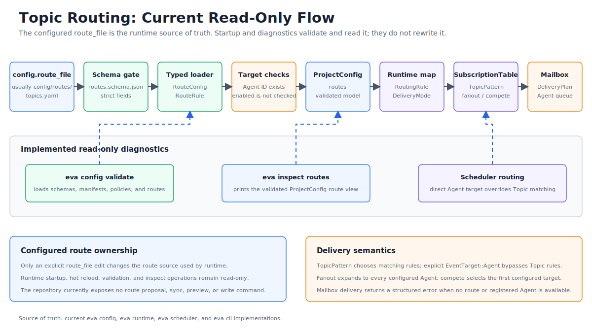

# Topic Routing Hybrid Sync

> Language: English
> Published default: docs/en/topic-routing-hybrid-sync.md
> Translation: [Simplified Chinese](../zh-CN/Topic路由混合同步方案.md)

Updated: 2026-07-01

## Purpose

This document defines the hybrid maintenance model between `config/routes/topics.yaml` and `config/agents/**/agent.yaml`. The decision is: **production runtime uses `config/routes/topics.yaml` as the source of truth for Topic routing; runtime must not implicitly rewrite it from `agent.yaml`; tools may generate route proposals, validate consistency, and write updates only through explicit commands.**

The goal is to balance two constraints:

- Routing must remain explicit, auditable, and reversible. A malformed Agent manifest must not automatically expand the event delivery surface.
- Agent creation, renaming, and subscription changes should not depend entirely on manual synchronization, because that makes `topics.yaml` easy to forget.

## File Responsibilities

| File | Responsibility | Production source of truth | Tool-generated |
| --- | --- | --- | --- |
| `config/agents/**/agent.yaml` | Agent identity, parent-child intent, subscriptions, emitted Topic permissions, local route hints, and permissions | Yes, for Agent-local configuration | Initial drafts may be generated by Agent tooling |
| `config/routes/topics.yaml` | Global Scheduler Topic delivery rules, target Agents, delivery mode, and match order | Yes, for production Topic routing | Only explicit CLI/IDE actions may write it |
| `.eva/generated/routes/topics.generated.yaml` | Route proposals or test routes inferred from Agent manifests | No | Yes |
| `.eva/reports/config/routes-diff.json` | Validation differences, conflicts, and suggested fixes | No | Yes |

`agent.yaml` may contain `subscriptions`, `children`, and `routes` hints, but those fields are not the final delivery table. Scheduler delivery is still decided from `config/routes/topics.yaml`.

## Architecture



## Recommended Flow

```text
config/agents/**/agent.yaml
  -> AgentManifestScanner
  -> RouteProposalBuilder
  -> ConsistencyValidator
  -> routes-diff.json
  -> eva config routes sync --write
  -> config/routes/topics.yaml
  -> Scheduler RouteTable
```

The runtime startup path stays simple:

```text
config/routes/topics.yaml
  -> schema validate
  -> policy validate
  -> Scheduler RouteTable
```

Startup may read Agent manifests for cross-validation, but it must not modify `config/routes/topics.yaml`.

## CLI Behavior

| Command | Behavior | Writes files | Use case |
| --- | --- | --- | --- |
| `eva config validate` | Validate all config, Agent references, Topic patterns, permissions, and route consistency | No | Local development, CI, pre-start checks |
| `eva config routes sync --check` | Build route proposals from `agent.yaml` and compare them with `topics.yaml` | No | PR checks and IDE diagnostics |
| `eva config routes sync --write` | Write safe, explainable proposals back to `config/routes/topics.yaml` | Yes | Explicit sync after adding Agents |
| `eva config routes preview` | Print the merged route table and conflicts | No | Human review before writing |
| `eva config routes dump-effective` | Print the RouteTable actually used by Scheduler | No | Runtime diagnostics |

`--write` must be explicit. Hot reload, startup, and Agent code must not trigger it implicitly.

## Consistency Rules

| Check | Rule | Failure level |
| --- | --- | --- |
| Target Agent existence | Every `agents[]` entry in `topics.yaml` must reference an existing `enabled: true` Agent | error |
| Subscription coverage | Route pattern should be covered by each target Agent's `subscriptions`, unless explicitly exempted | warning/error |
| Permission boundary | Agents may emit only Topic patterns allowed by `permissions.emit` | error |
| Route hint consistency | `agent.yaml.routes.*.topic/targets` should be compatible with the global route table | warning |
| Delivery conflict | The same pattern must not have incompatible `fanout`, `compete`, or priority declarations | error |
| Order-sensitive rules | Wildcard routes must not unintentionally shadow more specific routes | warning/error |
| Unrouted subscription | An Agent declares a subscription, but no global route can deliver matching events | warning |
| Orphan route | A global route targets an Agent that does not subscribe to that Topic | warning/error |

Subscription coverage should default to warning because some management Agents intentionally consume wider or narrower Topic ranges. Production policy may promote it to error.

## Route Proposal Rules

`RouteProposalBuilder` produces proposals only; it must not bypass review.

1. Read `subscriptions` from every enabled Agent.
2. If a subscription is missing from `topics.yaml`, generate a candidate:

```yaml
- pattern: /sys/route-a
  delivery: fanout
  agents:
    - agent-a
```

3. If multiple Agents subscribe to the same Topic, default the proposal to `delivery: fanout` and mark it for human confirmation.
4. If `agent.yaml.routes` declares `targets`, generate candidate child routes only after validating that each target Agent exists, is enabled, and has subscription coverage.
5. Do not infer `compete`, priority, load balancing, or fallback behavior automatically; those must remain handwritten in `topics.yaml`.
6. Do not infer Topics or parent-child relationships from directory nesting.

## Hot Reload Boundary

| Change | Hot reloadable | Rebuild/restart needed | Notes |
| --- | --- | --- | --- |
| Change target Agents for an existing pattern in `topics.yaml` | Yes | No | Atomically swap to a new RouteTable generation |
| Add a simple fanout route | Yes | No | Must pass schema and policy validation first |
| Change Agent `subscriptions` | Yes | No | Affects consistency validation and mailbox registration |
| Expand `permissions.emit` | No | Yes | Permission expansion |
| Change delivery to `compete` or change priority policy | Depends | Maybe | Queue semantics may require a generation switch |
| Runtime auto-write to `topics.yaml` | No | Not allowed | Prevent hidden config drift |

## Tradeoffs

| Approach | Pros | Cons |
| --- | --- | --- |
| Fully handwritten `topics.yaml` | Explicit routing, review-friendly diffs, clear security boundary, supports complex rules | Easy to forget synchronization when adding Agents, repeated information |
| Fully dynamic generation from `agent.yaml` | Better Agent creation workflow, simple subscriptions are less likely to be missed, useful for tests | Ambiguous source of truth, harder security audit, complex delivery and priority cannot be inferred reliably |
| Hybrid model | Keeps production routing explicit while tools reduce missed updates; works well for CI, IDEs, and scaffolding | Requires validation, diff, and sync commands; proposal rules must avoid unsafe writes |

## Rollout Steps

1. Keep `config/routes/topics.yaml` as the production route source of truth.
2. Add Agent and Topic route cross-validation to `eva config validate`.
3. Add `eva config routes sync --check` to produce diffs without writing files.
4. Add `eva config routes sync --write` for conflict-free and explainable suggestions only.
5. Treat `.eva/generated/routes/topics.generated.yaml` and `.eva/reports/config/routes-diff.json` as diagnostics, not committed production config.
6. Run `eva config validate` and `eva config routes sync --check` in CI.
7. IDE plugins may show suggestions and quick fixes, but must not silently rewrite production route files in the background.

## Decision Record

| Decision | Result |
| --- | --- |
| Production route source of truth | `config/routes/topics.yaml` |
| Role of Agent manifests | Agent-local declarations and route proposal input |
| Auto-update policy | Runtime never writes back; only explicit CLI/IDE actions may write |
| Generated artifact location | `.eva/generated/` and `.eva/reports/` |
| CI default | Validation failures block; proposal diffs may be warning or error by policy |

## Summary

The core boundary is: **machines may find inconsistency, but humans or explicit commands decide the production route table.**

This preserves the auditability, readability, and security boundary of `topics.yaml`, while reducing missed synchronization after Agent changes. For Eva-CLI's current architecture stage, this is more stable than runtime config mutation and more maintainable than handwritten routing without validation.
