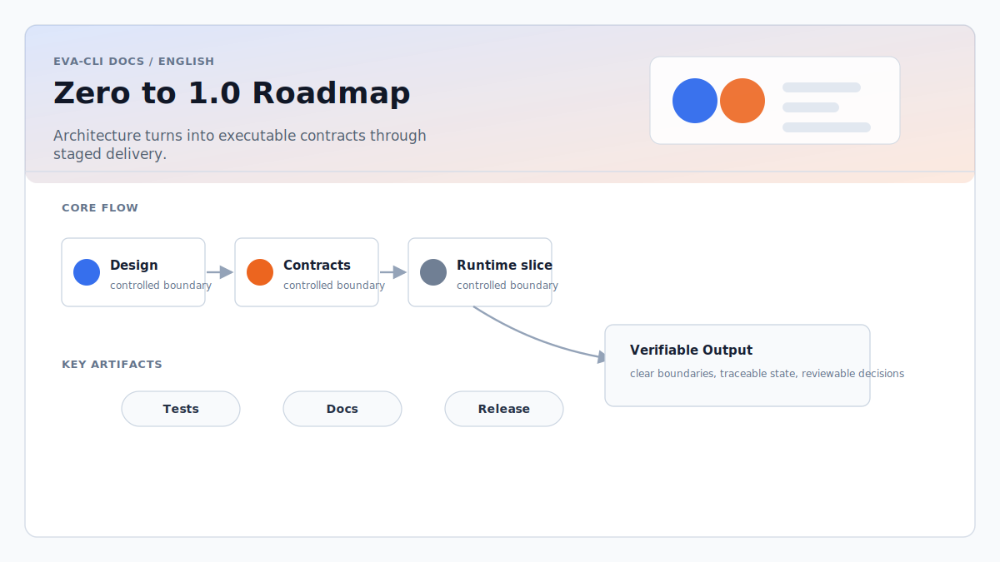

# Zero to 1.0 Roadmap

Eva-CLI should move from architecture design to a 1.0 release through a staged
implementation path. The project should not jump directly from documents to a
large runtime implementation. Each stage must leave behind reviewable artifacts
that can be tested, versioned, and used by the next stage.

The current repository is mostly at stage 1: the architecture and design
documents are in place, and the website and documentation structure are already
publishable. The next work should move into module layout and executable
contracts.

## Progress Stages

### 1. Architecture and Design Documents

Purpose:

- Define the product goal, non-goals, system boundaries, and core assumptions.
- Describe the runtime model, extension model, memory model, discovery model,
  hardware integration, configuration system, and recovery strategy.
- Record design risks before implementation begins.

Expected artifacts:

- Architecture overview.
- Runtime, EventBus, Scheduler, Agent, Adapter, Memory, Discovery, Config,
  Hardware, hot reload, backup, and upgrade design documents.
- Risk review and open issues.
- Documentation and website publishing structure.

Current status:

- Mostly complete for the first implementation cycle.
- Still needs executable contracts before broad implementation starts.

### 2. Module Layout

Purpose:

- Convert the architecture into a concrete source tree.
- Make ownership boundaries visible in directories, crates, and module names.
- Avoid premature implementation while still making the system shape concrete.

Expected artifacts:

- Root `Cargo.toml`.
- Initial Rust workspace or single-crate layout.
- Module directories for the first implementation surface, such as:
  - `cli`
  - `runtime`
  - `ingress`
  - `eventbus`
  - `scheduler`
  - `agent`
  - `lua`
  - `tool`
  - `adapter`
  - `memory`
  - `knowledge`
  - `discovery`
  - `config`
  - `policy`
  - `trace`
  - `audit`
  - `error`
- `examples/basic/` for the first runnable scenario.

Guidance:

- Start with a single crate if that keeps iteration simpler.
- Split into workspace crates only when module boundaries become stable enough
  to justify the extra package surface.
- Do not create directories that have no expected role in the minimum runtime
  loop.

### 3. Contract Definitions

Purpose:

- Define the interfaces and data contracts before filling in business logic.
- Make module boundaries testable and reviewable.
- Prevent runtime code from hard-coding unstable document-only assumptions.

Expected artifacts:

- Rust `trait`, `struct`, `enum`, and error types.
- Topic and event types.
- Scheduler input and output types.
- Agent lifecycle contracts.
- Adapter and tool call contracts.
- Memory and knowledge access contracts.
- Trace and audit data contracts.
- `AgentManifest`, `AdapterManifest`, and `CapabilityManifest` schemas.
- MCP, hardware, sandbox, adapter, and workspace policy schemas.
- Lua host API contracts for:
  - `ctx.tools`
  - `ctx.host`
  - `ctx.memory`
  - `ctx.global_memory`
  - `ctx.knowledge`
- Capability naming and conflict rules.

Guidance:

- This stage should define types and boundaries, not full behavior.
- Avoid "variable definition" as the milestone name. Use contract, type, API,
  schema, and boundary definitions instead.
- Add compile-time tests or schema validation tests as soon as contracts exist.

### 4. Minimum Runnable Skeleton

Purpose:

- Prove the repository can build and start.
- Establish the development loop before implementing the runtime in depth.

Expected artifacts:

- `eva` CLI entry point.
- Basic commands such as:
  - `eva run`
  - `eva validate`
  - `eva doctor`
- Config file loading.
- Runtime initialization.
- Structured logging.
- No-op or mock implementations behind the main interfaces.
- Unit tests and CI build steps.

Definition of done:

- The CLI can be built from a clean checkout.
- `eva doctor` can report the local environment and configuration status.
- `eva validate` can validate the minimum project config and manifests.
- Tests run in CI.

### 5. Minimum End-to-End Runtime Loop

Purpose:

- Turn the skeleton into the smallest real Eva-CLI behavior.
- Validate the core architecture with one narrow working path before expanding
  the platform surface.

Target loop:

1. User input enters Ingress.
2. Ingress publishes a typed Topic event.
3. Scheduler routes the event to one Agent queue.
4. Lua Agent handles the event in isolated state.
5. Lua Agent calls one controlled Rust tool.
6. Rust validates schema and policy before execution.
7. Tool result returns to Lua as a structured value.
8. Runtime emits trace and audit data.
9. Failure returns a structured, retry-aware error.

Definition of done:

- A basic example can run from `examples/basic/`.
- One Lua Agent can process one event.
- One controlled tool call works through Rust validation.
- Trace, audit, and structured errors are observable.
- Regression tests cover the full loop.

### 6. Module Implementation

Purpose:

- Fill in real behavior module by module after the minimum loop proves the
  architecture.
- Keep each module implementation grounded in contracts and tests.

Recommended order:

1. Config and schema validation.
2. EventBus.
3. Scheduler.
4. Lua runtime and Agent lifecycle.
5. Tool layer and AdapterRegistry.
6. Error model, trace, and audit.
7. Memory and ContextBuilder.
8. Knowledge access.
9. Discovery.
10. Hot reload and generation switching.
11. MCP and Skill adapters.
12. HardwareAdapter.
13. Backup, restore, migration package, and ReleaseSnapshot support.

Guidance:

- Implement one module slice at a time.
- Prefer deletion and contract simplification over adding new layers.
- Every module should have focused tests before being considered complete.
- Cross-module behavior should be verified through examples and integration
  tests, not only unit tests.

### 7. Integration, Hardening, and Release Preparation

Purpose:

- Move from working internals to a release-quality CLI.

Expected artifacts:

- Runnable examples for the supported scenarios.
- User-facing quickstart.
- Installation instructions.
- CI for formatting, linting, unit tests, integration tests, schema validation,
  and website build.
- Cross-platform checks for macOS, Linux, and Windows.
- Security review of sandbox, policy, secrets, file writes, MCP, and hardware
  access.
- Versioned release notes.
- Migration guidance for breaking changes.

Definition of done:

- A new user can install Eva-CLI, run the quickstart, and diagnose common
  environment problems.
- Documented examples match actual behavior.
- Known limitations are explicit.

## 1.0 Release Bar

Eva-CLI 1.0 should mean the core promises are stable, not that every planned
capability is complete.

Required 1.0 properties:

- CLI installation and startup are reliable.
- The minimum Agent runtime loop is stable.
- Manifest, policy, and Lua host API contracts are versioned.
- Lua Agents can call controlled tools through Rust validation.
- Structured errors, trace, and audit are available.
- Config validation catches unsupported or unsafe setups early.
- Documentation, examples, and release artifacts match the implementation.
- Breaking changes have migration notes.
- Unsupported advanced capabilities are clearly marked.

## Current Position

The project has completed most of the architecture and design-document stage.
The next practical milestone is:

1. create the Rust project and module layout;
2. define the first contract set for manifests, events, policies, errors, and
   Lua host APIs;
3. build a minimum runnable skeleton;
4. implement the minimum end-to-end runtime loop;
5. expand one module at a time with tests.

This keeps the project moving toward a real implementation without turning the
architecture into a large untested framework.
