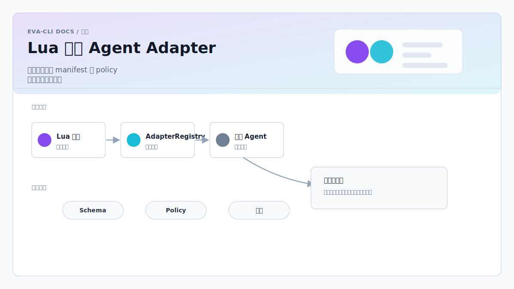

> Language: 简体中文
> Canonical source: ../en/lua-external-agent-adapter.md
> Translation status: current

# Lua 调用外部 Agent 动态 Adapter 架构方案



更新日期：2026-06-12

文档关系：

- 总体入口：`总体架构方案.md`
- Topic EventBus 与 Lua Agent 调度核心：`Rust与Lua事件总线智能体调度架构方案.md`
- Lua 承载 Tool / Skill / MCP handler 热更新：`Lua承载Skill-MCP-Tool热更新架构方案.md`
- Skill 独立实现方案：`Skill实现方案.md`

## 1. 方案定位

本文是 `Rust与Lua事件总线智能体调度架构方案.md` 的外部 Agent 扩展子方案，解决 Lua Agent 如何调用 Claude、Codex、Gemini、本地模型、内部 Agent 等外部能力，并支持 Adapter 动态扩展。

核心结论：

- Lua 不直接调用 Claude、Codex 或任意 shell 命令。
- Lua 只通过统一工具函数或 Topic 事件表达调用意图。
- Rust 负责 Adapter 注册、路由、权限、鉴权、超时、取消、日志、审计和错误归一。
- 外部 Agent 通过 Adapter 接入系统，Adapter 可以是内置 Rust 实现、外部 stdio 进程、HTTP 服务、EventBus 内部 Agent、MCP server、受控 workflow skill 或 Rust 托管的外接硬件。
- MCP 同时支持两种方向：内部 Agent 调用外部 MCP 工具；外部 MCP client 调用本系统内部 Agent。

该设计的目标不是做一个无限制插件系统，而是做一套可控、可观测、可热加载的外部 Agent 能力层。

## 2. 总体架构

```text
Lua Agent
  |
  | ctx.tools.invoke_agent(request)
  | ctx.emit("/adapter/invoke", payload)
  v
Rust Tool Layer
  |
  v
AdapterRegistry
  |
  v
AdapterRouter
  |
  +------------------+----------------+---------------+----------------+--------------+--------------+-----------------+
  |                  |                |               |                |              |              |                 |
  v                  v                v               v                v              v              v
BuiltinAdapter    StdioAdapter     HttpAdapter    EventBusAdapter   McpAdapter    SkillAdapter   HardwareAdapter
  |                  |                |               |                |              |              |
  v                  v                v               v                v              v              v
Rust 内置能力       Codex CLI        Claude API      系统内 Agent       MCP Server     Workflow Skill  外接硬件
                    Claude CLI       Gemini API      本地模型 Agent     tools/resources/prompts       USB/串口/BLE
```

调用链分为两种：

1. 同步工具调用：Lua 调用 `ctx.tools.invoke_agent`，等待 Rust 返回结构化结果。
2. 异步 Topic 调用：Lua 发布 `/adapter/invoke`，Adapter 完成后发布 `/adapter/completed`、`/adapter/failed` 或 `/adapter/stream`。
3. MCP 双向调用：Rust 通过 `McpAdapter` 调用外部 MCP server；也可以把系统自身暴露为 MCP server，供外部 MCP client 调用内部 Agent。
4. Workflow Skill 调用：Rust 通过 `SkillAdapter` 把受信任 skill 封装为 capability，Lua 只调用 capability，不直接读取或解释 `SKILL.md`。
5. Hardware 调用：Rust 通过 `HardwareAdapter` 把外接硬件封装为 capability，Lua 只调用业务能力或订阅硬件 Topic，不直接访问设备句柄。
6. Lua Capability 调用：项目内 `lua_tool`、`lua_skill` 和 `lua_mcp_handler` 可通过 `LuaCapabilityAdapter` 或 Rust MCP Server 接入，业务 handler 可热更新，权限边界仍由 Rust 托管。

短请求可以使用同步工具调用。长任务、流式输出、代码执行、仓库分析和多轮工作建议使用异步 Topic 调用。

## 3. 设计原则

### 3.1 Lua 只表达意图

Lua 侧只描述要做什么：

```lua
ctx.tools.invoke_agent({
  capability = "repo.analyze",
  provider = "codex-cli",
  prompt = "分析当前仓库架构风险",
  timeout_ms = 120000
})
```

Lua 不负责：

- 拼接命令行。
- 读取 API key。
- 选择工作目录之外的路径。
- 处理外部进程生命周期。
- 解析 provider 私有协议。
- 直接访问网络或环境变量。
- 传入 skill 文件路径或覆盖 skill 运行入口。

能力命名建议使用稳定的领域语义，而不是 provider 私有名称：

```text
chat.reply
task.plan
repo.analyze
code.review
workflow.code_review
mcp.tool.call
mcp.resource.read
mcp.prompt.render
github.issue.create
```

其中 `mcp.*` 是通用 MCP 能力，`workflow.*` 是受控 skill 能力，业务别名例如 `github.issue.create` 应由 manifest 映射到具体 provider/tool。Lua 业务脚本优先调用业务别名，只有通用编排层才直接调用 `mcp.tool.call`。

### 3.2 Rust 托管外部能力

Rust 侧负责：

- Adapter 注册和卸载。
- capability 路由。
- provider 选择。
- 权限校验。
- 超时和取消。
- 并发限制。
- 协议转换。
- 结果 schema 校验。
- Topic 事件发布。
- tracing、metrics、审计日志。
- 失败事件和死信队列。

### 3.3 Adapter 是受控能力单元

Adapter 的完整定义是：

```text
Adapter = manifest + capability + policy + transport + protocol + runtime state
```

不要把 Adapter 设计成 Lua 可以任意执行的命令。命令、参数、环境变量、网络权限和 workspace 权限都必须由 Rust 读取 manifest 后按 policy 执行。

## 4. 核心数据模型

### 4.1 AgentInvokeRequest

```rust
pub struct AgentInvokeRequest {
    pub request_id: String,
    pub capability: String,
    pub provider: Option<String>,
    pub prompt: Option<String>,
    pub payload: serde_json::Value,
    pub context: InvokeContext,
    pub timeout_ms: Option<u64>,
    pub stream: bool,
    pub reply_topic: Option<String>,
    pub stream_topic: Option<String>,
    pub correlation_id: Option<String>,
    pub causation_id: Option<String>,
}
```

字段说明：

- `request_id`：调用唯一 ID，用于取消、追踪和去重。
- `capability`：能力名，例如 `chat.reply`、`repo.analyze`、`code.review`。
- `provider`：可选 Adapter ID，例如 `codex-cli`、`claude-api`。
- `prompt`：自然语言指令。
- `payload`：结构化参数，适合工具调用、补充上下文和 provider 私有参数。
- `context`：受控上下文，例如 workspace、session、用户 ID。
- `timeout_ms`：单次调用超时，不能超过 Adapter policy。
- `stream`：是否请求流式输出。
- `reply_topic`：异步完成事件发往的 Topic。
- `stream_topic`：流式片段发往的 Topic。
- `correlation_id`：业务链路 ID。
- `causation_id`：触发本次调用的上游事件 ID。

### 4.2 InvokeContext

```rust
pub struct InvokeContext {
    pub workspace: Option<String>,
    pub session_id: Option<String>,
    pub user_id: Option<String>,
    pub agent_id: Option<String>,
    pub allowed_paths: Vec<String>,
    pub metadata: serde_json::Value,
}
```

`workspace` 和 `allowed_paths` 只能由 Rust 根据系统策略注入，Lua 不能随意扩大路径权限。

### 4.3 AgentInvokeResponse

```rust
pub struct AgentInvokeResponse {
    pub request_id: String,
    pub provider: String,
    pub capability: String,
    pub status: InvokeStatus,
    pub output: serde_json::Value,
    pub usage: Option<Usage>,
    pub error: Option<AdapterError>,
}
```

```rust
pub enum InvokeStatus {
    Completed,
    Failed,
    Cancelled,
    Timeout,
}
```

JSON/EventBus/Lua 可见的 `status` 必须统一序列化为小写 snake case：

```text
completed
failed
cancelled
timeout
```

Rust enum 名称只用于内部类型。Lua 脚本不得依赖 `Completed` 这类大小写形式。

### 4.4 AdapterError

```rust
pub struct AdapterError {
    pub kind: AdapterErrorKind,
    pub message: String,
    pub provider_code: Option<String>,
    pub retryable: bool,
}

pub enum AdapterErrorKind {
    NotFound,
    Unhealthy,
    PermissionDenied,
    Timeout,
    Cancelled,
    ProtocolError,
    ProviderError,
    OutputSchemaInvalid,
    RateLimited,
    ConcurrencyLimited,
}
```

错误必须结构化，不能只返回字符串。Lua 可以基于 `kind` 判断是否重试、降级或转人工。

## 5. Adapter 接口

Rust 内部统一抽象：

```rust
#[async_trait::async_trait]
pub trait AgentAdapter: Send + Sync {
    fn id(&self) -> &str;

    async fn capabilities(&self) -> anyhow::Result<AdapterCapabilities>;

    async fn invoke(
        &self,
        req: AgentInvokeRequest,
    ) -> anyhow::Result<AgentInvokeResponse>;

    async fn cancel(
        &self,
        request_id: &str,
    ) -> anyhow::Result<()>;

    async fn health(&self) -> anyhow::Result<AdapterHealth>;
}
```

辅助结构：

```rust
pub struct AdapterCapabilities {
    pub capabilities: Vec<String>,
    pub supports_stream: bool,
    pub supports_cancel: bool,
    pub max_prompt_bytes: usize,
}

pub struct AdapterHealth {
    pub status: AdapterHealthStatus,
    pub inflight: usize,
    pub recent_error_rate: f64,
    pub last_error: Option<String>,
}

pub enum AdapterHealthStatus {
    Healthy,
    Degraded,
    Unhealthy,
}
```

## 6. Adapter Manifest

每个动态 Adapter 由 Adapter manifest 描述。人工维护配置默认使用 `adapters/*.yaml`，JSON 结构示例用于表达字段契约，也可作为机器生成配置格式。

```json
{
  "id": "codex-cli",
  "name": "Codex CLI Adapter",
  "version": "1.0.0",
  "transport": "stdio",
  "command": "codex",
  "args": ["exec", "--json"],
  "capabilities": [
    "repo.analyze",
    "code.review",
    "code.generate"
  ],
  "permissions": {
    "read_workspace": true,
    "write_workspace": true,
    "network": false,
    "shell": false,
    "env": []
  },
  "limits": {
    "timeout_ms": 120000,
    "max_concurrency": 2,
    "max_prompt_bytes": 200000
  },
  "routing": {
    "priority": 100,
    "default_for": ["repo.analyze", "code.review"]
  }
}
```

字段说明：

- `id`：全局唯一 Adapter ID。
- `transport`：`builtin`、`stdio`、`http`、`eventbus`、`mcp`、`skill`、`hardware`。
- `command` / `args`：仅 `stdio` 使用，必须来自 manifest，不允许 Lua 覆盖。
- `mcp`：仅 `mcp` transport 使用，描述 MCP server 启动方式、连接方式、工具白名单和资源访问策略。
- `skill`：仅 `skill` transport 使用，描述 skill 来源、入口、运行态要求和输入输出 schema。
- `hardware`：仅 `hardware` transport 使用，描述设备总线、匹配规则、逻辑身份、协议、热插拔策略和硬件权限。详细设计见 `外接硬件接入与热插拔架构方案.md`。
- `capabilities`：该 Adapter 支持的能力。
- `permissions`：权限声明，实际权限还要经过 Rust policy 收紧。
- `limits`：超时、并发、输入大小限制。
- `routing`：自动路由时的优先级和默认能力。

推荐目录：

```text
adapters/
  codex-cli.yaml
  claude-api.yaml
  github-mcp.yaml
  code-review-skill.yaml
  hardware/
    scale-main.yaml
  local-agent.yaml
```

## 7. Adapter Registry

Registry 负责发现、注册、索引、健康状态和热更新。

```rust
pub struct AdapterRegistry {
    adapters: HashMap<AdapterId, AdapterHandle>,
    capability_index: HashMap<String, Vec<AdapterId>>,
}

pub struct AdapterHandle {
    pub id: AdapterId,
    pub manifest: AdapterManifest,
    pub runtime: Arc<dyn AgentAdapter>,
    pub status: AdapterRuntimeStatus,
}
```

注册流程：

```text
读取 Adapter manifest
  -> 校验 schema
  -> 校验权限 policy
  -> 创建 transport runtime
  -> 调用 health
  -> 建立 capability_index
  -> 发布 /adapter/registered
```

卸载流程：

```text
标记 Draining
  -> 拒绝新请求
  -> 等待 inflight 完成或超时取消
  -> 移除 capability_index
  -> 释放进程/连接/资源
  -> 发布 /adapter/unregistered
```

热更新要求：

- `id` 不变且 `version` 变化时，走替换流程。
- capability 删除时，必须先停止新路由。
- command、permissions、limits 变化时，必须重新创建 runtime。
- manifest 校验失败时保留旧 Adapter，不影响现有服务。

## 8. Adapter Router

Router 根据请求选择 Adapter。

路由规则：

```text
1. 如果 request.provider 存在，直接选择该 Adapter。
2. 如果 provider 不存在，根据 capability_index 查找候选 Adapter。
3. 过滤 Unhealthy、超并发、权限不满足、输入过大的 Adapter。
4. 根据 routing.priority、inflight、recent_error_rate 选择最佳 Adapter。
5. 找不到候选时返回 AdapterErrorKind::NotFound。
```

自动选择时，推荐评分：

```text
score = routing.priority
      - inflight * 10
      - recent_error_rate * 100
      - degraded_penalty
```

如果业务要求确定性，可以禁止自动选择，要求 Lua 或上游事件显式指定 `provider`。

## 9. Transport 类型

### 9.1 BuiltinAdapter

内置 Rust Adapter，适合稳定核心能力：

- 本地规则引擎。
- 内置摘要器。
- 本地工具选择器。
- 已固定 SDK 的 provider。

优点是性能高、类型安全、部署简单。缺点是每次新增能力通常需要重新编译主程序。

### 9.2 StdioAdapter

外部进程 Adapter，适合 CLI 工具：

- Codex CLI。
- Claude CLI。
- Gemini CLI。
- 自研命令行 Agent。

Rust 负责启动固定命令、写入 JSON 请求、读取 JSON 响应、处理 stderr、超时 kill、并发限制和重启。

不要把 Lua 参数拼到 shell 字符串里。必须使用 `Command` 的参数数组模型。

### 9.3 HttpAdapter

远程 HTTP Adapter，适合 API 服务：

- Claude API。
- Gemini API。
- 内部 Agent 服务。
- 本地模型 HTTP 服务。

Rust 负责认证、重试、限流、超时、响应 schema 校验和错误映射。

### 9.4 EventBusAdapter

系统内部 Agent Adapter，通过 Topic 调用另一个 Agent：

```text
/adapter/invoke
  -> target = "planner-agent"
  -> /adapter/completed
```

适合把已有 Agent 暴露成标准 capability。

### 9.5 McpAdapter

MCP Adapter 用于把外部 MCP server 接入 Adapter 系统。它不是让 Lua 直接连接 MCP，而是由 Rust 负责 MCP 连接、工具发现、schema 校验、权限控制和调用。

适合接入：

- GitHub MCP server。
- 文件系统 MCP server。
- 浏览器自动化 MCP server。
- 数据库 MCP server。
- 内部工具 MCP server。

MCP 能力映射：

```text
MCP tool       -> capability = "mcp.tool.call"
MCP resource   -> capability = "mcp.resource.read"
MCP prompt     -> capability = "mcp.prompt.render"
业务别名        -> capability = "github.issue.create" / "db.query" / "browser.open"
```

Lua 调用时只传工具名和参数：

```lua
local result = ctx.tools.invoke_agent({
  capability = "mcp.tool.call",
  provider = "github-mcp",
  payload = {
    tool = "create_issue",
    arguments = {
      title = "bug report",
      body = "..."
    }
  },
  timeout_ms = 60000
})
```

Rust 侧负责：

- 启动或连接 MCP server。
- 读取 `tools/list`、`resources/list`、`prompts/list`。
- 将 MCP tool schema 映射为 Adapter capability metadata。
- 校验 Lua payload 是否符合 MCP tool input schema。
- 校验 tool allowlist、resource allowlist 和权限 policy。
- 调用 MCP tool 并把结果转换为 `AgentInvokeResponse`。
- 将 MCP 错误转换为 `AdapterError`。

MCP server 可以使用 stdio 或 HTTP/SSE 等连接方式，但这些是 `McpAdapter` 内部的 MCP server transport，不等同于本方案的 Adapter transport。

### 9.6 SkillAdapter

SkillAdapter 用于把本地受信任 workflow skill 接入 Adapter 系统。它不是让 Lua 直接执行 skill，也不是让 Lua 读取 `SKILL.md` 后自行解释步骤，而是由 Rust 在 discovery 和 policy 之后把 skill 封装为 capability。Skill 的分类、manifest、runtime gate、调用链和验证矩阵见 `Skill实现方案.md`。

适合接入：

- Codex/OMX 本地 workflow skill。
- 项目内显式声明的自动化工作流。
- 需要由受控 CLI 或内部执行器承载的审查、生成、迁移、诊断类流程。

不适合接入：

- team/swarm 专用 worker runtime。
- 需要人工多轮确认但没有明确输入输出 schema 的交互流程。
- 未知来源、未签名或 trust level 为 `Unknown` 的 skill。
- 会直接要求 shell、网络、文件写入但没有 manifest 权限声明的 skill。

Skill 能力映射：

```text
Workflow skill      -> capability = "workflow.<name>"
Prompt role         -> capability = "prompt.<name>"（只读角色提示，可选）
Runtime-only worker -> 不注册为普通 Adapter
```

Lua 调用时只传 capability 和结构化 payload：

```lua
local result = ctx.tools.invoke_agent({
  capability = "workflow.code_review",
  provider = "code-review-skill",
  payload = {
    scope = "current_diff",
    severity = "major"
  },
  timeout_ms = 120000
})
```

Rust 侧负责：

- 从受信任目录或显式 manifest 发现 skill。
- 识别 skill 类型：`workflow_skill`、`prompt_role`、`runtime_worker`。
- 为可调用 skill 绑定固定入口，不允许 Lua 传入任意路径。
- 校验输入 payload schema、输出 schema 和运行态要求。
- 根据 policy 注入 workspace、环境变量和只读/写入权限。
- 将 skill 执行结果转换为 `AgentInvokeResponse`。
- 对 team/swarm 专用 skill 设置 runtime gate，普通 Agent 不能直接调用。

SkillAdapter 默认应以只读、无网络、无 shell 权限运行。需要写 workspace、网络或 shell 的 skill 必须由项目 manifest 和 policy 双重显式授权。

### 9.7 HardwareAdapter

HardwareAdapter 用于把外接硬件接入 Adapter 系统。它不是让 Lua 直接访问设备路径、设备句柄或 raw IO，而是由 Rust 托管设备发现、授权、claim、协议、热插拔、命令队列和审计。

适合接入：

- USB HID 设备。
- USB CDC / 串口设备。
- BLE 和蓝牙经典设备。
- 局域网设备。
- 需要厂商 SDK 的本地设备。

不适合接入：

- 没有 manifest 匹配规则和 policy 的未知设备。
- 只能通过任意 raw bytes 驱动且没有 schema 的临时调试设备。
- 需要用户现场授权但没有授权状态建模的系统级设备操作。

Hardware 能力映射：

```text
硬件命令       -> capability = "scale.tare" / "printer.print" / "relay.switch.set"
设备健康       -> capability = "device.health"
设备数据流     -> Topic = "/hardware/device/data"
设备生命周期   -> Topic = "/hardware/device/online" / "/hardware/device/offline"
```

Lua 调用时只传 capability 和结构化 payload：

```lua
local result = ctx.tools.invoke_agent({
  capability = "scale.weight.read",
  provider = "hardware.scale.main",
  payload = {
    logical_id = "scale.main"
  },
  timeout_ms = 3000
})
```

Rust 侧负责：

- 通过 HardwareDiscoveryService 发现和归一化设备。
- 根据 manifest 和 policy 校验设备匹配规则。
- 维护 `device_uid`、`logical_id`、`connection_id` 和 `generation`。
- 管理设备句柄、协议握手、命令队列、超时、取消和重连。
- 将硬件错误转换为 `AdapterError`。
- 将设备生命周期和数据事件发布到 `/hardware/**` Topic。

详细设计见 `外接硬件接入与热插拔架构方案.md`。

### 9.8 动态库插件边界

不建议将 Rust `dll` / `so` / `dylib` 动态库插件作为默认扩展机制。

原因：

- Rust ABI 不稳定。
- 崩溃隔离差。
- 热更新复杂。
- 版本兼容成本高。
- Windows 下卸载动态库容易踩资源释放问题。

外部进程、HTTP 和 MCP Adapter 更适合作为默认动态扩展机制。

### 9.9 LuaCapabilityAdapter

LuaCapabilityAdapter 用于接入项目内显式 manifest 声明的 Lua capability。它不是让 Lua 拥有更高系统权限，而是把 `lua_tool`、`lua_skill` 和部分 `lua_mcp_handler` 的业务实现纳入 AdapterRegistry。

边界：

- Rust 负责 manifest、schema、policy、host API、超时、并发、审计和 generation swap。
- Lua 只实现 handler、参数映射、结果转换和轻量编排。
- LuaCapabilityAdapter 不能绕过 `McpAdapter` 直接连接外部 MCP server。
- LuaCapabilityAdapter 不能替代 `SkillAdapter` 执行任意 `SKILL.md`。

详细设计见 `Lua承载Skill-MCP-Tool热更新架构方案.md`。

## 10. Stdio JSON-RPC 协议

Stdio Adapter 推荐使用 JSON-RPC 2.0。

### 10.1 invoke 请求

```json
{
  "jsonrpc": "2.0",
  "id": "req_001",
  "method": "invoke",
  "params": {
    "capability": "repo.analyze",
    "prompt": "分析当前项目",
    "payload": {},
    "context": {
      "workspace": "C:/Users/admin/Desktop/project/Eva-CLI",
      "allowed_paths": [
        "C:/Users/admin/Desktop/project/Eva-CLI"
      ]
    },
    "stream": true
  }
}
```

### 10.2 invoke 响应

```json
{
  "jsonrpc": "2.0",
  "id": "req_001",
  "result": {
    "status": "completed",
    "output": {
      "text": "分析结果..."
    },
    "usage": {
      "input_tokens": 1200,
      "output_tokens": 600
    }
  }
}
```

### 10.3 stream 事件

```json
{
  "jsonrpc": "2.0",
  "method": "stream",
  "params": {
    "request_id": "req_001",
    "type": "delta",
    "text": "正在分析..."
  }
}
```

### 10.4 cancel 请求

```json
{
  "jsonrpc": "2.0",
  "id": "cancel_001",
  "method": "cancel",
  "params": {
    "request_id": "req_001"
  }
}
```

### 10.5 health 请求

```json
{
  "jsonrpc": "2.0",
  "id": "health_001",
  "method": "health",
  "params": {}
}
```

## 11. Topic 集成

Adapter 生命周期和调用状态都应事件化。

推荐 Topic：

```text
/adapter/registered
/adapter/unregistered
/adapter/health
/adapter/invoke
/adapter/stream
/adapter/completed
/adapter/failed
/adapter/cancelled

/mcp/server/started
/mcp/server/stopped
/mcp/tool/called
/mcp/tool/failed
```

### 11.1 异步调用事件

```json
{
  "id": "evt_001",
  "topic": "/adapter/invoke",
  "source": "agent:planner",
  "target": null,
  "correlation_id": "corr_123",
  "causation_id": "evt_user_001",
  "priority": "normal",
  "payload": {
    "request_id": "req_001",
    "capability": "code.review",
    "provider": "claude-api",
    "prompt": "审查当前改动",
    "reply_topic": "/adapter/completed",
    "stream_topic": "/adapter/stream",
    "stream": true
  },
  "created_at": "2026-06-09T10:00:00Z"
}
```

### 11.2 完成事件

```json
{
  "topic": "/adapter/completed",
  "source": "adapter:claude-api",
  "correlation_id": "corr_123",
  "causation_id": "evt_001",
  "payload": {
    "request_id": "req_001",
    "provider": "claude-api",
    "capability": "code.review",
    "status": "completed",
    "output": {
      "text": "审查结果..."
    }
  }
}
```

### 11.3 失败事件

```json
{
  "topic": "/adapter/failed",
  "source": "adapter:codex-cli",
  "correlation_id": "corr_123",
  "causation_id": "evt_001",
  "payload": {
    "request_id": "req_001",
    "provider": "codex-cli",
    "capability": "repo.analyze",
    "error": {
      "kind": "Timeout",
      "message": "adapter invoke timed out",
      "retryable": true
    }
  }
}
```

## 12. MCP 集成

MCP 集成包含两个方向：

```text
方向一：内部 Agent 调用外部 MCP server
Lua Agent -> ctx.tools.invoke_agent -> McpAdapter -> MCP tools/resources/prompts

方向二：外部 MCP client 调用本系统
MCP Client -> Eva-CLI MCP Server -> AdapterRegistry / EventBus / Scheduler / Agent
```

### 12.1 内部 Agent 调用 MCP server

内部调用通过 `McpAdapter` 完成，Lua 不直接持有 MCP session。

调用 MCP tool：

```lua
local result = ctx.tools.invoke_agent({
  capability = "mcp.tool.call",
  provider = "github-mcp",
  payload = {
    tool = "create_issue",
    arguments = {
      title = "Topic matcher 误匹配",
      body = "/sys/* 不应匹配 /sys/route-a/route-aa"
    }
  },
  timeout_ms = 60000
})
```

读取 MCP resource：

```lua
local result = ctx.tools.invoke_agent({
  capability = "mcp.resource.read",
  provider = "docs-mcp",
  payload = {
    uri = "docs://adapter/protocol"
  }
})
```

渲染 MCP prompt：

```lua
local result = ctx.tools.invoke_agent({
  capability = "mcp.prompt.render",
  provider = "prompt-mcp",
  payload = {
    prompt = "code_review",
    arguments = {
      scope = "current_diff"
    }
  }
})
```

### 12.2 MCP tool 到 capability 的映射

MCP tool 可以直接暴露为通用能力：

```text
provider = "github-mcp"
capability = "mcp.tool.call"
payload.tool = "create_issue"
```

也可以由 manifest 定义业务别名：

```text
provider = "github-mcp"
capability = "github.issue.create"
payload = { title, body, labels }
```

业务别名的好处是 Lua 不需要知道 MCP tool 的具体名称，更换 MCP server 或 tool 名称时只改 manifest / mapping。

### 12.3 Eva-CLI 作为 MCP Server

系统可以反向暴露一个 MCP server，让外部 MCP client 调用内部 Agent 和 Adapter。

建议暴露的 MCP tools：

```text
agent.invoke
adapter.invoke
adapter.list
adapter.health
topic.emit
agent.status
```

示例：外部 MCP client 调用 `agent.invoke`：

```json
{
  "tool": "agent.invoke",
  "arguments": {
    "agent": "planner",
    "prompt": "分析这个需求是否适合用 EventBus Agent 架构",
    "timeout_ms": 120000
  }
}
```

Rust 转换为内部 Topic：

```text
topic = /agent/invoke
target = planner
payload.prompt = "分析这个需求是否适合用 EventBus Agent 架构"
```

示例：外部 MCP client 调用 `adapter.invoke`：

```json
{
  "tool": "adapter.invoke",
  "arguments": {
    "capability": "repo.analyze",
    "provider": "codex-cli",
    "prompt": "分析当前仓库"
  }
}
```

Rust 转换为 `AgentInvokeRequest`，再走 `AdapterRegistry` 和 `AdapterRouter`。

### 12.4 MCP 权限边界

MCP 权限必须遵循双层约束：

```text
MCP server 自己声明的 tool/resource schema
  + Eva-CLI manifest/policy
  + 用户/会话权限
  + request 级约束
```

约束：

- Lua 不能绕过 `McpAdapter` 直接连接 MCP server。
- 外部 MCP client 不能直接发布任意内部 Topic，除非 tool policy 明确允许。
- `topic.emit` 必须限制可发布的 Topic pattern。
- `agent.invoke` 必须限制可调用 Agent。
- `adapter.invoke` 必须限制 capability、provider、timeout 和 workspace 权限。
- MCP resource 读取必须经过 URI allowlist。
- MCP tool 调用必须经过 tool allowlist 和参数 schema 校验。

### 12.5 MCP Manifest 关键字段

MCP Adapter manifest 必须额外声明 `mcp` 配置块：

```text
mcp.server_transport  MCP server 的连接方式，例如 stdio 或 http
mcp.command           stdio MCP server 的启动命令
mcp.args              stdio MCP server 的固定参数
mcp.tool_allowlist    允许调用的 MCP tool
mcp.resource_allowlist 允许读取的 MCP resource URI pattern
```

完整 JSON 示例见 18.3 `GitHub MCP`。

## 13. Lua API

### 13.1 同步调用

```lua
function on_event(event, ctx)
  if event.topic == "/input/user" then
    local result = ctx.tools.invoke_agent({
      capability = "chat.reply",
      provider = "claude-api",
      prompt = event.payload.text,
      timeout_ms = 60000
    })

    if result.status == "completed" then
      ctx.emit("/agent/reply", {
        text = result.output.text,
        provider = result.provider
      })
    else
      ctx.emit("/agent/error", {
        message = result.error.message,
        kind = result.error.kind
      })
    end
  end
end
```

### 13.2 自动选择 provider

```lua
local result = ctx.tools.invoke_agent({
  capability = "repo.analyze",
  prompt = "分析当前仓库架构风险",
  timeout_ms = 120000
})
```

Rust 根据 `repo.analyze` 自动选择可用 Adapter。

### 13.3 调用 Workflow Skill

```lua
local result = ctx.tools.invoke_agent({
  capability = "workflow.code_review",
  provider = "code-review-skill",
  payload = {
    scope = "current_diff"
  },
  timeout_ms = 120000
})

if result.status == "completed" then
  ctx.emit("/agent/reply", {
    text = result.output.summary,
    findings = result.output.findings
  })
else
  ctx.emit("/agent/error", {
    kind = result.error.kind,
    message = result.error.message
  })
end
```

Lua 不允许传入 skill 文件路径、命令行模板或额外环境变量；这些只能来自 `SkillAdapter` manifest 和 policy。

### 13.4 异步调用

```lua
ctx.emit("/adapter/invoke", {
  request_id = ctx.new_request_id(),
  capability = "code.review",
  provider = "codex-cli",
  prompt = "审查当前改动",
  reply_topic = "/adapter/completed",
  stream_topic = "/adapter/stream",
  stream = true
})
```

### 13.5 处理结果

```lua
function on_event(event, ctx)
  if event.topic == "/adapter/completed" then
    ctx.emit("/agent/reply", {
      text = event.payload.output.text,
      provider = event.payload.provider
    })
  elseif event.topic == "/adapter/failed" then
    ctx.emit("/agent/error", {
      kind = event.payload.error.kind,
      message = event.payload.error.message
    })
  end
end
```

## 14. 权限模型

权限由 manifest 声明，Rust policy 决定最终授权。

推荐权限项：

```json
{
  "read_workspace": true,
  "write_workspace": false,
  "network": true,
  "shell": false,
  "env": ["ANTHROPIC_API_KEY"]
}
```

约束：

- Lua 不能提升 Adapter 权限。
- Lua 不能覆盖 Adapter command。
- Lua 不能传任意环境变量。
- Lua 不能扩大 `allowed_paths`。
- Lua 不能传任意 skill 路径或覆盖 skill 运行入口。
- API key 只由 Rust 注入给对应 Adapter。
- Adapter 输出必须通过 schema 校验后才能返回 Lua。
- 写 workspace 的 Adapter 必须被显式授权。
- Workflow skill 的运行态要求必须由 Rust 校验，runtime-only skill 不能在普通 Agent 中调用。

权限决策顺序：

```text
系统全局 policy
  -> Adapter manifest permissions
  -> 用户/会话 policy
  -> request 级约束
  -> 最终 effective permissions
```

最终权限只能收紧，不能放宽。

## 15. 可靠性设计

每次 Adapter 调用必须具备：

- `request_id`
- `correlation_id`
- `causation_id`
- timeout
- cancel handle
- concurrency permit
- retry policy
- structured error
- audit log

### 15.1 超时

调用超时由 Rust AdapterRuntime 统一控制。即使 provider 自己支持超时，也不能替代 Rust 外层超时。

超时后：

- 标记请求 `Timeout`。
- 尝试调用 `cancel`。
- Stdio 进程可按 policy kill。
- 发布 `/adapter/failed`。
- 记录死信或失败历史。

### 15.2 取消

取消通过 `request_id` 定位：

```text
/adapter/cancel
  payload.request_id = "req_001"
```

如果 Adapter 不支持真实取消，Rust 至少要停止接收结果，并将迟到输出丢弃或记录为 late output。

### 15.3 重试

默认只重试无副作用能力：

```text
chat.reply
repo.analyze
code.review
```

不建议自动重试：

```text
code.modify
file.write
shell.execute
deployment.run
```

是否重试由 `capability`、错误类型和 policy 共同决定。

## 16. 可观测性

日志字段：

- `request_id`
- `adapter_id`
- `capability`
- `provider`
- `transport`
- `correlation_id`
- `causation_id`
- `agent_id`
- `topic`
- `status`
- `latency_ms`
- `input_bytes`
- `output_bytes`
- `error_kind`

指标：

- `adapter_invoke_total`
- `adapter_invoke_failed_total`
- `adapter_latency_ms`
- `adapter_inflight`
- `adapter_timeout_total`
- `adapter_cancel_total`
- `adapter_stream_events_total`

调试能力：

- 查看某个 Adapter 的健康状态。
- 查看某个 capability 的候选 Adapter。
- 查看某个 request 的完整事件链。
- 查看 Adapter 最近错误。
- 查看流式输出历史。
- 查看权限拒绝原因。

## 17. 模块划分

推荐模块结构：

```text
src/
  adapter/
    mod.rs
    manifest.rs
    registry.rs
    router.rs
    runtime.rs
    policy.rs
    protocol.rs
    error.rs

    transports/
      mod.rs
      builtin.rs
      stdio.rs
      http.rs
      eventbus.rs
      mcp.rs
      skill.rs
      hardware.rs

  mcp/
    mod.rs
    client.rs
    server.rs
    tool_mapping.rs
    policy.rs
    schema.rs

  tools/
    external_agent.rs

  lua/
    bindings.rs

  scheduler/
    topic.rs
```

Adapter manifest 目录：

```text
adapters/
  codex-cli.yaml
  claude-api.yaml
  github-mcp.yaml
  code-review-skill.yaml
  hardware/
    scale-main.yaml
```

## 18. 示例 Manifest

### 18.1 Codex CLI

```json
{
  "id": "codex-cli",
  "name": "Codex CLI Adapter",
  "version": "1.0.0",
  "transport": "stdio",
  "command": "codex",
  "args": ["exec", "--json"],
  "capabilities": [
    "repo.analyze",
    "code.review",
    "code.generate"
  ],
  "permissions": {
    "read_workspace": true,
    "write_workspace": true,
    "network": false,
    "shell": false,
    "env": []
  },
  "limits": {
    "timeout_ms": 300000,
    "max_concurrency": 1,
    "max_prompt_bytes": 200000
  },
  "routing": {
    "priority": 100,
    "default_for": ["repo.analyze", "code.review"]
  }
}
```

### 18.2 Claude API

```json
{
  "id": "claude-api",
  "name": "Claude API Adapter",
  "version": "1.0.0",
  "transport": "http",
  "endpoint": "https://api.anthropic.com/v1/messages",
  "capabilities": [
    "chat.reply",
    "task.plan",
    "code.review"
  ],
  "permissions": {
    "read_workspace": false,
    "write_workspace": false,
    "network": true,
    "shell": false,
    "env": ["ANTHROPIC_API_KEY"]
  },
  "limits": {
    "timeout_ms": 120000,
    "max_concurrency": 4,
    "max_prompt_bytes": 100000
  },
  "routing": {
    "priority": 80,
    "default_for": ["chat.reply", "task.plan"]
  }
}
```

### 18.3 GitHub MCP

```json
{
  "id": "github-mcp",
  "name": "GitHub MCP Adapter",
  "version": "1.0.0",
  "transport": "mcp",
  "mcp": {
    "server_transport": "stdio",
    "command": "github-mcp-server",
    "args": [],
    "tool_allowlist": [
      "create_issue",
      "list_issues",
      "get_pull_request"
    ],
    "resource_allowlist": []
  },
  "capabilities": [
    "mcp.tool.call",
    "github.issue.create",
    "github.issue.list",
    "github.pr.get"
  ],
  "permissions": {
    "read_workspace": false,
    "write_workspace": false,
    "network": true,
    "shell": false,
    "env": ["GITHUB_TOKEN"]
  },
  "limits": {
    "timeout_ms": 60000,
    "max_concurrency": 2,
    "max_prompt_bytes": 20000
  },
  "routing": {
    "priority": 70,
    "default_for": ["github.issue.create", "github.issue.list"]
  }
}
```

## 19. 设计边界

默认设计明确不做：

- Lua 任意命令执行。
- Rust 动态库插件热加载。
- Adapter marketplace。
- 跨机器 Adapter 调度。
- 不受控的 MCP 通用代理。
- 外部 MCP client 任意发布内部 Topic。
- 未经授权的 workspace 写入。
- provider 私有响应直接透传给 Lua。

默认设计必须保证：

- 所有 Adapter 都有 manifest。
- 所有调用都经过 Registry 和 Router。
- 所有权限都经过 Rust policy。
- 所有请求都有 `request_id`。
- 所有失败都有结构化错误。
- 所有长任务都可超时和取消。
- 所有外部调用都有 trace 和 audit。
- 所有 MCP tool/resource/prompt 都经过 allowlist、schema 校验和 policy。
- 系统作为 MCP server 暴露的每个 tool 都必须有显式权限边界。

## 20. 总结

Lua 调用 Claude、Codex、MCP server 等外部 Agent 或工具时，不应该直接绑定某个 provider，也不应该直接执行命令。稳定的方案是建立一层 Rust 托管的动态 Adapter 系统。

最终结构是：

```text
Lua 意图
  -> Rust 统一工具 / Topic
  -> AdapterRegistry
  -> AdapterRouter
  -> AdapterRuntime
  -> Claude / Codex / Gemini / MCP Server / Local Agent
```

这样新增外部 Agent、MCP 工具、workflow skill 或外接硬件时，只需要增加 manifest 和对应 transport 适配，不需要改 Lua Agent 的业务脚本，也不会破坏 EventBus + Topic 的整体调度模型。
