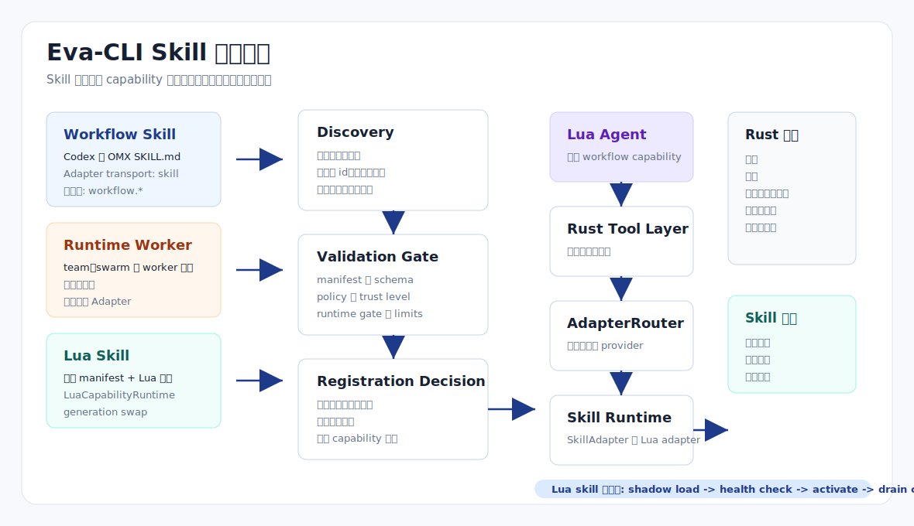

# Skill 实现方案

> Language: 简体中文
> Canonical source: ../en/skill-implementation.md
> Translation status: current

更新时间：2026-06-23

## 方案定位

本文把现有文档中分散的 Skill 设计收束成一份可实现方案，定义
Eva-CLI 如何发现、分类、授权、路由、调用、观测和热更新 Skill，同时避免
Skill 变成不受控脚本执行入口。

核心结论是：

```text
Skill 是受控 capability surface。
它不是原始 SKILL.md 解释器，也不是 Lua 拥有宿主权限的路径。
```



## 设计定位

Eva-CLI 应把 Skill 分成三类：

| Skill 类型 | 来源 | 运行时对象 | 默认注册策略 |
| --- | --- | --- | --- |
| `workflow_skill` | Codex / OMX `SKILL.md`，或项目显式 Skill manifest | `SkillAdapter` | 只有 manifest、schema、policy 和 runtime gate 全部通过才注册 |
| `runtime_worker` | team、swarm、ralph、worker 等运行态专用 surface | discovery 元数据 | 在不匹配运行态下只展示 |
| `lua_skill` | 项目内 Lua 工作流 + capability manifest | `LuaCapabilityAdapter` 和 `LuaCapabilityRuntime` | 注册为可热更新的 `workflow.*` capability |

这个分类很重要。外部 `SKILL.md` 是工作流指令包，`runtime_worker` 绑定特殊编排模式，
`lua_skill` 是项目内业务逻辑，适合进入已有 Lua capability runtime。

## 控制平面

控制平面由 Rust 托管：

```text
AgentDiscoveryService
  -> DiscoveryNormalizer
  -> Schema and policy validation
  -> RegistrationDecision
  -> AdapterRegistry / CapabilityRegistry
```

Discovery 可以扫描：

- `config/adapters/*.yaml` 中显式声明的 `transport: skill` Adapter。
- `config/capabilities/*.yaml` 中的 `kind: lua_skill` capability。
- 受信任用户目录，例如 `~/.codex/skills/*/SKILL.md` 和
  `~/.agents/skills/*/SKILL.md`。

发现不等于授权。每个被发现的 Skill 都必须产生 `RegistrationDecision`：

```text
registered
rejected
display_only
disabled
shadowed
```

决策需要包含 reason code，例如 `capability_missing_schema`、
`runtime_gate_mismatch`、`policy_denied`、`runtime_worker_display_only`、
`trust_level_unknown`。

## 数据模型

创建运行时对象前，先归一化为 Skill descriptor：

```rust
pub struct SkillDescriptor {
    pub id: String,
    pub name: Option<String>,
    pub kind: SkillKind,
    pub source: SkillSource,
    pub path: Option<PathBuf>,
    pub capabilities: Vec<String>,
    pub runtime_gate: RuntimeGate,
    pub input_schema: Option<SchemaRef>,
    pub output_schema: Option<SchemaRef>,
    pub permissions: DeclaredPermissions,
    pub trust_level: TrustLevel,
    pub metadata: serde_json::Value,
}
```

```rust
pub enum SkillKind {
    WorkflowSkill,
    RuntimeWorker,
    LuaSkill,
}
```

不能从扫描结果直接创建运行时对象。descriptor 必须先通过 schema、trust、
policy、冲突处理、runtime gate 和 capability registry 校验。

## Manifest 契约

### Workflow Skill Adapter

外部 workflow Skill 使用 Adapter manifest 表达：

```yaml
id: code-review-skill
name: Code Review Skill Adapter
version: 1.0.0
enabled: true
transport: skill

skill:
  source: codex
  id: code-review
  path: ~/.codex/skills/code-review/SKILL.md
  kind: workflow_skill
  runtime_gate: normal
  entry:
    type: codex_skill
  input_schema:
    type: object
    required:
      - scope
    properties:
      scope:
        type: string
        enum:
          - current_diff
          - workspace
      severity:
        type: string
        enum:
          - all
          - major
          - critical
  output_schema:
    type: object
    required:
      - summary
      - findings
    properties:
      summary:
        type: string
      findings:
        type: array

capabilities:
  - workflow.code_review

permissions:
  read_workspace: true
  write_workspace: false
  network: false
  shell: false
  env: []

limits:
  timeout_ms: 120000
  max_concurrency: 1
  max_prompt_bytes: 100000
```

如果缺少 `skill.kind`、`skill.runtime_gate`、`skill.input_schema` 或
`skill.output_schema`，运行时必须拒绝 `transport: skill` 注册。

### Lua Skill Capability

项目内 Lua Skill 使用 capability manifest 表达：

```yaml
id: config-lint-skill
kind: lua_skill
version: 1.0.0

capabilities:
  - workflow.config_lint

lua:
  script: config/skills/config_lint.lua
  entry: invoke
  health_check: health_check

runtime_gate:
  allowed_modes:
    - normal
  disallow_team_worker: true

input_schema: schemas/config_lint.input.json
output_schema: schemas/config_lint.output.json

permissions:
  fs:
    read:
      - workspace
    write: []
  network: false
  shell: false
  adapters:
    capabilities:
      - config.inspect

limits:
  timeout_ms: 30000
  concurrency: 2
```

Lua Skill manifest 应复用 `lua_tool` 和 `lua_mcp_handler` 已经采用的
`LuaCapabilityRuntime` 契约。

## 调用路径

Lua Agent 通过 capability 调用 Skill：

```lua
local result = ctx.tools.invoke_agent({
  capability = "workflow.code_review",
  provider = "code-review-skill",
  payload = {
    scope = "current_diff",
    severity = "major"
  },
  timeout_ms = 120000
})
```

Lua 不能传入：

- Skill 文件路径。
- 命令模板。
- 环境变量名或值。
- shell 片段。
- 超出 effective policy 的宿主文件路径。
- runtime mode override。

Rust 负责解析调用：

```text
ctx.tools.invoke_agent
  -> Rust Tool Layer
  -> caller permission check
  -> AdapterRouter
  -> SkillAdapter or LuaCapabilityAdapter
  -> input schema validation
  -> timeout and concurrency guard
  -> Skill execution
  -> output schema validation
  -> audit and metrics
  -> AgentInvokeResponse
```

## Runtime Gate

每个 Skill 都必须有 runtime gate，用来声明哪些运行态可以使用该 Skill：

```yaml
runtime_gate:
  allowed_modes:
    - normal
  disallow_team_worker: true
  requires_interactive_user: false
```

推荐决策：

| 运行态条件 | 决策 |
| --- | --- |
| `workflow_skill` 在 normal gate 和 normal runtime 下 | 注册 |
| `workflow_skill` 缺少 schema | 只展示或拒绝 |
| `runtime_worker` 在 normal runtime 下 | 只展示 |
| `runtime_worker` 在匹配 team runtime 下 | 只注册到 team runtime，不进入全局 Adapter |
| `lua_skill` 热更新时扩大权限 | 要求 runtime generation switch |

## 安全边界

Rust 托管：

- source path canonicalization。
- trust level 分配。
- manifest 和 schema 校验。
- effective permission 计算。
- secret 访问与环境变量注入。
- 文件系统、网络、shell、进程边界。
- timeout、cancellation、rate limit、concurrency。
- audit、metrics、tracing、rollback。

Skill 只承载：

- 领域工作流步骤。
- payload 映射。
- 受控 host API 编排。
- result 格式化。

运行时不能允许 Skill 变成通用 shell runner、通用 HTTP proxy、通用 MCP proxy
或不受限制的 workspace writer。

## 热更新

`lua_skill` 支持 generation swap：

```text
file change debounce
  -> parse manifest
  -> validate schema and policy
  -> load new Lua state
  -> bind restricted host API
  -> run health_check
  -> install shadow generation
  -> switch capability index
  -> drain old generation
  -> publish /capability/reloaded
```

`workflow_skill` 的更新由 discovery 驱动。manifest、path、schema、routing priority、
enabled flag 或 limits 变化时，需要生成新的 registration decision。权限扩大、
transport 变化或 runtime gate 扩大，不应走普通热加载，而应要求 runtime generation
switch。

## 可观测性

每次 Skill 调用应记录：

- `request_id`
- `trace_id`
- `agent_id`
- `skill_id`
- `provider`
- `capability`
- `skill_kind`
- `runtime_gate`
- `generation`
- `manifest_digest`
- `input_bytes`
- `output_bytes`
- `latency_ms`
- `status`
- `error_kind`

推荐事件：

```text
/skill/discovered
/skill/registration/decided
/skill/invoked
/skill/completed
/skill/failed
/skill/reloaded
/skill/reload_failed
```

推荐 CLI surface：

```text
eva skill list
eva skill explain <id>
eva skill doctor
eva capability inspect <id>
```

`explain` 应先展示 registration decision，再展示 source、schema、runtime gate、
effective permissions、冲突和 diagnostics。

## 验证矩阵

| 范围 | 场景 | 期望结果 |
| --- | --- | --- |
| Discovery | 受信任 workflow Skill 有显式 manifest | `registered` |
| Discovery | 用户本地 Skill 缺少 schema | `display_only` |
| Discovery | normal mode 下发现 `runtime_worker` | `display_only` |
| Schema | 缺少 output schema | `capability_missing_schema` |
| Policy | Skill 申请 workspace write 但 policy 禁止 | `policy_denied` |
| Runtime gate | team-only Skill 在 normal runtime 下 | `runtime_gate_mismatch` |
| Security | Lua 在 payload 中传入 Skill path | 请求被拒绝 |
| Security | manifest path 跳出 allowed roots | `path_not_allowed` |
| Routing | `workflow.code_review` 有多个 provider | Router 按确定性 priority 选择 |
| Hot reload | Lua Skill 语法错误 | 旧 generation 继续服务 |
| Hot reload | Lua Skill health check 失败 | 新 generation 被拒绝 |
| Audit | Skill 通过授权 API 写 workspace | 记录 touched paths |

## 与现有文档关系

- [Lua 调用外部 Agent 动态 Adapter 架构方案](Lua调用外部Agent动态Adapter架构方案.md)
  定义通用 Adapter 边界，`SkillAdapter` 是其中一种 transport family。
- [Lua 承载 Skill-MCP-Tool 热更新架构方案](Lua承载Skill-MCP-Tool热更新架构方案.md)
  定义 `lua_skill` runtime 与 generation swap 语义。
- [Agent 扫描与发现架构方案](Agent扫描与发现架构方案.md)
  定义 discovery sources、归一化、diagnostics、cache 和 registration decisions。
- [项目配置方案](项目配置方案.md)
  定义 manifest 位置、schema 校验、policy 合并顺序和热加载边界。

## 结论

Eva-CLI 的 Skill 实现应采用双路径模型：

```text
External SKILL.md
  -> Discovery
  -> SkillAdapter
  -> workflow.* capability

Project Lua Skill
  -> Capability manifest
  -> LuaCapabilityRuntime
  -> LuaCapabilityAdapter
  -> workflow.* capability
```

两条路径都把权限留在 Rust，只向 Lua 暴露稳定 capability。这样既保留热更新、
审计和 provider 替换能力，也能防止 Skill 绕过 Runtime 权限模型。
