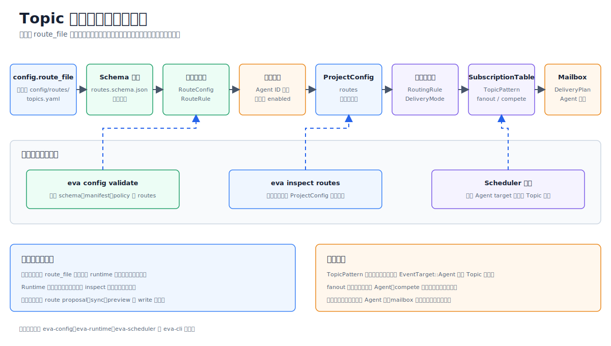

# Topic 路由混合同步方案

> Language: 简体中文
> English default entry: [../en/topic-routing-hybrid-sync.md](../en/topic-routing-hybrid-sync.md)
> Translation status: current

更新日期：2026-07-01

## 1. 方案定位

本文定义 `config/routes/topics.yaml` 与 `config/agents/**/agent.yaml` 之间的混合维护方案。结论是：**生产运行时以 `config/routes/topics.yaml` 作为 Topic 路由事实源，不由运行时根据 `agent.yaml` 隐式改写；同时允许工具从 `agent.yaml` 生成建议路由、执行一致性校验，并在显式命令下写回路由表。**

这个方案解决两个目标之间的冲突：

- 路由必须显式、可审计、可回滚，不能因为某个 Agent manifest 写错而自动扩大事件投递面。
- Agent 创建、重命名、订阅变更时不应完全依赖人工同步，否则容易漏改 `topics.yaml`。

## 2. 文件职责

| 文件 | 职责 | 是否为生产事实源 | 是否允许工具生成 |
| --- | --- | --- | --- |
| `config/agents/**/agent.yaml` | 声明 Agent 身份、父子关系、订阅、可发 Topic、局部路由意图和权限边界 | 对 Agent 自身配置是事实源 | 可由 Agent 创建工具生成初稿 |
| `config/routes/topics.yaml` | 声明 Scheduler 的全局 Topic 投递规则、目标 Agent、delivery 模式和匹配顺序 | 对生产 Topic 路由是事实源 | 只允许显式 CLI/IDE 操作写回 |
| `.eva/generated/routes/topics.generated.yaml` | 从 Agent manifest 推导出的建议路由或测试路由 | 否 | 是 |
| `.eva/reports/config/routes-diff.json` | 校验差异、冲突和建议修复 | 否 | 是 |

`agent.yaml` 可以包含 `subscriptions`、`children` 和 `routes` 提示，但这些字段不等价于最终投递规则。最终投递仍由 Scheduler 读取 `config/routes/topics.yaml` 后决定。

## 3. 架构图



## 4. 推荐数据流

```text
config/agents/**/agent.yaml
  -> AgentManifestScanner
  -> RouteProposalBuilder
  -> ConsistencyValidator
  -> routes-diff.json
  -> eva config routes sync --write
  -> config/routes/topics.yaml
  -> Scheduler RouteTable
```

运行时启动路径保持简单：

```text
config/routes/topics.yaml
  -> schema validate
  -> policy validate
  -> Scheduler RouteTable
```

启动时可以读取 Agent manifests 做交叉校验，但不应在启动过程中修改 `config/routes/topics.yaml`。

## 5. CLI 行为

| 命令 | 行为 | 是否写文件 | 适用场景 |
| --- | --- | --- | --- |
| `eva config validate` | 校验所有配置、Agent 引用、Topic pattern、权限和路由一致性 | 否 | 本地开发、CI、启动前检查 |
| `eva config routes sync --check` | 从 `agent.yaml` 生成建议路由，并与 `topics.yaml` 比较 | 否 | PR 检查、IDE 诊断 |
| `eva config routes sync --write` | 将可安全合并的建议写回 `config/routes/topics.yaml` | 是 | 新增 Agent 后显式同步 |
| `eva config routes preview` | 输出合并后的路由表和冲突说明 | 否 | 人工 review 前预览 |
| `eva config routes dump-effective` | 输出 Scheduler 实际使用的 RouteTable | 否 | 运行时诊断 |

`--write` 必须是显式命令，不应由运行时热加载、启动流程或 Agent 自身触发。

## 6. 一致性校验规则

| 校验项 | 规则 | 失败等级 |
| --- | --- | --- |
| 目标 Agent 存在性 | `topics.yaml` 中每个 `agents[]` 必须引用存在且 `enabled: true` 的 Agent | error |
| 订阅覆盖 | 路由 pattern 应被目标 Agent 的 `subscriptions` 覆盖，或存在显式豁免 | warning/error |
| 权限边界 | Agent 只能 emit `permissions.emit` 允许的 Topic pattern | error |
| 路由提示一致性 | `agent.yaml.routes.*.topic/targets` 应与全局路由兼容 | warning |
| delivery 冲突 | 同一 pattern 不应同时出现不兼容的 `fanout`、`compete` 或优先级声明 | error |
| 顺序敏感规则 | 通配符路由不能无意覆盖更具体路由；具体路由应优先 | warning/error |
| 未投递订阅 | Agent 声明了 subscription，但全局路由没有任何匹配投递 | warning |
| 孤儿路由 | 全局路由投递给未订阅该 Topic 的 Agent | warning/error |

订阅覆盖默认建议为 warning，因为某些管理型 Agent 可以 intentionally 处理更宽或更窄的 Topic 范围。生产环境可通过 policy 将其提升为 error。

## 7. 路由生成规则

RouteProposalBuilder 只能生成“建议”，不能直接绕过 review。建议规则：

1. 对每个 enabled Agent 读取 `subscriptions`。
2. 如果某个 subscription 没有出现在 `topics.yaml`，生成候选规则：

```yaml
- pattern: /sys/route-a
  delivery: fanout
  agents:
    - agent-a
```

3. 如果多个 Agent 订阅同一 Topic，默认建议 `delivery: fanout`，并标记需要人工确认。
4. 如果 `agent.yaml.routes` 声明了 `targets`，生成候选子路由，但必须校验目标 Agent 存在、enabled 且订阅覆盖。
5. 不自动推导 `compete`、优先级、负载均衡或 fallback；这些必须由 `topics.yaml` 手写。
6. 不从目录嵌套推导 Topic 或父子关系。

## 8. 热加载边界

| 变更 | 可热加载 | 需要重建/重启 | 说明 |
| --- | --- | --- | --- |
| 修改 `topics.yaml` 中已有 pattern 的目标 Agent | 是 | 否 | 通过新 RouteTable generation 原子替换 |
| 新增简单 fanout 路由 | 是 | 否 | 必须先通过 schema 和 policy 校验 |
| 修改 Agent `subscriptions` | 是 | 否 | 只影响一致性校验和 mailbox 注册 |
| 扩大 `permissions.emit` | 否 | 是 | 属于权限扩张 |
| 修改 delivery 为 `compete` 或优先级策略 | 视实现而定 | 可能需要 | 如果影响队列语义，应切 generation |
| 运行时自动写回 `topics.yaml` | 否 | 不允许 | 避免隐式配置漂移 |

## 9. 方案优缺点

| 方案 | 优点 | 缺点 |
| --- | --- | --- |
| 完全手写 `topics.yaml` | 路由显式、review 友好、安全边界清晰、复杂规则可表达 | 新增 Agent 时容易漏同步，重复信息较多 |
| 完全由 `agent.yaml` 动态生成 | Agent 创建体验好，简单订阅不易漏配，适合测试环境 | 事实源不清晰，安全审计变难，复杂 delivery/优先级难以可靠推导 |
| 混合方案 | 保留生产显式路由，同时用工具减少漏改；适合 CI、IDE 和脚手架 | 需要实现校验、diff 和同步命令；规则设计必须避免误写 |

## 10. 推荐落地步骤

1. 保持 `config/routes/topics.yaml` 为生产路由事实源。
2. 在 `eva config validate` 中加入 Agent 与 Topic 路由交叉校验。
3. 新增 `eva config routes sync --check`，只生成 diff，不写文件。
4. 新增 `eva config routes sync --write`，只写入无冲突、可解释的建议变更。
5. 将 `.eva/generated/routes/topics.generated.yaml` 和 `.eva/reports/config/routes-diff.json` 作为诊断产物，不作为生产配置提交。
6. 在 CI 中执行 `eva config validate` 和 `eva config routes sync --check`。
7. IDE 插件只展示建议和 quick-fix，不能在后台静默改写生产路由表。

## 11. 决策记录

| 决策 | 结论 |
| --- | --- |
| 生产路由事实源 | `config/routes/topics.yaml` |
| Agent manifest 的作用 | Agent 自身声明和路由建议输入 |
| 自动更新策略 | 运行时不自动写回；只允许显式 CLI/IDE 操作 |
| 生成产物位置 | `.eva/generated/` 和 `.eva/reports/` |
| CI 默认要求 | 校验失败阻塞；建议 diff 可配置为 warning 或 error |

## 12. 总结

混合方案的核心边界是：**让机器帮助发现不一致，但让人或显式命令决定生产路由表。**

这样可以保留 `topics.yaml` 的审计性、可读性和安全边界，同时避免 Agent 变更后人工同步遗漏。对于 Eva-CLI 当前的架构阶段，这比“运行时动态改写配置”更稳定，也比“完全手写无校验”更容易长期维护。
