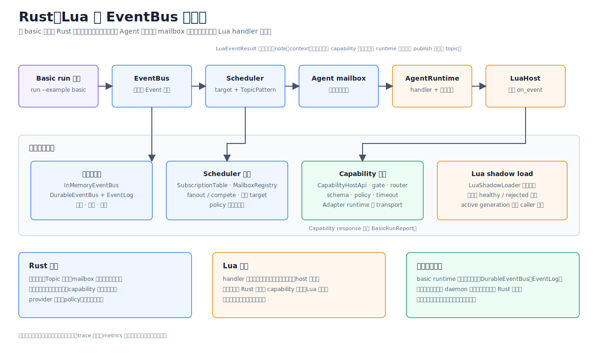

# Rust、Lua 与 EventBus 单进程运行时

> Language: 简体中文
> English default entry: [English](../../en/architecture/rust-lua-eventbus-scheduler.md)
> Translation status: current

更新日期：2026-07-13

## 文档定位

本文说明仓库当前已经存在的运行链路。Eva-CLI 校验项目配置、记录强类型
Topic 事件、把显式路由规则展开到有界 Agent mailbox，并在 Rust 托管的 host
API 后运行 Lua 5.4 `on_event` handler。

当前数据面是同步、单进程实现，不是“每个 Agent 一个 Tokio task”的运行时，
也不是网络 EventBus 或分布式 Scheduler。这些形态不属于现行实现契约。

## 已实现架构



主要职责边界如下：

| Crate | 已实现职责 |
| --- | --- |
| `eva-core` | 强类型 `Event`、`Topic`、target、payload、metadata、ID、invoke 和 error 契约 |
| `eva-eventbus` | 内存与文件系统事件日志、receipt、ack、fail、死信和 redrive |
| `eva-scheduler` | 有序 Topic 规则匹配，以及到有界 mailbox 的投递计划 |
| `eva-agent` | 同步 Agent 生命周期、有界 FIFO 队列、重试/取消/超时记录和 handler 边界 |
| `eva-lua-host` | 受控 Lua 5.4 加载、`on_event`、host binding、资源限制和 shadow-load 原语 |
| `eva-runtime` | 配置组合、一次性 basic loop、持久恢复服务和前台 daemon 控制 |

`eva-adapter`、`eva-capability`、`eva-memory` 和观测 crate 通过受控 Rust API
接入。Lua 不会获得它们的具体文件、进程、网络、凭据或设备句柄。

## Event 契约

共享事件契约可以概括为：

```text
Event
  event_id: EventId
  topic: Topic
  target: EventTarget
  payload: EventPayload
  metadata: EventMetadata
```

- `EventPayload` 为 `Empty`、UTF-8 `Text` 或 `Bytes`。
- `EventTarget` 可以是 broadcast、Agent、Capability 或 Adapter。只有显式
  Agent target 会绕过 Scheduler 的普通 Topic 展开。
- `EventMetadata` 携带创建时间、可选 request ID、correlation/causation ID
  和可选 generation ID。
- 当前 Event 契约没有 source 或 priority 字段，原生 payload 也不是任意
  JSON value。

具体 Topic 必须以 `/` 开头、至少包含一个非空 segment、不能以 `/` 结尾，
也不能包含通配符。Pattern 额外支持 `*` 精确匹配一个 segment，以及 `**`
匹配零个或多个尾部 segment；`**` 只能位于最后一个 segment。

## 发布与投递链路

一次性运行链路如下：

```text
已校验 ProjectConfig
  -> 构造 Event
  -> EventBus.publish 并返回 EventReceipt
  -> SubscriptionTable.route
  -> MailboxRegistry 有界 FIFO
  -> AgentRuntime 有界 FIFO
  -> LuaHost.run_on_event
  -> EventBus.ack 或 EventBus.fail + dead letter
  -> task、trace 与 audit evidence
```

EventBus 负责记录事件，不选择 Agent。`SubscriptionTable` 负责路由，
`MailboxRegistry` 持有 Scheduler 一侧的队列。basic loop 随后从 mailbox
取出一条事件，放入所选 `AgentRuntime`，并同步调用 handler。

两层 mailbox 都使用有界 `VecDeque`。队列溢出返回结构化 unavailable 错误。
这条链路没有后台 dispatcher，也不包含隐式并行执行。

## EventBus 后端

| 后端 | 持久性 | 当前用途 |
| --- | --- | --- |
| `InMemoryEventBus` | 只保存在进程内；包含内存 event log 和 dead-letter queue | `run --example basic`，以及未传 `--durable-backend` 的 `emit` |
| `DurableEventBus` | 在 `DurableBackendLayout` 下保存文件系统 event log 和 dead-letter record | `emit --durable-backend`、durable inspect、恢复和 redrive 链路 |

两种实现都通过 `EventBus` trait 提供 publish、ack 和 fail。Durable 实现可重新
打开记录，并持久化 dead-letter redrive 状态。两者都不是外部消息 broker；
仓库当前没有集成 Redis Streams、NATS、Kafka、RabbitMQ 或 PostgreSQL
EventBus 后端。

## Scheduler 语义

Scheduler 规则来自配置的 Topic route 文件，并保持文件顺序。

1. `EventTarget::Agent` 产生一次直接投递，并跳过 Topic 规则。
2. 否则展开所有 `TopicPattern` 匹配该事件的 route。
3. `fanout` 为该规则列出的每个 Agent 产生一次投递。
4. `compete` 当前只为该规则列出的第一个 Agent 产生一次投递。
5. 没有规则命中时返回结构化 not-found 错误。

精确 pattern 不会压制同时命中的通配 pattern；所有命中规则都按源文件顺序
展开。当前路由不按 priority、load、latency 或 health 打分，`compete` 也不是
round-robin 或负载均衡。

## Lua 5.4 边界

`eva-lua-host` 通过 `mlua` 嵌入 vendored Lua 5.4。每次调用创建受控 VM，
只加载 table、string、UTF-8 和 math 标准库。OS、I/O、package 和 debug 库
不会加载，`rawset` 被移除；预加载 policy 还会拒绝 `os.execute`、`io.popen`、
`require`、`dofile` 和 `loadfile` token。

Lua 接收只读 `event` 和 `ctx` table。已实现的 host surface 包含：

- 通过已配置 `CapabilityHostApi` 调用的
  `ctx.tools.call(capability, input)`；
- 产生可追踪 observation 的 `ctx.host.log` 与 `ctx.host.audit`；
- request、trace 和只读 memory/context snapshot。

`on_event` 必须返回 table。Rust 将其归一化为 `LuaEventResult`，包含 status、
Topic、可选 note 和可选 capability request 字段。当前没有 `ctx.emit` binding，
也没有异步 Rust Future/Lua coroutine 契约。

Lua 执行可以设置 wall-clock timeout、instruction budget、memory limit 和
cancellation token；VM hook 可以中断 Lua。外层同步 `AgentRuntime` 会记录重试、
取消和耗时超时结果，但不能抢占任意阻塞的 Rust handler。

## Basic 与 Daemon 边界

| 入口 | 实际执行内容 | 重要边界 |
| --- | --- | --- |
| `eva run --example basic` | 加载 `examples/basic`，构建 `in_memory_v1.0`，发布一个事件、展开路由、依次运行所选 Lua handler、记录 ack/failure/dead letter，并写 task report | 始终使用 `InMemoryEventBus`；`--durable-backend` 选择的是持久 task-report 存储，不会把该 loop 改成 durable EventBus |
| `eva emit <topic>` | 发布一个强类型事件并返回 receipt | 默认使用 `InMemoryEventBus`；传入 `--durable-backend` 时使用 `DurableEventBus`；不会运行 Scheduler 或 Agent |
| `eva daemon start --foreground` | 校验 durable backend、恢复、policy、观测、硬件和 maintenance 边界，然后构建 Runtime | 不支持后台 spawn；默认 start 是完成后退出的 smoke run |
| 使用 `--no-shutdown-after-smoke` 的前台 daemon | 轮询文件系统 control mailbox，执行 durable retry tick，并记录 status、shutdown、task submit/cancel、Agent drain 和 reload-plan mutation | 这是本地控制/恢复 loop，不是并发 Agent 执行宿主；start report 明确记录 provider process 未启动 |

Agent drain 和 reload 命令可以持久化 daemon control evidence。Lua shadow loader
与 generation route gate 可以校验候选 generation，并在失败时保留 active
generation。这些是显式原语，不是自动 Lua 文件 watcher，也不会自动热替换
Topic route。

## 可靠性与可观测性

- Event publish 返回带 sequence 的 receipt。
- Ack 与 fail 会更新对应 Agent consumer 的 event-log record。
- Handler 失败可以进入 dead letter，并通过新 replay event ID redrive。
- basic loop 支持即时 retry-attempt 次数、取消、Lua limit、task log 和内存 audit
  observation。
- Durable retry scheduling 与 daemon tick 使用显式 retry/backoff record，但这不
  代表存在分布式队列。
- 在对应操作提供字段时，系统保留 request、event、generation、correlation、
  causation、Agent、capability、error 和 audit 信息。

## 明确未实现的能力

当前架构不宣称具备：

- 每个 Agent 一个 Tokio task、Lua State 或 OS process；
- 分布式 Scheduler 或外部 durable EventBus；
- 基于 priority 或 load 的 Agent 选择；
- 从 Agent subscription 自动生成 route；
- 编辑 YAML 后自动热替换 route table；
- 后台 daemon spawn；
- 在当前 daemon start 路径启动 provider process。

## 验证入口

```text
eva config validate
eva run --example basic
eva emit /input/user
eva emit /input/user --durable-backend <path>
eva daemon start --foreground
```

basic 命令是可执行的端到端调度示例；`emit` 用于验证 EventBus publish；daemon
命令验证的是另一条本地进程控制与 durable recovery 边界。
