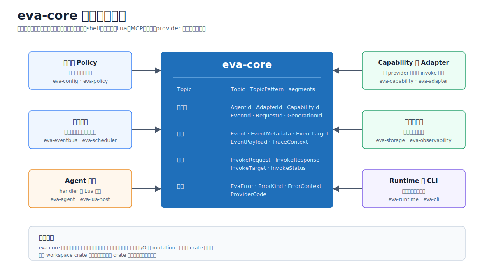

> Language: 简体中文
> English default entry: [English](../../en/architecture/eva-core-module.md)
> Translation status: current

# eva-core 契约模块

更新日期：2026-07-13

`eva-core` 是 Eva-CLI Rust workspace 中零依赖的契约基础。它定义配置、EventBus、
Scheduler、Agent、Lua、capability、Adapter、storage、runtime、release 和 CLI
边界之间交换的值，不执行外部 I/O 或 runtime 组合。



## 1. 已实现边界

| `eva-core` 负责 | `eva-core` 不负责 |
| --- | --- |
| 强类型 Eva identifier | ID 分配、registry lifecycle、持久化 |
| concrete Topic 与 TopicPattern 解析/匹配 | subscription table、负载均衡、投递 |
| Event、target、payload 与 trace linkage 契约 | Event publish、replay、dead letter、handler |
| Capability name/reference 与 provider hint | provider 选择、授权或调用 |
| Invoke request/response lifecycle value | timeout 执行、取消或 transport 执行 |
| 跨 crate 结构化错误值 | retry scheduling、日志、audit 持久化或 exit code |

该 crate 的 `Cargo.toml` 没有任何依赖；当前实现只使用 Rust 标准库和
`eva-core` 内部模块。

## 2. 公开模块表面

| 模块 | 公开契约 |
| --- | --- |
| `ids` | `AgentId`、`AdapterId`、`CapabilityId`、`RequestId`、`EventId`、`GenerationId` |
| `topic` | `Topic`、`TopicPattern`、`TopicPatternSegment` |
| `event` | `Event`、`EventMetadata`、`EventPayload`、`EventTarget`、`TraceContext` |
| `capability` | `CapabilityName`、`CapabilityRef`、`ProviderHint` |
| `invoke` | `InvokeInput`、`InvokeOutput`、`InvokeMetadata`、`InvokeRequest`、`InvokeResponse`、`InvokeStatus`、`InvokeTarget` |
| `error` | `ErrorKind`、`ProviderCode`、`ErrorContext`、`EvaError` |

这些高频类型从 `eva_core` 根重新导出，构成下游 crate 的稳定 import surface。

## 3. Identifier 契约

每类 identifier 都是独立 Rust newtype，因此不能误把 `AgentId` 当作 `AdapterId`
传递。六种 ID 共享以下校验规则：

- 非空，且首尾不能有空白；
- 最长 128 bytes；
- 不能包含 `/` 或 `\` 路径分隔符；
- 只允许 ASCII 字母、数字、`.`、`_`、`-` 和 `:`。

ID 实现 ordering、hashing、display、`FromStr` 与 `TryFrom<&str>`。它们不会自行
分配，也不表示被引用对象一定存在。

## 4. Topic 契约

### 4.1 Concrete Topic

`Topic` 是 `/input/user` 这类以 `/` 开始的分段路径。解析会拒绝相对路径、空分段、
末尾 `/`、空白和任意 wildcard 字符。

### 4.2 Topic Pattern

`TopicPattern` 使用相同路径形式，并支持：

| 分段 | 含义 |
| --- | --- |
| literal | 精确匹配一个分段 |
| `*` | 精确匹配一个任意分段 |
| 末尾 `**` | 匹配零个或多个剩余分段 |

wildcard 必须占据完整分段，`**` 只能出现在最后一段。matching 是纯线性契约操作。
route order、fanout、compete selection 与 mailbox delivery 归 `eva-scheduler`。

## 5. Event 契约

`Event` 包含：

```text
Event
  event_id: EventId
  topic: Topic
  target: Broadcast | Agent | Capability | Adapter
  payload: Empty | Text | Bytes
  metadata:
    created_at: SystemTime
    request_id?: RequestId
    trace: correlation_id? + causation_id?
    generation_id?: GenerationId
```

默认 target 是 `Broadcast`。`EventTarget` 只表达意图，不会自行路由或执行 Event。
在当前 Scheduler 中，只有 direct Agent target 有特殊路由行为。

`TraceContext::child_of` 会保留既有 correlation root；若不存在，则以 parent event
作为新 root，并把 parent 记录为 causation。`Event::child_event` 把该关联应用到新
Event。payload 保持 opaque；schema 解释归配置、Adapter 或 caller 边界。

## 6. Capability 契约

`CapabilityName` 是 `repo.analyze` 这类已校验 dotted name，并暴露 namespace 与
segment。`CapabilityRef` 把 name 与可选 `ProviderHint` 组合。

provider hint 只是建议性契约数据。`eva-core` 不解析 provider、检查 manifest
allowlist、授予权限或调用 provider；这些职责分别归 `eva-capability`、
`eva-policy` 与 `eva-adapter`。

## 7. Invoke 契约

`InvokeTarget` 指向 Agent、Capability 或 Adapter。`InvokeInput` 与 `InvokeOutput`
复用 opaque `EventPayload` 表示。

```text
InvokeRequest
  request_id
  target
  input
  metadata: timeout? + trace + generation_id? + caller?

InvokeResponse
  request_id
  status: Accepted | Completed | Failed | Cancelled | Timeout
  output?
  error?
  metadata
```

`Completed`、`Failed`、`Cancelled` 与 `Timeout` 是终态，`Accepted` 不是。构造器会
为 failure、cancellation 和 timeout 路径保留结构化错误。

timeout 字段只是预算声明；`eva-core` 不运行计时器，也不取消工作。同样，`caller`
只是关联数据，不是已认证 principal。runtime 与 provider 边界必须执行这些语义。

## 8. Error 契约

`EvaError` 包含：

```text
kind
message
retryable
provider_code?
context: ordered key/value entries
```

`ErrorKind` 当前覆盖 invalid argument、not found、conflict、permission denied、
timeout、unavailable、internal 与 unsupported。可选 provider code 保留 provider
专属 machine label，但不把 provider protocol 并入共享 enum。

`retryable` 是分类数据，不是 retry 命令。Scheduler、Agent、Adapter 与 CLI 层决定
是否及如何重试。trace 持久化、audit 输出、redaction 与 process exit mapping 也不
属于该 crate。

## 9. 跨 Crate 不变量

- 下游 crate 复用这些契约，不能重新定义相似的 ID、Topic、Event、Invoke 或 Error。
- 构造器在边界完成校验；可能破坏契约的字段保持 private。
- core value 不包含 registry handle、待执行路径、socket、process object、Lua value、
  MCP message 或 storage client。
- Event 与 Invoke payload 保持 opaque；`eva-core` 不解释业务 JSON 或 provider schema。
- correlation、generation、target、provider hint、timeout、caller 与 retryability metadata
  不会授予权限，也不证明执行发生。
- provider-specific state 不应加入共享 enum，除非它已经成为稳定跨 crate 概念。

## 10. Runtime 交接

| Consumer | 使用 `eva-core` 的方式 | 由其他边界负责的执行 |
| --- | --- | --- |
| `eva-config` | 解析 ID、Topic、pattern、capability | file/schema 与 cross-reference validation |
| `eva-eventbus` | 存储并返回 Event 契约 | publish、ack、fail、replay |
| `eva-scheduler` | 匹配 TopicPattern 并创建 Agent delivery | mailbox 与 route selection |
| `eva-agent` / `eva-lua-host` | 传递 Event 与结构化 result/error | queue、handler、sandbox 与 limit |
| `eva-capability` / `eva-adapter` | 构建 Invoke value 与 provider reference | gate、routing、supervision 与 transport |
| `eva-storage` | 持久化契约的序列化表示 | layout、checksum、file 与 migration lock |
| `eva-runtime` / `eva-cli` | 关联 request、report 与 exit behavior | composition、execution 与 presentation |

## 11. 必须留在 Core 之外的内容

- YAML 与 schema loader；
- policy merge 或 permission grant；
- EventBus log、dead-letter queue 与 Scheduler registry；
- Agent queue、Lua VM state 或 hot reload；
- Adapter manifest、provider selection、credential 或 transport protocol；
- MCP JSON-RPC message 与 session；
- memory、hardware、backup、lifecycle 或 release service；
- filesystem/network/database/process access；
- CLI JSON envelope 与 exit-code policy。

## 12. 总结

`eva-core` 是已实现、无副作用的公共词汇：六种 ID newtype、Topic matching、Event 与
trace linkage、capability reference、Invoke lifecycle value 和结构化错误。其最重要
的不变量是：metadata 只描述意图与关联，执行权威始终留在所属 runtime crate。
