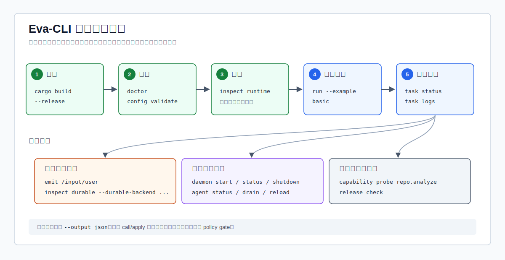
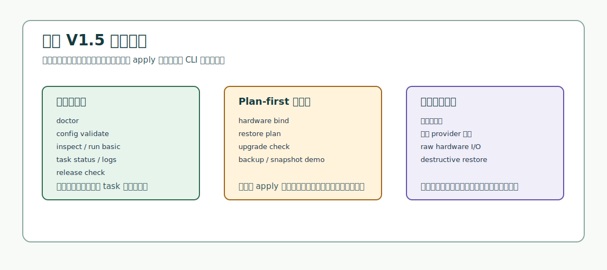

# Eva-CLI 使用手册

更新时间：2026-07-09

适用版本：Eva-CLI `1.11.5-alpha`

本文面向从源码使用 Eva-CLI 的开发者、测试者和文档维护者。当前版本是
V1.11.5-alpha 源码 alpha 检查点：仓库可以编译，CLI 命令面可以执行，durable
EventBus redrive、可重启读取的 task snapshot、durable audit record、artifact metadata evidence、runtime recovery scanner、redrive checkpoint、recovery audit smoke、durable diagnostics、受限 Lua VM `on_event` 真实执行边界、Lua host observability、`ctx.tools.call` capability binding、Lua timeout、instruction budget、cancel 和 memory 执行限制、shadow load、generation route gate、drain evidence、rollback audit evidence、release evidence gates、CLI 命令模块拆分、typed event 发布、daemon process boundary smoke、daemon control mailbox、durable task lifecycle、scheduler retry dispatch、Agent lifecycle evidence 和 capability provider routing 命令已经落地，但高风险路径仍以受控诊断、in-memory 示例闭环、plan-first 和发布门禁为主。

## 当前定位

| 项目 | 当前状态 |
| --- | --- |
| 发布形态 | 源码发布；从 Git 仓库和 Rust 工具链运行。 |
| 运行时 | `run --example basic` 通过受限 Lua VM、host binding、resource-limit 与 hot-reload lifecycle 边界执行 V1.0 in-memory basic runtime 闭环；`daemon start/status/stop/shutdown/submit/cancel/drain/reload` 提供 V1.12 本机 pid/lock/state、shutdown 边界 smoke、filesystem mailbox 控制面和 due dead-letter scheduler retry tick。 |
| 外部能力 | Adapter、MCP、Skill、Discovery 当前提供受控诊断面，不启动真实 provider。 |
| 风险动作 | 硬件绑定、恢复、升级和生命周期切换保持 plan-first，不执行 destructive apply。 |
| 发布检查 | V1.11.5-alpha 提供 `release check/security/perf/migration` 可执行门禁，包含 Lua VM、release evidence、CLI split readiness 和 runtime 命令补齐 evidence。 |



## 安装准备

| 依赖 | 建议 | 用途 |
| --- | --- | --- |
| Git | 可访问 GitHub SSH 或 HTTPS | 克隆仓库、提交和推送。 |
| Rust toolchain | Stable Rust，包含 `cargo` | 编译 workspace、运行 CLI 和测试。 |
| PowerShell 或 Bash | 任一常用 shell | 执行示例命令；Windows 下优先使用 PowerShell。 |
| 网络访问 | 推送时需要 | 将提交推送到 GitHub。 |

从源码获取并构建：

```powershell
git clone git@github.com:Yetmos/Eva-CLI.git
cd Eva-CLI
cargo build
cargo run -- --version
```

如果已经在仓库根目录，可以直接运行：

```powershell
cargo run -- --version
```

预期版本输出包含：

```text
eva 1.11.5-alpha
release: V1.11.5-alpha
```

## 快速开始

先用这组命令确认本地环境、配置和 runtime 摘要：

| 步骤 | 命令 | 预期结果 |
| --- | --- | --- |
| 查看版本 | `cargo run -- --version` | 输出版本、release label 和 contract 列表。 |
| 工作区诊断 | `cargo run -- doctor --output json` | 检查仓库根、配置根、schema、Lua host 和 runtime builder。 |
| 配置校验 | `cargo run -- config validate --output json` | 加载 `config/eva.yaml` 和拆分 manifest，返回配置摘要。 |
| 查看运行时 | `cargo run -- inspect runtime --output json` | 输出 agents、adapters、capabilities、routes、policy 和 runtime 摘要。 |
| 查看 durable backend | `cargo run -- inspect durable --durable-backend .eva/durable --output json` | 输出 backend schema、migration status 和 pending redrive count。 |
| 运行示例 | `cargo run -- run --example basic --output json` | 执行 in-memory basic loop，默认写入 `.eva/tasks` task report。 |
| 发布事件 | `cargo run -- emit /input/user --payload hello --output json` | 向 in-memory EventBus 边界发布 typed Event。 |
| Daemon smoke | `cargo run -- daemon start --foreground --dev --output json` | 验证 pid/lock/state、durable backend、policy、observability 和 shutdown contract，不启动 provider。 |
| Daemon control | `cargo run -- daemon status --state-dir .eva/daemon-state --lock-dir .eva/daemon-locks --pid-dir .eva/daemon-pids --output json` | 查询显式前台 daemon；无 running daemon 时返回稳定 `unavailable`。 |
| Agent 状态 | `cargo run -- agent status --agent root-agent --output json` | 输出 Agent lifecycle 和 manifest evidence。 |
| Capability probe | `cargo run -- capability probe repo.analyze --output json` | 输出 provider plan 和 permission gate evidence。 |
| 查看任务 | `cargo run -- task status --output json` | 读取最新 task 状态。 |
| 发布门禁 | `cargo run -- release check --output json` | 输出 V1.11.5 release readiness。 |

文本输出适合人工查看，JSON 输出适合 CI 或脚本处理。需要稳定字段时加
`--output json`。

## 命令总览

| 命令组 | 常用命令 | 当前用途 | 是否执行外部副作用 |
| --- | --- | --- | --- |
| 版本 | `version`、`--version` | 输出版本、release label 和支持契约。 | 否 |
| 诊断 | `doctor` | 检查 workspace、配置根、schema 和 runtime 边界。 | 否 |
| 配置 | `config validate` | 校验 `eva.yaml`、manifest、policy、routes 和 schema。 | 否 |
| 查看 | `inspect`、`inspect durable` | 查看项目配置、路由、策略、runtime 摘要或 durable backend 诊断。 | 否 |
| 运行 | `run --example basic` | 通过受限 Lua VM 边界执行 V1.0 in-memory basic loop。 | 写 `.eva/tasks` 或 durable backend `tasks/` |
| 事件 | `emit <topic>` | 向 in-memory 或 durable EventBus 发布 typed Event。 | 传入 `--durable-backend` 时写 durable backend `events/log/` |
| Daemon | `daemon start/status/stop/shutdown/submit/cancel/drain/reload` | 验证本机 daemon pid/lock/state、durable backend、policy、observability、shutdown contract 和 filesystem mailbox 控制面。 | 写入指定 daemon state/observability/control 目录；默认 smoke 会移除 lock/pid；显式前台 daemon 响应 control 请求 |
| Agent | `agent status/drain/reload` | 输出 Agent lifecycle、drain plan 和 generation reload evidence。 | 连接 running daemon 时 `drain/reload` 写入 daemon mutation state；无 daemon 时回退 `mutation_executed:false` evidence |
| Capability | `capability list/probe/call` | 输出 provider routing，并执行 dry-run 或确认后的受控 invoke。 | `call` 默认 dry-run；确认执行仍输出 `mutation_executed:false` |
| 任务 | `task status/logs/cancel` | 读取或标记 task 诊断。 | 只写 task 取消标记 |
| Adapter | `adapter list/probe` | 列出或探测 manifest 派生的 Adapter handle。 | 否 |
| MCP | `mcp list/probe` | 列出或探测 allowlist 中的 MCP tool。 | 否 |
| Skill | `skill list/run` | 运行受控 workflow skill runner，写入 artifact evidence。 | 仅 manifest allowlist runner |
| Discovery | `discovery scan` | 扫描可信配置源并输出候选能力。 | 否 |
| Memory | `memory context` | 构造 request-scoped memory/knowledge context。 | 否 |
| Hardware | `hardware list/probe/bind` | 发现硬件 manifest 并生成绑定计划。 | 否 |
| Backup | `backup create` | 在 in-memory artifact store 中创建并校验备份 artifact。 | 否 |
| Snapshot | `snapshot create` | 创建绑定 backup manifest 的 release snapshot。 | 否 |
| Restore | `restore plan` | 生成恢复计划，保持 `apply_allowed:false`。 | 否 |
| Upgrade | `upgrade check` | 检查 generation、migration、drain 和 rollback readiness。 | 否 |
| Release | `release check/security/perf/migration` | 执行 V1.11.5 发布准备、安全、性能和迁移门禁。 | 否 |

## 基本用法

所有命令默认使用当前目录作为项目根。需要指定其他仓库路径时使用
`--project <path>`：

```powershell
cargo run -- doctor --project C:\path\to\Eva-CLI --output json
```

常见全局选项：

| 选项 | 作用 |
| --- | --- |
| `--project <path>` | 指定项目根目录。 |
| `--output text` | 输出适合人读的文本摘要；多数命令默认使用文本。 |
| `--output json` | 输出稳定 JSON envelope，适合脚本和 CI。 |
| `--help` 或 `-h` | 显示完整命令帮助。 |

## 发布 typed event

`emit` 会构造 `eva-core::Event` 并通过 runtime 使用的同一套 EventBus contract 发布事件。未传 `--durable-backend` 时，命令发布到 in-memory bus 并返回 receipt；传入 `--durable-backend <path>` 时，会打开 V1.6 durable backend，并把 event record 写入 `events/log/`。

```powershell
cargo run -- emit /input/user --event-id evt-manual-1 --payload hello --output json
cargo run -- emit /input/user --event-id evt-manual-2 --payload-bytes-hex 68656c6c6f --target-agent root-agent --durable-backend .eva/durable --output json
```

| 选项 | 默认值 | 说明 |
| --- | --- | --- |
| `<topic>` 或 `--topic <topic>` | 必填 | 具体事件 topic，例如 `/input/user`。 |
| `--event-id <id>` | 自动生成 | 稳定 event id；自动生成时使用 `evt-cli-emit-*` 前缀。 |
| `--payload <text>` | Empty | UTF-8 文本 payload；JSON 文本会按 text 透传，不做结构化解析。 |
| `--payload-empty` | Empty | 显式空 payload。 |
| `--payload-bytes-hex <hex>` | Empty | 以 hex 编码的二进制 payload。 |
| `--target-agent`、`--target-capability`、`--target-adapter` | Broadcast | 定向投递目标。 |
| `--request-id`、`--generation`、`--correlation-id`、`--causation-id` | 未设置 | 写入事件 metadata 的可选链路字段。 |
| `--durable-backend <path>` | 未启用 | 通过 durable EventBus log 持久化发布。 |

## Daemon process boundary and control mailbox

`daemon start/status/stop/shutdown/submit/cancel/drain/reload` 是 V1.12 的本机进程边界和控制面。它固定 pid、lock、state、durable backend、policy、observability 和 shutdown contract，但不启动生产后台守护进程，也不启动 provider。显式前台 daemon 每轮 control polling 前会执行 V1.12.4 scheduler retry tick：读取 due dead-letter，生成 replay event，投递到 scheduler mailbox，并用 `scheduler-retry` consumer 写入 durable log ack/fail。V1.12.5 后，`agent drain/reload` 连接该 daemon 时会写入 `agent-control.state`，记录 drain `accepts_new_work:false`、reload 后 `selected_generation_for_new_work` 和旧 generation `draining` 状态；这仍不是完整 provider restart 或生产热更新 apply。

```powershell
cargo run -- daemon start --foreground --dev --durable-backend .eva/daemon-durable --state-dir .eva/daemon-state --lock-dir .eva/daemon-locks --pid-dir .eva/daemon-pids --observability-backend .eva/daemon-observability --output json
cargo run -- daemon status --state-dir .eva/daemon-state --lock-dir .eva/daemon-locks --pid-dir .eva/daemon-pids --output json
cargo run -- daemon shutdown --state-dir .eva/daemon-state --lock-dir .eva/daemon-locks --pid-dir .eva/daemon-pids --output json
```

默认 `daemon start` 是 smoke：验证完成后会 shutdown 并移除 lock/pid，此时 `daemon status` 会返回 `unavailable`，避免把 stopped state 误读成 live daemon。需要测试 control mailbox 时，在一个终端保持前台 daemon：

```powershell
cargo run -- daemon start --foreground --dev --no-shutdown-after-smoke --durable-backend .eva/daemon-durable --state-dir .eva/daemon-state --lock-dir .eva/daemon-locks --pid-dir .eva/daemon-pids --observability-backend .eva/daemon-observability --output json
```

再从另一个终端发送 control 请求：

```powershell
cargo run -- daemon status --state-dir .eva/daemon-state --lock-dir .eva/daemon-locks --pid-dir .eva/daemon-pids --output json
cargo run -- daemon submit --task req-daemon-task-1 --durable-backend .eva/daemon-durable --state-dir .eva/daemon-state --lock-dir .eva/daemon-locks --pid-dir .eva/daemon-pids --output json
cargo run -- daemon cancel --task req-daemon-task-1 --durable-backend .eva/daemon-durable --state-dir .eva/daemon-state --lock-dir .eva/daemon-locks --pid-dir .eva/daemon-pids --reason "manual stop" --output json
cargo run -- daemon shutdown --state-dir .eva/daemon-state --lock-dir .eva/daemon-locks --pid-dir .eva/daemon-pids --output json
```

| 字段 | 说明 |
| --- | --- |
| `provider_processes_started:false` | 该命令只验证 daemon 边界，不进入 provider supervision。 |
| `durable_backend` | 启动前验证的 durable backend layout 和 schema。 |
| `policy` | 已加载的 policy source 和 effective policy layer evidence。 |
| `observability` | file JSONL audit/metric/span smoke evidence。 |
| `shutdown` | foreground smoke 结束时的 `Runtime::shutdown()` 报告。 |
| `trace_id` | control mailbox request/response 的链路标识。 |
| `request_file` / `response_file` | 受控 filesystem mailbox 文件路径。 |
| daemon `submit` / `cancel` | `submit` 创建 durable `queued` task lifecycle；`cancel` 将非终态 task 置为 `cancelling` 并追加日志，不伪装成已经完成停止。 |
| scheduler retry tick | 只确认 replay event 已进入 scheduler mailbox；不启动 provider，也不声明真实 agent handler 已执行。 |

## Agent lifecycle evidence

`agent status`、`agent drain` 和 `agent reload` 把当前 Agent manifest/runtime/lifecycle 边界暴露为 operator evidence。它们复用 `AgentRuntime`、`AgentLifecycle`、`DrainCoordinator` 和 `GenerationController` 输出 lifecycle 状态、drain 计划和 generation swap evidence；当指定的 daemon state/lock/pid 指向 running daemon 时，`drain/reload` 会通过 filesystem mailbox 写入 daemon-side mutation state。无 daemon 时仍回退为本地 evidence，不重启 daemon，也不执行完整 provider restart 或生产热更新 apply。

```powershell
cargo run -- agent status --agent root-agent --output json
cargo run -- agent drain --agent root-agent --generation gen-v1115-agent --output json
cargo run -- agent reload --agent root-agent --from-generation gen-old --to-generation gen-new --from-release 1.11.4-alpha --to-release 1.11.5-alpha --output json
cargo run -- agent drain --agent root-agent --generation gen-old --state-dir .eva/daemon-state --lock-dir .eva/daemon-locks --pid-dir .eva/daemon-pids --durable-backend .eva/daemon-durable --output json
cargo run -- agent reload --agent root-agent --from-generation gen-old --to-generation gen-new --state-dir .eva/daemon-state --lock-dir .eva/daemon-locks --pid-dir .eva/daemon-pids --durable-backend .eva/daemon-durable --output json
```

| 命令 | 关键字段 | 说明 |
| --- | --- | --- |
| `agent status` | `lifecycle`、`queued_events`、`subscriptions` | manifest-backed Agent snapshot；enabled Agent 会输出本地启动后的 `running` runtime 边界。 |
| `agent drain` | `drain.accepts_new_work:false`、`drain.status`、`mutation_executed` | 单 Agent generation 的 drain plan；有 running daemon 时写入 `agent-control.state` 并返回 `true`，无 daemon 时返回 `false`。 |
| `agent reload` | `active_generation`、`previous_generation`、`drain`、`audit`、`mutation_executed` | generation promotion 和旧 generation drain evidence；有 running daemon 时记录新 work 进入目标 generation，旧 generation draining。 |

## Capability routing

`capability list`、`capability probe` 和 `capability call` 暴露 Lua 与 Agent 工具调用会使用的 provider routing 边界。命令复用 capability manifest、provider selection plan、permission gate、runtime policy decision 和 adapter-backed host。`capability call` 默认 dry-run；只有传入与 request id 匹配的 `--confirm <request-id>` 才执行。provider 超出 capability manifest allowlist 时会在调用前被拒绝。

```powershell
cargo run -- capability list --output json
cargo run -- capability probe repo.analyze --output json
cargo run -- capability call config.lint --input config --request-id req-manual-cap --output json
cargo run -- capability call config.lint --input config --request-id req-manual-cap --confirm req-manual-cap --output json
```

| 命令 | 关键字段 | 说明 |
| --- | --- | --- |
| `capability list` | `capabilities[].providers`、`required_adapter_capabilities` | manifest-derived capability registry 和 provider selection metadata。 |
| `capability probe` | `provider_plan`、`providers`、`permission_gate` | 只读 provider route 和 adapter health evidence。 |
| `capability call` | `status`、`confirmed`、`invocation_executed`、`response` | 默认 dry-run；确认后通过 builtin router 或 adapter-backed host 执行。 |

## 运行 basic 示例

`run --example basic` 是当前唯一真正执行 runtime 闭环的命令。它会同步运行
in-memory basic loop，并默认把最新 task report 写到 `<project>/.eva/tasks`。
传入 `--durable-backend <path>` 时，CLI 会打开 V1.6 durable backend，并改用
该 backend 的 `tasks/` 目录，JSON envelope 保持不变。

```powershell
cargo run -- run --example basic --output json
cargo run -- task status --output json
cargo run -- task logs --output json
cargo run -- run --example basic --task-id req-durable-1 --durable-backend .eva/durable --output json
cargo run -- task status --task req-durable-1 --durable-backend .eva/durable --output json
```

常用选项：

| 选项 | 默认值 | 说明 |
| --- | --- | --- |
| `--task-id <id>` | `req-basic-1` | 指定 request/task id。 |
| `--durable-backend <path>` | 未启用 | 使用 durable backend 的 `tasks/` 布局，而不是 `<project>/.eva/tasks`。 |
| `--timeout-ms <ms>` | `30000` | 设置 handler timeout budget；`0` 可触发 timeout 诊断路径。 |
| `--no-timeout` | 未启用 | 取消 timeout budget。 |
| `--retry-attempts <n>` | `1` | 设置 retry 上限。 |
| `--cancel` | 未启用 | 在 handler 前模拟取消请求，生成 cancelled task。 |
| `--replay-dead-letters` | 未启用 | 对 dead-letter 事件生成 replay receipt 摘要。 |

示例：

```powershell
cargo run -- run --example basic --task-id req-demo-1 --retry-attempts 2 --output json
cargo run -- task logs --task req-demo-1 --output json
cargo run -- task cancel --task req-demo-1 --reason "manual stop" --output json
```

## 外部能力诊断

V1.8 以后命令面可以查看 Adapter、MCP、Skill 和 Discovery，并允许 manifest-gated
stdio/http、MCP JSON-RPC 和 Skill workflow runner 进入受控执行路径；仍不会启动未声明的
外部 server、CLI provider 或 workflow runner。

| 场景 | 命令 |
| --- | --- |
| 查看 Adapter | `cargo run -- adapter list --output json` |
| 探测指定 Adapter | `cargo run -- adapter probe --adapter github-mcp --output json` |
| 按 capability 验证路由 | `cargo run -- adapter probe --capability repo.issue.list --output json` |
| 查看 MCP allowlist | `cargo run -- mcp list --output json` |
| 探测 MCP tool | `cargo run -- mcp probe --adapter github-mcp --tool list_issues --output json` |
| 查看 Skill | `cargo run -- skill list --output json` |
| 运行受控 Skill workflow | `cargo run -- skill run --skill code-review --input '{"scope":"current_diff"}' --output json` |
| 扫描发现候选 | `cargo run -- discovery scan --output json` |

MCP probe 遇到不在 allowlist 中的 tool 时，会返回 blocked 诊断，而不是调用外部
provider。

## 记忆和知识上下文

`memory context` 用于验证 V1.2 `eva-memory`、`ContextBuilder` 和 Lua context
快照边界：

```powershell
cargo run -- memory context --agent root-agent --query context --private-limit 1 --output json
```

| 选项 | 默认值 | 说明 |
| --- | --- | --- |
| `--agent <id>` | `root-agent` | 指定读取私有记忆上下文的 Agent。 |
| `--query <text>` | `memory` | 知识检索查询。 |
| `--request-id <id>` | `req-memory-1` | 写入演示上下文记录的 request id。 |
| `--private-limit <n>` | `3` | 私有记忆最大返回数量。 |
| `--global-limit <n>` | `3` | 全局记忆最大返回数量。 |
| `--knowledge-limit <n>` | `3` | 知识检索最大返回数量。 |

输出会包含 `memory`、`global_memory`、`knowledge`、`lua_context` 和 `audit`。
当前命令使用 in-memory 演示上下文，不代表 durable memory store 已经落地。

## 硬件、备份、恢复和升级

这些命令用于生成计划和诊断，不执行高风险 apply：



| 场景 | 命令 | 当前边界 |
| --- | --- | --- |
| 列出硬件候选 | `cargo run -- hardware list --output json` | 读取 hardware adapter manifest，不打开设备。 |
| 探测硬件候选 | `cargo run -- hardware probe --adapter scale-main --output json` | 返回候选健康、trust 和 handle 状态。 |
| 生成绑定计划 | `cargo run -- hardware bind --adapter scale-main --output json` | 输出 plan steps 和风险，不授予 raw I/O handle。 |
| 创建备份 artifact | `cargo run -- backup create --output json` | 使用 in-memory artifact store。 |
| 创建 release snapshot | `cargo run -- snapshot create --output json` | 绑定到已验证 backup manifest。 |
| 生成恢复计划 | `cargo run -- restore plan --output json` | 输出 `apply_allowed:false`。 |
| 检查升级准备度 | `cargo run -- upgrade check --output json` | 输出 migration、drain、rollback 计划。 |

即使使用 `hardware bind --apply`，V1.3/V1.5 命令面也只保留 plan-first 输出，不打开真实设备。

## 发布门禁

V1.5 新增 `release` 命令组，用于把发布准备检查变成可执行证据：

```powershell
cargo run -- release check --output json
cargo run -- release check --target windows --output json
cargo run -- release security --output json
cargo run -- release perf --output json
cargo run -- release migration --output json
```

| 命令 | 输出重点 |
| --- | --- |
| `release check` | 跨平台、稳定性、文档、安全、性能、迁移和兼容门禁汇总。 |
| `release security` | policy、Lua sandbox、secret redaction、MCP allowlist、hardware 和 lifecycle 风险。 |
| `release perf` | EventBus、Scheduler、Adapter、memory、backup 和 release check 预算。 |
| `release migration` | V1.5.1 到 V1.11.5-alpha 的迁移步骤和兼容性策略。 |

## 项目结构和配置位置

| 路径 | 作用 |
| --- | --- |
| `Cargo.toml` | 根 package 和 workspace 成员声明。 |
| `crates/eva-cli/` | CLI 命令解析、输出 envelope 和 exit code 映射。 |
| `config/eva.yaml` | 项目根配置、运行时环境和配置目录入口。 |
| `config/agents/` | Agent manifest 和 Lua 脚本示例。 |
| `config/adapters/` | Adapter manifest，包括 stdio、MCP、skill 和 hardware 示例。 |
| `config/capabilities/` | Capability manifest 和 Lua capability 示例。 |
| `config/policies/` | 沙箱、MCP、硬件和 adapter policy。 |
| `config/routes/topics.yaml` | Topic route 配置。 |
| `config/schemas/` | JSON schema 文件。 |
| `.eva/tasks/` | `run --example basic` 默认写入的本地 task 诊断目录；不提交到 Git。 |
| durable backend `tasks/` | 传入 `--durable-backend <path>` 后使用的 task snapshot store。 |

## JSON 输出和退出码

成功 JSON 使用统一 envelope：

```json
{
  "ok": true,
  "command": "release.check",
  "exit_code": 0,
  "data": {},
  "trace": {}
}
```

错误 JSON 使用：

```json
{
  "ok": false,
  "command": "config.validate",
  "exit_code": 2,
  "error": {},
  "trace": {}
}
```

退出码：

| Code | 含义 | 常见处理 |
| --- | --- | --- |
| `0` | 成功 | 可以继续下一步。 |
| `1` | 内部错误 | 保留 stdout/stderr，作为缺陷报告证据。 |
| `2` | 配置、路径、manifest、route、schema 或 task state 问题 | 运行 `doctor` 和 `config validate --output json`。 |
| `3` | policy 拒绝 | 查看 policy、manifest 权限声明和请求能力。 |
| `4` | runtime 不可用或能力未实现 | 确认该命令是否属于当前源码发布范围。 |
| `5` | 外部 capability 不可用预留 | 当前外部 provider 不会真实启动。 |
| `64` | 命令用法错误 | 运行 `cargo run -- --help` 查看参数。 |

## 常见问题处理

| 问题 | 诊断命令 | 处理方向 |
| --- | --- | --- |
| 找不到配置 | `cargo run -- doctor --output json` | 确认从仓库根目录执行，或传入 `--project <path>`。 |
| JSON 输出不符合预期 | `cargo run -- <command> --output json` | 检查 `command`、`ok`、`exit_code` 和 `error.kind`。 |
| task 状态为空 | `cargo run -- run --example basic --output json` | 先运行 basic 示例生成 `.eva/tasks`。 |
| MCP tool 被 blocked | `cargo run -- mcp probe --adapter github-mcp --tool <name> --output json` | 检查 tool 是否在 allowlist 中。 |
| 硬件绑定 blocked | `cargo run -- hardware probe --adapter scale-main --output json` | 检查 hardware manifest 是否 enabled、trust 是否 accepted。 |
| 发布检查 blocked | `cargo run -- release check --output json` | 根据 gate group 继续运行 security、perf 或 migration 子命令。 |

## 当前非目标

当前 V1.11.5-alpha 不提供以下能力：

- 打包安装器和生产 signing credential；
- 完整 provider supervision；
- 真实硬件 raw I/O；
- destructive restore；
- 真实 Supervisor 进程切换；
- 完整 durable task 查询/恢复索引、runtime audit wiring/export、runtime crash recovery、durable memory 和 backup database；
- 超出当前 daemon foreground/control mailbox、durable task lifecycle、scheduler retry dispatch、agent drain/reload mutation state、shadow load、route gate、drain evidence 和 rollback audit 边界的真实长任务执行器、provider supervision 与生产热更新编排。

这些能力需要后续版本在显式 apply gate、持久化存储、签名 artifact 和更强发布证据
之后逐步接入。

## 推荐验证命令

修改代码或文档后，建议至少运行：

```powershell
cargo test -p eva-cli
cargo run -- --version
cargo run -- doctor --output json
cargo run -- config validate --output json
cargo run -- run --example basic --output json
cargo run -- release check --output json
.\scripts\build-site-i18n.ps1
.\scripts\validate-i18n.ps1
```
