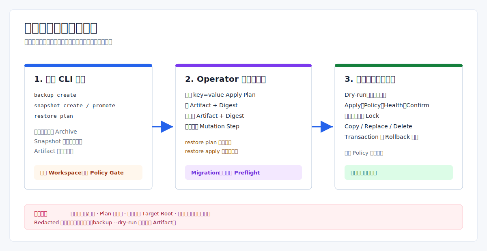

# 备份、迁移、快照与恢复：当前实现边界

> Language: 简体中文
>
> English default entry: [English](../../en/operations/backup-migration-release-snapshot.md)
>
> Translation status: current

更新时间：2026-07-14

## 文档范围

当前 backup/snapshot CLI 是基于合成条目的 contract/smoke 边界。`restore apply/rollback` 则在 evidence、policy、lock、health 和 confirmation 全部通过后，具备真实的本地 staged file mutation 能力。migration package 仍只有 library-level preflight 模型。

本文只描述这些真实边界，不再把计划中的 artifact 管理能力写成生产备份实现。



## 能力矩阵

| 能力面 | 当前行为 | 关键限制 |
| --- | --- | --- |
| `backup create` | 构造、seal、存储并校验含 3 个合成条目的 artifact | 不读取或备份工作区 |
| `snapshot create` | 创建合成 backup 和内存 snapshot 报告 | snapshot 记录不持久化、不可查询 |
| `snapshot promote` | 再次创建合成 backup/snapshot，并返回 pointer plan | 永不移动 release pointer |
| `restore plan` | 创建合成 backup/snapshot evidence 和展示报告 | 不生成 restore apply 读取的文件 |
| `restore apply --dry-run` | 解析 operator-authored plan，校验两份 artifact/digest，生成 mutation preview | 不获取 restore lock，不修改目标 |
| `restore apply` | 全部门禁通过后执行声明的 copy/replace/delete | 可修改 plan 指定的绝对 target root |
| `restore rollback` | 根据 rollback-required transaction 逆序恢复已提交步骤 | 要求 transaction、hash 与 pre-restore evidence 全部匹配 |
| `MigrationPackageService` | 在内存构造 manifest 并检查 source-version preflight | 没有 migration package CLI、持久化、签名或 apply engine |

## 合成 Backup 行为

CLI 当前不读取项目文件，而是构造三个固定条目：

```text
config/eva.yaml                         -> "runtime: in_memory_v1.0"
config/adapters/hardware/scale-main.yaml -> "enabled: false"
state/release-pointer                   -> project_id bytes（标记 redacted）
```

```powershell
cargo run -q -- backup create --output json
cargo run -q -- backup create --artifact-store .eva/artifacts --output json
```

未传 `--artifact-store` 时，artifact 只存在于该命令的内存 store；传入 filesystem store 后，sealed bytes 与通用 artifact metadata 会写盘。重复使用 artifact ID 会覆盖 filesystem record，不存在不可变的 point-in-time catalog。

当前 `BackupManifest` 只包含 artifact ID/type、request ID、generation、project ID、entry metadata、digest、archive metadata 和 audit 字符串。manifest 会出现在命令报告中，但不会作为可独立查询的 backup record 持久化。

当前安全限制：

- `--dry-run` 只标记 plan，仍会创建并存储 artifact。
- 条目的 `redacted` 只是 metadata，entry bytes 仍写入 sealed archive。
- 默认签名和 `--encrypt` 使用硬编码 local-development key。
- encryption 是开发用途 XOR stream，不是生产密码学实现。
- remote backup target 只存在于 library manifest metadata，不会上传。
- `backup create`、`snapshot create` 和 `snapshot promote` 不调用 runtime policy gate；operator 指定的 artifact store 可以在没有 `backup.create` policy 批准的情况下被写入。
- 没有 backup list、restore、delete、expiry、retention、GC 或 remote transfer CLI。

不能用该命令证明真实项目状态、secret、database、event log 或 release pointer 已完成备份。

## Migration Package 边界

`MigrationPackageService` 当前只建模：

- package/source/target version 字符串；
- 受影响的 state section；
- reversible/irreversible metadata；
- 内存 source-version preflight 结果。

它不会 build/import archive，不计算生产 checksum/signature，不持久化 package，不执行 migration，也没有 CLI。`release migration` 输出的是发布指导，不是 migration package apply 命令。

## Snapshot 边界

```powershell
cargo run -q -- snapshot create --snapshot-id snapshot-doc --artifact-store .eva/artifacts --output json
cargo run -q -- snapshot promote --snapshot-id snapshot-doc --confirm snapshot-doc --artifact-store .eva/artifacts --output json
```

两个命令都会在本次调用中重新创建合成 backup。snapshot 是带固定 healthy evidence 的内存报告，不会从 snapshot registry 加载，也不会保存到 registry。

`snapshot promote` 在判断 `--confirm` 前就会写 `backup-for-<snapshot-id>`；确认值不匹配也可能写入或覆盖 artifact。确认成功仍返回 `apply_allowed:false`，release pointer 不变。

当前 CLI 没有 snapshot list/get/compare/status，snapshot 也不会捕获真实 binary digest、配置 digest、runtime state、event watermark 或 provider state。

## Restore Plan Contract

`restore plan` 只输出合成诊断报告：

```powershell
cargo run -q -- restore plan --snapshot-id snapshot-doc --artifact-store .eva/artifacts --output json
```

它不会生成 `restore apply` 要求的严格 plan 文件。该文件必须来自受审计的 operator/release 流程，使用 `key=value`：

```text
plan_id=plan-restore-1
backup_artifact_id=backup-for-restore
backup_digest=sha256:<hex>
pre_restore_backup_artifact_id=pre-restore-plan-restore-1
pre_restore_backup_digest=sha256:<hex>
restore_target_root=<target-root>
mutation_step=copy|config/eva.yaml|backup/source-key|sha256:<new>|none|file
```

每个 `mutation_step` 固定包含六段：

```text
operation|relative_path|source_artifact_key|expected_digest|pre_restore_digest|target_kind
```

operation 支持 copy、replace、delete。copy 要求 source artifact key 和 expected digest，但不能带 pre-restore digest；replace 三项都需要；delete 要求 pre-restore digest，但不能带 source artifact key 或 expected digest。可选空字段使用 `none`、`null`、`-` 或空段。

## Dry-Run、Apply 与 Rollback

先校验独立生成的 plan：

```powershell
cargo run -q -- restore apply --dry-run --plan <plan-file> --confirm <plan-id> --artifact-store <artifact-dir> --lock-store <lock-dir> --output json
```

dry-run 校验主 artifact 与 pre-restore artifact digest，要求 confirmation 匹配，拒绝非法 relative path 和在 plan 中声明为 `symlink` 的 target，并返回 affected paths、preflight hash 与 rollback manifest。因为不会执行 mutation，它不检查目标路径中已经存在的 symlink component，也不会校验独立持久化的 BackupManifest 或生产签名；apply 与 rollback 会在变更前拒绝这些 symlink component。

非 dry-run apply 还要求：

- `runtime_policy.allow_high_risk_actions` 包含 `restore.apply`；
- health 输入为 healthy；
- 成功创建新 filesystem lock；
- 所有 source artifact 与 expected/current digest 一致；
- plan 包含有效 mutation step，才会修改目标。

仓库默认 policy 不允许 `restore.apply`，因此 mutation 默认被拒绝。获得授权后，copy/replace 使用临时文件再 rename，delete 直接删除目标；engine 写普通文本 transaction log，部分失败会返回 `rollback_required`。

rollback 复用 `restore.apply` policy action。它只接受 rollback-required transaction，校验 plan/transaction 身份和 current digest drift，再根据 pre-restore evidence 逆序恢复已提交步骤。transaction/rollback log 是本地文本文件，不是 signed/tamper-proof journal。

## 路径与信任边界

- Mutation path 必须是相对路径并拒绝 traversal。Plan parsing 会拒绝 `target_kind=symlink`；apply 与 rollback 还会拒绝目标路径中已存在的 symlink component。
- `restore_target_root` 本身可以是绝对路径；当前代码不限制在 Eva workspace 内。
- Confirmation 只证明输入字符串与 `plan_id` 一致，plan 文件没有签名。
- Artifact digest 只证明 store record 字节一致，不证明 plan 或 artifact 的作者身份。
- 加密 CLI backup 没有对应的 CLI 解密参数，不能直接作为 pre-restore plaintext archive 使用。

plan authoring、target-root 批准、artifact provenance 和 policy 审核都仍是外部 operator 职责。

## 尚未实现

当前代码不提供真实 workspace backup selection、database backup、secret/KMS 集成、生产签名/加密、不可变 artifact 历史、retention、远程上传下载、migration apply、持久化 snapshot comparison 或 snapshot-backed 自动 restore/upgrade orchestration。

## 相关资料

- [Eva-CLI 使用手册](../guide/Eva-CLI使用手册.md)
- [进程升级与恢复边界](进程级停机升级架构方案.md)
- [项目配置](项目配置方案.md)
