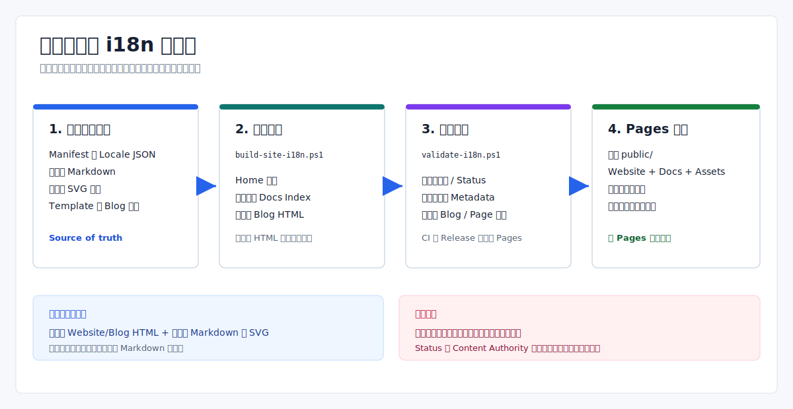

# 网站与文档多语言运维

> Language: 简体中文
>
> English default entry: [English](../../en/operations/website-docs-i18n.md)
>
> Translation status: current

更新时间：2026-07-14

## 当前模型

- `en` 是已启用的默认公开 locale；`zh-CN` 是已启用的本地化 locale，也是多份技术文档当前的详细内容事实源。
- Website HTML 在构建期生成并提交；Markdown 文档和内容型 SVG 仍是源文件，build 不会翻译或重新生成它们。
- `/` 是英文首页，`/zh-CN/` 是中文首页，`/docs/` 是唯一生成的英文文档索引。
- Markdown 发布在 `/docs/en/...` 和 `/docs/zh-CN/...`；博客发布在 `/blog/...` 和 `/zh-CN/blog/...`。
- 公开产物是静态 HTML、Markdown 和 assets。



## 源文件职责

| 来源 | 负责内容 | 是否生成 |
| --- | --- | --- |
| `docs/_i18n/manifest.json` | locale registry、稳定文档 ID/路径/status、asset mapping、authority/coverage metadata | 否 |
| `docs/_i18n/glossary.json` | 人工维护的共享术语 | 否；当前脚本不消费它 |
| `docs/en/`、`docs/zh-CN/` | 发布的 Markdown 内容 | 否 |
| `docs/assets/` 与根 `assets/` | 内容图和共享视觉资源 | 否 |
| `website/_templates/` | 首页、文档索引和博客页面结构 | 否 |
| `website/_i18n/<locale>.json` | Website UI 文案和文档卡片 | 否 |
| `website/_blog/posts.json` | 博客 category/post metadata、locale、slug、内容路径 | 否 |
| `website/_blog/content/<locale>/` | 本地化博客正文 HTML | 否 |
| `website/index.html`、`website/<locale>/`、`website/docs/index.html`、`website/blog/` | 生成的站点页面 | 是；不直接手改 |

生成 HTML 有问题时，应修改 template、locale JSON、manifest、blog metadata 或 blog source，再重新构建。

## Manifest Contract

每份发布文档有稳定 `id`、英文 `source`、本地化 `translations` 和每语言 `status`。技术文档还可以声明 `contentAuthority` 与 `sourceCoverage`。

支持的 status：

| Status | 维护含义 |
| --- | --- |
| `current` | 维护者确认 source 与 translation 已同步 |
| `needs-review` | 文件存在，但需要复核 |
| `stale` | 文件存在，但已知落后 |
| `partial` | 文件有意只覆盖 source 的一部分 |
| `missing` | 没有登记本地化文件 |

validator 会检查 status 值是否合法，以及所有非 missing 路径是否存在；不会比较内容、时间戳、Git 历史或语义一致性，因此 freshness 仍需人工负责。

当前文档 fallback 有一个重要限制：build 的 path resolver 不读取 status。translation path 缺失时可能回退英文 source，docs index 仍会生成 locale link。因此 `missing` 只是 metadata，不保证文档 `hreflang` 或 fallback 行为正确。

`contentAuthority`、`sourceCoverage`、locale coverage、BCP 47 合规和 glossary 使用都是维护 contract，当前 validator 没有完整强制。

## 本地化 Assets

包含可读语言文本的 asset 登记在 manifest `assets` 数组：

```json
{
  "id": "example-diagram",
  "source": "docs/assets/example.svg",
  "translations": {
    "zh-CN": "docs/assets/example.zh-CN.svg"
  },
  "status": {
    "zh-CN": "current"
  }
}
```

validator 会检查已登记 path/status，但不会扫描仓库找出未登记的文字图片。Website 首页当前会按 locale 解析已登记的 architecture diagram；其他 Markdown 页面直接引用对应本地化 asset。

命令、JSON key、Topic 名称、Lua binding、文件路径、status 和错误码不翻译。glossary 当前只是人工指导，不会由 build 自动改写或校验文档术语。

## 构建流水线

从仓库根目录按顺序运行：

```powershell
.\scripts\build-site-i18n.ps1
.\scripts\validate-i18n.ps1
```

build 读取 manifest、已启用 locale JSON、5 个 template、blog metadata 和 blog content，写入：

- `website/index.html` 与 `website/<非默认 locale>/index.html`；
- 唯一的 `website/docs/index.html` 英文文档索引；
- 本地化 blog index、category 和 post 页面。

它不会生成 Markdown、翻译内容、优化 asset，也不会组装最终 Pages artifact。生成 HTML 已被 Git 跟踪，因此每次 build 后都要 review `git diff -- website`。

## 校验边界

`validate-i18n.ps1` 当前检查：

- 已启用 locale 定义与 locale JSON 必需 section；
- 生成首页、选定 link、canonical/hreflang marker、Giscus 设置、进度和博客 section；
- 已登记 document/asset status 与 path 是否存在；
- 每个首页实际引用本地化 architecture image；
- `website/docs/` 只包含生成的 `index.html`；
- blog ID、category、locale/slug 唯一性、content path、date、生成页面和部分 canonical/hreflang。

它不是通用 Markdown dead-link checker、完整 HTML validator、asset registration scanner、BCP 47 validator、翻译 freshness checker 或全站 canonical/hreflang verifier。

## CI 与 Pages 发布

| Workflow | 行为 |
| --- | --- |
| CI | `main`/`master` push、pull request 或手动运行时构建本地化页面并校验 i18n；不部署 |
| Release | 为 release evidence 再次 build/validate；不部署 Pages |
| Pages | `main`/`master` 的匹配路径发生变更或手动运行时，build、validate、组装 `public/`、upload 并 deploy |

Pages job 会复制生成的 `website/`、`docs/README.md`、`docs/en/`、`docs/zh-CN/`、`docs/assets/` 和根 `assets/`。随后删除内部 template/locale/blog source 目录与 `docs/zh-CN/legacy`，写 `.nojekyll` 和 `CNAME`，并在 upload 前拒绝 symlink 与 hard link。

## 变更 Checklist

修改文档或含文字 asset：

1. 同步两种 locale source，或设置真实的非 current status。
2. 保持稳定 document/asset ID；文件移动时更新 manifest path。
3. 入口变化时更新文档索引或 Website document card。
4. 登记本地化 SVG/image 变体。
5. build、validate、review 生成 HTML，并对变更 Markdown 做本地链接检查。

修改博客：

1. 更新 `posts.json` metadata 与本地化 content file。
2. 保证 locale slug 唯一、content path 有效。
3. build 并复核每个 locale/category/post 生成页。

删除内容：

- 只删除某个 locale 时，只移除实际不存在的路径，并诚实更新 manifest；
- 删除整份文档/asset 时，移除两种 locale 文件、manifest、index/card 和入站链接；
- build 不会清理所有 stale output path，需要手动删除过时 blog/locale/category 生成目录；
- 最终检查 Pages artifact 不再包含被删除内容。

## 已知限制

- 当前只启用英文与简体中文。
- Translation status 和 authority metadata 不会自动推导。
- 缺失文档翻译可能回退英文，且没有 status-aware `hreflang` 处理。
- 被删除的生成目录不会被完整 GC。
- 没有内置全站 dead-link、Markdown rendering、accessibility 或 visual regression pass。

## 相关资料

- [中文文档入口](../中文文档入口.md)
- [Website 源码说明](../../../website/README.md)
- [Eva-CLI 使用手册](../guide/Eva-CLI使用手册.md)
