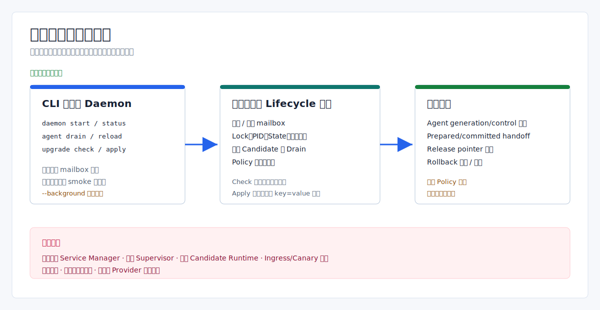

# 进程升级与恢复：当前实现边界

> Language: 简体中文
>
> English default entry: [English](../../en/operations/process-level-upgrade.md)
>
> Translation status: current

更新时间：2026-07-20

## 文档范围

Eva-CLI 当前提供前台/后台 daemon 边界、durable task/recovery 诊断、generation/drain 原语、受 policy 保护的本地 handoff 状态机、host-bound service lifecycle 命令，以及绑定 identity 的隐藏 direct daemon service entrypoint。该入口代码本身并不证明真实 host stop/boot/reboot 恢复、destructive lifecycle harness、production gate、两个真实 Runtime 进程或流量切换。

本文只描述已实现的本地 contract，并把生产目标边界明确列为缺口。



## 已实现能力

| 能力面 | 当前行为 | 不包含 |
| --- | --- | --- |
| `daemon start` | 获取 fenced daemon/writer lease，打开 durable PID/state，执行 recovery、observability、memory maintenance 和前台或 parent/child 后台控制循环 | 启动 provider 进程或认证 OS service 恢复 |
| daemon control | 通过文件系统 request/response mailbox 执行控制操作，并校验 fresh lease、live OS-lock owner 和完整 PID identity | 网络控制面认证或后台服务监督 |
| Agent drain/reload | 返回本地计划，或写 daemon-side Agent generation/control state | 重启 Agent/provider 进程或重读配置/脚本 |
| lifecycle library | 建模内存 generation promotion、drain、rollback、apply lock 和 handoff evidence | 监督 OS 子进程或切换真实入口流量 |
| `upgrade check` | 构造内存 readiness、migration、drain 和 rollback 报告 | 启动 candidate Runtime 或写 apply plan 文件 |
| `upgrade apply` | 获取文件锁，并可在门禁后写本地 handoff/pointer state | 平台 service-manager 激活或真实蓝绿部署 |
| `service install/status/start/stop/restart/uninstall` | 加载 typed 项目配置并调用 host-bound Windows Service、systemd 或 launchd Adapter；生产 definition 绑定规范化 direct-entry argv identity，Fake 必须显式传 `--dev` | 替代受控真实 host lifecycle/reboot evidence 或执行 blue-green handoff |

## Daemon 进程模式

默认路径由 `runtime.data_dir` 派生，仓库示例使用：

```text
.eva/data/durable
.eva/data/daemon/state
.eva/data/daemon/locks
.eva/data/daemon/pids
.eva/data/observability
```

默认命令是一次性 smoke：启动、验证边界、shutdown，删除 PID projection，将 `daemon.lease` 标为 released，并保留未持锁的固定 `daemon.lock` anchor：

```powershell
cargo run -q -- daemon start --foreground --dev --output json
```

使用 `--no-shutdown-after-smoke` 才会让同一个 CLI 进程保持 mailbox loop。`--background` 使用独立 parent/child startup handshake；service entrypoint 不走该路径，也不会再 spawn 第二个 daemon。

```powershell
# 终端 A
cargo run -q -- daemon start --foreground --dev --no-shutdown-after-smoke --output json

# 终端 B
cargo run -q -- daemon status --output json
cargo run -q -- daemon submit --task req-upgrade-doc --output json
cargo run -q -- daemon shutdown --output json
```

`provider_processes_started` 始终为 `false`。status 要求 running state、版本化 PID/process-token/generation projection、fresh active lease 与固定 anchor 上的 live OS lock 全部一致。control loop 会周期续租 heartbeat；live owner 即使过期也绝不被抢占，dead-but-unexpired owner 必须等待 TTL，dead+expired owner 由更高 durable writer generation 原子接管。损坏或 legacy ownership metadata 会 fail closed。direct service-entry 代码契约已经实现；经过真实验证的机器重启恢复仍是独立生产证据。

daemon 启动时会扫描 durable task/provider snapshot、标记 interrupted work 并写本地 evidence。只有使用 `--no-shutdown-after-smoke` 保持持久 mailbox loop 时，它才会执行到期 scheduler retry dispatch。durable event 当前是文件记录，不是具备 fsync、segment 和 compaction 保证的生产 WAL。basic 示例仍使用 `InMemoryEventBus`，除非命令显式选择 durable 路径。

## Direct Service Entrypoint

对于 production service-manager kind，`eva service install` 会构造包含 executable、
native argv、working directory、service kind/name 与稳定 identity digest 的规范化
definition。manager 调用隐藏的 `daemon __service-entry` 命令；该命令重新加载项目配置，
校验 host kind/name/digest，并直接获取 daemon PID 与 lease。

Windows 进入 SCM dispatcher；systemd/launchd host 安装 Unix signal handler。stop、
shutdown 与 preshutdown callback 只设置 atomic token。daemon loop 观察 token 后提交与
control mailbox 相同的 generation-bound `Shutdown` request，因此 task admission 关闭、
drain evidence 持久化、stopped state 写入、PID 删除与 lease 释放均走同一事务。

这些属于代码与本地测试 contract。生产验收仍需要受控 Windows SCM/systemd/launchd
stop/boot/reboot transcript、destructive lifecycle harness 的 mandatory cleanup，以及
消费这些 artifact 的 release gate。

## Upgrade Check 只做诊断

```powershell
cargo run -q -- upgrade check --output json
```

`upgrade check` 只创建内存 candidate 和固定 migration/drain/rollback evidence。它不会启动进程、捕获真实备份、检查真实 Ingress Gate，也不会生成 `upgrade apply` 读取的文件。

apply 命令读取另一份严格 `key=value` 文件，且只包含以下字段：

```text
plan_id=plan-upgrade-1
from_generation=gen-current
to_generation=gen-next
from_release=1.11.4-alpha
to_release=1.11.5-alpha
```

该文件必须来自受审计的 operator/release 流程，不能把 `upgrade check` 输出直接作为 apply plan。

## Upgrade Apply 流程

最小命令形态：

```powershell
cargo run -q -- upgrade apply --plan <plan-file> --confirm <plan-id> --lock-store <lock-dir> --output json
```

执行顺序：

1. 解析 plan，并要求 `--confirm` 与 `plan_id` 一致。
2. 加载项目配置，计算 `supervisor.handoff` 和 `release.pointer_mutation` policy decision。
3. 用 `create_new` 语义创建持久文件锁。
4. 未传 `--state-store` 时停在 lock-only evidence，`apply_allowed:false`。
5. 传入 `--state-store` 后，必须先通过两项 policy 才进入本地 handoff。
6. 传入 `--runtime-binary` 时，实际执行该文件的 `--version`，超时 5 秒；未传时使用 simulated-ready probe。
7. 已授权 handoff 进入 binary/health 评估后写 `handoff.prepared`。
8. binary、health、内存 candidate 和 drain 全部通过后，才写 `state/release-pointer` 与 `handoff.committed`。

仓库默认 policy 没有 `runtime_policy.allow_high_risk_actions`，因此 state-store handoff 默认被拒绝。受审计 policy 必须同时允许 `supervisor.handoff` 和 `release.pointer_mutation`。后续 policy/handoff 失败时，lock 可能已经创建。

policy 通过后，如果 binary probe 或 health 失败，仍可能写 prepared handoff 与 rollback evidence，但不会提交 release pointer。这条路径中的 candidate start、health、promotion 和 drain 都是内存模型，不会启动 candidate Runtime 进程。

## 当前恢复与回滚证据

- `agent drain/reload` 连接运行中的 daemon 后可以持久化 `agent-control.state`。
- daemon recovery scanner 会分类 interrupted task/provider snapshot，但不会重放非幂等 provider 副作用。
- `upgrade apply` 只在传入的 state store 中保留本地 prepared/committed report 和 pointer mutation。
- rollback 对象是 plan/evidence；当前没有 CLI 命令重新激活旧 OS-managed Runtime service。
- 损坏或 legacy lease/anchor metadata 需要 operator 显式检查；格式有效的 dead+expired daemon lease 会在下次 claim 时原子接管。

## 尚未实现

当前代码不提供：

- 受控真实 host service/PID identity 与 stop/boot/reboot recovery evidence；
- destructive 平台 lifecycle harness 与 production service release gate；
- 持久 Supervisor 进程或 `SupervisorRecoveryGuard`；
- task/worker heartbeat、control epoch、PID reattach 或自动子进程重启；
- 两个真实 Runtime 进程、canary、Ingress Gate 或 session routing；
- snapshot-backed 自动升级/回滚；
- 生产 provider 进程监督；
- exactly-once 副作用、跨机器 failover 或生产 event WAL。

`service_manager.kind: fake` 会在每次 CLI 调用时新建进程内 Adapter，并在项目/服务隔离的 `.eva/service-manager` 开发状态文件中通过排他锁和原子写入恢复、保存状态。这支持可重复的开发 lifecycle smoke，但不是生产 evidence 或平台集成。生产 Adapter、CLI 命令和 direct entrypoint 代码已实现；真实平台 transcript 与 destructive cleanup evidence 仍需独立取得。

## Operator 规则

- 把 `upgrade check` 当作诊断，不当作批准或 apply artifact。
- 独立核对 plan、confirm token、policy、lock store、state store、runtime binary 和 health 输入。
- 测试本地 handoff 时使用一次性 state/lock root。
- 重试前检查 prepared/committed 文件和 release pointer。
- 未查清 lock 来源前，不要只为继续执行而删除 lock。
- destructive host evidence 与 production service gate 完成前，在 Eva-CLI 之外维护真实平台 rollback 流程。

## 相关资料

- [Eva-CLI 使用手册](../guide/Eva-CLI使用手册.md)
- [备份、快照与恢复边界](备份迁移包与ReleaseSnapshot架构方案.md)
- [项目配置](项目配置方案.md)
