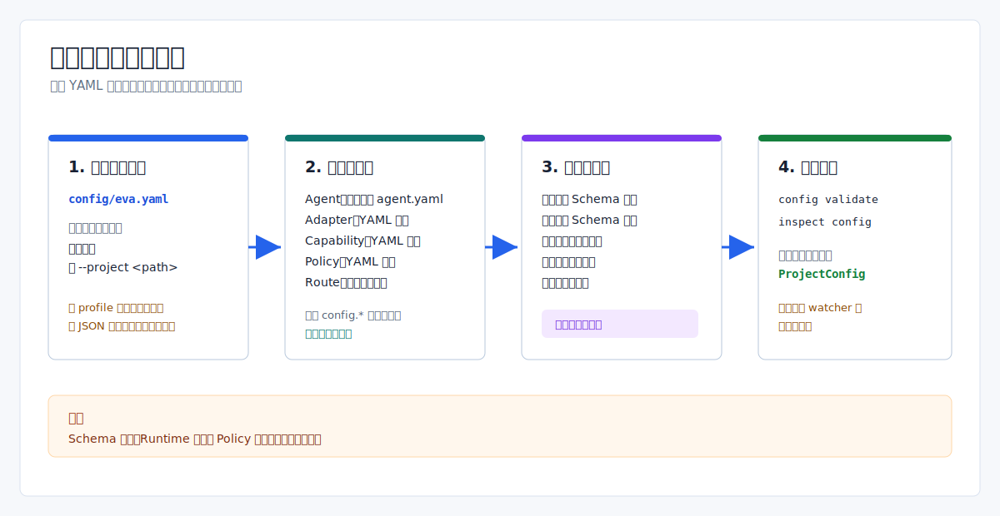

# 项目配置：当前加载与校验边界

> Language: 简体中文
>
> English default entry: [English](../../en/operations/project-configuration.md)
>
> Translation status: current

更新时间：2026-07-14

## 文档范围

本文只描述当前 `eva-config` loader 和 CLI 实际读取、校验与暴露的配置，不再把目标态配置设计写成现有能力。

Eva 使用 YAML 维护项目配置，使用 JSON Schema 的受支持子集做校验，CLI 与运行时协议使用 JSON。项目入口固定为 `<project>/config/eva.yaml`；当前不会发现 `eva.json`、profile、用户级配置，也没有通用的环境变量/CLI 覆盖链。



## 加载范围

项目根来自当前目录或 `--project <path>`。`eva.yaml` 中的所有 `config.*` 路径都相对项目根解析，不相对 `runtime.workspace` 解析。

| 来源 | 发现规则 | 当前职责 |
| --- | --- | --- |
| `config/eva.yaml` | 固定文件名 | 强类型 runtime/observability/service-manager 字段、拆分配置根和扩展 mapping |
| `config/agents/**/agent.yaml` | 递归查找固定文件名 | Agent 身份、脚本、订阅和核心权限 |
| Adapter 目录 | 递归查找 `.yaml`/`.yml` | Adapter 身份、transport、capability 和 transport 扩展 |
| Capability 目录 | 递归查找 `.yaml`/`.yml` | Capability 身份、kind、provider 与 provider 权限 |
| Policy 目录 | 递归查找 `.yaml`/`.yml` | 非空 policy domain mapping；语义执行归 `eva-policy` |
| `config/routes/topics.yaml` | 单个已配置文件 | 有序的 `fanout`/`compete` Topic route |
| Schema 目录 | 六个固定文件名 | `eva`、`agent`、`adapter`、`capability`、`policy`、`routes` schema |

仓库示例当前加载 4 个已启用 Agent、5 个 Adapter（4 个启用）、3 个已启用 Capability、5 份 Policy 和 4 条 route。

## 强类型与扩展边界

被 YAML 和 schema 接受的字段，不一定都由 `eva-config` 强类型解释。

| 文件 | 当前强类型字段 | 保留或下游解释 |
| --- | --- | --- |
| `eva.yaml` | `runtime`、`observability`、可选 `service_manager`、`config` roots | 其他顶层 mapping 写入 `EvaConfig.extra` |
| Agent | `id`、`enabled`、`parent`、`children`、`script`、`script_version`、`subscriptions`、emit/tools/Adapter 权限 | inbox、timeout、state、constraints、memory、knowledge 等仍是扩展 |
| Adapter | `id`、`name`、`version`、`enabled`、`transport`、capabilities | transport 细节保留为扩展；hardware 另有强类型解析器 |
| Capability | 身份、kind、公开 capability、默认/指定 provider、Adapter 权限引用 | 输入输出 schema 与执行细节仍是扩展 |
| Policy | 非空 mapping 和非空字符串 domain key | policy-gated 操作执行时由 `eva-policy` 解析支持的 domain |
| Routes | pattern、delivery mode、目标 Agent ID | 不接受扩展字段；route schema 会拒绝未知属性 |

扩展字段存在不代表当前运行时已经消费它。例如 `process`、`eventbus`、`upgrade` 仍是主配置扩展；`runtime.hot_reload` 当前只是被解析和展示的布尔值，不是文件 watcher 开关。

`eva-config` 不读取 `constraints.md`；`constraints.file` 只会作为 Agent 扩展数据保留，除非下游 consumer 显式读取该文件。

## 校验流程

`load_project_config` 按以下顺序执行：

1. 规范化已存在的项目目录并定位 `config/eva.yaml`。
2. 先把 `eva.yaml` 反序列化并规范化为强类型主配置，以便相对项目根解析六个拆分配置 root。
3. 发现 Agent、Adapter、Capability 和 Policy YAML，并把已配置的 route 文件加入校验集合。
4. 用对应 schema 校验 `eva.yaml` 和所有已发现的 YAML 文件。
5. 把拆分 manifest 解析为 Rust 强类型结构，并保留扩展 mapping。
6. 执行跨文件校验，返回统一的 `ProjectConfig`。

内置 schema evaluator 不是完整 JSON Schema 引擎。它只实现 `type`、`enum`、两种受支持的 `pattern`、`minProperties`、`required`、`properties`、通过 `additionalProperties: false` 拒绝未知字段，以及 `items`；不会计算 schema 形式的 `additionalProperties`，也不支持通用 `$ref`、schema 组合、任意正则、数值上下界或默认值注入。

当前跨文件校验包括：

- 配置 root 和必需文件存在；
- Agent、Adapter、Capability ID 唯一；
- Agent parent/child 引用和 route 目标 Agent 存在；
- Agent 脚本存在；
- Agent Adapter 权限引用已声明 provider/capability；
- hardware Adapter 强类型字段有效；
- Capability provider 引用已声明 Adapter。

当前不会证明 parent/child 双向一致，不会检查环境变量是否真的存在，不会把所有路径限制在 `runtime.workspace`，也不会评估 MCP allowlist 宽度、所有 Skill 扩展或 timeout/concurrency 与全部 policy domain 的关系。

## 运维命令

从仓库根目录执行：

```powershell
cargo run -q -- config validate --project .
cargo run -q -- config validate --project . --output json
cargo run -q -- inspect config --project . --output json
```

`config validate` 返回项目/配置路径、environment、`hot_reload` 标记、对象数量和 schema 路径。成功退出码为 `0`；配置或 schema 错误退出码为 `2`，在 JSON 输出已确定时会带结构化 context。

`inspect config` 属于 `inspect` 命令，不是 `config` 子命令。当前多个 inspect topic alias 都返回同一份完整项目报告；不存在 `config inspect`、`config dump-effective`、profile 命令或 provenance 报告。

## 修改配置

修改 YAML 或 schema 后执行：

1. 运行 `config validate` 并修复 schema/跨文件错误。
2. 用 `inspect config` 检查加载后的项目摘要。
3. 重启或重建真正消费该配置的 runtime 边界。
4. 验证受影响的命令或运行路径。

当前没有配置文件 watcher，也没有自动 RouteTable 替换。`agent reload` 只生成本地计划或 daemon-side generation/control-state evidence；它不会重读全部 YAML、替换 Topic route 或自动重启 provider。Lua shadow-load 原语独立存在，但尚未接入通用配置 reload 流程。

## 安全规则

- 只保存 credential 环境变量名，不保存 API key 或 token 明文。
- executable 与参数分字段声明，不嵌入 shell 片段。
- 把 `permissions`、allowlist、endpoint 和 hardware match 视为安全敏感变更。
- 运行外部 Adapter、MCP、Skill、hardware、restore 或 upgrade 前先校验配置。
- schema 接受与 policy 授权是两次独立判断。

仓库内配置只用于开发示例。`service_manager.kind: fake`、禁用的硬件、simulator driver、本地路径和本地 observability 默认值都不是生产部署证据。

## 相关资料

- [配置目录说明](../../../config/README.md)
- [Eva-CLI 使用手册](../guide/Eva-CLI使用手册.md)
- [进程升级与恢复边界](进程级停机升级架构方案.md)
