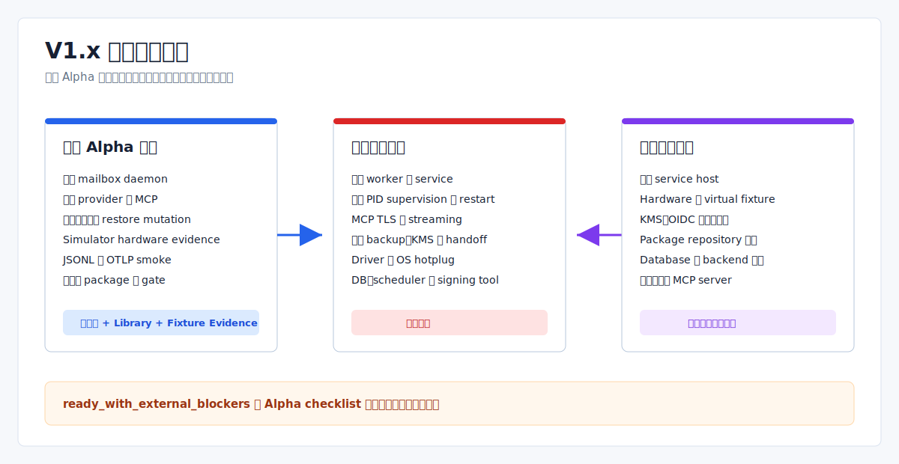

# V1.x 未完整实现功能清单

> Language: 简体中文
>
> English default entry: [English](../../en/planning/v1.x-incomplete-feature-inventory.md)
>
> Translation status: current

更新时间：2026-07-14

## 文档范围

本文是基于当前 `main` 代码的能力快照，用于区分 CLI 可调用行为、只存在于 library/test 的边界、alpha smoke 证据、缺失的生产集成和外部前置条件。它不是 changelog，也不会把内部 capability marker 解释成已发布版本。

已完成的实施历史归 release notes、tag 和 Git 历史维护。配套的[实施计划](V1.x真实运行时能力补齐实施计划.md)只保留剩余工作和依赖顺序。

## 版本与证据语义

| 信号 | 当前事实 | 不能证明 |
| --- | --- | --- |
| Cargo 与 CLI 版本 | `1.11.5-alpha` / `V1.11.5-alpha` | 已达到生产就绪 |
| Git tag | tag 到 `v1.11.5-alpha` 为止；不存在 `v1.12` 至 `v1.17` release tag | 后续内部 marker 是已发布版本 |
| `version.data.runtime_mode` | 包含直到 `v1x_closure_gate_v1.17.6` 的 capability/evidence ID | 语义版本序列或发布历史 |
| `release check` | 默认输入下返回 `status:"ready"`、一个 warning gate 和 `closure.status:"ready_with_external_blockers"` | 命令现场执行了 Cargo/CI、外部服务、平台集成或生产凭据检查 |
| 生产状态 | 仓库仍是带受控本地边界的 alpha 实现 | 生产 daemon、平台、硬件、遥测或分发已经就绪 |

`runtime_mode`、release gate 和源码标识中的 V1.12-V1.17 标签，是 `v1.11.5-alpha` tag 之后加入的 legacy 内部 evidence ID。它们为兼容性继续保留，但不能描述为已经发布的版本。



## 状态口径

| 状态 | 含义 |
| --- | --- |
| 可调用 | 当前 CLI/runtime 路径会在文档边界内执行该行为 |
| Library/Test 边界 | 代码与测试存在，但生产 runtime 或 CLI 没有端到端接线 |
| 受控 Alpha | 路径仍是本地、合成、模拟、fake、fixture 或 smoke-only |
| 未实现 | 所需实现不存在 |
| 外部前置条件 | 仍需要硬件、凭据、仓库权限、平台测试设施或运维后端 |

安全拒绝不是未实现功能。例如拒绝未授权 provider、MCP tool、Lua host handle 或 hardware raw handle，是已实现的安全不变量，不属于 backlog。

## 当前缺口矩阵

| 能力域 | 当前代码边界 | 剩余生产缺口 | 优先级 |
| --- | --- | --- | --- |
| Release evidence | `release check` 已逐 gate 区分 declaration/fixture/measurement，静态 performance budget 不再伪造 observation；统一 manifest 可校验提交和 subject，但 legacy 文件仍仅是 alpha declaration | 用真实 argv capture 和受信 CI/platform runner 生成 measurement，并补 coverage、freshness 与 executor policy | P0 |
| Runtime、Task 与 Scheduler | 前台 daemon、文件 mailbox、durable task/event/provider snapshot、启动恢复分类、retry routing/ACK evidence 和 daemon-side Agent control state | 后台服务、真实 task/Agent worker 消费、heartbeat/liveness、stale-lock 修复、开机恢复和副作用恢复 | P0 |
| Provider 与 Capability 执行 | 每次调用启动的 stdio/MCP subprocess runner、支持 process 或合成结果的 Skill runner、明文 HTTP、allowlist、admission limit、脱敏、合成 supervisor slot 和 durable process-table evidence | 支持 TLS 的 Provider HTTP client、使用真实 PID 的长驻 OS process supervision、kill/restart、跨进程 admission、用户隔离、credential vault 和 restart policy | P0 |
| MCP | Stdio 与 `http://` JSON-RPC、tool allowlist、timeout/output limit、session cleanup 和静态 compatibility fixture | HTTPS/TLS、生产 Streamable HTTP/SSE transport、streaming 数据面、外部 server compatibility 实跑和 daemon supervision | P0 |
| Backup、Snapshot 与 Restore | 三条合成记录的 backup CLI、内存 snapshot 报告，以及真实 plan-gated 本地 copy/replace/delete 与 rollback | 真实项目/数据选择、持久 snapshot catalog、生产签名/加密/KMS、远程灾备、可信 plan 生成和 target-root policy | P0 |
| Upgrade 与 Service Manager | 本地 lock/state/pointer 文件、binary `--version` probe、内存 generation model、trait 和 fake service-manager Adapter | Windows Service/systemd/launchd Adapter、真实 candidate Runtime、流量切换、drain、重启恢复和 OS rollback | P0 |
| Durable Storage | 文件 EventLog、task/audit/artifact/provider record、redrive 与 recovery diagnostics | 跨进程事务存储、生产 WAL/compaction、所有 writer 的 ownership/lock，以及非幂等副作用恢复 | P0 |
| Config 与 Discovery | 固定 `config/eva.yaml`、拆分 YAML root、有限 schema evaluator、manifest/marker projection、source report 和单命令 cache | profile/user/env merge、文件 watcher、原子 live route/config 替换、PATH 探测、真实 registry protocol/auth 和持久 TTL cache | P1 |
| Memory 与 Knowledge | durable file API、lock、TTL GC、rebuild checkpoint、一次性 daemon maintenance 和 provider-retrieval library test | 长驻 maintenance/retrieval 调度、生产数据管理/查询 API，以及从真实数据路径移除 CLI demo seed | P1 |
| Hardware | simulated driver、逻辑 lease、默认拒绝的 permission evidence、typed event 和一次性 manifest snapshot hotplug state | 真实 OS permission check、USB/serial/BLE/socket/vendor driver、OS hotplug watcher、raw I/O 与 release fixture | P1 |
| Observability | 部分 runtime 路径写 JSONL；tracing bridge、OTLP trace/metrics export 和 retention 有 smoke/test | Runtime-wide OTel lifecycle/flush、后台 retention、真实 database sink、运维 dashboard 和生产负载证据 | P1 |
| Distribution | 未签名 native archive、install smoke、checksum/provenance、GHCR Buildx provenance/SBOM 和可选 evidence parser | 签名/公证实现、attestation identity、Homebrew/Winget/Apt metadata 生成、仓库发布和上传后验证 | P1 |

## 外部前置条件

`release check` 当前输出以下五个 closure blocker。它们适合作为跟踪标签，但其中多项同时缺少实现代码。

| 报告中的 blocker | 外部输入 | 仍需实现的代码 |
| --- | --- | --- |
| `production_signing_attestation_credentials` | CI OIDC、KMS/HSM、签名与公证身份 | Credential provider、签名/公证、校验和 provenance 接线 |
| `homebrew_winget_apt_repository_credentials` | 仓库所有权和 publish token | Package metadata 生成、dry-run 校验、上传、重试与下载校验 |
| `platform_service_manager_test_environment` | 受控 Windows/Linux/macOS service host | 真实平台 Adapter 和 destructive lifecycle 集成测试 |
| `real_or_virtual_hardware_fixture` | 稳定的真实硬件或虚拟设备 fixture | 真实 driver、permission、I/O 和 OS hotplug 实现 |
| `production_database_sink_and_retention_scheduler` | Database 选型、凭据、schema 和运维策略 | Database sink 与长驻 retention/maintenance 调度 |

## 理解 `release check`

> `eva release check` 聚合编译进代码的 alpha checklist 声明和可选的 operator evidence file。它不会现场运行 Cargo 或 CI、连接外部服务、验证 OS 集成或确认生产凭据。`status:"ready"` 只表示当前输入下没有 required gate object 被标为 blocked，不代表生产就绪。

- 大部分 daemon、provider、service-manager abstraction、hardware、observability 和 JSON contract gate 是静态声明。
- MCP compatibility 使用字段预设为支持状态的仓库 fixture，不会运行外部 server。
- Artifact、distribution、scanner 和 benchmark 只有显式传入相应文件后才由 evidence 驱动。
- Gate evidence 中列出的命令是建议命令字符串，不是本次 `release check` 的执行日志。

## 已知风险

| 风险 | 当前行为 | 所需修正 |
| --- | --- | --- |
| 版本歧义 | 公开版本是 `1.11.5-alpha`，内部 ID 却使用 V1.12-V1.17 标签 | 在 CLI、release、website 和 planning 文案中持续明确区分 |
| 过时诊断 | `doctor` 仍把外部 Adapter 描述为 V0.3 placeholder | 按当前受控执行与不支持的 transport 更新 warning |
| Retry evidence | Scheduler retry 把事件路由到临时内存 mailbox，并在没有 Agent handler 消费时 ACK durable replay | 不把 routing/ACK evidence 当作 task execution；声明恢复前先增加有 owner 的 worker |
| Demo 数据变更 | `memory context` 每次调用都会写入 sample record，包括 durable 模式 | 把 example 与 operator 数据路径分离 |
| Restore 信任边界 | Plan 未签名，且可以指定绝对 target root | 扩大使用范围前增加可信 plan provenance 和显式 target-root policy |
| Gate 过度可信 | 静态 pass object 仍是 alpha declaration；performance budget 已标 unmeasured，production 已拒绝非 measurement，但真实命令 capture/coverage 尚未完成 | 由 W0 capture 记录 argv/outcome/digest，并对 production 强制 freshness、trusted executor 和完整 coverage |

## 验证入口

从仓库根目录执行：

```powershell
cargo run -q -- version --output json
cargo run -q -- release check --output json
cargo run -q -- doctor --output json
cargo test --workspace
./scripts/validate-cli-json-contracts.ps1
./scripts/validate-version-management.ps1
```

这些命令只证明本地代码与 contract 行为。平台 service、hardware、外部 MCP server、生产 telemetry、签名和仓库发布仍需要独立环境与证据。

## 维护规则

- 只有阅读 owning code path 和当前测试后才能更新矩阵。
- 不追加逐 commit 或逐 marker 完成日志；历史写入 release notes 和 Git。
- 将受控基线与生产缺口拆成两项，不再把混合状态写为 `Done`。
- 始终区分 release evidence、runtime 执行、library/test 边界和外部前置条件。
- 同一变更中同步两种 locale、本地化插图、website card 和 `docs/_i18n/manifest.json`。

## 相关资料

- [真实运行时能力补齐实施计划](V1.x真实运行时能力补齐实施计划.md)
- [进程升级与恢复边界](../operations/进程级停机升级架构方案.md)
- [备份、快照与恢复边界](../operations/备份迁移包与ReleaseSnapshot架构方案.md)
- [项目配置边界](../operations/项目配置方案.md)
- [项目发布方案](../release/项目发布方案.md)
- [版本管理方案](../release/版本管理方案.md)
