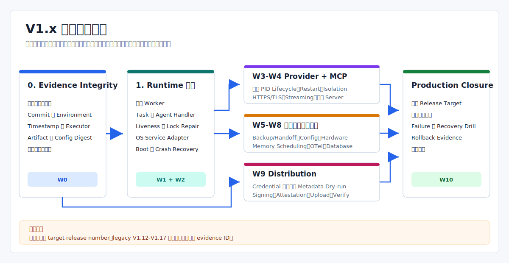

# V1.x 真实运行时能力补齐实施计划

> Language: 简体中文
>
> English default entry: [English](../../en/planning/v1.x-real-runtime-implementation-plan.md)
>
> Translation status: current

更新时间：2026-07-20

## 文档范围

本文是基于[当前能力清单](V1.x未完整实现功能清单.md)补齐生产缺口的前向计划。它不重复已完成 patch 历史，也不会分配尚未批准或打 tag 的 release version。

当前 `main` 的 Cargo/CLI 声明版本仍是 `1.11.5-alpha`。已发布的同名 `v1.11.5-alpha` tag 更早，不包含后来写入 `runtime_mode`、release gate、fixture 和代码的 legacy V1.12-V1.17 标识。这些标识继续作为兼容 evidence ID 保留，但不是本计划的版本排期。

## 规划规则

- 将 CLI 可调用行为、library/test 代码、fixture/smoke 证据和生产集成视为不同完成层级。
- 生产能力仍被延期时，不能把同一个 work package 标为完成。
- 外部访问可以阻塞交付，但缺失的平台、签名、driver、package 或 database 代码仍是实施工作。
- 高风险 restore、upgrade、hardware、credential 和 publication 路径继续 plan-first、显式确认、policy-gated 且可 rollback。
- 生产 gate 必须标识谁在何处、何时、针对哪个 commit/artifact 执行了检查。
- 默认保持 public CLI JSON 兼容；只有明确的 compatibility window 才能批准 breaking change。



## 优先级 Work Package

### P0：证据与进程地基

| ID | 交付物 | 依赖 | 退出标准 | 状态 |
| --- | --- | --- | --- | --- |
| W0 | Evidence integrity：区分声明、fixture、operator evidence 与实测结果，并绑定 commit、environment、timestamp 和 digest | 当前 release checklist 与 CI artifact | 缺少实测 evidence 时 production gate 阻断；静态 performance budget 保持 unmeasured；`release check` 不再把命令字符串表现为执行日志 | Complete |
| W1 | Background Runtime：task/Agent worker、liveness、heartbeat、stale-lock ownership、shutdown/restart 和可恢复 durable work | W0；现有前台 mailbox 与 durable store | 支持 background mode；queued task 进入真实 handler；crash/restart 测试证明 ownership 正确，非幂等副作用不重复 | Complete |
| W2 | Windows Service、systemd、launchd Adapter，以及 install/status/start/stop/restart 和开机恢复 | W1；受控平台 service 测试环境 | 三平台使用真实 service 做集成测试；权限错误稳定；fake Adapter 不能作为平台 evidence | In progress + EXT-01 |
| W3 | OS Provider Supervision：真实 PID、kill/restart/backoff、process-group cleanup、跨进程 admission、用户隔离和 credential vault 边界 | W1；需要 service identity 时依赖 W2 | Provider crash 与 daemon restart 不留 orphan process；真实执行 restart policy；credential 不进入输出或 artifact | Open + EXT-01 |
| W4 | Production MCP Transport：HTTPS/TLS、streaming lifecycle、真实 server transport 和外部 server compatibility matrix | W3；选定的外部 server fixture | TLS/auth 错误稳定；stream abort 释放资源；compatibility 实际运行 server，不再使用 all-true static fixture | Open + EXT-03 |
| W5 | Production Backup 与 Handoff：真实数据选择、持久 snapshot catalog、KMS-backed 签名/加密、可信 plan、受限 target root 和 service-manager blue-green upgrade/rollback | W2、W1；W0 的 artifact provenance；已选定的 KMS、key-custody、rotation 与 plan-trust policy | Restore/upgrade drill 使用真实 artifact/service；托管 key 可轮换/撤销；candidate 或 restore 失败可 rollback 且 pointer 不漂移；拒绝未签名或越权 plan | Open + EXT-02/EXT-08 |

### P1：平台、数据与分发

| ID | 交付物 | 依赖 | 退出标准 | 状态 |
| --- | --- | --- | --- | --- |
| W6 | Runtime Config 与 Discovery 接线：watcher、原子 route/config 替换、持久 discovery cache、PATH/registry protocol/auth 和完整 policy coverage | W1；稳定 config schema 与 denial contract | Config generation swap 原子且可恢复；source 执行真实 I/O 并支持 timeout/cancel；每个 mutation command 都有显式 policy decision | Open + DEC-02（10/11 已完成） |
| W7 | Hardware 实现：真实 permission probe、USB/serial baseline、OS hotplug watcher、fixture-backed release evidence，再扩展 BLE/socket/vendor | W1；真实或虚拟 hardware fixture | 真实/虚拟 fixture 覆盖 I/O、reconnect、lease cleanup、permission denial，hardware 边界以上不泄漏 raw handle | Open + EXT-04 |
| W8 | 长驻 Memory/Knowledge 与 Observability Service：真实 retrieval scheduling、runtime OTel init/flush、后台 retention 和 database sink | W1；database 与运维 policy 选型 | Operator 路径不再写 demo seed；schedule 可跨重启；collector/database 失败按设计降级；daemon 产生 retention evidence | Open + EXT-05/EXT-09（2 已完成、3 验证中） |
| W9 | Production Distribution：Homebrew/Winget/Apt metadata 与无凭据验证已完成，再接 signing/notarization/attestation、凭据上传、下载 digest 校验和 install smoke | W0；只有签名/上传阶段依赖身份与仓库权限 | 无凭据可校验 metadata；生产 artifact 有签名与 attestation；上传失败不能报告完成；上传后 clean install smoke 通过 | Open + EXT-06/EXT-07（5/12 已完成） |

### 最终生产闭环

| ID | 交付物 | 依赖 | 退出标准 | 状态 |
| --- | --- | --- | --- | --- |
| W10 | Production closure gate 与发布决策 | 声明的生产范围内 W0-W9 完成 | Gate 消费真实执行的平台、provider、protocol、restore、hardware、telemetry、security、signing、distribution 和 rollback evidence；静态 alpha pass 不能满足生产范围 | Not started + DEC-01 |

## 依赖顺序

1. W0 已完成；后续所有生产声明必须继续使用其 capture、readback、provenance 与 policy 边界。
2. W1 已完成；W2-W9 的长驻执行必须复用其 writer、lease、worker、recovery 和 drain 语义。
3. 当前优先完成 W2 与 W3 的剩余项；production handoff 前必须能测试 service identity、run-as、vault 和 daemon-owned provider lifecycle。
4. W4 依赖真实 process supervision，确保 MCP session/stream 有可终止和恢复的 owner。
5. W5 依赖平台 service、真实 artifact provenance，以及获批的 KMS/key-custody 与 plan-trust policy。
6. W6 仅剩 Registry client；W7-W9 可在各自前置满足后并行，credential 不得阻塞已经完成的本地 package metadata 验证。
7. 只有选定生产范围已有可执行 evidence 后才建立 W10；当前 alpha closure gate 不复用为 production certification。

## 逻辑修改跟踪规则

本节及后续表格把一个“逻辑修改”定义为一次可独立评审、具有单一可观察行为变化、能够由明确证据验收的变更。逻辑修改不是源码行或逐 commit 记录；如果实现时发现一个 ID 同时改变两个独立行为，必须在编码前拆出新的稳定 ID，不能静默扩大原 ID。

逻辑分解基线来自 2026-07-15 的 main 提交 `82f7416`；状态与 evidence 快照已更新到 `f75a070`（2026-07-18）。表格中的“当前行为”只说明该逻辑项开始前可复用的 alpha/library/test 基线，不等于当前状态。

| 状态 | 使用条件 |
| --- | --- |
| 可开始 | 直接前置项已满足，尚未开始修改 |
| 未开始 | 已纳入范围，但尚未排入可执行队列 |
| 进行中 | 已有对应实现差异，尚未进入完整验证 |
| 验证中 | 代码与契约已完成，正在收集要求的测试或环境 evidence |
| 已阻塞 | 直接代码前置、决策或外部条件尚未满足 |
| 已完成 | 目标行为、兼容契约、负向测试和要求的 evidence 全部通过 |
| 已延期 | 有明确决策记录和恢复条件，仍计入未完成范围 |
| 已移出范围 | 经生产范围决策显式移除，不计为完成，必须保留决策引用 |

状态与阻塞原因分开记录。缺少外部环境不能把尚未实现的代码标为已完成；同样，存在 smoke、fixture、fake 或字段定义也不能把生产逻辑标为进行中。Work Package 只有在范围内全部逻辑 ID 均为“已完成”时才可从 Open 改为 Complete。

### 外部前置项登记

| ID | 前置项 | 当前状态 | 解除条件 |
| --- | --- | --- | --- |
| EXT-01 | 受控 Windows/Linux/macOS service host | 未满足 | 可执行 destructive service lifecycle、crash 和 reboot 测试，并允许 finally 清理 |
| EXT-02 | KMS/HSM、key custody、rotation、revocation 与 plan-trust policy | 未满足 | 选定 provider、信任根、密钥引用格式、轮换和撤销策略 |
| EXT-03 | 命名的外部 MCP server fixture 与兼容范围 | 未满足 | 固定 server 名称、版本、transport、TLS/auth 配置和可重复运行环境 |
| EXT-04 | 真实或虚拟 hardware fixture、vendor SDK 与平台权限 | 未满足 | 固定设备/fixture ID、runner、许可和破坏性测试边界 |
| EXT-05 | Production database、schema、凭据和 retention/运维策略 | 未满足 | 完成 backend 选型、schema ownership、SLO、保留与降级决策 |
| EXT-06 | CI OIDC、Windows/macOS/Linux signing 与 notarization identity | 未满足 | 凭据可由受控 CI/KMS 引用并支持验证、轮换和撤销 |
| EXT-07 | Homebrew/Winget/Apt 仓库权限和 clean-machine runner | 未满足 | 具备 sandbox/production publish token、下载地址和干净安装环境 |
| EXT-08 | 命名的 remote disaster-recovery store 与访问身份 | 未满足 | 固定 provider、region/endpoint、retention、credential ref 和 destructive-test namespace |
| EXT-09 | 真实 OTel collector 与命名的 production retrieval source | 未满足 | 固定 collector protocol/endpoint、retrieval provider/version、凭据和故障注入环境 |
| DEC-01 | 获批的 production scope | 未满足 | 明确支持的 OS、service、provider、protocol、restore、hardware、telemetry、security 与 distribution 范围 |
| DEC-02 | Registry protocol、认证方式与信任根 | 未满足 | 固定 endpoint schema、TLS trust、auth reference、pagination 与 compatibility policy |

## 详细实施计划

下列表格是 forward-only 计划。Owning 边界是首要修改位置，不代表可以绕过其依赖模块；验收列中的测试和 evidence 与目标逻辑同一交付，不另行把“补测试”伪装成独立功能。

### W0：Evidence Integrity

| 逻辑 ID | Owning 边界 | 当前行为 | 目标逻辑修改 | 直接前置项 | 验收 evidence |
| --- | --- | --- | --- | --- | --- |
| W0-L01 | eva-release/src/evidence.rs（新）、lib.rs | artifact、distribution、scanner、benchmark 各有分散字段 | 新增统一 EvidenceEnvelope，强制 kind、source、source_commit、environment、executor、timestamp、subject_digest | 无新增前置 | 四类 evidence 往返解析；缺字段、未知 kind、空 executor 均拒绝 |
| W0-L02 | evidence.rs、artifact.rs、benchmark.rs、distribution.rs、scanner.rs | 部分 evidence 有 commit 或 digest，但没有统一 subject 校验 | 校验 SHA-256、commit 与构建一致性、artifact/command output digest，并拒绝跨 commit 聚合 | W0-L01 | 篡改 digest、错误 commit、混合 commit 均产生稳定 blocked reason |
| W0-L03 | eva-cli/src/run/release_cmd.rs、eva-release/src/evidence.rs/checklist.rs、contracts/cli-json/release-check.json | CLI 接受四类可选 evidence 文件，默认仍可 ready | 增加严格索引的统一 evidence manifest 与 alpha/production scope；production 由 `--expected-source-commit` 绑定外部可信提交，只有 verifier 构造的 bundle 可进入 checklist，artifact 引用真实 subject，其他类型绑定 canonical evidence 文档；旧参数转换为弱分类 envelope 后再聚合 | W0-L01、W0-L02 | production 缺 manifest/可信提交非零退出，后续 kind/coverage policy 未完成前保持 fail-closed；alpha 与 production 双向 scope mismatch 失败；路径/handle 身份逃逸、提交错误、typed subject 与真实 artifact 篡改均阻断，旧 alpha gate 保持兼容 |
| W0-L04 | checklist.rs、eva-mcp/src/compatibility.rs | 静态 gate、全 true MCP fixture 和命令字符串可表现为通过 evidence | 把内置内容分类为 declaration/fixture，production 只接受 measurement | W0-L01、W0-L03 | alpha 可展示 fixture；production 返回 evidence_kind_not_measured |
| W0-L05 | performance.rs、benchmark.rs、checklist.rs、release_cmd.rs | 固定 observed_ms 被包装成 required pass | 分离预算与观测；无实测时标 synthetic/unmeasured，production 必须阻断 | W0-L01、W0-L04 | 无实测不再声称通过；真实 measurement 分别覆盖超预算和达标 |
| W0-L06 | scripts/capture-release-evidence.ps1（新）、CI/release workflow | workflow 运行命令，但 gate 多数只保存建议字符串或摘要 | 真实执行 argv，记录 outcome、起止时间、stdout/stderr digest 与 runner identity | W0-L01、W0-L02 | 成功、失败、超时产生不同 outcome；输出 digest 可重算 |
| W0-L07 | CI/release workflow、evidence.rs | 平台 job 产物没有统一 bundle subject | 按 OS/arch/toolchain/run-id 生成 envelope 和 bundle digest，聚合时校验 commit/tag/artifact 一致 | W0-L02、W0-L06 | 同 commit 三平台可聚合；替换 source SHA 或 artifact 后失败 |
| W0-L08 | checklist.rs、evidence.rs | closure 只检查固定 gate 集合与五个文本 blocker | 实现 coverage/freshness/trusted-executor policy，拒绝缺失、过期、冲突和非 measurement evidence | W0-L03 至 W0-L07 | 表驱动覆盖 missing、stale、conflicting、untrusted 与完整 manifest |
| W0-L09 | release_cmd.rs、eva-cli/src/run.rs、CLI JSON contract script | JSON 只暴露 alpha gate 摘要 | 逐 gate 输出 evidence kind、provenance、remediation，并固定 production blocked 退出码 | W0-L08 | golden subset 保持 alpha 兼容；production 缺证据稳定失败 |
| W0-L10 | CI/release workflow、checklist.rs | gate 可直接消费 job 内构造的声明 | 上传、回读、重算 W0 evidence bundle，再由 production scope 重验 | W0-L06 至 W0-L09 | 删除或篡改回读 artifact 必然失败；成功结果绑定回读 digest |

### W1：Background Runtime

| 逻辑 ID | Owning 边界 | 当前行为 | 目标逻辑修改 | 直接前置项 | 验收 evidence |
| --- | --- | --- | --- | --- | --- |
| W1-L01 | eva-storage/src/durable_backend.rs、task_state.rs、state_store.rs | 文件记录可持久化，但没有长期 writer generation/CAS | 增加 owner generation、record version、CAS 与原子 rename，区分 migration lock 和 runtime ownership | W0-L10 | 两进程竞争只有一个 writer；旧 version 不覆盖新状态 |
| W1-L02 | task_state.rs、eva-runtime/src/task.rs、daemon.rs、daemon_cmd.rs | submit 主要保存 task ID 和状态快照 | 持久化 TaskEnvelope：kind、agent、input/artifact ref、idempotency key、attempt policy | W1-L01 | 重开 store 可恢复完整 payload；非法 kind/digest 拒绝 |
| W1-L03 | eva-runtime/src/daemon.rs、durable_backend.rs | daemon.lock 只凭文件存在判冲突 | 改为含 PID、start token、generation、heartbeat、expiry 的 lease，确认进程死亡且过期后才回收 | W1-L01 | 活锁不可抢占；PID 复用不误判；过期锁可原子接管 |
| W1-L04 | daemon.rs、daemon_cmd.rs | background=false 以外直接 unsupported | 实现父子后台启动、ready handshake、真实 PID 返回与失败清理 | W1-L03 | 父进程退出后 daemon 可 status/shutdown；失败无残留 PID/active lease，固定 anchor 保持有效 |
| W1-L05 | eva-runtime/src/task_worker.rs（新）、lib.rs、daemon.rs | queued task 没有真实 handler owner | 建立 task handler registry，unknown handler 不得被 ACK 为执行成功 | W1-L02 | handler 收到原 payload 并产出结果；unknown kind 稳定失败 |
| W1-L06 | task_worker.rs、task_state.rs、daemon.rs | 没有跨 worker claim/执行循环 | CAS queued→running，绑定 owner/attempt/cancel token，执行后写终态 | W1-L03 至 W1-L05 | 两 worker 不重复执行；queued task 进入真实 handler |
| W1-L07 | task_worker.rs、task_state.rs、daemon.rs、daemon_cmd.rs | heartbeat 字段/状态存在，但没有 lease owner 协议 | 周期续租 daemon/task heartbeat，status 按 freshness 报 live/degraded/stale | W1-L03、W1-L06 | 停止 heartbeat 后按阈值变 stale；活 worker 不被抢占 |
| W1-L08 | scheduler_retry.rs、task_worker.rs、eva-eventbus/src/durable.rs | replay 投入临时 mailbox 后由 scheduler-retry ACK | replay 进入有 owner 的 handler，仅成功后 ACK，失败保留 failed/dead-letter | W1-L05 至 W1-L07 | 无 handler 不 ACK；成功仅 ACK 一次；失败可跨重启继续 |
| W1-L09 | eva-storage/src/effect_ledger.rs（新）、task_worker.rs | 非幂等副作用没有持久 commit 边界 | 按 idempotency key 记录 prepared/committed/result digest，重试前查询 ledger | W1-L01、W1-L02、W1-L05 | side effect 后强杀并重启，不重复副作用且复用结果 |
| W1-L10 | eva-runtime/src/recovery.rs、task_worker.rs、task_state.rs | 恢复以状态分类/redrive 为主 | 过期幂等任务重排；committed effect 补终态；未知副作用转人工阻断 | W1-L07 至 W1-L09 | crash point 分别证明重跑、补提交和人工阻断 |
| W1-L11 | daemon.rs、task_worker.rs、shutdown.rs | foreground shutdown 可清理基础状态 | drain 先停 claim，再等待/取消 inflight，刷新状态后释放 writer/daemon lease | W1-L06、W1-L07、W1-L10 | 无 running 残留；超时任务进入稳定终态；二次 shutdown 幂等 |
| W1-L12 | tests/background_runtime.rs、CI workflow | 只有线程内/前台恢复测试 | 建立真实子进程 harness，覆盖 background、SIGKILL、stale lock、restart、effect 去重并产 W0 envelope | W0-L10、W1-L04、W1-L08、W1-L10、W1-L11 | 三平台进程级 evidence；缺任一场景时 W1 gate 阻断 |

### W2：Platform Service Manager

| 逻辑 ID | Owning 边界 | 当前行为 | 目标逻辑修改 | 直接前置项 | 验收 evidence |
| --- | --- | --- | --- | --- | --- |
| W2-L01 | eva-config/src/eva_yaml.rs、eva-lifecycle/src/service_manager.rs | 有 service kind、trait 和 Fake Adapter | 统一 config/lifecycle kind，扩展 install/uninstall/status/start/stop/restart typed contract | W1-L12 | config 无损转换；Fake 覆盖操作且 production_adapter=false |
| W2-L02 | eva-lifecycle/src/service_command.rs、service_factory.rs（新） | 没有真实 host executor/factory | 增加无 shell command executor，强制 host-kind 匹配并保留结果 digest | W2-L01 | mock 校验 argv；跨平台 kind 执行前拒绝；secret 不进审计 |
| W2-L03 | eva-lifecycle/src/windows_service.rs（新） | WindowsService 只有枚举 | 实现 SCM/service install/query/start/stop/restart/delete 与 auto-start | W2-L02、W1-L04 | Windows host 真实生命周期、幂等和权限错误测试 |
| W2-L04 | eva-lifecycle/src/systemd.rs（新） | systemd 只有枚举 | 原子写 unit，执行 daemon-reload、enable/disable、start/stop/restart 与状态解析 | W2-L02、W1-L04 | Linux host 真实生命周期、boot 恢复和非 root 错误 |
| W2-L05 | eva-lifecycle/src/launchd.rs（新） | launchd 只有枚举 | 生成 plist，执行 bootstrap/bootout/kickstart/print 并区分 user/system domain | W2-L02、W1-L04 | macOS host 真实生命周期、RunAtLoad/KeepAlive 和权限错误 |
| W2-L06 | eva-cli/src/run/service_cmd.rs、run.rs | CLI 已接线 typed service lifecycle；Fake 仅在显式 dev mode 下可用并有项目/服务隔离的开发状态 | 固定 service install/status/start/stop/restart/uninstall 的 JSON、host-kind、mutation 和幂等契约 | W2-L03 至 W2-L05 | JSON 固定 mutation_executed、production_adapter、平台错误与跨进程幂等状态 |
| W2-L07 | daemon_cmd.rs、daemon.rs、service_cmd.rs | daemon 不支持 service entrypoint | 服务管理器直接启动 daemon service entrypoint，不二次 spawn，并报告 service identity | W1-L04、W1-L11、W2-L06 | daemon PID 与 service manager PID 一致；stop 经过 drain/shutdown |
| W2-L08 | daemon.rs、service_manager.rs、三平台 Adapter | 无真实 boot/service restart 恢复 | 再启动时接管过期 lease、恢复 queued work，活实例存在时拒绝双启动 | W1-L10、W2-L07 | crash/reboot 后 queued task 完成且无双 worker |
| W2-L09 | scripts/test-platform-service.ps1（新）、CI workflow | 三平台 CI 只做普通 workspace 测试 | 用唯一 service name 执行 destructive lifecycle/reboot 测试并 finally 清理 | W1-L12、W2-L03 至 W2-L08、EXT-01 | 三类 host 完成 install→uninstall；清理失败使 job 失败 |
| W2-L10 | eva-release/src/checklist.rs、evidence.rs | release gate 接受 Fake Adapter 声明 | 只接受 production_adapter=true 且 transcript/digest 完整的 W2 evidence | W0-L10、W2-L09 | fake、缺 restart、错误 OS 均阻断；三平台真实 evidence 通过 |

### W3：OS Provider Supervision

| 逻辑 ID | Owning 边界 | 当前行为 | 目标逻辑修改 | 直接前置项 | 验收 evidence |
| --- | --- | --- | --- | --- | --- |
| W3-L01 | eva-adapter/src/manifest.rs、eva-config manifest parser | 有 restart/backoff 字段和环境凭据引用的局部边界 | 增加 restart mode/max attempts、run-as identity、vault secret ref；production 拒绝明文 secret | W1-L12 | 解析非法组合；旧 manifest 默认 restart=none 兼容 |
| W3-L02 | eva-storage/src/provider_process.rs | durable mirror 保存合成 process ID 和状态 | 保存真实 PID、group/job ID、start token、owner generation、attempt/version，并用 CAS 更新 | W1-L01、W3-L01 | PID/start token 往返；旧 owner/CAS 不能覆盖当前记录 |
| W3-L03 | eva-adapter/src/process_backend.rs 与平台模块（新） | transport 各自直接 spawn 子进程 | Unix 创建 process group，Windows 创建 Job Object，返回可 query/wait/terminate 的 handle | W3-L02 | helper 及孙进程在同一监督边界；snapshot 写真实 PID |
| W3-L04 | transports/stdio.rs、eva-mcp/src/json_rpc.rs、adapter runtime | stdio/MCP 可启动子进程，但不由中央 OS supervisor 持有 | 通过 process backend spawn/register；登记失败立即终止子进程 | W3-L03 | spawn/record 故障注入无 orphan；报告 PID 可由 OS 查询 |
| W3-L05 | process_backend.rs、eva-runtime/src/recovery.rs、daemon.rs | timeout 主要 kill 直接子进程；恢复只改 snapshot 状态 | graceful terminate 后超时强杀完整 group/job，并在 daemon 启动扫描 orphan | W3-L04 | provider/daemon crash 后父子进程均不存在；清理可审计 |
| W3-L06 | eva-adapter/src/restart.rs（新）、provider_process.rs、daemon.rs | backoff 只进入字段/错误上下文，不主动 restart | 按 attempt budget、指数 backoff/jitter 执行 durable restart，稳定运行后重置计数 | W3-L02、W3-L05 | crash loop 不超预算；daemon 重启不重置 attempt/backoff |
| W3-L07 | supervisor.rs、eva-storage/src/provider_admission.rs（新） | concurrency/rate/circuit 状态只在单进程内存 | 改为 durable reservation/CAS，完成或 lease 过期时释放 | W1-L01、W3-L02 | 两进程竞争不超 max_concurrency；崩溃 reservation 可回收 |
| W3-L08 | process backend 平台模块、supervisor.rs | provider 继承 daemon 用户身份 | 实现 Unix uid/gid 与 Windows service token，禁止提升到 daemon identity 之外 | W2-L07、W3-L01、W3-L03 | 不同账户访问隔离；越权 identity 在 spawn 前拒绝 |
| W3-L09 | eva-adapter/src/credential_vault.rs（新）、supervisor 与 transports | secret 来自父进程环境并做输出脱敏 | manifest 只传 secret ref；按 session 获取、注入、释放，并执行全链路泄漏扫描 | W3-L01、W3-L08 | secret 不出现在 Debug、audit、artifact、stream 或 error |
| W3-L10 | eva-runtime/src/daemon.rs、eva-adapter/src/runtime.rs | 每次调用拥有局部 transport 生命周期 | daemon 长期持有 supervisor/handles；drain 停 admission，等待或 kill provider 后退出 | W1-L11、W3-L05 至 W3-L09 | daemon stop 后 active provider=0；drain 期间新调用稳定拒绝 |
| W3-L11 | eva-adapter/tests/os_supervision.rs（新）、CI/release gate | 只有 fake/in-process supervisor tests | 生成真实 crash/restart、孙进程清理、跨进程 admission、隔离和 secret 扫描 evidence | W0-L10、W3-L08 至 W3-L10、EXT-01 | transcript 绑定真实 PID/identity；artifact secret 零命中 |

### W4：Production MCP Transport

| 逻辑 ID | Owning 边界 | 当前行为 | 目标逻辑修改 | 直接前置项 | 验收 evidence |
| --- | --- | --- | --- | --- | --- |
| W4-L01 | eva-mcp/src/session.rs、eva-adapter/src/manifest.rs | 支持 stdio 和明文 HTTP，HTTPS 解析后拒绝 | 明确 stdio/Streamable HTTP config，加入 trust root、client auth、redirect 与 origin policy | W3-L10 | 拒绝未知 scheme、跨 origin redirect 和无 trust policy 的 production HTTPS |
| W4-L02 | eva-mcp/src/http_transport.rs（新）或 json_rpc.rs | 无 TLS connector | 实现证书链、hostname/SNI、有效期、client cert 和 connect/read/write timeout | W4-L01 | 本地 CA 成功；过期、错 hostname、未知 CA、坏 cert 稳定失败 |
| W4-L03 | json_rpc.rs | response 读取依赖简化 framing/EOF | 完整处理 Content-Length、chunked、content-type、202/204、keep-alive 与上限 | W4-L02 | 分片、chunked、keep-alive、超限和非法 header 无挂起 |
| W4-L04 | eva-mcp/src/streamable_http.rs（新）、json_rpc.rs | HTTP 只执行单次 JSON-RPC request | 实现 initialize、Mcp-Session-Id、后续 POST/GET、版本协商与 DELETE shutdown | W4-L03 | fake server 校验完整 session/header 序列；错误 session 关闭 |
| W4-L05 | eva-mcp/src/sse.rs（新）、streamable_http.rs | 无生产 SSE 数据面 | 增量解析 SSE 并按 request ID 关联多 event，处理 UTF-8 chunk、ping、error 和上限 | W4-L04 | 交错 response、断流、非法 UTF-8 和超限测试 |
| W4-L06 | lifecycle.rs、streamable_http.rs、json_rpc.rs | abort 只修改进程内状态 | 将 registry 接真实 reader；abort 取消 I/O、关闭 socket/DELETE session，等待 reader 退出再清理 | W4-L05 | server 观察到取消；reader 退出、socket 关闭、dangling=0 |
| W4-L07 | adapter transports/mcp.rs、runtime daemon、MCP lifecycle | MCP session 没有可恢复的长期 owner | 交由 W3 supervisor 持有；daemon crash/restart 清理进程、连接、session 和流 | W3-L10、W4-L06 | daemon 强杀后无 orphan；重启不复用失效 HTTP session |
| W4-L08 | eva-mcp/src/server.rs、server_transport.rs（新） | server surface 主要是 descriptor/fixture | 接真实受控 server transport，执行 initialize/tools/list/tools/call，仍只暴露显式工具 | W4-L04、W4-L06 | 外部 client 可调用允许工具；未暴露工具在 handler 前拒绝 |
| W4-L09 | compatibility.rs、mcp_cmd.rs、release checklist | compatibility 为静态 all-true fixture | 由实际 server run 生成名称/版本/transport/TLS/schema/abort 与输出 digest | W0-L01、W4-L02、W4-L06、W4-L08 | 手写 all-true fixture 被 production gate 拒绝 |
| W4-L10 | scripts/test-mcp-compatibility.ps1（新）、CI workflow | 没有选定外部 server 实跑 | 执行 stdio/HTTPS/auth/stream-abort matrix 并上传 W0 evidence | W0-L10、W4-L07、W4-L09、EXT-03 | 每个 server 实际启动并记录版本；未运行/TLS 绕过/dangling 阻断 |

### W5：Production Backup And Handoff

| 逻辑 ID | Owning 边界 | 当前行为 | 目标逻辑修改 | 直接前置项 | 验收 evidence |
| --- | --- | --- | --- | --- | --- |
| W5-L01 | eva-backup/src/source_selector.rs（新）、backup_cmd.rs | backup CLI 使用三条合成记录 | 选择真实 config、durable state、release pointer 和声明数据根，执行 include/exclude/sensitive policy | W0-L10、W1-L12、W2-L10 | 真实临时项目逐字节恢复；demo 文本消失；越界/symlink 拒绝 |
| W5-L02 | artifact_store.rs、backup_service.rs | archive/manifest 可生成，但没有统一 committed 可见性 | 把 bytes、manifest、verification record 作为 prepared/committed 协议持久化 | W5-L01 | bytes/metadata/commit 三个 crash point 只暴露 committed backup |
| W5-L03 | eva-backup/src/snapshot_catalog.rs（新）、release_snapshot.rs、snapshot_cmd.rs | snapshot report 主要在内存构造 | 持久 create/get/list catalog，按 ID、generation、release、artifact digest 索引并隔离损坏 | W5-L02 | 跨进程查询；重复 ID 冲突；损坏记录不影响完好记录 |
| W5-L04 | eva-backup/src/key_provider.rs（新）、archive.rs、config | 使用 local development key/secret | 定义 KMS sign/verify、data-key generate/decrypt、key version/status；production 禁止本地 key | W5-L02、EXT-02 | provider contract；production 引用 local key 在读数据前拒绝 |
| W5-L05 | archive.rs、manifest_verifier.rs、backup_service.rs | keyed hash/XOR 仅适合开发边界 | 使用 KMS signature 与 AEAD envelope，绑定 key version、nonce、algorithm、ciphertext digest | W5-L04 | nonce/tag/digest 篡改、撤销 key、错版本均拒绝；轮换可验证 |
| W5-L06 | eva-backup/src/remote_store.rs（新）、backup_service.rs | remote target 只有合同字段 | 实现上传、重试、读回 digest；required target 失败不得 commit catalog，凭据用 vault ref | W3-L09、W5-L02、W5-L05、EXT-08 | 冲突/篡改/重试测试；真实目标 readback digest 一致 |
| W5-L07 | eva-backup/src/trusted_plan.rs（新）、restore_apply.rs、upgrade_cmd.rs | restore/upgrade plan 未签名 | 规范签名 payload，绑定 issuer、expiry、commit、artifact digest、target policy、nonce 并防 replay | W0-L02、W5-L04 | 未签名、过期、错 commit、重放、字段篡改在 lock/mutation 前拒绝 |
| W5-L08 | restore_apply.rs、restore_cmd.rs、eva-config | 拒绝 traversal/symlink step，但 CLI 可接受任意绝对 root | 仅允许 policy allowlist 内 canonical root，拒绝 junction/reparse/TOCTOU，并绑定 policy ID | W5-L07 | Unix symlink、Windows junction、越权绝对根和 TOCTOU 全部失败 |
| W5-L09 | manifest_verifier.rs、restore_apply.rs、snapshot_catalog.rs | restore 可依赖 ArtifactRecord digest 与本地 evidence | 从 catalog 加载并验证 KMS signature、ciphertext/plaintext digest 后才解析条目 | W5-L03、W5-L05、W5-L07、W5-L08 | manifest 错签即使 artifact digest 正确也阻断；正常 archive 可恢复 |
| W5-L10 | restore_apply.rs、storage atomic helper | 有 staged mutation/transaction/rollback，本地 crash 原子性不完整 | 每步 temp-write/fsync/atomic rename，日志用 generation/CAS；启动时继续或逆序回滚 | W1-L01、W5-L08、W5-L09 | copy/replace/delete 各 crash point 状态一致；重复 rollback 幂等 |
| W5-L11 | lifecycle/handoff.rs、service_manager.rs、upgrade_cmd.rs | handoff 使用内存 supervisor/local pointer | 接真实 ServiceManager：start candidate、health、drain old、原子 pointer、stop old，失败恢复 | W2-L08、W5-L07 | candidate health/pointer-write 故障均恢复旧 service 和 pointer |
| W5-L12 | scripts/test-production-handoff.ps1（新）、CI/release gate | 只有本地 archive/restore/handoff tests | 执行真实 dataset、KMS rotation/revoke、remote readback、blue-green 和失败 rollback drill | W0-L10、W1-L12、W2-L10、W5-L06、W5-L10、W5-L11、EXT-02、EXT-08 | evidence 绑定 pointer、PID、artifact digest、key version；rollback 不完整阻断 |

### W6：Runtime Config And Discovery

| 逻辑 ID | Owning 边界 | 当前行为 | 目标逻辑修改 | 直接前置项 | 验收 evidence |
| --- | --- | --- | --- | --- | --- |
| W6-L01 | crates/eva-config/src/layering.rs（新）、eva_yaml.rs、lib.rs、schema.rs、config/schemas | 一次性加载固定项目配置 | 定义 base/profile/user/environment override 优先级；合并后校验并生成无 secret canonical digest | W1-L12 | merge 确定性；非法 override fail-closed；相同输入 digest 相同 |
| W6-L02 | eva-runtime/src/config_generation.rs（新）、runtime.rs、services.rs | generation ID 不承载完整 config snapshot | 构建不可变 RuntimeConfigGeneration，包含 config/routes/policy/discovery 与 digest，候选完成前不可见 | W6-L01 | 任一 route/policy 错误不产生候选；构建 all-or-nothing |
| W6-L03 | eva-runtime/src/config_watcher.rs（新）、daemon.rs | hot_reload 只是配置字段 | 常驻 watcher 覆盖主配置、manifest、policy、routes/source，支持 debounce、cancel 与变更合并 | W6-L02 | 连续写入触发一次 reload；shutdown 无遗留线程/handle |
| W6-L04 | config_watcher.rs、config_generation.rs、observability audit | daemon reload 主要写 generation state | watcher 先做 schema/reference/policy/route preflight，失败只记录 remediation，不改 active | W6-L03 | invalid reload 保持 active；audit 含旧/候选 digest 和错误字段 |
| W6-L05 | runtime.rs、basic.rs、scheduler_retry.rs、daemon.rs | route/config/policy 没有统一原子 generation | 用单一原子 pointer 同时 swap；旧请求固定旧 generation，新请求只进新 generation | W6-L04、W1-L06 | 并发无新 config/旧 route 混配；旧请求结束后才释放旧 generation |
| W6-L06 | config_generation_store.rs（新）、daemon.rs、eva-storage | generation promotion 没有 durable prepare/promote/retire | 持久 active/previous manifest、digest 与 promotion state，crash 后恢复唯一 active | W6-L05 | prepare/promote/retire crash points；重启 pointer 不漂移 |
| W6-L07 | eva-discovery/src/scanner.rs、sources、service.rs | timeout 在同步 source 返回后按 elapsed 判断 | 将 DiscoverySource 改为可取消、真 deadline 的 I/O contract | W1-L12、W6-L02 | hanging source 按 deadline 取消；其他 source 继续且无 I/O 泄漏 |
| W6-L08 | sources/path_commands.rs、normalizer.rs | 只记录 manifest command name | 执行真实 PATH resolve、executable check、path allowlist、version probe，输出 canonical path digest | W6-L07 | 覆盖 hit、shadow、不可执行、越权 path 与 cancel |
| W6-L09 | sources/registry.rs、eva-config registry schema | 只检查 config/registries 目录 | 实现 TLS/auth registry client、pagination、schema、timeout/cancel，secret 不进 candidate/log/evidence | W6-L07、DEC-02 | mock 覆盖 pagination、401、TLS、malformed、timeout 和 token 泄漏 |
| W6-L10 | discovery/cache.rs、service.rs、eva-storage | cache 是进程内 Vec snapshot | 改为按 source 分区的 durable TTL cache，记录 fetched/expires/source digest 并隔离损坏 | W6-L07 | 重启命中；过期不返回 stale；单 source 损坏不清空其他 source |
| W6-L11 | eva-policy、CLI run commands、runtime daemon、mutation policy validator（新） | restore/upgrade/hardware 等局部有 policy，覆盖不完整 | 建 mutation inventory；每个写路径在副作用前必须产生显式 PolicyDecision | W6-L01 | inventory 与 mutation 集合双向一致；deny 时 mutation_executed=false |

### W7：Hardware

| 逻辑 ID | Owning 边界 | 当前行为 | 目标逻辑修改 | 直接前置项 | 验收 evidence |
| --- | --- | --- | --- | --- | --- |
| W7-L01 | eva-config manifest/adapter.rs、hardware driver.rs | 有 bus/protocol/driver typed config，real driver 未生效 | 明确 real/simulated kind、locator、allowed operations、I/O limit、reconnect，以及 socket endpoint/TLS/auth policy ref；禁止 raw path 穿透 | W1-L12 | schema 拒绝非法 driver/raw path/无限 I/O/越权 endpoint；simulated 配置兼容 |
| W7-L02 | eva-hardware/src/permission 平台模块（新）、lifecycle.rs | PlatformOsPermissionProvider 返回构造时固定 bool | 实现 Windows/Linux/macOS ACL、device node、entitlement/Bluetooth permission probe | W7-L01、EXT-04 | 各平台 allow/deny；deny 在 lease claim/device open 前；locator 脱敏 |
| W7-L03 | hardware discovery 平台模块（新）、discovery.rs | candidate 由 manifest 模拟生成 | 实现 USB/serial 枚举与稳定 identity normalize，歧义设备拒绝 auto bind | W7-L01、EXT-04 | add/remove/re-enumerate；VID/PID/serial match；无 raw handle 输出 |
| W7-L04 | hardware/drivers/usb.rs（新）、driver.rs | 非 simulated driver 被 adapter 拒绝 | 实现 bounded USB open/read/write/control、timeout/cancel/close | W7-L02、W7-L03、EXT-04 | I/O、timeout、cancel、disconnect；close 后 handle=0 |
| W7-L05 | hardware/drivers/serial.rs（新）、driver.rs | 无真实 serial driver | 实现 allowlisted baud/frame、bounded read/write、flush、timeout/cancel/close | W7-L02、W7-L03、EXT-04 | loopback、非法参数、断线、cancel、lease cleanup |
| W7-L06 | adapter/transports/hardware.rs、hardware/lifecycle.rs | transport 强制 simulated 并返回 audit-only | 按 config 注册 real driver，执行 policy→permission→lease→open→invoke→close，错误全释放 | W7-L04、W7-L05、W1-L12 | 每个失败注入点 lease released；上层无 raw handle |
| W7-L07 | hardware/os_hotplug 平台模块（新）、lifecycle.rs、runtime daemon | daemon 只做一次 manifest snapshot scan | 实现常驻 OS watcher、typed event、shutdown、crash recovery 与 state persistence | W7-L03、W7-L06 | 插拔事件、重启恢复；watcher crash 清 active lease |
| W7-L08 | lifecycle.rs、hotplug.rs、registry.rs | 有逻辑状态机但无真实 handle | 实现 disconnect/reconnect/backoff；旧 handle 关闭并重新执行 permission/policy/lease | W7-L07 | 权限变化阻断重连；无失效 handle/重复 lease |
| W7-L09 | tests/hardware-fixtures（新）、scripts/run-hardware-fixture.ps1（新）、eva-release/src/checklist.rs | production gate 接受 simulator-only alpha evidence | 建真实/虚拟 fixture harness，绑定 fixture ID、OS、commit、driver、I/O digest 与 cleanup | W0-L10、W7-L04 至 W7-L08、EXT-04 | evidence 可重验；缺 fixture 或 simulator-only 阻断 production |
| W7-L10 | hardware/drivers/socket.rs（新） | socket driver 未实现 | 在 USB/serial 后实现 endpoint allowlist、TLS/auth、frame/size limit 与 cancel | W7-L01、W7-L06 | 本地 TLS fixture 覆盖认证拒绝、断线和 cleanup |
| W7-L11 | hardware/drivers/ble.rs 与平台模块（新） | BLE 只有 typed marker | 实现 BLE scan/connect/GATT allowlist、OS permission、timeout 与 disconnect cleanup | W7-L02、W7-L08、EXT-04 | 声明平台矩阵的 GATT I/O、permission deny 与 reconnect evidence |
| W7-L12 | hardware/drivers/vendor.rs、adapter supervisor（新） | vendor kind 保留但未实现 | 定义进程隔离的 SDK boundary，固定 capability/ABI/version allowlist 和 crash cleanup | W3-L10、W7-L06、EXT-04 | fake contract 加选定 SDK smoke；crash 不拖垮 daemon/遗留 lease |

### W8：Memory/Knowledge And Observability

| 逻辑 ID | Owning 边界 | 当前行为 | 目标逻辑修改 | 直接前置项 | 验收 evidence |
| --- | --- | --- | --- | --- | --- |
| W8-L01 | eva-cli/src/run/memory_cmd.rs | memory context 每次写 seed，包括 durable mode | 删除隐式 seed；operator 命令只读 existing store，空 store 返回空且不写盘 | W1-L12 | 命令前后 store digest 相同；无 demo ID/secret；空库成功 |
| W8-L02 | eva-memory/src/schedule.rs（新）、durable.rs | 有 durable memory/knowledge/checkpoint，无 schedule | 定义 schedule/run/attempt/next-run/idempotency 数据模型 | W1-L01、W1-L12 | schedule round-trip；非法状态转换拒绝；canonical idempotency key 稳定 |
| W8-L03 | eva-memory/src/schedule_store.rs（新）、eva-storage | 没有长驻 job ownership | 实现 claim/heartbeat/complete/fail/reclaim，重启恢复 due job，索引用 idempotency 去重 | W1-L12、W8-L02 | 并发 claim 只有一个 owner；crash before/after index 不重复写；stale claim 可回收 |
| W8-L04 | eva-runtime/src/memory_worker.rs（新）、daemon.rs | daemon 启动时只做一次 maintenance | 将 retrieval/maintenance worker 接后台 tick/shutdown，按 policy/limit 领取 job | W8-L03 | 跨重启执行 due schedule；shutdown drain；并发不超限 |
| W8-L05 | knowledge_service.rs、durable.rs、memory_worker.rs | 有请求级 provider retrieval library test | worker 经 W3 supervisor 调真实 source，schema/redaction/source digest 后提交 index | W3-L10、W8-L04 | deny 不调用 provider；malformed/未脱敏响应不入库；真实 source 可搜 |
| W8-L06 | schedule.rs、schedule_store.rs | 无 durable retry/dead-letter for retrieval | 增加 source digest/version 去重、retry/backoff、dead-letter 与人工 redrive | W8-L05 | timeout/duplicate/restart 不产生重复 ID；audit 可追溯 |
| W8-L07 | eva-observability/src/runtime.rs（新）、runtime daemon | OTel 只由 smoke 命令创建后立即 flush/shutdown | daemon 启动按 typed config 初始化 runtime-wide tracing/metrics pipeline | W1-L12 | 业务 span 到真实 collector；只初始化一次；trace continuity 保持 |
| W8-L08 | observability/runtime.rs、opentelemetry_exporter.rs | 有单次 exporter/degraded smoke | 实现 bounded export queue、drop/backpressure、retry degradation、force-flush 与 shutdown deadline | W8-L07 | collector 中断不阻塞业务；drop metric 准确；flush outcome 有 evidence |
| W8-L09 | config observability schema、observability/database.rs（新）、storage | database 仅是 policy kind | 定义 backend、schema/migration、connection/credential 与 retention policy，secret 只用 ref | EXT-05 | migration/secret-redaction；unknown/downgrade fail-closed |
| W8-L10 | observability/database.rs、backend.rs | 无真实 database sink | 实现 batch、idempotency、health/fallback；失败不得伪装成功 | W8-L09、EXT-05 | write/reconnect/rollback/duplicate batch；不可用产生 degraded |
| W8-L11 | runtime/retention_worker.rs（新）、observability retention/backend | retention 仅手动 API/test | 后台统一调度 JSONL、durable audit、database retention，并用跨进程 lock | W8-L04、W8-L10 | 重启继续；只删过期；corrupt policy 和 lock contention 可测 |
| W8-L12 | integration tests、CI workflow、eva-release | gate 只记录 policy/smoke | 生成真实 retrieval、collector/database failure、restart schedule、retention、load/cardinality evidence | W0-L10、W8-L05 至 W8-L11、EXT-05、EXT-09 | 绑定 commit/environment/executor/digest；缺真实 backend/source 阻断 |

### W9：Production Distribution

| 逻辑 ID | Owning 边界 | 当前行为 | 目标逻辑修改 | 直接前置项 | 验收 evidence |
| --- | --- | --- | --- | --- | --- |
| W9-L01 | packaging/package-metadata.toml、metadata generator（新） | 有 native archive/GHCR，没有 package metadata source | 定义只含 version、commit、artifact URL/digest、license、description 的 canonical metadata | W0-L10 | 同输入 tree digest 相同；artifact digest 必填 |
| W9-L02 | packaging/homebrew template、generator | 无 Homebrew formula | 生成平台 URL/SHA256、install/test block，支持 brew audit/style/install dry-run | W9-L01 | Linux/macOS dry-run；篡改 SHA256 安装失败 |
| W9-L03 | packaging/winget templates、generator | 无 Winget manifest | 生成 version/installer/locale manifests，声明 type、arch、URL、SHA256、upgrade behavior | W9-L01 | winget validate 与 Windows Sandbox install；digest mismatch 阻断 |
| W9-L04 | packaging/debian、build-deb script（新） | 无 deb/Apt metadata | 生成 deb/control 与 Apt Release/Packages；post-install 不做隐式 service mutation | W9-L01 | dpkg info/lint、临时 Apt install/upgrade/remove |
| W9-L05 | validate-package-metadata script、CI verify job（新） | distribution evidence 多为 command/status 字符串 | 无凭据实际执行三类 validator，输出结果与 digest；未执行即失败 | W9-L02 至 W9-L04 | PR job 无凭据可验证全部 metadata；任一缺运行阻断 |
| W9-L06 | release workflow、eva-release/src/signing.rs（新） | workflow 明确 signing key handling 未实现 | 定义 signing/notary provider 与 key ref；仅 CI secret/OIDC/KMS，缺失 fail-closed | W0-L10、EXT-06 | fake signer、redaction、missing/expired/revoked key tests |
| W9-L07 | Windows release job | Windows archive 未签名 | Authenticode sign、timestamp、独立 verify；记录签名前后 digest | W9-L06、EXT-06 | Get-AuthenticodeSignature 有效；篡改后 verify 失败 |
| W9-L08 | macOS release jobs | macOS archive 未签名/公证 | codesign hardened runtime、notarize、staple、Gatekeeper verify，覆盖声明架构 | W9-L06、EXT-06 | codesign/spctl/stapler 通过；notary 失败阻断 |
| W9-L09 | Linux release job、packaging/debian | GHCR 有 provenance，Apt/native 无 production signing | 签 deb/Apt metadata/checksum，验证 trust root、expiry、rotation | W9-L04、W9-L06、EXT-06 | 临时 keyring apt update/install；错误/撤销 key 阻断 |
| W9-L10 | release workflow、eva-release/src/artifact.rs | native artifact 无 attestation，subject 可能是签名前 digest | 为最终签名 artifact 生成 attestation/SBOM，绑定 final digest、commit、workflow identity | W9-L07 至 W9-L09 | verifier 校验 subject；错 commit/digest 阻断 |
| W9-L11 | package publisher scripts、release publish jobs（新） | native 包只上传 Actions artifact | 认证上传 tap/Winget/Apt；幂等、冲突 fail-closed，失败不得写 published | W9-L05、W9-L10、EXT-07 | sandbox upload、重复发布、部分失败与 rollback evidence |
| W9-L12 | release smoke jobs、distribution.rs | 没有仓库上传后重新下载验证 | 从公开仓库下载，先验 digest/signature/attestation，再 clean install/version/upgrade/uninstall | W9-L11、EXT-07 | 三平台 clean-machine evidence；digest mismatch 立即阻断 |

### W10：Production Closure Gate

| 逻辑 ID | Owning 边界 | 当前行为 | 目标逻辑修改 | 直接前置项 | 验收 evidence |
| --- | --- | --- | --- | --- | --- |
| W10-L01 | eva-release/src/production_scope.rs（新）、scope schema | 没有显式 production scope | 定义 versioned scope，列出 OS/service/provider/protocol/restore/hardware/telemetry/security/distribution，禁止隐式跳过 | W0-L10、DEC-01 | 拒绝 unknown、duplicate、空 required scope；canonical digest 稳定 |
| W10-L02 | eva-release/src/production_manifest.rs（新） | 四类 evidence 独立，没有统一 closure subject | 定义 closure manifest，绑定 release、commit、artifact/scope digest、time、executor 与全部 evidence digest | W0-L01、W0-L02、W10-L01 | parse/render round-trip；缺 subject/digest fail-closed |
| W10-L03 | production_manifest.rs、W0 verifier | alpha closure 接受 declaration/fixture/static pass | 校验 digest/signature/trust/freshness，只接受 measured production evidence | W10-L02 | tamper、expired、fixture、synthetic、unknown executor 全阻断 |
| W10-L04 | production_manifest.rs | 可以把不同 run 的独立 evidence 文本聚合 | 强制相同 commit、最终 artifact digest、scope 与 environment identity，拒绝跨构建拼接 | W10-L03 | wrong commit/artifact、mixed run、scope drift negative tests |
| W10-L05 | eva-release/src/production_coverage.rs（新） | alpha closure 固定八个 gate ID | 建 scope→required evidence mapping，唯一覆盖 platform/provider/protocol/restore/hardware/telemetry/security/distribution/rollback | W10-L01、W10-L04 | 缺失、重复、未消费 evidence 都可诊断 |
| W10-L06 | checklist.rs、production_coverage.rs | missing/warn/external blocker 不阻止 alpha ready | 把真实 verifier 转 production gate；missing/warn/blocked/not-executed 均阻断，alpha 仅补充 | W10-L05、DEC-01 中全部 in-scope evidence producer 已完成 | 删除任一 in-scope 领域 evidence 后 blocked；alpha pass 不改变结果 |
| W10-L07 | eva-cli/src/run/release_cmd.rs、CLI help/contracts | CLI 无 production profile/manifest requirement | 增加 production profile、scope file、evidence manifest；默认 alpha additive-compatible | W10-L06 | 缺 manifest 非零；旧 alpha JSON 保持兼容 |
| W10-L08 | checklist.rs、release_cmd.rs、release-check contract | closure 只有 required gate ID 与 blocker 列表 | 逐 scope 输出 evidence ID/digest/environment/executor/timestamp/result/remediation | W10-L06、W10-L07 | golden subset/schema；无 secret；remediation 指具体逻辑 ID |
| W10-L09 | release workflow、assemble-production-evidence script（新） | release job 内部直接汇总可选 evidence | 下载不可变 evidence、独立重算 digest、组装 manifest，禁止手写 passed | W10-L02 至 W10-L05、DEC-01 中全部 in-scope evidence job 可用 | 缺 in-scope artifact/download/digest mismatch 阻断 assemble |
| W10-L10 | release workflow、eva-release/src/decision.rs（新） | publication 不由 production closure 决策 artifact 唯一控制 | publish 只消费机器可验证 decision；仅 ready 创建/更新 release，blocked 无副作用 | W10-L06、W10-L09 | blocked workflow 无 publication side effect；重跑 decision 幂等 |
| W10-L11 | eva-release tests、controlled production rehearsal | 没有完整 production success/negative E2E | 覆盖缺域、tamper、stale、错 commit/digest、fixture-only、部分 upload、rollback failure 与全量成功 | W10-L03 至 W10-L10、DEC-01 中全部 in-scope 逻辑 ID 已完成 | rehearsal manifest、gate JSON、decision digest 可交叉验证 |

## 详细进度表

进度表与上面的逻辑 ID 一一对应。状态是当前快照，不从“当前行为”推断完成比例；下一状态只能由表中 evidence 或明确前置项变化触发。最后一列在未完成时记录 blocker/下一状态条件，进入验证中或已完成后必须替换为可定位的 evidence 路径、run ID 或决策引用。

当前共有 123 个逻辑修改：0 个可开始、67 个已阻塞、0 个进行中、6 个验证中、50 个已完成。这里的“已阻塞”表示严格直接前置尚未完成，不表示不能先做只读调研；任何实现差异只有在前置满足后才能进入“进行中”。

| Work Package | 逻辑项 | 可开始 | 未开始 | 已阻塞 | 进行中 | 验证中 | 已完成 | 已延期 | 已移出范围 | 聚合状态 |
| --- | ---: | ---: | ---: | ---: | ---: | ---: | ---: | ---: | ---: | --- |
| W0 | 10 | 0 | 0 | 0 | 0 | 0 | 10 | 0 | 0 | Complete |
| W1 | 12 | 0 | 0 | 0 | 0 | 0 | 12 | 0 | 0 | Complete |
| W2 | 10 | 0 | 0 | 4 | 0 | 3 | 3 | 0 | 0 | In progress + EXT-01 |
| W3 | 11 | 0 | 0 | 4 | 0 | 0 | 7 | 0 | 0 | Open + EXT-01 |
| W4 | 10 | 0 | 0 | 10 | 0 | 0 | 0 | 0 | 0 | Open + EXT-03 |
| W5 | 12 | 0 | 0 | 12 | 0 | 0 | 0 | 0 | 0 | Open + EXT-02/EXT-08 |
| W6 | 11 | 0 | 0 | 1 | 0 | 0 | 10 | 0 | 0 | Open + DEC-02 |
| W7 | 12 | 0 | 0 | 11 | 0 | 0 | 1 | 0 | 0 | Open + EXT-04 |
| W8 | 12 | 0 | 0 | 7 | 0 | 3 | 2 | 0 | 0 | Open + EXT-05/EXT-09 |
| W9 | 12 | 0 | 0 | 7 | 0 | 0 | 5 | 0 | 0 | Open + EXT-06/EXT-07 |
| W10 | 11 | 0 | 0 | 11 | 0 | 0 | 0 | 0 | 0 | Not started + DEC-01 |

### W0 进度

| ID | 修改摘要 | 直接前置 | 状态 | 当前阻塞、下一状态条件或 evidence 引用 |
| --- | --- | --- | --- | --- |
| W0-L01 | 统一 EvidenceEnvelope | 无新增前置 | 已完成 | `crates/eva-release/src/evidence.rs`：`all_evidence_kinds_round_trip`、`missing_required_fields_are_rejected`、`unknown_evidence_kind_is_rejected`、`empty_executor_is_rejected`；`cargo test -p eva-release` 40/40 |
| W0-L02 | Provenance 与 subject digest 校验 | W0-L01 | 已完成 | `crates/eva-release/src/evidence.rs`：`tampered_subject_bytes_or_digest_are_blocked`、`wrong_build_commit_is_blocked`、`mixed_commit_bundle_is_blocked`、`malformed_public_identity_fields_are_blocked`、`integrity_blocker_codes_are_stable`；`artifact.rs`：`artifact_tamper_and_provenance_drift_are_blocked`、`artifact_size_mismatch_is_blocked`、`artifact_provenance_drift_blocks_composed_bundle`；benchmark/distribution/scanner 均有 canonical bind 与 line-injection 拒绝测试；`cargo test -p eva-release` 59/59 |
| W0-L03 | CLI evidence manifest 与 scope | W0-L01、W0-L02 | 已完成 | `evidence.rs`：`release_evidence_manifest_round_trips_both_scopes`、`release_evidence_manifest_rejects_ambiguous_structure`、`release_evidence_manifest_rejects_path_escape_forms`；`checklist.rs`：`verified_bundle_rejects_missing_manifest_candidate`、`verified_bundle_enforces_production_measurement_kind`；`release_cmd.rs`：`opened_handle_matches_checked_file_identity`、`opened_handle_rejects_different_file_identity`、`manifest_reference_rejects_symlink_escape`；`run.rs`：production manifest/可信提交、双向 scope mismatch、canonical subject、真实 artifact bytes、legacy 混用负向回归；`contracts/cli-json/release-check.json` 锁定默认 alpha scope；`cargo test -p eva-release` 65/65、`cargo test -p eva-cli` 85/85、`cargo test --workspace`、Clippy、fmt 与 7 项 CLI JSON contract 全部通过 |
| W0-L04 | 静态声明/fixture 分类 | W0-L01、W0-L03 | 已完成 | `crates/eva-mcp/src/compatibility.rs`：fixture kind 由私有构造边界固定，`v1137_fixture_verifies_mcp_compatibility_matrix` 验证 matrix/report 均为 fixture；`crates/eva-release/src/checklist.rs`：所有 gate 强制携带 kind，verified envelope kind 绑定回外部门禁，`verified_bundle_enforces_production_measurement_kind` 覆盖 alpha fixture 通过、production `evidence_kind_not_measured` 阻断及 measurement gate 保持通过，legacy typed evidence 保持 declaration；`crates/eva-cli/src/run/release_cmd.rs` 与 `contracts/cli-json/release-check.json` 增加逐 gate `evidence_kind`；`cargo test -p eva-mcp` 23/23、`cargo test -p eva-release` 65/65、`cargo test -p eva-cli` 85/85、`cargo test --workspace`、Clippy、fmt 与 7 项 CLI JSON contract 全部通过 |
| W0-L05 | 性能预算与实测分离 | W0-L01、W0-L04 | 已完成 | `crates/eva-release/src/performance.rs`：预算与 `PerformanceObservation` 分离，静态基线删除固定 observed 值并以 Warn/unmeasured 展示，`baseline_without_measurements_cannot_pass`、`real_measurements_distinguish_within_and_over_budget` 覆盖缺测、synthetic 与真实达标/超预算；consumer-owned policy 固定 release workflow 的 2000/5000ms 阈值。`benchmark.rs` 保留 v1 claimed budget 字段但用 policy 判定，`claimed_budget_cannot_override_consumer_policy`、`unknown_benchmark_budget_policy_is_blocked` 阻断抬高/未知阈值；`checklist.rs` 的 `verified_measurement_bundle_rejects_claimed_budget_override` 证明已验信封也不能放宽 policy；`release_cmd.rs` 输出 measured/unmeasured、nullable observed 和一致退出码，CLI 覆盖默认 unmeasured、真实达标/超预算、failed 与 claimed-budget override；`cargo test -p eva-release` 70/70、`cargo test -p eva-cli` 86/86，默认 alpha 保持 ready/exit 0，production PERF declaration 返回 `evidence_kind_not_measured` |
| W0-L06 | 真实命令 evidence capture | W0-L01、W0-L02 | 已完成 | `scripts/capture-release-evidence.ps1` 通过 `ProcessStartInfo`、`UseShellExecute=false` 和结构化 argv 数组执行真实进程，生成 `eva.release.command_capture.v1` JSON，记录 success/failure/timeout、UTC 起止时间、单调 duration、真实 exit code、runner identity，以及可携带 artifact 的 stdout/stderr 相对路径、字节数和 SHA-256；输出路径被限制在 manifest 目录内，失败/超时先落盘再传播，Windows PowerShell 5.1 超时通过无 shell `taskkill /T /F` 清理整个进程树。`scripts/test-capture-release-evidence.ps1` 以真实子进程覆盖带空格/引号/注入样式 argv、exit 0、exit 7、超时及派生孙进程清理，并从保存字节独立重算双流摘要；CI/release 三平台 job 固定运行该合同。release 基础命令、cargo-audit 与最终 gate 验证均经 capture，benchmark 的三次样本只读取 capture `duration_ms`，原 `Measure-Command`/`Tee-Object` 旁路已删除；PowerShell 5.1 合同、workspace tests、Clippy 与 fmt 通过 |
| W0-L07 | 平台 bundle 与一致性聚合 | W0-L02、W0-L06 | 已完成 | `scripts/write-release-platform-evidence.ps1` 从最终归档解压后的 `eva --version` 与 `rustc --version` capture 回读原始 stdout/stderr，重算流、capture、归档、subject 与 envelope 摘要，并将 tag/commit、规范 target/archive、OS/arch、toolchain、GitHub run ID/attempt/job、规范 runner identity 和 capture 完成时间绑定为 `measurement`；`scripts/aggregate-release-platform-evidence.ps1` 仅从按外部可信 tag/HEAD/run 四元组复验的平台输入生成稳定排序的 `eva.release.platform_bundle.v1` 与兼容 `native-artifacts.json`，publish job 再校验独立下载的 release archives。`evidence.rs` 提供同构 verifier 与稳定 blocker，覆盖 runner/命令/exit code/Eva 版本/toolchain/envelope 在重算摘要后的语义篡改、跨 commit/tag/run、原始流和 artifact 篡改、重复/未知/索引空洞及非规范顺序；`platform_verifier_rejects_semantic_identity_rewrites_after_rehash`、`same_commit_platforms_aggregate_in_stable_order` 等通过，`cargo test -p eva-release` 75/75、PowerShell 5.1 三平台合同、Clippy 与 fmt 通过。GitHub-hosted release workflow 尚未在新 tag 上实跑；本项不提前强制平台 coverage、freshness 或 trusted-executor policy |
| W0-L08 | Coverage/freshness/trust policy | W0-L03 至 W0-L07 | 已完成 | `ProductionEvidencePolicy` 由 consumer-owned clock、version/tag、GitHub run ID/attempt 与外部 manifest digest 构造，production 强制 artifact/distribution/security_scan/benchmark 四类完整 coverage、`measurement`、24 小时 freshness、5 分钟 future skew、可信 executor namespace、release identity、subject/capture identity/manifest path 唯一性；`ReleaseEvidenceManifest::canonical_digest`、逐 entry `envelope_digest` 与 `EvidenceEnvelope::canonical_digest` 形成“外部 manifest digest -> entry digest -> canonical envelope bytes”链，重写 stale/fixture/local envelope 为当前可信字段仍会阻断，production 入口不能绕过 policy，alpha 保持可选 coverage 与原兼容行为。表驱动及边界回归覆盖 missing、stale、future、non-measurement、untrusted、错误 run ID/attempt、跨 release、重复 identity、缺失/非法/不匹配 digest 和完整 manifest，`production_policy_rejects_invalid_bundles_and_accepts_complete_manifest`、`production_policy_rejects_duplicate_subject_and_capture_identity`、`production_release_check_rejects_invalid_to_valid_envelope_rewrite` 等通过；`cargo test -p eva-release` 82/82、`cargo test -p eva-cli` 92/92、`cargo test --workspace`、workspace Clippy `-D warnings`、fmt、4 个标准 PowerShell 脚本、7 项 CLI JSON contract、version/release-check 冒烟与独立 reviewer 复核全部通过。GitHub-hosted release workflow 尚未在新 tag 上实跑；W0-L10 必须从独立上传/下载元数据取得 expected manifest digest，禁止从待验 manifest 自行重算后回传 |
| W0-L09 | JSON/exit contract | W0-L08 | 已完成 | `release check` 每个 gate 保留 `evidence_kind`/`remediation` 并新增统一、无本地路径的 `provenance`；四类外部 gate 分别绑定已验证 envelope 的 type/source/source commit/environment/executor/timestamp/subject digest/envelope digest，内置 declaration/fixture 明确输出 null。manifest 摘要新增 canonical digest，并用 `external_option`、`computed_manifest_alpha_only`、`none` 区分信任来源。`EXIT_PRODUCTION_BLOCKED` 固定为 policy exit 3，production 已完成判定但 blocked 时在 stdout 返回 `ok:true/status:blocked`，校验前 policy 拒绝在 stderr 返回 `ok:false`；Alpha blocker 仍为 2，Timeout/Unavailable/Unsupported/Internal 保留全局映射。CLI contract validator 改用 `ProcessStartInfo` 并发独立捕获 stdout/stderr，PowerShell 5.1 fallback 保留结构化 argv，fixture 可声明 `json_stream`，且强制 JSON/process exit code 一致；新增 production 缺 manifest 的稳定 blocker/exit 3 golden，默认 alpha golden 锁定 provenance/remediation 且保持 additive subset 兼容。`cargo test -p eva-release` 82/82、`cargo test -p eva-cli` 93/93、`cargo test --workspace`、workspace Clippy `-D warnings`、fmt、8 项 CLI JSON contract（cargo 与直接二进制入口）、版本/i18n/站点脚本、真实 version/release-check 冒烟及独立 reviewer 复核全部通过；本机未安装现代 `pwsh`，其 `ArgumentList` 分支仅静态复核，Windows PowerShell 5.1 fallback 已实跑 |
| W0-L10 | 回读 evidence 后重验 | W0-L06 至 W0-L09 | 已完成 | `scripts/prepare-release-evidence-upload.ps1` 从真实归档和 canonical typed evidence 生成四类 `measurement` envelope、production manifest、全文件 readback index 与外部 seal metadata，显式保留 unsigned/native-SBOM-unavailable 事实；`release_evidence` producer 仅有 `contents:read`，上传名称绑定 run ID/attempt 并输出 artifact ID、Actions archive digest 及 index/manifest/bundle digest。独立 `publish` runner 重新解析可信 tag/HEAD，按 artifact ID 下载到唯一新目录，`scripts/verify-release-evidence-readback.ps1` 用 producer outputs 重算严格文件集合、size/digest、bundle 与 manifest，在 production gate 前后各重验一次，只接受四类 provenance 完整、distribution/security/benchmark pass 以及已知 unsigned artifact blocker 的 `ok:true` 结果，再生成绑定 upload/index/manifest/decision digest 的 receipt；只有 receipt 原始字节摘要与 identity 再校验通过后才允许创建/更新 Release。`scripts/test-release-evidence-readback.ps1` 在 Windows PowerShell 5.1 覆盖成功、删除、同长度篡改、额外文件、错误外部摘要、failed security/benchmark、异常 artifact scan 与保留文件名冲突；CI/release 三平台 matrix 及 Windows PowerShell 5.1 专项均已接线。`actionlint 1.7.12`、三套 W0 PowerShell contract、`cargo test -p eva-release` 82/82、`cargo test -p eva-cli` 93/93、workspace tests、workspace Clippy `-D warnings`、fmt、8 项 CLI JSON contract 的 cargo/直接二进制入口、version/i18n/site 与真实 CLI smoke 全部通过，独立 reviewer `APPROVE`。真实 GitHub-hosted 新 tag workflow 尚未实跑；W9 落地签名后必须同步收紧当前 unsigned blocker 白名单 |

### W1 进度

| ID | 修改摘要 | 直接前置 | 状态 | 当前阻塞、下一状态条件或 evidence 引用 |
| --- | --- | --- | --- | --- |
| W1-L01 | Durable writer ownership/CAS | W0-L10 | 已完成 | `crates/eva-storage/src/durable_backend.rs` 将 `migration.lock` 改为仅在布局初始化/修复期间持有的固定 OS lock anchor，并新增显式、可克隆的 `DurableWriterGuard`、持久单调 generation、owner record 和同 generation 共享 mutex；generation/owner/manifest/state/task 写入统一走同目录 create-new temp、`write_all`、`flush`、`sync_all` 与原子替换，Windows 使用 `MoveFileExW(REPLACE_EXISTING | WRITE_THROUGH)`，Unix 追加 parent fsync。`FileSystemStateStore` 持久化 key/value/version/generation 并执行 fenced CAS；`TaskStateSnapshot` 持久化 record version/generation，durable layout-only store fail closed，create/CAS 拒绝 stale version，legacy version 0 只升级一次，权威 ID 成功但 latest 失败时显式报告 partial commit 并可修复。`two_processes_compete_for_one_runtime_writer` 在两个真实测试进程中证明恰好一个 writer、失败者不递增 generation、释放后 1→2；generation 损坏/耗尽/单独删除均拒绝且不重置，replacement 故障保留旧字节并清 temp。`cargo test -p eva-storage` 55/55、`cargo test -p eva-runtime` 40/40、`cargo test -p eva-cli` 93/93、`cargo test --workspace`、workspace Clippy `-D warnings`、fmt、8 项 CLI JSON contract 与独立 reviewer `APPROVE` 均通过。Linux/macOS 锁与 rename 仍待 CI 实跑；三份 ownership 元数据被外部同时删除无法自证历史；daemon 长生命周期 ownership/释放由 W1-L03/W1-L11 承接，provider/admission CAS 由 W3-L02/W3-L07 承接 |
| W1-L02 | 持久 TaskEnvelope | W1-L01 | 已完成 | `crates/eva-storage/src/task_state.rs` 新增 `TaskEnvelopeSnapshot`、互斥 `TaskInputSnapshot` 与固定宽度 `TaskAttemptPolicySnapshot`；新提交写 `eva.task-state.v3`，inline bytes 以 lowercase hex 保存并在重开时重算 canonical SHA-256，artifact ref 复用稳定相对 key 规则且要求小写 `sha256:<64 hex>`。kind 只校验 1..=128 bytes 的稳定点分语法，合法 unknown kind 可入库；Agent/idempotency/max-attempt/timeout、字段完整性、重复 scalar、input discriminator、attempt mirror 均 fail closed。legacy/无 format 与 v2 保持 `envelope=None` 并可继续 lifecycle CAS，不能伪造 payload；v3 create 后任何 envelope/policy 改写由 store CAS 拒绝。`eva-runtime/src/task.rs` 提供强类型 `TaskEnvelope`/`TaskKind`/`TaskInput`/`TaskArtifactRef`/`IdempotencyKey`/`TaskAttemptPolicy` 及 storage DTO 往返；storage/runtime input 的 Debug 会脱敏 inline bytes，并递归保护 task snapshot、recovery/start report 与 mailbox request。`daemon.rs` 将 request 升为 v2，兼容 v1 并在 mutation 与 observability 前注入显式 `legacy.submit` 信封；提交时复验 Agent 存在且 enabled，在 mutation 前拒绝通用 control Agent 与 envelope Agent 分叉。mailbox reader 不跟随非普通 request 目录项；poison 隔离先把目录项改名移出 pending，持久同步独立的 size/SHA-256/error 摘要，安全删除原目录项后再发布 rejected marker，且隔离失败不终止 control loop。submit observability 始终采用实际 envelope Agent。CLI `daemon submit` 新增 kind/Agent、inline 或 artifact、幂等键与 attempt 参数，以 envelope 作为 submit 唯一 Agent 身份；仅旧参数时生成安全 legacy 信封；`task status` 只输出 input kind/size/digest/ref，不回显原始 inline bytes。`task_envelope_reopens_with_exact_inline_payload`、`task_envelope_reopens_artifact_ref_with_unknown_kind`、`task_envelope_v3_rejects_corrupt_persisted_fields`、`task_envelope_is_immutable_across_lifecycle_cas`、`task_envelope_round_trips_storage_snapshot`、`daemon_control_request_v2_round_trips_task_envelope`、`daemon_control_request_v1_submit_uses_explicit_legacy_envelope`、`daemon_submit_task_envelope_survives_shutdown_and_store_reopen`、`invalid_task_envelope_request_is_quarantined_without_stopping_daemon`、Unix `symlink_control_request_is_removed_without_reading_or_mutating_its_target`、`daemon_control_submit_cancel_writes_observability_pipeline`、`daemon_control_status_and_shutdown_round_trip_via_cli`、`daemon_submit_uses_envelope_as_the_only_agent_identity` 与 `daemon_submit_rejects_invalid_task_envelope_before_mailbox_write` 通过；当前 Windows 验证机上 `cargo test -p eva-storage -p eva-runtime -p eva-cli` 为 60/60、46/46、95/95；workspace tests、workspace Clippy `-D warnings`、fmt、全部 8 个 CLI JSON contracts、version/site/i18n 校验与独立 `APPROVE` 评审也通过。artifact bytes 与声明 digest 的真实读取重验属于 W1-L05 handler 执行边界，idempotency 去重属于 W1-L09 |
| W1-L03 | Daemon lease/stale recovery | W1-L01 | 已完成 | `crates/eva-storage/src/durable_backend.rs` 新增 `DurableRuntimeLeaseGuard/Record/Probe`：`daemon.lock` 由同目录 staging 写满并同步后通过 create-only hard link 首次发布为永久固定 OS-lock anchor，`daemon.lease` 以 `eva.daemon-lease.v1` 严格保存 active/released、PID、process start token、durable writer generation、heartbeat 与 expiry，并复用 W1-L01 原子替换。claim 在固定锁顺序 `daemon anchor -> runtime writer` 下执行：live owner 即使过期也不可抢占，dead-but-unexpired 拒绝，dead+expired/released 才能以更高 generation 接管；corrupt/legacy/missing-anchor、lease generation 超前及 stale guard 全部 fail closed 且不烧 generation/覆盖 successor。`daemon.rs` 在 recovery、control loop 和 task mutation 全生命周期持有同一 lease/writer，启动 ready 前及长 tick/request 后续租，heartbeat 失败退出；submit/cancel 的 task snapshot generation 与 lease 一致。`daemon.pid` 升为绑定 PID/token/generation 的 `eva.daemon-pid.v1` projection，legacy 纯 PID 只读但不能证明 available；status 仅在 running state、完整 PID identity、fresh active lease 与 live OS lock 一致时可用，避免 PID reuse/ready ABA。normal shutdown 删除匹配 PID、发布 released lease、保留 anchor；`start_daemon`/`stop_daemon` 在 durable backend、PID 或 state mutation 前显式消费 lease probe，同进程或跨进程 live owner 以及 dead-fresh owner 都直接冲突，避免 Windows 同进程二次 lock 扰动现 owner；dead-expired owner 仍须完成安全 claim 后才清理，shutdown PID identity 错误会退出并释放 lease。control response v2 与 CLI text/JSON 输出 lease/path，同时继续读取 v1 response。daemon OS-lock/fsync 集成测试使用进程内测试互斥串行，纯 wire/logic 测试仍并行，消除并发磁盘同步造成的虚假 ready/control timeout 而不改变生产行为。`live_expired_daemon_lease_cannot_be_stolen`、`dead_daemon_lease_waits_for_expiry_then_advances_generation`、`two_processes_reclaim_one_expired_daemon_lease_once`、`two_processes_initialize_one_daemon_anchor_without_stranding_empty_file`、`daemon_lease_generation_ahead_of_writer_fails_without_burning_generations`、`stale_daemon_guard_cannot_renew_or_release_successor_record`、`daemon_status_binds_pid_to_live_lease_and_stop_refuses_live_owner`、`stop_daemon_waits_for_dead_fresh_lease_and_reclaims_dead_expired_lease`、`shutdown_pid_identity_failure_exits_and_releases_lease` 与 heartbeat/wire compatibility 回归通过；Windows 当前验证为 storage 71/71、runtime 50/50、CLI 95/95，workspace tests、workspace Clippy `-D warnings`、fmt、8 项 CLI JSON contract、version/site/i18n 校验逻辑及两路独立 `APPROVE` 均通过。本机仅有 Windows PowerShell 5.1，既有 UTF-8 no-BOM/attribute-comment 脚本入口需以 UTF-8 ScriptBlock fallback 执行，未改动该验证基础设施。Linux/macOS OS lock、hard-link、rename/fsync 仍待 CI 实跑；task/worker lease 与 degraded/stale 分类属于 W1-L06/W1-L07 |
| W1-L04 | Background spawn/handshake | W1-L03 | 已完成 | `crates/eva-runtime/src/daemon.rs` 与 storage DTO 新增 nonce-bound `eva.daemon-startup.v1` claimed/ready/failed 帧：child 用 launcher 生成且隐藏传入的 start token 获取 lease，claimed/ready 同时绑定 launcher PID、child PID、process-start token 与 writer generation；完整 start JSON 先原子发布并严格回读，ready 再绑定其 canonical SHA-256，atomic replace 已成功但目录 fsync 报错时只有目标完整字节相同才按幂等成功处理，任何 ready 目录项出现后均禁止发布 failed，ready 后运行期错误也不会伪装为启动失败。`crates/eva-cli/src/run/daemon_cmd.rs` 实现真实父子后台启动和 `--startup-timeout-ms`：父进程在 ready 前只轮询本次 nonce 的帧，不触碰固定 daemon anchor；ready 后交叉验证 child handle PID、claimed/ready identity、report digest、完整 start JSON、PID projection、running state、active lease，并在返回前做两次 child liveness 检查。失败路径先发布 abort 并等待 cooperative exit，随后 kill/wait，确认 child 已退出后才以 PID、launcher token、generation 精确回收 fresh failed-start lease，只删除同 identity 的 PID/state，永久保留 `daemon.lock`，missing-claimed 路径也拒绝 PID-reuse successor。Windows child 同时使用 `DETACHED_PROCESS` 与 `CREATE_NEW_PROCESS_GROUP`，并在 spawn 临界区清除 launcher stdout/stderr 的 inherit flag，确保父进程返回即关闭调用方 pipe；Unix child 使用独立 process group。后台 JSON 保留原 `daemon.start` schema，仅 additive 增加 `spawn.handshake`；foreground audit 不再错误声称 ready handshake。真实二进制 `tests/background_runtime.rs` 6/6 覆盖父进程返回后 child 存活及跨进程 status/shutdown、frame/PID/lease 三元身份一致、timeout 强杀清理和 anchor 重用、lease 到 claimed 间强杀的 token fallback、启动阶段失败、并发 launcher 单赢家与 ready 篡改 fail-closed；timeout 的“无 state 文件/已 stopped”两种合法 inactive 路径额外连续运行 5 次通过。当前 Windows 验证为 storage 75/75、runtime 52/52、CLI 95/95；workspace tests、workspace Clippy `-D warnings`、fmt、diff-check、8 项 CLI JSON contract、version/site/i18n 门禁及独立 reviewer `APPROVE` 全部通过。Linux/macOS 真实后台进程、signal/session、OS lock 与目录 fsync 行为仍待 CI 实跑 |
| W1-L05 | Task handler registry | W1-L02 | 已完成 | `crates/eva-runtime/src/task_worker.rs` 新增 daemon-owned `TaskHandlerRegistry`，以确定性 `BTreeMap<TaskKind, Arc<dyn TaskHandler>>` 注册同步 handler；重复 kind 返回稳定 `Conflict` 且不替换原 handler，运行期默认只注册无副作用 `runtime.echo`，`legacy.submit` 与合法 unknown kind 均保持不可执行。dispatch 先查 registry，再为 inline 输入重算 canonical SHA-256，或通过 `TaskArtifactResolver` 读取 artifact 并分层复验 key、声明 size、record digest 和 envelope digest，任一失败均不调用 handler；unknown kind 在 artifact I/O 前返回非重试 `NotFound("task handler is not registered")`。handler 收到不可变 envelope、task ID 和包含 NUL/非 UTF-8 的原始 bytes；`TaskHandlerResult` 只能从结果 bytes 构造 canonical digest，invocation/result/registry `Debug` 不暴露 payload/result。`FileSystemArtifactStore::try_get_bytes_with_limit` 以 `max + 1` 哨兵有界读取 object、以 64 KiB 固定门禁读取 metadata，写入在 mutation 前执行同一 metadata 上限；metadata scalar 全部 set-once，路径逐段拒绝 symlink/reparse，Windows final entry 使用 `FILE_FLAG_OPEN_REPARSE_POINT`，Linux/macOS 使用 `O_NOFOLLOW | O_NONBLOCK`，并从同一 handle 校验普通文件、size 和 bytes。daemon 在发布 ready 前构造并冻结 registry/resolver，audit 绑定已注册 kind 与 16 MiB 输入上限。当前 Windows 验证为 storage 84/84、runtime 63/63、CLI 95/95，lease 高风险定向回归 1/1、真实后台进程集成测试 6/6、workspace tests、workspace Clippy `-D warnings`、fmt、diff-check、8 项 CLI JSON contract 的 cargo/直接二进制入口、version/site/i18n 门禁及 handler/storage 两路独立 reviewer `APPROVE` 全部通过。Linux/macOS 的 no-follow、FIFO 与目录链接负向用例仍待 CI 实跑；其他 Unix 尚未声明支持 no-follow；artifact root/父目录由 daemon 同权限可信代码管理，不承诺抵抗同权限主体并发替换父目录。claim/CAS、attempt、终态持久化、ACK/retry 与 effect ledger 分别由 W1-L06/W1-L08/W1-L09 承接 |
| W1-L06 | Worker claim/execute loop | W1-L03 至 W1-L05 | 已完成 | `crates/eva-storage/src/task_state.rs` 将含 envelope 的任务格式升级为 `eva.task-state.v4`，新增独立于 writer generation 的 `execution_owner`、只在 Debug 中脱敏的 attempt fence/cancel token，以及不内联结果 bytes 的 `result_digest/result_size_bytes`；旧 v3 queued 记录首次 claim 时惰性升级。`try_claim_queued` 以权威 ID record 的 CAS 原子完成 queued→running、attempt+1、首个 heartbeat、deadline、owner/token 绑定，正常竞争输家返回 `Ok(None)`；`finish_execution` 在最新版本复验 task/generation/owner/attempt/token，并将 cancelling 与迟到结果统一收口为 cancelled；`request_cancellation` 通过重读-CAS 让 queued 直接 cancelled、running 进入 cancelling。状态门禁拒绝 attempt 跳变、fence 替换、terminal 回退、claimed deadline 改写及 completed/failed/timed_out/cancelled outcome 元数据篡改，同时保留迟到 cancel 字段更新。`crates/eva-runtime/src/task_worker.rs` 新增 `TaskWorkerRuntime` 和只读 `TaskCancellationView`：worker 在 ready gate 前暂停，按序扫描并 claim 后才解析 envelope/访问 artifact/dispatch；handler invocation 携带 attempt、deadline 和 cooperative cancellation，error/panic/完成后越过 deadline 分别写 stable failed/timed_out/completed，结果只保存 SHA-256/size。active map 只按匹配 token 传播 durable cancel；shutdown 先关闭 claim gate，claim/register 竞态会在 dispatch 前持久取消，worker health failure 终止 control loop，所有退出路径在 daemon lease 释放前 stop/join。daemon execution owner 绑定 writer generation 与 PID/start-token 摘要而不持久化原 token，submit 唤醒 worker，cancel 先 durable CAS 再 signal；`daemon:w1-l06:task_worker_claim_gate_ready` 记录 ready evidence。CLI `task status` additive 输出 execution owner/heartbeat/deadline/result 摘要和大小，任何 text/JSON 均不输出 cancel token，本地 `task cancel` 复用同一 CAS。`task_execution_claim_and_finish_round_trip_v4`、`task_cancellation_is_linearized_against_claim_and_finish`、`terminal_outcome_metadata_cannot_be_rewritten_by_plain_cas`、`two_workers_claim_and_execute_one_task_exactly_once`、`paused_worker_does_not_claim_until_readiness_gate_is_activated`、`worker_maps_unknown_error_panic_and_deadline_to_terminal_states`、`durable_running_cancel_reaches_matching_handler_and_wins_terminal_race`、`shutdown_closes_claim_gate_before_active_handler_returns`、`daemon_ready_worker_executes_echo_and_joins_before_lease_release` 与 CLI daemon/status 回归通过；当前 Windows 验证为 storage 88/88、runtime 69/69、CLI 95/95、真实后台进程 6/6，workspace Clippy `-D warnings` 与 fmt 通过。周期 task heartbeat/freshness 属于 W1-L07，retry/ACK 属于 W1-L08，effect ledger 属于 W1-L09；启动前 queued/running backlog 仍由既有 recovery 保守转 interrupted/recovering，跨重启重排属于 W1-L10；忽略 cooperative cancellation 的同步 handler 仍可能延长 join，完整 drain timeout 属于 W1-L11；Linux/macOS 进程/锁/fsync 仍待 CI 实跑 |
| W1-L07 | Heartbeat/liveness | W1-L03、W1-L06 | 已完成 | `crates/eva-storage/src/task_state.rs` 新增只读 `TaskFreshness` 与 5s/15s 半开阈值，只有具备 owner/attempt/cancel-token 完整 fence 的 running/cancelling attempt 才能为 live/degraded；`heartbeat_execution` 每轮重读并复验 writer generation、owner、attempt 和 token，以持久 CAS 单调续租且不追加无界日志，普通 CAS、旧 fence 和 terminal heartbeat 均拒绝。heartbeat 与 cancel/finish 的真实 Barrier 竞争证明取消字段不丢、终态不复活。`crates/eva-runtime/src/task_worker.rs` 为同步 handler attempt 启动独立、Condvar 可唤醒的 heartbeat loop；stop/join 不等待完整 interval，clock/store/thread 错误触发 cooperative cancellation，线程启动失败会 unregister 并以同一 fence 写 Failed。活 owner 在短间隔下持续刷新 heartbeat，已实际完成 sentinel 的竞争 worker仍不能重复 claim。daemon lease 继续由 control loop 周期续租，`DaemonFreshness` 使用同一次 status 时钟观测并直接绑定 expiry，text/JSON 的 daemon lease 与 task execution 输出 `freshness`/`heartbeat_age_ms`，stale daemon 的 unavailable error 保留同类 context，cancel token 不进入输出。`task_heartbeat_is_monotonic_fenced_and_drives_freshness`、`task_heartbeat_linearizes_with_cancel_and_finish`、`active_worker_renews_heartbeat_and_cannot_be_reclaimed`、`daemon_freshness_transitions_after_heartbeat_stops`、CLI live/stale/not-applicable JSON/text 回归通过；当前 Windows 验证为 storage 90/90、runtime 71/71、CLI 96/96、真实后台进程 6/6，workspace tests、workspace Clippy `-D warnings`、fmt、8 项 CLI JSON contract、version/i18n 门禁与独立并发/表面审计 `APPROVE` 全部通过。跨 generation 的 stale/requeue/recovery 决策仍由 W1-L10 承接；不响应 cooperative cancellation 的 handler 强制 drain 与副作用去重分别由 W1-L11/W1-L09 承接；Linux/macOS 进程/锁/fsync 仍待 CI 实跑 |
| W1-L08 | Handler 成功后再 ACK retry | W1-L05 至 W1-L07 | 已完成 | `eva-eventbus` 为 dead letter 持久化有序 `ReplayHandlerBinding`、首次绝对 backoff 与单调 replay completion；writer-bound event log/dead-letter mutation 每次重读权威磁盘状态，重复 ACK 只允许同一 consumer，Failed/ACKed 不可回退，旧 `.dead` 记录继续可读而损坏、重复、超限 binding fail closed。`eva-storage` 将含 envelope 的任务格式升级为 `eva.task-state.v5`，以不可变 `TaskReplayDeliverySnapshot` 绑定原 replay event、handler kind/Agent/index，并持久化 `retry_ready_at_ms`；retryable failure 先原子落下绝对到期时间，再在到期后以最新 writer generation 重排同一确定性 task，非 retryable failure 永不重排，跨 generation 遗留 replay delivery 可恢复为 queued。`eva-runtime` 新增 `OwnedReplayHandler`/`OwnedReplayDeliveryStatus` 与 handler-aware scheduler tick：无 binding 不创建 handler task 且不 ACK；每个 binding 进入 daemon-owned worker 的正常 claim/heartbeat/finish fence，fan-out 按冻结顺序逐项推进，只在全部 delivery 成功后以绑定 Agent 单次 ACK，Pending/Failed 保留同一 replay ID 和 durable event-log 状态，重开后从 Appended/Failed 继续且只重试失败 delivery。生产 task 的 failed/timed_out 终态先以稳定 ID 发布 failure event，再把可执行 binding、reason 与首次 backoff 原子写为 dead letter，最后 CAS checkpoint task summary；event-only/dead-letter-only 崩溃窗口会重建缺失证据，两个陈旧 worker 遇到相同提交会在 writer 锁外刷新并核对 event/binding/reason/retry delay，而不会退出或重算首个绝对 backoff。daemon 的 task store、failure bus、scheduler bus 共用同一 writer ownership。`scheduler_retry_tick_without_handler_binding_never_acks`、`scheduler_retry_handler_failure_resumes_same_replay_after_reopen`、`scheduler_retry_resumes_preexisting_appended_replay`、`scheduler_retry_fanout_retries_only_failed_durable_delivery`、`scheduler_retry_waits_for_persisted_backoff_before_requeue`、`retryable_replay_delivery_requeues_and_completes_under_worker_fence`、`replay_retry_respects_explicit_non_retryable_timeout_override`、`worker_rebuilds_dead_letter_from_terminal_intent_after_event_only_crash`、`stale_workers_reconcile_one_terminal_failure_evidence_without_fatal_conflict` 与 storage/eventbus 单调性、重开、原子替换回归通过。当前 Windows 验证为 storage 98/98、eventbus 15/15、runtime 85/85、CLI 96/96、真实后台进程 6/6；workspace tests、workspace Clippy `-D warnings`、fmt 与独立 surface/concurrency review `APPROVE` 通过。effect ledger 与一般 task/effect crash recovery 仍由 W1-L09/W1-L10 承接；Linux/macOS 的进程、锁、rename/fsync 行为仍待 CI 实跑 |
| W1-L09 | Durable effect ledger | W1-L01、W1-L02、W1-L05 | 已完成 | `crates/eva-storage/src/effect_ledger.rs` 在 `state/effects` 下以业务幂等键摘要命名严格的 `eva.effect-ledger.v1` 记录，将 idempotency key 永久绑定到 task kind、Agent、稳定 effect scope/contract 与 input digest，并只允许 `Absent -> Prepared -> Committed(result digest/size)` 单调推进；结果 bytes、原 execution owner 与 cancel token 均不落 ledger。prepare 在共享 durable writer 临界区重读权威 TaskState，核对 writer generation、完整 attempt fence、running/cancel/deadline，并以锁内时钟原子落盘；payload/artifact 完整性先于首次 prepare 校验，旧 generation、不同 fence、不同 operation/result、只读 mutation、重复/缺失/额外字段、同长度摘要篡改和截断记录均失败关闭。`TaskHandlerRegistry::register_non_idempotent` 将副作用 handler 与普通 pure/idempotent handler 分离；无 ledger 的直接 dispatch 在调用前拒绝，Prepared 视为可能已执行并稳定标记 non-retryable，Committed/重开后的同业务 key 直接复用摘要且不再调用 handler。Committed 业务事实不会被事后 deadline、heartbeat 错误或迟到取消改写，取消先于 prepare 则 handler 调用数为零。`ReplayHandlerBinding` 可选持久保存原业务幂等键；新 failure evidence 写入该键，旧 `.dead`/旧 replay envelope 可从 request-id 指向的原 TaskState 严格恢复，包含“旧 dead letter 已写但 task summary 未 checkpoint”的升级崩溃窗口。daemon 在 ready 前以同一 writer 打开 ledger，并发布 `daemon:w1-l09:durable_effect_ledger_ready`。`committed_effect_is_reused_after_writer_restart_without_reinvoking_handler`、`two_workers_with_one_business_key_invoke_effect_handler_once`、`prepared_effect_blocks_automatic_reexecution_and_stays_non_retryable`、`cancellation_before_prepare_never_invokes_non_idempotent_handler`、`committed_effect_outweighs_late_cancellation_and_deadline`、`legacy_failure_binding_recovers_business_key_and_accepts_existing_envelope`、`worker_checkpoints_existing_legacy_dead_letter_without_business_key` 与 storage 严格解析/并发/writer-lock deadline 回归通过。当前 Windows 验证为 storage 107/107、eventbus 15/15、runtime 93/93、CLI 96/96、真实后台进程 6/6；workspace tests、workspace Clippy `-D warnings`、fmt 与独立并发/表面复审通过。Committed 后崩溃遗留的原 running task 补终态、Prepared/Unknown 人工阻断和一般幂等任务重排由 W1-L10 承接；本地 ledger 不宣称能在外部系统缺少幂等/查询协议时消除“外部已生效但本地仍 Prepared”的不确定窗口，真实跨进程 kill 与 Linux/macOS fsync/rename evidence 仍由 W1-L12/CI 承接 |
| W1-L10 | Crash recovery 语义 | W1-L07 至 W1-L09 | 已完成 | `crates/eva-storage/src/task_state.rs` 新增 writer-turnover 专用恢复入口与私有 `TaskStateCommitMode`：只有新 generation 持有 runtime writer 且候选严格匹配时，才允许旧 `running/interrupted/recovering` 在保留已消耗 attempt、剩余预算、无取消/死信的条件下清 fence 回到 queued；普通 CAS、当前 generation、预算耗尽、cancel/dead-letter 和 Prepared 人工阻断均不能借用该权限。Committed ledger 可把旧 queued/running/cancelling/failed/timed_out/cancelled/interrupted/recovering 修复为携带同一 result digest/size 的 completed，并覆盖矛盾失败/超时/取消事实；Prepared 以 operation digest 写入稳定 `interrupted` operator-reconciliation 终态，后续 generation 与 replay 专用恢复也不能重排。`TaskHandlerRegistry::non_idempotent_effect_scope` 为恢复提供只读 effect contract；`RuntimeRecoveryCoordinator::recover_task_store_with_effects_and_provider_processes` 从不可变 TaskEnvelope 构造同一 `EffectOperationIdentity`，已注册 pure/idempotent handler 与 effect-ledger Absent 才安全重排，Prepared 转人工阻断，Committed 补终态，identity collision、损坏 ledger 和当前 generation 抢占均失败关闭；unknown handler 保守中断，普通 queued 保持 queued。provider 合并不覆盖 queued/Committed completed/Prepared block，且先持久化 task 决定再把 provider process 标为 inactive，使后一步失败可在下次启动幂等重做。`daemon.rs` 在通用/provider recovery 前构造 registry、以同一 writer 打开 ledger，完成 effect-aware recovery 后把同一个 ledger 移交 paused worker，并以 `daemon:w1-l10:effect_aware_recovery_ready` 记录 ready 前边界。`effect_aware_recovery_resolves_all_crash_boundaries_before_worker_start` 同轮覆盖 pure 与 Absent 重排、Prepared 阻断、Committed 覆盖 failed、provider 优先级、重复恢复及真实 worker 仅调用 Absent handler 一次；另有 identity collision、current-generation、attempt/cancel/dead-letter/unknown 门禁、Committed running/timed_out/cancelled/recovering 状态矩阵和真实 daemon abandoned echo 重启完成回归。当前 Windows 验证为 storage 112/112、runtime 99/99、真实后台进程 6/6，workspace tests、workspace Clippy `-D warnings`、fmt、8 项 CLI JSON contract 双入口、version/i18n/site 门禁与独立终审 `APPROVE` 全部通过；真实跨进程 SIGKILL、Linux/macOS rename/fsync 和三平台 evidence 仍由 W1-L12/CI 承接，本地 Prepared 在外部系统无幂等/查询协议时仍只能人工核对 |
| W1-L11 | Shutdown/drain ownership | W1-L06、W1-L07、W1-L10 | 已完成 | `TaskWorkerShared` 用同一 claim gate 线性化 admission 关闭与 `try_claim_queued + register_attempt`，shutdown 后不能产生未登记的新 running；`TaskWorkerRuntime::drain_and_stop` 从入口建立单一绝对 `Instant` 截止时间，grace、exact-fence 持久取消、result capability 撤销、terminal flush、join 和 execution-owner 残留扫描全部消费同一预算。首次失败被缓存，后续 `stop_and_join` 与 Drop 不会改用默认 3 秒预算重试；成功重复调用返回缓存报告且不增加 task version。handler 调用被隔离到只持 owned invocation/payload/cancellation/`Arc<handler>` 的线程，worker coordinator 独占 task store、failure bus、effect ledger 与 writer；非协作 pure handler 的迟到结果不能落盘，Prepared effect 以 operation digest 转稳定 `interrupted` 人工阻断，已经接受并 Committed 的事实仍压过迟到取消。`request_execution_cancellation` 不给已完成 task 追加迟到取消，`block_prepared_effect_execution` 复验完整 fence 并只对同 operation digest 幂等，不同 digest 冲突。daemon 在 drain 前后续租，join 与残留扫描成功后原子写绑定 PID、process-start-token 和 lease generation 的 `daemon.shutdown-drain` 证据，再写 stopped、删除 PID 和发布响应；客户端与二次 shutdown 都必须验证 released lease 与该证据匹配，失败清理或 dead-owner stop 不能伪装为 fully drained。CLI 新增独立 `--drain-timeout-ms`，2..=15000ms 全部解释为上述 wall-clock 总预算。新增 `shutdown_minimum_budget_is_absolute_and_failed_drain_is_not_retried` 与 `repeated_shutdown_requires_generation_bound_drain_evidence`，连同 claim gate、强制终态、Prepared block、capability、Committed 优先级和 daemon/CLI 二次 shutdown 回归通过；当前 Windows 为 storage 113/113、runtime 104/104、CLI 97/97、真实 background 6/6，三包/全 workspace Clippy、fmt 与 diff-check 通过，独立终审 `APPROVE`。两次 `cargo test --workspace` 均只在既有 OTLP fake collector smoke 的网络/shutdown 竞态失败，W1-L11 相关套件保持全绿；该 CI 稳定性缺口并入 W1-L12。真实跨进程强杀、Linux/macOS 退出/锁/fsync 与三平台 evidence 仍由 W1-L12/CI 承接；trait 无法禁止第三方 handler 自行捕获 writer，OS 文件系统永久挂起也不在 handler bounded 保证内 |
| W1-L12 | 三平台进程级 evidence | W0-L10、W1-L04、W1-L08、W1-L10、W1-L11 | 已完成 | `tests/background_runtime.rs` 的显式 W1 suite 以真实 background daemon 覆盖受控 shutdown、dead-but-fresh lease 拒绝、自然到期后的更高 generation 接管、幂等 running task attempt 2 恢复，以及 Committed 后/task 终态前与 Prepared 后/handler 返回前两个非幂等崩溃窗口；`scripts/validate-runtime-process-evidence.ps1` 严格复验固定五场景、W0 `measurement` envelope、真实 command capture、双流摘要、平台/commit/run identity 与文件集合。GitHub Actions run `29542323581`（attempt 1）在提交 `cfcd33fd0d9b0ff613df2f2e24abddef083b5e37` 上完整成功：Ubuntu core job `87766932378`、Windows core job `87766932386`、macOS core job `87766932430`、三平台 aggregate job `87767485604` 与 docs job `87766932367` 均为 `success`；aggregate 只在精确回读三平台制品后发布 verified bundle。此前暴露的 macOS inode、Windows FileId/rename、Ubuntu provider stdin 与 Windows shutdown 调度边界均已修复并由该原生 run 复验，W1 gate 完成 |

### W2 进度

| ID | 修改摘要 | 直接前置 | 状态 | 当前阻塞、下一状态条件或 evidence 引用 |
| --- | --- | --- | --- | --- |
| W2-L01 | 完整 ServiceManager contract | W1-L12 | 已完成 | `eva_config::ServiceManagerKind` 成为唯一 canonical 类型，`eva-lifecycle` 保留原导出路径；`ServiceManagerConfig` 以 owned/borrowed `From` 无损转换为使用 `PathBuf` 的 definition，Unix 非 UTF-8 路径有回归。`ServiceManagerAdapter` 新增 object-safe 的 install/uninstall/status/start/stop/restart typed contract、`NotInstalled/Stopped/Running` 状态与统一 mutation evidence；Fake 以单一状态源实现六操作，重复 install/start/stop/uninstall 不执行 mutation，未安装 start/restart 稳定失败，stopped restart 转 Running，disabled mutation 与真实 kind 均 fail closed，所有报告 `production_adapter=false`；旧 inspect/handoff/rollback 保持可用。`eva-config` 45/45、`eva-lifecycle` 21/21、workspace tests、workspace Clippy `-D warnings`、fmt、macOS tests target check 通过，独立 contract review `APPROVE` |
| W2-L02 | Host executor/factory | W2-L01 | 已完成 | `crates/eva-lifecycle/src/service_command.rs` 以 `PathBuf` executable、带 Public/Secret 可见性的原生 `OsString` argv 和自定义脱敏 `Debug` 固定无 shell 边界；object-safe raw executor 必须消费只有 factory 能构造的 `ValidatedServiceCommandTarget`，安全 Rust 无法绕过 host-kind gate。真实 executor 使用 30s/每流 64KiB 的非零上限并发采集 stdout/stderr，保留捕获 bytes、observed size、truncated、双流 canonical SHA-256 和绑定 termination/exit/双流的 result digest；非零 exit 保持结果而非 spawn 错误。Unix 在 exec 前建立独立 process group，Windows 以 CREATE_SUSPENDED 启动、先加入 KILL_ON_CLOSE Job Object 再恢复主线程；direct child 正常退出、timeout、output limit 均先收口整棵进程树再 join reader，两级 helper 证明继承双流的长睡后代不会使边界挂起且 PID 已消失。`service_factory.rs` 严格映射 Windows→WindowsService、Linux→Systemd、macOS→Launchd，Fake/unsupported/错平台均在 mock 调用计数为 0 时拒绝；factory 在生成报告前重算并校验 stream digest、size/truncation/termination invariant，伪造 executor fail closed，audit 不含 executable、argv 值、raw output 或 secret。`eva-lifecycle` 37 passed（5 个 helper 由父测试真实拉起）、workspace tests、workspace Clippy `-D warnings`、fmt、macOS tests target 与 unsupported Unix target check 通过，独立复审 `APPROVE`；SCM/systemd/launchd 具体 argv 留给 W2-L03 至 W2-L05 |
| W2-L03 | Windows Service Adapter | W2-L02、W1-L04 | 验证中 | `crates/eva-lifecycle/src/windows_service.rs` 仅在 Windows 构造 production adapter，并通过 `GetSystemDirectoryW` 固定绝对 `System32\sc.exe`，所有 SCM 调用继续经过 host-bound factory 与结构化 Public/Secret `OsString` argv；实现 LocalService 账户、auto/demand start mode、install/status/start/stop/restart/uninstall、重复操作幂等、数字状态解析、1060/1072 收敛、exit 5 权限映射及 binary/account drift fail closed。模块 15 项自动测试覆盖精确 create argv、状态机顺序、负向和敏感路径脱敏，真实只读 `EventLog` 查询为 Running；非提权唯一服务名 create/delete 探针显式运行 1/1。`eva-lifecycle` 52 passed（6 ignored helper/probe）、workspace tests、workspace Clippy `-D warnings`、fmt 与 macOS all-targets check 通过。当前 Windows 会话 `Elevated=False`；进入已完成仍需受控提权 Windows host 以 service-aware fixture 取得真实 create→start→restart→stop→delete transcript/run ID |
| W2-L04 | systemd Adapter | W2-L02、W1-L04 | 验证中 | `crates/eva-lifecycle/src/systemd.rs` 仅在 Linux 构造 system-domain production adapter，从固定绝对位置解析 `systemctl`，以绑定 unit identity 的受管 marker、严格 basename、bounded read、非 UTF-8/C escape 和无敏感路径 audit 固定 unit 边界；同目录 create-new 临时文件执行 write/flush、0644、file sync、no-clobber hard-link publish 与 parent sync，生产读取拒绝非 root 或 group/other 可写 unit。所有命令使用结构化 `--system --no-ask-password` argv；`show` 的 LoadState/ActiveState/SubState/UnitFileState 以乱序 set-once parser fail closed，install 收敛 daemon-reload 与 persistent enable/disable，start/stop/restart 幂等，uninstall 通过 tombstone、reload、not-found 复验并在失败时恢复。15 项自动测试覆盖精确 argv、首次/重复 install、enablement 双向收敛、状态与 parser 负向矩阵、foreign/marker/binary drift、权限映射、原子无残留及卸载恢复；`eva-lifecycle` 68 passed（6 ignored）、workspace tests、workspace Clippy `-D warnings`、fmt、macOS 与 Windows GNU target check 通过，独立复审 `APPROVE`。进入已完成仍需受控 PID1 systemd Linux host 的 root 完整生命周期、non-root PermissionDenied、重启后 enabled/active 与 finally-clean transcript/run ID |
| W2-L05 | launchd Adapter | W2-L02、W1-L04 | 验证中 | `crates/eva-lifecycle/src/launchd.rs` 仅在 macOS 构造 production adapter，并把 `unit_name` 收紧为显式 `system/<label>` 或 `gui/<label>`；GUI identity 从一次捕获的非 root EUID 与 `getpwuid_r` passwd home 得出，system/GUI plist 分别固定到 LaunchDaemons/LaunchAgents，`/bin/launchctl`、canonical executable 及其 ownership/mode 祖先链均 fail closed。确定性 plist 以 identity digest marker、XML 转义、0644、bounded no-follow read、hard-link no-clobber publication、macOS `renamex_np(RENAME_EXCL)` tombstone/rollback 固定边界；RunAtLoad/KeepAlive 映射拒绝 false/true 冲突。`print/bootstrap/bootout/kickstart/kill` 使用结构化 Public/Secret argv，顶层 set-once parser 交叉验证 state/pid/path/program，权限分类优先于 missing exit；install/status/start/stop/restart/uninstall 覆盖重复操作、loaded/unloaded 收敛、首次安装清理及卸载失败后 Running/LoadedStopped 精确恢复。模块回归覆盖 system/GUI 精确 argv、XML 三种合法布尔组合、敏感路径脱敏、状态与 parser 负向矩阵、foreign/binary/path drift、errno、原子 no-clobber 和 mandatory-cleanup 探针；当前 Windows `eva-lifecycle` 为 89 passed/6 ignored，workspace tests、workspace Clippy `-D warnings`、fmt、`aarch64-apple-darwin --all-targets` check 通过，独立复审 `APPROVE`。进入已完成仍需受控 macOS system/GUI 主机取得真实生命周期、RunAtLoad=false、KeepAlive 外部 kill 后 PID 变化、non-root system PermissionDenied、登录/重启恢复及 finally-clean transcript/run ID |
| W2-L06 | Service CLI | W2-L03 至 W2-L05 | 已完成 | 新增 `eva service install/status/start/stop/restart/uninstall`，从项目 `service_manager` 配置构造 typed definition；Fake 仅接受显式 `--dev`，每次调用新建进程内 Adapter，并通过按 canonical project/service 隔离的 `.eva/service-manager` 状态文件、排他锁和原子写入跨进程恢复生命周期；生产 kind 在执行前严格匹配当前 host，写操作统一经过 `service_manager` mutation inventory（含 uninstall），JSON 固定输出 `mutation_executed`、`production_adapter`、typed state/operation 和脱敏 audit。新增 20 项 `contracts/cli-json`（含 no-dev 拒绝、全生命周期和重复操作）；`cargo test -p eva-cli` 106/106、`cargo test -p eva-policy` 25/25、`cargo clippy -p eva-cli -p eva-policy --all-targets -- -D warnings` 与 fmt 通过，独立二进制 lifecycle smoke 通过。该项完成 CLI 代码与契约，不替代 W2-L03 至 L05、W2-L09/L10 的真实平台 evidence |
| W2-L07 | Daemon service entrypoint | W1-L04、W1-L11、W2-L06 | 已阻塞 | background/shutdown 与 CLI 完成 |
| W2-L08 | Boot/restart recovery | W1-L10、W2-L07 | 已阻塞 | recovery 与 service identity 完成 |
| W2-L09 | 三平台 destructive harness | W1-L12、W2-L03 至 W2-L08、EXT-01 | 已阻塞 | code 前置与受控 service hosts 均满足 |
| W2-L10 | Production service evidence gate | W0-L10、W2-L09 | 已阻塞 | 三平台真实 transcript 可回读验证 |

### W3 进度

| ID | 修改摘要 | 直接前置 | 状态 | 当前阻塞、下一状态条件或 evidence 引用 |
| --- | --- | --- | --- | --- |
| W3-L01 | Provider restart/identity/vault config | W1-L12 | 已完成 | `crates/eva-config/src/manifest/adapter.rs` 新增 canonical `ProviderConfig`，覆盖 `none/on_failure/always` restart budget、`current/unix/windows` identity、排序后的 `vault://` env/ref，并严格拒绝 transport/union/budget/allowlist/URI 非法组合；production 项目级校验拒绝明文敏感 header/字段、未 allowlist 的 `env:`、args/endpoint secret 与 direct vault header，dev 保持兼容。`AdapterManifest -> AdapterHandle -> ProviderExecutionRequest` 无损传播，长度前缀 v2 manifest digest 绑定 restart/run-as/credential env/vault refs，audit 只记录 mode/budget、identity kind 和 ref 数量。`cargo test -p eva-config -p eva-adapter --all-targets` 为 54/54、62/62，`cargo test --workspace`、workspace Clippy `-D warnings`、fmt、CLI `config validate` 与独立只读复审通过；per-invocation durable restart 由 W3-L06 执行，身份切换和 vault fetch 仍由 W3-L08/W3-L09 承接 |
| W3-L02 | 真实 PID/process record CAS | W1-L01、W3-L01 | 已完成 | `crates/eva-storage/src/provider_process.rs` 持久化 v2 PID/start token、Unix process group 或 Windows Job identity、attempt、record version 和 writer generation；runtime writer ownership、单记录锁、immutable identity 校验、CAS、原子 rename、hash 文件名、legacy v1 读取/升级、崩溃窗口去重及 stale owner/version fencing 均已实现。`process_identity_round_trips_for_unix_and_windows_shapes`、`legacy_provider_record_is_readable_and_upgraded_once`、`filesystem_process_table_fences_versions_owner_and_writer_root` 及非法 identity 回归覆盖关键边界；daemon/recovery 共用同一 writer，recovery 使用 CAS 返回的权威记录并拒绝 current-generation 回收。`cargo test --workspace`（含 storage 118、adapter 62、runtime 104）、workspace Clippy `-D warnings` 与 fmt 全部通过。该项提供 durable identity contract，真实 process group/Job 创建和 OS PID 观测由 W3-L03 完成；attempt/budget 现在由 W3-L06 的 durable restart controller 消费 |
| W3-L03 | OS process group/Job backend | W3-L02 | 已完成 | `crates/eva-adapter/src/process_backend.rs` 新增中央 `OsProcessBackend`/`ProviderProcessHandle`：Unix 通过 `process_group(0)` 创建独立 process group，并以 Linux `/proc/<pid>/stat` 或 macOS `proc_pidinfo` 读取 start token；Windows 以 suspended spawn、`CREATE_NEW_PROCESS_GROUP` 和 `JOB_OBJECT_LIMIT_KILL_ON_JOB_CLOSE` Job Object 建立边界，并以 `GetProcessTimes` 读取 start token。handle 提供 stdio pipe 接管、try_wait/wait/is_running、PID/start-token/group/job identity 复核和幂等完整边界终止，Drop 也会清理；`ProcessIdentity::stamp_snapshot` 将真实 PID/attempt 写入 W3-L02 snapshot。`backend_spawns_real_identity_and_stamps_provider_snapshot`、`backend_termination_is_idempotent_and_waitable`、`backend_termination_reaps_a_spawned_descendant` 通过；Windows 当前 3 passed、1 ignored helper，Linux/macOS 通过 cross-target all-targets 编译检查。W3-L04 已完成 stdio/MCP spawn/register 接线；剩余原生多进程生产 evidence 归 W3-L11 |
| W3-L04 | Stdio/MCP 接中央 spawn/register | W3-L03 | 已完成 | `crates/eva-adapter/src/process_backend.rs` 暴露可注入的 `ProviderProcessSpawner`；`supervisor.rs` 在已准入 slot 上以 CAS 登记真实 PID、start token、process group/Job identity 和 attempt=1，登记失败由 wrapper 先终止完整 handle 再向 transport 返回错误。`transports/stdio.rs` 改为通过 spawner 启动并接管受监督管道，报告/audit/JSON 保留真实 `process_id`；`eva-mcp/src/json_rpc.rs` 增加不依赖 adapter 的 `McpStdioProcess` 与 `start_with_process`，adapter MCP stdio 将已登记的 `ProviderProcessHandle` 注入 JSON-RPC transport，HTTP/Skill 不提前改变。真实 stdio、MCP stdio helper 成功路径均验证 snapshot 的 PID/start token/group-or-job、attempt=1、record version 至少 3；`registered_spawner_terminates_process_when_record_registration_fails` 验证 CAS 冲突后新进程已退出且无 orphan。`cargo test -p eva-adapter --all-targets` 为 67 passed、3 ignored helper，`cargo test -p eva-mcp --all-targets` 23/23，workspace tests、workspace Clippy `-D warnings`、fmt、Windows GNU/macOS adapter target 与 Windows GNU MCP target 编译检查全部通过。W3-L05 已完成 graceful/force group reap 与 daemon orphan scan；Linux/macOS 原生运行 evidence 归 W3-L11 |
| W3-L05 | Group kill/reap/orphan scan | W3-L04 | 已完成 | `ProviderProcessHandle` 新增带结构化 `ProcessTerminationReport` 的 graceful/force 终止：Unix 先向完整 process group 发送 SIGTERM，超时后 SIGKILL 并 reap 直接子进程；Windows 关闭 stdin 等待 named Job 退出，超时后终止完整 Job。snapshot cleanup 重新校验 PID/start token/group-or-Job，Unix leader 退出后以仍存续且不可复用的 PGID 继续 fence descendants，Windows 区分已退出但仍可打开的 process object 与真实 identity drift；PID/token 不匹配及 legacy active record 缺 identity 均在任何 task/process durable 状态变更前 fail closed。stdio 与 MCP shutdown 均先关闭 stdin，再走 bounded graceful/force cleanup；daemon 在 task/effect recovery 前扫描 active provider，并把 outcome、boundary、graceful/forced/reaped 结果写入 recovery audit。Windows 原生真实进程测试覆盖 descendant cleanup、owner crash/Job cleanup、PID reuse 防误杀和 daemon scan；`cargo test -p eva-adapter --all-targets` 为 70 passed/4 ignored helper，MCP 23/23，runtime 106/106，workspace tests、workspace Clippy `-D warnings`、fmt、Windows GNU adapter/MCP/runtime 与 macOS adapter/MCP all-targets 编译检查全部通过。原生 Linux/macOS 的 leader-exit、SIGTERM→SIGKILL 与 daemon crash 运行证据留给 W3-L11；macOS runtime cross-check 被本机缺少 Apple C toolchain 的 vendored `mlua-sys` 构建阻塞 |
| W3-L06 | Durable restart controller | W3-L02、W3-L05 | 已完成 | `restart.rs` 提供有界 attempt budget、指数 backoff、确定性 jitter 与 24 小时上限；provider process v3 以 `record_version + owner_generation` CAS 持久化 attempts、绝对 due time 及 pending/starting/running/stable/exhausted/failed 状态。stdio、MCP stdio 和进程型 Skill 统一登记真实 PID；成功请求清零预算，长驻 provider 满 30 秒稳定窗口后重置，daemon recovery 跨 generation 保留 attempt/backoff，starting 崩溃不重复消耗预算。crash-loop、output-limit 非重启、generation-change、stable-window 与 recovery 回归均通过；Windows 三 crate 测试、workspace Clippy、fmt、Windows GNU/macOS cross-target checks 通过。跨进程 admission 已由 W3-L07 完成；剩余 run-as、vault、daemon-owned lifecycle 与原生生产 evidence 归 W3-L08 至 W3-L11 |
| W3-L07 | Cross-process admission | W1-L01、W3-L02 | 已完成 | durable reservation、renew/fence、真实双进程 capacity=1、crash-expiry reclaim 与 stale identity 回归完成。CI run `29597430669` 的 W3 capture/upload 在 Linux job `87941129793`、macOS `87941129749`、Windows `87941129737` 均成功，分别上传 artifact `8413629049`、`8413640401`、`8413649841`；`eva.provider-admission-evidence.v1` producer 绑定 commit/run/attempt/job/OS/arch executor、UTC timestamp 与 capture SHA-256，并验证关键场景 stdout，本地同合同 readback 通过 |
| W3-L08 | Run-as user isolation | W2-L07、W3-L01、W3-L03 | 已阻塞 | service identity 与 process backend 完成 |
| W3-L09 | Credential vault session | W3-L01、W3-L08 | 已阻塞 | secret ref 与 run-as boundary 完成 |
| W3-L10 | Daemon-owned supervisor lifecycle | W1-L11、W3-L05 至 W3-L09 | 已阻塞 | cleanup/restart/admission/isolation/vault 完成 |
| W3-L11 | 多进程 production evidence | W0-L10、W3-L08 至 W3-L10、EXT-01 | 已阻塞 | code 前置与受控 identity hosts 满足 |

### W4 进度

| ID | 修改摘要 | 直接前置 | 状态 | 当前阻塞、下一状态条件或 evidence 引用 |
| --- | --- | --- | --- | --- |
| W4-L01 | MCP production transport config | W3-L10 | 已阻塞 | W3 supervision 可作为 session owner；不等待 EXT-01 平台 service evidence |
| W4-L02 | HTTPS/TLS connector | W4-L01 | 已阻塞 | trust/auth/origin config 稳定 |
| W4-L03 | 完整 HTTP framing | W4-L02 | 已阻塞 | TLS connector 与 timeout contract 完成 |
| W4-L04 | Streamable HTTP session | W4-L03 | 已阻塞 | HTTP framing 可复用 |
| W4-L05 | SSE incremental parser | W4-L04 | 已阻塞 | session/request correlation 完成 |
| W4-L06 | Abort 取消真实 I/O | W4-L05 | 已阻塞 | reader/socket lifecycle 完成 |
| W4-L07 | Supervisor-owned MCP lifecycle | W3-L10、W4-L06 | 已阻塞 | W3 owner 与真实 abort 完成 |
| W4-L08 | 真实 MCP server transport | W4-L04、W4-L06 | 已阻塞 | session 与 streaming lifecycle 完成 |
| W4-L09 | 实跑 compatibility manifest | W0-L01、W4-L02、W4-L06、W4-L08 | 已阻塞 | transport/server/evidence schema 完成 |
| W4-L10 | 外部 server matrix evidence | W0-L10、W4-L07、W4-L09、EXT-03 | 已阻塞 | code 前置与命名 server fixture 满足 |

### W5 进度

| ID | 修改摘要 | 直接前置 | 状态 | 当前阻塞、下一状态条件或 evidence 引用 |
| --- | --- | --- | --- | --- |
| W5-L01 | 真实 BackupSourceSelector | W0-L10、W1-L12、W2-L10 | 已阻塞 | evidence/runtime/service substrate 完成 |
| W5-L02 | Atomic backup commit protocol | W5-L01 | 已阻塞 | 真实 source selection 完成 |
| W5-L03 | Durable snapshot catalog | W5-L02 | 已阻塞 | committed backup 可见性完成 |
| W5-L04 | KMS key provider/policy | W5-L02、EXT-02 | 已阻塞 | backup protocol 与 KMS/trust 决策完成 |
| W5-L05 | Production signature/AEAD | W5-L04 | 已阻塞 | key provider 可 sign/data-key/revoke |
| W5-L06 | Remote target readback | W3-L09、W5-L02、W5-L05、EXT-08 | 已阻塞 | vault、commit protocol、crypto 与命名 remote target 完成 |
| W5-L07 | Trusted restore/upgrade plan | W0-L02、W5-L04 | 已阻塞 | provenance 与 trust root 完成 |
| W5-L08 | Target-root policy | W5-L07 | 已阻塞 | signed plan 能绑定 policy ID |
| W5-L09 | Catalog/KMS-gated restore | W5-L03、W5-L05、W5-L07、W5-L08 | 已阻塞 | catalog、crypto、plan、root policy 完成 |
| W5-L10 | Crash-atomic restore transaction | W1-L01、W5-L08、W5-L09 | 已阻塞 | storage ownership 与 trusted restore 完成 |
| W5-L11 | Real service blue-green handoff | W2-L08、W5-L07 | 已阻塞 | platform service recovery 与 trusted plan 完成 |
| W5-L12 | Production backup/handoff drill | W0-L10、W1-L12、W2-L10、W5-L06、W5-L10、W5-L11、EXT-02、EXT-08 | 已阻塞 | 所有 code 前置与 KMS/service/remote 环境满足 |

### W6 进度

| ID | 修改摘要 | 直接前置 | 状态 | 当前阻塞、下一状态条件或 evidence 引用 |
| --- | --- | --- | --- | --- |
| W6-L01 | Layered config merge/digest | W1-L12 | 已完成 | `layering.rs` 实现 base/profile/user/environment 固定优先级、确定性合并、同类型 override 与字段来源，非法 root/key/type drift fail closed；loader 仅发现项目内固定 profile/user/environment 路径，合并后重新执行 base schema 与 typed parse。canonical encoder 使用类型标签、长度前缀和 mapping key 字节排序，对 token/password/secret/authorization/credential 字段固定脱敏；`ConfigGeneration` 从完整结构化配置源生成标准 `sha256:` digest，不含绝对项目根、`Debug` 或 `DefaultHasher`。端到端测试覆盖优先级、merge/schema 负向、相同输入稳定 digest、环境变化和敏感值脱敏；`eva-config` 62/62、Clippy、fmt、diff-check 通过 |
| W6-L02 | Immutable config generation | W6-L01 | 已完成 | 新增 `RuntimeConfigGeneration`，一次性持有 canonical `ConfigGeneration`、完整 `Arc<ProjectConfig>`、routes、`PolicyDomainSet`、`EffectivePolicy` 与 discovery report；构造入口重跑项目交叉校验，并按 digest→policy→discovery→snapshot 顺序完成后才返回。`RuntimeBuilder` 只在候选成功后装配 services，`Runtime` 实际持有不可变 snapshot；generation zero 与事后破坏 route 的候选均不产生 Runtime。`eva-runtime` 110/110、Clippy、fmt 与 diff-check 通过 |
| W6-L03 | Long-lived config watcher | W6-L02 | 已完成 | `ConfigWatcher` 递归 snapshot 项目 `config/` 下 YAML/JSON/Lua source，将连续新增/修改/删除经静默 debounce 合并为稳定相对路径 batch；stop channel 立即唤醒，显式/Drop 均 join 且幂等。daemon 仅在 `hot_reload=true` 且非 smoke 时创建 owner，control loop 非阻塞消费 batch；正常、错误和 PID publication 失败路径都在 observability shutdown 与 lease release 前 join。真实 burst/no-second-event/shutdown 与 daemon 全量测试通过：`eva-runtime` 111/111、Clippy、fmt、diff-check |
| W6-L04 | Reload preflight/fail-safe | W6-L03 | 已完成 | 新增 `preflight_config_reload`，从磁盘重载后尽可能先计算候选 digest，再以 `RuntimeConfigGeneration::build` 一次性执行 schema/reference/policy/route/discovery 预检；成功候选仅产生 Ready 报告，失败报告稳定携带 error kind/field/message/remediation，均不修改 active snapshot。daemon 消费 watcher batch 后写入 `config.validated` audit，包含 old/candidate digest、changed paths 与 `active_generation_changed=false`；无候选 digest 时显式写 `unavailable`。隔离临时项目测试覆盖非法 YAML 保持旧代际、合法候选 digest 变化但不提升，以及拒绝 audit 字段；`eva-runtime` 114/114、Clippy `-D warnings`、fmt 与 diff-check 通过 |
| W6-L05 | Atomic config/policy/route swap | W6-L04、W1-L06 | 已完成 | `Runtime` 以单一 `RwLock<Arc<RuntimeConfigGeneration>>` 持有完整 config/routes/policy/discovery snapshot；`generation()` 为请求 pin 一个 Arc，`promote_generation` 只在代际严格递增时以一次写锁替换指针并返回旧 Arc，使在途请求继续使用旧 snapshot、后续请求只见新 snapshot。daemon watcher 成功预检后提升完整候选；每个 scheduler tick 与 mailbox request 均只 pin 一次并从该 project 执行，basic runtime 也忽略外部旧 project 参数并使用 pinned generation。回归覆盖旧 Arc 在提升后仍一致、新 snapshot 的 config/routes 同代、非递增候选不改变指针；`eva-runtime` 116/116、Clippy `-D warnings`、fmt 与 diff-check 通过 |
| W6-L06 | Durable generation recovery | W6-L05 | 已完成 | 新增单文件 `config-generation.manifest` 严格记录 active/previous/candidate digest 与 phase；启动恢复使 prepared 回滚旧 active、promoted 收敛新 active，损坏与非单调候选 fail-closed。daemon 按 durable prepare→内存 swap→durable promote→retire 推进。崩溃点与损坏测试通过；`eva-runtime` 118/118、Clippy、fmt、diff-check |
| W6-L07 | Cancellable discovery deadline | W1-L12、W6-L02 | 已完成 | `DiscoverySource::scan` 接收带绝对 deadline、remaining budget 与原子 cancel 的 `DiscoveryScanContext`；每个 source 的独立可唤醒 timer 到期取消，提前完成会停止并 join timer。所有内置 source 在工作前检查 context；timeout 归一化且不阻断后续 source。挂起 source 在 deadline 后合作退出、后续 source 继续的回归通过，无遗留线程；discovery 9/9、runtime 118/118、Clippy、fmt、diff-check 通过 |
| W6-L08 | Real PATH resolution/probe | W6-L07 | 已完成 | PATH source 按主机 PATH/PATHEXT 顺序解析全部命中，canonicalize 首个 active 并记录其 SHA-256 path digest，其余命中记录为 shadow digest；未配置或越出 adapter `permissions.paths`、非可执行文件、缺失命令均拒绝。`--version` 子进程按 discovery context deadline 轮询，取消时 kill/wait；candidate 结构化携带 digest/version/shadows 且不授予 handle。PATH hit/shadow、allowlist、executable 与 cancel 回归通过；discovery 12/12、runtime 118/118、Clippy、fmt、diff-check |
| W6-L09 | Registry TLS/auth/protocol client | W6-L07、DEC-02 | 已阻塞 | source contract 与 registry 决策完成 |
| W6-L10 | Durable TTL discovery cache | W6-L07 | 已完成 | `DiscoveryCache` 按 source 以 SHA-256 文件名原子持久化严格 v1 分区，记录 fetched/expires、canonical candidate source digest 与完整无 handle candidate；重开只加载未过期且 digest/source/count 一致的普通分区，过期不返回，单分区损坏不影响其他来源。`DiscoveryService::open_durable` 将成功来源提交分区，失败来源保留旧有效值；持久写失败进入 source report。daemon 初始 generation 与 reload preflight 均使用 durable layout。重启命中、过期和损坏隔离通过；discovery 15/15、runtime 118/118、Clippy、fmt、diff-check |
| W6-L11 | Complete mutation policy inventory | W6-L01 | 已完成 | 新增唯一 `MUTATION_INVENTORY`，覆盖 daemon shutdown/task submit/cancel/agent drain/reload、restore apply/rollback、upgrade handoff、release pointer、hardware bind、service install/start/stop/restart/uninstall 与 memory maintenance，每项绑定 authenticated daemon、专用 high-risk、service 或 memory gate。daemon 五个写 operation 与 Service CLI 写 operation 在任何副作用前生成 `MutationDecision`；Status 明确只读。双向集合测试保证 daemon 写路径与 inventory 一致，未认证/未配置拒绝不创建 state/durable 数据；既有 restore/upgrade/hardware 默认拒绝继续证明 `mutation_executed=false`。同时修复 CLI 对可选 memory maintenance report 的契约漂移。policy 25/25、runtime 120/120、CLI 105/105、Clippy、fmt、diff-check |

### W7 进度

| ID | 修改摘要 | 直接前置 | 状态 | 当前阻塞、下一状态条件或 evidence 引用 |
| --- | --- | --- | --- | --- |
| W7-L01 | Real hardware typed config | W1-L12 | 已完成 | `HardwareAdapterConfig` 已统一 match/identity/protocol/hotplug/driver 强类型配置，并由 adapter manifest 校验、project config 交叉验证和硬件 discovery/lifecycle 消费；未知 driver/bus/protocol 及非法组合 fail closed。`eva-config` 55/55、`eva-hardware` 19/19、fmt 与 Clippy 通过；真实 OS permission、driver I/O 和 fixture evidence 留在 W7-L02 以后 |
| W7-L02 | Real OS permission probe | W7-L01、EXT-04 | 已阻塞 | schema 与平台 fixture/权限满足 |
| W7-L03 | USB/serial discovery identity | W7-L01、EXT-04 | 已阻塞 | schema 与 device fixture 满足 |
| W7-L04 | Bounded USB driver | W7-L02、W7-L03、EXT-04 | 已阻塞 | permission/discovery 与 USB fixture 满足 |
| W7-L05 | Bounded serial driver | W7-L02、W7-L03、EXT-04 | 已阻塞 | permission/discovery 与 serial fixture 满足 |
| W7-L06 | Real driver adapter lifecycle | W7-L04、W7-L05、W1-L12 | 已阻塞 | USB/serial driver contract 完成 |
| W7-L07 | Long-lived OS hotplug watcher | W7-L03、W7-L06 | 已阻塞 | discovery 与 driver lifecycle 完成 |
| W7-L08 | Reconnect/backoff/lease recovery | W7-L07 | 已阻塞 | OS hotplug event owner 完成 |
| W7-L09 | Hardware fixture evidence | W0-L10、W7-L04 至 W7-L08、EXT-04 | 已阻塞 | baseline driver/hotplug 与 fixture environment 完成 |
| W7-L10 | Restricted socket driver | W7-L01、W7-L06 | 已阻塞 | typed endpoint policy 与 baseline driver lifecycle 完成 |
| W7-L11 | BLE/GATT driver | W7-L02、W7-L08、EXT-04 | 已阻塞 | permission/reconnect 与 BLE fixture 完成 |
| W7-L12 | Isolated vendor SDK boundary | W3-L10、W7-L06、EXT-04 | 已阻塞 | process supervision、driver lifecycle 与选定 SDK 完成 |

### W8 进度

| ID | 修改摘要 | 直接前置 | 状态 | 当前阻塞、下一状态条件或 evidence 引用 |
| --- | --- | --- | --- | --- |
| W8-L01 | Remove operator demo seed | W1-L12 | 已完成 | `eva memory context --durable-backend` 不再写入演示 memory/knowledge seed，只读取 operator durable store；无 durable backend 的内存示例路径保持兼容。CLI durable regression 已改为证明空后端不会出现 `session.secret`、过期样本或 demo token；`cargo test -p eva-cli`、fmt 与 Clippy 通过 |
| W8-L02 | Durable schedule model | W1-L01、W1-L12 | 验证中 | `eva-memory::FileSystemScheduleStore` 持久化 next-run、owner lease、expiry 和 generation，支持 upsert/claim/complete、过期租约接管及重启恢复；renew 与 complete 均按 owner + generation fence，旧 execution 不能覆盖 successor。daemon 启动和 control loop 现在消费固定 memory-maintenance schedule：首次到期执行并 generation-fenced complete，未到期重启返回 `memory_maintenance=None` 且不改写 schedule。`eva-memory` 35/35、`eva-runtime` 108/108、fmt 与 Clippy 通过；生产 retention policy 仍未确定 |
| W8-L03 | Schedule claim/reclaim store | W1-L12、W8-L02 | 已完成 | `FileSystemScheduleStore` 以 per-schedule create-new lock 线性化 claim，60 秒回收崩溃锁，lease 过期后允许更高 generation 接管；renew/complete 使用 owner + generation fence。daemon 使用 PID + writer generation 构造 owner，启动与长驻 control loop 均只执行成功 claim 的到期 schedule，失败不写 complete；首次执行、未到期重启不改写、并发单赢家、过期接管和 ABA 负向回归通过 |
| W8-L04 | Daemon memory/retrieval worker | W8-L03 | 验证中 | 新增强类型、默认禁用的 `runtime.retrieval_worker` 配置并完成字段校验。daemon 以独立 durable schedule 在启动和 control tick 领取到期任务，使用显式 provider、项目 capability registry、最小权限、runtime policy/redaction 和持久 provider process table 构造 adapter-backed host；禁用时稳定 idle，未到期重启不执行，只有 `indexed` 结果才 generation-fenced complete，拒绝/失败保留 lease 供到期重试且不写 durable knowledge。`eva-runtime` 108/108、Clippy、fmt 与 diff-check 通过；真实 source、supervisor renew/crash reclaim 和 durable index commit 仍归 W3-L10/W8-L05 |
| W8-L05 | Supervised real retrieval commit | W3-L10、W8-L04 | 已阻塞 | provider supervisor 与 worker 完成 |
| W8-L06 | Retrieval retry/dead-letter/idempotency | W8-L05 | 已阻塞 | real retrieval commit boundary 完成 |
| W8-L07 | Runtime-wide OTel lifecycle | W1-L12 | 验证中 | 新增 runtime-owned `RuntimeObservabilityLifecycle`，统一 start、pipeline access、flush/shutdown 状态门禁和 continuity report；daemon 从 durable recovery 前创建 owner，recovery、startup verification、hardware hotplug、memory maintenance、scheduler tick 与 control/task lifecycle 全部借用同一 pipeline，正常/错误退出均在 lease release 前 shutdown，daemon 模块不再重复 open backend。真实启动 smoke、control shutdown、submit/cancel observability、完整 runtime/observability 测试与 Clippy 通过。尚未覆盖真实 collector 长驻 flush evidence |
| W8-L08 | Export queue/degrade/flush | W8-L07 | 已阻塞 | runtime OTel owner 完成 |
| W8-L09 | Database schema/migration/config | EXT-05 | 已阻塞 | backend/schema/credential/retention 决策完成 |
| W8-L10 | Real database sink | W8-L09、EXT-05 | 已阻塞 | database contract 与环境满足 |
| W8-L11 | Background retention worker | W8-L04、W8-L10 | 已阻塞 | scheduler 与真实 sink 完成 |
| W8-L12 | Production memory/telemetry evidence | W0-L10、W8-L05 至 W8-L11、EXT-05、EXT-09 | 已阻塞 | 所有行为与 collector/database/retrieval 环境满足 |

### W9 进度

| ID | 修改摘要 | 直接前置 | 状态 | 当前阻塞、下一状态条件或 evidence 引用 |
| --- | --- | --- | --- | --- |
| W9-L01 | Canonical package metadata | W0-L10 | 已完成 | 新增 `eva-release::CanonicalPackageMetadata` 和 `PackageArtifactMetadata`，凭据无关地绑定 version/tag/full commit、三平台 target、确定性 artifact 名/格式、HTTPS 下载 URL 与 lowercase SHA-256；严格要求 canonical Windows/Linux/macOS 三 target、拒绝重复/缺失 target、错误映射和非法 digest，并以稳定 target 顺序输出 `eva.package-metadata.v1` manifest。`eva-release` 84/84、fmt 与 Clippy 通过 |
| W9-L02 | Homebrew formula | W9-L01 | 已完成 | 新增确定性 `generate_homebrew_formula`，只消费 canonical macOS artifact URL/version/SHA-256，生成 Homebrew Formula 的 install 与 version smoke；重复生成字节一致。W9-L05 已完成临时 Tap `brew audit --strict`；真实 tap upload 与公开仓库安装仍归 W9-L11/W9-L12 |
| W9-L03 | Winget manifests | W9-L01 | 已完成 | 新增确定性 `generate_winget_manifests`，从 canonical Windows artifact 生成 Winget version/installer/defaultLocale 三份 manifest，固定 portable x64、user scope、upgrade behavior、下载 URL 与 uppercase SHA-256。W9-L05 已完成三 manifest 原生 validation；仓库提交与上传后安装仍归 W9-L11/W9-L12 |
| W9-L04 | deb/Apt metadata | W9-L01 | 已完成 | 新增确定性 `generate_apt_metadata`，从 canonical Linux artifact 生成 Debian control 与 Apt Packages stanza，固定 package/version/amd64/installed-size/pool path、upstream URL 和 SHA-256，并拒绝零 installed size。W9-L05 已完成无凭据 validator；签名、仓库上传和公开安装分别归 W9-L09/W9-L11/W9-L12 |
| W9-L05 | Credential-free validator run | W9-L02 至 W9-L04 | 已完成 | validator 严格检查 UTF-8/size/静态结构并无 shell 调用 brew/winget/apt；CLI 严格解析 canonical manifest并原子生成六文件。GitHub Actions run `29584854839` 在同一 commit 上完成三平台真实生成、native validator 和 artifact upload：Ubuntu job `87899196701` 的 apt、macOS job `87899196732` 的本地临时 Tap `brew audit --strict`、Windows job `87899196630` 的 Winget 三 manifest validation 均为 `success`；Ubuntu/macOS jobs 完整成功，Windows 仅在其后的既有 daemon readiness 测试失败，不改变已上传的 W9 measurement。自测试 4/4、CLI E2E 与 Clippy 通过 |
| W9-L06 | Signing/notary provider | W0-L10、EXT-06 | 已阻塞 | W0 与 signing/key custody identity 满足 |
| W9-L07 | Windows Authenticode | W9-L06、EXT-06 | 已阻塞 | signing provider 与证书满足 |
| W9-L08 | macOS codesign/notarize | W9-L06、EXT-06 | 已阻塞 | signing provider 与 Apple identity 满足 |
| W9-L09 | Linux/Apt signing | W9-L04、W9-L06、EXT-06 | 已阻塞 | Apt metadata、signer 与 repo key 满足 |
| W9-L10 | Native attestation/SBOM | W9-L07 至 W9-L09 | 已阻塞 | 最终签名 artifact digest 可用 |
| W9-L11 | Repository upload transaction | W9-L05、W9-L10、EXT-07 | 已阻塞 | metadata、attestation 与 repository access 满足 |
| W9-L12 | Post-upload clean install | W9-L11、EXT-07 | 已阻塞 | public download 与 clean runners 满足 |

### W10 进度

| ID | 修改摘要 | 直接前置 | 状态 | 当前阻塞、下一状态条件或 evidence 引用 |
| --- | --- | --- | --- | --- |
| W10-L01 | Versioned ProductionScope | W0-L10、DEC-01 | 已阻塞 | W0 contract 与生产范围获批 |
| W10-L02 | Unified closure manifest | W0-L01、W0-L02、W10-L01 | 已阻塞 | evidence envelope 与 scope digest 稳定 |
| W10-L03 | Trust/freshness/kind verifier | W10-L02 | 已阻塞 | closure manifest 完成 |
| W10-L04 | Cross-evidence subject consistency | W10-L03 | 已阻塞 | verifier 能重算所有 subject |
| W10-L05 | Scope-to-evidence coverage | W10-L01、W10-L04 | 已阻塞 | scope 与一致性 verifier 完成 |
| W10-L06 | Production gate evaluation | W10-L05、DEC-01 中全部 in-scope evidence producer 已完成 | 已阻塞 | 声明范围的 producer 和 coverage 完成 |
| W10-L07 | Production CLI profile | W10-L06 | 已阻塞 | production gate semantics 稳定 |
| W10-L08 | Coverage/provenance/remediation output | W10-L06、W10-L07 | 已阻塞 | gate 与 CLI contract 完成 |
| W10-L09 | CI evidence assemble | W10-L02 至 W10-L05、DEC-01 中全部 in-scope evidence job 可用 | 已阻塞 | 声明范围的 producer 与 manifest/coverage 完成 |
| W10-L10 | Machine-gated publication decision | W10-L06、W10-L09 | 已阻塞 | gate 与 assembled evidence 完成 |
| W10-L11 | Production negative/success E2E | W10-L03 至 W10-L10、DEC-01 中全部 in-scope 逻辑 ID 已完成 | 已阻塞 | 声明范围的 production behavior/evidence 可执行 |


## 保留的 Baseline Evidence ID

以下 ID 与范围是从代码和 release 输出中保留的规划锚点。表格有意只保留本计划需要的边界，不会把这些锚点解释为已发布版本或完整实施历史。

| Evidence ID | 已存在边界 | 明确不包含 |
| --- | --- | --- |
| `V1.6.1` | Filesystem durable layout、schema version、open/verify 和 migration lock | 生产 database 或分布式 ownership |
| `V1.6.2` | File EventLog、delivery state、dead-letter 与 redrive | 生产 WAL、compaction 或 exactly-once effect |
| `V1.6.3` | Durable task、audit 与 artifact record | 覆盖所有 store 的单一 transaction |
| `V1.6.4` | 启动恢复分类与符合条件的 redrive | 非幂等 provider 副作用重放 |
| `V1.6.5` | 只读 durable diagnostics | 自动 repair 或 operator automation |
| `V1.7.1-V1.7.4` | 受限 Lua 执行、host binding、资源限制和 generation lifecycle evidence | 通用 config watcher 或自动 live route 替换 |
| `V1.10.3` | 使用开发签名/加密的合成 backup archive | 真实项目 backup 或生产密码学 |
| `V1.10.5` | 本地 state-store handoff 与 pointer evidence | OS 托管的 blue-green Runtime deployment |
| `V1.12.1-V1.12.6` | 前台 daemon process/mailbox、durable task lifecycle、scheduler tick、Agent control 与 release-gate evidence | Background/boot service 或 task worker 执行 |
| `V1.13.1-V1.13.8` | Provider slot/admission、credential、stream、recovery、MCP HTTP/auth 与 fixture-backed release-gate evidence | OS process supervisor、TLS 或外部兼容认证 |
| `V1.14.1-V1.14.4` | 带门禁的本地文件 mutation planning、transaction log、rollback 与 operator confirmation | 可信/签名 plan 或 service-level restore orchestration |
| `V1.14.5` | Service-manager trait、typed config 与 fake Adapter | Windows Service、systemd 或 launchd 实现 |
| `V1.15.1` | Platform-shaped permission diagnostics 与 policy-gated 逻辑 hardware bind plan | 真实 OS permission enforcement、设备打开、driver 或 raw I/O |
| `V1.15.4-V1.15.8` | Simulator hardware safety、一次性 hotplug/maintenance 和 retrieval/redaction library 边界 | 真实 driver、OS watcher 或长驻 retrieval service |
| `V1.16.1-V1.16.4` | JSONL wiring、tracing bridge、OTLP smoke 和 retention API/test | Runtime-wide 生产 telemetry、database sink 或 retention service |
| `V1.17.1-V1.17.4`、`V1.17.6` | CLI split、execution field、JSON contract check 和 alpha closure report | Production readiness、`v1.17` release 或 `V1.17.5` runtime marker |

`V1.17.5` 是文档同步节点，按设计没有 runtime marker。这些 ID 前后的实施历史由[发布说明](../release/V1.11.5-alpha发布说明.md)和 Git 历史维护，不再复制到 live plan。

## 验收证据

| 领域 | 最低生产 evidence |
| --- | --- |
| Runtime 与平台 Service | 每个支持 OS 上真实 service install/start/stop/restart、crash、reboot、stale-lock、queued task execution 和 rollback 测试 |
| Provider 与 MCP | 真实 PID/process-group evidence、强制 crash/restart、secret isolation、TLS、stream abort 和选定外部 server 实跑 |
| Backup、Restore 与 Upgrade | 真实 dataset backup、签名/加密 artifact 校验、受限 restore drill、service handoff failure 和 pointer 无漂移 rollback |
| Hardware | 命名的真实/虚拟 fixture、permission denial、I/O、reconnect、hotplug、lease cleanup 和无 raw-handle escape |
| Memory 与 Observability | Restart-safe schedule、真实 retrieval source、OTel collector/database 集成、降级、retention 和负载/cardinality evidence |
| Distribution | Deterministic package metadata、signing/notarization、attestation、upload、download digest 校验和 clean-machine installation |
| Production Closure | Evidence manifest 绑定 commit、artifact digest、environment、executor、timestamp、gate result 和 remediation |

## 验证命令

每个 work package 都必须保持仓库基线通过：

```powershell
cargo fmt --all -- --check
cargo clippy --workspace --all-targets -- -D warnings
cargo test --workspace
./scripts/validate-cli-json-contracts.ps1
./scripts/build-site-i18n.ps1
./scripts/validate-i18n.ps1
./scripts/validate-version-management.ps1
cargo run -q -- version --output json
cargo run -q -- release check --output json
```

这些命令对生产工作是必要条件，不是充分条件。每个 package 还必须提供上表中的环境实测 evidence。

## 更新规则

- 保持 work-package 与逻辑修改 ID 稳定；新发现的独立行为追加新 ID，已经发布或引用的 ID 不重编号、不复用。
- 只有对应目标逻辑、兼容契约、负向测试和要求的环境 evidence 均通过后，逻辑项才能标为已完成；每次状态变化都记录 evidence 路径或外部决策引用。
- 只有 version management 批准且存在对应 tag/release 流程后，才能分配 release number。
- 已完成逻辑项在进度表中保留稳定 ID、最终状态和 evidence 引用；叙事、逐 commit 实施历史和迁移说明移入 release notes。
- Scope 被延期时继续保持 open，或显式从声明的生产目标移除；不能重新标记为 complete。
- 逻辑分解、前置项或状态变化必须同步两种 locale 和 website card；只有能力事实、范围、依赖拓扑或路径发生变化时，才同步更新 capability inventory、diagram 或 i18n manifest 的对应事实。

## 相关资料

- [当前未完整实现功能清单](V1.x未完整实现功能清单.md)
- [进程升级与恢复边界](../operations/进程级停机升级架构方案.md)
- [备份、快照与恢复边界](../operations/备份迁移包与ReleaseSnapshot架构方案.md)
- [项目发布方案](../release/项目发布方案.md)
- [版本管理方案](../release/版本管理方案.md)
