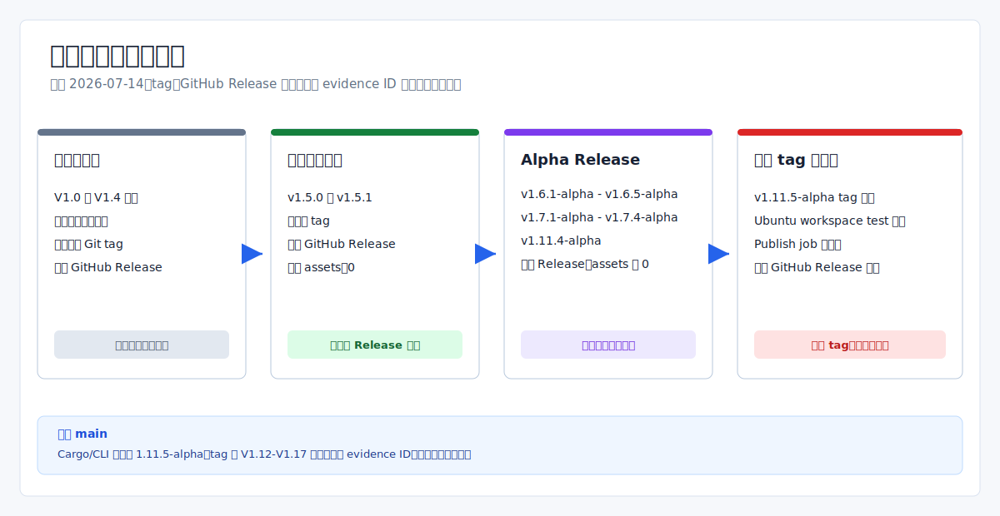

# Eva-CLI V1.5 兼容性策略（历史记录）

> 语言：简体中文
>
> 默认发布文档：`docs/en/release/v1.5-compatibility-policy.md`
>
> 英文原文：[English](../../en/release/v1.5-compatibility-policy.md)

更新日期：2026-07-14

状态：与 `v1.5.0` 关联的历史源码发布策略；不是对当前 `main` 的完整兼容性保证。

## 范围

V1.5 记录了在增加 release 命令时，哪些源码 checkout CLI 契约应保持兼容。本记录将策略承诺、代码结构和自动校验强度明确分开。

当前兼容性和生产缺口统一记录在 [V1.x 未完整实现功能清单](../planning/V1.x未完整实现功能清单.md) 和当前 contract fixture 中。

## 版本上下文

| 信号 | 含义 |
| --- | --- |
| V1.0 | 内部里程碑提交 `437087c`；不存在 `v1.0` tag |
| V1.4 | 内部 lifecycle 里程碑提交 `909ab07`；不存在 `v1.4` tag |
| V1.5.0 | annotated tag `v1.5.0`，解析到提交 `74d85e7da58ac40ef5d30b38e2844dee503a44c0` |
| 当前 `main` | Cargo 和 CLI 报告 `1.11.5-alpha`；后续 V1.12-V1.17 字符串是 legacy evidence ID，不是发布 tag |

## 策略、代码与测试强度

| 契约 | V1.5 策略 | 代码证据 | 自动校验强度 |
| --- | --- | --- | --- |
| JSON envelope | 成功输出保留 `ok`、`command`、`exit_code`、`data` 和 `trace`；错误输出保留 `ok`、`command`、`exit_code`、`error` 和 `trace` | 共享成功/错误 writer 构造这些顶层字段 | CLI 单元测试覆盖代表性成功和错误路径；当前 golden fixture 只覆盖选定的成功命令，不覆盖所有命令/错误组合 |
| Exit code | `0`、`1`、`2`、`3`、`4`、`5` 和 `64` 保持文档化含义 | 中央常量和 error-kind 映射定义这些值 | 单元测试覆盖代表性 usage、config、policy、runtime 和 external 失败；不执行历史 binary-to-binary diff |
| 命令面 | 在新增 `release` 时保留现有 V1.0-V1.4 命令族 | V1.5 parser/help 同时包含旧命令和新命令族 | 存在性测试和命令测试已覆盖部分路径；`release migration` 不比较命令面 |
| Sample 配置 | 已检入的 sample 项目和 manifest 无需迁移即可加载 | Typed loader 解析这些 sample | Loader 测试校验当前 checkout；因为不存在 `v1.4` tag，它们不会比较 V1.4 发布 |
| Plan-first 操作 | 在 V1.5 tag 中，hardware bind、restore 和 upgrade 保持非破坏性 | 该 tag 只公开 logical bind、restore plan 和 upgrade check | 命令测试覆盖 tag 时期边界；当前 `main` 有独立的 policy-gated apply 路径 |
| 废弃窗口 | 破坏性 CLI 或 manifest 变更需要至少一个已记录发布窗口 | 作为策略文本存在 `CompatibilityPolicy::v15()` 中 | 仅是治理规则；没有代码自动强制等待一个发布窗口 |

## V1.5 公开命令面

兼容性声明覆盖以下 V1.5 时期命令族：

- version、doctor、配置校验、inspect、basic run 和本地 task 诊断；
- Adapter、MCP、Skill、discovery、memory 和 hardware 诊断；
- backup、snapshot、restore plan 和 upgrade check；
- release check、security、performance 和 migration 报告。

这是 V1.5 历史命令面，不是当前全部命令清单。当前 `main` 还公开 daemon、agent、capability、emit、observability、restore apply/rollback、upgrade apply 等增量 alpha 路径。

## 当前 Contract 校验

当前 `main` 保留共享 envelope 和 exit code 实现，并提供 `scripts/validate-cli-json-contracts.ps1` 用于校验选定的 golden subset fixture：

- required 字段和 required 嵌套值必须保留；
- 删除或重命名 fixture 字段会使校验失败；
- 允许新增字段；
- 没有 fixture 的命令和未表示的错误变体不在该套件证明范围内。

`release migration` 会将兼容性策略作为结构化数据输出，但不会执行这些 golden 校验，也不检查 Git 历史。因此 `compatible` 结果是声明，不是自动生成的兼容性结论。

## 兼容性限制

V1.5 策略适用于源码 checkout、已文档化命令族、JSON envelope、exit code 含义和已检入 sample 配置。它不承诺：

- 安装包或包管理器兼容性；
- 签名 artifact 布局或供应链身份；
- 生产性能数值；
- durable 存储 schema 稳定性；
- 操作员数据的自动迁移；
- `v1.5.0` tag 之后新增能力的兼容性。

## 相关参考

- [V1.5 迁移声明](V1.5迁移指南.md)
- [V1.5 发布加固证据模型](V1.5发布加固.md#证据模型)
- [V1.5.0 发布验收记录](V1.5发布验收记录.md)
- [当前 V1.x 未完整实现功能清单](../planning/V1.x未完整实现功能清单.md)
- [当前项目配置边界](../operations/项目配置方案.md)
- [版本管理](版本管理方案.md)
