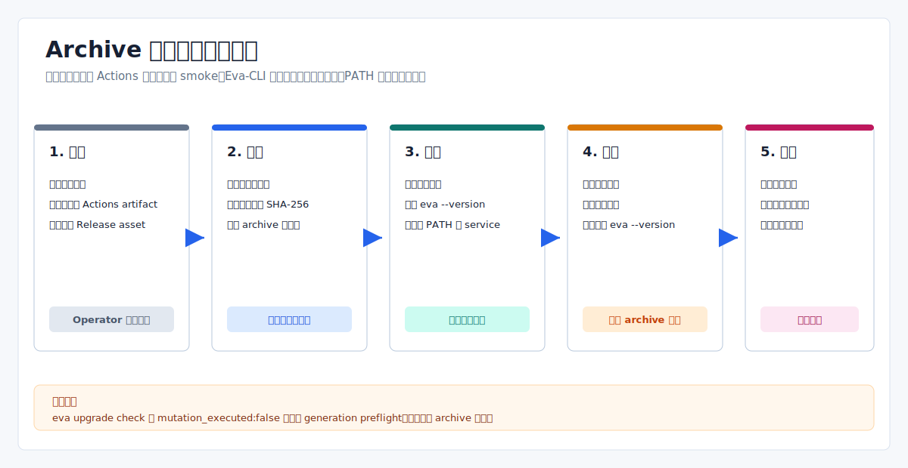

# Eva-CLI 安装、升级和卸载说明

日期：2026-07-14
范围：原生 workflow archives，以及 archive 替换与 runtime generation handoff 的边界

Eva-CLI 当前没有系统 installer、package-manager installer、PATH manager、自动下载器、
self-updater 或 uninstaller。原生交付物只是 GitHub Actions artifact 中的 binary 和 README。



## 当前交付边界

最新成功原生构建来自 `v1.11.4-alpha` release workflow，共产生四个 archive artifacts：

| 平台 | Archive target | 格式 | 签名状态 |
| --- | --- | --- | --- |
| Windows | `x86_64-pc-windows-msvc` | `.zip` | Unsigned |
| Linux | `x86_64-unknown-linux-gnu` | `.tar.gz` | Unsigned，glibc target |
| macOS Intel | `x86_64-apple-darwin` | `.tar.gz` | Unsigned、未公证 |
| macOS Apple Silicon | `aarch64-apple-darwin` | `.tar.gz` | Unsigned、未公证 |

这些文件是 GitHub Actions artifacts，不是附加到 GitHub Release 的 assets。下载需要
访问成功 workflow run，并会受仓库 artifact 保留期限制。Release 页面当前只提供 GitHub
自动生成的源码压缩包。

后续 `v1.11.5-alpha` tag 在原生 jobs 启动前就因 Ubuntu 验证失败，因此没有生成原生制品。

## Archive 内容与信任

每个原生 archive 只包含：

- `eva.exe` 或 `eva`；
- 记录 version smoke 命令和 unsigned 状态的 `README.txt`。

Workflow 会把每个 archive 解压到临时目录并运行 `--version`。最终 evidence artifact
包含逐 target SHA-256 和生成的 `SHA256SUMS`。这证明 workflow 重新读取了下载的 archive，
不等于平台签名、公证或长期公开下载保证。

Windows SmartScreen 或 macOS Gatekeeper 可能拒绝 unsigned binary。不要仅为了运行
archive 而绕过平台安全控制；本地政策要求可信签名时，应使用源码构建或等待未来 signed
distribution。

## 获取与校验

1. 打开精确 tag 的成功 [GitHub Release workflow](https://github.com/Yetmos/Eva-CLI/actions/workflows/release.yml) run。
2. 下载目标平台的 native artifact。
3. 从同一 run 下载 `release-evidence-<tag>`，并提取 `SHA256SUMS`。
4. 解压前确认 archive 文件名和 SHA-256 一致。

Windows 校验示例：

```powershell
$Archive = "eva-cli-1.11.4-alpha-x86_64-pc-windows-msvc.zip"
$Expected = ((Select-String -LiteralPath SHA256SUMS -Pattern ([regex]::Escape($Archive))).Line -split '\s+')[0]
$Actual = (Get-FileHash -Algorithm SHA256 -LiteralPath $Archive).Hash.ToLowerInvariant()
if ($Actual -ne $Expected) { throw "Eva-CLI archive checksum mismatch" }
```

Linux 校验示例：

```bash
archive=eva-cli-1.11.4-alpha-x86_64-unknown-linux-gnu.tar.gz
expected="$(grep "  ${archive}$" SHA256SUMS | awk '{print $1}')"
actual="$(sha256sum "$archive" | awk '{print $1}')"
test -n "$expected" && test "$actual" = "$expected"
```

macOS 使用同一 evidence，并以 `shasum -a 256 "$archive"` 计算实际 digest。

## 安装

解压就是安装。使用带版本号的目录，以便删除旧 binary 前先验证新 archive。

Windows：

```powershell
$Version = "1.11.4-alpha"
$InstallRoot = Join-Path $HOME "Applications\Eva-CLI\$Version"
New-Item -ItemType Directory -Force -Path $InstallRoot | Out-Null
Expand-Archive -LiteralPath "eva-cli-$Version-x86_64-pc-windows-msvc.zip" -DestinationPath $InstallRoot -Force
& (Join-Path $InstallRoot "eva.exe") --version
```

Linux：

```bash
version=1.11.4-alpha
install_root="$HOME/.local/opt/eva-cli/$version"
mkdir -p "$install_root"
tar -C "$install_root" -xzf "eva-cli-$version-x86_64-unknown-linux-gnu.tar.gz"
"$install_root/eva" --version
```

macOS：

```bash
version=1.11.4-alpha
target=aarch64-apple-darwin # 或 x86_64-apple-darwin
install_root="$HOME/.local/opt/eva-cli/$version"
mkdir -p "$install_root"
tar -C "$install_root" -xzf "eva-cli-$version-$target.tar.gz"
"$install_root/eva" --version
```

把选定目录加入 `PATH`、创建 wrapper 和管理 shell profile 都由用户完成。

## 升级

原生 archive upgrade 是手工 binary 替换：

1. 保留当前带版本号的目录；
2. 从同一 tag workflow 下载并校验新 archive 和 evidence；
3. 解压到不同的带版本号目录；
4. 对新 binary 运行 `--version`；
5. 更新用户自行管理的 PATH entry、symlink 或 wrapper；
6. 完成常用命令检查后，再删除旧目录。

不要用 `eva upgrade check` 证明新 archive 已安装。其默认值模拟 `1.3.0` 到 `1.4.0`
generation transition，JSON 输出 `mutation_executed:false`，不会检查刚替换的 binary。
Archive 版本校验应使用 `eva --version`。

## Runtime Upgrade 命令

`upgrade` CLI 属于 runtime lifecycle coordination，不是 package installation。

```powershell
eva upgrade check --from-release 1.11.4-alpha --to-release <new-version> --output json
```

即使显式提供 release 值，`check` 也只构建 migration、drain 和 rollback 诊断计划，
不会启动 runtime process。

`eva upgrade apply` 要求 plan file、匹配的 confirmation token、filesystem lock store
和 policy approval。提供 state store 后，它可以在 runtime-binary version probe 和 health
结果通过时提交 generation handoff 与 release-pointer state。它不会下载 archive、替换
已安装 executable、注册 OS service 或操作平台 package manager。

## 卸载与数据

如果某个项目的 Eva daemon 正在使用该 binary，删除选定版本前先请求 shutdown：

```powershell
eva daemon shutdown --project <project-path> --output json
```

然后删除解压目录，以及用户自己创建的 PATH entry、symlink 或 wrapper。仓库没有提供
uninstall 命令。

删除 binary 不会删除项目数据。`.eva/`、显式 durable backend、daemon state/lock/pid
目录、observability 数据、backup artifacts 和 lifecycle state 可能位于安装目录之外。
应按项目数据政策单独盘点、保留或删除这些路径。

## Release Evidence 边界

Release workflow 为最终门禁生成 `release-distribution.evidence`。它记录四个 archive
smoke 结果，把本文作为 install/upgrade/uninstall 参考，并包含 GHCR digest metadata
inspect 状态。

该 evidence 是 release operator artifact。用户手工安装时无需重建其 key/value schema；
distribution gate 通过也不表示已经存在公开 native installer 或 package repository。

## 相关文档

- [项目发布方案](项目发布方案.md)
- [GitHub Packages 发布方案](软件包发布方案.md)
- [版本管理方案](版本管理方案.md)
- [进程级停机升级](../operations/进程级停机升级架构方案.md)
