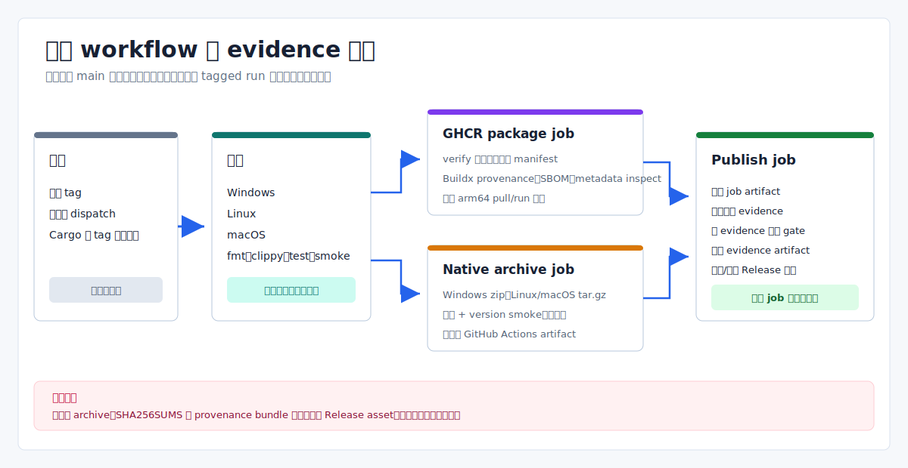

# Eva-CLI 项目发布方案

日期：2026-07-15
范围：CI、tag 驱动的发布自动化、发布证据、GHCR 与原生压缩包边界

本文只描述仓库当前实际执行的流程。编译进代码的 readiness 声明、会过期的 Actions
artifact 或尚未落地的签名方案，都不能单独作为生产发布完成的证据。



## 当前发布状态

| 项目 | 当前事实 |
| --- | --- |
| `main` | Cargo 和 CLI 仍标识为 `1.11.5-alpha` 开发线，但分支已经包含 tag 之后的提交。 |
| 最新 tag | `v1.11.5-alpha` 指向 commit `9b86adf`。其 release workflow 在 Ubuntu workspace tests 失败，package、原生压缩包和 publish job 均被跳过；该 tag 没有 GitHub Release。 |
| 最新成功 Release | [`v1.11.4-alpha`](https://github.com/Yetmos/Eva-CLI/releases/tag/v1.11.4-alpha) 完成三平台工作流，是当前最新公开 GitHub Release。 |
| 原生下载 | 成功工作流生成了 Windows、Linux 和 macOS 压缩包，但它们是 GitHub Actions artifacts，不是 GitHub Release assets，并会按 Actions 保留策略过期。 |
| 容器 | 成功工作流发布了 `ghcr.io/yetmos/eva-cli:1.11.4-alpha`。 |

现有 `v1.11.5-alpha` 不是可随 `main` 移动的标记。后续发布必须使用新的版本号和 tag。

## 工作流与输出边界

`.github/workflows/release.yml` 由匹配的 tag push 触发，也可手动选择已有 tag
运行。每个 job checkout 的都是该 tag，而不是当前分支头。

真实 job 顺序为：

1. `verify` 在 Ubuntu、Windows 和 macOS 上运行。
2. 三个平台全部通过后，`packages`、`native-windows`、`native-linux` 和包含两个
   target 的 `native-macos` 矩阵并行运行。
3. 所有前置 job 成功后，`publish` 才构建并校验文档、生成实测证据、上传合并后的
   evidence artifact，并创建或更新 GitHub Release 记录。

三类输出不能混为一谈：

| 位置 | 工作流写入内容 | 持久性与访问方式 |
| --- | --- | --- |
| GitHub Release | Release 标题/正文和 GitHub 自动生成的源码压缩包 | 与 tag 绑定的公开 Release 记录 |
| GitHub Actions artifacts | 原生压缩包、逐 target capture 原始流与平台 subject/envelope、平台 bundle、`SHA256SUMS`、扫描/基准/distribution evidence 和 provenance bundle | 受仓库保留期限制的工作流制品，不是 Release assets |
| GHCR | 多平台 OCI image 和 digest | Registry package；重新运行工作流可能重推版本 tag，因此 digest 才是内容身份 |

GHCR image 在最终 `publish` evidence gate 之前已经推送。后续原生构建或 publish
失败不会自动删除它，操作人员必须分别核对三处状态，不能从单个绿色 job 推断原子发布完成。

## 门禁语义

发布流程包含两层证据。

### 仓库声明的 readiness

以下命令返回由代码内 gate、fixture 和可选 evidence 输入组装的报告：

```powershell
cargo run -- release check --output json
cargo run -- release security --output json
cargo run -- release perf --output json
cargo run -- release migration --output json
```

基础 `release check` 返回 `ready`，只表示当前没有 required 编译态 gate 被标为
blocked。它不会执行 CI、签名制品、访问生产服务、运行真实硬件或证明 GitHub Release
已经发布；其 closure 仍可能是 `ready_with_external_blockers`。

### 工作流实际执行的证据

原生 job 与最终 publish job 还会：

- 运行 `cargo audit --json` 并转换成 security scan evidence；
- 构建 release binary，对 `eva --version` 和 `eva release check` 各采样三次并比较预算；
- 每个原生 job 解压最终 archive，用结构化 argv capture 运行其中的 `eva --version` 和 `rustc --version`，保存 capture JSON、原始 stdout/stderr 和 archive 副本；
- 平台 producer 重算上述原始字节，将规范 target/archive、OS/arch、toolchain、tag/commit、GitHub run ID/attempt/job、runner identity 和完成时间绑定为 `measurement` subject/envelope；
- publish 将四份平台 evidence 下载到隔离目录，从 tag 指向的 checkout HEAD 与当前 run context 取得可信输入，重新读取并校验 capture 流、archive、subject/envelope、路径和摘要，再按 target 稳定排序生成平台 bundle；
- publish 还把单独下载的四份 release archive 与已验证 bundle 中的摘要逐一比较，然后结合 GHCR digest inspect 生成 distribution evidence；
- 带 distribution、scanner 和 benchmark evidence 重新运行 `release check`；
- 带实测 benchmark evidence 重新运行 `release perf`。

平台 producer/aggregator 的三平台本地合同和 Rust verifier 已通过；更新后的 GitHub-hosted
release workflow 尚未在新 tag 上实际运行。当前 bundle 只保证输入一致性，平台覆盖、
freshness 与 trusted-executor policy 仍由后续 production gate 实现。

仓库存在 public JSON contract 脚本，但 CI 和 release workflow 当前都没有执行
`scripts/validate-cli-json-contracts.ps1`。不能把编译态 `REL-JSON-CONTRACT-001`
标记描述成已执行的 workflow check。

## 平台与制品矩阵

| 用途 | Runner 或 target | 实际检查或输出 |
| --- | --- | --- |
| 验证 | `ubuntu-latest`、`windows-latest`、`macos-latest` | format、clippy、workspace tests、版本校验和 CLI smoke |
| Windows 压缩包 | `windows-latest` 上的 `x86_64-pc-windows-msvc` | unsigned `.zip`；解压后 capture `eva.exe --version` 与 toolchain，并生成平台 evidence |
| Linux 压缩包 | `ubuntu-latest` 上的 `x86_64-unknown-linux-gnu` | unsigned glibc `.tar.gz`；解压后 capture `eva --version` 与 toolchain，并生成平台 evidence |
| macOS Intel 压缩包 | `macos-26-intel` 上的 `x86_64-apple-darwin` | unsigned、未公证 `.tar.gz`；解压后 capture smoke/toolchain，并生成平台 evidence |
| macOS Apple Silicon 压缩包 | `macos-26` 上的 `aarch64-apple-darwin` | unsigned、未公证 `.tar.gz`；解压后 capture smoke/toolchain，并生成平台 evidence |
| 容器 | `linux/amd64`、`linux/arm64` | Buildx push 并启用 provenance/SBOM；本地 image version smoke 和已推送 digest metadata inspect |

工作流不发布 Windows installer、macOS application bundle、Homebrew formula、Winget
package、Apt repository 或 crates.io package，也没有运行已推送的 arm64 容器。

## 发布流程

1. 选择尚未使用的新版本。同步根 Cargo 两处版本、lock file、CLI release
   label/status、README 版本标签、发布说明和双语文档。
2. 本地运行仓库检查：

   ```powershell
   cargo fmt --check
   cargo clippy --workspace --all-targets -- -D warnings
   cargo test --workspace
   ./scripts/validate-version-management.ps1
   ./scripts/build-site-i18n.ps1
   ./scripts/validate-i18n.ps1
   ```

3. 推送 release commit，确认完整 CI 矩阵通过。当前仓库没有保护 `main`，因此该确认
   仍是操作人员职责。
4. 按仓库政策创建 annotated tag 并推送。版本脚本只检查 tag 文本和 Cargo 版本相等，
   不证明 tag 已 annotated 或来自 `main`。
5. 监控全部 release jobs，不能把 package job 成功当成发布完成。
6. 确认最终 evidence-backed `release check` 通过，再分别核对 GitHub Release
   记录、GHCR digest 和 Actions artifacts。

## 失败与恢复

- tag 推送前失败时，修复 commit 并重新运行 CI。
- tag 推送后不得移动或复用；即使 GitHub Release 从未创建，也应发布新的 prerelease
  serial 或 patch 版本。
- GHCR push 后失败时，记录已发布 digest，并明确决定是否需要删除；最终 job 失败不会回滚它。
- 手动 dispatch 运行选定 tag 中的代码，不会包含只存在于 `main` 的修复；它还可能更新
  现有 Release 正文或 registry tag。
- 原生压缩包保持 unsigned。工作流没有实现平台签名或公证；真实 key handling 完成前
  不应提供 `RELEASE_SIGNING_KEY`，当前代码只会记录 signing blocked。

## 完成标准

只有以下证据全部存在时，才能认为发布完成：

- release commit 通过完整 CI 矩阵；
- tag 与 Cargo 版本一致，且所有 release jobs 通过；
- 带 evidence 的 security、benchmark 和 distribution 检查通过，平台 bundle 与单独下载的原生 archive 摘要一致；
- immutable tag 对应的 GitHub Release 记录存在；
- 预期 Actions artifacts 存在，且保留期已被理解；
- 发布 package 时，GHCR digest/tag 与 `package-ghcr.json` 一致；
- 发布说明明确原生压缩包 unsigned，且属于 Actions artifacts 而非 GitHub Release assets；
- 文档和网站校验通过。

## 相关文档

- [版本管理方案](版本管理方案.md)
- [GitHub Packages 发布方案](软件包发布方案.md)
- [安装、升级和卸载说明](安装升级卸载说明.md)
- [V1.x 剩余生产缺口](../planning/V1.x未完整实现功能清单.md)
