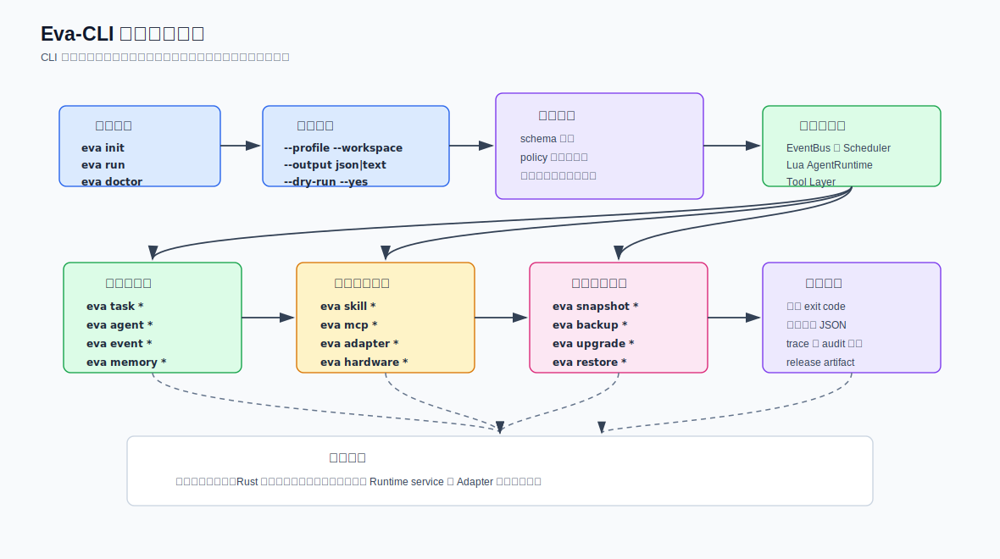

> Language: 简体中文
> English default entry: ../en/command-line-tool-feature-design.md
> Translation status: current

# Eva-CLI 命令行工具功能设计文档

更新日期：2026-07-04

## 1. 文档定位

本文同时定义 Eva-CLI 的目标命令行功能集，以及当前 V1.5 源码发布检查点已经落地的命令表面。它覆盖命令分组、操作体验、安全闸口、输出契约、阶段优先级、实现验收口径，以及已经可执行的诊断命令。它的作用是把现有架构文档中的 Runtime、Agent、Skill、MCP、Adapter、记忆、事件、恢复和发布能力，收束成用户与自动化脚本可以调用的 CLI 表面。

Eva-CLI 当前已经实现 V1.5 发布加固 CLI 检查点。会修改外部系统、启动真实 provider、执行破坏性 restore、或激活长期 Supervisor/Runtime 进程的命令，除非在下方明确列为已实现诊断面，否则仍属于后续 apply 路径。

## 1.1 V1.5 当前实现快照

当前可执行程序已经支持：

- `version`、`doctor`、`config validate` 和 `inspect`。
- `run --example basic`，以及基于本地 `.eva/tasks` 的 `task status`、`task logs`、`task cancel` 诊断。
- 无副作用的 `adapter list/probe`、`mcp list/probe`、`skill list/run` 和 `discovery scan` 诊断。
- `memory context` 请求级上下文组装，覆盖私有记忆、全局记忆、知识检索和 Lua context snapshot。
- plan-first 的 `hardware list/probe/bind` 诊断，不打开 raw I/O。
- `backup create`、`snapshot create`、`restore plan` 和 `upgrade check`，由 in-memory artifact 与 lifecycle plan 支撑。
- `release check`、`release security`、`release perf` 和 `release migration`，用于 V1.5 发布准备度、兼容性和迁移证据。

## 2. 产品定位

Eva-CLI 应成为 Eva Runtime 的受控入口。用户和自动化脚本调用 `eva`，但真正拥有校验、权限、schema、审计、进程生命周期和副作用执行权的是 Rust Runtime。



CLI 必须同时服务两类使用方式：

- 人类操作模式：简洁文本、引导提示、表格、进度和恢复建议。
- 自动化模式：稳定 JSON、确定性 exit code、默认非交互，以及可关联日志和 artifact 的 trace ID。

## 3. 设计目标

| 目标 | 要求 | 验收证据 |
| --- | --- | --- |
| 降低 Runtime 使用门槛 | 用户不需要读完全部架构文档，也能初始化 workspace、校验配置并提交第一个任务。 | `eva init`、`eva doctor`、`eva run`、清晰诊断信息。 |
| 保持 Rust 权限边界 | 命令只表达意图，Runtime service 负责校验和执行高权限动作。 | policy gate、schema validation、audit record、adapter boundary。 |
| 支持脚本和 CI | 可能被自动化调用的命令必须提供 JSON 输出和稳定 exit code。 | `--output json`、默认非交互、文档化错误码。 |
| 安全支持热更新 Agent | Agent、Skill、MCP、Adapter 和配置命令可以热加载安全字段，但不能静默扩大权限。 | generation ID、reload plan、permission diff、restart-required 结果。 |
| 让恢复操作可检查 | backup、snapshot、restore、rollback、upgrade 命令必须产出 artifact 和可验证状态。 | artifact ID、manifest digest、trace ID、audit event。 |

## 4. 命令模型

顶层命令形态如下：

```text
eva <command> [subcommand] [flags]
```

除非某个命令明确拒绝，否则通用参数应在所有命令组中保持一致：

| 参数 | 作用 | 说明 |
| --- | --- | --- |
| `--workspace <path>` | 选择 workspace 根目录。 | 默认从当前目录向上查找最近的 Eva workspace。 |
| `--profile <name>` | 选择配置和策略 profile。 | 常见值：`dev`、`test`、`prod`。 |
| `--output text|json` | 选择人类文本或机器输出。 | TTY 默认 `text`，CI 推荐 `json`。 |
| `--locale <code>` | 选择人类文本语言。 | 不翻译机器可读 code、key 和字段名。 |
| `--dry-run` | 只生成和校验执行计划，不产生变更。 | CI 中执行高风险命令前必须可用。 |
| `--yes` | 在非交互模式下接受普通确认。 | policy 要求显式确认时不可绕过。 |
| `--trace <id>` | 绑定或延续 trace。 | 便于 replay、诊断和支持。 |
| `--verbose` | 输出扩展诊断信息。 | 不能泄露密钥。 |

## 5. 命令组

| 命令组 | 命令 | V1.5 状态 | 职责 |
| --- | --- | --- | --- |
| Workspace | `version`、`doctor`、`config validate`、`inspect`；目标命令 `init`、`config explain` | 诊断面已实现；`init` 和 `config explain` 仍是目标命令 | 创建并校验最小项目结构。 |
| 任务执行 | `run --example basic`、`task status`、`task cancel`、`task logs` | 已在 V1.0 in-memory basic loop 中实现 | 提交工作并查看 Runtime 进度。 |
| Agent Runtime | 目标命令 `agent list`、`agent inspect`、`agent run`、`agent reload` | 后续 apply/control surface；V1.5 通过 config 与 inspect 暴露 Agent 信息 | 通过 Scheduler 和 Runtime gate 管理内部 Lua Agent。 |
| 扩展能力 | `skill list/run`、`mcp list/probe`、`adapter list/probe`、`discovery scan` | 已实现为受控诊断与 envelope | 检查和调用受控外部能力表面。 |
| 记忆与事件 | `memory context`；目标命令 `memory query/export`、`event tail/replay` | 上下文组装已实现；通用事件/记忆浏览仍属后续范围 | 检查受控上下文与事件证据。 |
| 运维恢复 | `backup create`、`snapshot create`、`restore plan`、`upgrade check`、`release check/security/perf/migration` | 已实现为 plan-first、非破坏性发布诊断 | 提供可审计的恢复和发布证据。 |
| 硬件 | `hardware list/probe/bind` | 已实现为不打开 raw I/O 的 plan-first 诊断 | 只通过 HardwareAdapter policy 管理设备。 |
| 开发辅助 | 目标命令 `dev harness`、`dev fixture`、`schema export` | 后续贡献者工具 | 帮助贡献者测试契约和 Runtime 流程。 |

## 6. P0 命令细化

### 6.1 `eva init`

创建 workspace 骨架：

- `config/eva.yaml`
- `config/agents/`
- `config/adapters/`
- `.eva/` 运行时元数据目录
- 按需生成样例 policy 和 manifest

该命令不能静默覆盖已有文件。出现覆盖风险时，必须先展示计划，再要求用户确认或传入 `--yes`。

### 6.2 `eva doctor`

检查本地运行准备情况：

- workspace 结构和配置可读性
- manifest schema 有效性
- Lua runtime 可用性
- 已配置的外部命令和 MCP server
- `.eva/` 文件系统权限
- 可选的官网或文档下一步链接

### 6.3 `eva config validate`

在不启动 Runtime 的情况下校验配置、manifest 和 policy 合并结果。诊断信息应包含：

- error code
- 文件路径
- JSON pointer 或配置路径
- 人类可读解释
- 推荐修复动作

### 6.4 `eva run`

把用户意图作为 typed event 提交给 Runtime。命令应支持自然语言输入和结构化 JSON 输入：

```text
eva run "summarize the current repository"
eva run --input task.json --output json
```

长任务应立即返回 task ID；是否持续输出进度由 `--follow` 控制。

### 6.5 `eva agent`

提供内部 Agent 的第一组用户可见控制面：

| 子命令 | 行为 |
| --- | --- |
| `agent list` | 展示已发现 Agent、启用状态、generation、Topic 和健康状态。 |
| `agent inspect <id>` | 展示 manifest、权限、路由、Lua entrypoint 和最近一次校验结果。 |
| `agent run <id>` | 通过 Scheduler 向单个 Agent 发送测试事件。 |
| `agent reload <id|--all>` | 生成 reload plan，校验通过后切换安全 generation。 |

## 7. 安全与变更规则

高风险命令必须先生成计划：

1. 解析 workspace、profile 和 runtime generation。
2. 加载配置、manifest、schema 和 policy。
3. 生成执行计划。
4. 在文本模式展示变更范围，或在 JSON 模式返回计划对象。
5. 除 `--dry-run` 或受信任自动化策略允许的场景外，要求确认。
6. 通过 Runtime service 执行。
7. 写入 audit record，至少包含 trace ID、actor、command、输入、plan digest 和结果。

高风险命令包括 `restore apply`、`upgrade apply`、`snapshot promote`、具备写权限的 Adapter 调用、硬件绑定，以及任何权限扩大操作。

## 8. 输出契约

每个命令应返回以下结果类型之一：

| 类型 | 含义 | 文本输出 | JSON 输出 |
| --- | --- | --- | --- |
| `ok` | 成功完成。 | 摘要表格和下一步动作。 | `status`、`data`、`trace_id`。 |
| `planned` | 未产生变更，计划已生成。 | 计划摘要和确认提示。 | `status`、`plan`、`requires_confirmation`。 |
| `accepted` | 长任务已被接受。 | task ID 和 follow 命令。 | `status`、`task_id`、`trace_id`。 |
| `blocked` | policy 或缺失前置条件阻止执行。 | 原因和修复建议。 | `status`、`error`、`missing`、`trace_id`。 |
| `failed` | 操作启动后失败。 | 错误、重试建议和日志引用。 | `status`、`error`、`retryable`、`trace_id`。 |

推荐 exit code：

| Code | 含义 |
| --- | --- |
| `0` | 成功。 |
| `1` | 通用执行失败。 |
| `2` | 用法或参数错误。 |
| `3` | 配置或 schema 校验错误。 |
| `4` | policy 拒绝请求。 |
| `5` | Runtime 不可用。 |
| `6` | 外部能力不可用。 |
| `7` | 操作需要确认。 |
| `8` | 带警告的部分成功。 |

## 9. 多语言规则

CLI 的人类可读文本应沿用官网和文档的语言策略：

- `en` 是默认公开语言。
- `zh-CN` 支持详细产品和架构内容。
- 机器可读 key、error code、命令名、JSON 字段、Topic 名称和文件路径不翻译。

## 10. 实现顺序

| 阶段 | 范围 | 完成证据 |
| --- | --- | --- |
| Phase 1 | `init`、`doctor`、`config validate`、静态 schema。 | CI 中可以创建并校验 workspace。 |
| Phase 2 | `run`、`task status`、最小 EventBus 和 Scheduler 闭环。 | task 可以进入 Runtime，并产出可追踪输出。 |
| Phase 3 | `agent list/inspect/run/reload`。 | Lua Agent generation 可以被校验并安全切换。 |
| Phase 4 | `skill`、`mcp`、`adapter` 的检查和 probe 命令。 | 外部能力发现可见，但受 policy gate 控制。 |
| Phase 5 | `snapshot`、`backup`、`restore plan`、`event replay`。 | 恢复操作可以产出可验证 artifact。 |

V1.5 源码发布在上述阶段基础上继续补齐了受控外部能力诊断、记忆上下文组装、硬件绑定计划、生命周期检查和发布加固门禁。真实 provider 进程执行、破坏性 `restore apply`、持久 Runtime supervision、签名 artifact 和安装包仍明确不属于 V1.5 CLI 范围。

## 11. 待定问题

- Rust workspace 创建后，应统一采用哪一个 CLI parser crate？
- 第一版长任务流式输出应使用 Server-Sent Events、本地 socket，还是重复轮询？
- local-only 开发模式下，哪些 audit 字段必须保留？
- `eva run` 对短任务应默认同步完成，还是始终返回 task ID？
