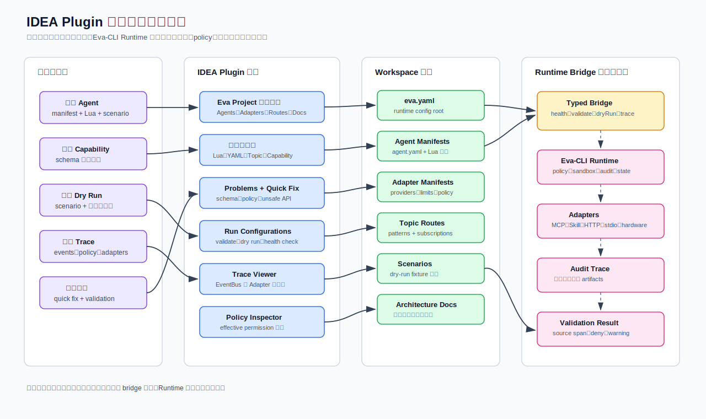

> Language: 简体中文
> English default entry: [English](../../en/tooling/idea-plugin-toolchain.md)
> Translation status: current

# IDEA Plugin 开发工具链功能方案

更新日期：2026-06-25

## 1. 文档定位

本文定义 Eva-CLI 当前项目开发工具链所需的 IDEA Plugin 能力。这个插件不是可信运行时的一部分，而是面向开发者的控制台和编辑器智能层：它理解 Eva-CLI workspace，帮助开发者编辑 Agent、manifest、Topic、policy、scenario、Lua 脚本和架构文档，并通过类型化 Runtime Bridge 把执行请求交给本地 Eva-CLI Runtime。

核心边界如下：

- IDEA Plugin 负责编辑器智能、项目导航、检查、Run Configuration、工具窗口和本地开发反馈。
- Eva-CLI Runtime 负责 policy、权限、密钥、沙箱、外部 I/O、Adapter 执行、审计、持久状态和回滚。
- Runtime Bridge 负责 IDE 与本地 Eva-CLI 进程之间的类型化请求和响应契约。
- 插件不能变成另一个 shell executor，也不能成为隐藏 Runtime。

## 2. 工具链能力总览



插件的目标是提升项目编写、理解和验证效率，而不是改变运行时权威。它应该读取 Eva-CLI Runtime 同样会校验的 manifest、schema、Topic route、Adapter registry 和测试 fixture，但最终授权、注册、执行和审计仍由 Runtime 完成。

## 3. 功能矩阵

| 领域 | 必须支持的能力 | 运行时边界 | 优先级 |
| --- | --- | --- | --- |
| 项目模型 | 识别 `eva.yaml`、`config/agents/**/agent.yaml`、Lua 入口脚本、policy、route、schema、docs 和 scenario fixture | 只做只读索引，不做运行时 mutation | MVP |
| Manifest 编辑 | YAML schema 校验、补全、必填字段提示、重复 ID 检测、路径校验、权限预览 | effective policy 仍以 Runtime 为准 | MVP |
| Lua Agent 编辑 | 文件类型支持、语法高亮、结构视图、host API 补全、`ctx.*` API 文档、不安全调用检查 | 插件不能直接提供 shell、文件、网络或密钥访问 | MVP |
| Topic 与 EventBus 导航 | Topic 名称补全、route 跳转、通配符校验、生产者/订阅者关系图 | Scheduler 行为只能从配置模拟，真实投递留在 Runtime | MVP |
| Adapter 与 capability 索引 | 将 capability 名称解析到 Adapter manifest、MCP tool、Skill adapter 和 Lua capability | Discovery 数据在 Runtime 校验注册前只是提示 | MVP |
| Run Configuration | `eva config validate`、Agent scenario dry run、单文件 manifest 校验、本地 Runtime 健康检查 | IDE 通过 Runtime Bridge 发送类型化命令 | MVP |
| 诊断反馈 | inline error、gutter action、quick fix、Problems 视图、bridge 诊断、缓存过期提示 | Runtime 错误只能展示，不能被插件改写成成功 | MVP |
| Trace 与审计查看 | 打开 request trace，展示事件链、Adapter 调用、policy deny，跳转源 manifest | audit record 仍是 Runtime 托管 artifact | V1 |
| 测试工作流 | parser fixture、manifest fixture、scenario fixture、golden trace 对比、contract test 启动 | 测试命令调用 Eva-CLI 或 test harness 入口 | V1 |
| 文档工作流 | 把 docs 与配置概念互链，校验本地文档链接，打开相关架构文档，展示 Lore 决策引用 | 文档操作不能修改 runtime policy | V1 |
| 生成助手 | 创建 Agent、Adapter manifest、Topic route、scenario 和文档片段骨架 | 生成文件必须通过正常 schema 与 policy 校验 | V1 |
| 重构 | 跨项目重命名 Agent ID、Topic、capability alias 和 manifest 路径 | 重构只是文件编辑，Runtime 必须重新校验 | Later |

## 4. 主要使用流程

| 流程 | IDE 支持 | 成功证据 |
| --- | --- | --- |
| 创建新 Agent | New Agent action 创建 `agent.yaml`、`main.lua`、可选 `constraints.md` 和 scenario fixture | 项目模型发现该 Agent，且 `eva config validate` 通过 |
| 增加 capability 调用 | 补全从 manifest 中提示允许的 capability alias 和 provider | 检查器确认 Agent 具备所需权限路径 |
| 增加 Topic route | route 编辑器校验 Topic 语法，并展示生产者/订阅者 | Topic 图中出现新 route，通配符规则合法 |
| dry run Agent scenario | Run Configuration 通过 Runtime Bridge 传入 scenario ID 和 workspace context | 工具窗口展示结构化结果、emitted Topics、deny 和 trace 链接 |
| 排查 policy denial | Problems 视图把 denial 链接到 Agent permission、Adapter policy 和全局 policy | 开发者能看到是哪一层收紧了权限 |
| 查看失败 trace | Trace Viewer 展示 EventBus、Scheduler、AgentRuntime、Lua、Tool Layer、Adapter 交接 | 源码链接能跳到准确 manifest、route 或 Lua 调用点 |

## 5. 功能要求

### 5.1 项目模型与索引

插件应通过以下文件识别 Eva-CLI workspace：

```text
eva.yaml
config/eva.yaml
config/agents/**/agent.yaml
config/adapters/**/*.yaml
config/routes/topics.yaml
docs/_i18n/manifest.json
```

插件需要建立以下索引：

- Agent ID、脚本路径、父子关系、订阅、可 emit Topic 权限。
- Topic route、通配符 pattern、生产者调用点、订阅目标。
- Adapter ID、transport、capability、provider、limit 和 policy gate。
- MCP tool/resource/prompt allowlist。
- Skill adapter manifest 和 runtime gate。
- 配置与协议校验所用 JSON Schema。
- scenario fixture 和 golden output。
- `docs/` 下相关架构文档。

索引只是开发辅助。最终 discovery、validation、authorization 和 registration 必须由 Eva-CLI Runtime 完成。

### 5.2 Manifest 与 Schema 辅助

Manifest 支持应包含：

- YAML 与 JSON schema 校验。
- 对 `id`、`enabled`、`subscriptions`、`permissions`、`capabilities`、`transport`、`limits`、`routing` 等稳定字段补全。
- 检测重复 Agent、Adapter、capability 和 Topic 标识符。
- 限定在 workspace 内的路径补全。
- 对疑似密钥明文的 manifest 值给出警告。
- 对缺失必填字段和非法 enum 值提供 quick fix。
- 展示带来源的 effective permission preview。

插件不应凭空发明 schema 规则。项目存在 schema 时优先使用项目 schema；否则使用随插件版本发布的 bundled schema。

### 5.3 Lua Agent 编辑

Lua 支持必须理解 Eva-CLI 语义，而不只是通用 Lua 语法。

必须支持：

- Agent Lua 入口脚本的文件类型识别。
- 语法高亮、parser recovery、结构视图和符号搜索。
- 对 `ctx.emit`、`ctx.tool`、`ctx.memory`、`ctx.global_memory`、`ctx.knowledge` 等受控 host API 提供补全和文档。
- 从 Lua Topic 字符串跳转到 route 声明。
- 从 Lua capability 调用跳转到 Adapter、MCP、Skill 或 Lua capability manifest。
- 当 sandbox policy 禁止时，对 `os`、`io`、`debug`、原始网络、原始文件或 shell 使用给出检查。
- 在 gutter 中提供运行最近 scenario 或校验所属 Agent manifest 的动作。

插件不能通过自己执行禁用调用来绕过沙箱。

### 5.4 Runtime Bridge

Runtime Bridge 命令应该类型化、版本化、范围收窄。

推荐命令：

| 命令 | 输入 | 输出 |
| --- | --- | --- |
| `runtime.health` | workspace 路径、期望协议版本 | Runtime 状态、版本、feature flags |
| `config.validate` | 配置根目录、可选文件范围 | 带 source span 的结构化诊断 |
| `config.inspectEffective` | Agent 或 Adapter ID | effective config、policy provenance |
| `capabilities.snapshot` | workspace、可选 filter | 已注册能力和 rejected candidate |
| `agent.scenario.dryRun` | scenario ID、Agent ID、timeout | events、tool calls、denials、trace ID、artifacts |
| `topic.resolve` | Topic 字符串或 pattern | 匹配 route、subscriber、校验错误 |
| `audit.trace.open` | trace ID 或 request ID | 事件链、Adapter 调用、policy decision |

Bridge 约束：

- 不提供任意 shell command endpoint。
- 不提供原始环境变量读取 endpoint。
- 不提供直接获取 secret 的 endpoint。
- 不提供不受限文件写入 endpoint。
- 每个请求都包含 workspace、protocol version、correlation ID、timeout 和 cancellation token。
- 每个响应返回结构化诊断，而不是只有文本日志。

### 5.5 工具窗口与 UI 表面

插件应提供以下界面：

| 界面 | 用途 |
| --- | --- |
| Eva Project | Agent 树、Adapter 树、Topic route、policy、scenario 和 docs 链接 |
| Problems | Manifest、schema、Lua、Topic 和 Runtime Bridge 诊断 |
| Capability Index | 展示已注册和已发现 capability，以及 provider、policy、health 状态 |
| Scenario Runner | dry-run 状态、emitted Topics、tool calls、denials、artifacts 和 trace 链接 |
| Trace Viewer | 展示跨 EventBus、Scheduler、AgentRuntime、Lua、Tool Layer、Adapter 的 request timeline |
| Policy Inspector | 展示 effective permission 链路和被拒绝的权限放大 |

UI action 应该是可回滚的文件编辑，或类型化 Runtime Bridge 请求。

### 5.6 生成与重构

生成助手只有在保持项目契约时才有价值。它应该生成能通过校验的最小文件：

- Agent skeleton。
- Adapter manifest skeleton。
- MCP adapter manifest skeleton。
- Topic route entry。
- Scenario fixture。
- Lua capability handler skeleton。
- 链接到相关架构页的文档 stub。

重构应保守：

- 跨 manifest、route、scenario fixture 和 docs link 重命名 Agent ID。
- 跨 route 文件和 Lua emit/call site 重命名 Topic 字符串。
- 跨 Adapter manifest、policy 和 Lua 调用重命名 capability alias。
- 移动 Agent 目录，同时保留 manifest path 正确。

Runtime Bridge 可用时，每次生成或重构后都应运行本地校验。

## 6. MVP 边界

第一版可用插件应支持：

1. Eva-CLI workspace 检测。
2. Agent、Adapter、Topic、policy 和 scenario 索引。
3. 关键 manifest 文件的 YAML schema 校验与补全。
4. Lua Agent 语法、host API 补全和 unsafe API 检查。
5. Topic 与 capability 导航。
6. config validation 和 scenario dry run 的 Run Configuration。
7. Runtime 诊断接入 Problems 视图。
8. 精简 Eva Project 工具窗口。

第一版不应急于实现完整调试、实时 Runtime mutation、分布式 tracing UI 或大范围重构。先稳定日常 authoring loop。

## 7. 非目标

插件禁止：

- 代表 Lua 或 manifest 执行任意 shell 片段。
- 在明确 Runtime 诊断之外读取或展示密钥。
- 绕过 Eva-CLI policy、sandbox、timeout、audit 或 Adapter routing。
- 维护一套与 Runtime 不一致的隐藏 registry。
- 把 discovered capability 当成 authorized capability。
- 把开发者本地 IDE 状态写进 Runtime memory 或 knowledge store。
- 不通过可见文件编辑直接改写生产配置。

## 8. 验证要求

插件实现应覆盖以下测试：

| 测试类型 | 覆盖内容 |
| --- | --- |
| Parser fixture | Lua Agent 语法、YAML manifest、Topic route 文件 |
| Index fixture | Agent 图、Adapter 图、capability alias、Topic producer/subscriber |
| Inspection test | 缺失权限、不安全 Lua API、非法 Topic pattern、重复 ID |
| Quick fix test | 缺失必填 manifest 字段、非法 enum 值、过期路径 |
| Bridge contract test | 与本地 Eva-CLI Runtime 的请求/响应 schema 兼容性 |
| Run Configuration test | config validation 和 scenario dry-run 命令构造 |
| UI smoke test | fixture project 打开工具窗口并展示预期诊断 |

插件完成的判断标准是：开发者可以在 IDEA 内创建或编辑 Agent，运行校验，dry run scenario，查看失败原因，并跳回源文件定位问题。
