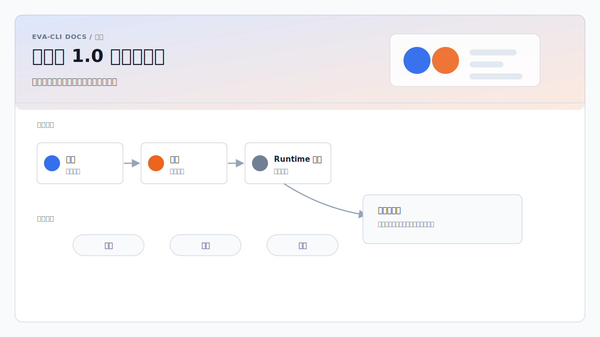

# 从零到 1.0 版本路线图

Eva-CLI 从架构设计走向 1.0 发布，应该按阶段推进，而不是直接从文档跳到大规模
Runtime 实现。每个阶段都要留下可评审、可测试、可版本化的交付物，并成为下一阶段
的基础。

当前仓库大体处在第 1 阶段：架构和方案文档已经较完整，官网与文档结构已经具备发布
能力。下一步应进入模块划分和可执行契约定义。

## 进度阶段

### 1. 架构和方案文档

目的：

- 明确产品目标、非目标、系统边界和核心假设。
- 描述运行时模型、扩展模型、记忆模型、发现模型、硬件接入、配置系统和恢复策略。
- 在实现前记录设计风险。

预期交付物：

- 总体架构方案。
- Runtime、EventBus、Scheduler、Agent、Adapter、Memory、Discovery、Config、
  Hardware、热更新、备份和升级方案文档。
- 风险评审和开放问题。
- 文档与官网发布结构。

当前状态：

- 对第一轮实现来说已基本完成。
- 在大规模实现前，仍需要补齐可执行契约。

### 2. 模块划分

目的：

- 把架构转换成具体源码结构。
- 用目录、crate 和模块名称表达职责边界。
- 在不急着写具体逻辑的前提下，让系统形态先落地。

预期交付物：

- 根目录 `Cargo.toml`。
- 初始 Rust workspace 或单 crate 结构。
- 第一轮实现需要的模块目录，例如：
  - `cli`
  - `runtime`
  - `ingress`
  - `eventbus`
  - `scheduler`
  - `agent`
  - `lua`
  - `tool`
  - `adapter`
  - `memory`
  - `knowledge`
  - `discovery`
  - `config`
  - `policy`
  - `trace`
  - `audit`
  - `error`
- 用于第一条可运行链路的 `examples/basic/`。

建议：

- 如果单 crate 更利于快速迭代，就先从单 crate 开始。
- 只有当模块边界稳定到值得增加包管理成本时，再拆成 workspace crates。
- 不要创建和最小运行闭环无关的空目录。

### 3. 契约定义

目的：

- 在填充业务逻辑前，先定义接口和数据契约。
- 让模块边界变得可测试、可评审。
- 避免运行时代码硬编码尚未稳定的文档假设。

预期交付物：

- Rust `trait`、`struct`、`enum` 和错误类型。
- Topic 与 event 类型。
- Scheduler 输入输出类型。
- Agent 生命周期契约。
- Adapter 和 tool 调用契约。
- Memory 和 knowledge 访问契约。
- Trace 和 audit 数据契约。
- `AgentManifest`、`AdapterManifest`、`CapabilityManifest` schema。
- MCP、hardware、sandbox、adapter、workspace policy schema。
- Lua host API 契约：
  - `ctx.tools`
  - `ctx.host`
  - `ctx.memory`
  - `ctx.global_memory`
  - `ctx.knowledge`
- Capability 命名和冲突规则。

建议：

- 这一阶段应定义类型和边界，不应实现完整行为。
- 不建议把里程碑命名为“变量定义”。更准确的说法是契约、类型、API、schema 和边界定义。
- 契约一旦存在，就尽早补编译测试或 schema 校验测试。

### 4. 最小可运行骨架

目的：

- 证明仓库可以构建和启动。
- 在深入实现 Runtime 之前，先建立开发闭环。

预期交付物：

- `eva` CLI 入口。
- 基础命令，例如：
  - `eva run`
  - `eva validate`
  - `eva doctor`
- 配置文件读取。
- Runtime 初始化。
- 结构化日志。
- 接口背后的 no-op 或 mock 实现。
- 单元测试和 CI 构建步骤。

完成标准：

- 从干净 checkout 可以构建 CLI。
- `eva doctor` 可以报告本地环境和配置状态。
- `eva validate` 可以校验最小项目配置和 manifest。
- 测试在 CI 中运行。

### 5. 最小端到端 Runtime 闭环

目的：

- 把骨架变成最小真实 Eva-CLI 行为。
- 在扩展平台能力前，先用一条很窄的可运行路径验证核心架构。

目标闭环：

1. 用户输入进入 Ingress。
2. Ingress 发布 typed Topic event。
3. Scheduler 把事件路由到一个 Agent queue。
4. Lua Agent 在隔离状态中处理事件。
5. Lua Agent 调用一个受控 Rust tool。
6. Rust 在执行前校验 schema 和 policy。
7. Tool 结果以结构化值返回 Lua。
8. Runtime 输出 trace 和 audit 数据。
9. 失败时返回结构化、带 retry 语义的错误。

完成标准：

- `examples/basic/` 可以运行。
- 一个 Lua Agent 可以处理一个事件。
- 一个受控 tool 调用可以通过 Rust 校验并执行。
- trace、audit 和结构化错误可观察。
- 回归测试覆盖完整闭环。

### 6. 逐个模块补齐具体实现

目的：

- 在最小闭环验证架构后，再按模块补齐真实行为。
- 每个模块实现都应基于契约和测试。

推荐顺序：

1. Config 和 schema 校验。
2. EventBus。
3. Scheduler。
4. Lua runtime 和 Agent 生命周期。
5. Tool layer 和 AdapterRegistry。
6. Error model、trace 和 audit。
7. Memory 和 ContextBuilder。
8. Knowledge 访问。
9. Discovery。
10. Hot reload 和 generation switching。
11. MCP 和 Skill adapter。
12. HardwareAdapter。
13. Backup、restore、migration package 和 ReleaseSnapshot 支持。

建议：

- 一次只实现一个模块切片。
- 优先删除和简化契约，而不是继续增加层级。
- 每个模块需要有聚焦测试，才能视为完成。
- 跨模块行为应通过 examples 和集成测试验证，不能只靠单元测试。

### 7. 集成、加固和发布准备

目的：

- 从内部可运行推进到可发布 CLI。

预期交付物：

- 已支持场景的可运行 examples。
- 面向用户的 quickstart。
- 安装说明。
- 覆盖 format、lint、unit test、integration test、schema validation 和 website build 的 CI。
- macOS、Linux、Windows 跨平台检查。
- 针对 sandbox、policy、secret、文件写入、MCP 和硬件访问的安全评审。
- 版本化 release notes。
- 破坏性变更迁移说明。

完成标准：

- 新用户可以安装 Eva-CLI，跑通 quickstart，并诊断常见环境问题。
- 文档示例和真实行为一致。
- 已知限制被明确写出。

## 1.0 发布标准

Eva-CLI 1.0 不代表所有设想都已经实现，而是代表核心承诺已经稳定。

1.0 必须满足：

- CLI 安装和启动可靠。
- 最小 Agent runtime 闭环稳定。
- Manifest、policy 和 Lua host API 契约已版本化。
- Lua Agent 可以通过 Rust 校验调用受控 tool。
- 结构化错误、trace 和 audit 可用。
- Config validation 能尽早拦截不支持或不安全的配置。
- 文档、示例和 release artifact 与实现一致。
- 破坏性变更有迁移说明。
- 尚不支持的高级能力被明确标记。

## 当前定位

项目已经完成大部分架构和方案文档阶段。下一步实际里程碑是：

1. 创建 Rust 项目和模块结构；
2. 定义第一批 manifest、event、policy、error 和 Lua host API 契约；
3. 搭建最小可运行骨架；
4. 实现最小端到端 Runtime 闭环；
5. 在测试保护下逐个模块扩展。

这样的节奏可以推动项目进入真实实现，同时避免架构变成一套庞大但未验证的空框架。
