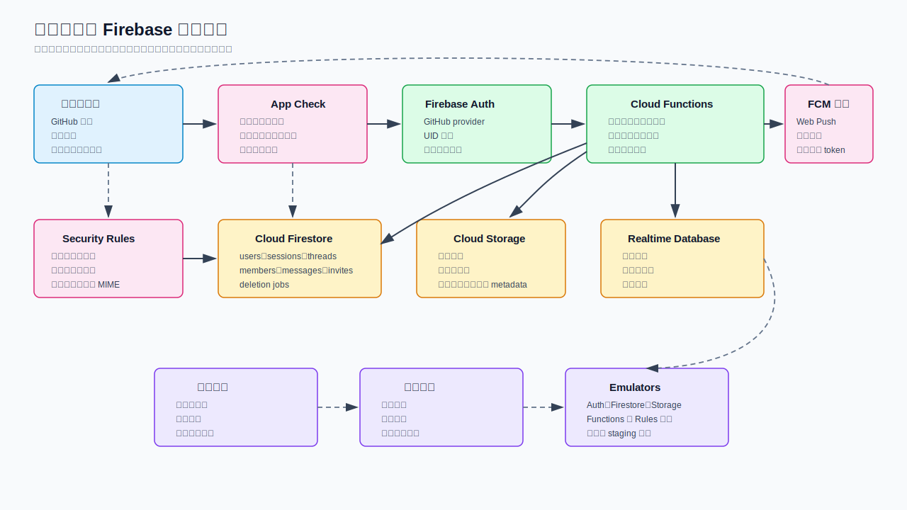
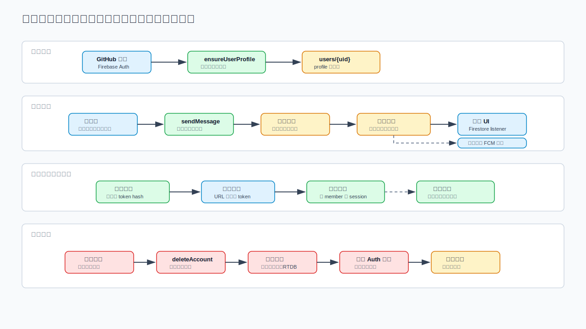

> Language: 简体中文
> Canonical source: ../en/discussion-chat-firebase-plan.md
> Translation status: current

# 官网讨论区聊天功能 Firebase 接入方案

更新日期：2026-06-27

## 1. 文档定位

本文定义如何在官网讨论区加入基于 Firebase 的聊天功能，覆盖 GitHub
登录、首次登录自动分配中文名、可修改昵称、账号注销、单聊、群聊、文本、
图片、表情包、会话列表、FCM 推送通知、群聊匿名模式，以及通过分享链接加入群聊。

## 2. 架构结论

推荐使用 Firebase Authentication 承担 GitHub 登录，Cloud Firestore 承担会话、
成员、消息、邀请链接和会话列表，Cloud Storage 承担聊天图片和表情包资源，
Cloud Functions 承担特权写入和账号注销，Firebase Security Rules 承担浏览器
读写边界，App Check 降低滥用风险，Firebase Cloud Messaging 用于离线和后台通知。
Realtime Database 只用于在线状态和输入中状态。

客户端通过 Firestore realtime listener 读取聊天数据，但关键写入走 Cloud
Functions。这样可以把成员校验、邀请链接校验、会话列表投影、匿名名分配、账号
注销等逻辑放在可信服务端，而不是浏览器代码里。FCM 只作为通知通道，不能作为消息
存储或顺序依据；消息内容、顺序、未读状态和成员关系仍以 Firestore 为准。

## 3. 架构图



## 4. 需求映射

| 需求 | 设计选择 | 验收标准 |
| --- | --- | --- |
| GitHub 登录 | Firebase Auth GitHub provider + 首次登录 profile 函数 | 首次登录创建 `users/{uid}`，并只自动分配一次随机中文名。 |
| 后续可修改名称 | `updateDisplayName` callable 校验后写入 profile | 用户可修改昵称；历史消息保留发送时的名称快照。 |
| 注销账号 | `deleteAccount` callable 删除 Auth 用户、Firestore、RTDB、Storage 和会话投影中的用户数据 | 注销任务完成后，不再保留该 UID 拥有的文档、文件、成员关系、会话和消息。 |
| 单聊 | 用排序后的两个 UID 生成确定性 direct thread ID | 同一对用户重复创建单聊时返回同一个会话。 |
| 群聊 | `threads/{threadId}` + `members` 子集合 | 群成员可读写，非群成员不能读取私有群数据。 |
| 图片/文本/表情包 | 统一消息结构，`type=text/image/sticker` | 文本限长；图片进入 Cloud Storage；表情包只能引用已审核的 sticker catalog。 |
| 会话列表 | `users/{uid}/sessions/{threadId}` 用户侧投影 | 用户用一次按 `lastMessageAt` 排序的查询加载最近会话。 |
| FCM 推送通知 | 每个用户/设备登记 FCM Web Push token | 用户离线或页面在后台时收到通知，但不把 FCM 当消息库使用。 |
| 群聊匿名模式 | 每个群成员单独保存匿名配置 | 开启后，该群内展示随机匿名中文名；后台仍保留 UID 用于风控和注销。 |
| 分享链接加群 | 随机 token，数据库只保存 token hash | 点击链接并确认后，合法 token 才能把用户加入群聊。 |
| 使用 Firebase | Firebase Web SDK + Functions/Admin SDK | 本地 emulator 和 staging 项目覆盖 Auth、Firestore、Storage、Functions 和 Rules 后再上线。 |

## 5. Firebase 服务分工

| 服务 | 用途 | 说明 |
| --- | --- | --- |
| Firebase Authentication | GitHub OAuth 登录、UID 身份、账号注销对象 | 在 Firebase console 启用 GitHub provider，并把 Firebase OAuth callback URL 配到 GitHub OAuth app。 |
| Cloud Firestore | 会话、成员、消息、邀请、会话列表、注销任务 | 使用子集合隔离消息历史和成员校验。 |
| Cloud Storage | 聊天图片、表情包二进制资源 | 文件 metadata 必须包含 `ownerUid`、`threadId`、`messageId`；Rules 拒绝过大或非图片上传。 |
| Cloud Functions | 特权命令和反范式投影 | 负责 profile、发消息、建群、邀请、加群、匿名模式、注销等可信写入。 |
| Firebase Cloud Messaging | 离线和后台浏览器通知 | 每个用户保存 Web Push token，消息写入后由 Admin SDK 发送；私聊和私有群不建议用 FCM topics。 |
| Realtime Database | 在线状态、输入中状态 | Firestore 可实时监听消息，但连接状态更适合用 RTDB presence 模式。 |
| Security Rules | 浏览器读写边界 | 只允许已认证成员读取会话，写入范围尽量收窄。 |
| App Check | 降低脚本滥用 | 生产客户端注册完成后，对 callable functions 和 Storage 上传强制校验。 |

## 6. 用户流程

### 6.1 GitHub 登录与首次中文名分配

1. 浏览器调用 Firebase Auth 的 GitHub 登录。
2. Auth 返回 UID 后，客户端调用 `ensureUserProfile`。
3. 函数检查 `users/{uid}` 是否存在。
4. 如果不存在，随机分配一个中文显示名，保存产品允许保留的 GitHub provider
   元数据，并创建默认设置。
5. 后续登录只刷新安全的 profile 元数据，不重新随机分配名称。

中文名建议使用项目内置名单，不依赖外部服务，避免登录链路增加不可控依赖。名单要人工
筛选，避免尴尬或冒犯性组合，例如：`晴川`、`知言`、`松月`、`安澜`、`云舟`、
`南星`。

### 6.2 账号注销

注销必须由特权 Cloud Function 完成，不能让浏览器自行批量删除。函数应要求用户近期
重新登录，先把 `users/{uid}.deletion.status` 标记为 `running`，然后删除用户上传的
聊天图片、删除或移除用户发送的所有消息、移除群成员关系、删除不应继续保留的单聊
会话、删除会话列表投影、删除在线状态，最后删除 Firebase Auth 用户。

如果严格理解“删除账号的所有数据”，应删除该用户发送的消息和媒体，而不是只把作者改成
“已注销用户”。如果未来产品需要合规留存，应单独设计留存边界，并避免留存在普通产品
数据库中。

### 6.3 单聊

单聊创建应幂等：

```text
directThreadId = "direct_" + sha256(min(uidA, uidB) + ":" + max(uidA, uidB))
```

`createDirectThread(targetUid)` 创建或返回现有 thread，并为两个用户创建
`sessions` 投影。用户只能和有效、未注销的用户创建单聊。

### 6.4 群聊与分享链接

建群调用 `createGroup(title, settings)`。群管理员调用
`createGroupInvite(threadId, expiresAt, maxUses)` 后得到分享链接：

```text
https://example.com/chat/join?token=<random-token>
```

数据库只保存 token hash：`invites/{tokenHash}`。`acceptGroupInvite` 会对传入
token 做 hash，检查过期时间、撤销状态、使用次数和群状态，通过后创建
`threads/{threadId}/members/{uid}` 和用户侧 `sessions` 投影。

### 6.5 群聊匿名模式

匿名模式只在单个群内生效。每个成员文档保存：

```json
{
  "anonymous": {
    "enabled": true,
    "name": "匿名松月",
    "seedVersion": 1,
    "enabledAt": "serverTimestamp"
  }
}
```

用户发送群消息时，`sendMessage` 会把可见发送者名称快照写入消息。其他成员看到
`匿名松月`；Cloud Functions 和后台审计仍保留 `senderUid`，用于风控、投诉处理和账号
注销。这是产品层匿名，不是密码学匿名。

### 6.6 FCM 推送通知

可以用 FCM 做聊天通知，但不能用它替代 Firestore 消息读取。推荐流程：

1. 浏览器只在用户主动开启通知时请求 notification permission。
2. 客户端注册 service worker，并获取 FCM Web Push token。
3. 客户端调用 `registerNotificationToken`，提交 token 和设备元数据。
4. `sendMessage` 先写入 Firestore message 和 sessions 投影。
5. 函数解析收件人，过滤发送者、已静音会话、关闭通知的用户、正在查看当前会话的用户、
   已注销账号。
6. 函数向剩余 registration tokens 发送 FCM 通知。
7. FCM 返回无效或过期 token 时，函数清理对应 token 记录。

私聊和私有群建议按用户 token 发送，不建议用 FCM topics。Topics 更适合公开广播；私有群
如果用 topics，成员移除、邀请撤销和权限变化很难做到完全同步。

通知 payload 默认不要泄露敏感正文。安全基线是只发送通用文案，例如“你有一条新消息”，
并携带跳转所需 data 字段：

```json
{
  "data": {
    "threadId": "thread_123",
    "messageId": "msg_456",
    "type": "chat_message"
  }
}
```

如果后续要加消息预览，应做成用户设置，并在匿名消息、静音会话、锁屏等场景下默认关闭。

## 7. 数据模型

| 路径 | 类型 | 关键字段 | 写入方 |
| --- | --- | --- | --- |
| `users/{uid}` | 文档 | `displayName`、`githubProviderUid`、`photoURL`、`status`、`notificationSettings`、`createdAt`、`updatedAt`、`deletion` | Profile service |
| `users/{uid}/notificationTokens/{tokenHash}` | 文档 | `token`、`platform`、`permission`、`createdAt`、`lastSeenAt`、`lastError`、`disabledAt` | Notification service |
| `users/{uid}/sessions/{threadId}` | 文档 | `threadId`、`type`、`title`、`avatar`、`lastMessage`、`lastMessageAt`、`unreadCount`、`muted`、`pinned` | Projection function |
| `threads/{threadId}` | 文档 | `type`、`title`、`createdBy`、`createdAt`、`memberCount`、`lastMessage`、`settings`、`anonymousPolicy` | Thread service |
| `threads/{threadId}/members/{uid}` | 文档 | `role`、`joinedAt`、`lastReadAt`、`anonymous`、`state` | Membership service |
| `threads/{threadId}/messages/{messageId}` | 文档 | `senderUid`、`senderMode`、`senderDisplayName`、`type`、`text`、`attachments`、`createdAt`、`deletedAt` | Message service |
| `invites/{tokenHash}` | 文档 | `threadId`、`createdBy`、`expiresAt`、`maxUses`、`uses`、`revokedAt` | Invite service |
| `stickerPacks/{packId}/stickers/{stickerId}` | 文档 | `name`、`storagePath`、`thumbPath`、`enabled`、`sort` | Admin content service |
| `deletionJobs/{jobId}` | 文档 | `uid`、`status`、`startedAt`、`finishedAt`、`error`、`counts` | Account deletion service |
| `rtdb:/status/{uid}` | RTDB 节点 | `state`、`lastChanged`、`activeThreadId` | Presence mirror |

## 8. 消息结构

| 字段 | 是否必填 | 说明 |
| --- | --- | --- |
| `senderUid` | 是 | 用于注销、限流和风控；匿名模式下不直接展示给普通成员。 |
| `senderMode` | 是 | `normal` 或 `anonymous`。 |
| `senderDisplayName` | 是 | 发送时快照，避免客户端读取消息时再 join profile。 |
| `type` | 是 | `text`、`image` 或 `sticker`。 |
| `text` | 文本消息必填 | 规范化空白并限长，例如 2,000 字符。 |
| `attachments[]` | 图片消息必填 | Storage path、content type、宽高、字节数、审核状态。 |
| `sticker` | 表情包消息必填 | 已审核的 pack ID 和 sticker ID。 |
| `createdAt` | 是 | 只能使用服务端时间。 |
| `deletedAt` | 可选 | 如保留 tombstone 才写入；严格删除则直接删除文档。 |

## 9. Cloud Functions 清单

| 函数 | 调用方 | 主要校验 | 写入内容 |
| --- | --- | --- | --- |
| `ensureUserProfile` | 已登录用户 | auth context 中的 UID；用户文档可不存在 | `users/{uid}` |
| `updateDisplayName` | 已登录用户 | 长度、敏感词、频率限制 | `users/{uid}.displayName` |
| `deleteAccount` | 已登录用户 | 近期登录、本人操作、幂等 | 删除 Auth、Firestore、Storage、RTDB 中的用户数据 |
| `createDirectThread` | 已登录用户 | 目标用户存在且 active | thread、members、双方 sessions |
| `createGroup` | 已登录用户 | 群名和设置合法 | thread、创建者 membership、创建者 session |
| `createGroupInvite` | 群管理员 | admin 角色、过期时间、使用次数 | `invites/{tokenHash}` |
| `acceptGroupInvite` | 已登录用户 | token hash、过期、次数、群状态 | member、session、invite usage |
| `setAnonymousMode` | 群成员 | 群允许匿名 | member anonymous 字段 |
| `sendMessage` | 会话成员 | 成员身份、内容类型、大小、限流 | message、thread last message、sessions 投影 |
| `registerNotificationToken` | 已登录用户 | token 格式、App Check、owner UID 唯一 | 用户 notification token 文档 |
| `unregisterNotificationToken` | 已登录用户 | token 属于调用者 | 禁用或删除 token 文档 |
| `notifyThreadMembers` | 内部函数 | 收件人是有效成员且允许通知 | FCM 发送结果和失效 token 清理 |
| `markThreadRead` | 会话成员 | 成员身份 | member `lastReadAt`、session `unreadCount=0` |

## 10. Security Rules 边界

| 资源 | 读取规则 | 写入规则 |
| --- | --- | --- |
| `users/{uid}` | 用户可读自己的 profile；公开 profile 应单独做脱敏投影 | 用户只能写安全偏好；昵称修改走 function。 |
| `users/{uid}/notificationTokens/{tokenHash}` | 只有 owner UID 可读 | 推荐走 Cloud Functions；如果允许直接写，只允许 owner 写自己的 token metadata。 |
| `users/{uid}/sessions/{threadId}` | 只有 owner UID 可读 | 只有 Cloud Functions/Admin SDK 可写。 |
| `threads/{threadId}` | 只有会话成员可读 | 只有 Cloud Functions/Admin SDK 可写，必要时开放极窄字段。 |
| `threads/{threadId}/members/{uid}` | 只有会话成员可读 | 只有 Cloud Functions/Admin SDK 可写；可选开放本人 `lastReadAt`。 |
| `threads/{threadId}/messages/{messageId}` | 只有会话成员可读 | 推荐只允许 `sendMessage` function 写入 canonical message。 |
| `invites/{tokenHash}` | 浏览器不能直接读取 | 只有 Cloud Functions/Admin SDK 可写。 |
| Storage `chat/{threadId}/{messageId}/{file}` | 只有会话成员可读 | 上传者只能上传 pending 图片，并限制 content type 和大小；function 负责最终 metadata。 |

Rules 建议共享以下谓词：

```text
isSignedIn()
isThreadMember(threadId)
isSelf(uid)
isAdminWrite()
```

Admin SDK 会绕过 Security Rules，因此每个 Cloud Function 在写入前都必须重复做业务授权
校验。

## 11. 前端接入模块

| 模块 | 职责 |
| --- | --- |
| `auth/GitHubSignIn` | 发起 GitHub 登录，监听 auth state，调用 `ensureUserProfile`。 |
| `chat/ConversationList` | 监听 `users/{uid}/sessions`，按 `lastMessageAt` 排序。 |
| `chat/ThreadView` | 分页监听 `threads/{threadId}/messages`，并做成员态保护。 |
| `chat/MessageComposer` | 校验文本、图片、表情包输入，然后调用 `sendMessage`。 |
| `chat/InviteJoinPage` | 从 URL 读取 token，调用 `getInvitePreview` 展示安全预览，再调用 `acceptGroupInvite`。 |
| `settings/Profile` | 修改显示名，发起账号注销。 |
| `presence/usePresence` | 写入 RTDB presence，并在 UI 需要时订阅在线状态。 |
| `notifications/useFcmRegistration` | 请求通知权限，注册 service worker，获取 FCM token，处理 token 刷新，登出时注销 token。 |

## 12. 实时消息、投影与通知流程图



## 13. 索引与查询策略

| 查询 | 索引 |
| --- | --- |
| 用户会话列表 | `users/{uid}/sessions` 按 `lastMessageAt desc` 排序 |
| 消息分页 | `threads/{threadId}/messages` 按 `createdAt desc` 排序 |
| 群成员列表 | `threads/{threadId}/members` where `state == "active"`，按 `joinedAt asc` 排序 |
| 注销任务查询 | `deletionJobs` where `uid == <uid>`，按 `startedAt desc` 排序 |
| 表情包列表 | `stickerPacks/{packId}/stickers` where `enabled == true`，按 `sort asc` 排序 |
| 通知 token | `users/{uid}/notificationTokens` where `disabledAt == null`，按 `lastSeenAt desc` 排序 |

不要为了会话列表去全局查询 `threads` 的成员 map。用户侧 `sessions` 投影更便宜、更容易
分页，也更容易写 Security Rules。

## 14. 分阶段落地计划

| 阶段 | 范围 | 退出标准 |
| --- | --- | --- |
| P0 基础 | Firebase 项目、GitHub Auth provider、emulator、App Check、基础 Rules | 本地 emulator 可登录、建 profile，并拒绝未登录读取。 |
| P1 单聊 | users、direct threads、文本消息、会话列表 | 两个用户可单聊；未读数和 last message 投影正确更新。 |
| P2 通知 | FCM service worker、token 登记、通知设置、失效 token 清理 | 后台用户可收到通知；静音会话和当前打开会话不通知。 |
| P3 媒体与表情包 | Storage 上传、审核过的 sticker catalog、图片预览 | 非法 MIME/超大上传被拒绝；图片能在会话中展示。 |
| P4 群聊 | 建群、成员关系、分享邀请链接 | 链接加群可用；撤销、过期、次数耗尽的链接失败。 |
| P5 匿名模式 | 群内匿名开关和匿名名分配 | 匿名名只在该群展示，并且后台可审计。 |
| P6 账号注销 | 端到端注销任务 | Auth 用户、profile、notification tokens、成员关系、sessions、消息、媒体和 presence 都被删除。 |
| P7 加固 | 限流、审核钩子、告警、备份策略 | 函数错误和异常发送频率在上线前可观测。 |

## 15. 测试计划

| 层级 | 用例 |
| --- | --- |
| Unit | 中文名生成、邀请 token hash、direct thread ID、消息校验、匿名展示名选择。 |
| Rules | 成员/非成员读取、session 隔离、Storage content-type/size 拒绝、invite 不可直接读取。 |
| Function integration | 创建单聊、建群、接受邀请、发消息投影、FCM 收件人过滤、失效 token 清理、修改昵称、账号注销幂等。 |
| Client e2e | GitHub 登录 mock/emulator、会话列表、单聊、FCM 权限流程、群链接加入、匿名发送、图片发送、注销 UX。 |
| Load smoke | 消息发送频率、首发群规模下的 session 投影 fanout。 |

## 16. 风险与缓解

| 风险 | 影响 | 缓解 |
| --- | --- | --- |
| 大群消息 fanout 导致 Firestore 写入成本升高 | 成本和函数延迟上升 | 初期限制群规模，批量写投影，后续把未读统计改成惰性计数。 |
| 用户误以为匿名是绝对匿名 | 信任风险 | UI 文案明确：对普通成员匿名，后台安全系统仍可追踪滥用。 |
| 注销与历史会话完整性冲突 | 旧会话上下文缺失 | 产品决策优先严格删除；若 UX 需要，只保留不含 UID 的 tombstone。 |
| 图片滥用或恶意文件 | 安全和存储成本 | 限制 MIME/大小，服务端生成缩略图，大规模开放前增加审核队列。 |
| 邀请链接泄露 | 群聊被刷入 | token hash、过期时间、使用次数、撤销按钮、仅管理员创建。 |
| 客户端绕过校验直接写入 | 安全漏洞 | canonical 写入走 Cloud Functions，Firestore 直接写尽量只读或极窄开放。 |
| 通知泄露消息正文 | 隐私风险 | 默认使用通用通知正文；消息预览做成用户 opt-in，并在匿名或静音场景关闭。 |
| FCM token 失效 | 无效发送和错误日志增加 | 记录 `lastSeenAt`，按发送错误清理 token，登出和账号注销时注销 token。 |
| 浏览器拒绝通知权限 | 无后台提醒 | 聊天主流程不依赖 FCM，并在设置页提供重新开启通知入口。 |

## 17. 参考资料

- Firebase Authentication GitHub provider：<https://firebase.google.com/docs/auth/web/github-auth>
- Firebase Security Rules：<https://firebase.google.com/docs/rules>
- Cloud Firestore realtime listeners：<https://firebase.google.com/docs/firestore/query-data/listen>
- Cloud Storage web uploads：<https://firebase.google.com/docs/storage/web/upload-files>
- Callable Cloud Functions：<https://firebase.google.com/docs/functions/callable>
- Firebase Cloud Messaging for Web：<https://firebase.google.com/docs/cloud-messaging/js/client>
- Firebase Cloud Messaging send messages：<https://firebase.google.com/docs/cloud-messaging/send/admin-sdk>
- FCM registration token management：<https://firebase.google.com/docs/cloud-messaging/manage-tokens>
- Firebase App Check：<https://firebase.google.com/docs/app-check>
- Firebase presence solution：<https://firebase.google.com/docs/firestore/solutions/presence>
- Delete User Data extension：<https://firebase.google.com/products/extensions/delete-user-data>
