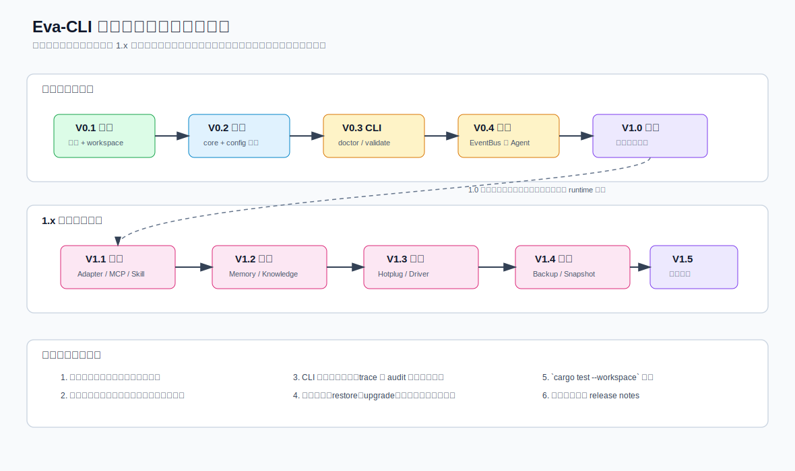
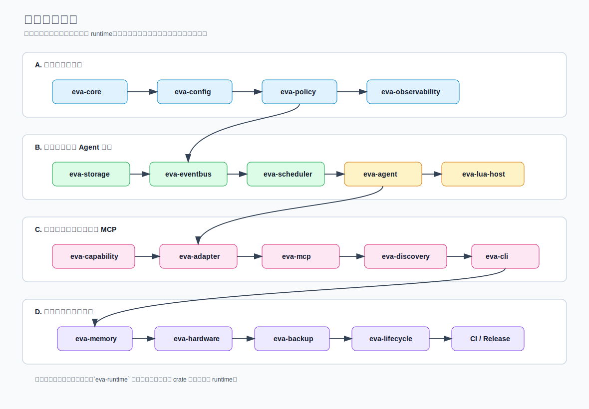
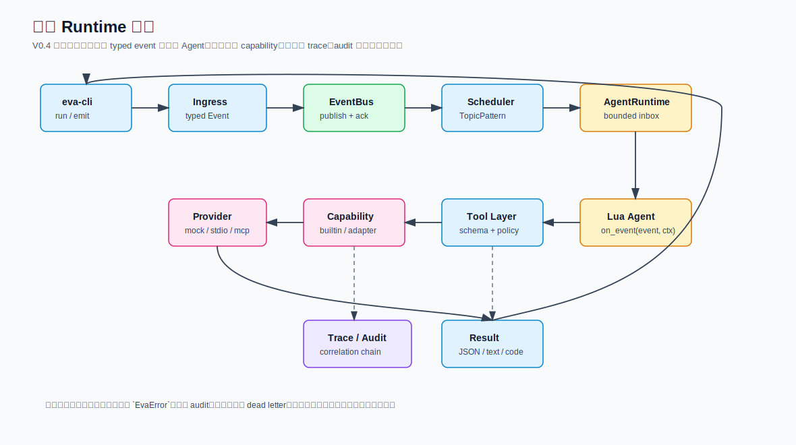

> Language: 简体中文
> English default entry: [../en/full-implementation-plan.md](../en/full-implementation-plan.md)
> Translation status: current

# Eva-CLI 当前项目从零到完整实现实施计划
更新时间：2026-07-03

本文把仓库从“已有架构文档和 Rust workspace 骨架”推进到“1.0 可发布核心”和“完整 1.x 架构补齐”的实施顺序拆成可执行版本计划。它不是现有架构文档的替代品，而是把这些文档收敛成工程里程碑、验收口径和验证命令。

当前基线来自仓库实际状态：

- Rust workspace 已包含 19 个 crate。
- `eva-core` 已实现 Topic、ID、Event、Invoke、Capability 和结构化错误等基础契约。
- `eva-config` 已实现 `eva.yaml`、Agent/Adapter/Capability manifest 载入，以及跨文件校验。
- `eva-cli` 已实现 V0.3 最小开发闭环：`doctor`、`config validate`、`inspect`、`run` 命令解析、文本/JSON 输出、trace 字段和 exit code 映射。
- `eva-runtime` 已实现 V0.3 no-op 组合根：`RuntimeBuilder`、`RuntimeSummary`、`RuntimeServices` 和幂等 `shutdown()`。
- `cargo test --workspace` 仍是后续阶段最重要的回归门禁之一。

## 1. 版本路线图总览



| 版本 | 主题 | 目标状态 | 主要交付物 | 退出标准 |
| --- | --- | --- | --- | --- |
| V0.1 | 项目基线 | 完成 | 架构文档、workspace、crate 边界、静态配置样例 | 文档入口清晰，workspace 可检查 |
| V0.2 | 契约与配置稳定 | 完成 | `eva-core` / `eva-config` / `eva-policy` / `eva-observability` 的基础契约 | 契约测试通过，配置可加载可校验 |
| V0.3 | 最小 CLI 与开发展示闭环 | 完成 | `doctor`、`config validate`、`inspect`、`run`、结构化输出、exit code、no-op runtime builder | CLI 能诊断环境和配置，runtime 摘要可被读取 |
| V0.4 | 最小 runtime 闭环 | 完成 | in-memory EventBus、Scheduler、Agent mailbox、受控 Lua on_event、builtin capability、`run --example basic` | `examples/basic/` 可端到端跑通 |
| V0.5 | 可观测性与加固 | 待实现 | trace / audit / dead letter / timeout / cancel / retry | 失败路径可诊断、可回放、可审计 |
| V1.0 | 核心发布 | 待实现 | 安装说明、quickstart、CI、release notes、已知限制 | 新用户可安装并跑通核心示例 |
| V1.1 | 外部能力生态 | 待实现 | Adapter、MCP、Skill、Discovery | 外部能力可发现、可 probe、可受控调用 |
| V1.2 | 记忆与知识 | 待实现 | MemoryService、KnowledgeService、ContextBuilder | Agent 可通过受控 API 读取上下文 |
| V1.3 | 硬件接入 | 待实现 | HardwareDiscovery、DeviceRegistry、DriverBinding、hotplug | 设备仅通过 HardwareAdapter 暴露 |
| V1.4 | 备份与进程生命周期 | 待实现 | Backup、MigrationPackage、ReleaseSnapshot、Supervisor、rollback | 恢复与升级可计划、可审计、可回滚 |
| V1.5 | 完整发布加固 | 待实现 | 跨平台验证、安全评审、迁移指引、性能基线 | 1.x 能力形成稳定公开承诺 |

## 2. 模块实施顺序



实施顺序建议遵循四条规则：

1. 先稳定契约，再补行为。
2. 先跑通一条窄闭环，再扩展到外部能力。
3. `eva-runtime` 只做组合根，下层 crate 不反向依赖 runtime。
4. 每次只扩大一类命令行为，并补齐对应测试和文档。

## 3. 项目级进度表

| 模块 | 当前状态 | 基线证据 | 目标版本 | 说明 |
| --- | --- | --- | --- | --- |
| 文档与官网 | 完成 | `docs/`、`website/`、`wiki/` 已存在 | V0.1 | 继续同步实现变化和中英文入口 |
| Workspace | 完成 | 根 `Cargo.toml` 和 19 个 crate | V0.1 | 依赖方向已分层 |
| 静态配置样例 | 完成 | `config/` 下的样例和 schema | V0.1 | 可直接复用到后续加载与校验 |
| `eva-core` | 完成 | Topic、ID、Event、Invoke、Capability、Error | V0.2 | 作为跨 crate 契约层 |
| `eva-config` | 完成 | `eva.yaml` 加载、manifest 反序列化、project 校验 | V0.2 | 为 CLI 和 runtime 提供输入 |
| `eva-policy` | 完成 | Permission / Sandbox / EffectivePolicy | V0.2 | 作为权限收敛边界 |
| `eva-observability` | 完成 | TraceFields / AuditEvent / MetricPoint | V0.2 | 为 CLI JSON 和 runtime 审计复用 |
| `eva-cli` | 完成 V0.4 | `doctor`、`config validate`、`inspect`、`run --example basic`、JSON envelope、exit code 已实现 | V0.4 | V0.5 接 task status/logs/cancel |
| `eva-runtime` | 完成 V0.4 | no-op runtime、in-memory V0.4 builder、`run_basic`、service summary、幂等 shutdown 已实现 | V0.4 | V0.5 接 timeout/cancel/retry |
| `eva-storage` | 完成 V0.4 | `InMemoryEventLog`、`InMemoryStateStore`、`InMemoryArtifactStore` | V0.4 | 后续接 durable backend |
| `eva-eventbus` | 完成 V0.4 | `InMemoryEventBus`、publish、ack/fail、dead-letter queue | V0.4 | 后续接 backpressure/replay |
| `eva-scheduler` | 完成 V0.4 | route rule、TopicPattern 匹配、direct target、bounded mailbox | V0.4 | 后续接公平竞争和 drain |
| `eva-agent` | 完成 V0.4 | lifecycle、bounded queue、同步 `AgentRuntime::run_next` | V0.4 | 后续接 task status/cancel |
| `eva-lua-host` | 完成 V0.4 | loader、sandbox denylist、受控 `on_event` table-return contract | V0.4 / V0.5 | V0.5 接真实 Lua VM 和 hot reload |
| `eva-capability` | 完成 V0.4 | registry、router、`CapabilityHostApi`、`config.lint`/`runtime.echo` builtin | V0.4 | 后续接外部 provider |
| `examples/basic` | 完成 V0.4 | 完整最小 Eva workspace | V0.4 | 作为最小闭环示例 |
| `eva-adapter` / `eva-mcp` / `eva-discovery` | 骨架 | 边界文件已建 | V1.1 | 作为外部能力层 |
| `eva-memory` | 骨架 | 边界文件已建 | V1.2 | 作为上下文和知识层 |
| `eva-hardware` | 骨架 | 边界文件已建 | V1.3 | 作为设备接入层 |
| `eva-backup` / `eva-lifecycle` | 骨架 | 边界文件已建 | V1.4 | 作为恢复与生命周期层 |

## 4. V0.2 契约与配置稳定计划

目标：把 `eva-core`、`eva-config`、`eva-policy` 和 `eva-observability` 的基础契约收敛成后续 runtime 依赖的稳定输入。

| 模块 | 任务 | 验收口径 |
| --- | --- | --- |
| `eva-core` | 统一 Topic、ID、Event、Invoke、Capability、EvaError 契约 | 跨 crate 使用同一套类型，不再散落临时结构 |
| `eva-config` | 统一 schema 字段和 manifest 字段命名 | 反序列化、校验、错误定位一致 |
| `eva-policy` | 定义权限收敛和合并规则 | 只允许逐层收紧，不允许无控制扩张 |
| `eva-observability` | 定义 trace / audit / metric 字段 | CLI 和 runtime 使用同一套结构化字段 |

建议动作：

1. 对齐文档、schema 和 Rust 类型的命名。
2. 为配置、manifest、policy 的关键路径补齐单元测试。
3. 保持契约层不依赖 runtime。
4. 先跑 `cargo test --workspace` 再进入 CLI / runtime 行为层。

## 5. V0.3 最小 CLI 与 no-op runtime 完成记录

目标：让开发者能通过 CLI 诊断环境、校验配置、查看系统摘要，并把 validated config 交给 runtime 组合根，但不在这一阶段启动真实事件闭环。该目标已经完成，真实 EventBus/Agent/Lua 执行留给 V0.4。

### 5.1 已实现命令树

| 命令 | 责任 | 目标输出 | 退出码 |
| --- | --- | --- | --- |
| `doctor` | 检查 workspace、配置根、schema、Lua host crate 边界、no-op runtime builder 和外部 adapter 声明 | 人类可读诊断 + JSON 诊断 | `0` / `2` |
| `config validate` | 仅做配置、manifest、routes 和 policy document 加载校验 | 结构化诊断 + 错误定位 | `0` / `2` |
| `inspect config` | 展示 effective config | 配置摘要和关键路径 | `0` |
| `inspect routes` | 展示 Topic / route 走向 | 路由摘要和优先级 | `0` |
| `inspect policy` | 展示 effective policy | 权限收敛摘要 | `0` |
| `inspect runtime` | 展示 no-op runtime 摘要 | runtime / service summary | `0` / `5` |
| `run` | 构造 no-op runtime 后返回当前版本不支持真实事件循环 | 结构化 `Unsupported` 错误 | `2` / `4` |

`emit`、`agent`、`adapter`、`capability` 这些模块在 V0.3 仍然只冻结边界，不承诺稳定用户行为。

### 5.2 输出契约

#### 文本模式

- 默认适合 TTY。
- 结构顺序建议是：结论、关键摘要、定位信息、下一步建议。
- `--verbose` 只扩展诊断，不暴露 secret、token、raw payload 或 provider 私有错误。

#### JSON 模式

目标 JSON 顶层字段如下：

```json
{
  "status": "ok",
  "data": {},
  "error": null,
  "trace_id": "..."
}
```

- `status` 使用稳定枚举：`ok`、`planned`、`accepted`、`blocked`、`failed`。
- `data` 只承载机器可读结果。
- `error` 只在失败或受阻时出现。
- `trace_id` 贯穿 CLI、runtime、audit 和日志。

当前实现说明：V0.3 代码已经采用 CLI JSON envelope，而不是上面的早期草案字段。成功路径包含 `ok`、`command`、`exit_code`、`data`、`trace`；错误路径包含 `ok`、`command`、`exit_code`、`error`、`trace`。`error` 内保留 `kind`、`message`、`retryable`、`provider_code`、`context` 和 `suggestion`。后续文档清理时应以当前实现字段为准。

### 5.3 Exit code 约定

| Code | 含义 |
| --- | --- |
| `0` | 成功。 |
| `1` | 内部错误或 CLI 输出失败。 |
| `2` | 配置、路径、manifest、routes 或 schema 相关错误。 |
| `3` | policy 拒绝请求。 |
| `4` | runtime 当前不可用或能力尚未实现。 |
| `5` | 预留给外部能力不可用，V0.3 暂不返回。 |
| `64` | 命令用法错误，例如未知命令、未知选项或缺少参数值。 |

### 5.4 no-op runtime builder

V0.3 的 `RuntimeBuilder` 只做组合，不做真实执行：

1. CLI 解析命令行并加载已验证配置。
2. builder 接收 `ProjectConfig`、effective policy 和运行参数。
3. builder 产出 `RuntimeSummary`、`ServiceSummary` 和 inert runtime handle。
4. 这一阶段不启动 EventBus、Scheduler、Agent、Lua host 或任何外部 I/O。
5. `Runtime::shutdown()` 必须幂等，并且在 no-op build 下也能返回稳定结果。

`inspect runtime` 和 `run` 必须复用同一条组合根路径，这样 CLI 才能在 V0.3 就读到 runtime 摘要，而不引入真实副作用。

### 5.5 验证命令

| 命令 | 目标 |
| --- | --- |
| `cargo test -p eva-cli` | 验证 CLI crate 能编译，模块边界和导出关系稳定。 |
| `cargo test -p eva-runtime` | 验证 runtime 组合根、summary 和 shutdown 契约。 |
| `cargo test --workspace` | 验证 CLI/runtime 的变化不破坏 workspace。 |
| `cargo run -- doctor --output json` | V0.3 验收命令：环境诊断输出稳定 JSON。 |
| `cargo run -- config validate --output json` | V0.3 验收命令：配置校验输出稳定 JSON。 |
| `cargo run -- inspect runtime --output json` | V0.3 验收命令：runtime 摘要输出稳定 JSON。 |

### 5.6 V0.3 退出标准

V0.3 不是“实现所有 runtime 能力”，而是至少满足以下条件：

- `eva doctor`、`eva config validate`、`eva inspect`、`eva run` 的命令树和帮助信息可用。
- 文本输出和 JSON 输出都稳定，且 machine-readable 字段不随人类文案变化。
- exit code 与错误类型一一对应。
- runtime builder 可从 validated config 产出 summary。
- 验证命令可在 CI 中作为门禁使用。

## 6. V0.4 最小 runtime 闭环完成记录



目标：从 CLI 到 Lua capability 形成一条最小可运行闭环。

| 模块 | 任务 | 交付 |
| --- | --- | --- |
| `eva-storage` | in-memory event log / state store | 已支持 append / ack / fail / watermark / replay / CAS |
| `eva-eventbus` | publish / ack / fail / dead letter | 已实现 in-memory bus 和 dead-letter queue |
| `eva-scheduler` | subscription 和 mailbox 投递 | 已支持 direct target、TopicPattern、fanout、compete-first、bounded mailbox |
| `eva-agent` | queue、lifecycle、event handler | 已支持 bounded queue、running gate、注入 handler 执行 |
| `eva-lua-host` | 最小 Lua `on_event` | 已实现受控 table-return contract 和危险 token denylist |
| `eva-capability` | builtin capability | 已实现 `config.lint` 和 `runtime.echo` builtin |
| `eva-runtime` | service wiring | 已实现 `RuntimeBuilder::in_memory_v04()` 和 `Runtime::run_basic` |
| `eva-cli` | `run` 示例 | 已实现 `eva run --example basic` 文本/JSON 输出 |
| `examples/basic` | 最小闭环示例 | 已提供完整可加载 Eva workspace |

闭环验收顺序：

1. CLI 构造 typed event。
2. EventBus 发布事件并保存最小恢复元数据。
3. Scheduler 根据 TopicPattern 找到目标 Agent。
4. Agent 消费 bounded inbox。
5. Lua `on_event(event, ctx)` 执行。
6. Lua 调用受控 Rust capability。
7. capability 返回结构化结果。
8. Runtime 输出 trace、audit 和结构化错误。
9. 集成测试覆盖成功路径和至少一条失败路径。

V0.4 当前验证入口：

- `cargo test -p eva-storage`
- `cargo test -p eva-eventbus`
- `cargo test -p eva-scheduler`
- `cargo test -p eva-agent`
- `cargo test -p eva-lua-host`
- `cargo test -p eva-capability`
- `cargo test -p eva-runtime`
- `cargo test -p eva-cli`
- `cargo run -- run --example basic --output json`

当前非目标：不实现 Adapter/MCP/Discovery/Memory/Hardware/Backup/Lifecycle；不引入真实 Lua VM；不提供 durable crash recovery；不提供 task cancel/timeout/retry UI。

## 7. V0.5 可观测性与加固计划

目标：让最小闭环不仅“能跑”，还“能诊断、能重试、能回放、能审计”。

| 模块 | 任务 | 交付 |
| --- | --- | --- |
| `eva-observability` | trace chain 和 audit sink | 统一贯穿 runtime 链路 |
| `eva-eventbus` | dead letter 和 replay | 失败事件可查询可回放 |
| `eva-agent` | timeout / cancel / retry | 超时进入结构化失败 |
| `eva-lua-host` | sandbox 限制和热更新雏形 | 禁用危险库，校验 generation |
| `eva-cli` | `task status/logs/cancel` 最小面 | 可观察长任务 |

## 8. V1.0 核心发布计划

目标：发布一个稳定的核心 CLI，而不是把所有远期能力都做完。

V1.0 必须包含：

- `eva doctor`
- `eva config validate`
- `eva run`
- 最小 Agent runtime 闭环
- manifest / policy / Lua host API 的版本化契约
- 结构化错误、trace 和 audit
- `examples/basic/` 和回归测试
- 安装与 quickstart 文档

## 9. V1.1 外部能力生态计划

目标：把外部能力接入从“文档和占位”推进到“受控可用”。

| 模块 | 任务 | 交付 |
| --- | --- | --- |
| `eva-adapter` | AdapterRegistry / AdapterRouter | capability/provider 路由可测 |
| `eva-adapter` | builtin / stdio / http transport | 外部命令和 HTTP 通过 manifest 调用 |
| `eva-mcp` | MCP client 和 tool allowlist | 外部 MCP tool 可 probe 和受控调用 |
| `eva-mcp` | Eva MCP server 最小工具 | 暴露受控 API |
| `eva-adapter` | SkillAdapter | workflow skill 受控调度 |
| `eva-discovery` | Adapter / MCP / Skill 发现 | discovery candidate 与授权 handle 分离 |
| CLI | `adapter list/probe`、`mcp list/probe`、`skill list/run` | 外部能力可见、可诊断、可受限调用 |

## 10. V1.2 记忆与知识计划

目标：让 Agent 可以使用受控上下文，而不是把 EventBus 变成隐式状态库。

| 模块 | 任务 | 交付 |
| --- | --- | --- |
| `eva-memory` | Agent 私有记忆 | 按 `agent_id` 隔离读写 |
| `eva-memory` | 系统总记忆库 | 共享事实可审计 |
| `eva-memory` | KnowledgeService | 文档和代码片段可索引 |
| `eva-memory` | ContextBuilder | request 级上下文组装 |
| `eva-lua-host` | `ctx.memory` / `ctx.global_memory` / `ctx.knowledge` | Lua 只能走受控 API |

## 11. V1.3 硬件接入计划

目标：通过 HardwareAdapter 安全接入外部设备，禁止 Lua 直接访问设备句柄和 raw IO。

| 模块 | 任务 | 交付 |
| --- | --- | --- |
| `eva-hardware` | 设备发现和身份匹配 | USB / 串口 / BLE / 网络设备候选可表达 |
| `eva-hardware` | DeviceRegistry 和 driver binding | logical binding、claim、release 可测 |
| `eva-hardware` | hotplug 状态机 | 插拔、重连、失败事件进入 EventBus |
| `eva-policy` | hardware policy | raw IO、设备路径、vendor SDK 权限受控 |
| `eva-adapter` | hardware transport | 设备调用经由 AdapterRuntime |
| CLI | `hardware list/probe/bind` | 高风险动作先 plan 后执行 |

## 12. V1.4 备份与进程生命周期计划

目标：让恢复、升级和切换变成 Runtime 可验证能力。

| 模块 | 任务 | 交付 |
| --- | --- | --- |
| `eva-backup` | BackupService / ArtifactStore | backup artifact 可验证 |
| `eva-backup` | MigrationPackageService | 迁移包 manifest 和 digest 可验证 |
| `eva-backup` | ReleaseSnapshotService | snapshot create / verify / restore plan |
| `eva-lifecycle` | supervisor / generation | 新旧 runtime generation 可切换 |
| `eva-lifecycle` | drain / rollback | 失败升级可回滚 |
| CLI | `snapshot`、`backup`、`restore plan`、`upgrade check` | 高风险动作一律先 plan 后 apply |

## 13. V1.5 完整发布加固计划

目标：把 1.x 能力推进到长期维护和对外承诺水平。

| 领域 | 任务 | 交付 |
| --- | --- | --- |
| 跨平台 | Windows / Linux / macOS 验证 | 安装、路径、shell、权限差异处理 |
| 安全 | policy、sandbox、secret、MCP、hardware 审计 | 安全评审报告和修复清单 |
| 性能 | EventBus / Scheduler / Adapter 延迟基线 | benchmark 和性能预算 |
| 稳定性 | 长任务、取消、重启恢复、dead letter 回放 | soak test 和故障注入 |
| 文档 | full-detail 英文迁移、API 文档、运维手册 | 公共文档不再只给摘要 |
| 发布 | release notes、migration guide、compat policy | 破坏性变更有迁移说明 |

## 14. 每个版本的固定实施流

每一版都按同一节奏推进：

1. 明确版本目标、非目标和可交付行为。
2. 补齐或更新契约测试，先锁定新行为边界。
3. 实现最小代码切片，优先复用现有 crate 边界。
4. 增加单元测试，再增加跨模块集成测试。
5. 更新中文详细文档、英文摘要和 i18n manifest。
6. 运行 `cargo test --workspace`。
7. 补充 CLI 手动验证命令和示例输出。
8. 更新版本进度表和剩余风险。

## 15. 风险与控制表

| 风险 | 影响版本 | 控制方式 |
| --- | --- | --- |
| 一直增加抽象但没有端到端闭环 | V0.2-V0.4 | V0.4 前禁止扩展高阶能力，先跑通 `examples/basic/` |
| 文档、schema、Rust 类型命名漂移 | V0.2-V0.3 | 增加字段映射表和契约测试 |
| Scheduler 混入业务逻辑 | V0.4 | 只处理 Topic、target、subscription、mailbox |
| Lua 越权访问文件、网络、shell、设备 | V0.4-V1.3 | Lua sandbox + host API + policy gate |
| Adapter 变成任意插件系统 | V1.1 | manifest、schema、policy、audit、trust source 全部受控 |
| EventBus 被误用成隐式状态库 | V1.2 | 业务状态下沉到 storage / memory，EventBus 只传递事件 |
| restore / upgrade / hardware 绑定产生不可逆副作用 | V1.3-V1.4 | 高风险命令先 plan、再确认、再 audit |

## 16. 最近完成任务与下一步

V0.4 已完成：

1. 在 `eva-storage` 中实现 `InMemoryEventLog`、`InMemoryStateStore`、`InMemoryArtifactStore`。
2. 在 `eva-eventbus` 中实现 `InMemoryEventBus`、publish receipt、ack/fail 和 dead-letter queue。
3. 在 `eva-scheduler` 中实现 `RoutingRule`、`SubscriptionTable`、TopicPattern 匹配和 bounded mailbox。
4. 在 `eva-agent` 中实现 lifecycle、bounded queue、同步 `AgentRuntime::run_next`。
5. 在 `eva-lua-host` 中实现脚本加载、危险 token denylist 和受控 `on_event` table-return contract。
6. 在 `eva-capability` 中实现 registry、router、`CapabilityHostApi`、`config.lint` 和 `runtime.echo` builtin。
7. 在 `eva-runtime` 中实现 `RuntimeBuilder::in_memory_v04()`、V0.4 service summary 和 `Runtime::run_basic`。
8. 在 `eva-cli` 中实现 `eva run --example basic` 的文本/JSON 输出。
9. 新增 `examples/basic/` 完整最小 Eva workspace，并覆盖成功路径和 missing route 失败路径测试。
10. 更新相关 crate README、`src/README.md`、examples 文档和实施计划状态。

下一步进入 V0.5：在当前 basic 闭环上补 task status/logs/cancel、timeout、retry、dead-letter/replay 查询、真实 Lua VM sandbox 和 hot reload generation。
