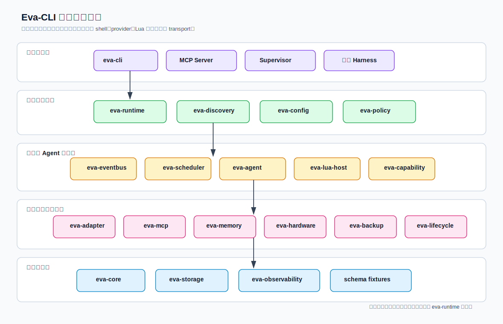
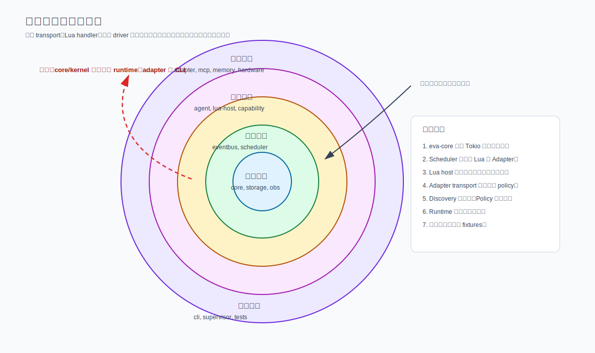
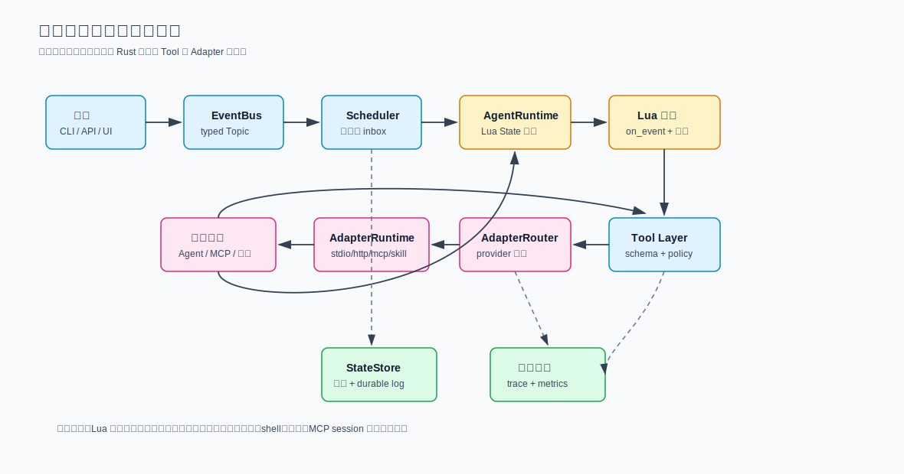

> Language: 简体中文
> Canonical source: ../en/module-partitioning.md
> Translation status: current

# Eva-CLI 模块划分方案

更新日期：2026-06-24

## 1. 文档定位

本文把现有 Eva-CLI 架构方案落成可执行实现前的模块划分方案。当前仓库仍以架构文档为主，`src/` 和 `crates/` 还没有实际 Rust 模块，所以本文描述的是目标 workspace、crate 边界、依赖方向、运行时交接点和分阶段落地顺序，而不是现有代码的反向说明。

总体约束沿用既有架构结论：

- Rust 负责运行时权威、权限、schema、沙箱、外部 I/O、恢复、审计和长期状态。
- Lua 负责可热更新的 Agent 业务逻辑、局部状态转换、工具编排和结果映射。
- EventBus 负责事件传播，不负责隐藏业务状态。
- Scheduler 负责 Topic 路由，不直接执行 Lua 或调用外部 provider。
- Adapter 负责外部能力接入，所有调用必须经过 manifest、schema、policy、timeout、audit 和 structured error。

## 2. 划分原则

- 先固化稳定契约，再扩展运行时能力。`Event`、`Topic`、`AgentInvokeRequest`、错误类型、权限模型等必须先进入基础 crate。
- 具体副作用必须藏在端口、Registry 和 Adapter 后面，不能被 Lua、Scheduler 或 domain types 直接调用。
- `eva-runtime` 是唯一组合根，负责把具体 EventBus、Scheduler、AgentRuntime、AdapterRegistry、MemoryService、MCP Server 等装配在一起。
- Discovery 只做发现、归一化和健康探测；Policy 才做授权；Adapter 才做执行。
- EventBus、Scheduler、AgentRuntime、Lua host、AdapterRegistry、MCP server 必须可以单独测试。
- 前期允许 crate 较薄，但依赖方向必须从第一天就正确，避免后续拆分时出现循环依赖。

## 3. 模块总览



推荐使用 Rust workspace 承载稳定边界。每个 crate 是一个可测试的职责域，crate 内部再使用 module 划分实现细节。第一阶段可以先实现核心闭环，其他 crate 保持薄壳或接口，但不要把所有逻辑塞进一个 `src/` 巨型模块后再拆。

## 4. 推荐目录结构

```text
Eva-CLI/
  Cargo.toml
  src/
    main.rs                 # 很薄的 binary shim，转交 eva-cli

  crates/
    eva-core/
      src/
        event.rs
        topic.rs
        ids.rs
        capability.rs
        invoke.rs
        error.rs
        lib.rs

    eva-config/
      src/
        eva_yaml.rs
        manifest/
        schema.rs
        lib.rs

    eva-policy/
      src/
        effective.rs
        permissions.rs
        sandbox.rs
        lib.rs

    eva-observability/
      src/
        trace.rs
        metrics.rs
        audit.rs
        lib.rs

    eva-storage/
      src/
        state_store.rs
        event_log.rs
        artifact_store.rs
        sqlite.rs
        lib.rs

    eva-eventbus/
      src/
        bus.rs
        in_memory.rs
        recoverable.rs
        dead_letter.rs
        lib.rs

    eva-scheduler/
      src/
        registry.rs
        routing.rs
        subscription.rs
        matcher.rs
        mailbox.rs
        lib.rs

    eva-agent/
      src/
        runtime.rs
        lifecycle.rs
        state.rs
        queue.rs
        lib.rs

    eva-lua-host/
      src/
        loader.rs
        sandbox.rs
        bindings.rs
        hot_reload.rs
        lib.rs

    eva-capability/
      src/
        registry.rs
        router.rs
        generation.rs
        host_api.rs
        lib.rs

    eva-adapter/
      src/
        manifest.rs
        registry.rs
        router.rs
        runtime.rs
        error.rs
        transports/
          builtin.rs
          stdio.rs
          http.rs
          eventbus.rs
          mcp.rs
          skill.rs
          hardware.rs
          lua_capability.rs
        lib.rs

    eva-mcp/
      src/
        client.rs
        server.rs
        tool_mapping.rs
        policy.rs
        schema.rs
        lib.rs

    eva-discovery/
      src/
        service.rs
        scanner.rs
        normalizer.rs
        health.rs
        cache.rs
        sources/
          project_agents.rs
          project_adapters.rs
          codex.rs
          omx.rs
          path_commands.rs
          mcp.rs
        lib.rs

    eva-memory/
      src/
        memory_service.rs
        knowledge_service.rs
        context_builder.rs
        lib.rs

    eva-hardware/
      src/
        discovery.rs
        registry.rs
        driver.rs
        hotplug.rs
        state.rs
        lib.rs

    eva-backup/
      src/
        backup_service.rs
        migration_package.rs
        release_snapshot.rs
        manifest_verifier.rs
        lib.rs

    eva-lifecycle/
      src/
        supervisor.rs
        generation.rs
        drain.rs
        rollback.rs
        lib.rs

    eva-runtime/
      src/
        builder.rs
        runtime.rs
        services.rs
        shutdown.rs
        lib.rs

    eva-cli/
      src/
        run.rs
        emit.rs
        inspect.rs
        agent.rs
        adapter.rs
        capability.rs
        lib.rs
```

## 5. Crate 职责边界

| Crate | 负责 | 不负责 |
| --- | --- | --- |
| `eva-core` | 纯数据契约：`Event`、`Topic`、ID、capability 名称、invoke request/response、结构化错误 | Tokio 任务装配、文件系统访问、provider 私有逻辑 |
| `eva-config` | `eva.yaml`、manifest、schema 加载、配置归一化 | 权限决策、运行时 mutation |
| `eva-policy` | effective permissions、sandbox 规则、request 级权限收紧 | Discovery 扫描、具体 I/O |
| `eva-observability` | trace 字段、metrics 标签、audit sink trait | 业务路由或权限决策 |
| `eva-storage` | StateStore、Durable Event Log、ArtifactStore 接口与本地实现 | Agent 业务逻辑 |
| `eva-eventbus` | 事件发布、可恢复日志集成、死信路径 | Agent Topic 订阅匹配 |
| `eva-scheduler` | Topic matcher、订阅表、Agent mailbox 投递 | Lua 执行、Adapter 调用 |
| `eva-agent` | Agent 生命周期、私有队列、事件处理边界 | Lua 沙箱内部、外部 provider transport |
| `eva-lua-host` | Lua State 加载、沙箱、host binding、热更新 | 权限放大、直接 shell/network/file 访问 |
| `eva-capability` | Capability registry、generation swap、host API trait | provider 或硬件 driver 的具体实现 |
| `eva-adapter` | Adapter manifest、Registry、Router、transport runtime | Discovery 扫描、全局业务状态 |
| `eva-mcp` | MCP client/server 协议、tool mapping、MCP policy helper | 不受控地代理内部 Topic |
| `eva-discovery` | 受信来源扫描、归一化、健康探测、cache | 最终执行授权 |
| `eva-memory` | Agent 私有记忆、系统总记忆库、知识库、上下文构建 | EventBus 存储语义 |
| `eva-hardware` | 设备发现、driver binding、热插拔状态、HardwareAdapter | Lua raw I/O 访问 |
| `eva-backup` | 备份、迁移包、release snapshot、artifact 校验 | 由 Agent 直接执行 restore 或 rollback mutation |
| `eva-lifecycle` | Supervisor、runtime generation、drain、rollback | Lua 业务决策 |
| `eva-runtime` | 组合根、服务装配、启动和关闭 | 被下层 crate 依赖的基础契约 |
| `eva-cli` | CLI 命令解析和用户入口 | 核心运行时所有权 |

## 6. 依赖方向



允许的依赖方向如下：

```text
eva-cli / eva-supervisor / test harness
  -> eva-runtime
  -> eva-discovery / eva-adapter / eva-mcp / eva-memory / eva-hardware / eva-backup / eva-lifecycle
  -> eva-agent / eva-lua-host / eva-capability
  -> eva-eventbus / eva-scheduler
  -> eva-core / eva-config / eva-policy / eva-storage / eva-observability
```

关键限制：

- `eva-core` 不得依赖 runtime、adapter、Lua、MCP 或 CLI crate。
- `eva-scheduler` 不得导入 `eva-lua-host` 或 `eva-adapter`。Scheduler 只负责把事件投递到已注册 mailbox。
- `eva-lua-host` 只能调用 host API trait，不直接调用文件、网络、shell、MCP 或硬件实现。
- `eva-adapter` 不能改写权限，只能接收 effective policy 并执行约束。
- `eva-discovery` 不能授予执行权，只能返回 discovered candidate 和 rejected reason。
- `eva-runtime` 可以依赖几乎所有 crate，因为它是组合根；下层 crate 不允许反向依赖 `eva-runtime`。

## 7. 运行时交接链路



主调用链保持如下形态：

```text
Ingress
  -> EventBus
  -> Scheduler
  -> AgentRuntime
  -> Lua on_event
  -> Rust Tool Layer / Capability Host API
  -> AdapterRouter 或 Runtime Service
  -> AdapterRuntime / MemoryService / HardwareService / MCP Server
  -> structured response 或 emitted Topic
```

交接规则：

- Ingress 只构造已校验的事件或命令请求。
- EventBus 只发布事件和恢复元数据，不决定哪个 Agent 执行业务逻辑。
- Scheduler 按 `target`、精确 Topic、通配 Topic 和显式 routing rule 投递。
- AgentRuntime 拥有一个 Agent queue、一个 Lua State generation 和一个 timeout 边界。
- Lua 可以转换数据、维护 Agent 局部状态、发布 Topic、请求受控工具。
- Tool Layer 统一校验 schema、policy、timeout、audit 字段和 cancellation。
- AdapterRouter 按显式 provider 或 capability index 选择 provider。
- 具体 transport 只能在授权之后处理 provider 协议细节。

## 8. 第一阶段可执行闭环

不要一开始同时实现所有模块。第一阶段应该证明最小闭环：

```text
eva emit /input/user
  -> EventBus
  -> Scheduler
  -> EchoAgent Lua on_event
  -> ctx.emit("/agent/reply")
  -> inspect trace by correlation_id
```

这个闭环需要的最少模块：

- `eva-core`：`Event`、`Topic`、`TopicPattern`、ID、结构化错误。
- `eva-eventbus`：进程内 EventBus、死信通道。
- `eva-scheduler`：Topic matcher、Agent registry、mailbox 投递。
- `eva-agent`：AgentRuntime、bounded queue、timeout。
- `eva-lua-host`：受限 Lua State、`on_event`、`ctx.emit`。
- `eva-observability`：correlation、causation、trace 字段。
- `eva-runtime`：装配上述模块。
- `eva-cli`：`run`、`emit`、`inspect`。

此阶段不需要真实 Codex/Claude/MCP/hardware 接入。Adapter 可以先使用 mock 或 `BuiltinAdapter`，等事件闭环稳定后再扩展。

## 9. 分阶段落地顺序

### 阶段 0：Workspace 与契约

- 创建 Cargo workspace。
- 创建 `eva-core`、`eva-config`、`eva-policy`、`eva-observability` 的最小 crate。
- 固化 `Event`、`Topic`、`TopicPattern`、`AgentInvokeRequest`、`AgentInvokeResponse`、`AdapterError`。
- 为 Topic parser 和 Topic matcher 写测试，禁止 `starts_with` 式误匹配。

验收：

- `/sys/*` 不匹配 `/sys/route-a/route-aa`。
- `/sys/**` 匹配 `/sys/route-a` 和 `/sys/route-a/route-aa`。
- Event JSON 结构稳定，错误结构稳定。

### 阶段 1：EventBus + Scheduler + Agent 闭环

- 实现进程内 EventBus。
- 实现 Scheduler 的 Agent registry、subscription table、mailbox 投递。
- 实现 AgentRuntime 的 bounded queue、timeout、dead letter。
- 不引入外部 provider。

验收：

- CLI 可以发布 `/input/user`。
- 至少两个 Agent 可独立接收事件。
- target 直接路由优先于 Topic fan-out。
- 队列满、Agent 不在线、无命中目标进入死信。

### 阶段 2：Lua Host 与热更新

- 实现 Lua sandbox。
- 暴露最小 host API：`ctx.emit`、`ctx.log`、`ctx.now`。
- 禁用 `os`、`io`、`debug`、任意 `require`。
- 实现 generation swap：新 Lua State 先 health check，再切换，失败保留旧版本。

验收：

- Lua 可处理事件并 emit 新 Topic。
- Lua 不能访问 shell、文件系统、网络、环境变量。
- 新脚本编译失败时旧版本继续服务。
- trace 记录 `script_version` 和 `generation`。

### 阶段 3：Adapter Registry 与受控外部能力

- 实现 Adapter manifest。
- 实现 AdapterRegistry、AdapterRouter、structured errors。
- 先实现 `BuiltinAdapter` 和 mock `StdioAdapter`。
- `StdioAdapter` 必须使用 argv 数组模型，禁止 Lua 拼接 shell 字符串。

验收：

- Lua 只能传 `capability`、`provider`、`payload`、`timeout_ms`。
- Lua 不能传 command、env、skill path。
- Adapter timeout、cancel、unhealthy、permission denied 均有结构化错误。
- provider 缺失时按 capability index 选择候选 Adapter。

### 阶段 4：Discovery 与配置体系

- 扫描项目内 `config/agents/**/agent.yaml`。
- 扫描项目内 `config/adapters/*.yaml`。
- 归一化为 discovered candidate。
- 无效 manifest 不 panic，只记录 rejected reason。
- Discovery cache 写入本地状态目录。

验收：

- Discovery 不执行被扫描脚本。
- Discovery 不读取密钥。
- Unknown trust level 默认只展示，不注册执行。
- 只有 schema + policy + health check 通过后才注册。

### 阶段 5：持久化与恢复

- 引入 Durable Event Log / WAL / Spool。
- 引入 StateStore。
- 支持 ack / watermark / replay。
- 死信可 inspect 和重放。

验收：

- accepted 事件先写 durable log。
- Runtime 重启后可以按 watermark 重放未 ack 事件。
- Agent 侧使用 event id 去重。
- 外部副作用使用 idempotency key。

### 阶段 6：MCP、Memory、Hardware、Backup、Lifecycle

- MCP 在 Adapter 闭环稳定后接入。
- MemoryService 和 KnowledgeService 在 StateStore 稳定后接入。
- HardwareAdapter 在 policy、audit、generation 语义稳定后接入。
- Backup/Migration/ReleaseSnapshot 在 ArtifactStore 和 audit 稳定后接入。
- Supervisor 和 runtime generation 在基础恢复语义稳定后接入。

验收：

- MCP tool/resource/prompt 均经过 allowlist 和 schema。
- Memory/Knowledge 只能通过受控 API 使用。
- Hardware raw I/O 不暴露给 Lua。
- restore、rollback、release pointer mutation 只能由 Runtime service 执行。

## 10. 测试策略

- `eva-core`：Topic parser、Topic matcher、Event 序列化、错误 JSON shape。
- `eva-policy`：权限收紧、权限放大拒绝、sandbox 默认拒绝。
- `eva-eventbus`：publish/subscribe、accepted 前 durable write、replay、dead-letter write。
- `eva-scheduler`：target 优先级、精确 Topic、`*`、`**`、禁止字符串前缀误匹配、队列满行为。
- `eva-agent`：timeout、cancel、幂等保护、局部状态版本。
- `eva-lua-host`：危险库禁用、host API allowlist、output schema 拒绝、generation rollback。
- `eva-adapter`：provider 选择、不健康过滤、timeout、cancel、结构化错误映射、argv-safe stdio execution。
- `eva-discovery`：受信来源扫描、无效 manifest 拒绝、扫描时不执行脚本、cache 读写。
- `eva-runtime`：端到端 `/input/user -> /agent/reply` 和 `/adapter/invoke -> /adapter/completed`。

## 11. 横切规则

### 11.1 错误模型

所有跨模块错误必须结构化，禁止只传字符串：

```text
kind
message
retryable
provider_code?
correlation_id?
causation_id?
```

模块内可以使用具体错误类型，但跨 crate API 需要稳定枚举或稳定 JSON 形态。

### 11.2 权限模型

权限只能逐层收紧：

```text
system policy
  -> manifest permissions
  -> user/session policy
  -> request constraints
  -> effective permissions
```

任何 crate 发现权限需要扩大时，只能返回拒绝原因，不能自行放宽。

### 11.3 状态归属

- Agent 局部状态归 `eva-agent` 和 Lua generation。
- 业务持久状态归 `eva-storage` / `eva-memory`。
- 事件恢复状态归 `eva-eventbus`。
- Adapter 运行状态归 `eva-adapter`。
- Runtime generation 状态归 `eva-lifecycle`。

禁止使用隐式全局可变状态跨模块共享上下文。

### 11.4 观测字段

所有关键路径必须带：

```text
event_id
request_id
topic
agent_id
adapter_id
capability
provider
correlation_id
causation_id
subscription_pattern
generation
script_version
latency_ms
error_kind
```

## 12. 验收标准

模块划分可进入实现的标准：

- 每个 crate 有简短 `README.md` 或 `lib.rs` 模块注释，说明负责与不负责。
- `eva-runtime` 以下的 crate 不反向导入 `eva-runtime`。
- `eva-core`、`eva-eventbus`、`eva-scheduler`、`eva-agent`、`eva-lua-host`、`eva-adapter` 都能不启动完整 CLI 单测。
- Lua 不能直接访问 shell、文件系统、网络、环境变量、MCP session 或设备句柄。
- 每个可执行 capability 都有 manifest、schema、policy、version、owner、audit identity 和结构化错误。
- 第一阶段能证明本地最小闭环：

```text
eva emit /input/user
  -> EventBus
  -> Scheduler
  -> EchoAgent Lua on_event
  -> ctx.emit("/agent/reply")
  -> inspect trace by correlation_id
```

## 13. 风险与规避

| 风险 | 规避 |
| --- | --- |
| 还没有行为就拆太多 crate | 保留目标边界，但按端到端薄切片实现 |
| Scheduler 混入业务逻辑 | routing rule 数据化，业务判断放到 Agent |
| Lua host 变成隐藏系统 API | 只开放 typed host API，全部经过 manifest + policy |
| Adapter registry 变成任意插件系统 | 强制 manifest、schema、policy、health、audit 和 trust source |
| MCP 变成不受控代理 | tool/resource/prompt allowlist + per-client policy |
| Discovery 误授权 | discovered candidate 与 registered runtime handle 分离 |
| 持久化恢复语义后补导致返工 | 第一阶段就固定 event id、ack/watermark、dead-letter shape |
| 过早接入硬件导致边界失控 | 等 policy、audit、generation、driver binding 语义稳定后再接入 |

## 14. 总结

Eva-CLI 推荐的模块切法是：

```text
先契约
  -> 事件与路由内核
  -> 隔离的 Agent 与 Lua 执行
  -> 受控 capability 与 Adapter
  -> Discovery 与 Runtime services
  -> CLI、Supervisor 和运维工作流
```

这套划分能让项目先交付一个很小的可执行闭环，同时保留后续支持热更新、外部 Agent、MCP、记忆、硬件、备份、恢复和审计所需的系统边界。
